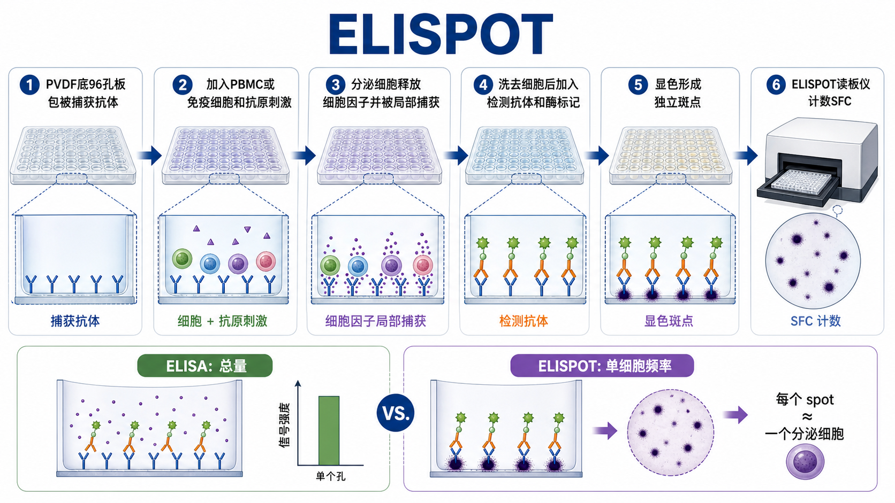

# ELISPOT

ELISPOT（enzyme-linked immunospot assay，酶联免疫斑点实验）是一种在单细胞水平检测 secreted analyte（分泌性分析物）的免疫实验，最常用于统计 cytokine-secreting cells（[细胞因子](../番外/补充知识/细胞因子.md)分泌细胞）的频率。它可以理解为 [夹心ELISA](夹心ELISA.md) 的“细胞版”：孔底先包被捕获抗体，活细胞在孔内受到刺激并分泌目标分子，目标分子在分泌细胞周围被局部捕获，最后形成一个个可计数的 spot（斑点）。



一句话理解：ELISA 看一个孔里目标分子的总量，ELISPOT 看一个孔里有多少个正在分泌目标分子的细胞；每个合格 spot 通常近似代表一个 secreting cell（分泌细胞）。

## 实验发明历史与背景

ELISPOT 属于 [ELISA](ELISA.md) 技术的延伸。传统 ELISA 主要检测上清、血清或裂解液中目标分子的浓度；ELISPOT 把捕获抗体固定在带膜的 96 孔板底部，让分泌性分子在离开细胞后立即被周围抗体捕获，因此能把“一个细胞在某段刺激时间内分泌过目标分子”转化成“膜上的一个局部斑点”。

R&D Systems 的 assay principle 页面将 ELISPOT 描述为使用 sandwich enzyme-linked immunosorbent assay（夹心酶联免疫吸附实验）技术：PVDF-backed microplate（PVDF 底微孔板）预包被目标分析物特异性抗体，刺激后的细胞分泌物被孔底抗体局部捕获，随后用 biotinylated detection antibody（生物素化检测抗体）、streptavidin-enzyme（链霉亲和素-酶）和沉淀型底物显色，形成可计数斑点。参考：[R&D Systems ELISpot Assay Principle](https://www.rndsystems.com/products/elispot/assay-principle)。

Mabtech 也把 ELISPOT 的核心优势总结为 single-cell level（单细胞水平）的分泌功能检测，尤其适合检测 rare antigen-specific T cells（稀有抗原特异性 T 细胞）或 B cell antibody-secreting cells（抗体分泌 B 细胞）。参考：[Mabtech ELISA versus ELISpot](https://www.mabtech.com/knowledge-hub/elisa-versus-elispot-which-assay-right-your-research)。

## 应用场景

- 疫苗研究中检测 antigen-specific T cell response（抗原特异性 T 细胞反应），常见指标包括 [IFN-γ](../番外/补充知识/IFN-γ.md)、[IL-2](<../材(实验耗材工具篇)/IL-2.md>)、TNF-alpha 等。
- 肿瘤免疫和免疫治疗研究中评估 T 细胞对 peptide pool（[肽库](<../材(实验耗材工具篇)/肽库.md>)）或肿瘤抗原的反应。
- 感染免疫、自身免疫或移植免疫中检测细胞因子分泌细胞频率。
- B cell ELISPOT 中检测 antigen-specific antibody-secreting cells（抗原特异性抗体分泌细胞）。
- PBMC（peripheral blood mononuclear cells，[外周血单个核细胞](../番外/补充知识/外周血单个核细胞.md)）样本的功能性免疫反应筛查。
- 作为 [流式细胞术](流式细胞术.md)、intracellular cytokine staining（[细胞内细胞因子染色](细胞内细胞因子染色.md)）或分泌因子 ELISA 的互补实验。

不适合的情况：

- 只关心上清中的总细胞因子浓度：优先考虑 ELISA、Luminex 或其他多重因子检测。
- 需要同时知道细胞表型和分泌功能：优先考虑细胞内细胞因子染色和流式细胞术。
- 细胞活率很差、细胞来源不稳定或样本处理时间差异很大：ELISPOT 结果会非常敏感。
- 目标分子不适合被局部捕获，或没有经过验证的 capture/detection antibody pair（捕获/检测抗体配对）。

## 实验目的

ELISPOT 的目的不是简单测“有没有某个细胞因子”，而是回答：

- 每 10^5 或 10^6 个细胞中，有多少个细胞对刺激产生目标分泌反应。
- 某个抗原、肽库、药物或处理条件是否诱导特异性免疫反应。
- 不同样本、不同时间点、不同处理组之间的 responding cell frequency（反应细胞频率）是否不同。
- 阳性对照能否证明细胞仍具备反应能力，阴性/未刺激对照能否反映背景分泌水平。
- 斑点数量、大小、强度和分布是否支持真实响应，而不是背景、污染或过度刺激。

## 简要实验原理

### ELISA 的夹心逻辑移到膜底

ELISPOT 依赖两种识别不同表位的抗体：

- capture antibody（[捕获抗体](<../材(实验耗材工具篇)/捕获抗体.md>)）：预先固定在孔底膜上。
- detection antibody（[检测抗体](<../材(实验耗材工具篇)/检测抗体.md>)）：在细胞培养结束后识别已被捕获的目标分子。

不同于普通 ELISA 中目标分子在整孔液体中均匀分布，ELISPOT 的分泌物被其来源细胞附近的捕获抗体迅速截留，因此形成局部足迹。这个“局部捕获”是 ELISPOT 能接近单细胞分辨率的关键。

### 活细胞刺激决定斑点来源

ELISPOT 需要把活细胞直接放入 [ELISPOT板](<../材(实验耗材工具篇)/ELISPOT板.md>) 中进行刺激。R&D Systems FAQ 明确提醒：细胞刺激必须在 ELISPOT plate 内完成；如果先在管中刺激，培养基里已分泌的细胞因子可能被带入孔内并造成高背景。参考：[R&D Systems ELISpot and FluoroSpot FAQ](https://www.rndsystems.com/resources/faqs/elispot-fluorospot-kits)。

常见刺激包括：

- 特异性抗原、肽库或重组蛋白。
- positive stimulation（阳性刺激），如 PMA（phorbol 12-myristate 13-acetate，[PMA](<../材(实验耗材工具篇)/PMA.md>)）联合 ionomycin（离子霉素，[Ionomycin](<../材(实验耗材工具篇)/Ionomycin.md>)）。
- 多克隆刺激物，如 PHA、anti-CD3/CD28 等，具体取决于细胞类型和研究问题。

### 显色斑点代表分泌细胞足迹

ELISPOT 常用 alkaline phosphatase（碱性磷酸酶，AP）或 horseradish peroxidase（辣根过氧化物酶，HRP）体系。AP 常配合 [BCIP-NBT](<../材(实验耗材工具篇)/BCIP-NBT.md>) 生成蓝黑色沉淀，HRP 可配合 AEC 或 TMB 类沉淀底物。沉淀产物留在分泌位置附近，形成可被 [ELISPOT读板仪](<../材(实验耗材工具篇)/ELISPOT读板仪.md>) 或显微镜计数的斑点。

R&D Systems 的 IFN-gamma ELISpot kit 说明中也强调，每个 spot 代表一个 human IFN-gamma-secreting cell（IFN-gamma 分泌细胞），结果可由自动 ELISPOT reader 或体视显微镜计数。参考：[R&D Systems Human IFN-gamma ELISpot Kit](https://www.rndsystems.com/products/human-ifn-gamma-elispot-kit_el285)。

### 读数是 SFC 而不是 OD

ELISPOT 的常见结果单位是 SFC（spot-forming cells，[斑点形成细胞](../番外/补充知识/斑点形成细胞.md)）或 SFU（spot-forming units，斑点形成单位），常归一化为 SFC/10^6 cells。它不是 [酶标仪](<../材(实验耗材工具篇)/酶标仪.md>) 读取的 OD 值，也不直接等于细胞因子浓度。

## 所需试剂、耗材和设备

| 类别 | 常用内容 | 作用 | 注意事项 |
|---|---|---|---|
| 细胞样本 | PBMC、T 细胞、B 细胞、脾细胞或其他免疫细胞 | 提供分泌反应来源 | 活率、冻存复苏状态和处理时间非常关键 |
| 板 | ELISPOT 96 孔 PVDF 膜底板 | 固定捕获抗体并形成斑点 | 膜很脆，洗板时不能刮伤 |
| 抗体 | 捕获抗体、检测抗体 | 形成夹心识别 | 需要 ELISPOT 验证过的配对抗体 |
| 显色体系 | Streptavidin-AP/HRP、BCIP/NBT、AEC/TMB | 生成沉淀斑点 | 底物反应时间影响斑点大小和背景 |
| 刺激物 | 肽库、抗原、PMA/Ionomycin、anti-CD3/CD28 | 诱导细胞分泌目标分子 | 特异刺激和阳性刺激要分开理解 |
| 培养体系 | RPMI 1640、血清或无血清培养基、抗生素、CO2 培养箱 | 维持细胞活性和分泌功能 | 培养基本身不能带入高背景 |
| 洗涤液 | PBS、PBST 或 kit wash buffer | 去除细胞和未结合试剂 | 洗涤过猛会损伤膜，过轻会高背景 |
| 读数 | ELISPOT reader、体视显微镜、分析软件 | 计数 spot | 读板参数应在同项目内保持一致 |
| 记录 | [板图](../番外/补充知识/板图.md)、细胞数、刺激物、读板参数 | 保证可追溯 | ELISPOT 不记录板图几乎无法复盘 |

## 实验设计

### 先确定 T cell ELISPOT 还是 B cell ELISPOT

| 类型 | 检测对象 | 板上包被内容 | 典型用途 |
|---|---|---|---|
| T cell ELISPOT | 分泌 IFN-gamma、IL-2、IL-4、IL-17、TNF-alpha 等细胞因子的 T 细胞 | 细胞因子捕获抗体 | 疫苗、感染、肿瘤免疫、细胞免疫反应 |
| B cell ELISPOT | 分泌抗体的 B 细胞或浆细胞 | 抗原或抗免疫球蛋白抗体 | 抗原特异性抗体分泌细胞、记忆 B 细胞反应 |
| [FluoroSpot](FluoroSpot.md) | 同一细胞分泌的一种或多种目标 | 荧光多重检测体系 | 同时检测多种细胞因子或多功能细胞 |

本页主要以 T cell cytokine ELISPOT 为主线。

### 细胞数量要先做梯度

ELISPOT 不是细胞越多越好。R&D Systems troubleshooting guide 提醒，如果细胞太多，斑点过密会难以计数；建议做细胞数梯度以找到能形成独立斑点的范围。参考：[R&D Systems Troubleshooting Guide: ELISpot](https://www.rndsystems.com/resources/technical/troubleshooting-guide-elispot)。

实用判断：

- 斑点太少：可能细胞数低、刺激弱、细胞活性差或目标反应稀有。
- 斑点太密：spots overlap（斑点重叠），无法准确计数。
- 斑点独立、清楚、可分辨：适合分析。

### 对照设计比单个处理孔更重要

| 对照 | 作用 | 结果解释 |
|---|---|---|
| Medium/background control（培养基背景对照） | 不加细胞或只加培养基 | 看板、抗体和底物背景 |
| Unstimulated control（未刺激对照） | 同样细胞数，不加特异刺激 | 判断基础分泌背景 |
| Positive control（阳性对照） | 强刺激或 kit 阳性对照 | 证明细胞和检测体系可工作 |
| Detection control（检测抗体对照） | 缺失检测抗体或替代 buffer | 判断检测体系背景 |
| Cell number series（细胞数梯度） | 找到可计数范围 | 避免过密或过稀 |
| Antigen specificity control（抗原特异性对照） | 无关肽库或无关抗原 | 区分特异反应和非特异活化 |

### 培养时间取决于目标分子

不同分析物的分泌动力学不同。Mabtech 的 step-by-step guide 提醒，不同 analyte（分析物）需要根据分泌 kinetics（动力学）选择细胞孵育时间；例如 IFN-gamma 可较早检测，而某些分子可能需要更长刺激。参考：[Mabtech Step-by-step guide to ELISpot](https://www.mabtech.com/knowledge-hub/step-step-guide-elispot)。

## 实验操作

下面是通用 chromogenic ELISPOT（显色 ELISPOT）流程。不同 kit 对包被浓度、孵育时间、洗涤次数、底物时间和读板条件有差异，正式实验以具体说明书为准。

### 包被捕获抗体

做法：

- 若使用预包被板，可跳过包被步骤，按 kit 说明直接进入封闭/加细胞。
- 若使用 development module，按推荐浓度稀释捕获抗体。
- 加入 ELISPOT 板每孔，覆盖膜底。
- 低温或室温按说明孵育，使捕获抗体结合到 PVDF 膜上。

为什么重要：

捕获抗体密度决定局部捕获效率。包被不足会导致分泌物扩散或信号弱；包被过量有时会增加背景和试剂消耗。

注意事项：

- PVDF 膜底板有时需要乙醇预润湿或按厂家说明活化。
- 不要让膜干燥。
- 同一项目内尽量使用同一板型和同一抗体批次。

### 封闭和平衡板

做法：

- 弃去包被液并温和洗板。
- 加入含蛋白的培养基或封闭液，封闭未占据结合位点。
- 孵育后弃去封闭液，准备加入细胞。

为什么重要：

封闭不足会导致检测抗体、细胞分泌物或培养基成分非特异吸附在膜上，造成 [背景信号](../番外/补充知识/背景信号.md)升高。

可能出错导致的结果：

- 孔底整片发色：封闭或洗涤不足。
- 孔间背景差异大：膜干燥、洗板不一致或边缘效应。

### 准备细胞和刺激物

做法：

- 新鲜或复苏 PBMC 先评估细胞数和活率，可结合 [细胞计数](细胞计数.md)。
- 根据实验问题准备特异抗原、肽库、未刺激对照和阳性刺激。
- 按板图加入相同细胞数，并设置重复孔。

为什么重要：

ELISPOT 的信号高度依赖活细胞功能。冻存 PBMC 复苏后状态差、死亡细胞多、红细胞污染或培养基不合适，都可能让阳性对照也失败。

注意事项：

- 尽量避免把细胞长时间放在室温。
- 复苏冻存 PBMC 后是否需要 resting（恢复培养）应根据样本和目标响应确定。
- 肽库溶剂，如 DMSO，所有处理孔应保持一致终浓度。

### 在 ELISPOT 板内刺激培养

做法：

- 将细胞和刺激物直接加入已包被/封闭的 ELISPOT 板。
- 放入湿润 37°C CO2 培养箱。
- 培养期间尽量避免移动板子。

为什么重要：

分泌物必须在孔内细胞周围被捕获。如果先在管中刺激，再转入 ELISPOT 板，已释放的细胞因子会变成整孔背景而不是局部斑点。

Mabtech 的 step-by-step guide 也提醒，培养期间尽量不要移动 ELISPOT 板，因为移动会影响 spot formation（斑点形成）。参考：[Mabtech Step-by-step guide to ELISpot](https://www.mabtech.com/knowledge-hub/step-step-guide-elispot)。

### 洗去细胞

做法：

- 培养结束后弃去细胞悬液。
- 用 PBS 或 wash buffer 温和洗涤多次，去除细胞和未结合分泌物。
- 避免枪头接触膜底。

为什么重要：

洗细胞是 ELISPOT 从“活细胞培养”切换到“免疫检测”的分界点。洗得不干净会高背景；洗得太粗暴会损伤膜、丢失局部沉积或造成孔底划痕。

注意事项：

- 不要让膜干。
- 多通道移液器洗板时动作要一致。
- 自动洗板机需确认参数适合膜底板，避免吸头刮膜。

### 加检测抗体和酶标记

做法：

- 加入检测抗体，孵育后洗涤。
- 加入 streptavidin-AP 或 streptavidin-HRP，孵育后洗涤。
- 若使用一步检测体系，则按说明加入酶标检测抗体。

为什么重要：

检测抗体必须识别与捕获抗体不同的表位。普通 ELISA 抗体对不一定适合 ELISPOT，因为 ELISPOT 对局部捕获、低背景和膜上显色要求更高。Mabtech 也提醒，高质量 matched antibody pairs（配对抗体）是 ELISPOT 成功的重要基础。参考：[Mabtech ELISpot guide](https://www.mabtech.com/knowledge-hub/step-step-guide-elispot)。

### 显色和终止

做法：

- 加入沉淀型底物，如 BCIP/NBT 或 AEC。
- 观察斑点逐渐形成。
- 达到合适斑点强度后按说明用水冲洗或终止反应。
- 让板完全干燥后再读板。

为什么重要：

显色不足会斑点浅、难识别；显色过度会背景升高、斑点变大并相互融合。R&D troubleshooting guide 也指出，PVDF 膜未完全干燥会影响斑点观察和计数，板需要干燥后再分析。参考：[R&D Systems Troubleshooting Guide: ELISpot](https://www.rndsystems.com/resources/technical/troubleshooting-guide-elispot)。

### 读板和计数

做法：

- 使用 ELISPOT 读板仪或体视显微镜拍摄每孔。
- 调整 size、intensity、sensitivity 等参数，但同一项目内应保持一致。
- 记录原始 spot count、背景孔 spot count 和归一化后的 SFC/10^6 cells。

为什么重要：

ELISPOT 读数不是完全自动真值。阈值设置会影响小斑点、弱斑点和背景点是否被计入。Mabtech 将 ELISPOT 读板参数类比为流式门控：参数应基于经验和对照设定，并在项目中保持一致。参考：[Mabtech Step-by-step guide to ELISpot](https://www.mabtech.com/knowledge-hub/step-step-guide-elispot)。

## 结果解析

### 理想结果

- 未刺激对照斑点少，背景稳定。
- 阳性对照斑点明显，证明细胞和检测系统有效。
- 特异抗原刺激孔斑点高于未刺激对照。
- 斑点清晰、边界可分辨、不过密。
- 细胞数梯度显示合理递增关系。
- 重复孔之间差异可接受。

### 常见读数方式

| 指标 | 含义 | 适用解释 |
|---|---|---|
| Raw spots | 原始斑点数 | 先看孔内是否可计数 |
| Background spots | 未刺激或培养基背景 | 判断基础分泌和非特异背景 |
| Net spots | 刺激孔减背景孔 | 常用于描述特异响应 |
| SFC/10^6 cells | 每百万细胞斑点形成细胞数 | 便于样本间比较 |
| Spot size/intensity | 斑点大小和强度 | 可反映分泌量趋势，但更难标准化 |

### 不能过度解释的地方

- 一个 spot 近似代表一个分泌细胞，但超强分泌、细胞移动、细胞团聚或斑点融合都会影响这个近似。
- Spot size 不一定直接等于单细胞分泌量，因为扩散、显色时间、抗体密度和读板参数都会影响斑点大小。
- 背景孔有少量 spots 并不罕见，不能机械地认为所有背景点都是失败；关键是统计设计和项目内一致性。
- ELISPOT 不能告诉你分泌细胞的表面 marker 组合，除非与分选、流式或其他方法结合。

## 异常结果与 troubleshooting

| 异常结果 | 可能原因 | 解决策略 |
|---|---|---|
| 阳性对照无斑点 | 细胞死亡；刺激物失活；检测体系失败；板包被失败 | 检查细胞活率；更换阳性刺激；确认抗体和底物；用 kit 阳性对照 |
| 未刺激孔背景高 | 细胞预激活；培养基或血清背景；先刺激后转板；洗涤不足 | 降低细胞压力；换培养基；必须在板内刺激；加强洗涤 |
| 斑点太密无法计数 | 细胞数过高；刺激过强；显色过久 | 做细胞数梯度；降低刺激浓度；缩短显色 |
| 斑点太少 | 细胞数过低；抗原不合适；刺激时间不合适；目标频率低 | 增加细胞数；优化肽库和剂量；调整孵育时间；提高重复数 |
| 孔底整片发色 | 封闭不足；底物过度显色；洗涤不充分 | 优化封闭；缩短显色；增加洗涤 |
| 孔间差异大 | 细胞混匀不足；边缘效应；移液误差；板移动 | 混匀细胞；避免边缘孔或统一边缘策略；使用多通道移液器 |
| 斑点形状异常 | 细胞团聚；膜损伤；培养期间移动板 | 过滤或轻柔吹匀细胞；避免刮膜；孵育期间不要移动 |
| 读板重复性差 | 阈值设置不同；板未完全干；灰尘或气泡 | 固定读板参数；干燥后读板；清理板底和成像区域 |

## ELISPOT vs ELISA vs FluoroSpot vs 流式细胞术

| 方法 | 核心读数 | 优点 | 局限 | 适合场景 |
|---|---|---|---|---|
| ELISPOT | 分泌细胞数，SFC/10^6 cells | 高灵敏，适合低频反应，接近单细胞功能读数 | 细胞表型信息少，依赖活细胞和读板仪 | 抗原特异性 T/B 细胞功能筛查 |
| ELISA | 上清或血清中目标浓度 | 定量成熟、便宜、设备普及 | 不知道哪些细胞在分泌 | 总细胞因子或蛋白浓度 |
| FluoroSpot | 多个分泌分子的单细胞斑点 | 可看多功能分泌细胞 | 设备和分析更复杂 | 多细胞因子、多功能免疫反应 |
| 流式细胞术 | 细胞表型和胞内/表面标志物 | 可同时看表型、频率和多指标 | 成本高，补偿和门控复杂 | 细胞群组成、功能表型联合分析 |

一个实用判断：如果问题是“有多少细胞对抗原有分泌反应”，ELISPOT 很合适；如果问题是“上清里总共有多少细胞因子”，用 ELISA；如果问题是“这些分泌细胞属于哪个亚群”，需要流式或分选后 ELISPOT。

## 购买和记录建议

- 初学或关键实验优先选 complete [ELISPOT试剂盒](<../材(实验耗材工具篇)/ELISPOT试剂盒.md>)，因为预包被板、检测抗体、酶标体系、阳性对照和 buffer 更完整。
- 需要自定义目标或降低成本时可选择 development module，但要优化捕获抗体、检测抗体、包被、底物和板型。
- 常见厂商包括 R&D Systems、Mabtech、BD Biosciences、Cellular Technology Limited（CTL）、U-CyTech、eBioscience/Thermo Fisher 等。记录时不要只写“ELISPOT kit”，要写检测目标、物种、板型、显色体系、货号和批号。
- 如果没有 ELISPOT reader，可用体视显微镜初步计数，但项目级数据最好使用读板仪并固定参数。
- 人源 PBMC 应按潜在感染性样本处理，并遵守实验室生物安全要求。

## 推荐记录模板

### 中文记录模板

```text
实验日期：
实验目的：
检测目标：IFN-gamma / IL-2 / 其他
细胞来源：
细胞处理：新鲜 / 冻存复苏 / resting 时间
细胞活率：
每孔细胞数：
板型和厂家：
捕获抗体或试剂盒名称：
厂家、货号、批号：
刺激物名称：
刺激物浓度：
DMSO 或溶剂终浓度：
阴性/未刺激对照：
阳性对照：
培养时间：
检测抗体：
酶标体系：AP / HRP
底物：
显色时间：
读板仪型号：
读板参数：
原始 spot count：
背景 spot count：
归一化单位：SFC/10^6 cells
异常情况和处理：
```

### English record template

```text
Date:
Experimental aim:
Target analyte: IFN-gamma / IL-2 / other
Cell source:
Cell handling: fresh / thawed / resting time
Cell viability:
Cells per well:
Plate type and manufacturer:
Capture antibody or kit name:
Manufacturer, catalog number, lot number:
Stimulus:
Stimulus concentration:
Final DMSO or solvent concentration:
Negative/unstimulated control:
Positive control:
Incubation time:
Detection antibody:
Enzyme system: AP / HRP
Substrate:
Development time:
Reader model:
Reader settings:
Raw spot count:
Background spot count:
Normalized unit: SFC/10^6 cells
Issues and actions:
```

## 小结

ELISPOT 的关键价值是把“分泌反应”拉回到单细胞频率层面。它比 ELISA 更适合看抗原特异性免疫细胞频率，但也比普通 ELISA 更依赖细胞状态、刺激条件、板内培养、洗板手法和读板参数。可靠的 ELISPOT 结果不是只看某孔 spots 很多，而是要同时看未刺激背景、阳性对照、细胞数梯度、重复孔一致性、斑点是否独立可计数，以及 SFC/10^6 cells 的归一化方式是否合理。

## 参考来源

- R&D Systems. ELISpot Assay Principle. https://www.rndsystems.com/products/elispot/assay-principle
- R&D Systems. Human IFN-gamma ELISpot Kit. https://www.rndsystems.com/products/human-ifn-gamma-elispot-kit_el285
- R&D Systems. Troubleshooting Guide: ELISpot. https://www.rndsystems.com/resources/technical/troubleshooting-guide-elispot
- R&D Systems. Help & FAQs: ELISpot and FluoroSpot Kits. https://www.rndsystems.com/resources/faqs/elispot-fluorospot-kits
- Mabtech. Step-by-step guide to ELISpot. https://www.mabtech.com/knowledge-hub/step-step-guide-elispot
- Mabtech. ELISA versus ELISpot: Which assay is right for your research? https://www.mabtech.com/knowledge-hub/elisa-versus-elispot-which-assay-right-your-research
- BD Biosciences. BD ELISPOT HRP Streptavidin for ELISPOT. https://www.bdbiosciences.com/en-au/products/reagents/immunoassay-reagents/elispot/HRP-Streptavidin-for-ELISPOT.557630
