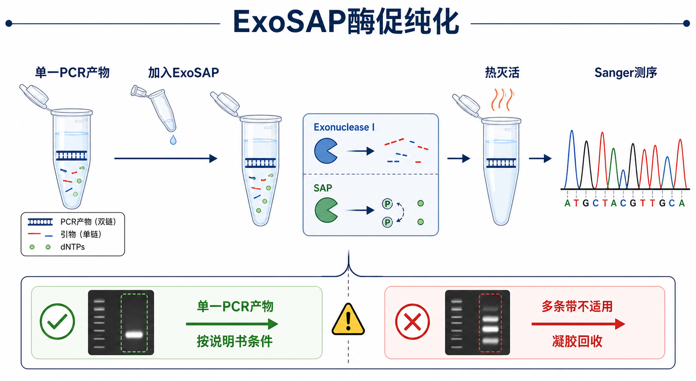

# ExoSAP酶促纯化

ExoSAP enzymatic cleanup（ExoSAP 酶促纯化/酶促 PCR cleanup）是用 Exonuclease I（[核酸外切酶I](<../材(实验耗材工具篇)/核酸外切酶I.md>)）和 shrimp alkaline phosphatase（SAP，[虾碱性磷酸酶](<../材(实验耗材工具篇)/虾碱性磷酸酶.md>)）处理 [PCR](PCR.md) 反应液，降解残余引物并灭活残余 [dNTP](<../材(实验耗材工具篇)/dNTP.md>) 的方法。它最常用于单一 PCR 产物的 [Sanger测序](Sanger测序.md) 前处理。



一句话理解：ExoSAP 不是把 DNA 从体系里“提取出来”，而是在同一管里把影响 Sanger 测序的单链引物和 dNTP 处理掉；如果 PCR 有多条双链条带，它不能替你选择正确片段。

## 实验发明历史与背景

PCR 反应结束后，体系里通常同时存在目标 amplicon（扩增产物）、残余 primer（引物）、dNTP、DNA polymerase（DNA 聚合酶）、盐和缓冲液。传统做法可以用 [PCR产物纯化](PCR产物纯化.md)、[凝胶回收](凝胶回收.md) 或 [乙醇沉淀](../番外/补充知识/乙醇沉淀.md) 处理这些残留物，但这些方法会带来柱/磁珠损失、转管污染或操作时间增加。

ExoSAP 类方法的思路更简单：如果 PCR 产物已经是单一、正确大小的 double-stranded DNA（[双链DNA](../番外/补充知识/双链DNA.md)），就不必把它从体系里提出来；只需要用酶把干扰测序的 single-stranded DNA（[单链DNA](../番外/补充知识/单链DNA.md)）引物和游离 dNTP 处理掉，然后 heat inactivation（[酶热灭活](../番外/补充知识/酶热灭活.md)）即可。

[Thermo Fisher Scientific](<../番外/试剂厂商/Thermo Fisher Scientific.md>) 的 [ExoSAP-IT](<../材(实验耗材工具篇)/ExoSAP-IT.md>) PCR Product Cleanup Reagent 官方资料将其描述为由 Exonuclease I 和 Shrimp Alkaline Phosphatase 组成、用于 PCR 产物测序前 cleanup 的试剂；[Cytiva](../番外/试剂厂商/Cytiva.md) 的 ExoProStar 也属于同类“exonuclease + alkaline phosphatase”酶促 PCR/sequencing cleanup 逻辑。参考：[Thermo Fisher ExoSAP-IT PCR Product Cleanup Reagent](https://www.thermofisher.com/order/catalog/product/78200)、[Cytiva ExoProStar](https://www.cytiva.com/en/us/shop/genomic-reagents-and-kits/pcr-reagents-and-kits/pcr-clean-up/exoprostar-1-step-p-05520)。

## 应用场景

- 单一 PCR 产物进行 Sanger 测序前处理。
- PCR 产物浓度较低，不希望经历柱纯化或磁珠纯化造成损失。
- 多样本测序前快速 cleanup，尤其适合 96 孔板式样本处理。
- 不需要换 buffer、不需要浓缩 DNA、也不需要去除双链非特异条带的场景。

不适合的情况：

- PCR 有明显多条带：ExoSAP 不能去除错误大小的双链 PCR 产物，应先凝胶回收或重新优化 PCR。
- 有明显 [引物二聚体](../番外/补充知识/引物二聚体.md) 且大小较大：Exonuclease I 主要处理单链引物，已经形成双链结构的 primer dimer 不一定能被有效去除。
- 下游是 [限制性内切酶酶切](限制性内切酶酶切.md)、[连接反应](连接反应.md)、[Gibson组装](Gibson组装.md) 或 [测序文库构建](测序文库构建.md)：通常更需要换 buffer、去盐或精确定量，柱纯化/磁珠纯化更稳。
- PCR 体系含强 [PCR抑制物](../番外/补充知识/PCR抑制物.md)、高盐或特殊添加剂：酶促 cleanup 不一定能改善下游反应。

## 实验目的

ExoSAP 酶促纯化的目标很窄，但非常实用：

- 降解残余 PCR 引物，减少 Sanger 测序中的背景峰和非特异起始。
- 去磷酸化残余 dNTP，减少测序反应中的游离核苷酸干扰。
- 保留目标双链 PCR 产物，避免柱纯化或磁珠纯化造成低量样本损失。
- 将 PCR 产物快速转入测序前可用状态。

它不能完成的事情也要明确：

- 不能选择正确大小的双链 DNA。
- 不能浓缩 DNA。
- 不能换 buffer。
- 不能去除盐、聚合酶、染料或大多数双链非特异产物。

## 简要实验原理

### Exonuclease I 的作用

Exonuclease I（核酸外切酶 I）可以从 single-stranded DNA 的 3' 端向 5' 端降解单链 DNA，因此可清除 PCR 反应中残余的单链引物。[NEB](../番外/试剂厂商/NEB.md) 的 Exonuclease I 产品资料也将其定义为作用于 single-stranded DNA、从 3' 到 5' 方向移除核苷酸的酶。参考：[NEB Exonuclease I](https://www.neb.com/en-us/products/m0293-exonuclease-i-e-coli)。

它对完整双链 PCR 产物的影响通常较小，所以单一目标扩增片段可以被保留。但如果样本中存在错误大小的双链扩增产物，Exonuclease I 不会选择性删除它们。

### SAP 的作用

Shrimp alkaline phosphatase（虾碱性磷酸酶，SAP）用于去除残余 dNTP 的磷酸基团，使这些游离 dNTP 不再作为测序反应中的有效底物。Thermo Fisher 的 ExoSAP-IT 说明将 SAP 与 Exonuclease I 共同用于 PCR 产物测序前处理。参考：[Thermo Fisher ExoSAP-IT PCR Product Cleanup Reagent](https://www.thermofisher.com/order/catalog/product/78200)。

### 热灭活

酶促处理完成后，需要按对应产品说明书进行热灭活。不同产品版本的孵育温度、孵育时间和灭活条件可能不同，例如 ExoSAP-IT、ExoSAP-IT Express、ExoProStar 或自配 Exonuclease I + SAP 组合不应混用同一套条件。图中不固定温度时间，就是为了避免把某一产品条件误写成通用 protocol。

## 所需试剂、耗材和设备

| 类别 | 常用内容 | 作用 | 注意事项 |
|---|---|---|---|
| 样本 | 单一、大小正确的 PCR 产物 | 被 cleanup 的测序模板 | 处理前最好先跑胶确认单一条带 |
| 酶促试剂 | ExoSAP-IT、ExoSAP-IT Express、ExoProStar 或 Exonuclease I + SAP 自配体系 | 清除引物和 dNTP | 不同产品条件不同，不要凭记忆套用 |
| 酶组分 | Exonuclease I、SAP | 降解单链引物、去磷酸化 dNTP | 避免反复冻融，按说明保存 |
| 设备 | [PCR仪](<../材(实验耗材工具篇)/PCR仪.md>)、金属浴或恒温模块 | 完成消化和热灭活 | 需要温控可靠 |
| 质控 | 琼脂糖凝胶、[微量紫外分光光度计](<../材(实验耗材工具篇)/微量紫外分光光度计.md>)、[Qubit荧光计](<../材(实验耗材工具篇)/Qubit荧光计.md>) | 判断 PCR 是否单一、估算模板浓度 | Sanger 通常更看重单一模板而非极高浓度 |
| 下游 | [测序引物](<../材(实验耗材工具篇)/测序引物.md>)、测序服务或测序反应体系 | 获得序列结果 | 测序引物应与 PCR 引物或内部引物设计匹配 |

## 实验设计

### 先决定是否真的适合 ExoSAP

| PCR 胶图 | 是否适合 ExoSAP | 更合适的处理 |
|---|---|---|
| 单一清晰目标条带 | 适合 | ExoSAP 后直接 Sanger |
| 单一目标条带 + 极弱小 primer dimer | 可能适合 | 视测序要求，可 ExoSAP 或柱纯化 |
| 多条明显双链条带 | 不适合 | 凝胶回收或优化 PCR |
| smear 明显 | 不适合 | 优化 PCR 条件、模板质量或退火温度 |
| 目标条带很弱 | 谨慎 | 可能先优化 PCR 或增加反应量 |

### ExoSAP vs 柱式 PCR 纯化 vs 磁珠纯化

| 方法 | 核心作用 | 优点 | 局限 | 最适合 |
|---|---|---|---|---|
| ExoSAP 酶促纯化 | 消化引物和 dNTP | 快、少损失、少转管 | 不去除双链杂带，不换 buffer | 单一 PCR 产物 Sanger |
| 柱式 PCR 纯化 | DNA 结合硅胶膜，洗涤洗脱 | 清除盐和酶，可换 buffer | 有回收损失，不能区分相近双链条带 | 克隆、酶切、Sanger |
| 磁珠纯化 | DNA 结合磁珠，可调片段保留范围 | 高通量、适合建库 | 比例敏感，操作细节影响大 | 建库、批量 cleanup |
| 凝胶回收 | 按大小切出目标条带 | 能去除错误大小片段 | 损失较大，耗时 | 多条带 PCR 或克隆前选择 |

### 测序前模板和引物设计

ExoSAP 只能改善 PCR 反应液的“干净程度”，不能修复测序设计问题。Sanger 测序前还需要确认：

- 测序引物只结合一个位置。
- PCR 产物长度适合 Sanger 读长。
- 模板浓度在测序服务建议范围内。
- PCR 产物不是混合模板。
- 如果 PCR 引物本身容易形成二聚体，必要时改用内部测序引物。

## 实验操作

以下是通用框架，不替代具体产品说明书。

### 检查 PCR 产物

做法：

- 取少量 PCR 产物跑琼脂糖凝胶。
- 确认目标片段大小正确、条带单一。
- 记录胶图、样本编号和预计片段大小。

为什么重要：

ExoSAP 的前提是 PCR 产物本身已经正确。如果 PCR 有多条双链产物，酶促 cleanup 后它们仍会共同进入 Sanger 测序，造成 [测序峰图](../番外/补充知识/测序峰图.md) 多峰或杂峰。

可能出错导致的结果：

- 未跑胶直接 ExoSAP：测序失败后很难判断是 PCR 问题还是测序问题。
- 多条带仍然测序：峰图叠加，无法读出可靠序列。

### 加入 ExoSAP 试剂

做法：

- 将 PCR 产物短暂离心收集液体。
- 按试剂说明加入 ExoSAP 类 reagent 或自配 Exonuclease I + SAP 组合。
- 轻轻混匀，避免气泡和蒸发。

为什么重要：

酶量不足会导致引物和 dNTP 清除不完全；酶量过多或样本体积比例不合适可能影响后续测序体系。不同产品浓度不同，不能只记“加 1 uL”这种经验。

替代策略：

- 样本多时可在 PCR 板中直接处理，减少转管。
- 若 PCR 产物浓度很低，ExoSAP 比柱纯化更能保留模板量。
- 若下游需要换 buffer，改用柱式或磁珠纯化。

### 消化反应

做法：

- 按产品说明书设定消化温度和时间。
- 让 Exonuclease I 处理残余引物，让 SAP 处理 dNTP。
- 使用 PCR 仪时注意热盖设置，避免小体积蒸发。

为什么重要：

消化不足会留下残余引物，引起 Sanger 测序背景或非目标起始；dNTP 残留也可能干扰测序反应。

可能出错导致的结果：

- 消化时间不足：峰图背景高、前端杂峰。
- 体系蒸发：模板浓度和盐浓度异常，测序反应不稳定。

### 热灭活

做法：

- 消化后按产品说明书进行热灭活。
- 热灭活完成后短暂离心。
- 样本可直接用于 Sanger 测序或短期低温保存。

为什么重要：

热灭活的目的是终止 Exonuclease I 和 SAP 活性，避免它们继续影响后续反应。不同产品条件差异较大，尤其是“快速版”和常规版，不应混用。

注意事项：

- 不要把某个品牌或版本的灭活条件写进所有样本 SOP。
- 如果用自配酶组合，分别确认两个酶都已有效灭活。
- 热灭活后不要反复冻融测序模板。

### 进入 Sanger 测序

做法：

- 按测序服务或测序反应体系要求加入模板和测序引物。
- 记录模板来源、片段大小、引物名称、引物方向和处理方式。
- 测序结果出来后结合峰图质量判断 cleanup 是否合适。

为什么重要：

Sanger 失败不一定是 ExoSAP 失败。常见原因还包括模板混杂、引物设计不佳、模板过量或过低、GC-rich 区域、重复序列、二级结构等。

## 结果解析

### 理想结果

- PCR 胶图为单一目标条带。
- ExoSAP 后不需要明显浓度损失。
- Sanger 峰图主峰清晰、背景低。
- 前 20-40 bp 之后读长稳定，碱基判读可靠。

### 可能正常的现象

- ExoSAP 后 NanoDrop 读数变化不大：因为它不是提取法，不一定显著改变总体吸收读数。
- Qubit 浓度略低或变化不明显：目标双链 DNA 应主要保留。
- 测序前端几十 bp 质量较低：Sanger 常见，不一定是 cleanup 问题。

### 异常结果与可能原因

| 异常结果 | 可能原因 | 调整策略 |
|---|---|---|
| Sanger 峰图多峰 | PCR 多条双链产物；混合模板；引物结合多个位点 | 重新跑胶；凝胶回收目标条带；重新设计测序引物 |
| 峰图前端背景高 | 引物残留；ExoSAP 消化不足；模板/引物比例不合适 | 确认酶是否失活或过期；按说明延长/重做 cleanup；调整测序引物量 |
| 无信号或弱信号 | PCR 产物量太低；模板加入不足；测序引物错误 | Qubit 或胶图复核模板；确认引物序列和方向 |
| 读长短 | 模板质量差；GC-rich；重复序列；盐/添加剂干扰 | 优化 PCR；改用柱纯化换 buffer；设计内部引物 |
| ExoSAP 后下游酶切失败 | ExoSAP 不去盐不换 buffer；PCR buffer 抑制酶反应 | 改用柱式 PCR 纯化或磁珠纯化 |
| 重复样本表现不一致 | 小体积加样误差；PCR 板蒸发；酶反复冻融 | 使用 master mix；确认封板；分装保存酶 |

## 推荐记录模板

### 中文记录模板

```text
实验日期：
样本名称：
PCR 片段大小：
PCR 胶图结果：单一条带 / 多条带 / primer dimer / smear
ExoSAP 产品或酶组合：
厂家：
货号：
批号：
加入比例：
消化条件：
热灭活条件：
测序引物名称：
测序引物方向：Forward / Reverse / Internal
送样模板体积或浓度：
Sanger 峰图结果：
异常情况和处理：
```

### English record template

```text
Date:
Sample ID:
PCR amplicon size:
PCR gel result: single band / multiple bands / primer dimer / smear
ExoSAP product or enzyme mix:
Manufacturer:
Catalog number:
Lot number:
Input ratio:
Digestion condition:
Heat-inactivation condition:
Sequencing primer name:
Sequencing primer direction: Forward / Reverse / Internal
Template volume or concentration submitted:
Sanger chromatogram result:
Issues and actions:
```

## 小结

ExoSAP 酶促纯化是一种非常高效的 Sanger 测序前 PCR cleanup 方法，但它的适用边界很窄：必须是单一、正确的 PCR 产物。它清除的是单链引物和游离 dNTP，不是双链非特异条带，也不是盐、聚合酶和复杂抑制物。只要牢牢记住“单一条带才适合 ExoSAP，多条带去凝胶回收或重做 PCR”，这个方法就会非常顺手。

## 参考来源

- Thermo Fisher Scientific. ExoSAP-IT PCR Product Cleanup Reagent. https://www.thermofisher.com/order/catalog/product/78200
- Thermo Fisher Scientific. ExoSAP-IT Express PCR Product Cleanup Reagents. https://www.thermofisher.com/order/catalog/product/75001.200.UL
- NEB. Exonuclease I. https://www.neb.com/en-us/products/m0293-exonuclease-i-e-coli
- NEB. Shrimp Alkaline Phosphatase. https://www.neb.com/en-us/products/m0371-shrimp-alkaline-phosphatase-rsap
- Cytiva. ExoProStar. https://www.cytiva.com/en/us/shop/genomic-reagents-and-kits/pcr-reagents-and-kits/pcr-clean-up/exoprostar-1-step-p-05520
