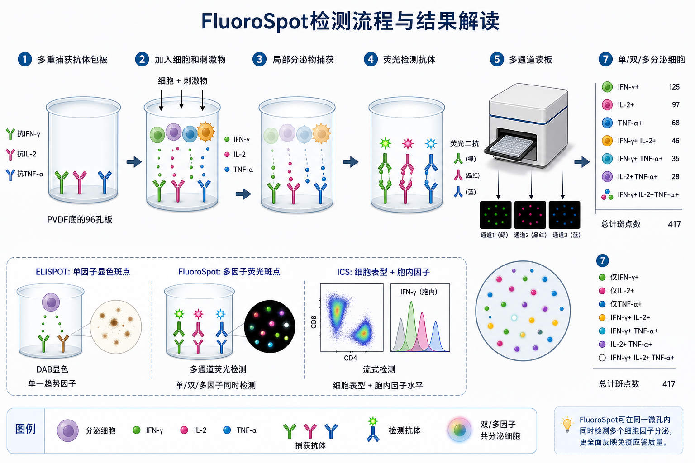
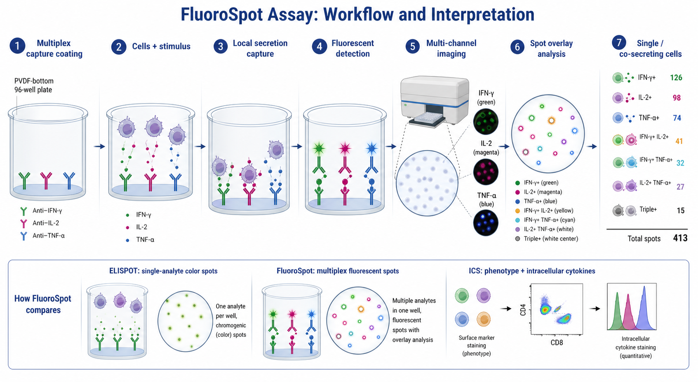

# FluoroSpot

FluoroSpot（fluorescent enzyme-linked immunospot assay，荧光酶联免疫斑点实验）是 [ELISPOT](ELISPOT.md) 的荧光多重版本：它在同一孔内捕获一个或多个 secreted analytes（分泌性分析物），再用不同荧光通道检测，从而统计单一细胞因子分泌细胞和 co-secreting cells（[共分泌细胞](../番外/补充知识/共分泌细胞.md)）。





一句话理解：ELISPOT 常看“一个因子有多少斑点”，FluoroSpot 看“同一个孔里多个因子分别有多少斑点，以及哪些斑点来自可能同时分泌多个因子的细胞”。

## 实验发明历史与背景

FluoroSpot 是 ELISPOT 的技术扩展。ELISPOT 通过沉淀型底物形成显色斑点，通常一次最适合检测一个 analyte；FluoroSpot 把显色检测换成 fluorescent detection（荧光检测），让不同目标分子对应不同荧光通道。Mabtech 将 FluoroSpot 描述为可在单细胞水平同时检测多种 cytokines（细胞因子）或其他分泌分子，并可分析细胞是否共分泌多个分析物。参考：[Mabtech Step-by-step guide to FluoroSpot](https://www.mabtech.com/knowledge-hub/step-step-guide-fluorospot)。

这个方法特别适合免疫学研究，因为免疫细胞功能常常不是“有或没有一个细胞因子”这么简单。例如疫苗或肿瘤免疫研究中，IFN-γ+、IL-2+、TNF-α+ 细胞比例不同，常对应不同功能状态；而同时产生多个细胞因子的 T 细胞常被视为更丰富的功能读数。相关概念可见 [多功能T细胞](../番外/补充知识/多功能T细胞.md)。

## 应用场景

- 检测 antigen-specific T cells（抗原特异性 T 细胞）对 [肽库](<../材(实验耗材工具篇)/肽库.md>)、抗原或疫苗刺激后的多细胞因子反应。
- 同时统计 [IFN-γ](../番外/补充知识/IFN-γ.md)、[IL-2](<../材(实验耗材工具篇)/IL-2.md>)、[TNF-α](../番外/补充知识/TNF-α.md)、IL-4、IL-5、IL-10、IL-17A 等分泌细胞。
- 比较 Th1/Th2/Th17、细胞毒性 T 细胞、记忆 T 细胞或 B cell antibody-secreting cells（抗体分泌 B 细胞）的功能差异。
- 在样本量有限时，用同一孔获得多种 analyte 信息，减少单独做多个 ELISPOT 的细胞消耗。
- 作为 [细胞内细胞因子染色](细胞内细胞因子染色.md)、ELISA 或多重因子检测的互补方法。

不适合的情况：

- 只关心某个细胞因子的上清浓度：优先考虑 ELISA 或多重因子检测。
- 需要同时知道细胞表面 phenotype（表型）：优先考虑细胞内细胞因子染色或分选后检测。
- 样本自发荧光很高、孔底荧光背景不可控或读板仪通道不匹配：FluoroSpot 读数会变得不可靠。
- 目标 analyte 之间分泌量差异极大，弱信号通道容易被强通道串扰或背景压住。

## 实验目的

FluoroSpot 主要回答：

- 某个刺激是否诱导一种或多种分泌分子。
- 每 10^5 或 10^6 个细胞中，有多少细胞分泌 IFN-γ、IL-2、TNF-α 等目标因子。
- 同一孔中是否存在双阳性或三阳性共分泌斑点。
- 多个 cytokine response pattern（细胞因子反应模式）是否支持某种免疫功能状态。
- 不同处理组、不同时间点或不同样本之间的多因子响应是否不同。

## 简要实验原理

### 多重捕获抗体固定在膜底

FluoroSpot 使用 [ELISPOT板](<../材(实验耗材工具篇)/ELISPOT板.md>) 或兼容的 PVDF-backed plate（PVDF 膜底板）。孔底预先包被一个或多个 capture antibodies（[捕获抗体](<../材(实验耗材工具篇)/捕获抗体.md>)）。活细胞受到刺激后释放目标分子，分泌物在来源细胞附近被捕获，形成局部“分泌足迹”。

和普通 ELISPOT 一样，局部捕获是单细胞分辨率的基础。不同的是，FluoroSpot 可以在同一孔里捕获多个 analytes。Mabtech 也强调，细胞刺激应在 FluoroSpot/ELISpot 板内完成，以免预先分泌到培养液中的 cytokines 被带入孔内并造成背景。参考：[Mabtech Step-by-step guide to FluoroSpot](https://www.mabtech.com/knowledge-hub/step-step-guide-fluorospot)。

### 荧光检测替代显色底物

普通 ELISPOT 常用 AP/HRP 和沉淀底物显色；FluoroSpot 使用 fluorescent detection antibodies（荧光检测抗体）、fluorophore-conjugated streptavidin（[荧光标记链霉亲和素](<../材(实验耗材工具篇)/荧光标记链霉亲和素.md>)）或其他荧光检测试剂。每个 analyte 对应一个荧光通道，读板仪分别拍摄各通道，再做 overlay analysis（[斑点叠加分析](../番外/补充知识/斑点叠加分析.md)）。

### 共分泌依赖斑点位置叠加

如果 IFN-γ 斑点和 IL-2 斑点在空间位置上高度重合，软件可能判定为 IFN-γ+ IL-2+ 共分泌细胞。这里的关键是“位置重合”，不是简单把整孔两个通道加起来。

但共分泌判断有边界：

- 细胞太密时，来自两个相邻细胞的斑点可能重叠，造成假双阳性。
- 斑点扩散太大时，中心判断变难。
- 一个 analyte 过强可能影响另一个 analyte 的捕获或检测，产生 capture effect（[捕获效应](../番外/补充知识/捕获效应.md)）。
- 荧光通道之间的 spillover（[荧光串色](../番外/补充知识/荧光串色.md)）会影响 overlay 结果。

R&D Systems 的 ELISpot/FluoroSpot FAQ 也提醒，FluoroSpot 适合同时检测多个 analytes，但不同 analyte 之间可能存在捕获效率差异或一方影响另一方捕获的情况，因此需要实验验证。参考：[R&D Systems ELISpot and FluoroSpot FAQ](https://www.rndsystems.com/resources/faqs/elispot-fluorospot-kits)。

### 读数是多通道 SFC 和共阳性组合

FluoroSpot 的常见读数包括：

- 每个 analyte 的 spot-forming cells（SFC，[斑点形成细胞](../番外/补充知识/斑点形成细胞.md)）。
- 每百万细胞中 IFN-γ+、IL-2+、TNF-α+ 等单阳性 SFC。
- IFN-γ+ IL-2+、IFN-γ+ TNF-α+、IL-2+ TNF-α+ 或三阳性 SFC。
- 背景扣除后的 net response。

它不直接等同于细胞因子浓度，也不能告诉你分泌细胞的表面 marker，除非结合分选或其他方法。

## 所需试剂、耗材和设备

| 类别 | 常用内容 | 作用 | 注意事项 |
|---|---|---|---|
| 细胞样本 | PBMC、T 细胞、B 细胞、脾细胞、免疫细胞共培养体系 | 提供分泌反应来源 | 活率、处理时间和冻存复苏状态很关键 |
| 板 | PVDF 膜底 96 孔 FluoroSpot/ELISPOT 板 | 固定捕获抗体并形成斑点 | 要选择低背景、低自发荧光板 |
| 捕获体系 | 多个匹配 capture antibodies | 捕获目标分泌物 | 不同抗体组合要验证兼容性 |
| 检测体系 | detection antibodies、荧光二抗、荧光链霉亲和素 | 多通道荧光读出 | 染料组合要匹配读板仪滤光片 |
| 刺激物 | 肽库、抗原、PMA/Ionomycin、anti-CD3/CD28 | 诱导细胞分泌 | 特异刺激和阳性刺激要分开解释 |
| 培养体系 | [RPMI 1640](<../材(实验耗材工具篇)/RPMI 1640.md>)、[FBS](<../材(实验耗材工具篇)/FBS.md>)、L-谷氨酰胺、HEPES 等 | 维持细胞状态 | 培养体系本身不能造成高背景 |
| 洗涤液 | PBS、kit wash buffer、含 Tween 的洗液 | 去除细胞和未结合试剂 | 洗板要温和，避免损伤膜 |
| 读板 | [FluoroSpot读板仪](<../材(实验耗材工具篇)/FluoroSpot读板仪.md>)、多通道成像软件 | 采集和叠加分析 | 通道、曝光、阈值、overlay 参数要记录 |
| 记录 | [板图](../番外/补充知识/板图.md)、细胞数、刺激物、通道设置 | 保证可追溯 | 多因子实验不记录参数很难复盘 |

## 实验设计

### 先决定检测几个 analytes

FluoroSpot 的诱惑是“越多越好”，但实际不是这样。多一个 analyte，就多一个捕获抗体、检测抗体、荧光通道、串色风险和分析参数。

实用建议：

- 初次实验先做 2-color FluoroSpot，例如 IFN-γ + IL-2 或 IFN-γ + TNF-α。
- 已验证体系稳定后再做 3-color 或更多。
- 弱信号 cytokine 应优先使用更亮、更低背景的通道。
- 同一项目内尽量固定板型、抗体组合和读板参数。

### 细胞数要优先优化

细胞数过少会漏掉低频反应；细胞数过多会造成斑点重叠，让共分泌判断失真。对于需要 overlay 的 FluoroSpot，细胞数通常比普通单色 ELISPOT 更需要谨慎优化。

判断标准：

- 单通道斑点清晰，中心可定位。
- 多通道 overlay 后可区分单阳性和共阳性。
- 未刺激孔背景低。
- 阳性刺激不应满孔融合成一片。

### 对照设计

| 对照 | 作用 | 结果解释 |
|---|---|---|
| Medium/background control | 判断板、抗体和荧光背景 | 没有细胞也高背景时，优先查试剂和板 |
| Unstimulated control | 判断基础分泌 | 用于背景扣除和特异性判断 |
| Positive control | 证明细胞和检测体系可工作 | 阳性失败时不能解释阴性结果 |
| Single-analyte controls | 验证每个 analyte 通道 | 判断单通道抗体和读板设置 |
| Fluorescence spillover controls | 判断通道串色 | 多通道实验尤其重要 |
| Cell number titration | 找到可计数范围 | 避免过密、过稀和假共阳性 |
| Irrelevant antigen control | 判断抗原特异性 | 区分特异响应和非特异活化 |

### 刺激时间取决于目标因子

不同 analyte 分泌动力学不同。IFN-γ 可能较早出现，IL-2、IL-4、IL-17A 或抗体分泌细胞检测可能需要不同时间。Mabtech 指出，incubation time（细胞孵育时间）要根据 analyte 的 secretion kinetics（分泌动力学）优化，不能所有目标照搬同一时间。参考：[Mabtech Step-by-step guide to FluoroSpot](https://www.mabtech.com/knowledge-hub/step-step-guide-fluorospot)。

## 实验操作

下面是通用 FluoroSpot 流程。不同 kit 对包被、封闭、细胞孵育、检测抗体和 enhancer 有具体要求，正式实验以说明书为准。

### 包被多重捕获抗体

做法：

- 若使用预包被 [FluoroSpot试剂盒](<../材(实验耗材工具篇)/FluoroSpot试剂盒.md>)，按说明直接进入封闭或加细胞。
- 若使用 development kit，按推荐浓度配制多个捕获抗体混合液。
- 加入膜底板，每孔覆盖完整膜面。
- 按说明室温或 4°C 孵育。

为什么重要：

捕获抗体决定每个 analyte 的局部捕获效率。多重包被时，抗体之间可能竞争膜面、改变构象或影响捕获效率，所以不能简单把多个单色 ELISPOT 条件相加。

注意事项：

- PVDF 膜如需乙醇预润湿，必须按厂家说明操作。
- 不要让膜干。
- 初次建立体系建议用厂家验证组合。

### 封闭和平衡板

做法：

- 弃去包被液，温和洗板。
- 加入含蛋白的培养基或封闭液。
- 孵育后弃去封闭液，保持孔底湿润。

为什么重要：

封闭不足会导致荧光背景升高。FluoroSpot 对背景比普通显色 ELISPOT 更敏感，因为自发荧光、未洗净荧光检测试剂和膜背景都可能影响读板。

可能出错导致的结果：

- 整孔荧光背景高。
- 某个通道背景明显高于其他通道。
- 空白孔也出现假 spot。

### 准备细胞和刺激物

做法：

- 评估细胞数和活率，可参考 [细胞计数](细胞计数.md)。
- 准备特异刺激、未刺激对照、阳性刺激和无关抗原对照。
- 按板图分配细胞和刺激物。

为什么重要：

FluoroSpot 的共分泌解释需要细胞状态稳定。细胞应激、冻存复苏不一致、死亡细胞多或刺激物批次不同，都会改变单阳性和共阳性比例。

注意事项：

- 肽库常用 DMSO 溶解，所有孔 DMSO 终浓度应一致。
- 刺激物不要先和细胞在管中预孵育到已经大量分泌后再转板。
- 样本间处理时间要尽量一致。

### 板内刺激培养

做法：

- 将细胞和刺激物加入已包被/封闭的 FluoroSpot 板。
- 37°C CO2 培养箱孵育。
- 培养期间尽量避免移动板。

为什么重要：

FluoroSpot 和 ELISPOT 一样，依赖局部分泌物在来源细胞周围被捕获。培养期间移动板会让细胞位置变化，斑点可能变大、变形或重叠，影响 overlay 判断。

### 洗去细胞

做法：

- 培养结束后弃去细胞悬液。
- 用 wash buffer 温和洗涤，去除细胞和游离分泌物。
- 不要让枪头刮到膜底。

为什么重要：

洗细胞不彻底会增加背景；洗得过猛会损伤膜或破坏局部信号。FluoroSpot 的荧光读数对膜面完整性非常敏感。

### 加入检测抗体和荧光检测试剂

做法：

- 加入对应 analyte 的检测抗体混合液。
- 洗涤后加入荧光二抗、streptavidin-fluorophore 或 enhancer 体系。
- 避光孵育。

为什么重要：

检测抗体要与捕获抗体识别不同表位，并且不同 analyte 的检测体系要互不干扰。Mabtech 的 FluoroSpot 指南强调，选择合适的 fluorophores（荧光基团）和 reader filters（读板滤光片）对获得清晰斑点很关键。参考：[Mabtech Step-by-step guide to FluoroSpot](https://www.mabtech.com/knowledge-hub/step-step-guide-fluorospot)。

注意事项：

- 全程避光，减少荧光淬灭。
- 洗涤要充分，避免游离荧光试剂残留。
- 不同厂商 enhancer 不要随意混用。

### 干燥和多通道读板

做法：

- 最后洗涤后按说明干燥板。
- 使用 FluoroSpot reader 分别采集各荧光通道。
- 固定曝光、阈值、spot size、intensity 和 overlay 参数。

为什么重要：

FluoroSpot 的最终读数由图像采集和软件分析共同决定。曝光过低会漏掉弱斑点；曝光过高会让斑点膨胀并影响共阳性判断。不同通道参数不统一，也会让组间比较失真。

### 斑点叠加和结果输出

做法：

- 分别确认每个通道 spot 是否真实、清晰、低背景。
- 再进行 overlay 分析，判断单阳性、双阳性和三阳性。
- 输出 raw spots、background spots、net spots、SFC/10^6 cells 和共分泌组合。

为什么重要：

共分泌结果不是肉眼看颜色混合，而是软件根据多通道斑点中心、大小和重叠规则判定。分析参数改变会影响 co-secreting cells 的数量。

## 结果解析

### 理想结果

- 未刺激孔每个通道背景都低。
- 阳性刺激孔每个目标通道都有清晰斑点。
- 特异刺激孔中某些 analyte 高于未刺激对照。
- 单通道斑点和 overlay 斑点中心清晰。
- 细胞数梯度能找到可计数范围。
- 重复孔之间一致。

### 常见读数方式

| 指标 | 含义 | 适合解释 |
|---|---|---|
| Raw spots | 每个通道原始斑点数 | 先看可计数性 |
| Background-subtracted spots | 刺激孔减背景孔 | 判断特异响应 |
| SFC/10^6 cells | 每百万细胞斑点形成细胞数 | 样本间比较 |
| Single-positive spots | 仅分泌一个 analyte 的斑点 | 看单因子反应 |
| Double-positive spots | 两个通道重合的斑点 | 看可能共分泌 |
| Triple-positive spots | 三个通道重合的斑点 | 看多功能反应 |
| Spot size/intensity | 斑点大小和强度 | 可作辅助信息，但标准化更难 |

### 不能过度解释的地方

- 共阳性斑点近似代表共分泌细胞，但细胞太密、斑点扩散和相邻细胞重叠都会影响判断。
- Spot intensity 不等于真实分泌量，因为抗体亲和力、检测通道、曝光、阈值和 enhancer 都会影响强度。
- FluoroSpot 不能直接告诉你分泌细胞是 CD4+、CD8+ 还是 NK cell，除非先分选或结合其他实验。
- 多通道结果不能只看总 spots，要看每个通道背景、串色和 overlay 参数。

## 异常结果与 troubleshooting

| 异常结果 | 可能原因 | 解决策略 |
|---|---|---|
| 所有通道背景高 | 封闭不足；洗涤不足；板自发荧光；游离荧光试剂残留 | 优化封闭；加强洗涤；换低背景板；降低检测试剂浓度 |
| 某一通道背景高 | 该通道抗体非特异结合；荧光串色；曝光过高 | 抗体滴定；检查单通道对照；调整曝光和滤光片 |
| 阳性对照无斑点 | 细胞状态差；刺激物失效；捕获/检测体系失败 | 检查细胞活率；更换刺激物；做单因子验证 |
| 斑点太密无法 overlay | 细胞数过高；刺激过强；培养时间过长 | 做细胞数梯度；降低刺激；缩短孵育 |
| 共阳性异常偏高 | 斑点重叠；通道串色；软件 overlay 参数过宽 | 降低细胞数；做串色对照；收紧 overlay 参数 |
| 共阳性异常偏低 | 弱通道漏检；捕获效应；曝光过低 | 增强弱通道；优化抗体组合；提高曝光但避免过曝 |
| 孔间差异大 | 细胞混匀不足；边缘效应；加样误差；培养期间移动板 | 混匀细胞；避免边缘孔或统一策略；固定加样节奏 |
| 斑点形状异常 | 膜损伤；细胞移动；洗板过猛；板干燥 | 避免刮膜；孵育期间不移动；温和洗板；保持膜湿润 |
| 读板重复性差 | 曝光/阈值不同；板未干；灰尘或液滴 | 固定读板参数；充分干燥；清洁板底 |

## FluoroSpot vs ELISPOT vs ICS vs 多重因子检测

| 方法 | 核心读数 | 优点 | 局限 | 最适合的问题 |
|---|---|---|---|---|
| FluoroSpot | 多 analyte SFC 和共分泌组合 | 同一孔多因子，能看共分泌模式 | 表型信息少，读板和 overlay 要求高 | 哪些细胞同时分泌哪些因子 |
| ELISPOT | 单 analyte SFC | 灵敏、稳定、解释直接 | 多因子能力弱 | 有多少细胞分泌某个目标分子 |
| [细胞内细胞因子染色](细胞内细胞因子染色.md) | 某细胞亚群内 cytokine+ 比例 | 同时看表型和功能 | 需要多色流式、补偿和门控 | 哪个细胞亚群产生哪些因子 |
| [多重因子检测](多重因子检测.md) | 上清中多因子浓度 | 一次测很多 analytes | 不知道来源细胞 | 上清或血清里每个因子有多少 |

一个实用判断：如果问题是“一个抗原刺激后，T 细胞群体是否出现 IFN-γ/IL-2/TNF-α 共分泌模式”，FluoroSpot 很合适；如果问题是“这些细胞到底是 CD4 还是 CD8”，需要 ICS 或分选后 FluoroSpot；如果问题是“上清里总浓度是多少”，用 ELISA 或多重因子检测。

## 购买和记录建议

- 初学优先选择 complete FluoroSpot kit，尤其是已验证的 2-color 或 3-color 组合。
- 记录时不要只写“FluoroSpot kit”，要写 analyte 组合、物种、板型、捕获/检测抗体、荧光通道、货号、批号和读板参数。
- 读板仪要确认支持所选 fluorophores 的 excitation/emission（激发/发射）通道。
- 若已有 ELISPOT reader，不代表一定能做 FluoroSpot；需要确认是否支持荧光多通道成像和 overlay 分析。
- 厂商可优先关注 Mabtech、R&D Systems/Bio-Techne、Cellular Technology Limited（CTL）、U-CyTech 等 FluoroSpot/ELISPOT 体系供应商。

## 推荐记录模板

### 中文记录模板

```text
实验日期：
实验目的：
检测目标组合：IFN-γ / IL-2 / TNF-α / 其他
细胞来源：
细胞处理：新鲜 / 冻存复苏 / resting 时间
细胞活率：
每孔细胞数：
板型和厂家：
试剂盒或抗体组合：
厂家、货号、批号：
捕获抗体组合：
检测抗体组合：
荧光通道：
刺激物名称：
刺激物浓度：
DMSO 或溶剂终浓度：
阴性/未刺激对照：
阳性对照：
培养时间：
洗涤 buffer：
读板仪型号：
曝光和阈值参数：
overlay 参数：
各通道 raw spot count：
背景 spot count：
单阳性 / 双阳性 / 三阳性结果：
归一化单位：SFC/10^6 cells
异常情况和处理：
```

### English record template

```text
Date:
Experimental aim:
Analyte combination: IFN-gamma / IL-2 / TNF-alpha / other
Cell source:
Cell handling: fresh / thawed / resting time
Cell viability:
Cells per well:
Plate type and manufacturer:
Kit or antibody combination:
Manufacturer, catalog number, lot number:
Capture antibody combination:
Detection antibody combination:
Fluorescence channels:
Stimulus:
Stimulus concentration:
Final DMSO or solvent concentration:
Negative/unstimulated control:
Positive control:
Incubation time:
Wash buffer:
Reader model:
Exposure and threshold settings:
Overlay settings:
Raw spot count for each channel:
Background spot count:
Single-positive / double-positive / triple-positive results:
Normalized unit: SFC/10^6 cells
Issues and actions:
```

## 小结

FluoroSpot 的核心价值是把 ELISPOT 的单细胞分泌频率扩展到多因子维度。它比普通 ELISPOT 信息更丰富，能分析 IFN-γ、IL-2、TNF-α 等分泌细胞及其共分泌组合；但它也更依赖抗体组合、荧光通道、低背景板、细胞数梯度、读板参数和 overlay 规则。可靠的 FluoroSpot 结果不是“颜色越多越好”，而是每个通道都低背景、清晰可计数，并且共阳性判断有足够对照支持。

## 参考来源

- Mabtech. Step-by-step guide to FluoroSpot. https://www.mabtech.com/knowledge-hub/step-step-guide-fluorospot
- Mabtech. ELISA versus ELISpot: Which assay is right for your research? https://www.mabtech.com/knowledge-hub/elisa-versus-elispot-which-assay-right-your-research
- R&D Systems. Help & FAQs: ELISpot and FluoroSpot Kits. https://www.rndsystems.com/resources/faqs/elispot-fluorospot-kits
