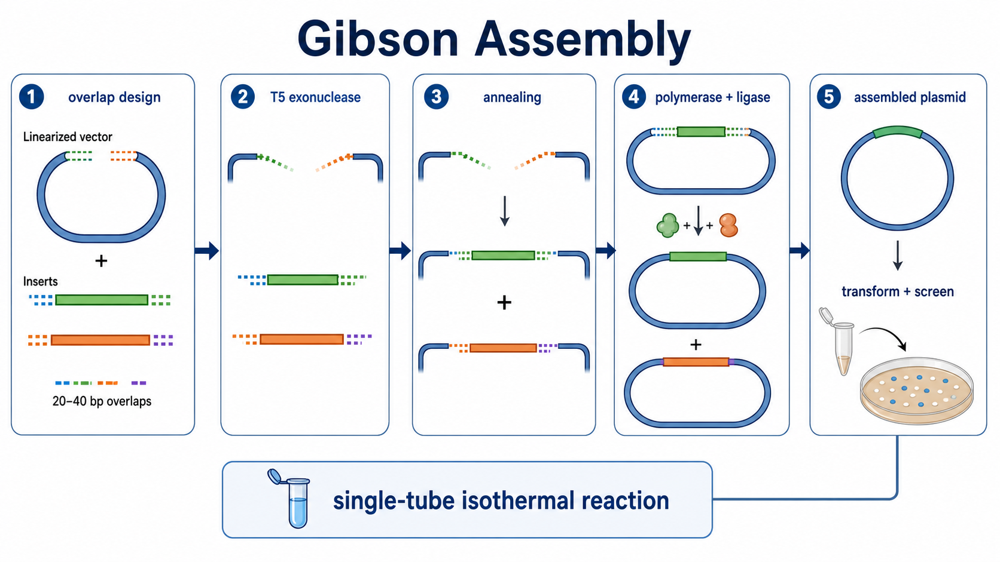
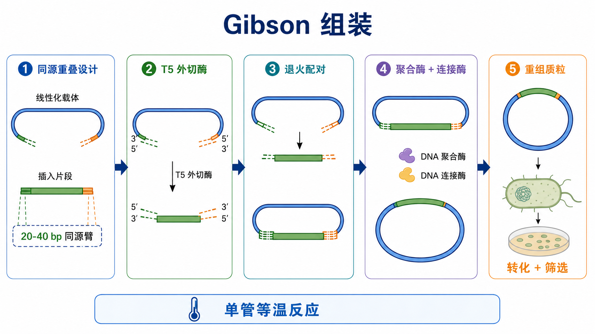

# Gibson组装

Gibson Assembly（Gibson 组装）是一种 seamless cloning（[无缝克隆](../番外/补充知识/无缝克隆.md)）方法：通过相邻 DNA 片段之间的 homologous overlap（同源重叠区，也常叫 [同源臂设计](../番外/补充知识/同源臂设计.md)），在一个等温反应中把线性化载体和插入片段组装成完整 DNA 分子。它常用于质粒构建、定点突变、多片段拼接和合成生物学构建。





一句话理解：Gibson 组装不是靠限制性酶切位点把 DNA “切出兼容末端”，而是靠 PCR 引物提前设计出的同源重叠端，让多个片段在同一管里自动配对、补平和连接。

## 实验发明历史与背景

Gibson 组装由 Daniel G. Gibson 等人在 J. Craig Venter Institute 发展并系统发表。2009 年 Nature Methods 论文提出了在单管等温条件下组装多个重叠 DNA 片段的策略；随后这种方法迅速进入质粒构建和合成生物学工作流。参考：[Gibson et al., Nature Methods 2009](https://pubmed.ncbi.nlm.nih.gov/19363495/)。

传统 restriction enzyme cloning（限制性内切酶克隆）依赖载体和插入片段上的特定酶切位点，常会遇到无合适位点、位点在基因内部、连接后留下 scar（疤痕序列）或多片段连接效率低的问题。Gibson 组装的核心改进是：只要相邻片段两端有足够的同源重叠序列，就可以不依赖天然酶切位点进行 scarless cloning（无疤痕克隆）。

[NEB](../番外/试剂厂商/NEB.md) 的 Gibson Assembly Cloning Kit 页面把该方法概括为 multiple overlapping DNA fragments（多个重叠 DNA 片段）在 single-tube isothermal reaction（单管等温反应）中完成组装，反应中包含 exonuclease、polymerase 和 DNA ligase 三类酶活性。参考：[NEB Gibson Assembly Cloning Kit](https://www.neb.com/en-us/products/e5510-gibson-assembly-cloning-kit)。

## 应用场景

- 插入一个 PCR 扩增片段到表达载体、报告载体或突变载体中。
- 多片段组装，例如启动子、开放阅读框、标签、连接肽和载体骨架一次性拼接。
- 定点突变、片段替换、标签融合、启动子替换或删除某一段序列。
- 当载体没有合适限制性酶切位点，或想避免额外 scar 序列时。
- 构建较复杂的合成生物学模块，例如多个调控元件或编码元件的模块化组装。

不适合或需要谨慎的情况：

- 同源臂设计不明确、载体序列不确定，或者没有可靠测序结果。
- 片段很多、片段很长、GC 极端或重复序列很多，组装效率会明显下降。
- 目标构建对阅读框、标签位置、启动子方向极度敏感，但设计没有做 junction 检查。
- 只需要简单单片段克隆且已有合适酶切位点时，传统 [限制性内切酶酶切](限制性内切酶酶切.md) + [连接反应](连接反应.md) 可能更便宜、更直观。

## 实验目的

Gibson 组装的实验目的不是“把 DNA 随便接起来”，而是精准构建一个设计好的 DNA 分子：

- 将 linearized vector（线性化载体）与 insert fragment（插入片段）按预定接合位点拼接。
- 让接合位点不留下额外酶切位点或 scar 序列。
- 支持两个或多个片段在同一反应中按顺序拼接。
- 通过后续 [细菌转化](细菌转化.md)、[菌落PCR](菌落PCR.md)、[质粒提取](质粒提取.md) 和 [Sanger测序](Sanger测序.md) 获得正确克隆。

## 简要实验原理

### 同源重叠决定拼接顺序

每个相邻 DNA 片段的末端被设计成含有相同或互补的 overlap region（同源重叠区）。通常这个重叠区由 PCR 引物的 5' 端附加序列提供，而引物 3' 端仍然负责退火扩增目标片段。

实操上常用 15-40 bp 左右的重叠区；复杂、多片段或长片段组装时常倾向于更长、更稳的重叠设计。Addgene 的 Gibson Assembly protocol 举例说明，可以用较长引物让一部分序列匹配相邻片段、一部分序列退火到目标模板，并提醒避免同源区强二级结构。参考：[Addgene Gibson Assembly Protocol](https://www.addgene.org/protocols/gibson-assembly/)。

### 三类酶活性协同工作

[Gibson组装预混液](<../材(实验耗材工具篇)/Gibson组装预混液.md>) 通常包含三类关键酶活性：

| 酶活性 | 英文 | 中文作用 | 结果 |
|---|---|---|---|
| [T5 DNA外切酶](<../材(实验耗材工具篇)/T5 DNA外切酶.md>) | T5 exonuclease | 从 DNA 末端咬切，产生单链突出端 | 暴露同源重叠区 |
| [DNA聚合酶](<../材(实验耗材工具篇)/DNA聚合酶.md>) | DNA polymerase | 在片段退火后补平缺口 | 恢复双链 DNA |
| [DNA连接酶](<../材(实验耗材工具篇)/DNA连接酶.md>) | DNA ligase | 封闭 DNA backbone 上的 nick | 形成完整闭合分子 |

这三步在同一管中连续发生。NEB 的产品说明也强调：exonuclease 产生单链 3' overhang，polymerase 填补缺口，DNA ligase 封闭 nick，最终形成可用于转化或后续应用的双链 DNA 分子。参考：[NEB Gibson Assembly Cloning Kit](https://www.neb.com/en-us/products/e5510-gibson-assembly-cloning-kit)。

### 转化效率是最终瓶颈

Gibson 反应完成并不等于实验成功。真正能被观察到的是转化后长出的菌落。组装产物量、构建大小、盐和反应组分残留、感受态细胞质量、抗生素平板状态都会影响 colony number（菌落数）。对于长片段、多片段或低丰度产物，high-efficiency competent cells（高效 [感受态细胞](<../材(实验耗材工具篇)/感受态细胞.md>)）非常关键。

## 所需试剂、耗材和设备

| 类别 | 常用内容 | 作用 | 注意事项 |
|---|---|---|---|
| DNA 片段 | 线性化载体、PCR 插入片段 | 组装底物 | 序列、方向和末端 overlap 必须正确 |
| 引物 | [PCR引物](<../材(实验耗材工具篇)/PCR引物.md>) | 扩增片段并添加同源重叠区 | 引物越长越要检查退火区 Tm、二聚体和发夹 |
| PCR 酶 | [高保真DNA聚合酶](<../材(实验耗材工具篇)/高保真DNA聚合酶.md>) | 减少扩增突变 | 不建议用普通 Taq 扩增最终构建片段 |
| 纯化试剂 | [PCR产物纯化](PCR产物纯化.md) kit 或 [凝胶回收](凝胶回收.md) kit | 去除引物、盐、非特异条带 | 多条带时优先凝胶回收 |
| Gibson 反应 | Gibson 组装预混液 | 提供外切酶、聚合酶和连接酶活性 | 避免反复冻融，按厂家保存 |
| 转化体系 | 化学感受态或 [电感受态细胞](<../材(实验耗材工具篇)/电感受态细胞.md>)、[SOC培养基](<../材(实验耗材工具篇)/SOC培养基.md>) | 将组装产物导入细菌 | 复杂构建优先高效感受态 |
| 筛选体系 | [LB培养基](<../材(实验耗材工具篇)/LB培养基.md>) 平板、[筛选抗生素](<../材(实验耗材工具篇)/筛选抗生素.md>) | 筛选携带质粒的菌落 | 抗生素必须匹配载体抗性 |
| 验证 | 菌落 PCR、质粒小提、Sanger 测序 | 判断构建是否正确 | 仅菌落 PCR 不能替代接合位点测序 |

## 实验设计

### 先确认最终质粒结构

设计前应先在 SnapGene、Benchling 或其他序列软件里确认最终 plasmid map（质粒图谱）：启动子、插入片段、标签、抗性、复制起点、阅读框、终止子和测序引物位置都要清楚。

为什么重要：

- Gibson 组装的失败常常不是反应失败，而是设计阶段把方向、阅读框或接合位点做错。
- 如果插入片段含有重复序列、强二级结构或内部启动子，后续转化和稳定性也可能受影响。
- 对蛋白表达构建，要确认 [开放阅读框](../番外/补充知识/开放阅读框.md) 是否连续，标签是否在正确端，是否多出 stop codon。

### 设计同源臂

常见策略是让每个相邻片段末端含有 15-40 bp 同源重叠区。重叠区通常放在 PCR 引物 5' 端；引物 3' 端仍然与模板退火并负责扩增。

关键原则：

- 每个接合位点只对应一个相邻片段，避免多个片段共享相似 overlap。
- overlap 区尽量避免长同聚碱基、极高或极低 GC、强发夹和重复序列。
- 多片段组装时，各 junction 的 overlap 强度应尽量均衡。
- 如果要保持蛋白阅读框，junction 必须按密码子边界检查。

### 准备线性化载体

载体可以通过限制性酶切或 PCR 线性化获得：

| 线性化方式 | 优点 | 局限 | 适合场景 |
|---|---|---|---|
| 限制性酶切 | 便宜、突变风险低、背景容易判断 | 依赖合适酶切位点 | 载体已有合适位点 |
| 反向 PCR 线性化 | 不依赖酶切位点，接合位置灵活 | 需要高保真 PCR，模板质粒背景要处理 | 插入、替换、点突变或无合适位点 |
| 合成线性片段 | 设计自由度高 | 成本高，对长度有限制 | 小片段模块或商业合成构建 |

PCR 线性化载体后要特别注意 template plasmid（模板质粒）残留。若原模板与目标载体抗性相同，残留模板会造成大量假阳性菌落。

### 判断是否需要纯化

NEB 的使用说明提到，当 PCR 产物总体积占 Gibson 反应体积比例较低时，未纯化 PCR 产物有时也可直接用于组装；但对于三片段以上、较大片段或 PCR 体系带入较多时，PCR 产物纯化可显著改善组装和转化表现。参考：[NEB Gibson Assembly Cloning Kit usage notes](https://www.neb.com/en-us/products/e5510-gibson-assembly-cloning-kit)。

实用判断：

- 单一条带、片段短、体系带入少：可尝试 PCR cleanup 或少量未纯化样本。
- 多条带、有 primer dimer 或非特异扩增：先凝胶回收。
- 组装片段多或目标构建大：尽量纯化并准确定量。
- 用于电转化：反应盐分和体积更敏感，应按厂家建议稀释或纯化。

### 设置片段摩尔比

Gibson 组装看的是分子数量，不是单纯质量。相同 ng 数下，小片段分子数远多于大片段。因此组装前应按 fragment length（片段长度）换算 molar amount（摩尔量），并参考 [插入片段与载体摩尔比](../番外/补充知识/插入片段与载体摩尔比.md)。

常用思路：

- 单插入片段：插入片段通常略高于载体。
- 多片段组装：各片段尽量接近等摩尔。
- 载体过量：容易出现空载体背景或错误组装。
- 插入片段过量太多：可能增加非特异组装或抑制转化。

## 实验操作

下面是通用思路，不替代具体商品说明书。不同 Gibson mix、NEBuilder HiFi、In-Fusion 或国产同类试剂的温度、时间、推荐 DNA 投入量和片段数范围可能不同。

### 设计和检查序列

做法：

- 在序列软件中建立最终质粒图谱。
- 标出每个 junction（[载体-插入片段接合位点](../番外/补充知识/载体-插入片段接合位点.md)）。
- 设计带 overlap 的引物。
- 检查阅读框、标签、启动子方向、终止密码子和测序引物位置。

为什么重要：

Gibson 组装的逻辑高度依赖设计。只要 overlap 设计错，后面所有实验步骤都可能“技术上成功”，但得到的是错误构建。

注意事项：

- 插入 ORF 前后若有标签，必须逐碱基检查 reading frame。
- 对表达载体，确认 Kozak sequence、信号肽、标签和 stop codon 是否符合表达需求。
- 对突变构建，确认引物是否只引入目标突变，没有额外错配。

### 扩增载体和插入片段

做法：

- 使用高保真 DNA 聚合酶扩增插入片段。
- 载体可酶切线性化，也可反向 PCR 线性化。
- PCR 后取少量跑胶确认大小、单一性和产量。

为什么重要：

Gibson 组装会把你提供的片段直接拼接进去。PCR 产物里的突变、非特异条带、模板残留和 primer dimer 都可能进入最终结果。

可能出错导致的结果：

- 普通 Taq 扩增：突变风险升高。
- 多条带直接组装：错误克隆比例升高。
- 载体 PCR 后模板未处理：大量空载体或亲本质粒背景。

替代策略：

- 如果插入片段很短，可考虑合成双链片段。
- 如果载体很大且 PCR 困难，可优先选择限制性酶切线性化。
- 如果只是点突变，也可以考虑专门的定点突变 kit。

### 纯化和定量 DNA 片段

做法：

- 单一正确 PCR 产物可用 PCR 产物纯化。
- 多条带或需要尺寸选择时用凝胶回收。
- 纯化后用 [Qubit荧光计](<../材(实验耗材工具篇)/Qubit荧光计.md>) 或其他方法定量。
- 必要时再次跑胶确认片段大小和完整性。

为什么重要：

片段浓度不准确会导致摩尔比错误。NanoDrop 容易受引物、dNTP 和盐污染影响，在低浓度 DNA 或 PCR cleanup 后不一定可靠。

注意事项：

- 低量片段优先用荧光法定量。
- 凝胶回收会降低回收率，尽量减少 UV 暴露。
- 如果洗脱液含 EDTA，可能影响某些下游酶反应；多数情况下低 EDTA 或水更稳。

### 配制 Gibson 反应

做法：

- 在冰上解冻 Gibson mix，轻柔混匀并短暂离心。
- 按厂家推荐加入线性化载体和插入片段。
- 控制总 DNA 量、片段摩尔比和最终反应体积。
- 加入 nuclease-free water（[无核酸酶水](<../材(实验耗材工具篇)/无核酸酶水.md>)）补足体积。

为什么重要：

Gibson mix 里的酶活性对冻融、温度和反应条件敏感。DNA 过少会没有菌落，DNA 过多或盐分过高会抑制反应和转化。

注意事项：

- 不要反复冻融 master mix，可小量分装。
- 多片段组装尽量让每个片段摩尔量接近。
- 如果用未纯化 PCR 产物，不要让 PCR buffer 带入比例过高。
- 设置 positive control（阳性对照）和 vector-only control（空载体对照）能快速定位问题。

### 等温孵育

做法：

- 将反应放入 PCR 仪或恒温金属浴。
- 按说明在推荐温度孵育，常见商品体系多在 50°C 附近反应。
- 片段少且短时反应时间可较短；多片段或长片段组装通常需要更充分孵育。

为什么重要：

等温阶段完成外切酶咬切、重叠端退火、聚合酶补平和连接酶封口。时间不足可能导致 nick 未完全封闭；时间过长或条件不适合也可能降低转化表现。

替代策略：

- 如果只有两片段简单克隆，可选择较短孵育。
- 如果多片段组装失败，可延长反应、增加 overlap 长度或减少片段数。
- 如果使用 NEBuilder HiFi 或 In-Fusion 类体系，以各自说明书为准，不要直接套用 Gibson 时间。

### 转化

做法：

- 将适量 Gibson 反应产物加入感受态细胞。
- 根据细胞类型进行 chemical transformation（化学转化）或 [细菌电转化](细菌电转化.md)。
- 复苏后涂布含对应抗生素的 LB 平板。

为什么重要：

Gibson 产物通常不是大量高度纯化质粒，转化效率会直接决定是否能看到菌落。复杂构建尤其依赖高效感受态细胞。

注意事项：

- 化学转化通常更耐盐；电转化对盐更敏感。
- 大质粒、多片段或低效率组装可以优先用电感受态细胞。
- 涂布时可做多个稀释或不同体积，避免菌落太少或太密。

### 克隆筛选和验证

做法：

- 第二天观察菌落数量、大小和背景。
- 挑取若干单克隆做菌落 PCR 或限制性酶切初筛。
- 对阳性克隆进行质粒小提。
- 用 Sanger 测序覆盖所有 junction、PCR 扩增区域和关键突变位点。

为什么重要：

Gibson 组装可能出现正确大小但局部错配、缺失、重复、方向错误或 PCR 引入突变。真正的最终确认必须靠测序。

注意事项：

- 菌落 PCR 只能判断大小，不能保证序列完全正确。
- 多片段组装建议每个 junction 都测序。
- 蛋白表达构建必须确认阅读框和标签连接处。

## 结果解析

### 理想结果

- 空载体对照菌落少，组装反应菌落明显更多。
- 菌落 PCR 显示目标大小条带。
- 小提质粒酶切图谱符合预期。
- Sanger 测序显示所有 junction 正确，无意外突变。

### 需要谨慎解读的结果

- 有很多菌落但菌落 PCR 阴性：可能是亲本质粒、空载体自连或抗生素平板问题。
- 菌落 PCR 条带大小正确但测序错误：可能是局部缺失、重复或 PCR 引入突变。
- 空载体对照也很多菌落：载体线性化不完全、模板质粒残留或 [载体自连](../番外/补充知识/载体自连.md)。
- 没有菌落但 positive control 正常：优先怀疑设计、片段质量、摩尔比或构建毒性。
- positive control 也失败：优先怀疑 Gibson mix、感受态细胞、复苏培养基或抗生素平板。

## 异常结果与 troubleshooting

| 异常结果 | 可能原因 | 解决策略 |
|---|---|---|
| 无菌落 | overlap 太短或设计错误；DNA 量过低；感受态效率差；抗生素错误 | 重新检查 junction；提高片段质量；换高效感受态；确认平板 |
| 菌落很少 | 片段多或构建大；摩尔比不合适；PCR buffer 带入多 | 纯化片段；优化摩尔比；减少片段数；使用电转 |
| 空载体背景高 | 载体未完全线性化；模板质粒残留；载体可自连 | 胶回收线性化载体；DpnI 处理 PCR 模板；设置空载体对照 |
| 菌落 PCR 多为错误大小 | 多条非特异片段参与组装；overlap 重复或相似 | 凝胶回收正确片段；重新设计唯一 overlap |
| 测序有突变 | PCR 扩增错误；引物合成错误；细菌中重排 | 用高保真酶；测多个克隆；必要时更换稳定菌株 |
| junction 缺失或重复 | overlap 区二级结构强；重复序列导致错配 | 增长或移动 overlap；避开重复序列 |
| 大片段构建失败 | 转化效率不足；质粒对宿主有毒；片段剪切或降解 | 使用高效电感受态；降低培养温度；更换低拷贝载体或稳定菌株 |

## Gibson组装 vs 限制性酶切连接 vs TA克隆

| 对比点 | Gibson组装 | 限制性酶切 + 连接 | TA克隆 |
|---|---|---|---|
| 是否依赖酶切位点 | 不依赖天然位点 | 依赖合适位点 | 不依赖，但依赖 A 尾 |
| 是否无疤痕 | 通常可以无疤痕 | 常留下酶切位点 | 通常会有载体特定位点 |
| 多片段能力 | 强 | 较弱 | 弱 |
| 设计难点 | overlap 和摩尔比 | 酶切位点和方向 | PCR 产物末端状态 |
| 成本 | mix 较贵 | 通常较便宜 | kit 成本中等 |
| 常见失败点 | 设计错误、转化效率、模板背景 | 酶切不完全、载体自连 | 插入方向不确定、背景 |
| 最适合 | 无缝、多片段、复杂构建 | 简单、已有位点、低成本克隆 | 快速克隆 Taq PCR 产物 |

## 购买建议

- 常规 Gibson 组装：NEB Gibson Assembly Master Mix 或 Gibson Assembly Cloning Kit 是经典选择，适合学习标准方法和建立实验室 SOP。
- 高保真、多片段或更复杂构建：NEBuilder HiFi DNA Assembly Master Mix 常作为升级选择；NEB 官方页面也明确提示它相对 Gibson Assembly 有若干优势。参考：[NEBuilder HiFi DNA Assembly Master Mix](https://www.neb.com/en-us/products/e2621-nebuilder-hifi-dna-assembly-master-mix)。
- 同类无缝克隆产品：[Takara](../番外/试剂厂商/Takara.md) In-Fusion、[Thermo Fisher Scientific](<../番外/试剂厂商/Thermo Fisher Scientific.md>) GeneArt、[Yeasen](../番外/试剂厂商/Yeasen.md)、[Vazyme](../番外/试剂厂商/Vazyme.md) 等也有类似产品。选择时应看支持片段数、overlap 长度、反应时间、最大构建大小、是否需要专用设计工具和本实验室已有成功经验。
- 记录时不要只写“Gibson mix”。建议记录品牌、公司、产品全名、货号、批号、保存温度、冻融次数、反应体积、DNA 投入量、片段摩尔比、反应时间、转化细胞批号和抗生素平板批次。

## 推荐记录模板

### 中文记录模板

```text
实验日期：
最终质粒名称：
载体名称和大小：
插入片段名称和大小：
片段数：
每个 junction 的 overlap 长度：
载体线性化方式：酶切 / PCR / 合成
插入片段来源：PCR / 合成 / 酶切
片段纯化方式：PCR纯化 / 凝胶回收 / 未纯化
DNA 定量方法：
载体投入量：
插入片段投入量：
摩尔比：
Gibson mix 产品名称：
厂家：
货号：
批号：
反应温度和时间：
转化细胞名称和批号：
转化方式：化学转化 / 电转化
抗生素平板：
菌落数量：
空载体对照结果：
菌落 PCR 结果：
小提和测序结果：
异常情况和处理：
```

### English record template

```text
Date:
Final plasmid name:
Vector name and size:
Insert fragment name(s) and size(s):
Number of fragments:
Overlap length at each junction:
Vector linearization method: restriction digestion / PCR / synthesis
Insert source: PCR / synthesis / digestion
Fragment cleanup method: PCR cleanup / gel extraction / unpurified
DNA quantification method:
Vector input:
Insert input:
Molar ratio:
Gibson mix product name:
Manufacturer:
Catalog number:
Lot number:
Reaction temperature and time:
Competent cell name and lot number:
Transformation method: chemical transformation / electroporation
Antibiotic plate:
Colony number:
Vector-only control:
Colony PCR result:
Miniprep and sequencing result:
Issues and actions:
```

## 小结

Gibson 组装的核心不是“买一个 mix 就能自动成功”，而是把正确的同源重叠区、干净的 DNA 片段、合适的摩尔比和高效转化串成一个连续 workflow。设计阶段决定方向和阅读框，片段制备阶段决定底物质量，Gibson 反应决定能否形成组装产物，转化和筛选决定能否拿到正确克隆。遇到失败时，不要只怪反应体系；应沿着“设计 - 片段 - 反应 - 转化 - 验证”逐层排查。

## 参考来源

- Gibson DG, Young L, Chuang RY, Venter JC, Hutchison CA, Smith HO. Enzymatic assembly of DNA molecules up to several hundred kilobases. Nature Methods. 2009. https://pubmed.ncbi.nlm.nih.gov/19363495/
- NEB. Gibson Assembly Cloning Kit. https://www.neb.com/en-us/products/e5510-gibson-assembly-cloning-kit
- NEB. Gibson Assembly Protocol (E5510). https://www.neb.com/protocols/gibson-assembly-protocol-e5510
- NEB. NEBuilder HiFi DNA Assembly Master Mix. https://www.neb.com/en-us/products/e2621-nebuilder-hifi-dna-assembly-master-mix
- Addgene. Gibson Assembly Protocol. https://www.addgene.org/protocols/gibson-assembly/
