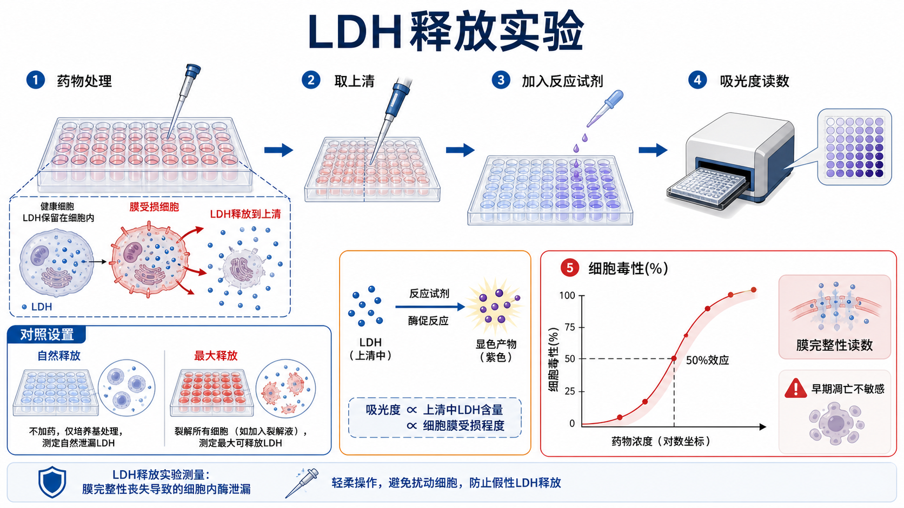

# LDH释放实验

LDH release assay（LDH 释放实验；乳酸脱氢酶释放实验）是一种通过检测培养上清中 [LDH](../番外/补充知识/LDH.md)（lactate dehydrogenase，乳酸脱氢酶）活性来评估细胞膜损伤和细胞毒性的实验。它属于 [细胞毒性检测](细胞毒性检测.md) 中偏 [膜完整性](../番外/补充知识/膜完整性.md) 的 readout。

一句话理解：LDH 释放实验问的是“细胞膜破到让胞质酶漏出来了吗”，而不是“细胞代谢还强不强”。



图：LDH 释放实验检测受损细胞释放到上清中的 LDH。关键点是取上清、设置自然释放和最大释放对照，并把 LDH 信号解释为膜完整性丧失，而不是早期凋亡的直接读数。

## 方法背景

LDH 是广泛存在于细胞质中的酶。细胞膜完整时，LDH 主要保留在细胞内；当细胞膜受损、坏死或晚期凋亡发生膜破裂时，LDH 会释放到培养上清。Thermo Fisher 的 Pierce LDH Cytotoxicity Assay Kit 和 Promega 的 CytoTox 96 都以 LDH release 作为细胞毒性读数。参考：[Thermo Fisher Pierce LDH](https://www.thermofisher.com/order/catalog/product/88953)、[Promega CytoTox 96](https://www.promega.com/products/cell-health-assays/cell-viability-and-cytotoxicity-assays/cytotox-96-non_radioactive-cytotoxicity-assay/)。

与 [MTT实验](MTT实验.md)、[CCK-8实验](CCK-8实验.md) 和 [ATP细胞活性检测](ATP细胞活性检测.md) 相比，LDH release 更接近“膜破损”这个细胞毒性事件。因此它常用于补充说明处理是否造成膜完整性丧失。

## 应用场景

| 场景 | 适合程度 | 说明 |
| --- | --- | --- |
| 药物细胞毒性评估 | 适合 | 尤其适合看膜破裂或坏死样毒性 |
| 材料浸提液毒性 | 适合 | 可作为细胞膜损伤 readout |
| 免疫细胞杀伤 | 很常用 | 靶细胞裂解会释放 LDH |
| 早期凋亡检测 | 不优先 | 早期凋亡膜仍完整，LDH 不一定升高 |
| 高通量筛选 | 可用 | 需要严格控制上清转移和背景 |
| 长期克隆能力 | 不适合 | 应用克隆形成实验 |

## 实验目的

LDH 释放实验主要用于：

- 判断处理是否导致细胞膜完整性丧失；
- 量化 relative cytotoxicity（相对细胞毒性）；
- 与 CCK-8/ATP assay 区分“代谢活性下降”和“膜破裂死亡”；
- 分析药物、材料、转染、病毒或免疫杀伤造成的细胞损伤；
- 为后续 Annexin V/PI、caspase、Western blot 或形态学观察提供补充证据。

## 简要实验原理

LDH 释放实验通常取培养上清，加入 LDH 反应体系，把 LDH 活性转化为颜色或荧光信号。很多比色体系最终在约 490 nm 附近读取吸光度，具体波长以试剂盒说明为准。

常见解释逻辑：

```text
More membrane damage -> more LDH in supernatant -> stronger LDH reaction signal
```

核心对照包括 spontaneous release（自然释放）和 maximum release（最大释放）。自然释放表示未处理或低损伤条件下的背景 LDH；最大释放通常通过裂解细胞得到，用于估算总可释放 LDH。

## LDH vs ATP/CCK-8/MTT

| 比较点 | LDH释放实验 | ATP细胞活性检测 | CCK-8/MTT |
| --- | --- | --- | --- |
| 核心读数 | 上清 LDH 活性 | 细胞 ATP 总量 | 代谢还原能力 |
| 读数方向 | 毒性增强通常读数升高 | 活性下降通常读数降低 | 活性下降通常读数降低 |
| 主要事件 | 膜完整性丧失 | 能量池减少 | 还原代谢下降 |
| 是否能看早期凋亡 | 不敏感 | 不分阶段 | 不分阶段 |
| 样本处理重点 | 取上清不能扰动细胞 | 裂解混匀一致 | 孵育时间/光学背景 |
| 最佳搭配 | Annexin V/PI、形态观察 | LDH、形态观察 | LDH、ATP、克隆形成 |

如果 ATP 或 CCK-8 下降而 LDH 不升高，可能是代谢抑制、增殖变慢或早期死亡阶段；如果 LDH 明显升高，说明至少有部分细胞发生膜损伤或裂解。

## 所需试剂与器材

| 类别 | 常用内容 | 作用 |
| --- | --- | --- |
| 细胞 | 待测细胞、靶细胞或处理后细胞 | 实验对象 |
| 培养耗材 | [细胞培养板](<../材(实验耗材工具篇)/细胞培养板.md>) | 处理和取样 |
| 处理因素 | 药物、材料浸提液、免疫细胞、病毒、转染试剂等 | 产生待评价损伤 |
| LDH 反应试剂 | LDH substrate mix / detection reagent | 把 LDH 活性转化为可读信号 |
| 最大释放试剂 | 裂解液或试剂盒提供的 lysis solution | 得到 maximum release |
| 读数设备 | [酶标仪](<../材(实验耗材工具篇)/酶标仪.md>) | 读取吸光度或荧光 |
| 对照 | 培养基背景、自然释放、最大释放、溶剂对照 | 计算细胞毒性百分比 |

## 实验操作

### 细胞准备与处理

**怎么做**：按实验设计接种细胞，待细胞状态稳定后加入药物、材料浸提液、免疫细胞或其他处理因素。处理结束前观察细胞形态和漂浮细胞情况。

**为什么重要**：LDH release 对细胞初始状态和机械损伤非常敏感。如果细胞本身状态差，自然释放会升高，动态范围会变差。

**注意事项**：避免剧烈吹打、反复震荡或不必要离心。贴壁细胞脱落本身不一定代表 LDH 已释放，但粗暴操作可能造成假阳性。

**替代方案**：如果细胞自然释放很高，可优化接种密度、培养基、处理时间，或换用更温和的检测时间点。

### 设置自然释放和最大释放对照

**怎么做**：设置 spontaneous release wells（自然释放孔）和 maximum release wells（最大释放孔）。最大释放孔通常在检测前加入裂解液，使细胞充分释放 LDH。

**为什么重要**：LDH 读数需要知道背景释放和最大释放，才能把实验孔换算成相对细胞毒性。

**注意事项**：最大释放孔的细胞数和实验孔应一致；裂解时间和试剂量应按说明执行。自然释放过高会让 assay 动态范围变窄。

**可能出错的结果**：最大释放孔不够高，可能是裂解不充分；自然释放孔过高，说明细胞状态差或操作损伤大。

### 取上清

**怎么做**：轻轻吸取培养上清转移到新的检测板或指定反应孔，避免吸到细胞碎片或扰动贴壁细胞层。

**为什么重要**：LDH 在上清中，取样动作是这个实验最容易引入误差的步骤。扰动细胞会人为增加 LDH 释放。

**注意事项**：每孔取样体积要一致。若有大量漂浮细胞，需按照试剂盒或实验目的决定是否离心去除细胞碎片，并保持所有组处理一致。

**替代方案**：部分试剂盒允许在原板中直接检测，但这会受到细胞和培养基背景影响，需按说明选择。

### 加入反应试剂并读板

**怎么做**：向上清样品中加入 LDH 反应试剂，避光或按说明孵育，然后加入终止液并读板。常见比色检测在 490 nm 附近读取。

**为什么重要**：反应时间决定显色强度。时间太短信号不足，太长可能饱和。

**注意事项**：不同孔加入试剂的时间差要尽量小。读板前检查气泡，气泡会影响吸光度。

## 结果解析

常见计算方式：

```text
Cytotoxicity (%) =
(experimental LDH release - spontaneous LDH release) /
(maximum LDH release - spontaneous LDH release) × 100
```

不同试剂盒公式可能略有差异，正式记录应以说明书为准。解释时要注意：

- LDH 高说明膜完整性受损，不一定说明死亡机制是坏死；
- LDH 不高不代表细胞完全没事，早期凋亡、代谢抑制或增殖停滞可能不释放 LDH；
- LDH 读数和 CCK-8/ATP 方向相反，LDH 是毒性升高读数，CCK-8/ATP 多是活性下降读数。

## 常见错误与 troubleshooting

| 问题 | 可能原因 | 处理 |
| --- | --- | --- |
| 自然释放很高 | 细胞状态差、接种过密、机械损伤、培养条件不合适 | 优化细胞状态和操作，缩短处理时间 |
| 最大释放不高 | 裂解不充分、细胞数太低、裂解液失效 | 检查裂解步骤和细胞密度 |
| 重复孔差异大 | 取上清扰动细胞、体积不一致、气泡 | 统一取样动作和体积，读板前检查气泡 |
| 处理组 LDH 不升高但活性下降 | 代谢抑制或早期凋亡，膜未破 | 配合 ATP、CCK-8、Annexin V/PI |
| 所有孔背景高 | 培养基/血清背景、污染、试剂污染 | 设置培养基背景，检查试剂和污染 |
| 曲线不随浓度变化 | 处理时间不合适、药物失效、细胞不敏感 | 调整浓度和时间，加入阳性毒性对照 |

## 记录模板

中文记录模板：

```text
细胞系：
传代数：
接种密度：
板型：
处理因素：
浓度梯度：
处理时间：
LDH 试剂品牌/货号/批号：
自然释放孔设置：
最大释放孔设置：
取上清体积：
是否离心/去除碎片：
反应时间：
读板波长：
空白/培养基背景：
归一化公式：
主要结果：
形态观察：
异常情况：
下一步验证：
```

English record template:

```text
Cell line:
Passage number:
Seeding density:
Plate format:
Treatment:
Dose range:
Treatment duration:
LDH reagent brand/catalog/lot:
Spontaneous release wells:
Maximum release wells:
Supernatant volume:
Centrifugation/debris removal:
Reaction time:
Reading wavelength:
Blank/medium background:
Normalization formula:
Main result:
Morphology observation:
Unexpected observations:
Next validation:
```

## 小结

LDH 释放实验适合回答“细胞膜是否已经受损到释放胞质酶”这个问题。它比代谢型 assay 更接近膜破裂毒性，但对早期凋亡不敏感，也很容易受到机械操作和上清处理影响。最稳妥的解释方式，是把 LDH 与 ATP/CCK-8、形态学和 Annexin V/PI 等方法组合起来看。

## 参考来源

- Thermo Fisher Scientific. Pierce LDH Cytotoxicity Assay Kit. [Thermo Fisher](https://www.thermofisher.com/order/catalog/product/88953)
- Promega. CytoTox 96 Non-Radioactive Cytotoxicity Assay. [Promega](https://www.promega.com/products/cell-health-assays/cell-viability-and-cytotoxicity-assays/cytotox-96-non_radioactive-cytotoxicity-assay/)
- Promega. Cell viability and cytotoxicity assay guide. [Promega](https://www.promega.com/resources/guides/cell-biology/cell-viability-assays/)
