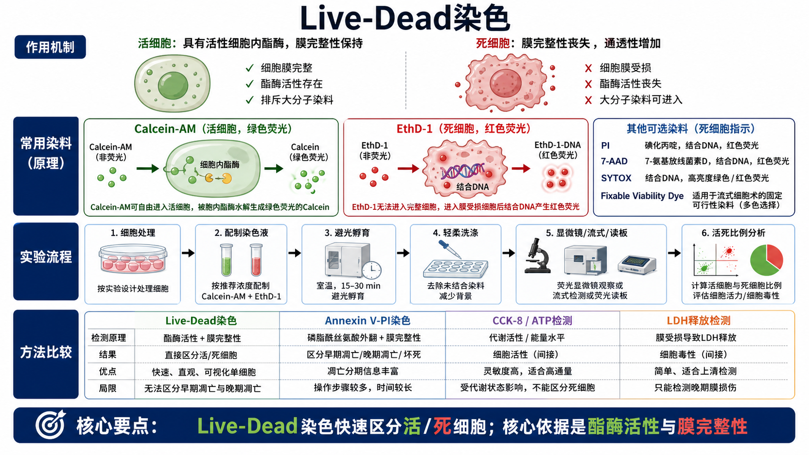
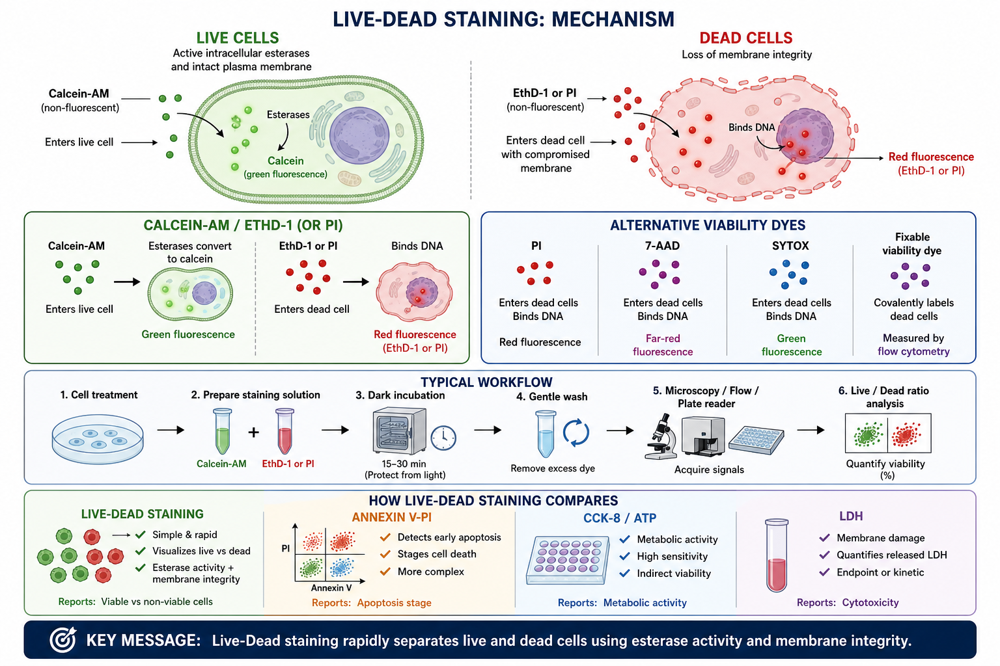

# Live-Dead染色

Live-Dead staining（活死细胞染色）是用荧光染料快速区分活细胞和死细胞的实验。最常见的判断逻辑是：活细胞保留 [膜完整性](../番外/补充知识/膜完整性.md) 并具有 [酯酶活性](../番外/补充知识/酯酶活性.md)，死细胞膜受损后允许死细胞染料进入并结合 DNA。





一句话理解：Live-Dead 染色适合回答“样本里有多少细胞还活着、多少已经膜破损死亡”，但它通常不能单独区分早期凋亡、晚期凋亡、坏死、焦亡或其他 [细胞死亡](../番外/补充知识/细胞死亡.md) 方式。

## 实验发明历史与背景

活死染色的核心来自两个很早就被细胞生物学反复使用的判断标准：

- 活细胞有完整细胞膜，可以排斥大分子或带电核酸染料。
- 活细胞仍有胞内酶活、代谢活性或膜转运能力，可以把某些无荧光前体染料转化成荧光产物。

经典 mammalian cell LIVE/DEAD viability/cytotoxicity assay（哺乳动物细胞活性/细胞毒性活死检测）通常把 [Calcein-AM](<../材(实验耗材工具篇)/Calcein-AM.md>) 和 [EthD-1](<../材(实验耗材工具篇)/EthD-1.md>) 组合使用。Thermo Fisher 的 LIVE/DEAD Viability/Cytotoxicity Kit protocol 明确说明，这是一种 two-color dual-parameter assay（双色双参数检测），依据 intracellular esterase activity（胞内酯酶活性）和 plasma membrane integrity（质膜完整性）区分活细胞和死细胞。参考：[Thermo Fisher LIVE/DEAD Viability/Cytotoxicity Kit protocol](https://www.thermofisher.com/in/en/home/references/protocols/cell-and-tissue-analysis/protocols/live-dead-viability-cytotoxicity-kit-for-mammalian-cells.html)。

现在的 Live-Dead 染色已经不只是一种固定 kit，而是一类方法：显微镜常用 Calcein-AM/EthD-1 或 Calcein-AM/[PI](<../材(实验耗材工具篇)/PI.md>)，流式细胞术常用 PI、[7-AAD](<../材(实验耗材工具篇)/7-AAD.md>)、[SYTOX Green](<../材(实验耗材工具篇)/SYTOX Green.md>) 或 [Fixable Viability Dye](<../材(实验耗材工具篇)/Fixable Viability Dye.md>)，高内涵成像还会把核染料、活细胞染料和死细胞染料组合起来。

## 应用场景

- 快速判断培养细胞、处理后细胞、类器官、3D spheroid 或组织消化细胞的活死比例。
- 药物毒性、材料毒性、纳米材料毒性或处理条件优化，常作为 [细胞毒性](../番外/补充知识/细胞毒性.md) 评估的一部分。
- 细胞转染、电转、病毒转导、冻融、消化、分选后评估细胞状态。
- 成像观察：直接看到活细胞绿色、死细胞红色，适合教学、记录和空间分布判断。
- 流式实验前排除死细胞，避免死细胞非特异结合抗体或增加背景。
- 和 [CCK-8实验](CCK-8实验.md)、[ATP细胞活性检测](ATP细胞活性检测.md)、[LDH释放实验](LDH释放实验.md)、[Annexin V-PI染色](<Annexin V-PI染色.md>) 互相验证，区分“代谢下降”“膜破损”“死亡分期”和“总活死比例”，避免把 [细胞活性](../番外/补充知识/细胞活性.md) 与死亡机制混为一谈。

Thermo Fisher 的 LIVE/DEAD selection guide 将不同 kit 按 fluorescence microscopy（荧光显微镜）、flow cytometry（流式细胞术）和 microplate assay（微孔板检测）分类，并说明这类试剂可基于膜完整性、酯酶活性、代谢活性或结构分割区分活/死细胞。参考：[Thermo Fisher LIVE/DEAD Cell Viability Assays](https://www.thermofisher.com/us/en/home/life-science/cell-analysis/cell-viability-and-regulation/cell-viability/live-dead-cell-viability-assays.html)。

## 实验目的

Live-Dead 染色主要回答下面几类问题：

- 当前样本中活细胞和死细胞比例是多少。
- 某个处理是否明显导致细胞膜完整性丧失。
- 细胞操作过程是否损伤细胞，例如消化、吹打、离心、冻融、电转或分选。
- 细胞死亡是否呈空间分布差异，例如 spheroid 中心死亡、材料表面局部毒性、划痕边缘死亡。
- 在多色流式实验中，哪些细胞应作为死细胞排除。

它不擅长回答的问题：

- 细胞为什么死亡。
- 死亡是不是早期凋亡。
- 代谢活性下降是不是来自死亡、增殖变慢还是细胞周期停滞。
- 细胞是否已经经历 Caspase 激活、DNA 断裂或线粒体膜电位下降。

这些问题需要结合 [Caspase活性检测](Caspase活性检测.md)、[TUNEL](TUNEL.md)、[线粒体膜电位检测](线粒体膜电位检测.md)、WB 或其他机制实验。

## 简要实验原理

### Calcein-AM 标记活细胞

Calcein-AM 是 calcein acetoxymethyl ester（钙黄绿素乙酰氧甲基酯），本身疏水、可透过细胞膜、几乎无荧光。进入活细胞后，胞内 esterase（酯酶）会把 AM ester（水解酯基）切掉，生成带负电、亲水、绿色荧光的 calcein。由于活细胞膜完整，calcein 会被保留在胞内，因此活细胞呈绿色。

Abcam 的 Calcein AM guide 也说明，Calcein-AM 通常用 DMSO 配制母液，再稀释到工作浓度，进入细胞后经胞内酯酶转化为绿色 calcein；PI 可作为可选死细胞复染。参考：[Abcam Calcein AM staining guide](https://www.abcam.co.jp/knowledge-center/cell-biology/calcein-am-staining)。

### EthD-1、PI、7-AAD 标记死细胞

EthD-1 是 ethidium homodimer-1（乙啶同源二聚体-1），PI 是 propidium iodide（碘化丙啶），7-AAD 是 7-aminoactinomycin D（7-氨基放线菌素 D）。这些染料不能有效进入膜完整的活细胞；当细胞膜受损后，它们进入细胞并结合 DNA，产生红色或远红荧光。Abcam 的 live-dead assay 页面指出，Calcein-AM 可阳性标记活细胞，而 EthD-1 或 7-AAD 等多正电核酸染料可以进入膜受损死细胞并强烈标记 DNA。参考：[Abcam live-dead assay overview](https://www.abcam.cn/products/biochemical-assays/cell-health-assays/live-dead-assays)。

### Fixable viability dye 标记可固定死细胞

Fixable viability dye（可固定活性染料）常用于流式细胞术。它们通常是 amine-reactive dyes（胺反应性染料）：活细胞膜完整时，染料主要和细胞表面胺基反应，信号较弱；死细胞膜破损时，染料进入胞内并和更多胺基反应，信号明显增强。由于染料共价结合细胞成分，后续固定和通透化后仍能保留死细胞标记。参考：[Thermo Fisher LIVE/DEAD Fixable Dead Cell Stains protocol](https://www.thermofisher.cn/gq/en/home/references/protocols/cell-and-tissue-analysis/protocols/live-dead-fixable-dead-cell-stains.html)。

## 常见染料与选择

| 染料/体系 | 英文全称 | 主要标记 | 读数颜色 | 适合平台 | 关键限制 |
|---|---|---|---|---|---|
| Calcein-AM | calcein acetoxymethyl ester | 活细胞酯酶活性 | 绿色 | 显微镜、流式、读板 | 死细胞或低酯酶细胞会弱；通常不适合固定 |
| EthD-1 | ethidium homodimer-1 | 膜破损死细胞 DNA | 红色 | 显微镜、读板 | 核酸染料，注意安全和避光 |
| PI | propidium iodide | 膜破损死细胞 DNA | 红色 | 流式、显微镜 | 与 PE/红色通道冲突；不能固定后长期保留 |
| 7-AAD | 7-aminoactinomycin D | 膜破损死细胞 DNA | 远红 | 流式 | 与部分 APC/PerCP 通道需规划 |
| SYTOX Green | SYTOX Green nucleic acid stain | 膜破损死细胞 DNA | 绿色 | 流式、显微镜、读板 | 与 GFP/FITC 冲突 |
| Fixable viability dye | amine-reactive fixable viability dye | 膜破损死细胞更多胺基 | 多色可选 | 流式 | 通常不适合显微镜活死成像 |

从功能上看，Calcein-AM 这一类属于 [活细胞染料](../番外/补充知识/活细胞染料.md)，PI、7-AAD、SYTOX 和 fixable viability dye 这一类更接近 [死细胞排除染料](../番外/补充知识/死细胞排除染料.md)。前者正向标记活细胞，后者在流式和免疫染色中常用于把死细胞从分析群体中排除。

## 所需试剂、耗材和设备

| 类别 | 推荐内容 | 作用 | 关键注意事项 |
|---|---|---|---|
| 细胞样本 | 贴壁细胞、悬浮细胞、原代细胞、类器官消化细胞 | 被检测对象 | 保持真实状态，避免操作本身造成死亡 |
| 核心试剂 | [Live-Dead试剂盒](<../材(实验耗材工具篇)/Live-Dead试剂盒.md>)、Calcein-AM、EthD-1、PI、7-AAD、SYTOX Green | 标记活/死细胞 | 需要按平台和通道选择 |
| 核染料 | [DAPI](<../材(实验耗材工具篇)/DAPI.md>)、[Hoechst 33342](<../材(实验耗材工具篇)/Hoechst 33342.md>) | 总细胞核计数或成像定位 | DAPI 通常更偏固定/膜破损细胞，Hoechst 可进入活细胞 |
| 缓冲液 | [PBS](<../材(实验耗材工具篇)/PBS.md>)、[HBSS](<../材(实验耗材工具篇)/HBSS.md>)、[无酚红培养基](<../材(实验耗材工具篇)/无酚红培养基.md>) | 染色和洗涤 | 维持渗透压和 pH；成像时尽量降低背景 |
| 耗材 | [黑色96孔板](<../材(实验耗材工具篇)/黑色96孔板.md>)、玻底皿、[流式管](<../材(实验耗材工具篇)/流式管.md>) | 读板、成像、流式 | 荧光读板优先黑色板，成像优先玻底 |
| 仪器 | [荧光显微镜](<../材(实验耗材工具篇)/荧光显微镜.md>)、[流式细胞仪](<../材(实验耗材工具篇)/流式细胞仪.md>)、[酶标仪](<../材(实验耗材工具篇)/酶标仪.md>) | 读取荧光信号 | 提前确认滤光片、激光和检测通道 |

Thermo Fisher 的 mammalian LIVE/DEAD protocol 以 Calcein-AM 和 EthD-1 为例，给出了常见显微镜流程：用 DPBS 配制染色液，加入细胞后室温避光孵育约 30 min，再用 FITC/GFP 与 RFP 通道成像；同时提示这些染色通常不能经受固定或通透化。参考：[Thermo Fisher protocol](https://www.thermofisher.com/in/en/home/references/protocols/cell-and-tissue-analysis/protocols/live-dead-viability-cytotoxicity-kit-for-mammalian-cells.html)。

## 实验设计

### 先决定读数平台

| 读数平台 | 适合目的 | 推荐染料组合 | 优点 | 局限 |
|---|---|---|---|---|
| 荧光显微镜 | 看空间分布、形态、单细胞视觉证据 | Calcein-AM + EthD-1/PI | 直观，适合贴壁细胞、spheroid、材料表面 | 定量依赖图像分析和视野选择 |
| 流式细胞术 | 精确计算活/死比例，排除死细胞 | PI、7-AAD、SYTOX 或 fixable viability dye | 单细胞定量，适合多色 panel | 贴壁细胞消化可能引入损伤 |
| 荧光读板 | 快速筛选多条件 | Calcein-AM + EthD-1 或同类 kit | 高通量，适合剂量/时间筛选 | 只给平均信号，不能看亚群和形态 |

### 对照设计

| 对照 | 目的 | 预期 |
|---|---|---|
| Unstained control 未染色对照 | 判断自发荧光 | 各通道接近背景 |
| Live control 活细胞对照 | 定义活细胞信号 | Calcein-AM 强，死细胞染料弱 |
| Dead control 死细胞阳性对照 | 验证死细胞染料能进入 | EthD-1/PI/7-AAD/SYTOX 强 |
| Single-stain control 单染对照 | 流式补偿和通道设置 | 用于校正串色 |
| Vehicle control 溶剂对照 | 排除 DMSO 或处理溶剂影响 | 接近正常活死比例 |
| Treatment group 处理组 | 判断实验处理影响 | 根据处理不同变化 |

死细胞阳性对照可以用 heat-killed cells（热杀死细胞）、乙醇处理或强毒性条件制备。需要注意，阳性死亡处理过强时细胞可能碎裂，成像或流式 gate 要避免把碎片当作细胞。

## 实验操作

下面以 Calcein-AM + EthD-1/PI 显微镜或读板检测为主线，并补充流式版本的关键差异。不同厂家试剂盒的浓度和孵育时间可能不同，实际实验应按说明书优化。

### 细胞处理

做法：

- 按实验目的接种细胞并进行药物、转染、冻融、消化、材料接触或其他处理。
- 保留漂浮细胞和贴壁细胞，尤其是强毒性处理后。
- 同步设置 live control、dead control、vehicle control。

为什么重要：

Live-Dead 染色测的是操作结束时的活死状态。如果在换液、洗涤、消化时丢掉漂浮细胞，就会低估死细胞比例。

注意事项：

- 不要过度吹打或高速离心，否则会人为增加死细胞。
- 贴壁细胞若用显微镜原位观察，应尽量少移动细胞。
- 如果要做流式，消化方式要温和，避免消化本身造成膜损伤。

替代方案：

- 贴壁细胞：原位染色后直接成像。
- 悬浮细胞：离心收集后管内染色，再流式或铺板读数。
- 3D spheroid/类器官：延长染色时间并优化洗涤，必要时结合切片或透明化成像。

### 配制染色液

做法：

- 将 Calcein-AM 和 EthD-1/PI 按说明书稀释到工作浓度。
- 用 PBS、HBSS 或无酚红培养基配制。
- 现配现用、避光操作。

为什么重要：

Calcein-AM 和核酸染料对光、温度、溶剂和时间都敏感。工作液放置太久、反复冻融或 DMSO 终浓度太高，都会影响背景和细胞状态。

注意事项：

- Calcein-AM 母液通常用 DMSO 溶解，终浓度要低。
- PI、EthD-1、7-AAD 等核酸染料要按潜在 mutagenic dye（潜在致突变核酸染料）谨慎处理。
- 如果细胞自发荧光强，先做未染和单染测试。

可能出错导致的结果：

- Calcein-AM 过浓：活细胞背景高，死细胞也可能出现残余绿色。
- PI/EthD-1 过浓：红色背景升高，弱膜损伤细胞被过度判为死亡。
- 染色液不新鲜：信号弱或重复性差。

### 避光孵育

做法：

- 向细胞加入染色液。
- 常见孵育条件为室温或 37°C 避光 15-30 min，具体按试剂说明书。
- 孵育后根据平台选择是否轻柔洗涤。

为什么重要：

孵育时间决定染料进入、酶切和 DNA 结合的充分程度。时间太短，活细胞绿色不足；时间太长，背景升高、细胞状态改变。

注意事项：

- 显微镜原位染色时，避免细胞干燥。
- 对敏感细胞可降低染料浓度并缩短孵育。
- 对 spheroid 或厚样本可能需要更长孵育，但应防止表层过染。

### 洗涤和换液

做法：

- 轻柔洗掉多余染料。
- 成像时换成清洁的 PBS、HBSS 或成像培养基。
- 流式样本重悬到合适细胞浓度，并保持避光。

为什么重要：

未结合染料会增加背景，尤其影响读板和显微镜图像。洗涤过度又会丢失死亡细胞或脆弱细胞。

注意事项：

- 强毒性处理组容易细胞脱落，洗涤要更轻。
- 如果实验目的就是统计所有死亡细胞，应收集上清和贴壁细胞一起分析。
- 不要把 Calcein-AM/EthD-1 染色样本固定后再作为最终读数，除非使用明确支持固定的染料体系。

### 显微镜成像

做法：

- 用 FITC/GFP 通道采集 Calcein 绿色信号。
- 用 RFP/TRITC 相关通道采集 EthD-1 或 PI 红色信号。
- 统一曝光、增益、光强和采图参数。
- 每孔或每样本采集多个随机视野。

为什么重要：

显微镜读数容易受视野选择影响。只拍“好看的地方”会严重偏倚活死比例。固定曝光参数可以避免不同组之间因参数变化造成假差异。

替代方案：

- 用自动高内涵成像做全孔扫描。
- 用核染料统计总细胞数，再计算绿色/红色细胞比例。
- 对 3D 样本做 z-stack，而不是只看表层。

### 流式检测

做法：

- 单细胞悬液过滤，避免团块。
- 设置 FSC/SSC gate，排除 debris 和 doublets。
- 使用未染、单染、live/dead 对照建立阈值和补偿。
- 如果后续要固定/通透化做胞内染色，应选择 fixable viability dye。

为什么重要：

死细胞会增加非特异抗体结合、自发荧光和碎片背景。流式 panel 中先排除死细胞，能显著改善后续群体分析。

注意事项：

- PI/7-AAD/SYTOX 通常不适合固定后长时间保留。
- Fixable viability dye 要在固定前染色。
- 多色 panel 要提前检查通道冲突、[荧光串色](../番外/补充知识/荧光串色.md) 和 [荧光补偿](../番外/补充知识/荧光补偿.md)。

### 读板检测

做法：

- 选择适合 Calcein 和 EthD-1/PI 的激发/发射波长。
- 扣除 blank 和未染背景。
- 计算绿色活细胞信号、红色死细胞信号或活/死比值。

为什么重要：

读板给的是群体平均值，适合筛选，但不能看到细胞形态和亚群。若读板显示死亡升高，最好用显微镜或流式确认。

## 数据分析

### 显微镜计数

常用计算：

```text
Live cell percentage =
green live cells / total counted cells × 100%

Dead cell percentage =
red dead cells / total counted cells × 100%
```

如果有核染料：

```text
Total cells = nuclei count
Live percentage = Calcein-positive cells / nuclei count × 100%
Dead percentage = EthD-1 or PI-positive cells / nuclei count × 100%
```

### 流式分析

常用 gate 顺序：

```text
Cells -> singlets -> viability dye negative live cells
```

如果是死细胞排除：

```text
Live gate = viability dye low/negative population
Dead gate = viability dye high/positive population
```

### 读板分析

简单相对比较：

```text
Relative live signal =
(green treatment - green blank) / (green vehicle - green blank)

Relative dead signal =
(red treatment - red blank) / (red positive control - red blank)
```

需要注意：绿色信号下降不一定等于死亡增加，也可能是细胞数量减少、酯酶活性下降、染料摄取变化或代谢状态改变。红色死细胞信号升高更接近膜损伤读数。

## 结果解析

| 结果模式 | 可能解释 | 下一步 |
|---|---|---|
| 绿色强、红色弱 | 细胞多数存活 | 可作为正常对照 |
| 绿色下降、红色上升 | 活细胞减少，膜破损死细胞增加 | 结合 LDH、Annexin V-PI 或 Caspase 判断机制 |
| 绿色下降、红色不升 | 细胞数减少、代谢/酯酶活性下降、洗涤丢失细胞 | 做总细胞核计数或平行 CCK-8/ATP |
| 红色升高但绿色仍强 | 部分细胞死亡或同一视野混合活死细胞 | 做定量计数和时间梯度 |
| 所有组红色都高 | 染色过强、细胞状态差、操作损伤 | 检查细胞状态、降低染料浓度、减少洗涤应激 |
| 死细胞阳性对照不红 | 染料失效、通道设置错误、阳性死亡处理失败 | 重配染料，检查滤光片/激光和阳性对照 |

## 与其他方法的区别

| 方法 | 主要读到什么 | 与 Live-Dead 染色的关系 |
|---|---|---|
| Live-Dead 染色 | 活细胞酯酶活性 + 死细胞膜完整性丧失 | 直接可视化活/死细胞，适合快速判断 |
| Annexin V-PI | 磷脂酰丝氨酸外翻 + 膜完整性 | 更适合区分早期凋亡、晚期凋亡和坏死 |
| CCK-8/ATP | 代谢活性或能量水平 | 高通量友好，但不能直接看到死细胞 |
| LDH 释放 | 细胞膜破裂后 LDH 进入上清 | 适合上清检测，偏细胞毒性终点 |
| [Trypan blue](<../材(实验耗材工具篇)/台盼蓝.md>) | 台盼蓝排斥实验 | 便宜快速，但信息量和灵敏度低于荧光法 |
| TUNEL | DNA 片段化 | 更偏凋亡后果或 DNA 断裂证据 |

## 异常结果与 troubleshooting

### 活细胞绿色很弱

可能原因：

- Calcein-AM 浓度太低或失效。
- 孵育时间不足。
- 细胞酯酶活性本身低。
- 细胞状态差，活细胞也接近死亡。

解决：

- 做 Calcein-AM 浓度梯度和孵育时间梯度。
- 使用新鲜工作液。
- 检查显微镜或读板的 FITC/GFP 通道。
- 用健康细胞作为 live control。

### 死细胞红色背景很高

可能原因：

- PI/EthD-1 浓度太高。
- 洗涤不充分。
- 细胞本身大量死亡。
- 处理药物有红色荧光或增加自发荧光。

解决：

- 降低死细胞染料浓度。
- 增加轻柔洗涤。
- 设置 compound-only 和 unstained control。
- 换用远红或其他通道的死细胞染料。

### 结果和 CCK-8 不一致

Live-Dead 染色主要看膜完整性和酯酶活性，CCK-8 主要看代谢还原能力。处理早期可能先抑制代谢但细胞膜仍完整，所以 CCK-8 下降而 Live-Dead 变化不明显；晚期死亡时两者才更一致。

### 结果和 Annexin V-PI 不一致

早期凋亡细胞可能 Annexin V 阳性但 PI 阴性，膜仍相对完整，因此 Live-Dead 染色可能仍把它归为“活”或“未膜破损”。这不是矛盾，而是两个实验读到的死亡阶段不同。

### 3D 样本中心看不到红色

可能原因是染料渗透不足、成像深度不够或只拍了表层。需要延长孵育、优化染料浓度、做 z-stack，或将 spheroid 切片后观察。

### 流式死细胞比例过高

可能来自消化过度、离心过猛、过滤损伤、样本放置时间过长或 buffer 不合适。需要优化制备单细胞悬液的过程，而不只是调整染料。

## 推荐记录模板

中文模板：

```text
实验名称：
细胞类型：
样本形式：贴壁 / 悬浮 / spheroid / 类器官 / 组织消化细胞
处理条件：
处理时间：
染色体系：Calcein-AM + EthD-1 / Calcein-AM + PI / PI / 7-AAD / SYTOX / Fixable dye
试剂品牌与货号：
试剂批号：
染料工作浓度：
染色 buffer：
孵育时间和温度：
是否洗涤：
读数平台：显微镜 / 流式 / 酶标仪 / 高内涵成像
通道或波长设置：
是否有 live control：
是否有 dead control：
是否有 unstained 和 single-stain control：
计数方式：
活细胞比例：
死细胞比例：
是否同步做 CCK-8 / ATP / LDH / Annexin V-PI：
异常现象：
结论：
```

English template:

```text
Experiment name:
Cell type:
Sample format: adherent / suspension / spheroid / organoid / dissociated tissue cells
Treatment condition:
Treatment time:
Staining system: Calcein-AM + EthD-1 / Calcein-AM + PI / PI / 7-AAD / SYTOX / fixable dye
Reagent brand and catalog number:
Reagent lot number:
Working dye concentration:
Staining buffer:
Incubation time and temperature:
Wash performed:
Readout platform: microscopy / flow cytometry / plate reader / high-content imaging
Channel or wavelength settings:
Live control included:
Dead control included:
Unstained and single-stain controls included:
Counting method:
Live cell percentage:
Dead cell percentage:
Parallel CCK-8 / ATP / LDH / Annexin V-PI assay:
Unexpected observations:
Conclusion:
```

## 小结

Live-Dead 染色的价值是快速、直观、可单细胞观察。它最适合判断“细胞是否还保持膜完整性和基本活细胞功能”，尤其适合处理条件筛选、操作损伤评估和流式死细胞排除。

它的主要局限是机制信息不足。绿色和红色告诉你活/死比例，但不告诉你死亡路径。真正稳妥的死亡机制判断，应该把 Live-Dead 染色与 Annexin V-PI、Caspase 活性、TUNEL、线粒体膜电位检测、LDH 或代谢活性实验放在同一条证据链里解释。

## 参考来源

- [Thermo Fisher Scientific. LIVE/DEAD Viability/Cytotoxicity Kit for Mammalian Cells Protocol.](https://www.thermofisher.com/in/en/home/references/protocols/cell-and-tissue-analysis/protocols/live-dead-viability-cytotoxicity-kit-for-mammalian-cells.html)
- [Thermo Fisher Scientific. LIVE/DEAD Cell Viability Assays selection guide.](https://www.thermofisher.com/us/en/home/life-science/cell-analysis/cell-viability-and-regulation/cell-viability/live-dead-cell-viability-assays.html)
- [Thermo Fisher Scientific. LIVE/DEAD Fixable Dead Cell Stains Protocol.](https://www.thermofisher.cn/gq/en/home/references/protocols/cell-and-tissue-analysis/protocols/live-dead-fixable-dead-cell-stains.html)
- [Abcam. Calcein AM staining guide.](https://www.abcam.co.jp/knowledge-center/cell-biology/calcein-am-staining)
- [Abcam. Live-dead assay kits overview.](https://www.abcam.cn/products/biochemical-assays/cell-health-assays/live-dead-assays)
- [Abcam. Live and Dead Cell Assay Kit, Calcein AM and 7-AAD.](https://www.abcam.com/en-us/products/assay-kits/live-and-dead-cell-assay-kit-calcein-am-7-aad-ab270789)
