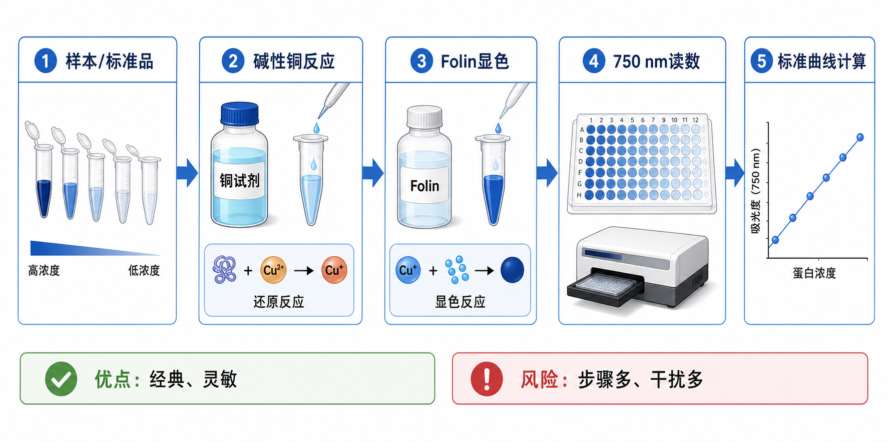

# Lowry蛋白定量

Lowry protein assay（Lowry 蛋白定量法）是一种经典的总[蛋白定量](蛋白定量.md)方法，核心是先让蛋白在 alkaline copper condition（碱性铜条件）下发生铜离子还原反应，再用 [Folin-Ciocalteu试剂](<../材(实验耗材工具篇)/Folin-Ciocalteu试剂.md>) 显色，最后通过 [标准曲线](../番外/补充知识/标准曲线.md) 换算蛋白浓度。



Lowry 法的地位很特殊：它是蛋白定量史上的经典方法，灵敏度通常优于原始 biuret assay（[双缩脲反应](../番外/补充知识/双缩脲反应.md)法），但步骤更多、干扰物更多、操作窗口更容易受影响。因此在现代常规 [Western blot](<Western blot.md>) 前上样定量中，很多实验室会优先选择 [BCA蛋白定量](BCA蛋白定量.md)；但在旧 SOP、特定样本体系或需要与历史数据兼容时，Lowry 仍然有价值。

## 发明历史

Lowry 法由 Oliver H. Lowry 等人在 1951 年发表，论文 “Protein measurement with the Folin phenol reagent” 成为生物化学历史上引用极高的蛋白定量方法论文之一。它在 biuret reaction（双缩脲反应）基础上叠加了 Folin phenol reagent（Folin 酚试剂）显色，显著提高了灵敏度。参考：Lowry et al., 1951, [Protein measurement with the Folin phenol reagent](https://pubmed.ncbi.nlm.nih.gov/14907713/)

Thermo Fisher 的 Pierce Modified Lowry Protein Assay Kit 页面也把它描述为传统 two-component Folin phenol-based and copper-based reagent system（双组分 Folin 酚基和铜基试剂系统）的稳定化形式，并说明可用 750 nm 微孔板读数或分光光度计读数。参考：[Thermo Fisher Pierce Modified Lowry Protein Assay Kit](https://www.thermofisher.com/order/catalog/product/23240)

## 应用场景

| 场景 | 为什么可能选择 Lowry | 重点风险 |
| --- | --- | --- |
| 旧 SOP 或历史数据延续 | 与既往 Lowry 数据可比 | 不同方法之间不能直接换算 |
| 简单蛋白溶液定量 | 灵敏度较好，经典可靠 | 步骤多，时间控制重要 |
| 样本中去垢剂较低 | 可以获得较稳定显色 | 还原剂、螯合剂和某些缓冲成分会干扰 |
| 教学和方法学理解 | 能串联铜反应和 Folin 显色 | 操作复杂度高于 Bradford |
| 特定改良试剂盒体系 | Modified Lowry 或 DC assay 可改善兼容性 | 必须遵循具体试剂盒兼容性表 |

Lowry 不适合“想省事快速测一下”的场景。如果只是快速估算简单蛋白浓度，[Bradford蛋白定量](Bradford蛋白定量.md)更快；如果是常规细胞裂解液和 WB 前上样，BCA 往往更方便；如果是纯化抗体或重组蛋白，[A280蛋白定量](A280蛋白定量.md)可能更省样本。

## 实验目的

Lowry 蛋白定量的目标是通过显色强度估算样本 total protein concentration（总蛋白浓度）。在实际实验中，它常用于：

| 目的 | Lowry 给出的信息 |
| --- | --- |
| 估算蛋白浓度 | 根据标准曲线换算 mg/mL、µg/mL 或 µg/µL |
| 比较样本总蛋白量 | 在相同 buffer 和方法条件下进行相对比较 |
| 评价样本制备 | 判断提取、浓缩或纯化步骤是否获得足够蛋白 |
| 维持旧数据一致性 | 与历史 Lowry SOP 的结果保持可比 |

Lowry 的结果不是目标蛋白特异性定量，而是总蛋白比色估算。它不能告诉你某个特定蛋白表达多少，只能告诉你样本里能被该体系响应的总蛋白量。

## 简要实验原理

Lowry 反应可以理解为两个阶段。

第一阶段是 alkaline copper reaction（碱性铜反应）。在碱性条件下，蛋白中的 peptide bond（肽键）和部分氨基酸残基会与铜离子反应，并将 Cu2+ 还原为 Cu1+。这个阶段与双缩脲反应有关，常见铜试剂体系中会包含 [硫酸铜](<../材(实验耗材工具篇)/硫酸铜.md>)、碱性组分和 [酒石酸钠钾](<../材(实验耗材工具篇)/酒石酸钠钾.md>) 等稳定铜离子的成分。

第二阶段是 Folin-Ciocalteu reaction（Folin-Ciocalteu 反应）。还原后的铜-蛋白体系和蛋白中的 tyrosine（酪氨酸）、tryptophan（色氨酸）等残基，会促进 Folin-Ciocalteu 试剂中的 phosphomolybdotungstate（磷钼钨酸盐）被还原，形成蓝色产物。改良 Lowry 试剂盒常用 750 nm 读数，Thermo Fisher 产品页面也列出 modified Lowry 的比色读数可用标准分光光度计或 750 nm plate reader。参考：[Thermo Fisher Pierce Modified Lowry Protein Assay Kit](https://www.thermofisher.com/order/catalog/product/23240)

需要注意，Lowry 的显色不仅受“蛋白总量”影响，也受氨基酸组成、样本 buffer、还原剂、螯合剂、去垢剂和反应时间影响。因此它比 BCA/Bradford 更需要严格一致的操作条件。

## 所需试剂、材料与设备

| 类别 | 常用内容 | 作用与注意事项 |
| --- | --- | --- |
| 待测样本 | 蛋白溶液、裂解液、纯化组分 | 尽量保持 buffer 简单，避免强干扰物 |
| 标准品 | [BSA标准品](<../材(实验耗材工具篇)/BSA标准品.md>) 或 [牛γ球蛋白标准品](<../材(实验耗材工具篇)/牛γ球蛋白标准品.md>) | 建立标准曲线 |
| Lowry 试剂 | [Lowry蛋白定量试剂盒](<../材(实验耗材工具篇)/Lowry蛋白定量试剂盒.md>) 或自配铜碱试剂 + Folin 试剂 | 优先按试剂盒说明书操作 |
| 铜试剂组分 | 硫酸铜、碱性碳酸盐、酒石酸钠钾 | 形成碱性铜反应体系 |
| Folin 试剂 | Folin-Ciocalteu reagent | 产生蓝色显色反应 |
| 反应容器 | [96孔板](<../材(实验耗材工具篇)/96孔板.md>)、试管或比色皿 | 与所用 protocol 的体系体积匹配 |
| 仪器 | [酶标仪](<../材(实验耗材工具篇)/酶标仪.md>) 或 [分光光度计](<../材(实验耗材工具篇)/分光光度计.md>) | 常见读数约 750 nm，具体以说明书为准 |
| 移液工具 | [移液枪](<../材(实验耗材工具篇)/移液枪.md>)、多道移液枪、吸头 | 步骤多时移液一致性更关键 |

如果样本已经加入大量 [DTT](<../材(实验耗材工具篇)/DTT.md>)、[EDTA](<../材(实验耗材工具篇)/EDTA.md>) 或强去垢剂，需要先查兼容性表。Thermo Fisher 的 protein assay selection guide 也提醒，蛋白定量方法没有“所有样本都最佳”的单一试剂，需要按样本类型、速度、灵敏度、读数方式和兼容性选择。参考：[Thermo Fisher Protein Assay Selection Guide](https://www.thermofisher.com/us/en/home/life-science/protein-biology/protein-assays-analysis/protein-assays/protein-assay-selection-guide.html)

## 实验操作

### 判断是否应该选 Lowry

先确认本次实验为什么要用 Lowry：是 SOP 指定、历史数据延续、样本体系已验证，还是确实需要 Lowry 的灵敏度和特性。若只是常规 WB 前总蛋白定量，通常先评估 BCA 是否更合适。

为什么重要：Lowry 的操作复杂度和干扰风险更高。方法选错时，即使每一步都按流程做，最后结果也可能不如更简单的 BCA 或 Bradford 稳定。

注意事项：

| 判断点 | 建议 |
| --- | --- |
| 样本 buffer | 越简单越适合 Lowry |
| 干扰物 | 重点查还原剂、螯合剂、去垢剂、酚类和强碱/强酸 |
| 数据连续性 | 若历史项目使用 Lowry，继续使用可保持可比 |
| 时间要求 | 如果需要快速结果，Bradford/BCA 更省时 |
| 精度要求 | 关键样本可用另一种方法交叉验证 |

### 设计标准曲线和样本稀释

用标准蛋白配制一系列浓度梯度，并设置 blank。样本如果浓度未知，建议先做几个稀释倍数，确保读数落在 [线性范围](../番外/补充知识/线性范围.md) 内。

为什么重要：Lowry 的显色反应受时间和条件影响，标准曲线必须和样本同批处理。不要用上一批标准曲线去换算本批样本。

注意事项：

| 操作点 | 建议 |
| --- | --- |
| 标准品 | 使用同一批 BSA 或 BGG，减少批间差异 |
| blank | 与样本 buffer 尽量匹配 |
| 复孔 | 至少 duplicates，关键样本 triplicates |
| 稀释倍数 | 让样本读数位于曲线中段 |

可能出错：曲线低点乱跳多来自移液误差或背景不稳；高点平台常提示超出线性范围或反应条件不合适。

### 加入碱性铜试剂

将标准品、blank 和样本加入反应孔或试管后，加入 alkaline copper reagent（碱性铜试剂）。混匀后按说明书孵育，让铜-蛋白反应充分进行。

为什么重要：这是 Lowry 反应的第一层基础。铜反应不充分，后续 Folin 显色会整体变弱；铜反应条件不一致，孔间差异会被放大。

注意事项：

| 注意点 | 原因 |
| --- | --- |
| 加样顺序一致 | 减少反应起始时间差 |
| 混匀充分 | 铜试剂和样本接触不均会影响显色 |
| 控制孵育时间 | 时间不同会造成系统误差 |
| 避免强螯合剂 | EDTA 等会影响铜离子参与反应 |

替代策略：使用商业 modified Lowry kit 可以减少自配试剂不稳定问题；如果样本含 detergent，可考虑 DC protein assay 或其他改良体系，但必须按对应说明书验证。

### 加入 Folin-Ciocalteu 试剂

按说明书加入 Folin-Ciocalteu 试剂，快速混匀。Folin 试剂加入后反应发展较快，加样节奏和混匀一致性非常重要。

为什么重要：Folin 显色是 Lowry 的关键放大步骤，也是变异来源之一。Folin 试剂本身对碱性条件、还原性物质和时间较敏感。

注意事项：

| 注意点 | 原因 |
| --- | --- |
| 现用现稀释 | 部分体系中 Folin 工作液稳定性有限 |
| 快速混匀 | 局部反应不均会导致复孔差异 |
| 统一计时 | 显色随时间变化 |
| 避免还原性干扰 | 还原剂可能直接影响 Folin 显色 |

可能出错：若整板颜色异常深，可能是还原剂、污染或 blank 不匹配；若整板颜色很浅，可能是 Folin 试剂失效、稀释错误或铜反应不足。

### 孵育显色并读数

按说明书在指定温度和时间下孵育显色，然后读取吸光度。改良 Lowry 常见读数约为 750 nm，但不同试剂盒可能有自己的推荐波长。

为什么重要：Lowry 反应比 BCA/Bradford 更依赖时间窗口。显色不足、过度显色或读数时间不一致，都可能改变标准曲线斜率。

注意事项：

| 检查点 | 建议 |
| --- | --- |
| 波长 | 记录实际读数波长，如 750 nm |
| 孵育时间 | 标准品和样本必须一致 |
| 板型 | 使用适合吸光读数的透明板 |
| 气泡 | 读数前去除气泡 |
| 温度 | 避免板不同区域温度差过大 |

### 计算浓度

扣除 blank 后，用标准曲线换算样本浓度，再乘以 dilution factor（稀释倍数）。只使用落在线性范围内的样本读数。

为什么重要：Lowry 的结果来自标准曲线相对定量，而不是单孔 OD 直接代表浓度。标准曲线异常时，所有样本都不可靠。

注意事项：

| 判断点 | 建议 |
| --- | --- |
| 曲线形状 | 应随浓度单调上升 |
| 复孔一致性 | 复孔 CV 过高时重测 |
| 稀释线性 | 多个稀释倍数换算应接近 |
| 干扰判断 | 样本与标准品背景差异大时谨慎报告 |

## 结果解析

| 结果特征 | 可能含义 | 下一步 |
| --- | --- | --- |
| 标准曲线稳定上升 | 反应体系基本正常 | 检查样本是否在线性范围 |
| blank 很高 | buffer 或试剂背景高 | 使用匹配 blank，检查试剂污染 |
| 低浓度点不稳定 | 移液误差或背景波动 | 增加复孔，重配标准品 |
| 高浓度点平台 | 超出线性范围 | 稀释样本，降低最高标准点 |
| 样本明显偏离稀释线性 | [基质效应](../番外/补充知识/基质效应.md) 或干扰物 | 换方法或做 spike recovery |
| 与 BCA 差异大 | 方法响应机制和干扰物不同 | 根据样本背景判断哪种更可信 |

Lowry 的 R² 也不能单独作为质量判断。即使 R² 看起来很好，如果 blank 偏高、复孔差异大或样本读数落在曲线边缘，结果仍不适合直接用于关键结论。

## 异常结果与可能原因

| 异常 | 常见原因 | 解决思路 |
| --- | --- | --- |
| 整体颜色过深 | 还原剂、污染、Folin 反应过强、blank 不匹配 | 检查 buffer；新配试剂；使用匹配 blank |
| 整体颜色过浅 | 铜试剂或 Folin 试剂失效、孵育不足、蛋白过低 | 检查试剂和孵育条件；提高样本浓度 |
| 复孔差异大 | 加样时间差、混匀不足、气泡、试剂加入顺序不一致 | 优化加样顺序，使用多道移液枪 |
| 标准曲线弯曲 | 高浓度平台、低点背景波动、标准品稀释错误 | 重设曲线范围，重配标准品 |
| 样本浓度假高 | 还原性物质或酚类直接还原 Folin 试剂 | 换 buffer、透析、改用其他方法 |
| 样本浓度假低 | 螯合剂影响铜反应、蛋白沉淀、样本降解 | 去除 EDTA，改善裂解/保存 |
| 与 WB 上样不符 | 定量受干扰或上样计算错误 | 复核计算，结合总蛋白染色 |

## 与相关方法的区别

| 方法 | 核心机制 | 优势 | 短板 | 更适合 |
| --- | --- | --- | --- | --- |
| Lowry | 碱性铜反应 + Folin 显色 | 经典、灵敏度较好 | 步骤多，干扰物多 | 旧 SOP、历史数据延续、特定体系 |
| BCA | 蛋白还原 Cu2+，BCA 络合 Cu1+，读 OD562 | 稳定、范围宽、对许多去垢剂友好 | 还原剂/螯合剂干扰 | 常规裂解液和 WB 前定量 |
| Bradford | 考马斯染料结合，读 OD595 | 快速、便宜、室温 | 去垢剂敏感，蛋白响应差异 | 简单蛋白溶液快速估算 |
| A280 | 280 nm 紫外吸收 | 无需显色，样本消耗低 | 核酸、浊度和消光系数影响大 | 纯化蛋白、抗体 |

[PBS](<../材(实验耗材工具篇)/PBS.md>) 对 Lowry 来说通常只是 buffer background（缓冲背景）。如果标准品和样本都在 PBS 中，背景较容易匹配；如果样本在复杂裂解液中，而标准品在 PBS 中，就可能出现基质差异。

## 推荐记录模板

中文记录模板：

```text
实验日期：
实验目的：
样本名称：
样本来源：
样本 buffer：
Lowry 试剂/试剂盒品牌：
货号：
批号：
标准蛋白：BSA / BGG / 其他
标准曲线浓度范围：
样本稀释倍数：
反应体系体积：
碱性铜反应时间：
Folin 试剂加入时间：
显色温度：
显色时间：
读数仪器：
读数波长：
空白设置：
复孔数量：
标准曲线公式：
R²：
样本吸光度：
换算浓度：
是否在线性范围：
异常孔/排除孔：
干扰物风险：
备注：
```

English template:

```text
Date:
Purpose:
Sample names:
Sample source:
Sample buffer:
Lowry reagent/kit brand:
Catalog number:
Lot number:
Protein standard: BSA / BGG / other
Standard curve range:
Sample dilution factor:
Reaction volume:
Alkaline copper reaction time:
Folin reagent addition time:
Color development temperature:
Color development time:
Reader/instrument:
Read wavelength:
Blank setting:
Replicates:
Standard curve equation:
R-squared:
Sample absorbance:
Calculated concentration:
Within linear range:
Outlier/excluded wells:
Interference risk:
Notes:
```

## 总结

Lowry 蛋白定量是蛋白定量史上的经典方法，本质是“铜反应 + Folin 显色”的两阶段比色法。它的优点是经典、灵敏、有历史可比性；缺点是步骤多、时间控制要求高、干扰物更多。实际选择时，不要因为 Lowry 经典就默认它最适合所有样本。常规裂解液和 WB 前上样常优先考虑 BCA；快速简单估算可考虑 Bradford；纯化蛋白可考虑 A280。Lowry 更适合有明确 SOP、样本背景已验证、或需要与历史 Lowry 数据保持一致的项目。

## 参考来源

- Lowry OH, Rosebrough NJ, Farr AL, Randall RJ. [Protein measurement with the Folin phenol reagent](https://pubmed.ncbi.nlm.nih.gov/14907713/). Journal of Biological Chemistry. 1951.
- [Thermo Fisher Scientific: Pierce Modified Lowry Protein Assay Kit](https://www.thermofisher.com/order/catalog/product/23240)
- [Thermo Fisher Scientific: Protein Assay Selection Guide](https://www.thermofisher.com/us/en/home/life-science/protein-biology/protein-assays-analysis/protein-assays/protein-assay-selection-guide.html)
