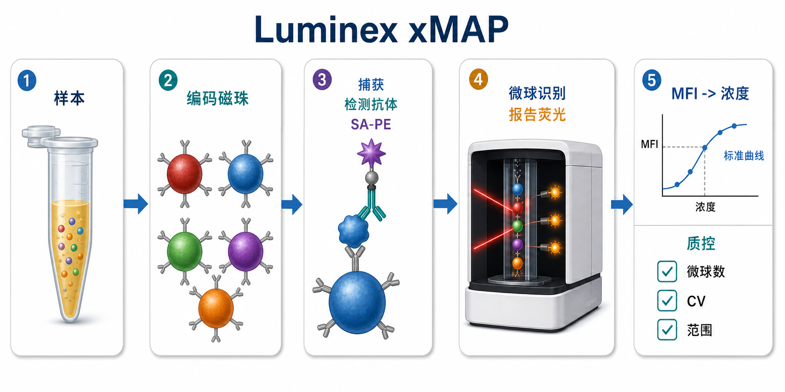
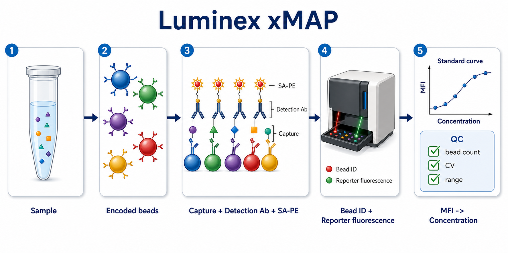

# Luminex-xMAP检测

Luminex-xMAP 检测（Luminex xMAP assay / xMAP bead-based multiplex immunoassay，Luminex xMAP 微球多重免疫检测）是一种基于编码微球的多重定量检测平台，可以在同一个孔里同时检测多个 protein analytes（蛋白分析物）或 nucleic acid targets（核酸靶标）。在实验室语境中，最常见的是用它检测血清、血浆、细胞培养上清或组织裂解液中的细胞因子、趋化因子、生长因子和磷酸化蛋白。

一句话理解：普通 [ELISA](ELISA.md) 常常是“一个孔一个指标”，Luminex xMAP 是“同一个孔里放入多种带身份编码的微球，每种微球捕获一个指标；仪器先识别微球身份，再读报告荧光，最后用标准曲线换算浓度”。

## 实验发明历史与背景

Luminex xMAP 中的 xMAP 是 Multi-Analyte Profiling（多分析物谱分析）的缩写。早期的免疫分析已经可以用抗体特异性检测蛋白，但传统板式 ELISA 主要把捕获抗体固定在孔底平面上，因此同一孔通常只能稳定处理一个目标。xMAP 的关键变化是把捕获抗体固定在不同编码的 microspheres / beads（微球）上，每一类 bead region（微球区域）对应一个 analyte（分析物）。

Luminex 官方技术概览将 xMAP 定位为 multiplexing platform（多重检测平台），强调它可以在单次反应中同时检测多个 analytes，并节省样本、时间和试剂；官方页面也说明 xMAP 可用于蛋白和核酸相关的多重检测，理论检测数量可从数个到数百个目标不等。参考：[Diasorin / Luminex Technology Overview](https://us.diasorin.com/en/luminex/technology-overview)。

在实际科研里，很多商业产品线使用 Luminex/xMAP 原理，例如 Bio-Rad Bio-Plex、Thermo Fisher Invitrogen ProcartaPlex、MilliporeSigma MILLIPLEX MAP 等。[多重因子检测](多重因子检测.md)这个父页面讨论的是“多重检测策略”，而本页面只聚焦 Luminex/xMAP 这一条平台路线。

## 应用场景

- 细胞培养上清中 IL、TNF、IFN、CCL、CXCL 等 cytokines / chemokines 的多指标定量。
- 血清、血浆、脑脊液、腹水、支气管灌洗液等有限样本中的 biomarker panel（生物标志物组合）筛查。
- 药物刺激、感染、免疫激活、基因敲低、基因编辑或细胞共培养后的 secretome（分泌组）变化分析。
- 组织裂解液或细胞裂解液中的磷酸化信号通路蛋白多指标检测。
- 抗体筛选、抗原抗体反应筛选、血清抗体谱分析等 bead-based serology（微球血清学）实验。
- 探索性研究阶段用较大 panel 找候选指标，再用 ELISA、[Western blot](<Western blot.md>)、[RT-qPCR](<RT-qPCR.md>) 或功能实验做验证。

不适合优先使用 Luminex/xMAP 的情况：

- 只检测一个或两个稳定指标，且样本量足够：单因子 ELISA 更便宜、更容易解释。
- 样本基质极复杂但没有做过验证：容易出现 [基质效应](../番外/补充知识/基质效应.md)、回收率差和假阴性/假阳性。
- 目标浓度跨度极大：同一稀释倍数下，低丰度因子可能低于定量下限，高丰度因子可能超过定量上限。
- 结果要用于诊断、临床决策或注册申报：必须使用经过相应验证和合规体系支持的方法，科研试剂盒不能直接替代诊断产品。

## 实验目的

Luminex/xMAP 检测通常用来回答：

- 一个处理是否同时改变多个分泌因子或信号蛋白。
- 哪些 analytes 是最值得后续验证的候选分子。
- 一个样本组是否呈现炎症、免疫抑制、免疫激活、损伤修复或治疗反应模式。
- 不同时间点、剂量、细胞类型或动物模型之间的因子谱是否改变。
- 多个 analytes 是否具有共同变化趋势、聚类模式或网络关系。

## 简要实验原理

### 编码微球负责“测谁”

xMAP 技术使用带有不同内部荧光编码的 microspheres / beads（微球）。每一种微球区域表面偶联一种 capture antibody（捕获抗体）或探针，因此它代表一个特定 analyte。反应后，仪器逐颗读取微球，并根据微球编码判断“这颗珠子测的是哪一个指标”。

这一步解决的是身份识别问题：同一孔里可以混入多种微球，但仪器仍然可以把 IL-6、TNF-α、IFN-γ、VEGF 等不同指标分开统计。

### 夹心免疫反应负责“捕获多少”

多数细胞因子 Luminex kit 使用 sandwich immunoassay（夹心免疫分析）：

- capture antibody 固定在编码微球表面。
- 样本中的目标蛋白与捕获抗体结合。
- biotinylated detection antibody（生物素化检测抗体）结合目标蛋白的另一个表位。
- streptavidin-phycoerythrin（SA-PE，链霉亲和素-藻红蛋白）结合生物素化检测抗体，提供报告荧光。

这套结构和 ELISA 的免疫学逻辑非常相似，区别在于 ELISA 的捕获表面通常是孔底平面，而 Luminex/xMAP 的捕获表面是可被逐颗识别的微球。Bio-Rad 关于 Bio-Plex/xMAP 的综述也指出，xMAP 与 ELISA 都可使用抗体夹心检测，但捕获基底和检测方式不同。参考：[Bio-Rad's Bio-Plex suspension array system, xMAP technology overview](https://pmc.ncbi.nlm.nih.gov/articles/PMC3469222/)。

### 报告荧光负责“有多少”

仪器读到的常用原始信号是 MFI（median fluorescence intensity，[中位荧光强度](../番外/补充知识/MFI.md)）。MFI 不是浓度本身，而是某一 bead region 上报告荧光信号的统计值。浓度需要通过 [标准曲线](../番外/补充知识/标准曲线.md)换算，常见拟合方式是 [4PL曲线](../番外/补充知识/4PL曲线.md) 或 [5PL曲线](../番外/补充知识/5PL曲线.md)。

实用理解：

- bead identity：告诉你目标是谁。
- MFI：告诉你结合信号有多强。
- standard curve：把信号换算成浓度。
- QC：判断这个浓度值能不能相信。

## 所需试剂、耗材和设备

| 类别 | 常用内容 | 作用 | 关键注意事项 |
|---|---|---|---|
| 样本 | 血清、血浆、细胞培养上清、组织裂解液、体液 | 提供待测 analytes | 采集、离心、冻融次数和抗凝剂必须统一 |
| 试剂盒 | [多重因子检测试剂盒](<../材(实验耗材工具篇)/多重因子检测试剂盒.md>)、Bio-Plex、ProcartaPlex、MILLIPLEX 等 | 提供编码磁珠、检测抗体、标准品、缓冲液 | 不同厂商体系不要随意混用 |
| 编码微球 | magnetic beads / microspheres | 捕获目标并区分 analyte | 易沉降，必须充分重悬，不能干 |
| 标准品 | [标准品](<../材(实验耗材工具篇)/标准品.md>)、标准品稀释液 | 建立定量曲线 | 复溶和系列稀释是整板最高风险步骤之一 |
| 检测体系 | 生物素化检测抗体、[荧光标记链霉亲和素](<../材(实验耗材工具篇)/荧光标记链霉亲和素.md>)、[PE](<../材(实验耗材工具篇)/PE.md>) | 形成报告荧光 | 避光、计时一致、避免反复冻融 |
| 反应板 | [96孔板](<../材(实验耗材工具篇)/96孔板.md>)、过滤板、低吸附板 | 提供反应空间 | 板型要与 kit、磁力架和仪器设置匹配 |
| 洗涤工具 | [磁力架](<../材(实验耗材工具篇)/磁力架.md>)、[洗板机](<../材(实验耗材工具篇)/洗板机.md>)、真空抽滤装置 | 去除未结合试剂 | 洗涤不足高背景，洗涤过猛丢珠 |
| 仪器 | [Luminex检测仪](<../材(实验耗材工具篇)/Luminex检测仪.md>)、MAGPIX、Luminex 200、FLEXMAP 3D、INTELLIFLEX | 识别微球并读取荧光 | 读板前要做仪器校准、验证和探针高度检查 |
| 仪器配套 | [Luminex校准珠](<../材(实验耗材工具篇)/Luminex校准珠.md>)、[Luminex质控珠](<../材(实验耗材工具篇)/Luminex质控珠.md>)、[鞘液](<../材(实验耗材工具篇)/鞘液.md>) | 保证分类和报告通道稳定 | 批号、有效期和通过/失败状态要记录 |
| 数据分析 | xPONENT、Bio-Plex Manager、厂商软件、R/Python | 曲线拟合、导出浓度和 QC | 不要只看最终浓度，要回看 MFI、微球数、CV 和曲线 |

## 实验设计

### 先决定 panel，而不是越多越好

Luminex/xMAP 的优势是多重，但 panel 越大，解释越复杂，交叉反应、动态范围不匹配和数据缺失的机会也越高。Diasorin/Luminex 官方页面强调 xMAP 可以进行高通量多 analyte 检测；Thermo Fisher 的 Luminex 平台页面也提到 ProcartaPlex 可在单孔中同时检测多种分泌蛋白，并提供多物种、多靶标选择。参考：[Thermo Fisher Luminex Platform](https://www.thermofisher.com/us/en/home/life-science/antibodies/immunoassays/procartaplex-assays-luminex.html)。

实用选择：

- 探索阶段：可以用较大 panel，但要接受筛选性质。
- 验证阶段：缩小到与假设最相关的少量 analytes。
- 样本非常珍贵：优先考虑能用低样本量、低稀释倍数完成的 panel。
- 关键结论：用单因子 ELISA 或其他方法复核。

### 先做样本基质判断

样本基质比很多初学者想象得更重要。血清、EDTA 血浆、肝素血浆、细胞培养上清和组织裂解液不是同一种检测环境。即使同一个目标蛋白真实浓度一样，抗凝剂、盐浓度、脂质、裂解液成分、蛋白总量和样本黏度也可能改变抗体结合、洗涤背景或荧光读数。

建议在正式大样本前完成：

- dilution linearity（[稀释线性](../番外/补充知识/稀释线性.md)）：样本稀释后测得浓度是否按比例变化。
- spike-and-recovery（[Spike-and-recovery](../番外/补充知识/Spike-and-recovery.md)，加标回收）：往样本中加入已知量标准品后是否能回收合理比例。
- freeze-thaw check（冻融影响检查）：样本是否经过不同冻融次数。
- matrix-matched standard（基质匹配标准）：必要时使用更接近真实样本的稀释体系。

### 标准曲线和样本稀释要围绕动态范围设计

每个 analyte 都有自己的低端灵敏度和高端饱和区。同一份样本可能出现：

- IL-6 在曲线中段，很可靠。
- TNF-α 低于 [定量下限](../番外/补充知识/定量下限.md)，只能报告低于 LLOQ。
- MCP-1 超过 [定量上限](../番外/补充知识/定量上限.md)，需要稀释重测。
- 某些因子出现 [Hook效应](../番外/补充知识/Hook效应.md)，高浓度反而造成信号异常低。

所以，正式实验前最好用少量代表性样本做预实验，确定样本稀释倍数。不要默认血清、细胞上清和组织裂解液可以用同一个稀释倍数。

### 板图设计要考虑批次和位置

建议每板至少包含：

- blank / background。
- 完整标准曲线。
- kit-provided QC 或自建 pooled QC。
- 样本复孔。
- 关键样本的不同稀释倍数。
- 跨板实验时的 [批间桥接样本](../番外/补充知识/批间桥接样本.md)。

如果样本量大到需要多块板，不要让“组别”和“板号”完全重合。例如第一块板全是对照、第二块板全是处理组，会让技术批次和生物差异混在一起。

## 实验操作

不同厂商、不同 kit 的体积、孵育时间、洗涤次数、摇床速度和读板参数会不同。下面写的是通用逻辑，正式操作必须以具体说明书和仪器 SOP 为准。

### 样本采集和预处理

做法：

- 血液样本按研究设计选择血清、EDTA 血浆、肝素血浆或柠檬酸血浆，并全程保持一致。
- 细胞培养上清收集后离心去除细胞和碎片，必要时再过滤。
- 组织裂解液先确认裂解液是否与 kit 兼容，避免强去垢剂、高盐或还原剂干扰。
- 样本分装，避免反复冻融。
- 上样前低温融化、轻柔混匀、短暂离心澄清。

为什么重要：

Luminex/xMAP 检测的是可溶性蛋白或结合信号，样本中的颗粒、细胞碎片、脂质、凝块和高黏度成分都会影响加样均一性、微球分散和仪器读取。前处理不一致时，后面再精细拟合曲线也补不回来。

注意事项：

- 溶血、脂血、浑浊样本要记录。
- 细胞上清要记录细胞数、培养体积、处理时间和收样时间。
- 组织裂解液最好记录总蛋白浓度，用于解释样本间差异。

替代方案：

- 低丰度因子可尝试更少稀释或更高样本体积，但不能超出试剂盒验证范围。
- 高背景基质可尝试更高稀释倍数，再用稀释线性判断是否可靠。

可能出错导致的结果：

- 样本颗粒多：微球计数下降、孔间差异变大。
- 冻融不一致：敏感 cytokines 假性降低。
- 抗凝剂混乱：组间差异可能来自采样体系，而不是生物学差异。

### 试剂平衡、重悬和避光

做法：

- 按说明将试剂恢复到指定温度。
- 编码磁珠使用前充分涡旋、倒置混匀或短时超声，具体按说明书。
- SA-PE、荧光微球和检测抗体尽量避光。
- 洗液、assay buffer、sample diluent 提前配好并确认无沉淀。

为什么重要：

微球会沉降，如果取样时 bead suspension 不均匀，不同孔实际加入的微球数不同，结果会表现为某些 analytes 的 [微球计数](../番外/补充知识/微球计数.md)偏低、复孔 CV 升高或整列信号不稳定。

注意事项：

- 不要剧烈产生气泡。
- 磁珠不能干在孔底。
- 如果使用自动洗板机，要确认参数适配磁珠体系。

可能出错导致的结果：

- 微球没重悬：局部 analyte 信号缺失。
- 避光不足：报告荧光降低。
- 试剂温度不一致：边缘孔或批间差异增加。

### 标准品、QC 和样本加样

做法：

- 按说明复溶标准品，充分静置和轻柔混匀。
- 做 serial dilution（系列稀释）建立标准曲线。
- 设置 blank、low/medium/high QC、样本复孔。
- 按板图加样，记录孔位、稀释倍数和样本编号。

为什么重要：

Luminex/xMAP 的最终浓度完全依赖标准曲线。标准品高点配低、某一级稀释错、孔位记错，都会让整板或某些 analytes 无法解释。

注意事项：

- 系列稀释时每一级都要充分混匀。
- 标准品和样本加样顺序保持一致。
- 尽量使用多道移液器，减少时间差。
- 标准品复溶后的可用时间按说明执行。

替代方案：

- 如果样本极少，可优先做单孔筛查，但验证阶段建议复孔。
- 如果浓度未知，预实验可设置两到三个稀释倍数。

可能出错导致的结果：

- 标准曲线不成 S 形或高点塌陷：标准品复溶、稀释或 Hook 效应需要排查。
- 复孔差异大：常见于加样误差、气泡、微球沉降或洗涤不均。

### 样本与捕获微球孵育

做法：

- 每孔加入 bead mixture 和样本/标准品。
- 封板，避光，在指定温度和摇床速度下孵育。
- 某些 kit 可室温孵育数小时，某些低丰度检测可能要求 4°C overnight。

为什么重要：

这是目标蛋白与微球表面捕获抗体结合的核心步骤。孵育不充分会降低信号；摇床速度不合适会让微球和样本接触不足；蒸发会改变局部浓度。

注意事项：

- 板封要严，避免边缘孔蒸发。
- 摇床轨道半径和 rpm 不是随便的，尽量按说明设置。
- 孵育期间避免强光。

替代方案：

- 低丰度目标：可考虑延长孵育，但必须先小规模验证。
- 高丰度目标：优先稀释样本，而不是缩短孵育硬压信号。

可能出错导致的结果：

- 摇床不足：信号整体偏低。
- 边缘蒸发：边缘孔浓度假性升高。
- 孵育时间不一致：板内时间梯度造成系统偏差。

### 洗涤

做法：

- 磁珠体系：将板放在磁力架上等待微球吸附，弃上清，加洗液，重悬，重复指定次数。
- 过滤板体系：用真空抽滤或适配洗板机洗涤。
- 洗后保留适量液体，避免磁珠完全干燥。

为什么重要：

洗涤决定背景和微球保留。洗不干净会高背景；洗太狠会丢珠；洗涤不一致会导致孔间差异。

注意事项：

- 吸液枪头不要碰到孔底磁珠区。
- 洗板机吸液高度、速度和磁吸时间要先验证。
- 洗板后观察孔内是否有明显残液或气泡。

可能出错导致的结果：

- 高背景：洗涤不足、污染、封闭不足或试剂残留。
- bead count 低：吸走磁珠、磁吸时间不足、仪器堵针或微球聚集。
- 复孔 CV 高：加样、洗涤和重悬不一致。

### 加检测抗体和 SA-PE

做法：

- 加入 detection antibody mixture，按说明孵育。
- 洗涤后加入 SA-PE 或相应报告试剂。
- 避光孵育，再洗涤并重悬至读板体积。

为什么重要：

检测抗体和 SA-PE 决定报告荧光的强度。这里不是“信号越强越好”，而是要让标准曲线落在可拟合范围内。如果背景也一起变高，最终定量反而更差。

注意事项：

- SA-PE 对光敏感，尽量避光。
- 不要改变检测抗体或 SA-PE 浓度，除非是在方法开发阶段。
- 最后重悬要充分，否则仪器吸到的微球不均匀。

可能出错导致的结果：

- 整板信号低：SA-PE失效、检测抗体漏加、孵育不足或仪器 reporter channel 设置错误。
- blank 高：污染、洗涤不足或检测抗体/SA-PE 背景高。

### 仪器校准、验证和读板

做法：

- 按仪器 SOP 进行 calibration（校准）和 verification（验证）。
- 检查 probe height（探针高度）、sheath fluid（鞘液）或 drive fluid、废液、堵针状态。
- 在软件中设置 bead region 与 analyte 的对应关系。
- 设置 acquisition volume、timeout、reporter gain、minimum bead count 等参数。
- 读取 MFI、bead count、CV、标准曲线和浓度结果。

为什么重要：

Luminex 读数不是普通吸光度读板。仪器必须正确识别微球身份，并稳定读取报告荧光。如果 probe height 不对，可能吸不到足够微球，严重时还会损伤仪器。Thermo Fisher 的 ProcartaPlex 支持页面也特别提醒读板前应按板型校准探针高度，设置错误可能导致仪器损伤或 bead count 低；其常用设置表中也列出多种 Luminex 仪器的最低 bead count 常用为 50。参考：[Thermo Fisher ProcartaPlex Assays Support](https://www.thermofisher.com/sa/en/home/technical-resources/technical-reference-library/antibodies-immunoassays-support-center/luminex-assays-support/luminex-assays-support-getting-started.html)。

注意事项：

- 仪器校准/验证状态要写入实验记录。
- bead region 与 analyte 对应关系要按 lot-specific Certificate of Analysis（批号对应质检证书）输入。
- 读板前重悬并避免孔内气泡。
- 若采集时间过长，注意微球沉降。

可能出错导致的结果：

- 某些 analytes 全部无值：bead region 设置错误或漏加对应微球。
- 大量孔 bead count 低：探针高度、堵针、微球聚集、磁珠丢失或重悬不足。
- 报告荧光通道异常：校准/验证失败、PMT/CCD设置不匹配或试剂失效。

## 结果解析

### 不要只看浓度表

软件导出的浓度矩阵看起来最方便，但最容易掩盖问题。每次至少同时检查：

- 标准曲线形状。
- 每个 analyte 的 MFI 分布。
- 每孔 bead count。
- 标准品和 QC 回收。
- 复孔 CV（[复孔CV](../番外/补充知识/复孔CV.md)）。
- 低于 LLOQ、超过 ULOQ、外推浓度和缺失值比例。

Merck/MILLIPLEX 的数据分析建议也强调 bead count、%CV、LLOQ/ULOQ 等是判断多重微球实验质量的重要指标，并给出 50 beads 或至少 35 beads 的常见经验阈值。参考：[MILLIPLEX Equipment Settings and Data Analysis](https://www.merckmillipore.com/BD/en/technical-documents/product-supporting/milliplex/equipment-settings-data-analysis-milliplex-multiplex-assays)。

### MFI 与浓度不是一回事

MFI 是读数，concentration（浓度）是根据标准曲线推算的结果。标准曲线质量差时，MFI 再漂亮也不能直接当成可靠浓度。对于低于定量下限或高于定量上限的样本，可以报告为：

- `< LLOQ`
- `> ULOQ`
- `detected but not quantifiable`
- `retested after dilution`

不建议把明显超出曲线范围的 extrapolated concentration（外推浓度）当成正式定量结果。

### 标准曲线通常用 4PL 或 5PL

多重免疫分析常见曲线是 S 形，低浓度和高浓度两端容易平台化。4PL 比线性拟合更符合免疫检测曲线；5PL 在曲线不对称时可能更合适。但曲线模型不是越复杂越好，关键是：

- blank 和低点要合理。
- 高点不能异常下降。
- 标准品残差不能集中在某一端。
- QC 回收要在可接受范围内。
- 样本浓度要尽量落在曲线中段。

### bead count 是 Luminex 特有的关键 QC

bead count 指某个孔中某个 bead region 被仪器实际读取到的微球数量。它影响 MFI 的统计稳定性。bead count 低时，MFI 容易被少数异常微球影响，最终浓度不可靠。

常见原因：

- 微球加入量不足或重悬不充分。
- 洗涤时丢珠。
- 磁吸时间不足。
- 样本太黏或颗粒多。
- 仪器堵针、探针高度不合适。
- 读板前微球沉降。

### 复孔 CV 是操作稳定性的窗口

同一样本的复孔结果差异大时，优先排查技术问题，而不是立刻解释为生物差异。常见处理：

- 如果一个复孔 bead count 极低，可考虑剔除该孔并记录理由。
- 如果两个复孔都正常但差异大，检查加样和洗涤。
- 如果整个板某一列 CV 高，考虑多道移液器、洗板机或边缘效应。
- 如果某个 analyte 在多数样本 CV 高，考虑该 analyte 本身曲线或抗体对表现不稳。

## Luminex/xMAP 与相近方法对比

| 方法 | 核心读出 | 更适合 | 主要优势 | 主要限制 |
|---|---|---|---|---|
| Luminex/xMAP | 编码微球身份 + 报告荧光 MFI | 多指标细胞因子、血浆/上清 biomarker panel | plex 数高，成熟商业 panel 多，样本消耗低 | 需要专用仪器，bead count 和曲线 QC 要认真看 |
| Bio-Rad Bio-Plex | 基于 xMAP 的 Bio-Rad 体系 | 已有 Bio-Plex 仪器和 Bio-Rad kit 的实验室 | 仪器、软件、洗板和 kit 体系化 | 本质仍是 xMAP，不应把品牌名和技术原理混为一谈 |
| ProcartaPlex | Thermo/Invitrogen 的 Luminex panel | 多物种细胞因子和可定制 panel | 商品化选择多，配套支持资料较全 | 不同 lot、不同 panel 仍需验证 |
| MILLIPLEX MAP | Merck/Millipore 的 Luminex panel | 免疫、代谢、神经、激素等多领域 panel | 应用范围广，文献使用多 | 数据 QC 和样本基质验证不可省 |
| [Cytometric Bead Array](<Cytometric Bead Array.md>) | 流式区分微球群 + PE 信号 | 有流式平台、指标数中等 | 可利用现有流式细胞仪 | 依赖流式门控、补偿和事件数 |
| MSD | 多点板 + 电化学发光 | 低样本量、低背景、宽动态范围需求 | 背景低、动态范围常较好 | 依赖专用仪器和专用板体系 |
| 单因子 ELISA | 吸光度/荧光/化学发光 | 关键单指标验证 | 稳定、便宜、解释简单 | 样本消耗大，通量低 |

## 常见异常结果与 troubleshooting

| 异常表现 | 常见原因 | 判断方法 | 处理策略 |
|---|---|---|---|
| 整板信号低 | SA-PE失效、检测抗体漏加、孵育不足、仪器 reporter 设置错误 | 标准曲线也整体低 | 查试剂有效期、加样记录、仪器校准和通道设置 |
| blank 很高 | 洗涤不足、污染、检测抗体背景高、板干燥 | blank MFI 接近低标准品 | 增强洗涤一致性，检查缓冲液和污染源 |
| 标准曲线高点下降 | Hook效应、标准品配错、过饱和 | 高浓度点反而低于次高点 | 重配标准品，必要时删除异常点需有理由 |
| 某些 analytes 全部缺失 | bead region 设置错、微球漏加、kit 内该目标失效 | 对应 bead count 或 MFI 异常 | 核对 COA、软件 analyte map 和 bead mix |
| 多数孔 bead count 低 | 微球丢失、重悬不足、堵针、探针高度错误 | bead count 普遍低 | 重悬、检查洗板参数、清洗仪器、调整 probe height |
| 个别孔 bead count 低 | 加样气泡、吸走磁珠、孔内颗粒堵塞 | 只影响少数孔 | 记录并考虑剔除或重测 |
| 复孔 CV 高 | 加样误差、洗涤不均、气泡、微球沉降 | 同一孔位附近可能成片异常 | 重测关键样本，优化多道移液和洗板流程 |
| 样本低于 LLOQ | 目标低丰度、样本稀释过高、样本降解 | 低标准品正常但样本低 | 减少稀释、优化采样保存，必要时换更灵敏方法 |
| 样本高于 ULOQ | 目标浓度过高、稀释不足 | 高标准品正常但样本超范围 | 增加稀释倍数后重测 |
| 同一因子批间差异大 | 不同 lot、不同板、不同操作者、不同仪器状态 | 桥接样本随批次漂移 | 使用批间桥接样本，避免跨批直接合并 |
| 某些样本所有因子都高 | 基质干扰、血液污染、溶血、浓缩效应 | 多个不相关 analytes 同步升高 | 检查样本质量和采集记录 |

## 购买和使用建议

- 优先选择与实验室仪器匹配的 kit。MAGPIX、Luminex 200、FLEXMAP 3D、INTELLIFLEX、Bio-Plex 不一定用完全相同设置。
- 购买前确认 species、sample type、sample volume、dynamic range、expected concentration、是否支持 custom panel。
- 同一项目尽量使用同一厂商、同一 panel、同一 lot 或至少有批间桥接样本。
- 不要只比较“每盒价格”，要换算成每个 analyte、每个样本、每个有效数据点的成本。
- 需要记录 catalog number、lot number、标准品批号、bead region map、仪器型号、软件版本、校准/验证结果和读板参数。
- 如果目标结果会进入文章主结论，建议在关键 analytes 上用 ELISA 或其他独立方法复核。

## 推荐记录模板

### 中文记录模板

| 项目 | 记录内容 |
|---|---|
| 实验日期 |  |
| 操作者 |  |
| 样本类型 | 血清 / 血浆 / 细胞上清 / 组织裂解液 / 其他 |
| 试剂盒名称 |  |
| 厂商与货号 |  |
| 试剂盒批号 |  |
| 标准品批号 |  |
| panel / analytes |  |
| 样本稀释倍数 |  |
| 板号与板图 |  |
| 仪器型号 |  |
| 软件版本 |  |
| 校准结果 | 通过 / 未通过；时间 |
| 验证结果 | 通过 / 未通过；时间 |
| 读板参数 | acquisition volume / timeout / bead count / reporter gain |
| 标准曲线模型 | 4PL / 5PL / 其他 |
| QC 回收 |  |
| 复孔 CV 阈值 |  |
| 异常孔处理 |  |
| 备注 | 冻融、溶血、脂血、样本不足、重测记录 |

### English Record Template

| Item | Record |
|---|---|
| Date |  |
| Operator |  |
| Sample type | Serum / plasma / cell culture supernatant / tissue lysate / other |
| Kit name |  |
| Vendor and catalog number |  |
| Kit lot number |  |
| Standard lot number |  |
| Panel / analytes |  |
| Sample dilution |  |
| Plate ID and plate map |  |
| Instrument model |  |
| Software version |  |
| Calibration status | Pass / fail; time |
| Verification status | Pass / fail; time |
| Acquisition settings | Acquisition volume / timeout / bead count / reporter gain |
| Curve model | 4PL / 5PL / other |
| QC recovery |  |
| Replicate CV cutoff |  |
| Outlier handling |  |
| Notes | Freeze-thaw, hemolysis, lipemia, low volume, rerun records |

## 总结

Luminex/xMAP 的核心价值是用少量样本同时获得多个指标的定量信息。它最适合探索细胞因子谱、炎症反应、分泌组和多蛋白 biomarker panel，但它不是“更高级的 ELISA”这么简单。真正决定结果可信度的是样本基质、标准曲线、微球计数、复孔 CV、LLOQ/ULOQ、批间桥接和异常值处理。写论文或做项目汇报时，不要只放热图和 p 值；最好说明 kit、仪器、曲线模型、稀释倍数、质控标准和哪些数据低于或高于定量范围。

## 参考来源

- [Diasorin / Luminex Technology Overview](https://us.diasorin.com/en/luminex/technology-overview)
- [Thermo Fisher Luminex Instruments and Multiplex Assays](https://www.thermofisher.com/us/en/home/life-science/antibodies/immunoassays/procartaplex-assays-luminex.html)
- [Thermo Fisher ProcartaPlex Assays Support - Getting Started](https://www.thermofisher.com/sa/en/home/technical-resources/technical-reference-library/antibodies-immunoassays-support-center/luminex-assays-support/luminex-assays-support-getting-started.html)
- [Bio-Rad's Bio-Plex suspension array system, xMAP technology overview](https://pmc.ncbi.nlm.nih.gov/articles/PMC3469222/)
- [MILLIPLEX Equipment Settings and Data Analysis](https://www.merckmillipore.com/BD/en/technical-documents/product-supporting/milliplex/equipment-settings-data-analysis-milliplex-multiplex-assays)
