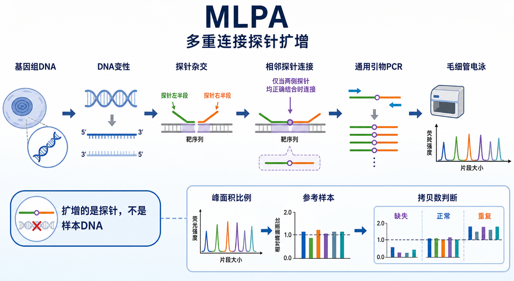

# MLPA

Multiplex ligation-dependent probe amplification（MLPA，多重连接探针扩增）是一种用“探针杂交 + 连接 + 通用引物 PCR + [DNA片段分析](DNA片段分析.md)”来检测多个目标区域相对拷贝数或甲基化状态的分子检测方法。它最常见的输出不是序列，而是每个探针峰的 [峰面积](../番外/补充知识/峰面积.md) 比例；这些比例再与 [参考样本](../番外/补充知识/参考样本.md) 和内部参考探针比较，用于判断 deletion（缺失）、duplication（重复）或 normal copy number（正常拷贝数）。



一句话理解：MLPA 的关键不是直接扩增样本 DNA，而是让两段相邻探针先在目标序列上正确结合，只有结合正确时才会被连接；后续 [PCR](PCR.md) 扩增的是“已连接探针”，再通过毛细管电泳峰面积来推断原始样本里对应区域的相对拷贝数。

## 实验发明历史与背景

MLPA 由 Schouten 等人在 2002 年系统提出，原始论文题为 *Relative quantification of 40 nucleic acid sequences by multiplex ligation-dependent probe amplification*。这篇文章的关键贡献是：用一对相邻 hybridizing probes（杂交探针）识别目标序列，只有两段探针都正确杂交并被连接后，才会被一对通用引物扩增；不同探针通过长度差异区分，因此一个反应可以同时检测多个目标序列。参考：[Schouten et al., 2002, Nucleic Acids Research](https://pubmed.ncbi.nlm.nih.gov/12060695/)。

现在 MLPA 最成熟的商品化体系来自 [MRC Holland](<../番外/试剂厂商/MRC Holland.md>) 的 SALSA MLPA 试剂盒生态。MRC Holland 的技术说明把 MLPA 描述为检测 DNA 序列拷贝数变化的 multiplex PCR 方法，并指出典型流程包括 DNA 变性、探针杂交、连接、PCR 扩增、片段分离和数据分析。参考：[MRC Holland MLPA Technique](https://www.mrcholland.com/technology/mlpa/technique)。

MLPA 的位置比较特殊：它不像 [Sanger测序](Sanger测序.md) 那样读碱基，也不像 quantitative PCR（[qPCR](qPCR.md)，定量 PCR）那样每个靶点单独定量，更不像 whole-genome sequencing（全基因组测序）那样全局扫描。它擅长在一组预设位点里做稳定、便宜、相对高通量的 copy number variation（[拷贝数变异](../番外/补充知识/拷贝数变异.md)，CNV）检测。

## 应用场景

| 应用 | 适合的问题 | MLPA 的优势 | 主要限制 |
|---|---|---|---|
| 外显子缺失/重复检测 | 某个基因的一个或多个外显子是否发生 [外显子缺失](../番外/补充知识/外显子缺失.md) 或 [外显子重复](../番外/补充知识/外显子重复.md) | 多个位点一次检测，成本低于大规模测序 | 只能检测 probe 覆盖区域 |
| 遗传病 CNV 验证 | NGS 或芯片发现的候选 CNV 是否真实 | 适合靶向验证和家系样本 | 不能发现 probe 外的新断点 |
| 肿瘤样本拷贝数分析 | 特定基因区域是否缺失或扩增 | 样本需求相对低，可做固定 panel | 肿瘤纯度、异质性和正常细胞混入会影响比例 |
| MS-MLPA | methylation-specific MLPA（[MS-MLPA](../番外/补充知识/MS-MLPA.md)，甲基化特异 MLPA）检测甲基化和拷贝数 | 同一体系同时看甲基化和剂量变化 | 依赖甲基化敏感酶切和位点设计 |
| 细胞系或模型验证 | 特定改造位点或基因拷贝是否符合预期 | 可作为靶向 QC | 不适合未知变异发现 |
| digitalMLPA | [digitalMLPA](../番外/补充知识/digitalMLPA.md) 用测序读数替代传统片段峰 | 位点数可更高，输出更数字化 | 依赖专用试剂盒和分析流程 |

## 实验目的

- 判断特定基因、外显子或基因组区域是否存在 CNV。
- 验证 NGS、array comparative genomic hybridization（aCGH，阵列比较基因组杂交）或染色体微阵列发现的候选缺失/重复。
- 比较样本与参考样本之间的目标探针剂量差异。
- 对 MS-MLPA 应用，同时判断目标区域的甲基化状态和拷贝数。
- 在临床遗传、肿瘤研究或模型细胞质控中，对一组预设区域做靶向检测。

## 简要实验原理

### 两段相邻探针识别同一个目标

每个 MLPA 靶点通常由一对 probe oligonucleotides（探针寡核苷酸）识别。两段探针分别与目标 DNA 上相邻区域杂交，只有当两段探针都正确结合并紧邻时，后续 [连接酶](<../材(实验耗材工具篇)/连接酶.md>) 才能把它们连接成一个完整探针。

这个设计让 MLPA 比普通 multiplex PCR 更不容易被“非特异扩增”欺骗：PCR 通用引物只能扩增已连接探针，未连接探针不会形成有效扩增模板。但这不代表 MLPA 不会出错；如果目标区域存在 SNP、短 indel、DNA 降解或杂交效率差，探针结合和连接效率仍可能下降。

### 扩增的是探针，不是样本 DNA

MLPA 的 PCR 阶段使用一对 universal primers（通用引物）扩增所有已连接探针。不同探针带有不同长度的 stuffer sequence（填充序列），所以 PCR 产物长度不同，可以通过毛细管电泳区分。

这点是理解 MLPA 的门槛：普通 PCR 产物长度通常来自样本模板本身；MLPA 的片段长度主要是探针设计出来的标签长度。因此 MLPA 峰大小主要用于识别“是哪一个探针”，峰面积比例才用于推断“这个目标区域相对有多少拷贝”。

### 峰面积比例和剂量商

capillary electrophoresis（CE，毛细管电泳）会把不同长度的荧光 MLPA 产物分离成 [片段峰](../番外/补充知识/片段峰.md)。软件读取每个峰的面积或强度，先做样本内归一化，再与参考样本比较，得到 dosage quotient（[剂量商](../番外/补充知识/剂量商.md)，DQ）或类似的探针比值。

理想情况下，二倍体样本中正常区域的相对比例接近 1；杂合缺失常接近 0.5；杂合重复常接近 1.5。但实际判读必须按试剂盒说明、实验室验证阈值和软件 QC 指标来做，不能只用一个固定数字判断所有样本。

### 为什么需要参考探针和参考样本

MLPA 不是绝对定量。每个探针的扩增效率、染料信号、片段长度和样本 DNA 质量都会影响峰面积。因此结果必须经过两层校正：

- 样本内校正：用 reference probes（[参考探针](../番外/补充知识/参考探针.md)）校正总体 DNA 输入和反应效率。
- 样本间校正：用 reference samples（参考样本）建立正常剂量基线。

MRC Holland 的支持资料也强调，MLPA/digitalMLPA 实验应包括阴性 DNA 对照、阳性 DNA 对照、参考样本、no-DNA control 和 binning DNA 等不同类型对照，用于监控实验质量和数据解释。参考：[MRC Holland - MLPA control samples](https://support.mrcholland.com/kb/articles/what-control-samples-should-be-included-in-mlpa-and-digitalmlpa-experiments)。

## 所需试剂、耗材和设备

| 类别 | 常用内容 | 作用 | 注意事项 |
|---|---|---|---|
| 样本 | genomic DNA（基因组 DNA）、formalin-fixed paraffin-embedded DNA（[FFPE](../番外/补充知识/FFPE.md)，福尔马林固定石蜡包埋 DNA）、血液/组织/细胞提取 DNA | 提供待检测目标序列 | DNA 降解、盐、EDTA、PCR 抑制物会影响杂交和扩增 |
| 试剂盒 | [SALSA MLPA试剂盒](<../材(实验耗材工具篇)/SALSA MLPA试剂盒.md>) 或同类体系 | 提供探针、buffer、酶和通用扩增体系 | 不同 probe mix 的范围和质控要求不同 |
| 探针 | [MLPA探针混合物](<../材(实验耗材工具篇)/MLPA探针混合物.md>) | 定义检测位点和片段长度 | probe 覆盖范围决定能检测什么 |
| 连接体系 | 连接酶和连接 buffer | 只连接正确相邻杂交的探针 | 连接失败会让目标峰系统性变低 |
| PCR 体系 | [DNA聚合酶](<../材(实验耗材工具篇)/DNA聚合酶.md>)、[dNTP](<../材(实验耗材工具篇)/dNTP.md>)、荧光通用引物 | 扩增已连接探针 | PCR 过量会导致峰饱和和比例偏移 |
| 上机体系 | [Hi-Di甲酰胺](<../材(实验耗材工具篇)/Hi-Di甲酰胺.md>)、[尺寸标准品](<../材(实验耗材工具篇)/尺寸标准品.md>)、荧光内标 | 变性、定尺、片段分离 | 内标错配会导致 size calling 失败 |
| 仪器 | [热循环仪](<../材(实验耗材工具篇)/热循环仪.md>)、[毛细管测序仪](<../材(实验耗材工具篇)/毛细管测序仪.md>) | 完成杂交/连接/PCR 和片段分析 | 仪器型号、run module 和染料组必须记录 |
| 耗材 | [96孔板](<../材(实验耗材工具篇)/96孔板.md>)、[封板膜](<../材(实验耗材工具篇)/封板膜.md>)、低吸附管、无核酸酶水、TE buffer（[TE缓冲液](<../材(实验耗材工具篇)/TE缓冲液.md>)） | 减少蒸发、污染和样本损失 | 低体积长时间杂交尤其怕蒸发 |
| 软件 | [Coffalyser.Net](<../材(实验耗材工具篇)/Coffalyser.Net.md>) 或经验证的 MLPA 分析软件 | 做片段识别、归一化和剂量判断 | 软件版本、analysis template 和 quality flag 要记录 |
| 对照 | [阴性对照](../番外/补充知识/阴性对照.md) DNA、[阳性对照](../番外/补充知识/阳性对照.md) DNA、参考样本、[no-DNA对照](../番外/补充知识/no-DNA对照.md)、[binning DNA](../番外/补充知识/binning DNA.md) | 监控污染、反应效率、分型边界和批次偏移 | 对照不足时不要做强结论 |

## 实验设计

### 选择合适 probe mix

MLPA 的检测边界由 probe mix 决定。选择试剂盒时先问：

- 目标基因或区域是否被 probe 覆盖。
- 每个外显子是否都有 probe，还是只覆盖关键外显子。
- 是否含 reference probes 和 quality control fragments。
- 是否支持 FFPE、肿瘤样本或甲基化检测。
- 该 kit 是否适合研究用途、临床验证用途，还是需要实验室自行验证。

不要把“MLPA 能检测 CNV”理解成“MLPA 能发现所有 CNV”。probe 没覆盖的区域、平衡易位、低比例 mosaicism（嵌合）、复杂结构变异或精确断点通常不是 MLPA 的强项。

### 样本和参考样本必须同批思考

MLPA 结果依赖参考样本。参考样本应尽量与待测样本在来源、提取方式、DNA 质量和保存状态上接近。肿瘤、FFPE 或低质量样本如果拿高质量外周血 DNA 做参考，可能产生系统性偏差。

### 不要只看一个探针

单个探针异常可能来自真实 CNV，也可能来自探针结合位点 SNP、局部 DNA 质量问题或分析阈值。更稳妥的判断通常需要：

- 同一外显子或邻近区域多个探针支持。
- 与临床/实验背景一致。
- 必要时用 qPCR、ddPCR、NGS CNV、Sanger 或另一套 MLPA probe mix 验证。

### MS-MLPA 需要额外理解甲基化酶切

MS-MLPA 在普通 MLPA 基础上加入 methylation-sensitive restriction enzyme（甲基化敏感限制性内切酶）逻辑。未甲基化位点被酶切后不能有效扩增，甲基化位点受保护而保留信号。因此 MS-MLPA 的峰比例同时包含“拷贝数”和“甲基化状态”信息，必须按专门分析规则解释。

## 实验操作

下面是通用模块化 workflow。正式实验必须以 kit-specific protocol（试剂盒专用 protocol）和实验室验证 SOP 为准，尤其是样本输入量、温度、时间、酶量、PCR 循环数和软件阈值。

### 样本 DNA 质控

做法：

- 提取 genomic DNA，记录样本类型、提取方法、浓度、A260/A280、A260/A230、保存条件和冻融次数。
- 尽量使用完整、纯净、浓度合适的 DNA。
- 对 FFPE、低量或降解样本，先确认所用 MLPA kit 是否支持该样本类型。

意义：

MLPA 的第一步是探针与样本 DNA 杂交。DNA 降解、交联、盐残留或抑制物会让多个探针同时变弱，表现为整体峰低、参考探针不稳定或重复性差。

替代策略：

- DNA 质量不稳定时，先做短片段 qPCR 或片段分析质控。
- 样本珍贵时，优先做小规模预实验而不是一次性跑完整批。
- FFPE 样本尽量选择验证过的 FFPE-compatible kit 和匹配参考样本。

### DNA 变性和探针杂交

做法：

- 将样本 DNA 变性，使双链 DNA 分开。
- 加入 MLPA probe mix，让左右两段探针与目标序列相邻杂交。
- 防止蒸发、污染和孔位错误。

意义：

杂交是 MLPA 的特异性来源。探针必须同时识别目标区域，且两段探针在目标 DNA 上相邻，后续才能连接。杂交效率差会导致特定探针峰降低，看起来像缺失。

替代策略：

- 若某个探针反复异常，可检查该区域是否存在 SNP/indel 干扰探针结合。
- 如果整批峰低，优先检查 DNA 质量、杂交条件、试剂保存和封板是否可靠。

### 探针连接

做法：

- 在杂交体系中加入连接酶和连接 buffer。
- 只有左右两段探针都正确结合且相邻时才会被连接。
- 停止连接反应后进入 PCR。

意义：

连接步骤决定“错误结合的探针能不能进入扩增”。连接效率低会导致目标峰和参考峰整体偏低；某些目标局部杂交异常会表现为单个或少数探针峰降低。

替代策略：

- 如果阳性/参考样本都异常，先考虑连接体系或酶活问题。
- 如果只有某个样本异常，先考虑 DNA 质量、突变干扰、局部缺失或样本处理差异。

### 通用引物 PCR

做法：

- 用通用荧光引物扩增所有已连接探针。
- 控制扩增在线性范围内，避免峰饱和。
- 设置 no-DNA control 监控污染。

意义：

PCR 阶段放大的是连接探针数量差异。PCR 过度会压缩不同探针之间的比例差异，造成峰面积不再忠实反映原始剂量；污染则会在 no-DNA control 中出现峰。

替代策略：

- 峰过高或饱和时，优先按 SOP 调整稀释或重跑，不要只在软件里改阈值。
- 如果 no-DNA control 有峰，整批数据需要谨慎，通常要追查污染来源。

### 毛细管电泳片段分析

做法：

- 将 PCR 产物与 Hi-Di 甲酰胺和尺寸标准品混合。
- 变性上样，使用合适的毛细管电泳 run module。
- 导出原始 peak data 或指定软件兼容文件。

意义：

毛细管电泳负责把不同长度的 MLPA 产物变成可识别的片段峰。峰大小用来识别探针，峰面积用来做剂量分析。内标失败、run module 错误、信号过载或毛细管状态差都会影响数据。

替代策略：

- 若只是个别孔内标失败，可考虑重上机。
- 若整板内标或峰形异常，先排查仪器、聚合物、内标、甲酰胺和上样板。

### Coffalyser.Net 数据分析

做法：

- 将 fragment analysis 数据导入 Coffalyser.Net 或经验证的软件。
- 使用正确的 kit definition、binning file、analysis template 和参考样本组。
- 先看质量控制，再看探针比值和剂量商。

意义：

MLPA 分析不是简单比峰高。软件会做大小识别、峰面积计算、样本内归一化、样本间归一化和质量标记。MRC Holland 的技术资料说明 MLPA 结果可通过 Coffalyser.Net 进行高级质量控制和数据分析。参考：[MRC Holland MLPA Technique](https://www.mrcholland.com/technology/mlpa/technique)。

替代策略：

- 对边界结果，不要只依赖自动结论；检查原始峰图、参考样本、相邻探针和重复实验。
- 若不同软件结果冲突，优先回到原始峰图和实验设计检查。

## 结果解析

| 结果类型 | 常见表现 | 解读重点 | 不能忽略的问题 |
|---|---|---|---|
| 正常拷贝数 | 目标探针剂量商接近正常范围 | 目标峰与参考探针和参考样本一致 | 正常结果只覆盖 probe 覆盖区域 |
| 杂合缺失 | 一个或多个目标探针比例降低，常接近 0.5 | 多个相邻探针支持更可信 | 单探针降低可能是 SNP 或技术问题 |
| 重复 | 一个或多个目标探针比例升高，常接近 1.5 | 与相邻探针、样本背景和阈值一致 | 肿瘤样本纯度会稀释信号 |
| 全基因缺失/重复 | 多个目标探针同向变化 | 参考探针必须稳定 | 染色体水平异常需结合其他方法 |
| 甲基化异常 | MS-MLPA 中酶切相关峰保留或消失异常 | 要区分甲基化变化和拷贝数变化 | 酶切不完全会造成假阳性 |
| 边界结果 | DQ 处于阈值附近 | 重复实验或替代方法确认 | 不应给强结论 |

实际解读建议：

- 先看 no-DNA control，排除污染。
- 再看阳性对照、阴性 DNA 对照和参考样本是否符合预期。
- 再看每个样本的 quality flag、峰形、峰面积分布和内标。
- 然后判断目标探针是否呈现一致方向变化。
- 最后结合样本类型、疾病/模型背景和其他检测结果给结论。

## 异常结果和可能原因

| 异常 | 常见表现 | 可能原因 | 处理思路 |
|---|---|---|---|
| 全部峰弱 | 目标峰和参考峰都低 | DNA 降解、杂交失败、连接失败、PCR 抑制 | 检查 DNA 质量、酶活、封板、温控和试剂保存 |
| 参考探针不稳定 | reference probes 波动大 | 样本质量差、参考样本不匹配、全局 CNV | 换参考样本组，检查样本类型和软件 QC |
| 单探针降低 | 只有一个探针低 | 真实小缺失、探针结合位点 SNP、局部质量问题 | 查相邻探针，必要时 Sanger 或其他方法验证 |
| 多个相邻探针降低 | 连续区域比例下降 | 真实缺失可能性较高 | 结合基因结构和其他方法确认 |
| 峰过高或饱和 | 主峰平顶、面积异常 | PCR 过量、样本过浓、进样过多 | 按 SOP 稀释或重跑 |
| no-DNA 对照有峰 | 空白孔出现 MLPA 峰 | PCR 产物污染、加样污染 | 重配反应，清洁分区，检查耗材 |
| 样本间整体偏移 | 同批样本一起偏高或偏低 | 参考样本选择不当、批次效应、软件模板错 | 重新选择参考组或重分析 |
| MS-MLPA 假异常 | 甲基化峰异常但拷贝数不一致 | 酶切不完全、DNA 质量差、位点附近变异 | 检查酶切控制和重复实验 |

## MLPA vs qPCR/ddPCR/NGS CNV/染色体微阵列

| 方法 | 最适合 | 优势 | 局限 |
|---|---|---|---|
| MLPA | 一个或多个基因的外显子级 CNV 检测 | 多位点、成本适中、解释相对直观 | 只能看 probe 覆盖区域，依赖参考样本 |
| qPCR | 少数位点定量验证 | 快、便宜、实验室常见 | 多位点扩展麻烦，归一化敏感 |
| [ddPCR](ddPCR.md) | 少数关键 CNV 或低比例变异定量 | 数字化、绝对定量能力强 | 位点少，成本较高 |
| [NGS CNV分析](NGS CNV分析.md) | 大 panel 或全外显子/全基因组 CNV 扫描 | 覆盖广，可同时看 SNV/indel | 算法和覆盖均一性影响大，常需验证 |
| [染色体微阵列](染色体微阵列.md) | 全基因组较大片段 CNV | 全局视野好 | 分辨率和小外显子 CNV 受限 |
| Sanger 测序 | 点突变或短 indel 验证 | 读序列直观 | 不适合外显子级拷贝数定量 |

## 记录模板

中文记录：

```text
实验名称：
样本编号：
样本类型：
DNA 提取方法：
DNA 浓度与质量：
MLPA kit / probe mix：
试剂批号：
参考样本编号：
阳性/阴性 DNA 对照：
no-DNA 对照：
热循环仪型号：
毛细管测序仪型号：
内标/尺寸标准品：
软件与版本：
analysis template / kit definition：
主要异常探针：
剂量商范围：
质量控制标记：
结论：
是否需要验证：
```

English record:

```text
Experiment name:
Sample ID:
Sample type:
DNA extraction method:
DNA concentration and quality:
MLPA kit / probe mix:
Reagent lot number:
Reference sample IDs:
Positive/negative DNA controls:
No-DNA control:
Thermal cycler model:
Capillary electrophoresis instrument:
Internal size standard:
Software and version:
Analysis template / kit definition:
Abnormal probes:
Dosage quotient range:
Quality control flags:
Conclusion:
Need for orthogonal validation:
```

## 购买和平台建议

- 优先选用目标适配的成熟 probe mix，而不是先买通用试剂再临时设计逻辑。
- 记录 MRC Holland 或其他供应商、kit 名称、probe mix 编号、版本、批号和适用样本类型。
- 同一项目尽量使用同一批 probe mix、同一分析模板和稳定参考样本组。
- 对临床或准临床用途，必须使用实验室验证过的 SOP、阈值和报告规范。
- 如果研究目标是发现未知 CNV，MLPA 不应作为第一选择；可先用 NGS CNV、染色体微阵列或其他全局方法筛查，再用 MLPA 验证。

## 总结

MLPA 是一种非常适合“靶向、多位点、相对拷贝数检测”的方法。它最重要的理解点有三个：第一，连接依赖相邻探针正确杂交；第二，PCR 扩增的是已连接探针，不是样本 DNA 本身；第三，结果靠峰面积比例和参考样本归一化，不是直接读序列。它适合检测预设区域的外显子缺失/重复、基因剂量改变和 MS-MLPA 甲基化问题，但不适合发现 probe 覆盖之外的未知结构变异。

## 参考来源

- Schouten JP et al. [Relative quantification of 40 nucleic acid sequences by multiplex ligation-dependent probe amplification](https://pubmed.ncbi.nlm.nih.gov/12060695/). *Nucleic Acids Research*. 2002.
- MRC Holland: [MLPA Technique](https://www.mrcholland.com/technology/mlpa/technique)
- MRC Holland Support: [Protocols & Manuals](https://support.mrcholland.com/downloads/protocols-manuals)
- MRC Holland Support: [What control samples should be included in MLPA and digitalMLPA experiments?](https://support.mrcholland.com/kb/articles/what-control-samples-should-be-included-in-mlpa-and-digitalmlpa-experiments)
