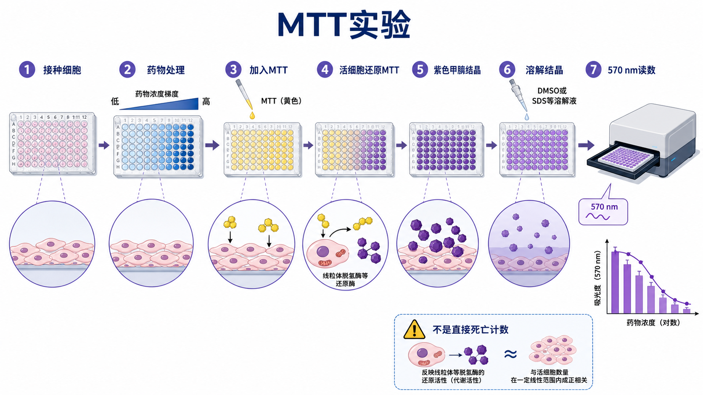

# MTT实验

MTT assay（MTT 实验；MTT 比色法）是一种经典的 tetrazolium-based cell viability assay（四唑盐类细胞活性检测），常用于评估药物、转染、材料浸提液或培养条件对细胞短期代谢活性的影响。它属于 [细胞毒性检测](细胞毒性检测.md) 的代谢型 readout，不等同于直接死亡计数，也不能替代长期的 [克隆形成实验](克隆形成实验.md)。

MTT 的英文全称是 [3-(4,5-dimethylthiazol-2-yl)-2,5-diphenyltetrazolium bromide](<../材(实验耗材工具篇)/MTT.md>)，中文常译作 3-(4,5-二甲基噻唑-2-基)-2,5-二苯基四氮唑溴盐。活细胞可将黄色 MTT 还原为紫色、不溶性的 [formazan](../番外/补充知识/甲臜.md)（甲臜）结晶，结晶溶解后在约 570 nm 读取吸光度。



图：MTT 实验的核心逻辑是接种细胞、处理、加入 MTT、形成紫色甲臜结晶、溶解结晶并在 570 nm 附近读数。读数主要反映细胞代谢还原活性和活细胞数量之间的近似关系。

## 方法历史与背景

MTT 实验的经典基础来自 Mosmann 1983 年发表的 rapid colorimetric assay（快速比色法），用于 cellular growth and survival（细胞生长与存活）分析。该方法推动了多孔板细胞活性检测的普及，因为它能把细胞状态转化为可用 [酶标仪](<../材(实验耗材工具篇)/酶标仪.md>) 读取的颜色信号。参考：[Mosmann, *Journal of Immunological Methods*, 1983](https://pubmed.ncbi.nlm.nih.gov/6606682/)。

MTT 现在仍常见于教学、低成本筛选和经典文献复现实验。但它需要溶解不溶性甲臜结晶，步骤比 [CCK-8实验](CCK-8实验.md) 更繁琐，也更容易受结晶溶解、细胞贴壁状态和操作均一性影响。

## 应用场景

| 场景 | 适合程度 | 说明 |
| --- | --- | --- |
| 药物初筛 | 适合 | 成本低，适合做浓度范围摸索 |
| 细胞增殖/活性比较 | 适合但需谨慎 | 信号受代谢状态影响 |
| 材料浸提液毒性 | 可用 | 需要设置材料/培养基背景孔 |
| 强颜色或强还原性药物 | 不优先 | 药物可能干扰吸光度或还原反应 |
| 后续继续培养同一孔细胞 | 不适合 | MTT 通常是终点实验 |
| 长期再增殖能力 | 不适合 | 应使用克隆形成实验 |

## 实验目的

MTT 实验主要用于：

- 比较处理组和对照组的短期细胞代谢活性；
- 建立药物剂量反应曲线；
- 粗略估算 [IC50](../番外/补充知识/IC50.md)；
- 为 Western blot、RT-qPCR、免疫荧光或克隆形成实验选择处理浓度；
- 判断处理条件是否产生明显非特异毒性。

## 简要实验原理

MTT 是黄色四唑盐。活细胞内的还原体系，尤其与线粒体和细胞内脱氢酶相关的还原活性，可将 MTT 转化为紫色甲臜结晶。由于甲臜不溶于普通培养基，实验后需要用 [DMSO](<../材(实验耗材工具篇)/DMSO.md>)、SDS 溶解液或其他 solubilization solution（溶解液）将结晶溶解，再测定吸光度。

在合适线性范围内：

```text
MTT absorbance ∝ viable cell number × reducing/metabolic activity per cell
```

这句话很关键。MTT 读数不是纯粹细胞数，也不是纯粹死亡比例。一个处理如果降低线粒体还原能力，即使细胞尚未死亡，MTT 也可能下降。

## MTT vs CCK-8

| 比较点 | MTT实验 | CCK-8实验 |
| --- | --- | --- |
| 核心试剂 | MTT | WST-8 |
| 产物 | 不溶性紫色甲臜结晶 | 水溶性橙色甲臜 |
| 是否需要溶解步骤 | 通常需要 | 通常不需要 |
| 常见读数波长 | 约 570 nm | 约 450 nm |
| 操作复杂度 | 较高 | 较低 |
| 成本 | 常较低 | 常较高 |
| 对贴壁细胞扰动 | 溶解/吸液步骤可能增加扰动 | 通常更温和 |
| 主要共同误区 | 都是代谢还原读数，不是直接死亡计数 | 都是代谢还原读数，不是直接死亡计数 |

如果实验只需要快速、稳定地获得短期活性曲线，CCK-8 往往更方便；如果预算有限、需要复现经典文献或已有成熟 MTT 条件，MTT 仍可使用。

## 所需试剂与器材

| 类别 | 常用内容 | 作用 |
| --- | --- | --- |
| 细胞 | 贴壁或悬浮细胞 | 待检测对象 |
| 培养耗材 | [细胞培养板](<../材(实验耗材工具篇)/细胞培养板.md>)，常用 96 孔板 | 建立剂量梯度和重复孔 |
| 处理因素 | 药物、材料浸提液、转染条件等 | 产生待评估效应 |
| MTT 溶液 | MTT 粉末配制或商品化溶液 | 被活细胞还原形成甲臜 |
| 溶解液 | DMSO、SDS-HCl 等 | 溶解紫色甲臜结晶 |
| 读板设备 | 酶标仪 | 读取约 570 nm 吸光度 |
| 对照 | 空白孔、未处理、溶剂、阳性毒性、药物背景孔 | 归一化和排除干扰 |

## 实验操作

### 细胞接种

**怎么做**：按预实验确定的密度将细胞接种到 96 孔板。贴壁细胞通常恢复一夜后再处理；悬浮细胞需要确保每孔细胞数均一。

**为什么重要**：MTT 信号必须落在线性范围内。细胞太少会接近背景，细胞太多会饱和或因营养不足导致非药物效应。

**注意事项**：避免边缘孔蒸发影响；同一板内尽量保持接种体积和细胞混匀方式一致。

**替代方案**：如果细胞增殖很快，可降低接种量或缩短处理时间；若细胞增殖慢，可适当提高接种量或延长观察时间。

**可能出错的结果**：重复孔差异大，常来自接种不均、细胞沉降、气泡或边缘效应。

### 药物或条件处理

**怎么做**：设置合适浓度梯度和处理时间，保持所有孔最终溶剂浓度一致。处理结束前记录细胞形态和是否有药物沉淀。

**为什么重要**：MTT 对药物颜色、沉淀、还原性和细胞代谢状态都敏感。没有背景孔时，很难判断信号变化是否来自细胞本身。

**注意事项**：强颜色药物、纳米材料、植物提取物、还原性化合物可能直接干扰读数，需要 drug-only blank（药物背景孔）。

**替代方案**：若干扰严重，可换用 ATP assay、LDH release 或成像法。

### 加入 MTT 并孵育

**怎么做**：向每孔加入 MTT 溶液，通常孵育数小时，直到形成可检测紫色结晶。具体浓度和时间以试剂说明或预实验为准。

**为什么重要**：孵育时间决定信号强度。过短信号不足，过长则高细胞数孔可能饱和。

**注意事项**：MTT 溶液需避光保存，使用前检查是否有污染或沉淀。不同细胞还原能力差异很大，不应直接照搬其他细胞系条件。

**可能出错的结果**：所有孔颜色都很浅，可能是细胞数太少、MTT 失效、孵育不足或细胞状态差。

### 溶解甲臜结晶

**怎么做**：小心去除上清或按方案直接加入溶解液，使紫色甲臜完全溶解。读板前确保孔内颜色均匀、无明显结晶残留和气泡。

**为什么重要**：MTT 与 CCK-8 最大的操作差异就在这里。结晶未完全溶解会造成孔间差异和读数不稳定。

**注意事项**：贴壁差的细胞在吸液时可能被带走；DMSO 挥发和孔间混匀差异也会影响结果。

**替代方案**：如果溶解步骤总是不稳定，可考虑改用 CCK-8 或 WST-1。

### 读板与归一化

**怎么做**：常在 570 nm 左右读取吸光度，部分方案会使用 630-690 nm 作为 reference wavelength（参考波长）扣除背景。归一化到溶剂对照。

常见公式：

```text
Relative viability (%) =
(treated OD - blank OD) /
(vehicle control OD - blank OD) × 100
```

**注意事项**：不同试剂盒和仪器推荐波长可能略有差异，正式记录必须写清楚读板波长。

## 结果解析

MTT 下降可以表示活细胞数减少、代谢还原能力下降、增殖变慢或细胞死亡增加。严谨写法应是“MTT signal decreased”或“relative metabolic activity/viability decreased”，不要只凭 MTT 写“细胞死亡增加”。

若要解释药物毒性，建议同时观察：

- 显微镜形态；
- 细胞计数或活率；
- LDH release；
- Annexin V/PI；
- 克隆形成实验。

## 常见错误与 troubleshooting

| 问题 | 可能原因 | 处理 |
| --- | --- | --- |
| 重复孔差异大 | 接种不均、结晶溶解不完全、气泡 | 优化接种和溶解步骤，读板前检查气泡 |
| 高浓度药物读数异常升高 | 药物颜色/还原性干扰 | 设置 drug-only blank，换 assay 验证 |
| 所有孔颜色很浅 | 细胞少、MTT 失效、孵育不足 | 做细胞数线性范围测试，检查 MTT 储存 |
| 低剂量和高剂量差异不明显 | 药物浓度范围不合适或细胞不敏感 | 扩大梯度，延长或缩短处理时间 |
| 结晶难溶 | 溶解液不足、混匀不足、结晶太多 | 延长振荡或调整溶解液，避免过高细胞数 |
| 结果和 CCK-8 不一致 | 两者都受代谢影响，但操作和产物不同 | 结合细胞形态、ATP 或 LDH 判断 |

## 记录模板

中文记录模板：

```text
细胞系：
传代数：
接种密度：
板型：
处理因素：
浓度梯度：
处理时间：
MTT 来源/批号：
MTT 终浓度：
MTT 孵育时间：
溶解液：
读板波长：
空白孔：
溶剂对照：
阳性毒性对照：
归一化方式：
主要结果：
异常情况：
下一步验证：
```

English record template:

```text
Cell line:
Passage number:
Seeding density:
Plate format:
Treatment:
Dose range:
Treatment duration:
MTT source/lot:
Final MTT concentration:
MTT incubation time:
Solubilization solution:
Reading wavelength:
Blank wells:
Vehicle control:
Positive cytotoxicity control:
Normalization method:
Main result:
Unexpected observations:
Next validation:
```

## 小结

MTT 实验的优点是经典、成本低、文献基础丰富；缺点是需要溶解不溶性甲臜结晶，操作变量较多。它适合评估短期代谢活性和初筛毒性窗口，但不能单独证明细胞死亡机制，也不能等同于长期克隆形成能力。

## 参考来源

- Mosmann T. Rapid colorimetric assay for cellular growth and survival: application to proliferation and cytotoxicity assays. *Journal of Immunological Methods*. 1983. [PubMed](https://pubmed.ncbi.nlm.nih.gov/6606682/)
- Abcam. MTT assay protocol. [Abcam](https://www.abcam.com/protocols/mtt-assay-protocol)
- Thermo Fisher Scientific. Vybrant MTT Cell Proliferation Assay Kit. [Thermo Fisher](https://www.thermofisher.com/order/catalog/product/V13154)
