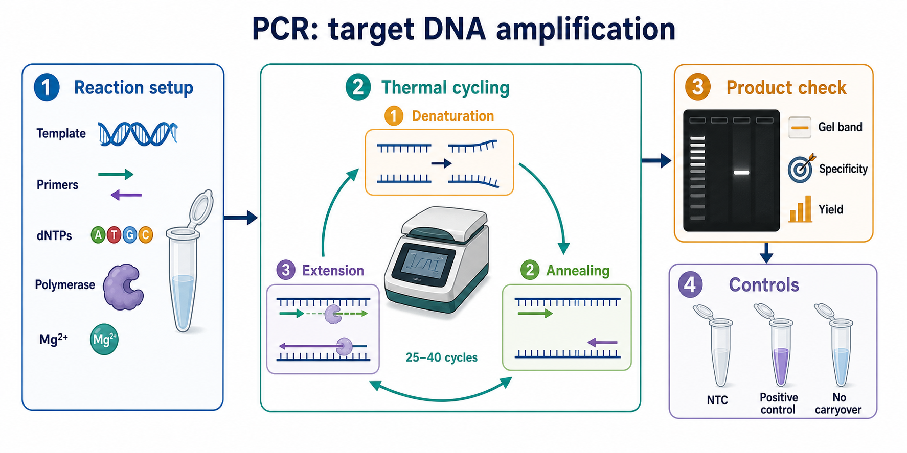
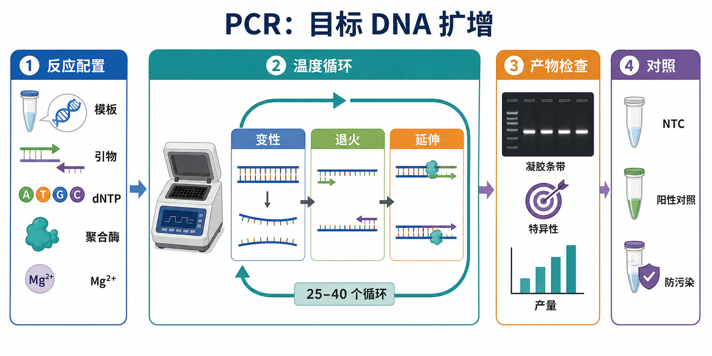

# PCR

PCR（polymerase chain reaction，聚合酶链式反应）是一种在体外用 DNA polymerase（DNA 聚合酶）和温度循环扩增特定 DNA 片段的基础分子生物学实验。它可以把少量目标模板放大到足以检测、克隆、测序或进一步分析的水平。





一句话理解：PCR 不是“复制所有 DNA”，而是在 forward primer（正向引物）和 reverse primer（反向引物）圈定的区域内，利用 repeated thermal cycling（重复温度循环）选择性扩增目标 [扩增子](../番外/补充知识/扩增子.md)。

## 实验发明历史

PCR 由 Kary B. Mullis 在 1980 年代提出。1993 年，Kary Mullis 因发明 PCR 与 Michael Smith 因寡核苷酸定点诱变相关工作共同获得诺贝尔化学奖。Nobel Prize 官方介绍将 PCR 描述为能够从极少量遗传材料中复制大量 DNA 的方法。参考：[Nobel Prize in Chemistry 1993](https://www.nobelprize.org/prizes/chemistry/1993/summary/)

PCR 的实际普及还依赖 thermostable DNA polymerase（耐热 DNA 聚合酶），尤其是来自 Thermus aquaticus 的 Taq DNA polymerase（[Taq DNA聚合酶](<../材(实验耗材工具篇)/Taq DNA聚合酶.md>)）。耐热聚合酶让反应可以反复经历高温变性，而不需要每个循环重新加酶。后来又发展出 [高保真DNA聚合酶](<../材(实验耗材工具篇)/高保真DNA聚合酶.md>)、hot-start polymerase（热启动聚合酶）和多种 master mix，使 PCR 从方法学创新变成了日常实验入口。

## 应用场景

| 场景 | PCR 回答的问题 | 典型后续 |
| --- | --- | --- |
| 目标片段检测 | 样本中是否存在某段 DNA | [琼脂糖凝胶电泳](琼脂糖凝胶电泳.md)看条带 |
| 克隆构建 | 能否扩增出插入片段或载体片段 | [PCR产物纯化](PCR产物纯化.md)、[凝胶回收](凝胶回收.md)、连接或组装 |
| 菌落筛选 | 菌落是否含目标插入片段 | [菌落PCR](<菌落PCR.md>) 后挑阳性克隆 |
| 基因分型 | 某个位点或片段大小是否符合预期 | 电泳、Sanger 测序或片段分析 |
| 测序前扩增 | 是否获得可测序模板 | [Sanger测序](Sanger测序.md)、NGS 文库扩增 |
| RT-PCR | RNA 先逆转录为 cDNA 后检测是否有目标转录本 | [逆转录](逆转录.md)、终点 PCR |
| qPCR 前方法理解 | 理解扩增循环、引物和特异性 | [qPCR](qPCR.md)、[RT-qPCR](<RT-qPCR.md>) |

PCR 最适合回答“预设目标是否存在、大小是否正确、能否得到片段”。如果想实时定量，应使用 qPCR；如果模板来自 RNA 并要定量表达，应使用 RT-qPCR；如果想做绝对分子计数，可考虑 [ddPCR](ddPCR.md) 或其他数字 PCR。

## 实验目的

常规 PCR 的目的通常包括：

| 目的 | 输出结果 | 质量判断 |
| --- | --- | --- |
| 检测目标 DNA | 有无目标条带 | 条带大小正确，阴性对照无条带 |
| 获得目标片段 | PCR 产物 | 单一清晰条带，产量足够 |
| 为克隆提供 insert | 纯化后的 PCR 片段 | 序列正确，无明显非特异产物 |
| 验证构建或编辑 | 特定大小或特定引物组合扩增 | 与预期条带模式一致 |
| 测序前扩增 | 适合测序的单一模板 | 背景低、引物特异、浓度合适 |

需要特别注意：普通 PCR 的凝胶条带通常只能做 semi-quantitative（半定量）或 qualitative（定性）判断。条带亮并不严格等于起始模板多，因为终点 PCR 到后期会进入 plateau phase（平台期），底物、酶活和产物竞争都会影响最终条带强度。

## 简要实验原理

PCR 的基本循环由三步构成。

| 阶段 | 常见温度逻辑 | 发生什么 | 关键变量 |
| --- | --- | --- | --- |
| Denaturation（变性） | 约 94-98°C | 双链 DNA 解链成单链 | 模板 GC、酶耐热性、时间 |
| Annealing（退火） | 由引物 Tm 决定 | 引物与模板互补结合 | [退火温度](../番外/补充知识/退火温度.md)、引物特异性 |
| Extension（延伸） | 由聚合酶决定，常见 68-72°C | 聚合酶从引物 3' 端合成新链 | 片段长度、酶速度、Mg2+、dNTP |

Thermo Fisher 的 PCR basics 把 PCR 概括为模板、引物、dNTP、DNA polymerase、buffer 和 Mg2+ 在热循环中完成变性、退火和延伸。NEB 的 Phusion routine PCR protocol 也采用 initial denaturation、cycling、final extension 的结构，并强调退火温度、延伸时间、循环数和模板类型需要根据反应优化。参考：[Thermo Fisher PCR basics](https://www.thermofisher.com/us/en/home/life-science/pcr/pcr-education/pcr-reagents-enzymes/pcr-basics.html)；[NEB Phusion routine PCR protocol](https://www.neb.com/en-us/protocols/0001/01/01/pcr-protocol-m0530)

从理论上看，理想 PCR 每个循环目标片段加倍，n 个循环后可接近 2^n 倍扩增。但真实 PCR 会受到模板量、引物退火、酶活、底物耗竭、产物再退火和抑制物影响，所以后期不再指数增长。

## 所需试剂、耗材与设备

| 类别 | 常用内容 | 作用 | 注意事项 |
| --- | --- | --- | --- |
| 模板 DNA | genomic DNA、plasmid、cDNA、菌落裂解物、PCR 产物 | 提供待扩增序列 | 过多模板可能增加非特异扩增或抑制反应 |
| 引物 | [PCR引物](<../材(实验耗材工具篇)/PCR引物.md>) | 决定扩增区域 | 检查 Tm、GC、二聚体、特异性和扩增子长度 |
| DNA 聚合酶 | [DNA聚合酶](<../材(实验耗材工具篇)/DNA聚合酶.md>)、Taq、高保真酶 | 合成新 DNA 链 | 克隆和测序优先考虑高保真酶 |
| dNTP | [dNTP](<../材(实验耗材工具篇)/dNTP.md>) | DNA 合成底物 | 浓度过高可能影响 Mg2+ 平衡 |
| Mg2+ | [氯化镁](<../材(实验耗材工具篇)/氯化镁.md>) 或 kit 内置 Mg2+ | 聚合酶活性必需因子 | 过高增加非特异，过低产量低 |
| PCR buffer | [PCR缓冲液](<../材(实验耗材工具篇)/PCR缓冲液.md>) 或 master mix 内置 buffer | 维持 pH、盐和酶活环境 | 不同酶的 buffer 不能随意互换 |
| Master mix | [PCR Master Mix](<../材(实验耗材工具篇)/PCR Master Mix.md>) | 预混酶、buffer、Mg2+、dNTP | 减少移液误差，灵活性较低 |
| 水 | [无核酸酶水](<../材(实验耗材工具篇)/无核酸酶水.md>) | 补足反应体积 | 避免 DNA/RNase/DNase 污染 |
| 反应耗材 | [PCR管](<../材(实验耗材工具篇)/PCR管.md>)、八联管、PCR 板 | 承载反应体系 | 管盖密封性影响蒸发 |
| 仪器 | [PCR仪](<../材(实验耗材工具篇)/PCR仪.md>) | 执行温度循环 | 梯度 PCR 可优化退火温度 |
| 检测 | [DNA Ladder](<../材(实验耗材工具篇)/DNA Ladder.md>)、Loading Dye、琼脂糖凝胶、电泳槽、凝胶成像系统 | 判断大小和产物质量 | 染料和蓝光/紫外方式影响安全与切胶 |

## 实验操作

### 设计 PCR 问题和扩增子

怎么做：先明确 PCR 要回答什么问题：检测有无、扩增克隆片段、筛选菌落、基因分型，还是测序前扩增。然后确定模板类型、目标区域、预期产物大小和后续用途。

为什么重要：PCR 参数不是孤立设置的。克隆用 PCR 更关注保真度和末端设计；筛选用 PCR 更关注速度和阳性/阴性判读；测序前 PCR 更关注单一条带和低背景。

注意事项：

| 判断点 | 建议 |
| --- | --- |
| 产物大小 | 常规 PCR 片段越长，对酶和延伸时间要求越高 |
| GC 含量 | GC-rich 模板可能需要添加剂或特殊酶 |
| 后续用途 | 克隆、突变分析和测序尽量用高保真酶 |
| 模板类型 | 基因组 DNA、质粒和 cDNA 的复杂度不同 |
| 对照设计 | 必须预设阴性对照和阳性对照 |

可能出错：没有先定义“预期条带大小”，最后看到条带也不知道是否正确；没有明确后续用途，可能用普通 Taq 扩增了需要低突变率的克隆片段。

### 设计和检查引物

怎么做：设计一对 flanking primers（侧翼引物），让它们分别结合目标片段两端。常规 PCR 引物通常长度约 18-25 nt，GC 适中，避免明显 hairpin（发卡结构）、self-dimer（自身二聚体）和 primer-dimer（[引物二聚体](../番外/补充知识/引物二聚体.md)）。

为什么重要：PCR 的特异性大部分由引物决定。退火温度可以优化，但不能根本拯救设计很差的引物。

注意事项：

| 检查点 | 为什么重要 |
| --- | --- |
| Tm 接近 | 两条引物退火行为一致 |
| 3' 端特异性 | 3' 端错配和二聚体容易造成错误延伸 |
| GC clamp | 适度 GC 有助于稳定结合，但过多会非特异 |
| 扩增子长度 | 与酶速度、模板质量和检测方式匹配 |
| 特异性搜索 | 避免扩增同源基因、伪基因或重复区域 |

替代策略：如果目标区域复杂，可重新设计引物、缩短扩增子、使用 nested PCR（[巢式PCR](<巢式PCR.md>)）或 touchdown PCR（[Touchdown PCR](<Touchdown PCR.md>)）提高特异性。

### 配制 PCR 反应

怎么做：在冰上或低温架上配制反应。优先配 master mix，再分装到各反应管，最后加入模板。设置 NTC（no-template control，[无模板对照](../番外/补充知识/无模板对照.md)）、positive control（[阳性对照](../番外/补充知识/阳性对照.md)）和必要的 negative control（[阴性对照](../番外/补充知识/阴性对照.md)）。

为什么重要：PCR 极其容易被少量 DNA 污染影响。master mix 可以减少孔间移液差异；对照可以告诉你“没扩出来”和“扩出来了”分别是否可信。

常规反应体系示例：

| 组分 | 典型作用 | 备注 |
| --- | --- | --- |
| 2x PCR Master Mix | 酶、buffer、Mg2+、dNTP | 按说明书使用 |
| Forward primer | 正向引物 | 常见终浓度 0.2-0.5 µM |
| Reverse primer | 反向引物 | 与正向引物浓度匹配 |
| Template DNA | 模板 | 按模板类型控制加入量 |
| Nuclease-free water | 补体积 | 使用无核酸酶水 |

注意事项：

| 操作点 | 建议 |
| --- | --- |
| 分区操作 | 模板、PCR 产物和 master mix 尽量分区 |
| 加样顺序 | 阴性对照先加，阳性模板后加 |
| 吸头 | 使用滤芯吸头 |
| 混匀 | 轻柔混匀，短暂离心收液 |
| 记录 | 记录酶、引物、模板、循环程序和批号 |

可能出错：NTC 出现条带，多数时候提示污染或引物二聚体；阳性对照不扩增，则不能相信阴性样本“确实阴性”。

### 设置温度循环程序

怎么做：根据酶说明书、引物 Tm 和产物长度设置程序。一般包括 initial denaturation（初始变性）、25-40 个循环、final extension（最终延伸）和 hold（保温）。

为什么重要：PCR 的温度程序决定模板是否打开、引物是否特异结合、聚合酶是否能完整延伸目标片段。

常规程序逻辑：

| 步骤 | 参数逻辑 | 可调整方向 |
| --- | --- | --- |
| 初始变性 | 打开模板并激活热启动酶 | 模板复杂或热启动酶需按说明延长 |
| 循环变性 | 每轮打开双链 DNA | 时间过短可能变性不充分 |
| 退火 | 让引物结合模板 | 非特异多时提高温度，产量低时降低或做梯度 |
| 延伸 | 聚合酶合成 DNA | 按片段长度和酶速度调整 |
| 循环数 | 控制扩增量 | 太多会增加非特异和污染风险 |
| 最终延伸 | 完成未延伸片段；Taq 可加 A 尾 | 克隆策略会影响是否需要 |

替代策略：退火温度不确定时可做 [梯度PCR](<梯度PCR.md>)；非特异条带多时可用热启动酶、Touchdown PCR、重新设计引物或提高退火温度；长片段或高 GC 片段可使用专用长片段/GC-rich PCR 体系。

### 检查 PCR 产物

怎么做：取一部分 PCR 产物加入 loading dye 后跑琼脂糖凝胶，根据 DNA ladder 判断条带大小、数量和亮度。需要克隆或测序时，根据条带是否单一决定直接纯化还是切胶回收。

为什么重要：普通 PCR 的首要质量输出是“有没有正确大小的单一产物”。如果存在多条带或拖尾，直接进入克隆或测序会显著增加失败率。

注意事项：

| 结果 | 初步判断 |
| --- | --- |
| 单一正确条带 | 可进入纯化、克隆或测序 |
| 无条带 | 模板、引物、酶、程序或抑制物问题 |
| 多条带 | 退火温度低、引物非特异或模板复杂 |
| 小分子亮带 | 常见为引物二聚体 |
| 拖尾 | 模板质量差、产物过多、盐污染或电泳问题 |

Addgene 的 PCR protocol 也强调 PCR 产物通常通过 gel electrophoresis（凝胶电泳）检查，并可根据后续用途进行纯化或切胶。参考：[Addgene PCR Protocol](https://www.addgene.org/protocols/pcr/)

### 纯化、保存和下游处理

怎么做：如果产物单一，可使用 PCR purification kit 直接纯化；如果存在非特异条带，需要切下正确条带后凝胶回收。短期可 4°C 保存，长期建议 -20°C。

为什么重要：PCR 反应液中残留引物、dNTP、酶、盐和非特异产物会影响连接、组装、测序和后续扩增。

注意事项：

| 下游 | 建议 |
| --- | --- |
| Sanger 测序 | 单一条带、低背景，去除引物和 dNTP |
| 克隆连接 | 选择合适酶；确认末端和保真度 |
| Gibson/同源重组 | 引物设计需包含同源臂 |
| 二次 PCR | 尽量稀释或纯化模板，降低 carryover |

## 结果解析

| 结果模式 | 可能解释 | 下一步 |
| --- | --- | --- |
| 样本有正确条带，NTC 无条带 | 目标扩增可信 | 进入下游或复核测序 |
| NTC 有条带 | 体系污染或引物二聚体 | 重配体系，换水和吸头，清洁区域 |
| 阳性对照无条带 | PCR 体系或程序失败 | 不解释样本阴性，先修体系 |
| 样本无条带，阳性正常 | 模板缺失、模板低、抑制物或引物不匹配 | 增加模板、换引物、检查抑制物 |
| 多条带 | 非特异扩增 | 提高退火温度、减少循环数、热启动、重设引物 |
| 只有很小条带 | 引物二聚体 | 降低引物浓度、提高退火温度、重设引物 |
| 条带拖尾 | 模板质量差、产物过量或电泳条件问题 | 稀释模板、减少循环、优化凝胶 |

PCR 的“阳性”最好不要只靠条带亮度判断。对于克隆、突变鉴定和关键样本，正确大小条带还需要 Sanger 测序或限制性酶切等方式进一步确认。

## 异常结果与 troubleshooting

| 异常 | 常见原因 | 解决思路 |
| --- | --- | --- |
| 完全无条带 | 漏加组分、模板降解、酶失活、程序错误 | 用阳性对照定位问题，检查 master mix 和程序 |
| 产量低 | 模板少、退火温度高、延伸不足、Mg2+低 | 增加模板、降低退火温度、延长延伸 |
| 非特异条带多 | 退火温度低、引物设计差、循环数过多 | 梯度 PCR、热启动、减少循环、重设计引物 |
| 引物二聚体明显 | 引物互补、引物浓度高、模板低 | 降低引物浓度，重设计 3' 端 |
| NTC 阳性 | DNA 污染、产物气溶胶污染 | 分区操作，更换试剂，清洁台面和移液器 |
| GC-rich 模板失败 | 二级结构强，聚合酶难通过 | 使用 GC enhancer、提高变性温度或专用酶 |
| 长片段扩增失败 | 延伸时间不足，模板断裂，酶不合适 | 使用长片段酶，延长延伸，改善模板质量 |
| 测序峰图混乱 | 多产物或残留引物 | 凝胶回收正确条带，重新纯化 |

## 常见 PCR 类型对比

| 类型 | 核心特点 | 更适合 | 主要风险 |
| --- | --- | --- | --- |
| Endpoint PCR（[终点PCR](../番外/补充知识/终点PCR.md)） | 反应结束后看条带 | 有无检测、克隆、筛选 | 不适合严格定量 |
| [热启动PCR](<热启动PCR.md>) | 酶在高温激活，降低低温非特异延伸 | 特异性要求高、复杂模板 | 成本较高 |
| [高保真PCR](<高保真PCR.md>) | 使用 proofreading polymerase（校对型聚合酶） | 克隆、突变分析、测序 | 条件更依赖说明书 |
| [梯度PCR](<梯度PCR.md>) | 同时测试多个退火温度 | 新引物优化 | 只优化温度，不解决坏引物 |
| Touchdown PCR | 退火温度从高到低逐步下降 | 非特异背景高的体系 | 程序设计更复杂 |
| 巢式PCR | 两轮引物提高特异性 | 低丰度或复杂模板 | 污染风险更高 |
| Multiplex PCR（[多重PCR](<多重PCR.md>)） | 同管扩增多个目标 | 多位点检测 | 引物间相互作用复杂 |
| 菌落 PCR | 直接用菌落作模板 | 快速筛选克隆 | 假阴性和菌体抑制常见 |

## PCR vs qPCR/RT-qPCR/ddPCR

| 方法 | 读出方式 | 主要用途 | 与 PCR 的核心区别 |
| --- | --- | --- | --- |
| PCR | 终点凝胶条带 | 扩增和定性判断 | 不实时记录荧光 |
| qPCR | 扩增曲线和 Cq | DNA 定量 | 每循环读荧光，强调扩增效率 |
| RT-qPCR | RNA 逆转录后 qPCR | RNA 表达定量 | 额外受逆转录效率影响 |
| ddPCR | 分区阳性/阴性计数 | 绝对定量、低丰度变异 | 依赖分区和泊松统计 |

## 推荐记录模板

中文记录模板：

```text
实验日期：
实验目的：
模板类型：
模板来源：
目标片段/扩增子：
预期产物大小：
Forward primer：
Reverse primer：
引物浓度：
DNA聚合酶/master mix：
品牌：
货号：
批号：
反应体积：
模板加入量：
Mg2+条件：
退火温度：
延伸温度：
延伸时间：
循环数：
阳性对照：
阴性/NTC对照：
凝胶浓度：
上样量：
实际条带大小：
是否有非特异条带：
是否纯化/凝胶回收：
下游用途：
异常情况：
备注：
```

English template:

```text
Date:
Purpose:
Template type:
Template source:
Target amplicon:
Expected product size:
Forward primer:
Reverse primer:
Primer concentration:
DNA polymerase/master mix:
Brand:
Catalog number:
Lot number:
Reaction volume:
Template input:
Mg2+ condition:
Annealing temperature:
Extension temperature:
Extension time:
Cycle number:
Positive control:
Negative/NTC control:
Gel percentage:
Loading volume:
Observed band size:
Non-specific bands:
Purification/gel extraction:
Downstream application:
Abnormal observations:
Notes:
```

## 总结

PCR 是许多核酸实验的底层技术：它用“变性、退火、延伸”的温度循环，把两个引物之间的 DNA 片段选择性放大。真正决定 PCR 成败的不是单一参数，而是模板质量、引物设计、聚合酶选择、Mg2+ 条件、退火温度、延伸时间、循环数和污染控制共同作用。实际操作时，先明确用途，再选择酶和程序；先看对照，再解释样本；如果产物要进入克隆、测序或诊断相关流程，正确大小条带还需要进一步确认。

## 参考来源

- [Nobel Prize in Chemistry 1993: Kary B. Mullis and Michael Smith](https://www.nobelprize.org/prizes/chemistry/1993/summary/)
- [Thermo Fisher Scientific: PCR basics](https://www.thermofisher.com/us/en/home/life-science/pcr/pcr-education/pcr-reagents-enzymes/pcr-basics.html)
- [NEB: Phusion High-Fidelity DNA Polymerase routine PCR protocol](https://www.neb.com/en-us/protocols/0001/01/01/pcr-protocol-m0530)
- [Addgene: PCR Protocol](https://www.addgene.org/protocols/pcr/)
