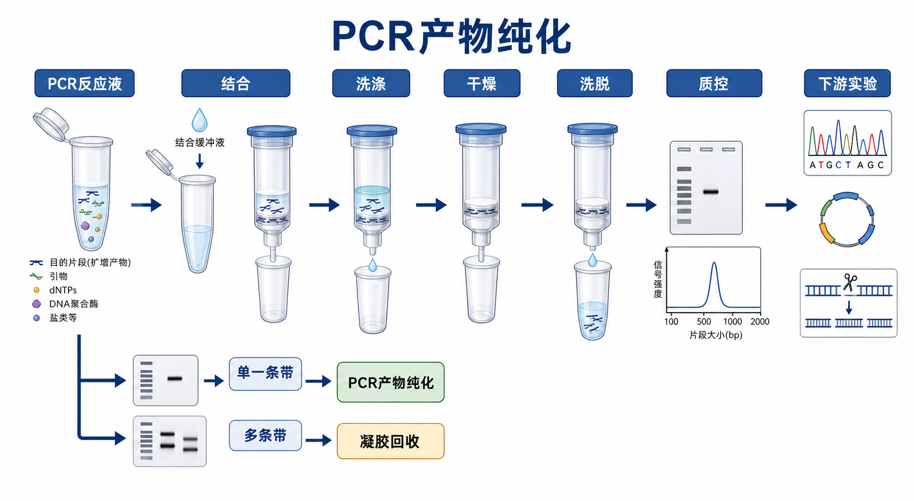

# PCR产物纯化

PCR product purification（PCR 产物纯化，也常叫 PCR cleanup）是对 [PCR](PCR.md) 反应后的扩增产物进行纯化，去除 [PCR引物](<../材(实验耗材工具篇)/PCR引物.md>)、[dNTP](<../材(实验耗材工具篇)/dNTP.md>)、[Taq DNA聚合酶](<../材(实验耗材工具篇)/Taq DNA聚合酶.md>) 或其他 DNA polymerase（DNA 聚合酶）、盐、缓冲液组分和部分短小副产物的实验。它最适合“目标条带单一、大小正确，只需要把反应体系变干净”的场景。



一句话理解：PCR 产物纯化是把一个已经扩增正确的 PCR 反应液清干净；如果 PCR 本身有多条非特异条带，真正能按大小选择目标片段的是 [凝胶回收](凝胶回收.md)，不是普通 PCR cleanup。

## 实验发明历史与背景

PCR 让特定 DNA 片段可以被快速扩增，但扩增结束后的反应液并不是“纯 DNA”。其中仍然含有残余引物、dNTP、聚合酶、MgCl2、盐、缓冲液、矿物油或添加剂；这些成分可能干扰后续 [限制性内切酶酶切](限制性内切酶酶切.md)、[连接反应](连接反应.md)、[Sanger测序](Sanger测序.md)、[Gibson组装](Gibson组装.md) 或 [测序文库构建](测序文库构建.md)。

早期 PCR cleanup 可以使用 ethanol precipitation（[乙醇沉淀](../番外/补充知识/乙醇沉淀.md)）、凝胶切胶、有机抽提或透析等方法。现在最常见的是三条路线：

- Silica spin column purification（[硅胶膜柱纯化](../番外/补充知识/硅胶膜柱纯化.md)）：加结合液，上柱，洗涤，干燥，洗脱。
- Magnetic bead purification（[磁珠纯化](../番外/补充知识/磁珠纯化.md)）：用 SPRI beads（[SPRI磁珠](<../材(实验耗材工具篇)/SPRI磁珠.md>)）结合 DNA，磁架分离，乙醇洗涤，洗脱。
- Enzymatic cleanup（[ExoSAP酶促纯化](ExoSAP酶促纯化.md)）：用 exonuclease I（[核酸外切酶I](<../材(实验耗材工具篇)/核酸外切酶I.md>)）降解单链引物，用 shrimp alkaline phosphatase（虾碱性磷酸酶，属于 [碱性磷酸酶](<../材(实验耗材工具篇)/碱性磷酸酶.md>)）去磷酸化 dNTP，再热灭活。

[QIAGEN](../番外/试剂厂商/Qiagen.md)、[NEB](../番外/试剂厂商/NEB.md)、[Thermo Scientific](<../番外/试剂厂商/Thermo Scientific.md>)、[Promega](../番外/试剂厂商/Promega.md)、[Zymo Research](<../番外/试剂厂商/Zymo Research.md>) 和 [Takara](../番外/试剂厂商/Takara.md) 都有 PCR cleanup 或 Gel/PCR cleanup 产品线。它们的共同逻辑是：去除小分子和反应组分，让目标 PCR 片段更适合下游酶反应和测序。参考：[QIAGEN QIAquick PCR Purification Kit](https://www.qiagen.com/us/products/discovery-and-translational-research/dna-rna-purification/dna-purification/dna-clean-up/qiaquick-pcr-purification-kit)、[NEB Monarch PCR & DNA Cleanup Kit](https://www.neb.com/en-us/products/t1030-monarch-pcr-dna-cleanup-kit-5-ug)、[Thermo Fisher GeneJET PCR Purification Kit](https://www.thermofisher.com/order/catalog/product/K0701)、[Promega Wizard SV Gel and PCR Clean-Up System](https://www.promega.com/products/nucleic-acid-extraction/dna-cleanup/wizard-sv-gel-and-pcr-clean_up-system/)、[Zymo DNA Clean & Concentrator](https://www.zymoresearch.com/products/dna-clean-concentrator-5)。

## 应用场景

- Sanger 测序前清除引物和 dNTP，降低峰图背景。
- 酶切、连接、Gibson 组装前去除 PCR 反应体系中的盐、酶和添加剂。
- 二轮 PCR、巢式 PCR、接头连接或建库前进行 buffer exchange（缓冲液置换）。
- 从 PCR 体系中回收单一目标产物，用于定量、克隆、测序或体外反应。
- 建库 workflow 中用磁珠纯化去除短接头、引物二聚体和盐。

不适合的情况：

- PCR 有明显多条带：普通 PCR 纯化会把多个 DNA 片段一起留下，应改用凝胶回收或重新优化 PCR。
- 目标产物与 primer dimer（引物二聚体）大小接近：柱纯化未必能完全去除，需要看 kit 截留范围或改用磁珠比例选择。
- 需要严格片段大小选择：优先考虑凝胶回收、磁珠 size selection 或 PAGE 纯化。

## 实验目的

PCR 产物纯化的目的不是“让 PCR 成功”，而是让已经成功的 PCR 产物变得适合下游实验：

- 去除小分子：引物、dNTP、盐和部分荧光染料。
- 去除蛋白：DNA 聚合酶、限制酶或其他反应酶。
- 置换 buffer：把 PCR 体系转移到水或低盐洗脱缓冲液中。
- 浓缩或调节体积：根据下游反应所需浓度调整最终体积。
- 改善测序或酶反应表现：减少混合峰、背景峰、酶切抑制和连接失败。

## 简要实验原理

### 硅胶膜柱 PCR 纯化

在高盐和合适 pH 条件下，双链 DNA 会结合到硅胶膜上；引物、dNTP、盐和酶等杂质通过离心和洗涤被去除。最后用 [洗脱缓冲液](<../材(实验耗材工具篇)/洗脱缓冲液.md>) 或 [无核酸酶水](<../材(实验耗材工具篇)/无核酸酶水.md>) 洗脱 DNA。QIAGEN QIAquick、NEB Monarch、Thermo Fisher GeneJET 和 Zymo DNA Clean & Concentrator 都属于这个大逻辑。

关键限制是片段大小范围。不同 kit 对可回收 DNA 片段长度、柱容量和洗脱体积要求不同；很短的引物通常会被去掉，但某些较大的 primer dimer 或非特异 PCR 片段可能仍会被回收。

### 磁珠 PCR 纯化

SPRI（solid phase reversible immobilization，固相可逆固定化）磁珠利用 PEG/盐条件让 DNA 结合到羧基磁珠表面。改变 beads-to-sample ratio（磁珠与样本体积比）可以改变保留片段大小范围，因此磁珠纯化不仅能清理反应液，也常用于建库中的 size selection（片段大小选择）。[AMPure XP磁珠](<../材(实验耗材工具篇)/AMPure XP磁珠.md>) 是这类工作流里非常常见的一线产品。参考：[Beckman Coulter AMPure XP](https://www.beckman.com/reagents/genomic/cleanup-and-size-selection/pcr)。

磁珠法适合多样本、高通量、自动化和建库，但对比例、混匀、磁吸时间和乙醇干燥状态很敏感。

### 酶促 PCR cleanup

ExoSAP 类型方法不真正“提取 DNA”，而是在原管中消化杂质。exonuclease I 降解单链引物，alkaline phosphatase 去除 dNTP 的磷酸基团，随后热灭活酶。它非常适合单一 PCR 产物的 Sanger 测序前处理，但不能去除非特异双链 PCR 条带，也不能换 buffer 或浓缩样本。参考：[Thermo Fisher ExoSAP-IT PCR Product Cleanup Reagent](https://www.thermofisher.com/order/catalog/product/78200)。

## 所需试剂、耗材和设备

| 类别 | 常用内容 | 作用 | 注意事项 |
|---|---|---|---|
| 待纯化样本 | PCR 反应液 | 含目标扩增片段和反应残留物 | 纯化前最好先跑胶确认是否单一条带 |
| 柱式纯化 | [PCR纯化试剂盒](<../材(实验耗材工具篇)/PCR纯化试剂盒.md>)、binding buffer、wash buffer、spin column | 结合、洗涤并洗脱 DNA | 不同 kit 的结合液比例和片段范围不同 |
| 磁珠纯化 | SPRI 磁珠、磁力架、新配 70%-80% 乙醇 | 高通量清理和片段选择 | 磁珠比例和干燥状态决定回收结果 |
| 酶促纯化 | ExoSAP 类试剂、PCR 仪或恒温模块 | 降解引物和 dNTP | 不能去除错误大小双链 DNA |
| 洗脱液 | 洗脱缓冲液或无核酸酶水 | 释放纯化后的 DNA | 下游酶反应注意 EDTA 含量 |
| 质控 | [Qubit荧光计](<../材(实验耗材工具篇)/Qubit荧光计.md>)、[微量紫外分光光度计](<../材(实验耗材工具篇)/微量紫外分光光度计.md>)、琼脂糖凝胶 | 测浓度、纯度和大小 | 低浓度样本优先 Qubit |
| 记录信息 | kit 厂家、货号、批号、洗脱体积 | 保证可追溯 | wash buffer 是否已加乙醇必须记录 |

## 实验设计

### 先判断 PCR 条带

PCR 产物纯化前最好先取少量样本跑胶，尤其是用于克隆、测序或建库时。

| 胶图结果 | 推荐处理 | 原因 |
|---|---|---|
| 单一、大小正确、无明显 primer dimer | PCR 产物纯化 | 清除反应组分即可 |
| 单一目标条带但有少量 primer dimer | 柱纯化或磁珠纯化 | 根据片段大小差异和 kit 截留范围判断 |
| 多条明显非特异条带 | 凝胶回收 | 普通 PCR cleanup 会保留多个双链片段 |
| 目标条带很弱 | 优化 PCR 或合并反应后纯化 | 直接纯化可能浓度过低 |
| smear 明显 | 先诊断 PCR 条件或模板质量 | 纯化不能修复降解或非特异扩增 |

### 选择纯化路线

| 路线 | 优点 | 局限 | 推荐场景 |
|---|---|---|---|
| 硅胶膜柱 PCR 纯化 | 直观、稳定、适合常规单样本 | 离心步骤多，短片段保留取决于 kit | 克隆、酶切、测序前常规 cleanup |
| 磁珠纯化 | 高通量、自动化友好、可调片段选择 | 比例敏感，过干/欠干都会影响回收 | 建库、多样本、需要 size selection |
| ExoSAP 酶促纯化 | 快、少损失、适合 Sanger | 不能换 buffer，不能去除非特异双链片段 | 单一 PCR 产物直接测序 |
| 凝胶回收 | 可按大小选择目标片段 | 回收率低，耗时，光损伤风险 | 多条带、酶切片段分离、克隆前尺寸选择 |

### 根据下游实验确定洗脱策略

- Sanger 测序：更重视单一模板和无残余引物；过高浓度或混合模板都会造成峰图差。
- 酶切和连接：更重视盐、乙醇、EDTA 和聚合酶残留；dry spin 很关键。
- Gibson 组装：更重视片段纯度、摩尔比和末端同源臂正确性。
- 建库：更重视片段长度分布、接头二聚体去除和重复性；磁珠法常更合适。

## 实验操作

下面以常规硅胶膜柱 PCR 纯化为主线，同时说明磁珠法和酶促法的关键差异。正式实验以具体 kit 说明书为准。

### 样本预检查

做法：

- 取少量 PCR 反应液跑琼脂糖凝胶。
- 记录目标片段大小、条带是否单一、是否有 primer dimer 或 smear。
- 根据胶图选择 PCR 纯化、凝胶回收、磁珠纯化或重新优化 PCR。

为什么重要：

PCR cleanup 不能“挑选正确条带”。如果 PCR 本身有错误扩增，柱纯化会把错误片段一起带到下游。

可能出错导致的结果：

- 未检查胶图直接测序：可能出现混合峰或低质量峰图。
- 多条带直接克隆：阳性克隆比例低，甚至大量错误插入。
- primer dimer 未去除：测序背景或建库接头二聚体问题增加。

### 加入结合液

做法：

- 按 kit 说明向 PCR 反应液加入 binding buffer。
- 充分混匀，必要时短暂离心收集液滴。
- 某些 kit 对小片段或低浓度 DNA 有额外比例要求，应按说明调整。

为什么重要：

binding buffer 提供高盐和 pH 条件，使目标 DNA 能结合硅胶膜。比例错误会导致 DNA 不结合或杂质清除不足。

注意事项：

- 不要把胶回收 kit、PCR cleanup kit 和 plasmid mini-prep kit 的 buffer 混用。
- 如果 PCR 体系体积很大，确认是否超过柱容量。
- 对高盐 PCR 添加剂或特殊 buffer，可能需要额外洗涤或稀释。

### 上柱结合

做法：

- 将混合液加入 spin column。
- 按说明离心，使 DNA 结合在膜上。
- 倒掉流穿液；如果样本体积超过柱容量，分次上柱。

为什么重要：

DNA 的损失常发生在这一步。若结合条件不足、柱容量超载或片段超出 kit 范围，目标 DNA 会留在流穿液中。

替代策略：

- 极低量样本可保留流穿液，必要时重新上柱。
- 高通量样本可改用磁珠流程，减少离心操作。

### 洗涤

做法：

- 加入 wash buffer，按说明离心。
- 倒掉流穿液。
- 如下游对盐很敏感，可按说明增加一次洗涤。

为什么重要：

洗涤去除盐、dNTP、引物和酶残留。很多 wash buffer 含乙醇，首次使用前需要加入 [无水乙醇](<../材(实验耗材工具篇)/无水乙醇.md>)；如果忘记加乙醇，洗涤效果会明显异常。

可能出错导致的结果：

- 忘记补加乙醇：盐和杂质残留，后续酶反应失败。
- 洗涤不充分：A260/A230 偏低，测序或酶切受抑制。
- 洗涤液污染柱底：流穿液回沾，纯化质量下降。

### 干燥

做法：

- 洗涤后进行 dry spin，去除柱膜残留乙醇。
- 确认收集管中没有液体接触柱底。

为什么重要：

乙醇残留是 PCR cleanup 后下游失败的常见原因。它会抑制 ligase、polymerase、restriction enzyme 和部分测序反应。

注意事项：

- 不要省略 dry spin。
- 不要把柱子长时间暴露到完全干裂；极低量 DNA 时过度干燥可能降低洗脱效率。

### 洗脱

做法：

- 将柱子放入新的离心管。
- 在膜中央加入洗脱缓冲液或无核酸酶水。
- 室温孵育 1-5 min 后离心洗脱。
- 需要更高浓度时使用较小体积；需要更高总回收量时可做第二次洗脱。

为什么重要：

洗脱体积决定浓度和回收量。小体积浓度高，但总回收率可能略低；大体积回收充分，但浓度低。

下游策略：

- 直接 Sanger：通常不需要太高浓度，关键是单一模板和无残余引物。
- 克隆或酶切：优先保证盐和乙醇低，必要时用 Qubit 准确定量。
- 建库：按 kit 输入量要求决定洗脱体积，不要只看 NanoDrop。

### 磁珠法关键操作

做法：

- 按目标片段大小和 kit/workflow 设定磁珠比例。
- 磁珠充分回温并混匀后加入 PCR 产物。
- 孵育结合，放上磁力架，弃上清。
- 用新配 70%-80% 乙醇洗涤，短暂空气干燥。
- 加洗脱液，磁吸后转移上清。

为什么重要：

磁珠法的片段选择依赖比例。比例、混匀和干燥状态稍有偏差，就会改变小片段保留或目标产物回收。

注意事项：

- 磁珠不能过干开裂，否则洗脱效率下降。
- 乙醇不能残留，否则后续反应受抑制。
- 吸上清时不要带入磁珠。

### 酶促法关键操作

做法：

- 向单一 PCR 产物中加入 ExoSAP 类 cleanup reagent。
- 孵育消化引物和 dNTP。
- 加热灭活酶。
- 直接用于 Sanger 测序或短期保存。

为什么重要：

酶促法几乎没有柱/磁珠损失，很适合低量但单一的 PCR 产物测序；但它不会去除双链非特异 PCR 片段，也不能降低盐浓度或换 buffer。

## 结果解析

### 理想结果

- 纯化后 DNA 浓度满足下游要求。
- 琼脂糖凝胶显示单一目标条带。
- Qubit 浓度与预期相符。
- NanoDrop A260/A280 大致接近 1.8，A260/A230 不明显偏低。
- 下游测序、酶切、连接或组装反应正常。

### 需要谨慎解读的结果

- NanoDrop 浓度高但 Qubit 低：可能是引物、dNTP、盐或小分子污染导致吸收读数偏高。
- 胶上条带很弱但 NanoDrop 很高：优先怀疑污染或低分子残留。
- PCR cleanup 后仍有 primer dimer：可能片段大小超过 kit 去除能力，或磁珠比例不适合。
- 测序峰图仍混乱：可能是 PCR 有多个双链模板，不是 cleanup 本身能解决的问题。

## 异常结果与 troubleshooting

| 异常结果 | 可能原因 | 解决策略 |
|---|---|---|
| 回收量很低 | PCR 产物本来少；结合液比例错误；片段太短或太长；洗脱体积太小 | 先检查上游 PCR；按 kit 片段范围调整；温热洗脱液；延长膜上孵育 |
| 下游酶切失败 | 盐、乙醇、EDTA 或聚合酶残留 | 增加 dry spin；重新纯化；换低 EDTA 洗脱液；减少模板带入体积 |
| Sanger 峰图多峰 | PCR 有非特异双链产物；引物残留；模板量不合适 | 重新跑胶确认；多条带走凝胶回收；优化测序模板和引物量 |
| A260/A230 很低 | 胍盐、盐或洗涤液残留 | 额外洗涤并充分干燥；重新纯化 |
| 纯化后仍有 primer dimer | 片段大小接近目标；柱式方法无法区分 | 改用磁珠比例选择、凝胶回收或重新设计 PCR |
| 磁珠法回收低 | 磁珠未充分混匀；比例错误；过度干燥；吸走磁珠 | 回温并涡旋磁珠；校准比例；缩短干燥；吸液避开磁珠 |
| 酶促法后仍失败 | PCR 本身多条带；酶未灭活；反应体系不适合下游 | 改用柱纯化或凝胶回收；确认热灭活条件 |

## PCR产物纯化 vs 凝胶回收

| 对比点 | PCR产物纯化 | 凝胶回收 |
|---|---|---|
| 是否按大小选择 | 基本不能，只能清除小分子和部分短片段 | 可以切出目标大小条带 |
| 回收率 | 通常更高 | 通常更低 |
| 操作时间 | 短 | 较长 |
| DNA 损伤风险 | 低 | 取决于 UV/蓝光和切胶时间 |
| 去除非特异条带 | 差 | 好 |
| 最适合 | 单一正确 PCR 产物 | 多条带或需要精确尺寸选择 |
| 常见下游 | Sanger、酶切、连接、Gibson、二轮 PCR | 克隆、测序、酶切片段分离 |

一个实用判断：如果胶图只有一个正确条带，优先 PCR 产物纯化；如果胶图有多个双链条带，优先凝胶回收；如果是建库或批量样本，优先考虑磁珠策略。

## 购买建议

- 常规克隆和测序：QIAGEN QIAquick、NEB Monarch、Thermo Fisher GeneJET、Promega Wizard SV、Zymo DNA Clean & Concentrator 和 Takara 同类 kit 都可作为候选。
- 高通量和建库：可重点考虑 AMPure XP 或其他 SPRI 磁珠体系，同时记录磁珠比例和批号。
- 直接 Sanger 测序：单一 PCR 产物可考虑 ExoSAP 类酶促 cleanup，速度快、损失少。
- 购买时必须看：片段大小范围、最大 DNA 结合量、最小洗脱体积、是否去除小片段、是否兼容酶反应、wash buffer 是否需自行补加乙醇。

不要只记录“PCR cleanup kit”。更好的记录方式是：品牌、公司、产品全名、货号、批号、样本体积、洗脱体积、纯化方式和下游用途。

## 推荐记录模板

### 中文记录模板

```text
实验日期：
样本名称：
PCR 体系体积：
目标片段大小：
胶图结果：单一条带 / 多条带 / primer dimer / smear
纯化方式：柱式 / 磁珠 / ExoSAP / 其他
试剂盒或磁珠名称：
厂家：
货号：
批号：
binding buffer 或磁珠比例：
wash buffer 是否已加乙醇：
洗脱液：
洗脱体积：
Qubit 浓度：
NanoDrop A260/A280：
NanoDrop A260/A230：
回收后胶图：
下游用途：
异常情况和处理：
```

### English record template

```text
Date:
Sample ID:
PCR reaction volume:
Expected amplicon size:
Gel result: single band / multiple bands / primer dimer / smear
Cleanup method: spin column / magnetic beads / ExoSAP / other
Kit or bead name:
Manufacturer:
Catalog number:
Lot number:
Binding buffer volume or bead ratio:
Wash buffer ethanol added:
Elution buffer:
Elution volume:
Qubit concentration:
NanoDrop A260/A280:
NanoDrop A260/A230:
Post-cleanup gel check:
Downstream application:
Issues and actions:
```

## 小结

PCR 产物纯化是一种“清理反应液”的方法，不是“纠正扩增特异性”的方法。它最适合单一、正确的 PCR 产物；当存在多个双链条带时，应改用凝胶回收或重新优化 PCR。柱式方法适合常规克隆和酶反应，磁珠方法适合高通量和建库，ExoSAP 酶促法适合单一产物的快速 Sanger 测序前处理。真正的判断核心是：下游需要的是干净 buffer、正确片段大小，还是特定片段长度分布。

## 参考来源

- QIAGEN. QIAquick PCR Purification Kit. https://www.qiagen.com/us/products/discovery-and-translational-research/dna-rna-purification/dna-purification/dna-clean-up/qiaquick-pcr-purification-kit
- NEB. Monarch PCR & DNA Cleanup Kit. https://www.neb.com/en-us/products/t1030-monarch-pcr-dna-cleanup-kit-5-ug
- Thermo Fisher Scientific. GeneJET PCR Purification Kit. https://www.thermofisher.com/order/catalog/product/K0701
- Promega. Wizard SV Gel and PCR Clean-Up System. https://www.promega.com/products/nucleic-acid-extraction/dna-cleanup/wizard-sv-gel-and-pcr-clean_up-system/
- Zymo Research. DNA Clean & Concentrator-5. https://www.zymoresearch.com/products/dna-clean-concentrator-5
- Beckman Coulter. AMPure XP PCR Purification. https://www.beckman.com/reagents/genomic/cleanup-and-size-selection/pcr
- Thermo Fisher Scientific. ExoSAP-IT PCR Product Cleanup Reagent. https://www.thermofisher.com/order/catalog/product/78200
