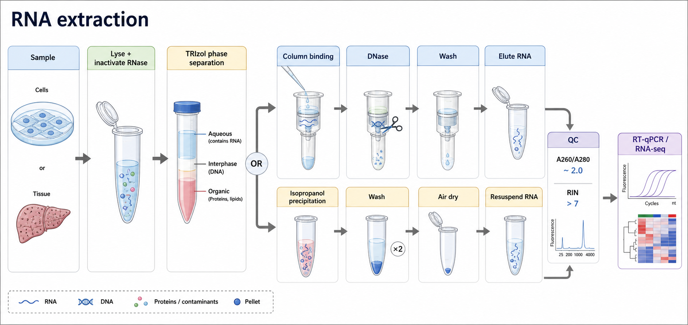

# RNA提取



图源：Image2 生成的 RNA extraction summary abstract graph。图中把 RNA 提取拆成样本裂解、RNase 失活、TRIzol 相分离或柱结合、DNase 处理、洗涤、洗脱、质控和下游 RT-qPCR/RNA-seq。

RNA extraction / RNA isolation（RNA 提取/RNA 分离）是从细胞、组织、血液、微生物或病毒样本中释放 RNA，并去除蛋白、DNA、脂质、盐、有机溶剂和其他抑制物的实验。它是 [RT-qPCR](<RT-qPCR.md>)、[逆转录](逆转录.md)、RNA-seq（RNA sequencing，RNA 测序）、Northern blot（Northern blotting，RNA 印迹）和许多转录组实验的上游关键步骤。

本页默认场景是：哺乳动物细胞或常规组织的 total RNA（总 RNA）提取，重点比较 [TRIzol](<../材(实验耗材工具篇)/TRIzol.md>) / phenol-chloroform extraction（酚-氯仿提取）和 [RNA提取试剂盒](<../材(实验耗材工具篇)/RNA提取试剂盒.md>) / silica membrane spin column（硅胶膜离心柱）两条路线。血液、FFPE（formalin-fixed paraffin-embedded，福尔马林固定石蜡包埋）、微量样本、single-cell RNA-seq（单细胞 RNA 测序）和 small RNA（小 RNA）可以后续拆成独立页面。

## 实验发明历史

RNA 提取技术的核心挑战一直是：RNA 本身容易被 [RNase](<../番外/补充知识/RNase.md>)（ribonuclease，核糖核酸酶）降解，而细胞和组织里 RNase 又广泛存在。早期 RNA 提取依赖酚、氯仿、盐和沉淀步骤，操作繁琐且对样本处理速度要求很高。

Chomczynski 和 Sacchi 在 1987 年发表的 single-step method（一步法）是现代酸性胍盐-酚-氯仿 RNA 提取体系的重要经典文献。它使用 guanidinium thiocyanate（异硫氰酸胍）和 phenol-chloroform（酚-氯仿）快速裂解样本、失活 RNase，并通过相分离把 RNA 与 DNA、蛋白分开。参考：[Chomczynski and Sacchi, 1987, PubMed](https://pubmed.ncbi.nlm.nih.gov/2440339/)。

商业化 TRIzol 类试剂就是这一思想的常见实现之一。Thermo Fisher 的 TRIzol Reagent User Guide 描述了从样本均质裂解、加入氯仿相分离、转移水相、异丙醇沉淀、75% 乙醇洗涤到 RNA 溶解的完整流程。参考：[TRIzol Reagent User Guide](https://assets.thermofisher.com/TFS-Assets/LSG/manuals/trizol_reagent.pdf)。

后来 silica membrane（硅胶膜）和 magnetic bead（磁珠）核酸纯化体系让 RNA 提取更标准化、更适合多样本和自动化。Qiagen RNeasy Mini Kit 手册将流程概括为裂解、RNA 结合硅胶膜、洗涤、可选 DNase 处理和洗脱。参考：[Qiagen RNeasy Mini Handbook](https://www.qiagen.com/us/resources/resourcedetail?id=14e7cf6e-521a-4cf7-8cbc-bf9f6fa33e24)。

## 应用场景

| 场景 | RNA提取回答的问题 | 对 RNA 质量的要求 |
| --- | --- | --- |
| RT-qPCR | 某些 mRNA 是否上调或下调 | 纯度好、无明显 gDNA 污染、逆转录不被抑制 |
| bulk RNA-seq（群体 RNA 测序） | 全转录组表达谱如何变化 | 完整性高、浓度足够、无明显污染 |
| 病毒 RNA 检测 | 样本中是否含特定 RNA 病毒核酸 | 抑制物低、阴性对照干净 |
| Northern blot | RNA 大小和丰度 | 完整性非常重要，降解会拖尾 |
| miRNA / small RNA 分析 | 小 RNA 是否存在或改变 | 需要保留小 RNA 的专用方法 |
| 样本库建立 | 为后续多种核酸实验保存 RNA | 操作一致、记录完整、冻存稳定 |

RNA 提取的产物不是“有浓度就合格”。RNA 是否适合下游实验，取决于 yield（产量）、purity（纯度）、integrity（完整性）、genomic DNA contamination（基因组 DNA 污染）、inhibitor carryover（抑制物残留）和样本之间的一致性。

## 实验目的

一次合格的 RNA 提取通常要达到这些目的：

- 快速裂解样本并失活 RNase。
- 尽量完整地回收目标 RNA 群体。
- 去除蛋白、DNA、盐、酚、胍盐、乙醇和其他下游抑制物。
- 根据下游用途决定是否保留 small RNA。
- 获得可被 [微量紫外分光光度计](<../材(实验耗材工具篇)/微量紫外分光光度计.md>)、[Qubit荧光计](<../材(实验耗材工具篇)/Qubit荧光计.md>)、[Bioanalyzer](<../材(实验耗材工具篇)/Bioanalyzer.md>) 或 [TapeStation](<../材(实验耗材工具篇)/TapeStation.md>) 可靠评估的 RNA。
- 为 RT-qPCR、RNA-seq 或其他下游实验提供稳定模板。

如果下游是 RT-qPCR，少量轻微降解有时仍可接受，但 DNA 污染和 PCR 抑制物会严重影响结果。如果下游是 RNA-seq，RNA integrity（[RNA完整性](<../番外/补充知识/RNA完整性.md>)）和样本间一致性通常更关键。

## 简要实验原理

RNA 提取可以拆成五个基本动作：

```text
样本保存和裂解
-> RNase 失活
-> RNA 与 DNA/蛋白/脂质/抑制物分开
-> 洗涤去杂质
-> 洗脱或重悬 RNA
-> 质量控制
```

TRIzol 路线依赖 acid guanidinium thiocyanate-phenol-chloroform extraction（酸性胍盐-酚-氯仿提取）。在酸性条件下加入 [氯仿](<../材(实验耗材工具篇)/氯仿.md>) 并离心后，混合物形成 aqueous phase（水相）、interphase（中间层）和 organic phase（有机相）：RNA 主要进入上层水相，DNA 偏向中间层，蛋白和脂质多在有机相。水相中的 RNA 随后用 [异丙醇](<../材(实验耗材工具篇)/异丙醇.md>) 沉淀，用 [75% 乙醇](<../材(实验耗材工具篇)/75乙醇.md>) 洗涤，再用 [无核酸酶水](<../材(实验耗材工具篇)/无核酸酶水.md>) 溶解。

柱式路线依赖 [硅胶膜柱纯化](<../番外/补充知识/硅胶膜柱纯化.md>)。在高盐和乙醇存在下，RNA 结合硅胶膜；杂质通过洗涤去除；最后用水或低盐 buffer 洗脱。磁珠路线依赖 [磁珠纯化](<../番外/补充知识/磁珠纯化.md>)，适合自动化和高通量。

## TRIzol vs 柱法 vs 磁珠法

| 方法 | 核心原理 | 优点 | 局限 | 适合场景 |
| --- | --- | --- | --- | --- |
| TRIzol / 酚氯仿法 | 胍盐裂解 + 酚氯仿相分离 + 醇沉淀 | 裂解强、成本低、适合组织和复杂样本 | 有毒有味、操作变异大、酚/胍盐残留会抑制下游反应 | 样本复杂、预算有限、需要强裂解 |
| 硅胶膜柱法 | 高盐/醇条件下 RNA 结合硅胶膜 | 快速、标准化、纯度稳定、适合多样本 | 成本高、柱容量有限、样本过量会堵柱 | 常规细胞、常规组织、RT-qPCR/RNA-seq |
| TRIzol + 柱纯化 | TRIzol 强裂解后再柱纯化 | 裂解强且纯度更好 | 步骤多、成本更高 | 组织难裂解但又要求高纯度 |
| 磁珠法 | RNA 与磁珠表面可逆结合 | 自动化友好、高通量、流程可并行 | 依赖磁架/仪器，条件优化重要 | 多样本、临床检测、自动化平台 |

一句话：TRIzol 更像“强力裂解和分层分离”，柱法更像“标准化过滤纯化”，磁珠法更像“可自动化的核酸捕获”。选择方法时不要只看产量，还要看下游对纯度、完整性、批间一致性和安全性的要求。

## 实验所需试剂、耗材和设备

### 试剂

| 试剂 | 作用 | 注意事项 |
| --- | --- | --- |
| TRIzol 或类似 phenol/guanidinium reagent（酚/胍盐裂解试剂） | 裂解样本、失活 RNase、相分离 | 含酚和胍盐，必须按化学安全要求操作 |
| RNA 提取试剂盒 | 裂解、结合、洗涤和洗脱 RNA | 不同 kit 是否保留小 RNA、是否带 DNase 不同 |
| 氯仿 | 促进 TRIzol 相分离 | 有毒、挥发，必须通风橱中操作 |
| 异丙醇 | 沉淀水相中的 RNA | 沉淀可能很小且透明，不要丢失 |
| 75% 乙醇 | 洗涤 RNA pellet 或柱膜 | 乙醇残留会抑制逆转录和 PCR |
| [DNase I](<../材(实验耗材工具篇)/DNase I.md>) | 降解基因组 DNA 污染 | 需后续失活或纯化去除 |
| 无核酸酶水 | 洗脱或溶解 RNA | 不要使用普通水或未确认 RNase-free 的 buffer |
| [RNase抑制剂](<../材(实验耗材工具篇)/RNase抑制剂.md>) | 某些下游反应中保护 RNA | 提取阶段不能替代 RNase-free 操作 |

### 耗材和设备

| 类别 | 内容 | 作用 |
| --- | --- | --- |
| RNase-free 耗材 | 无 RNase 离心管、滤芯吸头、手套 | 减少外源 RNase 污染 |
| 匀浆工具 | 研磨器、组织匀浆器、针头剪切、珠磨仪 | 让组织或细胞完全裂解 |
| 离心设备 | 冷冻离心机、微量离心机 | 相分离、沉淀、柱洗涤 |
| 纯化工具 | 离心柱、收集管、磁架 | RNA 结合、洗涤和洗脱 |
| 质控仪器 | 微量紫外分光光度计、Qubit、Bioanalyzer、TapeStation | 测浓度、纯度和完整性 |
| 保存设备 | 冰盒、-80°C 冰箱、液氮 | 保护样本和 RNA |

## RNA工作区和RNase控制

### 怎么做

实验前准备干净工作区，戴新手套，使用 RNase-free 管和滤芯吸头。台面、移液器和离心管架可用 RNase 去除剂或合适清洁方式处理。样本离体后应尽快裂解、液氮速冻或置于 RNA stabilization reagent（RNA 稳定剂）中。不要把 RNA 样本长时间放在室温。

### 为什么重要

RNase 非常稳定，皮肤、灰尘、细胞裂解物和普通实验环境中都可能有。RNA 一旦降解，后续再纯化也无法恢复原本的转录本长度和真实表达谱。New England Biolabs 关于 RNase contamination 的指南强调，避免 RNase 污染要依赖专用耗材、干净工作区、手套和合适的样本处理。参考：[NEB Avoiding Ribonuclease Contamination](https://www.neb.com/en-us/tools-and-resources/usage-guidelines/avoiding-ribonuclease-contamination)。

### 注意事项

- RNA 提取前最怕样本保存不当，而不是后面多洗一次就能补救。
- 不要用处理蛋白或细菌样本的普通台面直接做 RNA。
- 反复冻融会增加降解风险。
- 若样本 RNase 极高，例如胰腺、脾脏、血液，应更快裂解或使用专门方案。

### 替代方案

若不能马上提取，可以液氮速冻后 -80°C 保存，或使用样本保存液。若样本是细胞培养物，通常可以吸去培养基后立即加入 TRIzol 或 kit 裂解液；若是组织，优先考虑快速剪碎、冷冻和充分匀浆。

### 做错会怎样

RNA 降解会导致 Bioanalyzer/TapeStation 曲线拖尾、RIN 下降、28S/18S 比例异常、RT-qPCR Cq 偏高且重复性差、RNA-seq 3' bias（3' 端偏倚）或文库失败。

## TRIzol路线 protocol

### 样本裂解和均质

**怎么做：** 按说明书向细胞或组织加入足量 TRIzol，充分吹打、涡旋或匀浆，使样本完全裂解。贴壁细胞可直接在培养皿中加入 TRIzol；组织样本需要剪碎、研磨或机械匀浆。

**为什么重要：** TRIzol 必须快速接触样本才能失活 RNase。裂解不充分会让 RNA 留在组织块或细胞团中，也会造成 DNA/蛋白污染和相分离不清。

**注意事项：** 不要让样本量超过 TRIzol 裂解能力。TRIzol 含酚和胍盐，应在通风橱中操作，避免与漂白剂混合产生危险副产物。操作时记录样本量、TRIzol 体积和匀浆方式。

**替代方案：** 对难裂解组织，可使用珠磨、转子匀浆或液氮研磨。对常规细胞，也可以用柱式 kit 裂解液直接裂解，减少酚氯仿操作。

**做错会怎样：** 裂解不足会导致产量低、样本黏稠、相分离混浊、A260/A230 偏低或柱堵塞。

### 氯仿相分离

**怎么做：** 按 TRIzol 说明加入氯仿，剧烈混匀，短暂室温放置后离心。离心后应看到上层水相、中间层和下层有机相。小心吸取上层水相到新管，不要碰到中间层。

**为什么重要：** 这是 TRIzol 法区分 RNA、DNA 和蛋白的核心步骤。RNA 主要在水相，中间层和有机相污染会带入 DNA、蛋白、酚和脂质。

**注意事项：** 吸水相时宁可少取，也不要贪多碰到中间层。若相界面不清，重新离心或减少吸取体积。氯仿必须在通风橱中操作。

**替代方案：** 若担心酚残留，可采用 TRIzol 裂解后接柱纯化的 hybrid protocol（混合方案）。若不想接触氯仿，选择柱式或磁珠试剂盒更合适。

**做错会怎样：** 带入中间层会造成 [基因组DNA污染](<../番外/补充知识/基因组DNA污染.md>)；带入有机相会造成 A260/A230 低、逆转录失败、qPCR 抑制或样本有明显酚味。

### 异丙醇沉淀

**怎么做：** 将水相转移到新管后加入异丙醇，使 RNA 沉淀；离心后在管底或管侧形成 RNA pellet（RNA 沉淀）。沉淀可能透明、很小，不一定肉眼明显。

**为什么重要：** 水相中的 RNA 需要通过醇沉淀浓缩并与溶液中的盐和小分子分开。低丰度样本的 RNA pellet 很容易丢失。

**注意事项：** 标记管铰链方向，离心后知道沉淀大致位置。倒液时动作要慢。若样本量很低，可按说明使用 carrier（载体）帮助沉淀，但载体可能影响某些下游定量。

**替代方案：** 可以用柱纯化代替沉淀，降低丢 pellet 的风险。对于极低输入样本，优先选择 low-input RNA kit。

**做错会怎样：** pellet 丢失会导致几乎无 RNA；沉淀不充分会导致产量低；共沉淀盐和酚会影响纯度。

### 乙醇洗涤、风干和溶解

**怎么做：** 用 75% 乙醇洗涤 RNA pellet，离心后去除乙醇，短暂风干，再用无核酸酶水溶解 RNA。

**为什么重要：** 乙醇洗涤去除盐和有机残留。风干去除残余乙醇，但过度干燥会让 RNA 难以溶解。

**注意事项：** 不要把 pellet 完全吹到看不见的干硬状态。溶解时可轻轻吹打或短暂温育，但不要剧烈涡旋高分子 RNA。洗脱后尽快放冰上，并分装保存。

**替代方案：** 若 A260/A230 仍低，可做二次乙醇沉淀或柱纯化 cleanup。若下游是 RNA-seq，通常建议做更严格质控。

**做错会怎样：** 乙醇残留会抑制 [逆转录](逆转录.md) 和 PCR；过度干燥会导致浓度看似低或重复测定不稳定。

## 柱式试剂盒 protocol

### 裂解和均质

**怎么做：** 按 kit 手册加入裂解液，充分裂解样本。组织样本需要匀浆，细胞样本需要吹打或涡旋。若裂解液很黏，通常提示 DNA 多、样本过量或裂解不充分。

**为什么重要：** 柱式纯化的上样容量有限。未充分裂解或黏稠样本会堵柱，降低回收率。

**注意事项：** 不要超过说明书给出的细胞数或组织量上限。许多裂解液需要新鲜加入 β-mercaptoethanol（β-巯基乙醇）或 DTT（dithiothreitol，二硫苏糖醇）帮助失活 RNase，具体以说明书为准。

**替代方案：** 对难裂解样本可先用 TRIzol 或 QIAzol 裂解，再接柱纯化；对高通量样本可使用磁珠体系。

**做错会怎样：** 上样过多或黏稠会导致柱堵塞、洗涤不彻底、RNA 纯度差和产量不稳定。

### RNA结合

**怎么做：** 按说明加入乙醇或 binding buffer（结合缓冲液），让 RNA 在合适盐和醇条件下结合硅胶膜，然后离心通过柱膜。

**为什么重要：** RNA 是否能结合柱膜，取决于盐、醇比例、pH 和样本组成。乙醇体积加错会直接影响回收率。

**注意事项：** 洗涤液和结合液常需要提前加入乙醇。第一次使用 kit 时要检查瓶身是否已加乙醇。不要随意改变乙醇浓度。

**替代方案：** 若需要保留 small RNA，必须选择兼容 small RNA 的 kit；普通 total RNA kit 可能让一部分小 RNA 流失。

**做错会怎样：** 乙醇比例错误会导致 RNA 不结合或杂质共结合；样本过量会让柱膜饱和，导致 RNA 损失。

### DNase处理

**怎么做：** 根据下游需求选择 on-column DNase digestion（柱上 DNase 消化）或 post-elution DNase treatment（洗脱后 DNase 处理）。RT-qPCR 样本通常建议去除 gDNA，特别是引物不能跨内含子或目标为 intronless gene（无内含子基因）时。

**为什么重要：** RNA 样本中的 DNA 会被 qPCR 扩增，造成假阳性或表达量高估。RT-qPCR 中常用 [无逆转录对照](<../番外/补充知识/无逆转录对照.md>) 或 [No-RT对照](<../番外/补充知识/No-RT对照.md>) 评估 DNA 污染。

**注意事项：** DNase I 本身是蛋白和盐来源，处理后需要失活或再次纯化。柱上 DNase 简便，但对严重 DNA 污染可能不够；洗脱后 DNase 更充分，但步骤更多。

**替代方案：** 可通过引物设计跨 exon-exon junction（外显子-外显子连接）降低 gDNA 干扰，但这不能替代干净 RNA。RNA-seq 通常也需要控制 DNA 污染。

**做错会怎样：** DNA 污染会让 No-RT 对照出现扩增，导致 RT-qPCR 结果不可信；过度或不当 DNase 处理可能降低 RNA 回收率。

### 洗涤和洗脱

**怎么做：** 按顺序加入 kit 洗涤液，离心去除盐、蛋白、胍盐、乙醇和其他杂质。最后用无核酸酶水或洗脱 buffer 洗脱 RNA。

**为什么重要：** 洗涤决定纯度，洗脱决定最终浓度和回收率。柱膜残留乙醇是下游逆转录和 PCR 抑制的常见原因。

**注意事项：** 最后洗涤后常需要空转去除残留乙醇。洗脱体积越小，浓度越高，但总回收可能略低。RNA-seq 样本不要只追求高浓度，也要保证纯度和完整性。

**替代方案：** 可用预热无核酸酶水提高回收率，或进行二次洗脱增加总量。低输入样本应优先按 low-input kit 建议操作。

**做错会怎样：** 残留乙醇或盐会导致 [PCR抑制剂](<../番外/补充知识/PCR抑制剂.md>) 效应；洗脱不充分会导致产量低；洗脱体积过大则浓度低。

## RNA质量控制

### 浓度

| 方法 | 测的是什么 | 优点 | 局限 |
| --- | --- | --- | --- |
| 微量紫外分光光度计 | 260 nm 吸光度估算核酸浓度 | 快、样本用量少、同时给 A260/A280 和 A260/A230 | 不能区分 RNA、DNA、游离核苷酸和部分污染 |
| Qubit RNA assay | 荧光染料结合 RNA 后定量 | 特异性更好，低浓度更可靠 | 需要试剂盒和标准品 |
| Bioanalyzer/TapeStation | 电泳分离后估算浓度和完整性 | 同时看片段分布和 RIN/RINe | 成本更高 |

若 RNA 用于 RT-qPCR，浓度要足够且样本间输入一致。若用于 RNA-seq，应按建库服务或试剂盒要求提供浓度、总量和完整性指标。

### 纯度

| 指标 | 常见解释 | 常见问题 |
| --- | --- | --- |
| [A260-A280](<../番外/补充知识/A260-A280.md>) | RNA 常见约 2.0，但不是绝对标准 | 低值常提示蛋白、酚或其他 280 nm 吸收污染 |
| [A260-A230](<../番外/补充知识/A260-A230.md>) | 常用于提示盐、胍盐、酚、碳水化合物等污染 | 低值常见于 TRIzol 残留、柱洗涤不足或样本基质复杂 |
| No-RT 对照 | 判断 DNA 是否参与扩增 | No-RT 有扩增说明 DNA 污染或引物问题 |
| 下游扩增表现 | 判断是否存在抑制 | Cq 异常偏高、稀释后反而更好，提示抑制物 |

### 完整性

RNA 完整性可以用 [琼脂糖凝胶电泳](琼脂糖凝胶电泳.md)、Bioanalyzer 或 TapeStation 评估。RIN（RNA integrity number，RNA 完整性数值，[RIN值](<../番外/补充知识/RIN值.md>)）是 Bioanalyzer 常用指标之一，数值越高通常代表 RNA 越完整。不同样本和下游用途对 RIN 要求不同：普通 RT-qPCR 可根据扩增子长度和目标基因判断，RNA-seq 通常更严格。

## 结果解析

| 结果组合 | 可能判断 | 下一步 |
| --- | --- | --- |
| 浓度高，A260/A280 约 2.0，A260/A230 高，RIN 高 | 样本质量较好 | 可进入 RT-qPCR 或 RNA-seq |
| 浓度高，A260/A230 低 | 盐、酚、胍盐或有机残留 | 重新洗涤、柱 cleanup 或乙醇沉淀 |
| 浓度高但 Qubit 低 | 紫外读数被 DNA/污染物/游离核苷酸高估 | 用 Qubit 结果为准，检查纯度 |
| A260/A280 低 | 蛋白或酚污染可能较多 | 增加纯化步骤，避免带入有机相 |
| RIN 低或凝胶拖尾 | RNA 降解 | 检查样本保存、RNase-free 操作和裂解速度 |
| No-RT 有扩增 | DNA 污染 | DNase 处理，重新设计引物 |
| RT-qPCR Cq 普遍偏高 | RNA 降解、逆转录抑制或输入不足 | 检查浓度、纯度、稀释抑制物、重新提取 |

不要只看一个指标。A260/A280 很漂亮但 RIN 很低，仍然不适合高质量 RNA-seq；Qubit 浓度可靠但 A260/A230 很低，可能仍会抑制逆转录；No-RT 对照有扩增，说明表达分析可能被 DNA 污染扭曲。

## 异常结果与 troubleshooting

| 异常 | 常见原因 | 处理策略 |
| --- | --- | --- |
| RNA产量低 | 样本量少、裂解不充分、相分离取水相少、pellet 丢失、洗脱不充分 | 优化裂解和匀浆，标记沉淀位置，二次洗脱或选择低输入 kit |
| RNA降解 | 样本处理慢、RNase 污染、冻融过多、组织保存差 | 快速裂解，使用 RNase-free 耗材，液氮速冻，减少冻融 |
| A260/A230低 | 酚、胍盐、盐、乙醇或碳水化合物残留 | 增加洗涤，空转去乙醇，柱 cleanup，避免吸中间层 |
| A260/A280低 | 蛋白或酚污染 | 更保守吸取水相，增加纯化，避免有机相带入 |
| DNA污染 | 中间层带入、DNase 不足、样本 DNA 太多 | 小心取水相，做 DNase，设计跨外显子引物 |
| 柱堵塞 | 样本过量、组织未匀浆、DNA 黏稠 | 减少输入量，加强匀浆，先澄清裂解液 |
| 下游PCR被抑制 | 乙醇、酚、胍盐或盐残留 | 重新纯化，稀释模板测试抑制，增加干燥/空转 |
| 样本间差异大 | 起始样本量不一致、裂解时间不同、保存条件不同 | 标准化样本量和处理时间，统一流程 |

## 推荐记录字段

### 中文记录字段

```text
实验日期：
样本名称 / 编号：
样本类型：
细胞数 / 组织质量 / 起始体积：
样本保存方式：
提取方法：TRIzol / 柱法 / 磁珠法 / TRIzol+柱
试剂品牌 / 货号 / 批号：
裂解体积和裂解时间：
匀浆方式：
相分离条件：
水相体积：
DNase处理方式：
洗脱体积：
RNA浓度：
A260/A280：
A260/A230：
Qubit浓度：
RIN / RINe：
No-RT结果：
下游用途：
异常现象：
结论：
```

### English record fields

```text
Date:
Sample name / ID:
Sample type:
Cell number / tissue mass / starting volume:
Sample storage condition:
Extraction method: TRIzol / column / magnetic beads / TRIzol + column
Reagent brand / catalog number / lot number:
Lysis volume and lysis time:
Homogenization method:
Phase separation condition:
Aqueous phase volume:
DNase treatment:
Elution volume:
RNA concentration:
A260/A280:
A260/A230:
Qubit concentration:
RIN / RINe:
No-RT result:
Downstream application:
Observed issues:
Conclusion:
```

## 小结

RNA 提取的核心不是“把 RNA 洗出来”，而是从样本离体开始就保护真实转录状态，并在裂解、RNase 失活、纯化、DNase 处理和质控之间做平衡。TRIzol 法适合强裂解和复杂样本，但更依赖操作细节和化学安全；柱法更标准化，适合常规样本和多样本处理；磁珠法适合自动化和高通量。最终是否合格，要看下游用途：RT-qPCR 更怕 DNA 污染和抑制物，RNA-seq 更重视完整性、总量和样本间一致性。

## 参考来源

- Chomczynski P, Sacchi N. [Single-step method of RNA isolation by acid guanidinium thiocyanate-phenol-chloroform extraction](https://pubmed.ncbi.nlm.nih.gov/2440339/). Analytical Biochemistry, 1987.
- Thermo Fisher Scientific. [TRIzol Reagent User Guide](https://assets.thermofisher.com/TFS-Assets/LSG/manuals/trizol_reagent.pdf)
- Thermo Fisher Scientific. [TRIzol Reagent product page](https://www.thermofisher.com/order/catalog/product/15596026)
- Qiagen. [RNeasy Mini Handbook](https://www.qiagen.com/us/resources/resourcedetail?id=14e7cf6e-521a-4cf7-8cbc-bf9f6fa33e24)
- New England Biolabs. [Avoiding Ribonuclease Contamination](https://www.neb.com/en-us/tools-and-resources/usage-guidelines/avoiding-ribonuclease-contamination)
- Bustin SA et al. [The MIQE Guidelines](https://academic.oup.com/clinchem/article/55/4/611/5631762). Clinical Chemistry, 2009.
