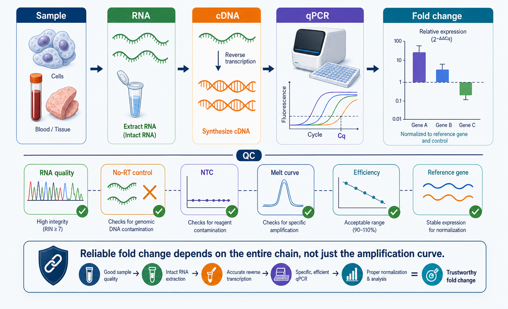
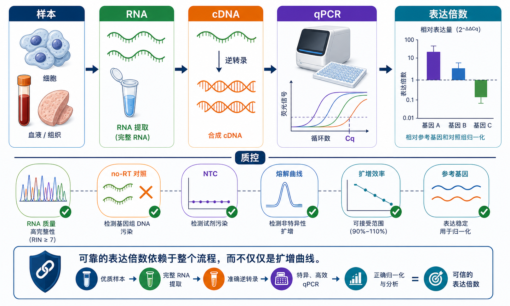

# RT-qPCR

## 实验发明历史

RT-qPCR（Reverse transcription quantitative polymerase chain reaction，逆转录定量聚合酶链式反应）是把 RNA 先逆转录为 cDNA（complementary DNA，互补 DNA），再通过 qPCR（quantitative polymerase chain reaction，定量聚合酶链式反应）实时监测扩增信号，从而定量 RNA 表达水平的实验方法。

它来自几个技术节点的叠加。[PCR](PCR.md)（Polymerase chain reaction，聚合酶链式反应）由 Kary Mullis 于 1980 年代提出，并因 PCR 方法获得 1993 年诺贝尔化学奖。[参考：Nobel Prize PCR 说明](https://www.nobelprize.org/prizes/chemistry/1993/summary/) 1990 年代，Higuchi 等人把荧光信号和 PCR 扩增过程结合，使扩增曲线可以在反应过程中被实时追踪，这奠定了 real-time PCR（实时 PCR）的基础。[参考：Higuchi et al., 1993](https://pubmed.ncbi.nlm.nih.gov/7683443/)

RT-qPCR 后来成为 RNA 表达检测的核心方法之一。为了提高实验可重复性，qPCR 领域提出了 MIQE（Minimum Information for Publication of Quantitative Real-Time PCR Experiments，定量实时 PCR 实验发表最低信息标准）指南，强调样本质量、引物信息、扩增效率、阴性对照、参考基因和数据分析方法必须清楚记录。2009 年 MIQE 指南是 qPCR 报告规范的经典起点；2025 年 MIQE 2.0 进一步更新了对 assay design（实验设计）、sample storage（样本保存）、nucleic acid preparation（核酸制备）、reverse transcription（逆转录）、PCR efficiency（PCR 效率）、melting curve analysis（熔解曲线分析）、data processing（数据处理）和 controls（对照）的建议。[参考：MIQE guidelines, 2009](https://academic.oup.com/clinchem/article/55/4/611/5631762)；[参考：MIQE 2.0, 2025](https://academic.oup.com/clinchem/article/71/6/634/8119148)

## 应用场景

- 基因表达检测：比较不同处理、不同组织、不同时间点中目标基因 mRNA 水平。
- 验证组学结果：验证 RNA-seq、bulk RNA 测序、单细胞测序或芯片筛选得到的候选基因。
- 病原体或病毒核酸检测：检测特定 RNA 病毒或病原体转录本，临床诊断需要额外验证体系。
- 转染、敲低、敲除或过表达效果验证：检测目标基因表达是否改变。
- 药物处理或刺激反应分析：例如炎症因子、凋亡相关基因、代谢基因表达变化。
- 低通量精准验证：相比测序，RT-qPCR 更适合少量目标基因的快速、低成本、高灵敏检测。

注意：如果模板是 DNA，则通常称为 qPCR；如果模板来自 RNA，并包含逆转录步骤，则更准确地称为 RT-qPCR。本文主要讨论 RNA 表达检测场景下的 RT-qPCR。

## 实验目的

RT-qPCR 的实验目的通常是：在不同样本之间比较一个或多个目标基因的相对表达量，或者通过标准曲线获得绝对拷贝数。常规科研中最常见的是相对定量，也就是把目标基因表达量先归一化到 reference gene（参考基因），再比较实验组和对照组。

一个合格的 RT-qPCR 实验不只是“跑出 Cq 值”。它应该回答：

- 样本 RNA 是否完整、纯净、无明显基因组 DNA 污染。
- 逆转录效率是否稳定。
- 引物是否特异，扩增效率是否合理。
- 阴性对照是否干净。
- 参考基因是否适合当前处理条件。
- 统计和归一化方法是否与实验问题匹配。

MIQE 指南建议使用 Cq（quantification cycle，定量循环数）描述定量循环；很多仪器软件仍使用 Ct（threshold cycle，阈值循环数）。两者在日常交流中常被混用，但写正式 protocol 时建议优先使用 Cq，并说明仪器软件使用的术语。[参考：MIQE guidelines](https://academic.oup.com/clinchem/article/55/4/611/5631762)

## 简要实验原理

RT-qPCR 可以拆成两个核心步骤：

1. [Reverse transcription（逆转录）](逆转录.md)：用 reverse transcriptase（逆转录酶）把 RNA 转换成 cDNA。
2. qPCR 扩增检测：用 DNA polymerase（DNA 聚合酶）、引物和荧光体系扩增目标片段，并在每个循环中记录荧光信号。

荧光检测常见两类体系：

| 检测体系         | 原理                           | 优点           | 注意事项                              |
| ------------ | ---------------------------- | ------------ | --------------------------------- |
| SYBR Green   | 染料结合双链 DNA 后发光               | 便宜、通用、设计简单   | 会检测所有双链 DNA，包括非特异扩增和 primer-dimer |
| TaqMan probe | 探针被聚合酶 5' nuclease 活性切割后释放荧光 | 特异性更高，适合多重检测 | 成本更高，需要设计探针                       |

扩增曲线早期荧光低，随后进入指数扩增阶段，最后达到平台期。Cq 值越低，说明样本中目标模板初始量通常越高。理想情况下，每个循环扩增产物约增加一倍；实际实验中扩增效率通常需要通过标准曲线评估。Bio-Rad 和 Thermo Fisher 的 qPCR 指南都强调扩增效率、熔解曲线和阴性对照是判断实验质量的核心指标。[参考：Bio-Rad qPCR guide](https://www.bio-rad.com/en-us/applications-technologies/real-time-pcr-applications-guide)；[参考：Thermo Fisher real-time PCR basics](https://www.thermofisher.com/cn/zh/home/life-science/pcr/real-time-pcr/real-time-pcr-learning-center/real-time-pcr-basics.html)

## 实验所需试剂

以下按常规 RNA 表达 RT-qPCR 设计。不同试剂盒可把多个组分预混，实际准备时以说明书为准。

### RNA 获取与质量控制

- [RNA 提取试剂盒](<../材(实验耗材工具篇)/RNA提取试剂盒.md>) 或 [TRIzol](<../材(实验耗材工具篇)/TRIzol.md>)：用于从细胞或组织中提取总 RNA。
- [氯仿](<../材(实验耗材工具篇)/氯仿.md>)、[异丙醇](<../材(实验耗材工具篇)/异丙醇.md>)、[75% 乙醇](<../材(实验耗材工具篇)/75乙醇.md>)：酚-氯仿法 RNA 提取时常用。
- [DNase I](<../材(实验耗材工具篇)/DNase I.md>)：去除基因组 DNA 污染。
- [无核酸酶水](<../材(实验耗材工具篇)/无核酸酶水.md>)：用于溶解 RNA、稀释 cDNA 和配反应体系。

### 逆转录

- [逆转录试剂盒](<../材(实验耗材工具篇)/逆转录试剂盒.md>)：通常包含逆转录酶、buffer、dNTP 和引物等组分。
- [逆转录酶](<../材(实验耗材工具篇)/逆转录酶.md>)：催化 RNA 生成 cDNA。
- [随机六聚体引物](<../材(实验耗材工具篇)/随机六聚体引物.md>) 或 [Oligo(dT) 引物](<../材(实验耗材工具篇)/Oligo(dT)引物.md>)：启动逆转录。
- [dNTP](<../材(实验耗材工具篇)/dNTP.md>)：DNA 合成底物。
- [RNase 抑制剂](<../材(实验耗材工具篇)/RNase抑制剂.md>)：保护 RNA，减少 RNase 降解。

### qPCR 反应

- [SYBR Green qPCR Master Mix](<../材(实验耗材工具篇)/SYBR Green qPCR Master Mix.md>) 或 probe-based qPCR mix：提供 DNA 聚合酶、buffer、Mg2+、dNTP、荧光染料或探针体系。
- [TaqMan 探针](<../材(实验耗材工具篇)/TaqMan探针.md>)：探针法 qPCR 使用。
- [qPCR 引物](<../材(实验耗材工具篇)/qPCR引物.md>)：包括目标基因引物和参考基因引物。
- [ROX 参比染料](<../材(实验耗材工具篇)/ROX参比染料.md>)：部分 qPCR 仪器需要，用于校正孔间荧光波动。
- [qPCR 板](<../材(实验耗材工具篇)/qPCR板.md>) 或 optical qPCR tube（光学 qPCR 管）。
- [光学封板膜](<../材(实验耗材工具篇)/光学封板膜.md>)：防止蒸发和交叉污染。
- [qPCR 仪](<../材(实验耗材工具篇)/qPCR仪.md>)：实时记录扩增荧光信号。

## 实验操作

### 实验设计与引物准备

**操作内容**：确定实验分组、样本数、目标基因、参考基因、阴性对照和重复方式。为每个基因设计或验证 qPCR 引物。

**意义**：RT-qPCR 的结果质量很大程度在上机前已经决定。引物是否特异、参考基因是否稳定、样本数量是否足够，都会直接影响最终结论。

**关键注意事项**：

- qPCR 扩增片段通常设计为较短片段，常见约 70-200 bp，便于高效扩增。IDT 和 Thermo Fisher 的 qPCR 设计建议都强调较短 amplicon（扩增子）和特异性检查。[参考：IDT qPCR primer design](https://www.idtdna.com/pages/education/decoded/article/designing-qpcr-assays)；[参考：Thermo Fisher qPCR assay design](https://www.thermofisher.com/us/en/home/life-science/pcr/real-time-pcr/real-time-pcr-learning-center/real-time-pcr-basics/real-time-pcr-assay-design.html)
- 引物最好跨 exon-exon junction（外显子-外显子连接处）或跨越较长 intron（内含子），减少基因组 DNA 污染造成的假阳性。
- 每个引物对都应做 melt curve（熔解曲线）或胶图验证，确认单一特异产物。
- 至少设置 technical replicate（技术重复），常见每个样本每个基因 2-3 个孔。
- reference gene 不应该盲目等于 housekeeping gene（管家基因）。处理条件可能改变 GAPDH、ACTB 等常见基因表达。Vandesompele 等人的研究强调多个内参基因几何平均值可提高归一化稳定性。[参考：Vandesompele et al., 2002](https://pubmed.ncbi.nlm.nih.gov/12184808/)

**替代方案**：

- 如果 SYBR Green 特异性差，可改用 TaqMan probe 体系。
- 如果目标基因表达很低，可优化 RNA 输入量、逆转录体系或选择更高灵敏度的 probe 体系。
- 如果没有条件做多个内参，至少应在预实验中验证参考基因在当前处理条件下稳定。

**出错后果**：

- 引物非特异：熔解曲线多峰，Cq 值看似正常但结果不可信。
- primer-dimer（引物二聚体）：阴性对照出现扩增，低表达基因尤其容易被误判。
- 参考基因不稳定：归一化后得到方向错误或夸大的表达变化。

### 样本处理与 RNA 提取

**操作内容**：收集细胞或组织，快速裂解并进行 [RNA 提取](RNA提取.md)。细胞样本通常吸去培养基后用 [PBS](<../材(实验耗材工具篇)/PBS.md>) 或 [DPBS](<../材(实验耗材工具篇)/DPBS.md>) 快速洗涤，再加入裂解液。组织样本应尽量快速剪碎、研磨或匀浆，并减少室温暴露时间。

**意义**：RNA 极易被 RNase（Ribonuclease，核糖核酸酶）降解。RNA 提取质量是 RT-qPCR 的地基，后面任何步骤都无法完全补救劣质 RNA。

**关键注意事项**：

- 样本收集后尽快裂解或低温保存。
- 使用无 RNase 的枪头、管子和水。
- 组织样本要充分匀浆，否则 RNA 得率低且样本代表性差。
- 酚-氯仿法中有机相、蛋白层和水相分离要清楚，避免吸到中间层。
- 柱式试剂盒要避免柱膜过载，过量样本反而会降低纯度。

**替代方案**：

- 少量细胞、临床样本或高通量样本可优先用柱式 RNA 提取试剂盒，流程更稳定。
- 脂肪、纤维化组织或 RNase 丰富组织可用 TRIzol 或专门组织 RNA 试剂盒。
- 如果目标是 miRNA，需要选择兼容小 RNA 的提取体系。

**出错后果**：

- RNA 降解：高 Cq、重复性差、长片段目标更容易扩增失败。
- 酚或盐残留：抑制逆转录和 PCR，表现为所有基因 Cq 偏高或无扩增。
- 基因组 DNA 污染：no-RT control（无逆转录对照）出现扩增，尤其影响无内含子基因或假基因丰富目标。

### RNA 定量与质量评估

**操作内容**：测定 RNA 浓度和纯度，必要时检测 RNA 完整性。常用指标包括 A260/A280、A260/A230、凝胶电泳或 RIN（RNA integrity number，RNA 完整性数值）。

**意义**：相同输入量和相近质量的 RNA 是样本之间可比的基础。NanoDrop 这类分光法可以快速估算纯度，但不能准确判断 RNA 是否降解；荧光定量更适合低浓度 RNA。

**关键注意事项**：

- A260/A280 约 2.0 通常提示 RNA 蛋白污染较少；A260/A230 偏低可能提示酚、盐、胍盐或有机物污染。Thermo Fisher 的核酸定量资料也把 260/280 和 260/230 作为常用纯度指标。[参考：Thermo Fisher nucleic acid quantitation](https://www.thermofisher.com/cn/zh/home/references/ambion-tech-support/rna-tools-and-calculators/nucleic-acid-quantitation.html)
- 分光法读数受污染物影响，浓度很低时不稳定。
- 不同样本 RNA 输入量尽量一致。

**替代方案**：

- 对低浓度样本，用 Qubit 等荧光法定量更可靠。
- 对高要求实验，用 Bioanalyzer、TapeStation 或凝胶检查完整性。

**出错后果**：

- 浓度估计偏高：实际输入 RNA 不足，目标基因 Cq 偏高。
- 污染物残留：逆转录或 qPCR 被抑制。
- 不同样本输入差异过大：归一化压力增加，重复性变差。

### 去除基因组 DNA

**操作内容**：使用 DNase I 处理 RNA，或选择带 on-column DNase digestion（柱上 DNase 消化）的 RNA 提取流程。随后通过 no-RT control 检查是否仍有 DNA 污染。

**意义**：RT-qPCR 的目标是 RNA 表达。如果基因组 DNA 没有去除，qPCR 可能检测到 DNA 模板而不是 cDNA。

**关键注意事项**：

- DNase 处理后要按说明书灭活或纯化，否则残留 DNase 或 buffer 可能影响后续反应。
- 对无内含子基因、假基因、环状 DNA 或基因组 DNA 丰富样本，更要重视 no-RT control。
- 引物设计跨 exon-exon junction 不能完全替代 DNase 和 no-RT control。

**替代方案**：

- 设计跨内含子的引物，让基因组 DNA 产物更长或不易扩增。
- 用 probe 设计跨剪接位点，提高 RNA 来源特异性。

**出错后果**：

- no-RT control 出现扩增：说明可能有 DNA 污染。
- 处理组和对照组 DNA 污染程度不同：会造成假差异。

### 逆转录

**操作内容**：按逆转录试剂盒说明，将 RNA、引物、逆转录酶、dNTP、buffer 和无核酸酶水配置成反应体系，经过退火、延伸和酶失活步骤生成 cDNA。

**意义**：逆转录是 RNA 信息进入 qPCR 的桥。逆转录效率不稳定会直接变成表达量差异。

**关键注意事项**：

- 同一实验中 RNA 输入量应尽量一致。
- 所有样本尽量使用同一批逆转录 mix 和同一反应程序。
- 随机六聚体适合覆盖不同 RNA 区域；Oligo(dT) 偏向 poly(A) mRNA；二者混合常用于 mRNA 表达检测。
- 需要设置 no-RT control，用于判断 DNA 污染。
- 逆转录后的 cDNA 可短期 4°C，较长期 -20°C 保存，避免反复冻融。

**替代方案**：

- One-step RT-qPCR：逆转录和 qPCR 在同一管完成，污染风险低、流程快，适合检测少量目标或诊断流程。
- Two-step RT-qPCR：先逆转录，再用 cDNA 做多个 qPCR，灵活性更高，科研表达检测更常用。

**出错后果**：

- 逆转录失败：所有目标和参考基因 Cq 偏高或无扩增。
- RNA 输入量不一致：样本间差异被放大。
- 引物选择不当：某些转录本区域检测偏差。

### qPCR 反应体系配置

**操作内容**：在冰上或低温条件下配置 qPCR 反应体系，通常包括 qPCR Master Mix、forward primer（正向引物）、reverse primer（反向引物）、模板 cDNA 和无核酸酶水。轻柔混匀，短暂离心去除气泡。

**意义**：qPCR 是微量体系，移液误差、气泡、蒸发和污染都会显著影响结果。

**关键注意事项**：

- 配 master mix 时尽量为所有样本准备统一预混液，减少孔间差异。
- 每个基因设置 NTC（no-template control，无模板对照），用水代替 cDNA。
- 每个 RNA 样本至少保留 no-RT control。
- qPCR 板封膜后要压紧，避免蒸发。
- 上机前短暂离心，让液体集中到孔底并去除气泡。
- 反应体积、引物终浓度和模板量以试剂盒说明书为准，不同品牌不要直接照搬。

**替代方案**：

- 低通量可以用 qPCR 管；高通量用 96 孔或 384 孔光学板。
- SYBR Green 体系便宜通用；TaqMan probe 体系更适合高特异性、低丰度或多重检测。
- 若仪器需要 ROX，必须使用对应 ROX 浓度的 mix；不需要 ROX 的仪器不要随意添加。

**出错后果**：

- NTC 扩增：可能污染或 primer-dimer。
- 复孔差异大：移液误差、气泡、封膜不严或模板混匀不充分。
- 全板边缘孔异常：可能蒸发或温控不均。

### qPCR 上机程序

**操作内容**：设置 qPCR 仪程序。常见 SYBR Green two-step 程序包括酶激活/预变性、循环变性和退火/延伸，最后加 melt curve。TaqMan probe 体系通常不需要熔解曲线。

**示例程序**：

| 步骤 | 温度 | 时间 | 循环 |
| --- | --- | --- | --- |
| 预变性/酶激活 | 95°C | 2-10 min | 1 |
| 变性 | 95°C | 5-15 s | 40 |
| 退火/延伸 | 60°C | 20-60 s | 40 |
| Melt curve | 60-95°C | 按仪器设置 | 1 |

**关键注意事项**：

- 上述只是常见框架，具体温度和时间应以 qPCR mix、引物 Tm 和仪器说明为准。
- SYBR Green 必须看 melt curve，单峰通常提示特异性较好。
- 扩增循环数过多会增加非特异扩增和污染信号的解释风险。

**替代方案**：

- 如果引物 Tm 不一致，可做 temperature gradient（温度梯度）优化退火温度。
- 如果扩增效率差，可优化引物浓度、退火温度、Mg2+ 或重新设计引物。

**出错后果**：

- 退火温度过低：非特异扩增和 primer-dimer 增加。
- 退火温度过高：扩增效率低，Cq 偏高。
- 未做 melt curve：SYBR Green 结果难以判断特异性。

## 实验结果解析

### 首先看质控

先不要急着算 fold change。推荐按这个顺序检查：

1. NTC 是否无扩增，或 Cq 明显晚于样本且熔解曲线不对应目标产物。
2. no-RT control 是否无扩增，判断是否有 DNA 污染。
3. technical replicate 的 Cq 是否接近，常见要求标准差不要过大。
4. melt curve 是否单峰，TaqMan 体系则看扩增曲线形状和阴性对照。
5. 参考基因 Cq 是否稳定。
6. 目标基因 Cq 是否在可信检测范围内，过晚的 Cq 需要谨慎解释。

### 扩增效率与标准曲线

严格实验应使用标准曲线评估引物效率。常见做法是将 cDNA 或标准品做梯度稀释，绘制 Cq 对 log 输入量的标准曲线。许多 qPCR 指南建议扩增效率约 90%-110% 作为常见可接受范围，同时 R2 应足够高。[参考：Bio-Rad qPCR assay design](https://www.bio-rad.com/en-us/applications-technologies/real-time-pcr-assay-design-optimization)

如果目标基因和参考基因效率接近，可以使用 2^-ΔΔCq 方法。Livak 和 Schmittgen 2001 年文章是该方法最常引用的来源之一。[参考：Livak and Schmittgen, 2001](https://pubmed.ncbi.nlm.nih.gov/11846609/) 如果扩增效率不同，应考虑 Pfaffl 方法等效率校正模型。[参考：Pfaffl, 2001](https://pubmed.ncbi.nlm.nih.gov/11328886/)

### 相对定量基本流程

常见 2^-ΔΔCq 流程：

1. 对每个样本计算 ΔCq = Cq(target gene) - Cq(reference gene)。
2. 选择对照组或 calibrator（校准样本）。
3. 计算 ΔΔCq = ΔCq(sample) - ΔCq(control)。
4. 相对表达量 = 2^-ΔΔCq。

如果使用多个参考基因，可以先计算参考基因表达的几何平均值，再用于归一化。这样通常比单一参考基因更稳健。[参考：Vandesompele et al., 2002](https://pubmed.ncbi.nlm.nih.gov/12184808/)

### 结果表达建议

- 图中建议展示 biological replicate（生物学重复）的均值和离散程度，而不是只展示技术重复。
- 统计检验应基于独立生物学重复。
- 如果使用 ΔCq 做统计，再转换成 fold change 展示，需要在方法中写清楚。
- 低表达基因、Cq 很晚或接近检测下限时，不宜过度解释小倍数变化。

## 可能出现异常结果及对应原因

| 异常结果 | 可能原因 | 处理策略 |
| --- | --- | --- |
| 所有样本都无扩增 | 逆转录失败、qPCR mix 漏加、程序设置错误、模板太少 | 检查阳性对照、反应体系、程序和 cDNA |
| 目标基因无扩增，参考基因正常 | 目标表达极低、引物设计失败、退火温度不合适 | 做阳性样本、梯度退火、重新设计引物 |
| NTC 有扩增 | 试剂污染、引物二聚体、环境污染 | 更换水和 mix，重新配引物，检查 melt curve |
| no-RT 有扩增 | 基因组 DNA 污染 | DNase 处理，优化引物跨 exon junction |
| 复孔差异大 | 移液误差、气泡、封膜不严、模板混匀差 | 使用 master mix，离心板，重新封膜 |
| 熔解曲线多峰 | 非特异扩增、引物二聚体 | 提高退火温度，降低引物浓度，重新设计引物 |
| 扩增效率低于 90% | 引物效率差、抑制物残留、模板结构复杂 | 优化引物，稀释模板，改善 RNA 纯化 |
| 扩增效率高于 110% | 标准曲线移液误差、非特异扩增、阈值设置错误 | 重做稀释梯度，检查 melt curve 和阈值 |
| 参考基因变化明显 | 处理影响了参考基因表达 | 更换或增加参考基因 |
| 实验组变化巨大但重复差 | 样本质量不一致、RNA 降解、逆转录不稳定 | 回查 RNA 质量和逆转录批次 |
| 边缘孔 Cq 偏移 | 蒸发、封膜不严、板温控边缘效应 | 避免边缘孔或加强封膜和离心 |

## 推荐记录模板

为了让 RT-qPCR 结果可复现，建议至少记录：

- 样本来源、处理条件、收样时间。
- RNA 提取方法、RNA 浓度、A260/A280、A260/A230、完整性评估。
- 是否 DNase 处理，no-RT control 结果。
- 逆转录试剂盒、RNA 输入量、逆转录引物类型、反应程序。
- qPCR mix 品牌和货号、引物序列、探针序列、引物终浓度。
- qPCR 仪型号、反应体积、上机程序。
- NTC、no-RT、阳性对照、标准曲线和 melt curve。
- 扩增效率、参考基因选择依据、数据分析方法。

## 小结

RT-qPCR 的技术核心不是“把样本放进 qPCR 仪”，而是控制从 RNA 到数据分析的整条链路。样本质量决定地基，逆转录决定 RNA 信息能否稳定转成 cDNA，引物和扩增效率决定 qPCR 是否可信，参考基因和分析方法决定表达量比较是否成立。

最实用的判断句是：**RT-qPCR 结果可信之前，必须先让 RNA 质量、阴性对照、扩增特异性、扩增效率和参考基因稳定性都过关。**
