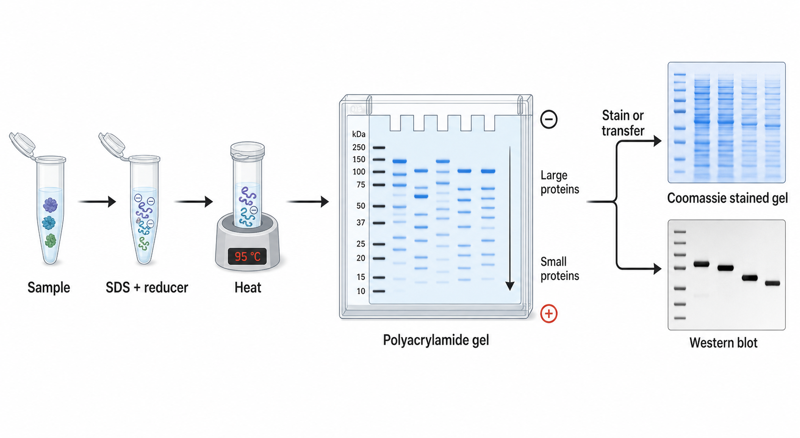
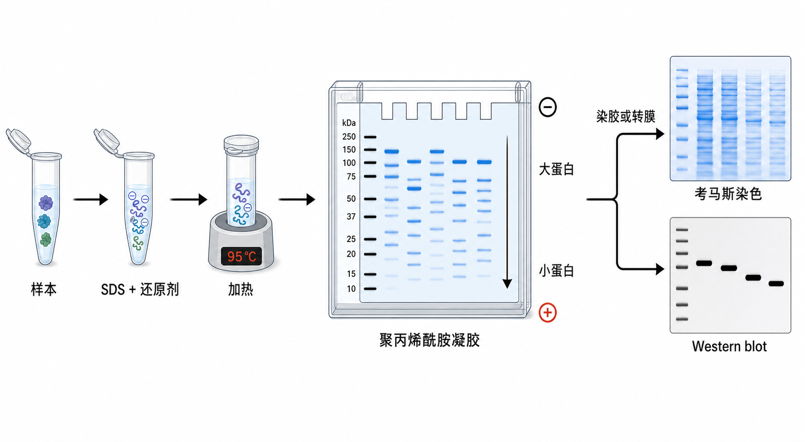

# SDS-PAGE





SDS-PAGE（sodium dodecyl sulfate-polyacrylamide gel electrophoresis，十二烷基硫酸钠-聚丙烯酰胺凝胶电泳）是一种在 [SDS](<../材(实验耗材工具篇)/SDS.md>) 变性条件下用聚丙烯酰胺凝胶按表观分子量分离蛋白的电泳方法。它既可以作为独立实验用于观察总蛋白、蛋白纯度和分子量，也可以作为 [Western blot](<Western blot.md>) 的前置分离步骤。

## 一句话理解

SDS-PAGE 是“先把蛋白尽量拉直并统一带负电，再让它们在凝胶筛网里按大小分开”。

SDS-PAGE 和 WB 的关系可以这样理解：

```text
SDS-PAGE = 蛋白按大小分离
Western blot = SDS-PAGE 分离 + 转膜 + 抗体检测 + 成像分析
```

所以，在 WB workflow 中 SDS-PAGE 是其中一步；但如果电泳后直接做 [考马斯亮蓝](<../材(实验耗材工具篇)/考马斯亮蓝.md>) 染色、银染或胶切质谱，它也可以作为独立实验。

## 发明历史与命名

PAGE（polyacrylamide gel electrophoresis，聚丙烯酰胺凝胶电泳）利用聚丙烯酰胺凝胶的分子筛效应分离生物大分子。Laemmli 在 1970 年发表的经典体系把 SDS 与不连续缓冲系统结合，用于分离噬菌体 T4 结构蛋白，成为现代 SDS-PAGE 和后续 Western blot 的基础之一。参考：[Laemmli 1970](https://pubmed.ncbi.nlm.nih.gov/5432063/)。

SDS 指 sodium dodecyl sulfate（十二烷基硫酸钠），是一种阴离子去污剂。PAGE 指 polyacrylamide gel electrophoresis（聚丙烯酰胺凝胶电泳）。合起来，SDS-PAGE 强调的是“在 SDS 变性条件下进行的聚丙烯酰胺凝胶电泳”。

## 应用场景

| 场景 | 为什么用 SDS-PAGE |
| --- | --- |
| Western blot 前分离 | 先把混合蛋白按分子量分开，后续再用抗体识别目标 |
| 蛋白纯化质控 | 看纯化样品是否主要为单一条带 |
| 重组蛋白表达检查 | 比较诱导前后或不同组分中的目标蛋白条带 |
| 总蛋白模式观察 | 染胶后观察样本复杂度和上样均一性 |
| 胶切质谱 | 分离后切下目标条带做 [蛋白质谱](蛋白质谱.md) |
| 比较蛋白降解/聚集 | 观察异常低分子或高分子条带 |

不适合用 SDS-PAGE 单独回答的问题：

- “这个条带一定是某个目标蛋白吗？”仅靠分子量通常不能证明，需要 WB、质谱或纯化验证。
- “蛋白天然复合物多大？”普通 SDS-PAGE 是变性体系，不适合保留天然复合物。
- “蛋白活性是否存在？”SDS-PAGE 主要看分离，不直接测功能。

## 实验目的

一次 SDS-PAGE 通常回答：

- 样本中蛋白是否成功提取或表达。
- 目标条带是否在预期 [蛋白分子量](<../番外/补充知识/蛋白分子量.md>) 附近。
- 蛋白样本是否降解、聚集或杂带很多。
- 各组样本总蛋白上样是否大致一致。
- 后续是否适合转膜、染胶、胶切或质谱分析。

如果目标是检测某个特定蛋白，SDS-PAGE 本身只是分离步骤；需要继续做 Western blot 或质谱。

## 简要实验原理

SDS 会结合多数蛋白，使蛋白变性并获得近似与长度成比例的负电荷。[DTT](<../材(实验耗材工具篇)/DTT.md>)（dithiothreitol，二硫苏糖醇）、[β-巯基乙醇](<../材(实验耗材工具篇)/β-巯基乙醇.md>) 或 [TCEP](<../材(实验耗材工具篇)/TCEP.md>) 这类还原剂可以断开二硫键，使多肽链更接近单链状态。

在电场中，带负电的 SDS-蛋白复合物从阴极向阳极迁移。聚丙烯酰胺凝胶像分子筛：小蛋白更容易穿过凝胶孔，迁移更远；大蛋白受到更强阻碍，迁移较慢。

Bio-Rad 和 Thermo Fisher 的蛋白电泳资料都把 SDS-PAGE 描述为通过 SDS 变性并按分子量分离蛋白的核心方法，后续可用于染胶或 Western blot。参考：[Bio-Rad protein electrophoresis guide](https://www.bio-rad.com/en-us/applications-technologies/protein-electrophoresis)；[Thermo Fisher protein gel electrophoresis](https://www.thermofisher.com/us/en/home/life-science/protein-biology/protein-gel-electrophoresis.html)。

## SDS-PAGE vs Western blot

| 项目 | SDS-PAGE | Western blot |
| --- | --- | --- |
| 核心目的 | 分离蛋白 | 检测特定蛋白 |
| 是否用抗体 | 不用 | 用一抗和二抗 |
| 主要依据 | 表观分子量 | 分子量 + 抗体特异性 |
| 结果形式 | 染胶总蛋白条带 | 膜上目标蛋白条带 |
| 能否独立成实验 | 可以 | 是完整免疫检测流程 |
| 常见下一步 | 考马斯染色、银染、胶切、转膜 | 封闭、抗体孵育、ECL/荧光成像 |

一句话：SDS-PAGE 可以独立做；但在 WB 里，它是“按大小排队”的那一步。

## 所需试剂、耗材和设备

| 类别 | 常用内容 | 作用 |
| --- | --- | --- |
| 样本处理 | 蛋白样本、[Laemmli上样缓冲液](<../材(实验耗材工具篇)/Laemmli上样缓冲液.md>)、DTT/β-巯基乙醇/TCEP | 变性、还原、加密度和示踪染料 |
| 凝胶 | [SDS-PAGE凝胶](<../材(实验耗材工具篇)/SDS-PAGE凝胶.md>)、[预制胶](<../材(实验耗材工具篇)/预制胶.md>) 或 [手灌胶](<../材(实验耗材工具篇)/手灌胶.md>) | 提供分离介质 |
| 手灌胶原料 | [丙烯酰胺](<../材(实验耗材工具篇)/丙烯酰胺.md>)、[甲叉双丙烯酰胺](<../材(实验耗材工具篇)/甲叉双丙烯酰胺.md>)、[Tris](<../材(实验耗材工具篇)/Tris.md>)、SDS、[过硫酸铵](<../材(实验耗材工具篇)/过硫酸铵.md>)、[TEMED](<../材(实验耗材工具篇)/TEMED.md>) | 形成聚丙烯酰胺凝胶 |
| 运行缓冲液 | [Tris-Glycine-SDS运行缓冲液](<../材(实验耗材工具篇)/Tris-Glycine-SDS运行缓冲液.md>) | 提供电泳离子环境 |
| 上样辅助 | [蛋白Marker](<../材(实验耗材工具篇)/蛋白Marker.md>)、上样枪头、凝胶梳 | 判断分子量和上样 |
| 设备 | [电泳槽](<../材(实验耗材工具篇)/电泳槽.md>)、[电泳电源](<../材(实验耗材工具篇)/电泳电源.md>) | 运行电泳 |
| 结果观察 | 考马斯亮蓝、[银染](<../材(实验耗材工具篇)/银染.md>)、凝胶成像系统 | 显示蛋白条带 |

安全提醒：未聚合的丙烯酰胺有神经毒性，配胶时必须戴合适手套、实验服和护目镜，并按实验室危化品规范处理废液。聚合后的凝胶风险较低，但仍应按污染耗材处理。

## 实验操作

### 实验设计与胶浓度选择

**怎么做**：根据目标蛋白的预期分子量选择胶浓度或梯度胶。小蛋白用更高百分比胶，大蛋白用更低百分比胶或梯度胶。

| 目标蛋白大小 | 常见胶选择 | 注意 |
| --- | --- | --- |
| <20 kDa | 12%-15% 或 Tris-Tricine 系统 | 小蛋白易跑出胶，WB 时也容易穿膜 |
| 20-80 kDa | 8%-12% | 多数常规蛋白适用 |
| 80-200 kDa | 6%-8% 或梯度胶 | 大蛋白分离和转膜都要优化 |
| >200 kDa | 低浓度胶或梯度胶 | 避免凝胶过密，电泳和转膜时间常需延长 |

**为什么**：凝胶百分比越高，孔径越小，更适合分离小蛋白；凝胶百分比越低，孔径越大，更适合大蛋白迁移。

**注意事项**：

- 不同厂家的预制胶缓冲体系不同，不能只按百分比机械比较。
- 如果目标蛋白大小不明确，梯度胶更宽容。
- 如果是 WB，胶选择还要同时考虑后续转膜效率。

**替代方案**：预制胶稳定、省时、批间一致；手灌胶便宜、灵活，但需要熟练操作和注意丙烯酰胺安全。

**出错后果**：胶浓度不合适会导致条带挤在一起、目标跑出胶、目标进不去胶或分辨率很差。

### 样本准备与变性还原

**怎么做**：将蛋白样本与 Laemmli sample buffer（Laemmli 上样缓冲液）混合，按需要加入还原剂。常见条件是 95°C 加热 5 min，或按试剂盒/目标蛋白特性调整为较低温度。

**为什么**：SDS 负责变性和赋予负电荷；还原剂断开二硫键；[甘油](<../材(实验耗材工具篇)/甘油.md>) 增加密度帮助样本沉入孔底；[溴酚蓝](<../材(实验耗材工具篇)/溴酚蓝.md>) 作为 dye front（染料前沿）提示电泳进度。

**注意事项**：

- 膜蛋白、多跨膜蛋白或易聚集蛋白高温煮样可能形成聚集物，可尝试 70°C 10 min 或不煮。
- 还原剂现用现加更稳定，β-巯基乙醇有强烈气味和刺激性。
- 上样前短暂离心，避免样本挂壁或气泡。
- 做非还原电泳时不要加入还原剂，但要在记录中说明。

**替代方案**：某些抗体识别构象或二硫键相关状态时，可做 [非还原电泳](<../番外/补充知识/非还原电泳.md>)；普通 WB 和纯度分析通常使用还原变性条件。

**出错后果**：变性不足会导致迁移异常；过度加热会使部分蛋白聚集；还原不足会出现二聚体或多聚体条带。

### 配胶或准备预制胶

**怎么做**：使用预制胶时，取出凝胶、去除封条、冲洗上样孔并装入电泳槽。手灌胶时，先灌 separating gel（分离胶），待聚合后再灌 stacking gel（浓缩胶）并插入梳子。

**为什么**：分离胶负责按大小分离蛋白；浓缩胶通过 pH 和离子系统让样本在进入分离胶前被压缩成窄带，提高分辨率。

**注意事项**：

- 手灌胶中 [过硫酸铵](<../材(实验耗材工具篇)/过硫酸铵.md>) 和 TEMED 启动自由基聚合，加入后要尽快灌胶。
- 氧气会抑制聚合，分离胶表面常用水或异丙醇覆盖以保持平整并隔绝空气。
- 凝胶未完全聚合会导致条带变形和漏样。
- 预制胶要确认缓冲体系和电泳槽兼容。

**替代方案**：如果重复性要求高或新手操作，优先预制胶；如果需要特殊百分比、特殊添加剂或成本控制，可以手灌胶。

**出错后果**：胶聚合不良会导致泳道歪斜、条带拖尾、样本漏孔或整块胶发软。

### 装槽与加运行缓冲液

**怎么做**：将凝胶固定在电泳槽中，内外槽加入运行缓冲液，确认内槽不漏液。冲洗上样孔，去除残留储存液或未聚合物。

**为什么**：稳定的离子环境和完整电路是电泳迁移的前提。内槽漏液会导致电流异常和样本跑不下去。

**注意事项**：

- 确认运行缓冲液配方正确，常规 Laemmli 系统使用 Tris-Glycine-SDS。
- 不要把转膜缓冲液误用于电泳。
- 缓冲液重复使用次数过多会影响迁移和散热。
- 确认凝胶方向和电极方向正确，蛋白应向正极移动。

**替代方案**：不同预制胶体系可能使用 MOPS、MES 或 Bis-Tris 运行缓冲液，应按厂家说明匹配。

**出错后果**：缓冲液错误、电极反接或漏液会导致样本不迁移、反向跑、发热严重或条带异常。

### 上样与电泳运行

**怎么做**：每孔加入等量蛋白样本，并设置蛋白 Marker。常见运行方式是先低电压通过浓缩胶，再提高电压进入分离胶；也可按预制胶说明书使用固定电压运行。

**为什么**：等量上样保证样本之间可比较；Marker 用于估计条带分子量；低电压起跑有助于样本集中，减少扩散。

**注意事项**：

- 不要刺破上样孔底部。
- 上样体积不要超过孔容量。
- 高盐、高去污剂或黏稠样本会影响迁移。
- 电泳发热会导致条带弯曲，必要时降低电压或冷却。
- 染料前沿接近胶底时停止，避免小蛋白跑出胶。

**替代方案**：若目标是小蛋白，可缩短运行时间或使用更适合小蛋白的体系；若目标是大蛋白，可延长低电压运行以改善分离。

**出错后果**：过量上样导致条带粗、拖尾和定量不准；运行过久会丢失小蛋白；运行过热会导致 smiling bands（笑脸条带）。

### 电泳后处理：染胶或转膜

**怎么做**：如果 SDS-PAGE 作为独立分析，电泳后进行考马斯染色、银染或荧光总蛋白染色。如果用于 WB，则电泳后进入转膜步骤。

**为什么**：染胶用于观察总蛋白或纯化条带；转膜用于把蛋白转移到膜上，让抗体可以检测特定目标。

| 后续方式 | 适合用途 | 注意 |
| --- | --- | --- |
| 考马斯染色 | 常规总蛋白和纯度检查 | 灵敏度中等，操作简单 |
| 银染 | 低量蛋白检测 | 灵敏度高，但质谱兼容性和线性范围需注意 |
| 荧光总蛋白染色 | 定量和归一化 | 需要对应成像系统 |
| 转膜 | Western blot | 需要优化膜类型、时间和转膜条件 |

**替代方案**：如果只是验证纯化蛋白是否存在，染胶更直接；如果需要确认目标身份，WB 或质谱更可靠。

**出错后果**：染色过度会背景高；脱色不足会看不清弱条带；转膜条件不合适会导致目标蛋白留在胶中或穿过膜。

## 结果解析

| 观察 | 可能解释 |
| --- | --- |
| Marker 清楚、泳道直 | 电泳运行基本正常 |
| 样本条带集中清晰 | 样本质量和电泳条件较好 |
| 条带整体拖尾 | 样本盐高、上样过量、降解或聚集 |
| 高分子区域堆积 | 大蛋白变性不足或胶浓度过高 |
| 低分子区域很多碎条带 | 蛋白降解或样本处理过度 |
| 泳道弯曲或笑脸 | 电泳过热、电压过高或缓冲液问题 |
| 左右泳道迁移不同 | 凝胶聚合、装槽或温度不均 |

解释 SDS-PAGE 时要谨慎：条带分子量接近预期不等于一定是目标蛋白。对于复杂裂解液，单凭染胶不能确认目标身份。

## 常见异常结果及对应原因

| 异常 | 可能原因 | 调整方向 |
| --- | --- | --- |
| 无条带 | 上样失败、染色失败、蛋白浓度太低 | 检查样本、Marker 和染色流程 |
| 条带拖尾 | 上样过量、盐浓度高、样本黏稠 | 降低上样量，脱盐或稀释样本 |
| 条带弯曲 | 电泳过热、电压过高 | 降低电压，使用新鲜缓冲液 |
| 样本跑不进胶 | 蛋白聚集、样本太黏、孔堵塞 | 重新变性，离心澄清，降低样本浓度 |
| Marker 正常但样本异常 | 样本制备问题 | 检查裂解液、盐、还原剂和加热条件 |
| 样本正常但 Marker 异常 | Marker 失效或上样错误 | 换新 Marker |
| 多个意外条带 | 蛋白降解、杂蛋白、非纯样本 | 加抑制剂，优化纯化或裂解条件 |
| 低分子蛋白消失 | 跑出胶或转膜穿膜 | 缩短电泳/转膜，换小孔径膜 |

## 胶浓度选择速查

| 胶类型 | 适合情况 | 备注 |
| --- | --- | --- |
| 6% | 大蛋白 | 凝胶较软，操作要小心 |
| 8% | 中大蛋白 | 常用于 80-200 kDa |
| 10% | 通用中等蛋白 | 常规起点 |
| 12% | 中小蛋白 | 常用于 20-80 kDa |
| 15% | 小蛋白 | 小蛋白分辨率更好 |
| 4%-20% 梯度胶 | 范围不确定或多个目标 | 方便但成本高 |

这个表是经验起点，不是硬规则。不同缓冲系统、预制胶品牌和目标蛋白性质会改变最佳选择。

## 记录模板

中文记录：

```text
实验日期：
样本名称：
样本来源：
蛋白浓度：
每孔上样量：
上样缓冲液：
还原剂：
变性条件：
凝胶类型：预制胶 / 手灌胶
凝胶百分比：
运行缓冲液：
电泳条件：
蛋白 Marker：
后续处理：考马斯染色 / 银染 / 转膜 / 胶切
异常观察：
结论：
```

English record:

```text
Date:
Sample name:
Sample source:
Protein concentration:
Protein loaded per well:
Sample buffer:
Reducing agent:
Denaturation condition:
Gel type: precast / hand-cast
Gel percentage:
Running buffer:
Electrophoresis condition:
Protein marker:
Downstream step: Coomassie staining / silver staining / transfer / gel excision
Abnormal observations:
Conclusion:
```

## 小结

SDS-PAGE 是蛋白实验里最基础的分离模块。它在 WB 中是前置步骤，但本身也能独立用于总蛋白、纯度和分子量质控。读结果时要记住：SDS-PAGE 看的是表观分子量和总蛋白模式，目标身份确认还需要抗体、质谱或其他验证。

## 参考来源

- [Laemmli 1970: Cleavage of structural proteins during the assembly of the head of bacteriophage T4](https://pubmed.ncbi.nlm.nih.gov/5432063/)
- [Bio-Rad protein electrophoresis](https://www.bio-rad.com/en-us/applications-technologies/protein-electrophoresis)
- [Thermo Fisher protein gel electrophoresis](https://www.thermofisher.com/us/en/home/life-science/protein-biology/protein-gel-electrophoresis.html)
- [Abcam SDS-PAGE protocol](https://www.abcam.com/en-us/technical-resources/protocols/sds-page)
