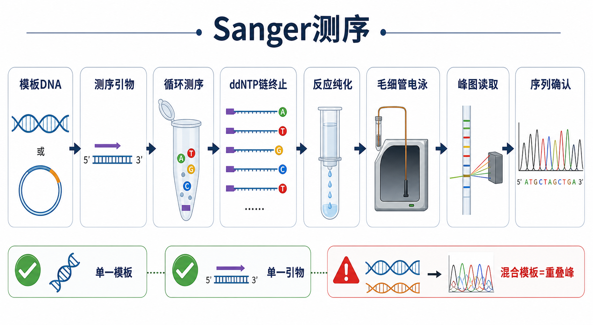
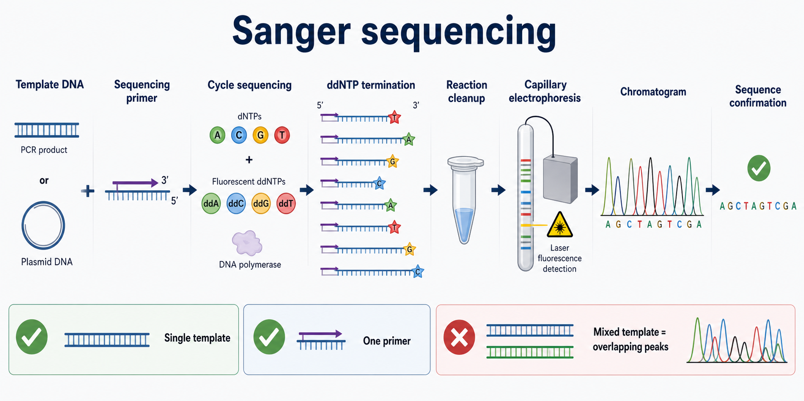

# Sanger测序

Sanger sequencing（Sanger 测序，中文常称桑格测序、双脱氧链终止测序）是利用 dideoxynucleotide triphosphate（[ddNTP](<../材(实验耗材工具篇)/ddNTP.md>)，双脱氧核苷三磷酸）造成 DNA 合成随机终止，再通过 [毛细管电泳](毛细管电泳.md) 分离不同长度片段并读取荧光信号的 DNA 测序方法。它最适合验证单一 PCR 产物、质粒插入片段、点突变和克隆构建结果。





一句话理解：Sanger 测序不是一次性读完整个样本的所有 DNA，而是用一个 [测序引物](<../材(实验耗材工具篇)/测序引物.md>) 从单一模板上的一个位置开始延伸，通过 ddNTP 随机终止生成一组相差 1 个碱基的片段，再按长度分离并把荧光峰图转换成序列。

## 实验发明历史与背景

Sanger sequencing 的经典基础是 Frederick Sanger、Steve Nicklen 和 Alan Coulson 在 1977 年发表的 chain-terminating inhibitors（链终止抑制剂）DNA 测序方法。其核心思想是：在 DNA 合成体系中加入少量不能继续延伸的 ddNTP，使新生链在不同碱基位置随机终止，从而得到一组不同长度的 DNA 片段。参考：[Sanger et al., 1977, PNAS](https://www.pnas.org/doi/10.1073/pnas.74.12.5463)。

早期 Sanger 测序常使用放射性标记和凝胶电泳；现代常规实验室和测序服务平台多使用 dye-terminator sequencing（荧光染料终止子测序）、cycle sequencing（循环测序）和 capillary electrophoresis（毛细管电泳）。[Applied Biosystems](<../番外/试剂厂商/Applied Biosystems.md>) / [Thermo Fisher Scientific](<../番外/试剂厂商/Thermo Fisher Scientific.md>) 的 BigDye Terminator 体系和遗传分析仪是现代 Sanger workflow 中非常经典的商品化平台。参考：[Thermo Fisher Sanger Sequencing](https://www.thermofisher.com/us/en/home/life-science/sequencing/sanger-sequencing.html)、[BigDye Terminator v3.1 Cycle Sequencing Kit](https://www.thermofisher.com/order/catalog/product/4337455)。

虽然 next-generation sequencing（[下一代测序](../番外/补充知识/下一代测序.md)，NGS）可以并行读取海量片段，Sanger 测序仍然很重要，因为它便宜、直接、读长较长、单个位点验证方便，而且 [测序峰图](../番外/补充知识/测序峰图.md) 可以让人直观看到模板是否单一、是否有杂合/混合信号、是否有读长衰减。

## 应用场景

- 验证 [PCR](PCR.md) 产物序列是否与预期一致。
- 验证 [质粒提取](质粒提取.md) 后的 [质粒DNA](<../材(实验耗材工具篇)/质粒DNA.md>) 是否含有正确插入片段、突变或标签。
- 验证 [Gibson组装](Gibson组装.md)、[连接反应](连接反应.md)、定点突变或克隆筛选结果。
- 检查 CRISPR 编辑后的单克隆靶位点，但混合细胞群或 indel 混合峰需要谨慎解读。
- 确认少量关键位点、短片段或 NGS 结果中的候选突变。
- 鉴定细菌菌落 PCR、16S rRNA 片段或普通分子克隆插入方向。

不适合的情况：

- 样本里存在多个模板、多个 PCR 条带或混合质粒群。
- 需要同时测全基因组、全外显子组、转录组或大量样本。
- 片段很长且需要完整覆盖，单个 Sanger 反应读长不够。
- 重复序列、长 homopolymer、强二级结构或 GC-rich 区域导致峰图快速衰减。

## 实验目的

Sanger 测序的常见实验目的包括：

- 确认序列正确：目标片段是否与设计序列一致。
- 确认突变：点突变、缺失、插入或标签是否存在。
- 确认方向：插入片段是否按正确方向进入载体。
- 确认纯度：模板是否单一，有无重叠峰、混合模板或污染。
- 确认克隆：挑选正确阳性克隆进入后续扩增、保存或功能实验。

## 简要实验原理

### 单一模板和单一引物

Sanger 测序的起点是“一个模板区域 + 一个测序引物”。测序引物与模板特异结合后，DNA polymerase（[DNA聚合酶](<../材(实验耗材工具篇)/DNA聚合酶.md>)）从引物 3' 端开始延伸。

如果模板不单一，例如 PCR 有多个双链条带、菌液中有混合克隆、质粒提取污染了其他质粒，测序峰图就会从某个位置开始出现重叠峰。若加入两个测序引物，两个方向的延伸反应会混在同一个毛细管读数中，也会造成峰图混乱。

### ddNTP 链终止

常规 DNA 延伸需要 deoxynucleotide triphosphate（dNTP，脱氧核苷三磷酸）。ddNTP 缺少 3'-OH，掺入新生链后不能继续形成下一个磷酸二酯键，因此造成链终止。这就是 chain termination method（[链终止法](../番外/补充知识/链终止法.md)）的核心。

现代 dye-terminator Sanger reaction 中，ddATP、ddTTP、ddGTP 和 ddCTP 带有不同荧光染料。反应结束后会得到一组以不同碱基终止、长度相差 1 个或若干碱基的 DNA 片段。

### 循环测序

Cycle sequencing（循环测序）类似 PCR 的温控循环，但通常只使用一个测序引物，因此产物是从同一方向延伸形成的线性扩增片段集合，而不是指数扩增。常见测序反应会使用 [BigDye Terminator](<../材(实验耗材工具篇)/BigDye Terminator.md>) 或同类 dye-terminator reagent。正式条件应按试剂盒和测序平台 SOP 设置，不应把某个 kit 的温度/循环数当成通用规则。

### 反应后纯化和毛细管电泳

循环测序后，体系里仍有未掺入的染料终止子、盐和其他小分子，需要用 [测序反应纯化试剂盒](<../材(实验耗材工具篇)/测序反应纯化试剂盒.md>)、[乙醇沉淀](../番外/补充知识/乙醇沉淀.md) / [EDTA](<../材(实验耗材工具篇)/EDTA.md>) 沉淀或磁珠体系去除。随后片段在毛细管中按长度分离，激光检测荧光信号，软件把不同颜色峰转换为 A/T/G/C 序列和质量信息。

Thermo Fisher 的 Sanger sequencing 资料也将现代流程概括为 cycle sequencing、capillary electrophoresis 和数据分析。参考：[Thermo Fisher Sanger Sequencing](https://www.thermofisher.com/us/en/home/life-science/sequencing/sanger-sequencing.html)。

## 所需试剂、耗材和设备

| 类别 | 常用内容 | 作用 | 注意事项 |
|---|---|---|---|
| 模板 | PCR 产物、质粒 DNA、菌落 PCR 产物 | 被读取的 DNA | 必须尽量单一、干净、浓度合适 |
| 前处理 | [PCR产物纯化](PCR产物纯化.md)、[ExoSAP酶促纯化](ExoSAP酶促纯化.md)、[凝胶回收](凝胶回收.md) | 去除引物、dNTP、盐或错误条带 | 多条带必须先做尺寸选择 |
| 引物 | 测序引物 | 定义读取起点和方向 | 一次反应通常只加一个引物 |
| 测序反应 | BigDye Terminator 或同类试剂、DNA 聚合酶、dNTP/ddNTP | 产生荧光终止片段 | 按平台 SOP 和 kit 说明设置 |
| 纯化 | 乙醇/EDTA 沉淀、磁珠或测序反应纯化 kit | 去除游离染料和盐 | 染料残留会造成 dye blob |
| 上机 | [Hi-Di甲酰胺](<../材(实验耗材工具篇)/Hi-Di甲酰胺.md>) 或等效变性上样液、[毛细管测序仪](<../材(实验耗材工具篇)/毛细管测序仪.md>) | 变性并进行毛细管分离 | 注意样本板、孔位和样本表一致 |
| 质控 | [微量紫外分光光度计](<../材(实验耗材工具篇)/微量紫外分光光度计.md>)、[Qubit荧光计](<../材(实验耗材工具篇)/Qubit荧光计.md>)、琼脂糖凝胶 | 判断浓度、纯度和是否单一 | PCR 产物低浓度时 Qubit 更可靠 |
| 分析 | ABI/ab1 文件、峰图查看软件、[序列比对](../番外/补充知识/序列比对.md) 工具 | 判断序列是否正确 | 不要只看自动导出的文本序列 |

## 实验设计

### 选择模板类型

| 模板类型 | 前处理重点 | 常见风险 | 适合问题 |
|---|---|---|---|
| PCR 产物 | 先确认单一条带，再 ExoSAP 或 PCR cleanup | 多条带、primer dimer、模板量不足 | 验证扩增片段或编辑位点 |
| 质粒 DNA | 质粒纯度、浓度、单克隆来源 | 混菌、低质量 mini-prep、盐/乙醇残留 | 验证插入片段、突变、标签 |
| 菌落 PCR | 产物是否单一、菌落是否单克隆 | 背景杂带、混合菌落 | 快速筛选阳性克隆 |
| 复杂样本直接 PCR | 特异性和模板混合风险 | 杂合、混合模板或非特异扩增 | 需要谨慎解读峰图 |

### 设计测序引物

测序引物不是越靠近目标位点越好。Sanger 前几十个碱基常常质量不稳定，因此引物结合位置通常应离目标读取区域留出一定距离。引物设计还要避免：

- 结合多个位置。
- 明显 hairpin（发卡结构）或 primer dimer。
- 过低或过高 Tm。
- 离模板边界太近，导致目标区域出现在低质量前端。
- 与载体通用引物或插入片段内部引物方向混淆。

如果目标片段较长，通常需要设计多个 walking primers（步移测序引物）从不同位置覆盖。

### 选择前处理方式

| 样本状态 | 推荐前处理 | 理由 |
|---|---|---|
| 单一 PCR 产物，直接送 Sanger | ExoSAP 酶促纯化 | 快、少损失，适合清除引物和 dNTP |
| PCR 产物单一但盐/酶/添加剂复杂 | PCR 产物纯化 | 可换 buffer，降低抑制物 |
| PCR 有多条带 | 凝胶回收 | 只有尺寸选择能去掉错误片段 |
| 质粒 DNA | 高质量 mini-prep，必要时再纯化 | 盐、乙醇和 RNA 污染会影响测序 |
| 建库或多样本批量 | 磁珠纯化或平台 SOP | 通量和一致性更好 |

### 读长和覆盖策略

Sanger 常见有效读长约数百到接近千碱基，实际取决于模板、引物、反应体系和仪器状态。保守做法是不要把单个反应设计成必须从第一个碱基一直读到很远末端。若要覆盖 1 kb 以上区域，建议：

- 正反向各测一次。
- 设计内部测序引物。
- 用 [反向互补](../番外/补充知识/反向互补.md) 和比对软件整合结果。
- 对重叠区域进行人工峰图核对。

## 实验操作

下面分为“送测型 workflow”和“自做循环测序 reaction workflow”。多数普通实验室会把样本交给测序公司，自己负责模板和引物质量控制。

### 模板质控

做法：

- PCR 产物：先跑胶确认单一目标条带；多条带先凝胶回收或重做 PCR。
- 质粒：确认菌落来源单一，质粒提取浓度和纯度符合测序服务要求。
- 必要时用 Qubit 或 NanoDrop 估算浓度，并记录 A260/A280、A260/A230。

为什么重要：

Sanger 是单模板读取方法。模板混杂会直接表现为重叠峰，模板过低会表现为信号弱，盐或乙醇残留会表现为读长短、峰形差或反应失败。

可能出错导致的结果：

- PCR 多条带直接送测：峰图从一开始或某个位点后变乱。
- 质粒不是单克隆：出现双峰或混合插入序列。
- 乙醇残留：测序反应弱、读长短。

### 引物准备

做法：

- 选择一个测序方向，一管/一孔通常只加入一个测序引物。
- 使用测序服务商要求的引物浓度和体积。
- 明确记录引物名称、序列、方向和结合位置。

为什么重要：

Sanger 的方向由引物决定。正向引物和反向引物不能在同一反应里混用，否则会生成两个方向的片段，峰图无法清晰解析。

替代策略：

- 载体通用引物：适合常规质粒验证，如 M13/T7/SP6/CMV 等，前提是载体上确实存在对应位点。
- 插入片段内部引物：适合长插入片段或通用引物读不到的区域。
- 步移测序引物：适合长片段连续覆盖。

### 送测准备

做法：

- 按测序服务商要求准备模板和引物，可以混合送样，也可以模板与引物分开送样。
- 样本命名、孔位表、引物名称和文件提交信息必须一致。
- 对多个样本使用 plate map（板图）记录孔位。

为什么重要：

送测失败有时不是生物学问题，而是样本名、孔位、引物方向或浓度记录错误。Eurofins Genomics、Azenta/GENEWIZ 等服务商都要求按样本类型提交合适浓度和体积，并清楚标注模板与引物信息。参考：[Eurofins Genomics Sanger Sequencing](https://www.eurofinsgenomics.com/en/products/dna-sequencing/sanger-sequencing/)、[Azenta Sanger Sequencing](https://www.azenta.com/sanger-sequencing)。

### 循环测序反应

做法：

- 将模板 DNA、测序引物、dye-terminator reagent、buffer 和水按平台 SOP 配制。
- 使用 PCR 仪进行 cycle sequencing。
- 反应结束后进入反应后纯化。

为什么重要：

循环测序反应的本质是生成一系列荧光终止片段。模板量、引物量、BigDye 比例和循环条件都会影响峰强、读长和背景。

注意事项：

- 不同 BigDye 版本、测序仪和平台 SOP 条件不同，不要混用记忆参数。
- 模板过量会导致强背景或峰形异常，模板过少会导致弱信号。
- GC-rich 或二级结构区域可能需要优化添加剂或换引物。

### 反应后纯化

做法：

- 用测序反应纯化 kit、磁珠或乙醇/EDTA 沉淀去除游离染料终止子和盐。
- 去除乙醇后充分干燥，但不要过度干燥到难以复溶。
- 用 Hi-Di Formamide 或平台指定上样液复溶。

为什么重要：

游离染料终止子会形成 dye blob（染料峰/染料团），干扰前段峰图；盐和乙醇残留会影响毛细管进样和电泳分离。

### 毛细管电泳和峰图读取

做法：

- 样本在毛细管中按片段长度分离。
- 仪器检测不同颜色荧光并输出 chromatogram（测序峰图）和序列文件。
- 用峰图软件查看 `.ab1` 原始文件，而不是只看自动导出的 FASTA 文本。

为什么重要：

自动 base calling（碱基判读）会给出序列，但真正判断测序质量需要看峰高、峰形、背景、重叠峰、峰距和质量值。低质量前端和后端常需要人工裁剪。

## 结果解析

### 理想结果

- 峰图主峰清楚、颜色分离良好、背景低。
- 前端低质量区后，碱基峰间距均匀。
- 目标区域覆盖充分，正反向测序结果一致。
- 与参考序列比对后，突变、插入片段或连接边界符合预期。

### 常见峰图现象

| 现象 | 可能含义 | 处理 |
|---|---|---|
| 前 20-40 bp 较乱 | Sanger 常见前端低质量 | 不要把前端低质量误判为突变 |
| 某个位点后全程重叠峰 | 插入/缺失导致移码混合、混合模板或杂合 indel | 回看模板来源，必要时克隆单克隆后再测 |
| 全程双峰 | 两个模板或两个引物同时存在 | 重新纯化单一模板，确认只加一个引物 |
| 峰很低 | 模板不足、引物不足或反应失败 | 调整模板/引物量，检查样本浓度 |
| 强 dye blob | 反应后纯化不充分 | 改善纯化或沉淀步骤 |
| 后段快速衰减 | 模板质量、GC-rich、二级结构或读长极限 | 设计内部引物或反向测序 |

### 异常结果与 troubleshooting

| 异常结果 | 可能原因 | 调整策略 |
|---|---|---|
| No signal | 模板浓度过低；引物错误；模板/引物未加入；样本孔位错误 | 复核浓度、引物序列、孔位表和样本名 |
| Weak signal | 模板量不足；DNA 降解；盐/乙醇残留 | 重新定量，重提或重新纯化模板 |
| Noisy background | 模板不纯；引物残留；PCR cleanup 不充分 | 做 ExoSAP 或 PCR 产物纯化，检查 PCR 单一性 |
| Overlapping peaks | 混合模板；双引物；非特异 PCR 条带；杂合 indel | 凝胶回收、单克隆化、只用一个测序引物 |
| Short read | GC-rich、二级结构、重复序列、盐残留 | 设计内部引物，换测序方向，改善模板纯度 |
| Wrong sequence | 引物结合错位；样本混淆；载体版本不对 | 核对载体图谱、引物位置和样本编号 |
| Insert junction 读不到 | 引物离 junction 太近或太远；插入片段太长 | 调整引物位置，设计内部引物 |

## Sanger测序 vs NGS

| 对比点 | Sanger测序 | 下一代测序 |
|---|---|---|
| 核心逻辑 | 单模板区域、单引物方向读取 | 海量片段并行测序 |
| 通量 | 低 | 高 |
| 单次读长 | 通常较长，适合单片段验证 | 平台差异大，短读长或长读长均可 |
| 成本结构 | 少量样本便宜 | 大规模样本和全局分析更划算 |
| 数据复杂度 | 峰图 + 序列，比对简单 | 需要生信分析 |
| 最适合 | 克隆验证、点位确认、PCR 产物确认 | 全基因组、外显子组、转录组、群体变异 |

简单判断：如果你只想确认一个质粒或一个 PCR 片段是否正确，Sanger 最直接；如果你想同时看成千上万个区域或全局组学变化，才考虑 NGS。

## 服务和购买建议

如果实验室不自建测序平台，最常见的是送样给测序公司。选择服务时看：

- 是否支持 PCR 产物、质粒、菌液、菌落、96 孔板等样本类型。
- 是否提供引物合成和通用引物。
- 读长、失败重测政策和交付时间。
- 是否返回 `.ab1` 原始峰图文件。
- 是否有清楚的样本浓度、体积和引物提交要求。

常见服务或平台相关品牌包括 [Applied Biosystems](<../番外/试剂厂商/Applied Biosystems.md>)、[Thermo Fisher Scientific](<../番外/试剂厂商/Thermo Fisher Scientific.md>)、[Eurofins Genomics](<../番外/试剂厂商/Eurofins Genomics.md>)、[Azenta](../番外/试剂厂商/Azenta.md)、[Sangon Biotech](<../番外/试剂厂商/Sangon Biotech.md>)、[Tsingke](../番外/试剂厂商/Tsingke.md) 等。个人 protocol 里不必把所有服务列成目录，重点记录本次使用的服务商、样本类型、模板浓度、引物名称、订单号和返回文件名。

## 推荐记录模板

### 中文记录模板

```text
实验日期：
样本名称：
样本类型：PCR产物 / 质粒DNA / 菌液 / 其他
目标片段或载体名称：
模板浓度：
模板纯度 A260/A280：
模板纯度 A260/A230：
模板前处理：ExoSAP / PCR产物纯化 / 凝胶回收 / 质粒提取
测序引物名称：
测序引物序列：
测序方向：Forward / Reverse / Internal
测序服务商或仪器：
订单号或板号：
返回文件名：
有效读长：
峰图质量：好 / 中等 / 差
比对参考序列：
是否符合预期：
异常情况和处理：
```

### English record template

```text
Date:
Sample ID:
Sample type: PCR product / plasmid DNA / bacterial culture / other
Target fragment or vector:
Template concentration:
Template purity A260/A280:
Template purity A260/A230:
Template cleanup: ExoSAP / PCR cleanup / gel extraction / plasmid prep
Sequencing primer name:
Sequencing primer sequence:
Sequencing direction: Forward / Reverse / Internal
Sequencing provider or instrument:
Order ID or plate ID:
Returned file name:
Usable read length:
Chromatogram quality: good / moderate / poor
Reference sequence:
Expected result confirmed:
Issues and actions:
```

## 小结

Sanger 测序的核心不是“把样本送去测一下”，而是保证一个反应里只有一个模板区域和一个测序引物。好的 Sanger 结果通常来自干净、单一、浓度合适的模板，设计合理的测序引物，以及认真查看 `.ab1` 峰图而不是只看自动序列。遇到多峰、弱信号、短读长或错误序列时，优先回到模板、引物和前处理三件事排查。

## 参考来源

- Sanger F, Nicklen S, Coulson AR. DNA sequencing with chain-terminating inhibitors. PNAS. 1977. https://www.pnas.org/doi/10.1073/pnas.74.12.5463
- Thermo Fisher Scientific. Sanger Sequencing. https://www.thermofisher.com/us/en/home/life-science/sequencing/sanger-sequencing.html
- Thermo Fisher Scientific. BigDye Terminator v3.1 Cycle Sequencing Kit. https://www.thermofisher.com/order/catalog/product/4337455
- Thermo Fisher Scientific. SeqStudio Genetic Analyzer. https://www.thermofisher.com/order/catalog/product/A35644
- Eurofins Genomics. Sanger Sequencing. https://www.eurofinsgenomics.com/en/products/dna-sequencing/sanger-sequencing/
- Azenta. Sanger Sequencing. https://www.azenta.com/sanger-sequencing
