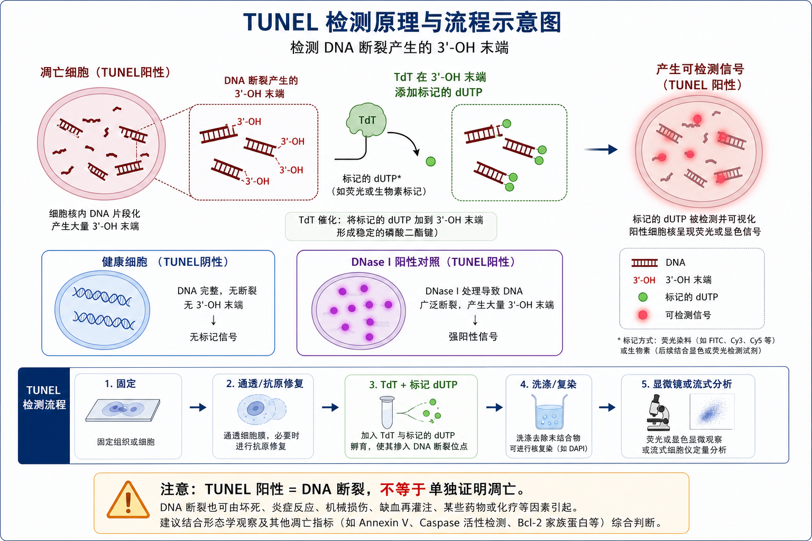

# TUNEL

TUNEL（terminal deoxynucleotidyl transferase dUTP nick end labeling，末端脱氧核苷酸转移酶介导的 dUTP 缺口末端标记）是一种用于原位检测 [DNA片段化](../番外/补充知识/DNA片段化.md) 和 DNA strand breaks（DNA 链断裂）的实验方法。它常用于细胞或组织样本中的 [细胞死亡](../番外/补充知识/细胞死亡.md) 分析，尤其常被用来辅助判断凋亡后期的 DNA fragmentation（DNA 片段化）。

一句话理解：TUNEL 检测的是 DNA 断裂产生的 3'-OH 末端，不是“凋亡专属标签”。TUNEL 阳性可以支持细胞死亡或 DNA 片段化，但不能单独证明 [凋亡](../番外/补充知识/凋亡.md) 机制。



图：TUNEL 检测的核心逻辑。DNA 断裂产生 3'-OH 末端后，TdT 酶把标记 dUTP 加到断裂末端，随后通过荧光或显色信号识别 TUNEL 阳性细胞。图源：Image2 生成。

## 方法历史与背景

TUNEL 的经典方法学基础来自 Gavrieli、Sherman 和 Ben-Sasson 1992 年在 *Journal of Cell Biology* 发表的 in situ labeling 方法。他们利用 terminal deoxynucleotidyl transferase（末端脱氧核苷酸转移酶，TdT）把标记核苷酸接到 DNA fragmentation 产生的末端，从而在保留组织结构的同时识别 programmed cell death（程序性细胞死亡）细胞。参考：[Gavrieli et al., 1992](https://rupress.org/jcb/article-abstract/119/3/493/14516/Identification-of-programmed-cell-death-in-situ)。

Thermo Fisher 对 TUNEL assays 的说明也强调，凋亡后期常伴随 nuclear morphology（核形态）改变和 DNA fragmentation，TUNEL 反应利用 TdT 把 modified dUTP（修饰 dUTP）连接到 damaged DNA 的 3'-OH 末端，再通过荧光、抗体、biotin-streptavidin 或 click chemistry 等方式检测。参考：[Thermo Fisher TUNEL Assays](https://www.thermofisher.com/us/en/home/life-science/cell-analysis/cell-viability-and-regulation/apoptosis/tunel-assays.html)。

但 TUNEL 从早期就存在解释风险。TUNEL 阳性并不只出现在凋亡；[坏死](../番外/补充知识/坏死.md)、自溶、强烈 [DNA损伤](../番外/补充知识/DNA损伤.md)、组织固定不良、过度消化或 DNA 修复相关断裂都可能增加 3'-OH 末端。Grasl-Kraupp 等人的 cautionary note 明确指出，TUNEL 检测 DNA 片段化，不应被视为凋亡特异性标志。参考：[Grasl-Kraupp et al., *Hepatology*, 1995](https://www.sciencedirect.com/science/article/pii/0270913995900713)。

## 应用场景

| 场景 | 适合程度 | 主要价值 |
| --- | --- | --- |
| 组织切片中定位死亡细胞 | 很适合 | 保留空间结构，可知道阳性细胞在哪里 |
| 培养细胞凋亡后期检测 | 适合 | 识别 DNA fragmentation 阶段 |
| 药物、辐照、缺氧或毒性损伤评价 | 适合 | 评估处理后 DNA 断裂相关死亡 |
| 与 IHC/IF 共染 | 适合但需优化 | 可判断 TUNEL 阳性细胞类型或机制标志 |
| 只想看早期凋亡 | 不优先 | [Annexin V-PI染色](<Annexin V-PI染色.md>) 更适合早期 PS 外翻 |
| 快速筛选细胞活性 | 不优先 | CCK-8、ATP、MTT 更快更高通量 |
| 证明 caspase-dependent apoptosis | 不能单独完成 | 需要 [Caspase活性检测](Caspase活性检测.md)、cleaved caspase-3 或 PARP cleavage |

如果实验问题是“处理后有没有更多不可逆 DNA 片段化或死亡细胞”，TUNEL 很合适。如果实验问题是“死亡机制是不是凋亡”，TUNEL 需要和形态学、Annexin V-PI、caspase/PARP、线粒体膜电位或其他机制指标共同解释。

## 实验目的

TUNEL 常用于：

- 在细胞或组织中检测 DNA strand breaks；
- 定位 TUNEL-positive cells（TUNEL 阳性细胞）在组织中的空间分布；
- 比较不同处理、剂量、时间点或基因操作后的 DNA 片段化水平；
- 与核染、免疫荧光或免疫组化结合，判断阳性细胞类型；
- 作为凋亡后期或不可逆细胞死亡的辅助证据；
- 为 Annexin V-PI、LDH、caspase、Western blot 或组织病理学结果提供交叉验证。

## 简要实验原理

### TdT 标记 3'-OH 末端

TUNEL 的核心酶是 [TdT酶](<../材(实验耗材工具篇)/TdT酶.md>)（terminal deoxynucleotidyl transferase，末端脱氧核苷酸转移酶）。当 DNA 发生断裂并暴露 3'-OH 末端时，TdT 可以不依赖模板，把 [dUTP](<../材(实验耗材工具篇)/dUTP.md>) 或标记 dUTP 加到这些末端。

Promega 的 DeadEnd Fluorometric TUNEL System 说明中也写明，该体系使用 recombinant terminal deoxynucleotidyl transferase（重组 TdT）把 fluorescein-12-dUTP 加到 DNA 3'-OH ends，从而通过荧光显微镜或流式细胞术检测。参考：[Promega DeadEnd Fluorometric TUNEL System](https://www.promega.com/resources/protocols/technical-bulletins/0/deadend-fluorometric-tunel-system-protocol/)。

### 标记方式决定检测平台

| 标记方式 | 代表形式 | 检测方式 | 特点 |
| --- | --- | --- | --- |
| 荧光 dUTP | [荧光dUTP](<../材(实验耗材工具篇)/荧光dUTP.md>)、fluorescein-dUTP、TMR-dUTP | 荧光显微镜、流式 | 直接、快速，适合共定位 |
| Biotin-dUTP | 生物素标记 dUTP | streptavidin-HRP/AP 后显色 | 适合明场组织切片 |
| BrdUTP | 溴脱氧尿苷标记 dUTP | anti-BrdU 抗体检测 | 可用于流式或成像 |
| EdUTP | 炔基修饰 dUTP | click chemistry 检测 | 信号灵活，适合多色组合 |

Thermo Fisher 的 TUNEL 页面提到，BrdUTP 可通过抗 BrdU 抗体间接检测，biotin- 或 fluorescein-modified nucleotide 可直接或经亲和体系检测，EdUTP 可通过 click chemistry 增加检测灵活性。参考：[Thermo Fisher TUNEL Assays](https://www.thermofisher.com/us/en/home/life-science/cell-analysis/cell-viability-and-regulation/apoptosis/tunel-assays.html)。

### TUNEL 阳性不等于凋亡专属

TUNEL 检测的对象是 3'-OH DNA termini（DNA 3'-OH 末端）。这些末端常见于凋亡后期 DNA fragmentation，但也可能来自其他细胞死亡方式、DNA repair（DNA 修复）、组织坏死或样本处理造成的断裂。因此报告时更严谨的说法是“TUNEL-positive cells increased（TUNEL 阳性细胞增加）”或“DNA fragmentation increased（DNA 片段化增加）”，不要只凭 TUNEL 写成“apoptosis increased（凋亡增加）”。

## TUNEL vs Annexin V-PI/Caspase/LDH/Comet assay

| 方法 | 核心读数 | 优点 | 局限 | 什么时候优先选 |
| --- | --- | --- | --- | --- |
| TUNEL | DNA 断裂 3'-OH 末端 | 保留空间位置，适合组织和细胞成像 | 非凋亡特异，受固定/通透影响大 | 看 DNA 片段化和组织定位 |
| [Annexin V-PI染色](<Annexin V-PI染色.md>) | PS 外翻 + 膜完整性 | 区分早期凋亡和膜破损阶段 | 主要适合活细胞，空间结构较弱 | 看死亡阶段动态 |
| [Caspase活性检测](Caspase活性检测.md) | caspase 激活 | 更接近凋亡执行通路 | 并非所有死亡都依赖 caspase | 证明 caspase-dependent apoptosis |
| [LDH释放实验](LDH释放实验.md) | 上清 LDH | 反映膜破裂/泄漏 | 不显示空间位置和死亡机制 | 看膜损伤细胞毒性 |
| Comet assay | 单细胞 DNA 迁移拖尾 | 对 DNA 损伤敏感 | 操作和定量复杂，多用于培养细胞 | 重点研究 DNA 损伤程度 |

一句话：TUNEL 的独特优势是 in situ DNA fragmentation（原位 DNA 片段化）检测；它的主要短板是机制解释不能太满。

## 实验所需试剂、耗材和设备

| 类别 | 内容 | 作用 |
| --- | --- | --- |
| 样本 | 贴壁细胞、悬浮细胞涂片、冰冻切片、石蜡切片、组织切片 | 检测对象 |
| 固定剂 | [多聚甲醛](<../材(实验耗材工具篇)/多聚甲醛.md>)、4% paraformaldehyde，或试剂盒推荐固定液 | 保留细胞/组织结构和 DNA 断裂位置 |
| 通透/消化试剂 | [Triton X-100](<../材(实验耗材工具篇)/Triton X-100.md>)、[蛋白酶K](<../材(实验耗材工具篇)/蛋白酶K.md>)、柠檬酸盐热处理等 | 让 TUNEL 反应混合液进入细胞核 |
| 反应核心 | [TUNEL试剂盒](<../材(实验耗材工具篇)/TUNEL试剂盒.md>)、TdT enzyme、label solution | 标记 DNA 断裂末端 |
| 洗涤液 | [PBS](<../材(实验耗材工具篇)/PBS.md>) 或试剂盒缓冲液 | 洗去背景和未结合试剂 |
| 复染 | [DAPI](<../材(实验耗材工具篇)/DAPI.md>)、[Hoechst](<../材(实验耗材工具篇)/Hoechst.md>)、苏木精或甲基绿 | 标记总细胞核 |
| 阳性对照 | [DNase I](<../材(实验耗材工具篇)/DNase I.md>) 处理样本 | 人为制造 DNA 断裂，验证体系可工作 |
| 阴性对照 | 省略 TdT enzyme 或省略 label solution | 判断非特异背景 |
| 设备 | [荧光显微镜](<../材(实验耗材工具篇)/荧光显微镜.md>)、共聚焦显微镜、明场显微镜、流式细胞仪 | 采集图像或流式数据 |

Roche/Sigma 的 In Situ Cell Death Detection Kit 页面列出典型组件包括 Enzyme Solution（TdT）、Label Solution（fluorescein-dUTP）和 converter，并说明 TUNEL reaction mixture 应现配使用。参考：[Sigma-Aldrich/Roche In Situ Cell Death Detection Kit](https://www.sigmaaldrich.com/US/en/product/roche/11684809910)。

## 实验设计

### 先决定样本类型

**怎么做**：先判断样本是培养细胞、细胞爬片、冰冻切片、石蜡切片还是流式细胞样本。不同样本的固定、通透、抗原修复和背景控制不同。

**为什么重要**：TUNEL 的成败很大程度取决于 TdT 和标记 dUTP 能不能进入细胞核，又不能把 DNA 人为打得太碎。

**注意事项**：石蜡切片通常需要脱蜡、水化和蛋白酶处理；培养细胞更容易过度通透；悬浮细胞若要成像，常需 cytospin 或贴附载玻片。

**替代方案**：如果只需要总体比例，可考虑流式 TUNEL；如果需要组织定位和细胞类型，优先做切片成像并配合 IF/IHC 标志物。

### 设计阳性和阴性对照

| 对照 | 怎么做 | 作用 |
| --- | --- | --- |
| 阴性对照 | 省略 TdT enzyme 或省略 TUNEL reaction enzyme | 判断标记 dUTP、抗体或显色体系的背景 |
| 阳性对照 | DNase I 轻度处理固定样本 | 确认通透、TdT 和检测体系能产生强阳性 |
| 未处理对照 | 不加死亡诱导处理 | 判断基础死亡水平 |
| 已知凋亡诱导对照 | staurosporine、camptothecin、etoposide、UV 等 | 证明实验体系能检测到预期死亡变化 |
| 二抗/显色背景对照 | 视检测体系设置 | 排除抗体或酶显色背景 |

**为什么重要**：没有阴性对照时，背景高会被误判为真实阳性；没有阳性对照时，阴性结果无法区分“确实没有 DNA 片段化”还是“通透或反应失败”。

### 选择定量策略

**怎么做**：成像 TUNEL 通常统计 TUNEL-positive nuclei / total nuclei（TUNEL 阳性核 / 总核数）；组织样本还可按区域、细胞类型或单位面积统计。流式 TUNEL 则统计阳性群体比例和荧光强度。

**为什么重要**：只展示一张代表图很容易造成选择偏倚。应预先规定随机视野数、每张图计数规则、排除标准和阈值方法。

**注意事项**：不要把“每个视野阳性细胞数”直接跨区域比较，除非组织结构和细胞密度相近。更稳妥的是报告阳性核比例，并说明视野选择方式。

## 实验操作

### 样本固定

**怎么做**：培养细胞或组织切片按试剂盒说明固定，常见为 4% paraformaldehyde / PFA（多聚甲醛）固定。组织样本要根据冰冻切片或石蜡切片流程完成前处理。

**为什么重要**：固定要在保留形态和保留 DNA 断裂之间取得平衡。Roche/Merck 的 TUNEL troubleshooting 资料建议使用 paraformaldehyde 这类交联固定剂，以减少碎片化 DNA 在后续步骤中被洗出导致假阴性。参考：[Merck/Roche TUNEL protocol & troubleshooting](https://www.merckmillipore.com/CM/en/technical-documents/protocol/cell-culture-and-cell-culture-analysis/cell-counting-and-health-analysis/in-situ-cell-death-detection-kit-fluorescein)。

**注意事项**：固定不足会造成形态差和 DNA 泄漏；固定过强会降低通透性，使反应试剂进不去。固定条件不能在同一实验批次中随意改变。

**替代方案**：若后续要做抗体共染，需要同时考虑抗原保存；如果抗原对 PFA 敏感，需在 IF 和 TUNEL 两者之间重新优化。

**可能出错的结果**：背景高、核边界不清或阳性信号不均，常来自固定不充分、样本脱落或组织处理不一致。

### 通透、消化或抗原修复

**怎么做**：培养细胞常用 Triton X-100 等温和通透；组织切片常用 proteinase K（蛋白酶 K）、柠檬酸盐热处理或试剂盒指定方案。

**为什么重要**：TdT 和标记核苷酸必须进入细胞核才能反应。通透不足会假阴性；通透或消化过度会造成人工断裂、形态破坏和假阳性。

**注意事项**：proteinase K 浓度和时间对不同组织差异很大。脑、肝、肾、肿瘤、纤维化组织和石蜡切片厚度不同，最佳条件可能完全不同。

**替代方案**：如果组织背景高，可降低消化强度；如果阳性对照也很弱，可加强通透或延长反应时间。

**可能出错的结果**：全片弥漫阳性可能是过度消化或组织坏死/自溶；阳性对照弱可能是通透不足或反应体系失效。

### TUNEL 反应

**怎么做**：现配 TUNEL reaction mixture（TUNEL 反应混合液），通常包含 TdT enzyme 和 labeled dUTP / label solution。将反应液覆盖样本，保持湿润，在试剂盒推荐温度和时间孵育，常见为 37°C 一段时间。

**为什么重要**：TdT 反应对温度、时间、酶活、反应液新鲜度和样本干燥非常敏感。反应液干掉会造成边缘强背景或局部假阳性。

**注意事项**：反应液通常要现配、避光或置冰保存，不能提前长时间放置。Sigma/Roche 产品页面也提示 TUNEL reaction mixture 应在使用前立即制备，不应储存。参考：[Sigma-Aldrich/Roche In Situ Cell Death Detection Kit](https://www.sigmaaldrich.com/US/en/product/roche/11684809910)。

**替代方案**：如果需要与 GFP、phalloidin 或多色荧光组合，要注意传统 click chemistry 中铜离子条件可能影响某些荧光蛋白或探针；可选择兼容性更好的试剂盒版本或调整染色顺序。

**可能出错的结果**：阴性对照也强阳性，可能是 label/detection 背景或样本自发荧光；阳性对照不亮，可能是 TdT 失活、反应液配错或样本通透不足。

### 洗涤、复染和封片

**怎么做**：反应结束后充分洗涤，去除未结合试剂。荧光法可用 DAPI 或 Hoechst 复染细胞核，明场显色法可用苏木精、甲基绿等复染。最后选择合适封片剂封片。

**为什么重要**：复染总核是定量 denominator（分母）的来源。没有总核复染，只能看阳性信号，无法准确计算阳性比例。

**注意事项**：荧光 TUNEL 要避光，避免光漂白。PI 复染有时会和 fluorescein 信号或其他通道产生影响，部分厂商资料也提示某些 fluorescein TUNEL 体系不适合直接与 PI 双标，需按试剂盒说明调整。参考：[Merck/Roche TUNEL protocol & troubleshooting](https://www.merckmillipore.com/CM/en/technical-documents/protocol/cell-culture-and-cell-culture-analysis/cell-counting-and-health-analysis/in-situ-cell-death-detection-kit-fluorescein)。

**替代方案**：若荧光通道冲突，可更换 TUNEL 荧光颜色、核染颜色或使用明场 DAB 显色。

**可能出错的结果**：信号快速变弱常来自封片剂不合适、曝光过强或染后保存过久。

### 成像或流式分析

**怎么做**：成像时保持同一批样本使用一致曝光、增益和阈值设置。组织切片应预先规定取图区域和随机视野数。流式 TUNEL 则按固定/通透后的细胞样本流程采集，并用阴性、阳性和单染对照设门。

**为什么重要**：TUNEL 是容易被图像选择影响的实验。不同区域的阳性比例可能差异很大，尤其在肿瘤坏死区、缺血区、组织边缘或切片折叠处。

**注意事项**：组织坏死中心可能 TUNEL 很强，但这不一定代表凋亡增加。需要结合 HE/IHC/IF、核形态和空间位置解释。

**替代方案**：若组织结构复杂，可用 cell type marker（细胞类型标志物）共染，例如内皮、上皮、免疫细胞或肿瘤细胞标志物。

**可能出错的结果**：只拍到阳性热点会夸大结果；只避开坏死区又可能低估真实损伤。取图规则必须提前确定。

## 结果解析

### 常见统计方式

```text
TUNEL positive ratio (%) =
TUNEL-positive nuclei / total nuclei × 100
```

组织样本可进一步分层：

```text
TUNEL-positive epithelial cells / total epithelial cells
TUNEL-positive tumor cells / total tumor cells
TUNEL-positive area / tissue area
TUNEL-positive cells per mm2
```

具体选择哪一种，取决于研究问题。若细胞密度变化很大，单纯每视野阳性数可能不可靠；若组织结构清晰，按细胞类型或区域统计更有意义。

### 信号模式也有信息

| 观察模式 | 可能解释 |
| --- | --- |
| 离散核内强阳性，核碎裂明显 | 更符合凋亡后期或 apoptotic bodies |
| 大片弥漫阳性伴组织结构破坏 | 可能是坏死、自溶或处理过度 |
| 细胞质/核外弥散阳性 | 可能是膜破裂后 DNA 片段外泄 |
| 边缘或折叠处强阳性 | 可能是切片处理或干燥伪影 |
| DNase I 阳性对照强、阴性对照低 | 反应体系基本可靠 |

TUNEL 结果最好和核形态一起看。凋亡常见 chromatin condensation（染色质凝缩）、nuclear fragmentation（核碎裂）和 apoptotic bodies（凋亡小体）；坏死或自溶更可能出现组织结构破坏和弥散信号。

### 和其他实验一起解释

| 组合结果 | 更稳妥解释 |
| --- | --- |
| TUNEL 阳性增加 + cleaved caspase-3 增加 | 更支持 caspase-dependent apoptosis |
| TUNEL 阳性增加 + LDH 高 + 组织坏死明显 | 可能有坏死/膜破裂死亡参与 |
| Annexin V 早期阳性先增加，随后 TUNEL 增加 | 更符合凋亡进程推进 |
| CCK-8 下降但 TUNEL 不变 | 可能是代谢抑制、增殖降低或时间点过早 |
| TUNEL 阳性很高但 caspase 证据阴性 | 需考虑非凋亡性 DNA 断裂或 caspase-independent death |

## 异常结果与 troubleshooting

| 异常现象 | 可能原因 | 处理策略 |
| --- | --- | --- |
| 阴性对照背景高 | 自发荧光、检测体系背景、过度通透、样本自溶 | 加强阴性对照，降低通透/消化强度，检查样本质量 |
| 阳性对照不亮 | DNase I 处理不足、TdT 失活、反应液配错、通透不足 | 更新试剂，确认 DNase I 和 TdT 活性，优化通透 |
| 全片弥漫阳性 | 组织坏死、固定差、蛋白酶 K 过度、反应时间过长 | 降低消化强度，排除坏死区，优化固定 |
| 细胞或组织脱落 | 固定不足、洗涤过猛、载玻片附着差 | 使用包被载玻片，轻柔洗涤，优化固定 |
| 阳性信号弱 | 固定过强、通透不足、反应时间短、信号淬灭 | 加强通透，延长反应，使用抗淬灭封片剂 |
| 核染和 TUNEL 通道串色 | 通道选择不合理、滤光片重叠 | 更换荧光颜色或调整成像设置 |
| 不同批次差异大 | 固定、通透、反应液新鲜度或成像阈值不一致 | 固定全流程参数，使用同批对照 |
| TUNEL 结果与 Annexin V-PI 不一致 | 检测阶段不同，时间窗不同 | 做时间梯度，结合 LDH/caspase/形态解释 |

## 记录模板

中文记录模板：

```text
实验名称：
样本类型：
细胞/组织来源：
处理因素：
处理浓度和时间：
固定方式：
切片类型和厚度：
脱蜡/水化条件：
通透或蛋白酶 K 条件：
TUNEL 试剂盒品牌、货号、批号：
TdT/label solution 配制时间：
TUNEL 反应温度和时间：
阳性对照：
阴性对照：
复染方式：
成像设备和通道：
曝光/增益设置：
取图规则：
计数视野数：
总核数：
TUNEL 阳性核数：
TUNEL 阳性比例：
异常背景或伪影：
下一步验证实验：
```

English record template:

```text
Experiment name:
Sample type:
Cell/tissue source:
Treatment:
Dose and duration:
Fixation method:
Section type and thickness:
Deparaffinization/rehydration conditions:
Permeabilization or proteinase K condition:
TUNEL kit brand, catalog no., lot no.:
TdT/label solution preparation time:
TUNEL reaction temperature and duration:
Positive control:
Negative control:
Counterstain:
Imaging instrument and channels:
Exposure/gain settings:
Image acquisition rule:
Number of fields counted:
Total nuclei:
TUNEL-positive nuclei:
TUNEL-positive ratio:
Unexpected background or artifacts:
Next validation experiment:
```

## 小结

TUNEL 是一个很有价值的原位 DNA 片段化检测方法，尤其适合回答“哪些细胞或组织区域发生了 DNA 断裂相关死亡”。它的核心是 TdT 把标记 dUTP 加到 DNA 断裂的 3'-OH 末端。真正做 TUNEL 时，固定、通透、阳性/阴性对照、成像规则和定量策略比单纯记住孵育时间更重要。解释结果时要克制：TUNEL 阳性支持 DNA fragmentation 和细胞死亡，但要证明凋亡机制，还需要核形态、Annexin V-PI、caspase/PARP、LDH 或其他证据共同支撑。

## 参考来源

- Gavrieli Y, Sherman Y, Ben-Sasson SA. Identification of programmed cell death in situ via specific labeling of nuclear DNA fragmentation. *Journal of Cell Biology*. 1992. [JCB](https://rupress.org/jcb/article-abstract/119/3/493/14516/Identification-of-programmed-cell-death-in-situ)
- Thermo Fisher Scientific. TUNEL Assays. [Thermo Fisher](https://www.thermofisher.com/us/en/home/life-science/cell-analysis/cell-viability-and-regulation/apoptosis/tunel-assays.html)
- Promega. DeadEnd Fluorometric TUNEL System Technical Bulletin. [Promega](https://www.promega.com/resources/protocols/technical-bulletins/0/deadend-fluorometric-tunel-system-protocol/)
- Sigma-Aldrich/Roche. In Situ Cell Death Detection Kit, AP product information. [Sigma-Aldrich](https://www.sigmaaldrich.com/US/en/product/roche/11684809910)
- Merck/Roche. In Situ Cell Death Detection Kit, Fluorescein Protocol & Troubleshooting. [Merck](https://www.merckmillipore.com/CM/en/technical-documents/protocol/cell-culture-and-cell-culture-analysis/cell-counting-and-health-analysis/in-situ-cell-death-detection-kit-fluorescein)
- Grasl-Kraupp B, et al. In situ detection of fragmented DNA (TUNEL assay) fails to discriminate among apoptosis, necrosis, and autolytic cell death: a cautionary note. *Hepatology*. 1995. [ScienceDirect](https://www.sciencedirect.com/science/article/pii/0270913995900713)
- Moore CL, Savenka AV, Basnakian AG. TUNEL Assay: A Powerful Tool for Kidney Injury Evaluation. *International Journal of Molecular Sciences*. 2021. [PMC](https://pmc.ncbi.nlm.nih.gov/articles/PMC7795088/)
