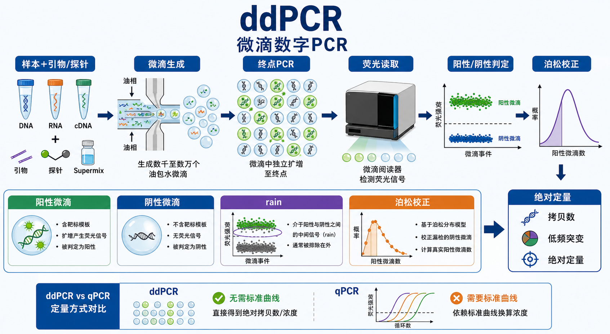

# ddPCR

Droplet digital polymerase chain reaction（ddPCR，微滴数字 PCR）是 digital PCR（[数字PCR](数字PCR.md)，dPCR）的一种实现形式：先把一个 PCR 反应分割成上万甚至更多个 water-in-oil droplets（水包油微滴），让每个微滴成为近似独立的小 PCR 反应；扩增结束后不看实时扩增曲线，而是把每个微滴判定为 positive droplet（[阳性微滴](../番外/补充知识/阳性微滴.md)）或 negative droplet（[阴性微滴](../番外/补充知识/阴性微滴.md)），再用 [泊松分布](../番外/补充知识/泊松分布.md) 校正得到目标分子的绝对浓度。Bio-Rad 的 ddPCR 技术页也把它概括为：样本被分割到约 20,000 个纳升级微滴中，每个微滴内进行 PCR，随后统计阳性和阴性微滴并用 Poisson statistics 计算绝对目标 DNA 浓度。参考：[Bio-Rad Droplet Digital PCR Technology](https://www.bio-rad.com/es-mx/life-science/learning-center/introduction-to-digital-pcr/what-is-droplet-digital-pcr)。



一句话理解：qPCR 是看“扩增曲线什么时候跨过阈值”，ddPCR 是把样本拆成很多小反应后数“有多少个小反应是阳性”；因此 ddPCR 特别适合 [绝对定量](../番外/补充知识/绝对定量.md)、低频突变检测、[拷贝数变异](../番外/补充知识/拷贝数变异.md) 判断和抑制物较多样本的靶向定量。

## 实验发明历史与背景

digital PCR（数字 PCR）的思想早于现代商品化仪器。Bio-Rad 的 digital PCR 教学资料把 1992 年 Sykes 等人的 limiting dilution（限制性稀释）PCR 和 1999 年 Vogelstein 与 Kinzler 的数字 PCR 工作作为重要早期节点：核心思想是把模板分散到许多分区中，让单个模板分子的存在/不存在转化为可计数的数字信号。参考：[Bio-Rad Introduction to Digital PCR](https://www.bio-rad.com/de/life-science/learning-center/introduction-to-digital-pcr)。

真正让 droplet digital PCR 进入常规实验室的是高通量微滴分区和自动读取系统。Hindson 等人在 2011 年报道了 high-throughput droplet digital PCR system（高通量微滴数字 PCR 系统），用于 DNA copy number absolute quantification（DNA 拷贝数绝对定量）。参考：[Hindson et al., 2011, Analytical Chemistry](https://pubmed.ncbi.nlm.nih.gov/21497348/)。

现在 ddPCR 常被当作 [qPCR](qPCR.md)、[RT-qPCR](RT-qPCR.md)、[MLPA](MLPA.md)、NGS 和 [Sanger测序](Sanger测序.md) 的补充方法。它不负责发现所有未知变异，也不负责读长序列；它的强项是对“预设目标”的绝对计数、低丰度检测和小比例差异比较。

## 应用场景

| 应用 | ddPCR 适合回答的问题 | 主要读数 | 关键限制 |
|---|---|---|---|
| DNA 绝对定量 | 样本中目标 DNA 有多少拷贝 | copies/µL、总拷贝数 | 只针对预设靶点 |
| 低频突变检测 | 野生型背景中是否存在低比例突变 | fractional abundance（[突变等位基因频率](../番外/补充知识/突变等位基因频率.md)） | 需要高特异探针和严格阈值 |
| CNV 检测 | 某个基因/外显子相对拷贝数是否改变 | target/reference ratio（[拷贝数比值](../番外/补充知识/拷贝数比值.md)） | 通常只看少数位点 |
| 基因表达 | reverse transcription ddPCR（[RT-ddPCR](RT-ddPCR.md)，逆转录微滴数字 PCR）定量转录本 | copies/µL cDNA 或相对表达 | RNA 质量和逆转录效率仍是主要变量 |
| 病原体或病毒载量 | 靶核酸是否存在，浓度多少 | copies/µL 或 copies/reaction | 临床用途需要验证体系 |
| NGS 文库定量 | 可扩增文库分子浓度 | amplifiable library copies | 不能替代文库片段分布质控 |
| CRISPR 编辑检测 | 特定位点敲入/缺失/模板整合是否存在 | 阳性比例、等位基因比例 | 复杂 indel 谱仍需测序解析 |

Bio-Rad 的 ddPCR 页面列出的应用包括 mutation detection（突变检测）、copy number determination（拷贝数判断）、genome edit detection（基因组编辑检测）、gene expression（基因表达）、residual DNA quantification（残留 DNA 定量）和 library quantification（文库定量）。参考：[Bio-Rad ddPCR](https://www.bio-rad.com/en-us/life-science/droplet-digital-pcr?ID=M9HE2R15)。

## 实验目的

- 不依赖 [标准曲线](../番外/补充知识/标准曲线.md) 直接得到目标分子的绝对浓度。
- 检测低丰度突变、稀有转录本、低拷贝病原体或低比例编辑事件。
- 精确比较小倍数差异，例如基因拷贝数 1、2、3 份之间的差别。
- 在 PCR 抑制物或复杂背景较多时，减少扩增效率变化对定量结果的影响。
- 对 qPCR、NGS、MLPA 或 Sanger 结果做靶向验证。

## 简要实验原理

### 分区反应把连续信号变成数字计数

ddPCR 的第一步是 partitioning（[分区反应](../番外/补充知识/分区反应.md)）：把一个 PCR 反应随机分配到大量微滴里。每个微滴可能没有模板、含一个模板分子，或含多个模板分子。分区越多，统计分辨率越高；但模板量太高时，大多数微滴都会变阳性，反而难以精确反推原始浓度。

### 终点 PCR 只问“有无”

ddPCR 不像 qPCR 那样在每个循环记录荧光曲线，而是在 PCR 结束后读取每个微滴的终点荧光。含目标模板且扩增成功的微滴通常荧光高，被判为阳性；没有目标模板的微滴荧光低，被判为阴性。

这使 ddPCR 对扩增效率的依赖低于 qPCR，但不是完全不受影响。引物/探针设计差、抑制物、微滴不稳定或扩增不充分仍会造成中间荧光群，也就是常说的 [rain](../番外/补充知识/rain.md)。

### 泊松校正

如果只按阳性微滴数除以总微滴数，会低估真实模板数，因为一个阳性微滴里可能含有不止一个模板分子。ddPCR 用 Poisson correction（泊松校正）修正这个问题：

```text
lambda = -ln(negative droplets / total accepted droplets)
```

其中 lambda（λ）表示每个有效分区中平均目标分子数。再结合分区体积、反应体积和稀释倍数，可以换算为 copies/µL 或每反应总拷贝数。

### 阈值和二维图

单通道 ddPCR 通常看 fluorescence amplitude（荧光幅度）的一维图，设置 threshold（[阈值线](../番外/补充知识/阈值线.md)）区分阳性和阴性微滴。双通道或 duplex assay（双重检测）常用二维图，例如 FAM vs HEX，把微滴分成双阴性、单阳性和双阳性群。

阈值不是随手画线。dMIQE 2020 指南特别指出，digital PCR 数据分析中的 threshold setting（阈值设置）可能很困难，前分析步骤和数据分析细节需要充分披露。参考：[dMIQE 2020 Guidelines](https://pubmed.ncbi.nlm.nih.gov/32746458/)。

## 所需试剂、耗材和设备

| 类别 | 常用内容 | 作用 | 注意事项 |
|---|---|---|---|
| 模板 | DNA、cDNA、RNA 一步 RT-ddPCR 样本、cfDNA、文库 DNA | 提供目标核酸 | 浓度要落在合适动态范围内 |
| 引物/探针 | [PCR引物](<../材(实验耗材工具篇)/PCR引物.md>)、[TaqMan探针](<../材(实验耗材工具篇)/TaqMan探针.md>)、[EvaGreen](<../材(实验耗材工具篇)/EvaGreen.md>) 染料体系 | 定义目标区域和荧光信号 | 低频突变更推荐高特异探针体系 |
| 反应体系 | [ddPCR Supermix](<../材(实验耗材工具篇)/ddPCR Supermix.md>)、dNTP、Mg²⁺、酶 | 支持微滴内 PCR | 普通 qPCR mix 不一定适合微滴生成 |
| 微滴生成 | [微滴发生器](<../材(实验耗材工具篇)/微滴发生器.md>)、[微滴发生油](<../材(实验耗材工具篇)/微滴发生油.md>)、[DG8 Cartridge](<../材(实验耗材工具篇)/DG8 Cartridge.md>) 或自动化耗材 | 形成水包油微滴 | 气泡、加样错误、油/样本比例错误会降低微滴数 |
| PCR 扩增 | [热循环仪](<../材(实验耗材工具篇)/热循环仪.md>)、[封板膜](<../材(实验耗材工具篇)/封板膜.md>)、[热封仪](<../材(实验耗材工具篇)/热封仪.md>) | 完成终点 PCR | 封板不严会蒸发或破坏微滴 |
| 读取 | [微滴读取仪](<../材(实验耗材工具篇)/微滴读取仪.md>)、[微滴读取油](<../材(实验耗材工具篇)/微滴读取油.md>) | 逐个读取微滴荧光 | droplet count 太低会降低置信度 |
| 平台 | [ddPCR仪](<../材(实验耗材工具篇)/ddPCR仪.md>)、QX200、AutoDG、QIAcuity、QuantStudio Absolute Q 等 | 分区、扩增、读取和分析 | 不同平台分区方式和软件不同，不可直接套阈值 |
| 软件 | QuantaSoft、QX Manager、QuantStudio 软件、QIAcuity 软件等 | 阈值、浓度、CI 和图形分析 | 记录软件版本和阈值策略 |
| 对照 | no-template control（NTC，无模板对照）、阳性对照、阴性对照、wild-type control、突变阳性标准品 | 判断污染、阈值和假阳性 | 低频检测必须重视背景假阳性 |

## 实验设计

### 选择探针法还是 EvaGreen 法

| 体系 | 适合 | 优势 | 风险 |
|---|---|---|---|
| Probe-based ddPCR | 低频突变、CNV、duplex assay、特异位点定量 | 特异性高，可多通道区分 | 探针成本高，设计要求高 |
| EvaGreen ddPCR | 普通片段定量、某些拷贝数或文库定量 | 设计简单，成本较低 | 非特异扩增和引物二聚体也会发光 |

### 控制模板占有率

ddPCR 需要合适的阳性微滴比例。模板太少会导致阳性微滴过少，置信区间变宽；模板太多会导致阴性微滴太少，泊松校正不稳定。实际实验应按平台推荐范围稀释样本，必要时先做梯度预实验。

### 低频突变必须先理解背景

低频突变检测不是“看到几个阳性点就算有”。必须考虑：

- 野生型样本中的假阳性背景。
- 探针串色和非特异扩增。
- rain 微滴是否被错误算入阳性。
- 每孔输入模板总量是否足以支持目标检测下限。
- 是否需要重复孔合并判断。

### CNV 检测要有参考靶点

用 ddPCR 做 copy number variation（CNV）时，通常同时检测 target locus（目标位点）和 reference locus（参考位点），再计算 target/reference ratio。参考位点应该在样本中稳定、拷贝数已知、扩增性能接近目标位点。

### 按 dMIQE 记录关键信息

如果结果要写入论文或报告，建议参照 dMIQE 2020 记录样本来源、核酸质量、分区数、accepted droplet count、阈值设置、阳性/阴性判定、重复孔、反应体积、稀释倍数、软件版本和统计方法。参考：[dMIQE 2020 Guidelines](https://pubmed.ncbi.nlm.nih.gov/32746458/)。

## 实验操作

下面是通用模块化 workflow，不替代具体平台 SOP。不同 ddPCR 平台的微滴体积、微滴数、油相、封板、读取方式和软件参数差异很大。

### 样本和反应体系准备

做法：

- 提取 DNA/RNA，定量并记录纯度、完整性和稀释倍数。
- 配制 ddPCR 反应体系，包括模板、引物、探针或染料、ddPCR supermix 和无核酸酶水。
- 设置 NTC、阳性对照、阴性对照和必要的 wild-type background control。

意义：

ddPCR 的统计优势建立在反应体系可靠的前提上。样本浓度过高、抑制物、气泡、加样误差和非特异扩增都会在后续被放大成阈值和分群问题。

替代策略：

- 样本抑制物多时，先做稀释梯度或纯化。
- 低频突变检测时，优先使用经过验证的探针和阳性标准品。
- RNA 定量时，明确使用 one-step RT-ddPCR 还是 two-step RT-ddPCR。

### 微滴生成

做法：

- 将反应混合液和微滴发生油加入指定耗材。
- 使用手动或自动微滴发生器生成水包油微滴。
- 小心转移微滴到 PCR 板，避免吸头剪切、振荡和气泡。

意义：

微滴生成质量决定有效分区数。微滴数量不足、大小不均一或破裂会降低统计精度，严重时整孔无法分析。

替代策略：

- 高通量或多人操作建议使用自动微滴发生平台，减少操作者差异。
- 若低微滴数反复发生，优先检查耗材、油相、加样体积、吸头类型和操作节奏。

### 终点 PCR

做法：

- 封板后在热循环仪中完成终点 PCR。
- 使用平台或试剂盒推荐的循环条件。
- 避免封板不严、温控不均或板位记录错误。

意义：

ddPCR 虽然最终读阳性/阴性，但扩增失败或扩增不充分会让阳性微滴荧光幅度下降，形成 rain 或阳性/阴性群分离不清。

替代策略：

- 若 rain 多，可优化退火温度、引物/探针浓度或扩增体系。
- 若阴性群整体漂移，检查探针降解、自发荧光、油相和读取设置。

### 微滴读取

做法：

- 将 PCR 后微滴板放入微滴读取仪。
- 仪器逐个读取每个微滴的荧光信号。
- 导出每孔的 droplet amplitude plot、accepted droplets、positive droplets 和 concentration。

意义：

读取阶段把微滴转化为可分析数据。低 accepted droplet count 会直接增加不确定性；通道串色、气泡或读板问题会造成异常点群。

替代策略：

- 对关键样本，保留原始 amplitude plot，不只保存浓度表。
- 若整板读取异常，检查读取油、仪器维护、板封和微滴稳定性。

### 数据分析

做法：

- 设置阈值，区分阳性、阴性和 rain。
- 检查 NTC、阳性对照、阴性对照和重复孔一致性。
- 用软件输出 copies/µL、confidence interval（[95置信区间](../番外/补充知识/95置信区间.md)）和 fractional abundance。

意义：

ddPCR 的“数字”不代表自动无争议。阈值设置、rain 处理、低微滴数、低阳性事件数和背景假阳性都会影响结论。

替代策略：

- 低频突变结果最好报告输入总拷贝数、阳性事件数、背景对照和置信区间。
- CNV 结果最好结合参考靶点、重复孔和正交方法验证。
- 阈值不清晰时，不要硬判；优化 assay 或重复实验。

## 结果解析

| 读数 | 含义 | 怎么看 | 常见误区 |
|---|---|---|---|
| accepted droplets | 被软件接受用于分析的微滴数 | 数量越足，统计越稳 | 微滴数太低还强行解释 |
| positive droplets | 高于阈值的阳性微滴数 | 代表含目标模板的分区 | 把所有 rain 都算阳性 |
| copies/µL | 软件经泊松校正后的浓度 | 可进一步乘以稀释倍数 | 忘记反应体系和样本稀释换算 |
| fractional abundance | 突变拷贝 / 总目标拷贝 | 低频突变核心读数 | 不看背景假阳性 |
| CNV ratio | 目标位点 / 参考位点 | 判断缺失、正常或重复 | 参考位点本身不稳定 |
| 95% CI | 统计不确定性范围 | 低阳性数时会变宽 | 只报均值不报不确定性 |
| rain | 阳性和阴性之间的中间荧光点 | 需要结合 assay 和对照判断 | 简单删除或简单归阳性 |

## 异常结果和可能原因

| 异常 | 常见表现 | 可能原因 | 处理思路 |
|---|---|---|---|
| 微滴数低 | accepted droplets 明显不足 | 微滴生成失败、气泡、油相/耗材问题、转移破坏 | 检查微滴生成耗材、油、操作和转移步骤 |
| 阴阳群分不开 | 阳性和阴性荧光距离小 | 引物/探针差、退火条件不佳、抑制物 | 优化 assay，做温度梯度或样本纯化 |
| rain 多 | 中间荧光点明显 | 扩增不完全、非特异扩增、微滴质量差 | 优化 PCR 条件、检查探针/模板和微滴质量 |
| NTC 有阳性 | 空白孔出现阳性微滴 | 污染、气溶胶、阈值过低、假阳性背景 | 重配体系，清洁分区，调阈值并查背景 |
| 阳性过多 | 大多数微滴为阳性 | 模板过浓，分区占有率过高 | 稀释样本后重做 |
| 阳性过少 | 只有极少阳性事件 | 模板太少、目标不存在、反应失败 | 增加输入量或合并重复孔，检查阳性对照 |
| 通道串色 | 双通道图中异常斜带或群漂移 | 光谱补偿、探针浓度或荧光串扰 | 优化探针浓度和通道设置 |
| 重复孔差异大 | copies/µL 或 FA 波动大 | 加样误差、微滴数差异、样本不均一 | 增加混匀、重复孔和质量控制 |

## ddPCR vs qPCR/MLPA/NGS

| 方法 | 核心读数 | 最适合 | 不适合 |
|---|---|---|---|
| ddPCR | 阳性/阴性分区 + 泊松校正 | 绝对定量、低频突变、少数位点 CNV | 大范围未知变异发现 |
| qPCR | Cq/Ct 值和标准曲线或相对定量 | 常规表达、快速筛查、低成本批量 | 极低丰度或小倍数差异精确定量 |
| RT-qPCR | RNA 逆转录后的实时定量 | 基因表达变化 | 依赖内参和扩增效率 |
| MLPA | 多探针峰面积比例 | 一个基因/区域的多外显子 CNV | 精确定量低频突变 |
| NGS | 大量 reads 和变异调用 | 全局或多基因变异发现 | 低成本少数位点绝对定量 |
| Sanger 测序 | 碱基峰图和序列 | 单一模板序列验证 | 低频变异定量 |

## 记录模板

中文记录：

```text
实验名称：
样本编号：
样本类型：
核酸类型：DNA / RNA / cDNA / cfDNA / 文库
提取方法与浓度：
靶标名称：
引物/探针信息：
ddPCR supermix：
平台/仪器：
微滴生成方式：
热循环仪：
读取软件与版本：
阈值设置方法：
accepted droplets：
positive droplets：
copies/µL：
稀释倍数换算：
fractional abundance / CNV ratio：
95% CI：
NTC 结果：
阳性/阴性对照：
rain 或异常分群：
结论：
```

English record:

```text
Experiment name:
Sample ID:
Sample type:
Nucleic acid type: DNA / RNA / cDNA / cfDNA / library
Extraction method and concentration:
Target name:
Primer/probe information:
ddPCR supermix:
Platform/instrument:
Droplet generation method:
Thermal cycler:
Reader software and version:
Thresholding strategy:
Accepted droplets:
Positive droplets:
Copies/uL:
Dilution-adjusted concentration:
Fractional abundance / CNV ratio:
95% CI:
NTC result:
Positive/negative controls:
Rain or abnormal clustering:
Conclusion:
```

## 购买和平台建议

- Bio-Rad 的 QX200/AutoDG 体系是经典 droplet ddPCR 生态，适合需要成熟文献、常见 assay、拷贝数和低频突变检测的实验室。参考：[Bio-Rad QX200 Droplet Digital PCR System](https://www.bio-rad.com/en-gr/life-science/digital-pcr/qx200-droplet-digital-pcr-system/1864001)。
- Thermo Fisher 的 QuantStudio Absolute Q、Qiagen 的 QIAcuity 等属于 broader digital PCR（数字 PCR）平台，分区方式和软件逻辑与 Bio-Rad ddPCR 不完全相同。选平台时不要只看“数字 PCR”四个字，要看分区数、通量、样本量、试剂生态、软件输出和售后。
- 如果实验主要是少数位点低频突变和绝对定量，ddPCR 很强；如果要发现未知变异，优先考虑 NGS；如果要覆盖一个基因多个外显子的 CNV，MLPA 常常更经济。
- 购买和记录时至少写明：平台、仪器型号、试剂盒/assay、catalog number、lot number、软件版本、阈值策略和对照设置。

## 总结

ddPCR 的核心是“分区 + 终点 PCR + 阴阳微滴计数 + 泊松校正”。它把 PCR 从连续荧光曲线问题变成统计计数问题，因此在绝对定量、低频突变、少数位点 CNV 和复杂样本靶向定量中非常有价值。它也不是万能：阈值设置、rain、微滴数、背景假阳性、模板占有率和 assay 特异性都会影响结果。读 ddPCR 结果时，不能只看软件给出的 copies/µL，还要看原始微滴图、对照、置信区间和重复孔一致性。

## 参考来源

- Bio-Rad: [Droplet Digital PCR Technology](https://www.bio-rad.com/es-mx/life-science/learning-center/introduction-to-digital-pcr/what-is-droplet-digital-pcr)
- Bio-Rad: [Introduction to Digital PCR](https://www.bio-rad.com/de/life-science/learning-center/introduction-to-digital-pcr)
- Bio-Rad: [Droplet Digital PCR](https://www.bio-rad.com/en-us/life-science/droplet-digital-pcr?ID=M9HE2R15)
- Bio-Rad: [QX200 Droplet Digital PCR System](https://www.bio-rad.com/en-gr/life-science/digital-pcr/qx200-droplet-digital-pcr-system/1864001)
- Hindson BJ et al. [High-throughput droplet digital PCR system for absolute quantitation of DNA copy number](https://pubmed.ncbi.nlm.nih.gov/21497348/). *Analytical Chemistry*. 2011.
- dMIQE Group. [The Digital MIQE Guidelines Update: Minimum Information for Publication of Quantitative Digital PCR Experiments for 2020](https://pubmed.ncbi.nlm.nih.gov/32746458/). *Clinical Chemistry*. 2020.
