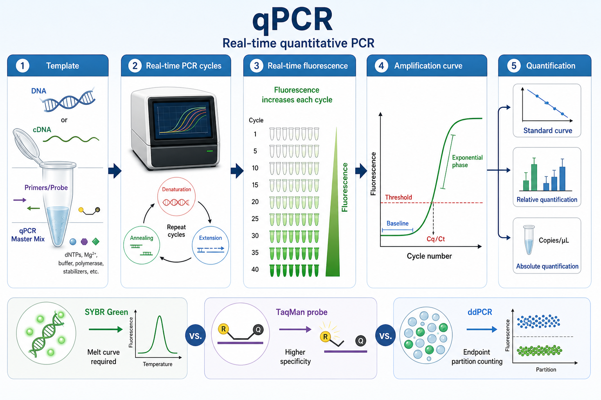
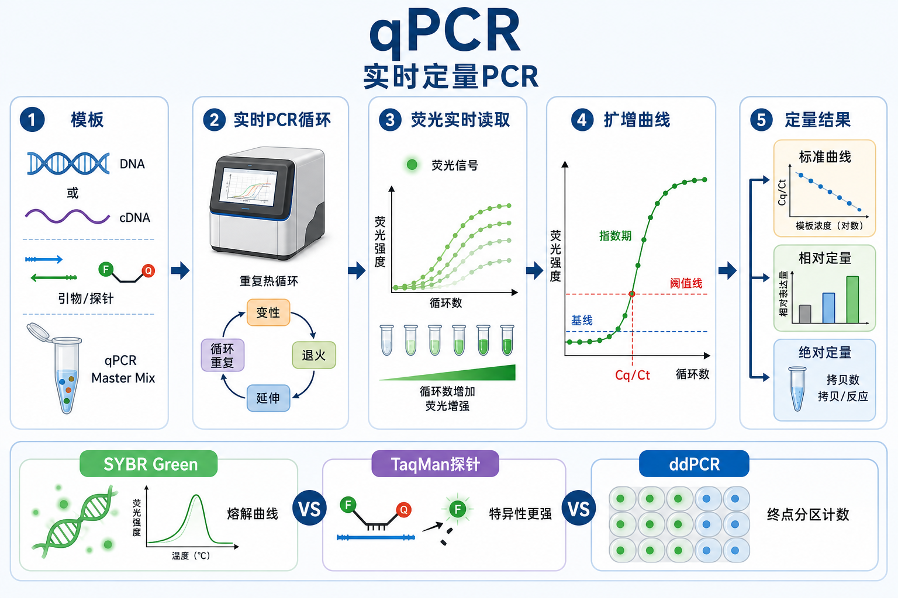

# qPCR

qPCR（quantitative polymerase chain reaction，定量聚合酶链式反应）通常也称 real-time quantitative PCR（实时定量 PCR），是在 [PCR](PCR.md) 扩增过程中实时记录荧光信号，并用荧光跨过阈值的循环数来推断初始模板量的核酸定量技术。





一句话理解：普通 PCR 更像“终点看有没有条带”，qPCR 是“边扩增边看曲线”，把 [扩增曲线](../番外/补充知识/扩增曲线.md)、[阈值线](../番外/补充知识/阈值线.md) 和 [Cq值](../番外/补充知识/Cq值.md) 组合起来做定量；如果模板来自 RNA 并先逆转录为 [cDNA](../番外/补充知识/cDNA.md)，通常写作 [RT-qPCR](RT-qPCR.md)。

## 实验发明历史与背景

PCR 由 Kary Mullis 在 1980 年代提出，核心是用热循环和 DNA polymerase（DNA 聚合酶）指数扩增特定核酸片段。1990 年代初，Higuchi 等人把荧光检测引入 PCR 管内监测，使扩增产物可以在反应过程中被实时追踪；1996 年 Heid、Livak 等人报道了基于 dual-labeled fluorogenic probe（双标记荧光探针）的 real-time quantitative PCR 方法，并强调它减少了 post-PCR handling（扩增后开盖处理）和产物 carry-over contamination（扩增产物带入污染）的风险。参考：[Higuchi et al., 1993](https://explore.openaire.eu/search/publication?pid=10.1038%2Fnbt0993-1026)；[Heid et al., 1996](https://genome.cshlp.org/content/6/10/986)。

qPCR 变成常规实验以后，最大的问题不是“仪器能不能测到荧光”，而是不同实验室之间的样本处理、引物设计、扩增效率、阈值设置、内参选择和报告方式差异太大。2009 年 [MIQE](../番外/补充知识/MIQE.md)（Minimum Information for Publication of Quantitative Real-Time PCR Experiments，定量实时 PCR 实验发表最低信息标准）指南提出了 qPCR 实验报告的最低信息要求；2025 年 MIQE 2.0 更新后进一步强调样本处理、assay design（实验设计）、validation（验证）、PCR efficiency（PCR 效率）、melting curve analysis（熔解曲线分析）、data processing（数据处理）和 controls（对照）等内容。参考：[MIQE guidelines, 2009](https://academic.oup.com/clinchem/article/55/4/611/5631762)；[MIQE 2.0, 2025](https://academic.oup.com/clinchem/article/71/6/634/8119148)。

## 应用场景

| 应用 | qPCR 适合回答的问题 | 常见模板 | 关键读数 | 主要限制 |
|---|---|---|---|---|
| 基因表达验证 | 处理后某个基因表达是否升高或降低 | RNA 逆转录得到的 cDNA | Cq、ΔCq、ΔΔCq | 依赖 RNA 质量、逆转录效率和内参稳定性 |
| DNA 拷贝数检测 | 某个目标区域相对拷贝数是否改变 | genomic DNA（基因组 DNA） | target/reference 比值 | 位点数少，不适合全基因组发现 |
| 病原体核酸检测 | 目标核酸是否存在，载量大概多少 | DNA、RNA 或 cDNA | Cq、标准曲线浓度 | 临床用途必须使用验证体系 |
| [ChIP-qPCR](ChIP-qPCR.md) | 某蛋白或修饰是否富集在特定位点 | ChIP DNA | percent input、fold enrichment | 只看预设位点 |
| [CRISPR 编辑验证](基因编辑.md) | 靶位点拷贝、插入片段或供体模板残留 | genomic DNA | Cq 差异、相对量 | 复杂 indel 谱仍要测序 |
| 文库或标准品定量 | 可扩增模板浓度是否合适 | plasmid、amplicon、library DNA | 标准曲线、copies/µL | 标准品制备误差会直接传递 |
| 低通量验证 | 对 RNA-seq、芯片或筛选结果做候选验证 | DNA、cDNA | fold change、相对量 | 不适合大规模无偏发现 |

qPCR 是强靶向方法。它最擅长回答“我已经知道要检测哪个目标，现在要精确定量它”；如果问题是“未知变化在哪里”，通常需要测序、芯片、质谱或其他扫描型方法。

## 实验目的

qPCR 的实验目的通常有三类：

- 判断目标核酸是否存在：例如病原体靶序列、转基因片段、污染检测。
- 比较不同样本之间目标核酸的相对丰度：例如药物处理前后基因表达变化。
- 借助 [标准曲线](../番外/补充知识/标准曲线.md) 或已知标准品获得目标分子的绝对拷贝数。

一个合格的 qPCR 实验不应该只输出 Cq 表。它还应该回答：样本质量是否合格，阴性对照是否干净，阳性对照是否扩增，扩增效率是否合理，熔解曲线是否单峰，重复孔是否一致，内参或参考靶点是否稳定，以及所选定量模型是否适合实验问题。

## 简要实验原理

### 实时荧光把 PCR 过程变成曲线

qPCR 与普通 endpoint PCR（[终点PCR](../番外/补充知识/终点PCR.md)）的关键区别，是仪器在每个循环或指定步骤读取 fluorescence signal（荧光信号）。早期信号接近背景，随后进入 exponential phase（指数扩增期），最后因底物、酶活、产物抑制或体系限制进入平台期。

真正适合定量的是指数扩增期，而不是平台期。平台期的终点荧光受反应体系耗尽、孔间蒸发、酶稳定性和产物再退火影响，不能直接代表初始模板量。

### Cq/Ct 是阈值交叉点

Cq（quantification cycle，定量循环数）是扩增曲线跨过阈值线时对应的循环数。Ct（threshold cycle，阈值循环数）是很多仪器软件仍在使用的传统叫法。MIQE 更推荐使用 Cq，因为不同平台的 Ct 命名和算法并不完全一致；写实验记录时可以写“Cq/Ct”，但要记录仪器软件的原始术语。参考：[MIQE 2.0](https://academic.oup.com/clinchem/article/71/6/634/8119148)。

直觉上，初始模板越多，越早跨过阈值，Cq 越低；初始模板越少，跨过阈值越晚，Cq 越高。理想 PCR 每循环翻倍，因此在 100% 扩增效率附近，相差 1 个 Cq 大约代表约 2 倍模板量差异，但真实实验必须结合扩增效率判断。

### 荧光体系：染料法和探针法

| 体系 | 常见材料 | 原理 | 优点 | 主要风险 |
|---|---|---|---|---|
| DNA-binding dye（DNA 结合染料） | [SYBR Green qPCR Master Mix](<../材(实验耗材工具篇)/SYBR Green qPCR Master Mix.md>)、[EvaGreen](<../材(实验耗材工具篇)/EvaGreen.md>) | 染料结合双链 DNA 后增强荧光 | 成本低、设计简单、通用性强 | 所有双链 DNA 都发光，包括非特异产物和 [引物二聚体](../番外/补充知识/引物二聚体.md) |
| Hydrolysis probe（水解探针） | [TaqMan探针](<../材(实验耗材工具篇)/TaqMan探针.md>) | 探针被 Taq polymerase 5' nuclease 活性切割，reporter 与 quencher 分离后发光 | 特异性更高，适合多重检测和低丰度目标 | 成本高，探针设计和通道选择更复杂 |

NCBI 的 qRT-PCR 技术说明也把实时检测概括为 PCR 每个循环中检测产物生成，常见信号可来自双链 DNA 结合染料或荧光探针；TaqMan assay 利用 Taq DNA polymerase 的 5' nuclease 活性切割探针产生信号。参考：[NCBI Real-Time qRT-PCR](https://www.ncbi.nlm.nih.gov/probe/docs/techqpcr/)。

### 定量方式：标准曲线、相对定量、绝对定量

- [绝对定量](../番外/补充知识/绝对定量.md)：用已知拷贝数或浓度的标准品做梯度，建立 Cq 与 log(template amount) 的标准曲线，再推算未知样本。Thermo Fisher 的 qPCR 定量页面也说明，标准曲线法需要先制备已知数量的 standards，再把 unknown samples 与标准曲线比较。参考：[Thermo Fisher absolute vs relative qPCR](https://www.thermofisher.com/us/en/home/life-science/pcr/real-time-pcr/real-time-pcr-learning-center/real-time-pcr-basics/absolute-vs-relative-quantification-real-time-pcr.html)。
- [相对定量](../番外/补充知识/相对定量.md)：把目标基因相对于 reference gene（[内参基因](../番外/补充知识/内参基因.md)）和 calibrator sample（校准样本）的变化表示为 fold change。
- [Delta-Delta Cq法](../番外/补充知识/Delta-Delta Cq法.md)：也常写作 2^-ΔΔCt 或 2^-ΔΔCq，是相对表达分析的经典方法。Livak 和 Schmittgen 的 2001 年 Methods 论文系统说明了该方法的推导、假设和应用，并强调相对定量是把目标转录本信号与参考样本进行比较。参考：[Livak and Schmittgen, 2001](https://pubmed.ncbi.nlm.nih.gov/11846609/)。

### 扩增效率是 qPCR 的隐藏主轴

[扩增效率](../番外/补充知识/扩增效率.md) 决定 Cq 差异能不能可靠换算为模板量差异。常见做法是用系列稀释模板建立标准曲线，观察 slope、R²、efficiency 和各孔残差。MIQE 2.0 强调 qPCR 数据应该考虑效率校正、检测限、动态范围和合适的质量控制，而不是只报告原始 Cq。参考：[MIQE 2.0](https://academic.oup.com/clinchem/article/71/6/634/8119148)。

## 所需试剂、耗材和设备

| 类别 | 常用内容 | 作用 | 注意事项 |
|---|---|---|---|
| 模板 | DNA、cDNA、plasmid、amplicon、标准品 | 被扩增和定量的目标 | 避免降解、污染和过高浓度 |
| 引物/探针 | [qPCR引物](<../材(实验耗材工具篇)/qPCR引物.md>)、TaqMan 探针 | 决定靶点和特异性 | 需要检查 Tm、GC、二聚体、特异性和扩增子长度 |
| 反应体系 | SYBR Green qPCR Master Mix、probe qPCR Master Mix、dNTP、Mg²⁺、polymerase | 支持扩增和荧光检测 | 不同 master mix 的热启动酶、buffer、ROX 要求不同 |
| 参比染料 | [ROX参比染料](<../材(实验耗材工具篇)/ROX参比染料.md>) | 校正部分仪器的孔间荧光差异 | 不是所有仪器都需要；高 ROX/低 ROX 不要混用 |
| 水和稀释液 | [无核酸酶水](<../材(实验耗材工具篇)/无核酸酶水.md>)、TE 或低吸附稀释体系 | 补足体系和稀释模板 | 标准品低浓度稀释时注意吸附损失 |
| 耗材 | [qPCR板](<../材(实验耗材工具篇)/qPCR板.md>)、optical qPCR tube（光学 qPCR 管）、[光学封板膜](<../材(实验耗材工具篇)/光学封板膜.md>) | 透光、密封、减少蒸发 | 普通 PCR 管/膜可能不适合荧光读取 |
| 仪器 | [qPCR仪](<../材(实验耗材工具篇)/qPCR仪.md>)、离心机、移液枪 | 热循环和实时荧光采集 | 记录仪器型号、通道、软件版本和分析参数 |
| 对照 | [无模板对照](../番外/补充知识/无模板对照.md)、阴性对照、阳性对照、No-RT control（无逆转录对照） | 判断污染、背景和体系是否成功 | RNA 表达实验尤其需要 No-RT 或 DNase 控制 |

IDT 的 qPCR primer/probe 设计资料建议关注 primer/probe 的位置、长度、Tm、GC content、二级结构、自二聚体/异二聚体和 amplicon length（扩增子长度）；其通用建议中，常规 qPCR 扩增子多在 70-150 bp 左右，并建议表达分析中尽量跨 exon-exon junction 设计以降低 gDNA 检测风险。参考：[IDT PCR and qPCR primer design](https://www1.idtdna.com/page/support-and-education/decoded-plus/how-to-design-primers-and-probes-for-pcr-and-qpcr/)。

## 实验操作

下面是通用模块化 workflow，不替代任何具体试剂盒或仪器说明书。真实实验应优先跟随所用 qPCR master mix、探针体系和仪器平台的说明书。

### 设计实验问题和板图

**操作内容**：明确要检测 DNA 还是 RNA；若是 RNA，先进入 RT-qPCR 流程。确定 target gene（目标基因）、reference gene（参考基因）或 reference locus（参考位点）、样本分组、生物学重复、技术重复、阴性/阳性对照和 plate layout（[板图](../番外/补充知识/板图.md)）。

**意义**：qPCR 的统计解释依赖实验设计。没有生物学重复就很难讨论生物差异；没有技术重复就难以及时发现移液和孔位异常；没有 NTC 就无法判断污染。

**关键注意事项**：

- biological replicate（[生物学重复](../番外/补充知识/生物学重复.md)）回答样本间真实生物差异，technical replicate（[技术重复](../番外/补充知识/技术重复.md)）回答同一样本同一反应的操作误差。
- 同一个目标的样本最好尽量放在同一板或使用跨板校准样本，减少 plate-to-plate variation（板间差异）。
- 边缘孔容易受蒸发和温控影响，特别是小体积反应、封膜不牢或长程序时，要注意 [边缘效应](../番外/补充知识/边缘效应.md)。
- RNA 表达分析不要默认 GAPDH、ACTB 一定稳定。Vandesompele 等人提出用多个内参基因几何平均值可提高归一化稳定性，单一 housekeeping gene 可能带来明显归一化误差。参考：[Vandesompele et al., 2002](https://pmc.ncbi.nlm.nih.gov/articles/PMC126239/)。

**替代方案**：

- 样本少时，可以减少目标基因数量，优先保证重复和对照。
- 高通量项目可用 384 孔板或自动化加样，但要先验证移液精度和蒸发控制。
- 多目标检测可用 [multiplex qPCR](多重qPCR.md)（多重 qPCR），但必须验证通道串色、引物竞争和扩增效率。

**出错后果**：

- 板图混乱会造成样本错配，后期几乎无法补救。
- 没有合适阴性对照时，低 Cq 污染可能被误认为真实阳性。
- 内参不稳定会让 fold change 的方向和幅度都失真。

### 选择荧光体系和 assay

**操作内容**：根据实验目的选择 SYBR/EvaGreen 染料法或 TaqMan probe 探针法。设计或订购引物/探针，检查目标特异性、Tm、GC、二级结构和扩增子长度。

**意义**：荧光体系决定读数含义。SYBR Green 便宜通用，但只认“双链 DNA”；TaqMan 探针多一层目标识别，成本更高但特异性更强。

**关键注意事项**：

- SYBR 体系必须看 [熔解曲线](../番外/补充知识/熔解曲线.md)。单峰不等于绝对正确，但多峰或低温小峰通常提示非特异扩增或引物二聚体。
- 探针体系要关注 reporter、quencher、通道兼容性和 probe Tm。多重 qPCR 还要考虑 [荧光串色](../番外/补充知识/荧光串色.md)。
- 如果检测 SNP、突变等位基因或低丰度靶点，探针法通常比单纯染料法更稳。
- 如果目标序列存在剪接异构体或同源基因，设计时要明确“检测的是哪个 transcript/isoform”。

**替代方案**：

- 预算敏感、目标表达较高且引物特异性好：优先 SYBR。
- 低丰度、临床样本、突变检测、多重检测：优先探针。
- 已有商业 validated assay（验证过的预设计 assay）时，可减少设计风险，但仍需要在本实验样本中验证表现。

**出错后果**：

- 引物二聚体会在 NTC 或低模板样本中产生假阳性。
- 探针设计不佳会导致信号弱、背景高或目标扩增但荧光不随之上升。
- 不同通道串色会让 duplex/multiplex 结果互相污染。

### 配制反应体系

**操作内容**：在低温、洁净区域配制 master mix。常见 20 µL 反应可按试剂盒推荐设置，例如 2× qPCR Master Mix 10 µL、forward/reverse primers、模板 DNA/cDNA、无核酸酶水补足体积。最终 primer concentration（引物终浓度）常在 100-500 nM 范围内优化，具体以 assay 和试剂说明书为准。

**意义**：qPCR 对移液误差非常敏感，尤其是低体积、多孔板和标准曲线稀释。master mix 统一配制可以减少孔间差异。

**关键注意事项**：

- 先配足 master mix 再分装，避免每孔分别加小体积组分。
- 标准曲线和低拷贝样本稀释时使用低吸附管和低吸附吸头，必要时加入 carrier 或合适稀释液。
- qPCR master mix 通常避光保存和操作，反复冻融会影响酶活或荧光体系。
- 模板量过高可能带入 PCR inhibitors（[PCR抑制物](../番外/补充知识/PCR抑制物.md)）或让 Cq 落在过早区域；模板量过低则重复性变差。

**替代方案**：

- 样本很多时可以用预混 primer/probe mix，减少加样步骤。
- 如果有自动化加样平台，先用染料或水做加样均一性验证。
- 对高 GC 或复杂模板，可尝试专用 qPCR master mix 或优化 annealing/extension 条件。

**出错后果**：

- 漏加模板：表现为目标孔不扩增，但阳性对照正常。
- 漏加引物或 master mix：对应孔无曲线，重复孔差异极大。
- 气泡或液滴挂壁：荧光读取不稳定，曲线呈锯齿或 Cq 偏移。

### 加样、封板和短暂离心

**操作内容**：按板图加样后立即用光学封板膜密封，轻轻压实每个孔位，短暂离心让液体集中到孔底并排除气泡。上机前检查孔位、封膜、气泡和板方向。

**意义**：qPCR 的荧光读取发生在透明盖/膜和孔底液体之间。气泡、蒸发、封膜翘起或板方向错误都会直接变成异常曲线。

**关键注意事项**：

- 不要用手直接触碰光学膜中央区域，指纹和灰尘会影响荧光。
- 封膜必须贴紧孔间区域，尤其是边缘孔。
- 多道移液枪加样时要观察每列液面是否一致。
- 上机后确认仪器软件中的 plate layout 与真实板图一致。

**替代方案**：

- 少量样本可用 optical qPCR strip tube，减少整板浪费。
- 高通量或低体积实验可使用自动封膜或热封，但要确认耗材兼容。

**出错后果**：

- 蒸发：边缘孔 Cq 偏低或偏高，重复孔 CV 增大。
- 气泡：荧光曲线突然跳动、基线异常。
- 板方向放反：所有样本结果错位。

### 设置程序并运行 qPCR

**操作内容**：选择正确 detection chemistry（检测化学）、荧光通道、ROX 模式、反应体积和 cycling program。常见 SYBR 程序包括 polymerase activation（聚合酶活化）、40 个左右扩增循环，以及末尾 melting curve（熔解曲线）步骤；探针法通常不需要熔解曲线，但需要正确通道采集。

**意义**：程序设置决定每个循环什么时候采集荧光。采集步骤错误、ROX 选择错误或通道设置错误会让本来正常的反应变成不可解释的数据。

**关键注意事项**：

- 以 master mix 说明书为最高优先级，不同热启动酶的活化时间差异很大。
- SYBR 信号通常在 extension 或 annealing/extension 结束时读取；探针法按试剂和仪器建议设置。
- ROX 模式必须匹配仪器和 master mix。有的仪器不需要 ROX，有的需要 high ROX 或 low ROX。
- 不要随意缩短程序，除非已经验证扩增效率和特异性。

**替代方案**：

- 如果非特异扩增明显，可以做 annealing temperature gradient（退火温度梯度）或重新设计引物。
- 如果曲线较晚且低表达，优先优化 RNA/cDNA 输入和 assay，而不是盲目增加循环数。
- 快速 qPCR mix 可以缩短程序，但必须使用兼容仪器和耗材。

**出错后果**：

- 通道设置错：探针有扩增但软件看不到信号。
- ROX 设置错：孔间校正异常，Cq 漂移。
- 熔解曲线缺失：SYBR 结果无法判断产物特异性。

### 初步质控和数据导出

**操作内容**：运行结束后先看 amplification plot（扩增图）、melt curve（熔解曲线）、NTC、阳性对照、重复孔一致性、标准曲线和导出的 raw Cq。不要只看软件自动给出的 fold change。

**意义**：qPCR 的异常多数能在曲线层面先被发现。原始曲线、阈值和熔解峰比最终表格更能解释问题。

**关键注意事项**：

- 阈值线应放在指数扩增期，并尽量以同一 assay 的一致规则设置。
- NTC 出现晚期扩增时，要结合熔解曲线判断污染还是引物二聚体。
- 标准曲线需要查看 slope、R²、efficiency 和残差，不只看 R²。
- 重复孔差异可以先用 [复孔CV](../番外/补充知识/复孔CV.md) 或 Cq range 判断，但删除异常孔必须有明确理由。

**替代方案**：

- 数据量小且体系稳定时，可用仪器软件初步分析。
- 正式项目建议导出 raw data 到 R、Python、Excel 或 qPCR 专用软件，保留可追溯分析过程。
- 多板实验建议加入 inter-plate calibrator（跨板校准样本）。

**出错后果**：

- 阈值设在平台期：Cq 不再反映指数扩增。
- 自动基线错误：早期曲线被过度扣除或抬高。
- 随意删孔：容易人为制造想要的结果。

## 结果解析

### 先判断数据能不能用

建议按这个顺序看结果：

1. 阴性对照是否干净。
2. 阳性对照是否按预期扩增。
3. 每个 assay 的扩增曲线是否呈正常 S 形。
4. SYBR 熔解曲线是否主要为单峰。
5. 重复孔 Cq 是否一致。
6. 标准曲线效率和线性范围是否合格。
7. 内参或参考靶点是否稳定。
8. 最后才解释 fold change 或 copies/µL。

### 常见数据模型

| 数据模型 | 适合场景 | 需要什么 | 输出 | 注意事项 |
|---|---|---|---|---|
| Cq presence/absence | 简单阳性/阴性筛查 | 阴性和阳性对照 | detected / not detected | 必须定义判阳规则 |
| 标准曲线绝对定量 | 病原体载量、拷贝数、标准品定量 | 已知浓度标准品 | copies/µL、copies/reaction | 标准品纯度和稀释误差很关键 |
| ΔCq | 比较 target 和 reference | 目标和参考靶点 | normalized Cq difference | 适合同一样本内归一化 |
| ΔΔCq | 组间相对表达 | 目标、内参、校准样本 | fold change | 要求目标和内参扩增效率接近 |
| efficiency-corrected model | 扩增效率不同或更严格报告 | assay-specific efficiency | 校正后的相对量 | 更符合 MIQE 2.0 思路 |

### qPCR、RT-qPCR、digital PCR 的区别

| 方法 | 核心问题 | 是否实时看曲线 | 是否需要逆转录 | 是否依赖标准曲线 | 最适合 |
|---|---|---|---|---|---|
| endpoint PCR | 有没有目标条带 | 否 | 视模板而定 | 通常不定量 | 克隆、鉴定、产物检查 |
| qPCR | DNA/cDNA 目标有多少 | 是 | RNA 模板需要 | 相对定量可不需要，绝对定量常需要 | 靶向核酸定量 |
| RT-qPCR | RNA 表达量有多少 | 是 | 是 | 相对表达常用 ΔΔCq | 基因表达验证 |
| [数字PCR](数字PCR.md) | 分区中有多少阳性反应 | 通常否 | RNA 模板需要 | 通常不需要 | 绝对定量、低频突变、CNV |
| [ddPCR](ddPCR.md) | 微滴中阳性/阴性比例是多少 | 通常否 | RNA 模板需要 | 通常不需要 | 微滴分区绝对计数 |

qPCR 和 dPCR 都是靶向核酸定量，但思路不同：qPCR 用扩增曲线和 Cq 推断初始量；dPCR 先把样本分区，再用阳性/阴性分区计数和泊松校正推断分子数。Thermo Fisher 的 qPCR 定量说明也把 relative quantification、standard curve absolute quantification 和 digital PCR absolute quantification 区分为不同定量路线。参考：[Thermo Fisher absolute vs relative qPCR](https://www.thermofisher.com/us/en/home/life-science/pcr/real-time-pcr/real-time-pcr-learning-center/real-time-pcr-basics/absolute-vs-relative-quantification-real-time-pcr.html)。

## 可能出现异常结果及对应原因

| 异常现象 | 可能原因 | 判断方法 | 处理策略 |
|---|---|---|---|
| NTC 有扩增 | 体系污染、引物二聚体、气溶胶污染 | 看 Cq、熔解曲线和产物大小 | 更换水和 master mix，重新配 primer，分区操作 |
| 所有孔都不扩增 | 程序错误、通道错误、master mix 失效、模板漏加 | 阳性对照也失败 | 检查程序、通道、试剂保存和加样记录 |
| 目标孔 Cq 很晚 | 模板低、抑制物、引物效率低、样本降解 | 稀释梯度、标准曲线、阳性对照 | 增加输入、纯化样本、优化 assay |
| 重复孔差异大 | 移液误差、气泡、蒸发、混匀不足 | 看孔位、曲线和液面 | 重新混匀、短离心、改善封膜和移液 |
| 熔解曲线多峰 | 非特异扩增、引物二聚体、退火温度低 | 熔解峰和胶图 | 提高退火温度、降低引物浓度、重新设计引物 |
| 扩增效率过低 | 引物差、模板结构复杂、抑制物、高 GC | 标准曲线 slope | 优化引物、稀释模板、换 master mix |
| 扩增效率超过合理范围 | 稀释错误、抑制物随稀释降低、阈值/基线错误 | 标准曲线残差异常 | 重做梯度、检查稀释和阈值 |
| 曲线锯齿或跳变 | 气泡、封膜问题、荧光读取异常 | 原始曲线不平滑 | 离心、重新封板、检查耗材兼容性 |
| 阴性样本低 Cq | 交叉污染、样本错位、引物非特异 | NTC/阴性对照、板图复查 | 重做样本和板图，独立验证 |
| 内参 Cq 变化很大 | RNA 输入不均、逆转录差异、内参受处理影响 | 多内参比较、RNA QC | 更换或增加内参，重新归一化 |

## 推荐记录模板

### 中文模板

```text
实验名称：
日期：
操作者：
qPCR仪型号与软件版本：
检测体系：SYBR / EvaGreen / TaqMan / 其他
Master Mix 品牌、货号、批号：
模板类型：DNA / cDNA / plasmid / 标准品 / 其他
样本来源与稀释倍数：
目标基因/位点：
参考基因/参考位点：
引物/探针序列或 assay ID：
反应体积：
引物/探针终浓度：
循环程序：
ROX 设置：
板型与封膜：
板图文件：
对照：NTC / 阴性对照 / 阳性对照 / No-RT / 标准曲线
标准曲线范围、R²、效率：
阈值和基线设置：
异常孔处理理由：
最终分析方法：Cq / ΔCq / ΔΔCq / 标准曲线 / 效率校正
备注：
```

### English Template

```text
Experiment name:
Date:
Operator:
qPCR instrument and software version:
Detection chemistry: SYBR / EvaGreen / TaqMan / other
Master mix brand, catalog number, and lot number:
Template type: DNA / cDNA / plasmid / standard / other
Sample source and dilution factor:
Target gene/locus:
Reference gene/locus:
Primer/probe sequences or assay ID:
Reaction volume:
Final primer/probe concentration:
Cycling program:
ROX setting:
Plate/tube type and optical seal:
Plate layout file:
Controls: NTC / negative control / positive control / No-RT / standard curve
Standard curve range, R², and efficiency:
Threshold and baseline settings:
Excluded wells and reason:
Analysis method: Cq / ΔCq / ΔΔCq / standard curve / efficiency-corrected model
Notes:
```

## 总结

qPCR 的本质不是“把 PCR 跑得更高级”，而是把 PCR 扩增过程中的荧光变化变成可解释的定量曲线。它的优点是灵敏、快速、成本相对低、适合少量目标的精准验证；它的弱点是强依赖 assay 设计、扩增效率、对照、内参和数据处理。实际使用时，最重要的不是记住某个固定配方，而是把问题拆成：目标是否适合 qPCR，荧光体系是否合适，模板和对照是否可靠，曲线是否可信，最后的定量模型是否匹配实验目的。

## 参考来源

- [Higuchi et al., 1993, Kinetic PCR Analysis](https://explore.openaire.eu/search/publication?pid=10.1038%2Fnbt0993-1026)
- [Heid et al., 1996, Real time quantitative PCR](https://genome.cshlp.org/content/6/10/986)
- [MIQE guidelines, 2009](https://academic.oup.com/clinchem/article/55/4/611/5631762)
- [MIQE 2.0, 2025](https://academic.oup.com/clinchem/article/71/6/634/8119148)
- [NCBI Real-Time qRT-PCR](https://www.ncbi.nlm.nih.gov/probe/docs/techqpcr/)
- [Thermo Fisher Absolute vs Relative Quantification for qPCR](https://www.thermofisher.com/us/en/home/life-science/pcr/real-time-pcr/real-time-pcr-learning-center/real-time-pcr-basics/absolute-vs-relative-quantification-real-time-pcr.html)
- [IDT PCR and qPCR Primer Design](https://www1.idtdna.com/page/support-and-education/decoded-plus/how-to-design-primers-and-probes-for-pcr-and-qpcr/)
- [Livak and Schmittgen, 2001](https://pubmed.ncbi.nlm.nih.gov/11846609/)
- [Vandesompele et al., 2002](https://pmc.ncbi.nlm.nih.gov/articles/PMC126239/)
