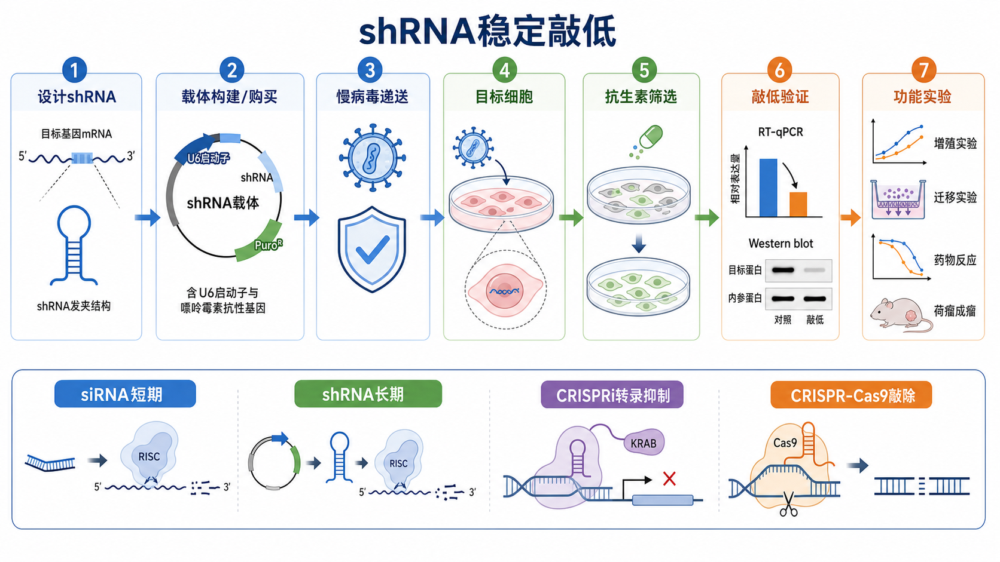

# shRNA稳定敲低

shRNA（short hairpin RNA，短发夹 RNA）稳定敲低是一种常用的 [基因敲低](基因敲低.md) 方法：把能够形成发夹结构的 RNA 表达盒导入细胞，使细胞长期产生 shRNA，并通过 [RNAi](<../番外/补充知识/RNAi.md>)（RNA interference，RNA 干扰）通路持续降低目标基因 mRNA 和蛋白表达。



图：shRNA 稳定敲低的核心逻辑是先设计针对目标 mRNA 的 shRNA，再通过载体递送到目标细胞，经过抗生素筛选形成稳定细胞群，最后用 [RT-qPCR](RT-qPCR.md)、[Western blot](<Western blot.md>) 和功能实验确认“表达下降是否真的解释了表型”。本图由 Image2 / image-generation model 生成，用于个人学习示意。

## 实验发明历史

RNAi 的基础来自 Fire 和 Mello 等在 1998 年发现的双链 RNA 诱导特异性基因沉默现象，这一发现解释了为什么小 RNA 可以按序列特异性降低目标 RNA。参考：[Fire et al., Nature, 1998](https://doi.org/10.1038/35888)。

2001 年左右，siRNA（small interfering RNA，小干扰 RNA）被证明可以在哺乳动物细胞中诱导目标基因沉默。随后研究者把短发夹结构放进质粒或病毒载体，让细胞自己表达 shRNA，从而获得比瞬时 siRNA 更持久的 knockdown（敲低）。常见 pLKO.1/TRC 风格 shRNA 载体也正是在这个方向上发展出来的。参考：[Elbashir et al., Nature, 2001](https://doi.org/10.1038/35078107)、[Brummelkamp et al., Science, 2002](https://doi.org/10.1126/science.1068999)、[Addgene pLKO.1 protocol](https://www.addgene.org/protocols/plko/)。

在肿瘤功能验证文章中，shRNA 稳定敲低经常用于回答：“某个候选基因表达升高是否真的推动细胞增殖、迁移、耐药或成瘤？”它不是单纯证明相关性，而是把候选基因人为压低后观察表型是否随之改变。

## 应用场景

- 长周期体外功能实验：例如 [CCK-8实验](CCK-8实验.md)、[克隆形成实验](克隆形成实验.md)、迁移侵袭、药物敏感性和长期培养观察。
- 体内实验前的细胞模型准备：例如先建立稳定敲低细胞，再进入异种移植或转移模型。
- 难以反复转染的细胞：如果瞬时 siRNA 每次转染波动很大，稳定 shRNA 池可以降低批次差异。
- 需要持续 selection pressure（筛选压力）的实验：例如药物耐受、长期诱导或分化模型。
- pooled screen（混合筛选）或候选基因小规模验证：shRNA 文库曾经是经典 loss-of-function（功能缺失）筛选工具之一。

不适合的情况也很重要：如果只需要 24-72 h 的短期验证，通常先考虑 [siRNA](<../材(实验耗材工具篇)/siRNA.md>)；如果目标是让 DNA 序列永久失活，通常考虑 [CRISPR-Cas9](<../番外/补充知识/CRISPR-Cas9.md>) 或 [基因编辑](基因编辑.md)；如果希望在不切 DNA 的情况下抑制转录，且系统条件允许，可以考虑 [CRISPRi](<../番外/补充知识/CRISPRi.md>)。

## 实验目的

shRNA 稳定敲低的直接目的不是“做出一株看起来不一样的细胞”，而是建立一套可解释的因果模型：

- 目标基因 mRNA 是否下降。
- 目标蛋白是否下降。
- 目标基因下降后，细胞表型是否改变。
- 多条独立 shRNA 是否给出方向一致的结果。
- rescue experiment（[救援实验](<../番外/补充知识/救援实验.md>)）能否把表型拉回去。

如果只看到表型变化，但没有表达验证或 rescue，结论通常只能写成“与敲低构建相关”，而不能强说“由目标基因特异性导致”。

## 简要实验原理

### shRNA 是“细胞内持续生产的 siRNA 前体”

典型 shRNA 表达盒由 U6 或 H1 这类 RNA polymerase III（RNA 聚合酶 III）启动子驱动，转录出一段能自我配对形成发夹的 RNA。shRNA 进入细胞内 RNAi 通路后，被 [Dicer](<../番外/补充知识/Dicer.md>)（Dicer 核酸酶）加工成类似 siRNA 的小双链 RNA，再装载到 [RISC complex](<../番外/补充知识/RISC复合体.md>)（RNA-induced silencing complex，RNA 诱导沉默复合体）中。RISC 中的 [Ago2](<../番外/补充知识/Ago2.md>)（Argonaute 2，AGO2 蛋白）等核心蛋白根据 guide strand（引导链）识别互补 mRNA，导致 mRNA 降解或翻译受抑。参考：[Addgene RNAi guide](https://www.addgene.org/guides/rnai/)。

### 稳定敲低依赖“载体整合或持续表达”

常见做法是使用 [shRNA载体](<../材(实验耗材工具篇)/shRNA载体.md>)，尤其是 [慢病毒载体](<../材(实验耗材工具篇)/慢病毒载体.md>)，把 shRNA 表达盒带入目标细胞。载体通常还带有 puromycin resistance gene（嘌呤霉素抗性基因）等筛选标记。经过 [嘌呤霉素](<../材(实验耗材工具篇)/嘌呤霉素.md>) 等抗生素筛选后，未成功获得载体的细胞死亡，留下稳定表达 shRNA 的细胞群。

### 敲低通常是“降低”，不是“清零”

shRNA 更像把基因表达从高档调到低档，而不是把基因从基因组上删除。mRNA 可能下降 50-90%，蛋白下降幅度取决于蛋白半衰期、抗体质量、翻译调控和检测时间。因此 shRNA 结果要同时看 RNA、蛋白和功能表型。

## 所需试剂、材料与设备

| 类型 | 常见内容 | 关键记录 |
| --- | --- | --- |
| shRNA 设计与载体 | shRNA 序列、non-targeting control shRNA（非靶向 [阴性对照](<../番外/补充知识/阴性对照.md>) shRNA）、positive control shRNA（[阳性对照](<../番外/补充知识/阳性对照.md>) shRNA）、pLKO.1 类载体 | 靶基因、转录本编号、靶序列、载体骨架、启动子、筛选标记 |
| 病毒包装相关 | [HEK293T细胞](<../材(实验耗材工具篇)/HEK293T细胞.md>)、[包装质粒](<../材(实验耗材工具篇)/包装质粒.md>)、转染试剂如 [Lipofectamine](<../材(实验耗材工具篇)/Lipofectamine.md>) 或 [PEI](<../材(实验耗材工具篇)/PEI.md>)、[Opti-MEM](<../材(实验耗材工具篇)/Opti-MEM.md>) | 细胞状态、质粒版本、批号、转染体系、病毒批次 |
| 目标细胞培养 | 目标细胞、[DMEM](<../材(实验耗材工具篇)/DMEM.md>) 或 [RPMI 1640](<../材(实验耗材工具篇)/RPMI 1640.md>)、[FBS](<../材(实验耗材工具篇)/FBS.md>)、[PBS](<../材(实验耗材工具篇)/PBS.md>)、[Trypsin-EDTA](<../材(实验耗材工具篇)/Trypsin-EDTA.md>) | 细胞系来源、传代号、支原体状态、培养基配方 |
| 感染与筛选 | [Polybrene](<../材(实验耗材工具篇)/Polybrene.md>)、筛选抗生素、对照细胞 | MOI、感染批次、筛选药物浓度、筛选持续时间 |
| 验证 | RT-qPCR 试剂、qPCR 引物、Western blot 抗体、内参基因/内参蛋白 | 检测时间点、引物序列、抗体信息、归一化方式 |
| 设备与安全 | [BSC生物安全柜](<../材(实验耗材工具篇)/BSC生物安全柜.md>)、[CO2培养箱](<../材(实验耗材工具篇)/CO2培养箱.md>)、离心机、荧光显微镜、qPCR 仪、电泳转膜系统 | 设备编号、生物安全审批、废弃物处理记录 |

涉及慢病毒包装或转导的实验必须遵守所在机构的生物安全审批、培训和废弃物处理 SOP。Addgene 的 lentiviral guide 也把 transfer vector、packaging plasmids 和 envelope plasmid 作为慢病毒系统的基本组成，并强调实验室需要进行风险评估和合规操作。参考：[Addgene Lentiviral Guide](https://www.addgene.org/guides/lentivirus/)、[NIH Guidelines for Research Involving Recombinant or Synthetic Nucleic Acid Molecules](https://osp.od.nih.gov/policies/biosafety-and-biosecurity-policy/nih-guidelines/)。

## 实验操作

### 设计 shRNA 与对照

先明确目标基因的具体 transcript（转录本）、外显子结构和需要敲低的 isoform（转录本异构体）。优先选择多个互不重叠的 shRNA 靶序列，而不是只押注一条序列。一个常见策略是准备 3-5 条候选 shRNA，其中至少 2 条在 mRNA 和蛋白层面验证有效后再进入功能实验。

为什么重要：单条 shRNA 的阴性结果可能只是序列无效；单条 shRNA 的阳性表型也可能来自 [脱靶效应](<../番外/补充知识/脱靶效应.md>)。多个独立 shRNA 指向同一表型，会明显提高结论可信度。

关键注意事项：

- 使用 non-targeting control（非靶向阴性对照）估计载体、感染、筛选和 shRNA 表达本身带来的背景影响。
- 尽量避开明显 SNP、重复序列、极端 GC 含量或与同源基因高度相似的区域。
- 重要结论最好设计 rescue 实验：表达一个不被 shRNA 靶向、但编码相同或功能等价蛋白的 rescue construct（救援构建体）。

替代方案：

- 短期验证可先用 siRNA，速度快、成本低、无需建立稳定株。
- 对必需基因或希望避免 DNA double-strand break（DNA 双链断裂）的场景，可考虑 CRISPRi。
- 若目标是完全破坏编码序列，应使用 CRISPR-Cas9 knockout（基因敲除）而不是 shRNA。

常见错误：只用一条 shRNA 且没有 rescue，容易把 off-target 表型误写成目标基因功能。

### 选择载体与递送方式

常见 shRNA 实验使用 pLKO.1 类慢病毒载体，因为它适合在多种哺乳动物细胞中递送并进行抗生素筛选。Addgene 的 pLKO.1/TRC protocol 是许多实验室参考的经典资源。参考：[Addgene pLKO.1 protocol](https://www.addgene.org/protocols/plko/)。

为什么重要：载体决定启动子、筛选标记、是否带荧光、是否能包装成病毒、是否适合目标细胞。一个设计良好的 shRNA 序列，如果递送系统不适合细胞，也会表现为“敲低失败”。

关键注意事项：

- 目标细胞容易转染时，可先用质粒或瞬时 RNAi 做小规模验证。
- 难转染或需要长期培养时，慢病毒递送更常见，但必须走机构生物安全流程。
- 不同载体的筛选标记不同，药筛条件不能直接照搬其他细胞系。

替代方案：

- 购买经过验证的商业 shRNA 载体或 pooled library，节省设计和构建时间。
- 使用 inducible shRNA（诱导型 shRNA）降低必需基因或强表型基因造成的早期选择压力。
- 使用 CRISPRi 稳定细胞系加 sgRNA 递送，获得转录层面的可编程沉默。

常见错误：没有记录载体骨架、启动子、抗性基因和 shRNA 序列，后续重复实验或解释阴性结果会非常困难。

### 做筛选抗生素杀灭曲线

正式筛选前，应对目标细胞做 [puromycin kill curve](<../番外/补充知识/抗生素杀灭曲线.md>)（嘌呤霉素杀灭曲线）：用未转导细胞测试不同药物浓度下细胞死亡速度和恢复情况，找到既能有效杀死阴性细胞、又不会长期强烈损伤阳性细胞的筛选条件。

为什么重要：同一种抗生素在不同细胞系中的有效浓度差异很大。药物太低会留下未感染细胞，造成假性低敲低；药物太高会把真实阳性细胞也压坏，导致功能实验读出混杂。

关键注意事项：

- 使用状态良好、密度合适、无支原体污染的细胞做预实验。
- 记录细胞密度、药物浓度、培养基、血清批次和观察时间。
- 药筛后应给细胞恢复窗口，再进入正式功能实验。

替代方案：

- 如果载体带荧光或表面 marker，可用流式分选替代或辅助抗生素筛选。
- 对抗生素敏感或状态脆弱的细胞，可降低筛选强度并延长恢复观察，但要警惕混入未转导细胞。

常见错误：直接使用其他论文或其他细胞系的 puromycin 浓度，可能导致全死、筛不干净或筛选后细胞长期应激。

### 慢病毒递送与稳定细胞池建立

在有资质的生物安全条件下，按本机构 SOP 和载体说明书完成病毒包装、收集、处理和 [病毒转导](病毒转导.md)。本页不提供通用的包装比例、病毒滴度、[MOI](<../番外/补充知识/MOI.md>)（multiplicity of infection，感染复数）或感染时间，因为这些参数强依赖载体、包装系统、细胞类型和安全审批。

为什么重要：稳定敲低实验的核心变量并不只是“有没有病毒”，而是目标细胞实际获得载体的比例、载体拷贝数、筛选压力以及敲低后细胞能否恢复到可比较状态。

关键注意事项：

- 同一轮实验中，control shRNA 和 target shRNA 应尽量使用同批病毒、相近感染条件和相同筛选策略。
- MOI 过低会导致阳性细胞比例不足；MOI 过高可能引入多拷贝整合、毒性或过强选择压力。
- Polybrene 可提高某些细胞的转导效率，但也可能对部分细胞有毒性，应先做耐受性观察。
- 稳定 pool（混合稳定细胞池）适合多数功能验证；single clone（单克隆细胞株）更均一，但更容易引入克隆效应。

替代方案：

- 低效率但细胞可耐受时，可优化细胞状态、递送方式或分选策略，而不是盲目提高病毒量。
- 对不能使用慢病毒的环境，可考虑电转、非病毒载体或瞬时 siRNA，但稳定性和重复性要重新评估。

常见错误：只比较“筛选后活下来”的细胞，却没有未感染对照和 non-targeting 对照，会把抗生素压力或载体毒性误认为目标基因效应。

### 验证敲低效率

稳定细胞池建立后，先用 RT-qPCR 检测目标 mRNA，再用 Western blot、流式、免疫荧光或功能性 readout 检测目标蛋白或通路变化。RNA 层面下降并不自动等于蛋白下降；蛋白半衰期长、抗体特异性差或检测时间太早都可能造成 RNA/protein 不一致。

为什么重要：肿瘤功能验证最常见的逻辑漏洞之一，是直接拿功能表型解释基因作用，但没有证明目标基因真的被压低。

关键注意事项：

- RT-qPCR 引物尽量设计在 shRNA 靶点之外，避免测到局部降解片段或构建体相关信号。
- Western blot 要使用可靠的一抗、合适内参和线性曝光范围。
- 至少保留两条有效 shRNA 进入关键表型实验。
- 关键结论尽量做 rescue 实验，尤其是表型强、论文主线依赖该基因时。

替代方案：

- 如果没有好抗体，可检测下游通路 readout 或标签化 rescue，但要说明限制。
- 如果 mRNA 下降而蛋白不变，可延长检测时间或选择更有效 shRNA。

常见错误：只展示 mRNA 敲低，不展示蛋白或通路层面变化，就直接进行药敏、迁移或动物实验，会削弱结论强度。

### 接入功能实验

只有在 knockdown efficiency（敲低效率）、细胞状态和对照体系都确认后，才进入功能实验。常见读出包括细胞增殖、克隆形成、迁移侵袭、细胞周期、凋亡、药物敏感性和体内成瘤。

为什么重要：shRNA 稳定细胞株本身不是结果，它只是功能验证平台。功能实验要回答的是“目标基因下降是否导致某种表型变化”，而不是“某个 shRNA 细胞长得慢”。

关键注意事项：

- 功能实验应使用相同传代范围、相近接种密度和同步的培养条件。
- 对强影响生长的基因，迁移/侵袭实验要区分“迁移能力下降”和“细胞活性下降”。
- 药物敏感性实验应同时记录初始细胞数、药物梯度、处理时间和归一化方式。
- 动物实验前要确认细胞活率、支原体检测和敲低仍然存在。

替代方案：

- 先用体外短周期实验筛掉无效 shRNA，再进入昂贵或周期长的体内实验。
- 需要机制深挖时，可加入 rescue、过表达、通路抑制剂或正交敲低系统。

常见错误：把敲低组的慢生长直接解释为“迁移下降”或“药物敏感性改变”，但没有控制细胞数和活性背景。

## 结果解析

| 结果模式 | 较合理解释 | 下一步 |
| --- | --- | --- |
| mRNA 和蛋白均下降，多个 shRNA 表型一致 | 目标基因很可能参与该表型 | 做 rescue 或正交验证，提高因果可信度 |
| mRNA 下降，蛋白不下降 | 蛋白稳定、抗体问题、检测时间不合适或敲低不足 | 延长时间、换抗体、换 shRNA 或检测下游 readout |
| 只有一条 shRNA 有表型 | 可能是单条 shRNA 特异活性，也可能是脱靶 | 增加 shRNA、做 rescue、用 siRNA/CRISPRi 正交验证 |
| 所有 shRNA 包括阴性对照都影响细胞状态 | 递送、筛选、载体表达或细胞应激背景太强 | 优化感染和筛选条件，检查细胞状态 |
| 敲低效率好但没有表型 | 该模型不依赖该基因、表型读出不敏感或补偿通路存在 | 换模型、换 readout、做通路或联合扰动 |
| 筛选后细胞恢复很慢 | 抗生素过强、细胞密度不合适、感染毒性或目标基因必需 | 重做 kill curve，降低选择压力，考虑 inducible 系统 |

## 可能出现异常结果及对应原因

| 异常 | 可能原因 | 排查重点 |
| --- | --- | --- |
| 转导后细胞大量死亡 | 病毒/载体毒性、Polybrene 不耐受、细胞状态差、筛选过强 | 未感染对照、Polybrene-only 对照、kill curve、细胞密度 |
| 筛选后阴性对照也明显变慢 | 抗生素压力或载体表达负担 | 降低筛选强度、延长恢复、换载体或筛选方式 |
| qPCR 看起来敲低，WB 没变化 | 蛋白半衰期长、抗体不佳、曝光不在线性范围 | 时间梯度、抗体验证、内参和上样量 |
| WB 有变化但 qPCR 没变化 | 蛋白稳定性改变、抗体非特异、样本批次差异 | 换引物、换抗体、重复 RNA 和蛋白样本 |
| 表型很强但 rescue 不回来 | rescue 表达量不合适、rescue 构建体仍被 shRNA 打中、表型来自脱靶 | 设计 silent mutation、确认 rescue 蛋白表达 |
| 重复实验差异大 | 病毒批次、感染效率、筛选时间、传代号或支原体污染不同 | 固定批次记录，做 [支原体检测](支原体检测.md) 和 [细胞系鉴定](细胞系鉴定.md) |

## shRNA 与相近敲低/敲除策略对比

| 方法 | 作用层级 | 持续时间 | 成本和工作量 | 优势 | 主要弱点 |
| --- | --- | --- | --- | --- | --- |
| siRNA 瞬时敲低 | mRNA | 短期 | 低到中 | 快速、适合预验证 | 时间短，转染波动大，不适合长期筛选 |
| shRNA 稳定敲低 | mRNA | 长期 | 中到高 | 适合长期功能实验和体内前模型 | 有脱靶、整合、筛选压力和病毒安全问题 |
| CRISPRi | 转录 | 可长期 | 中到高 | 不切 DNA，适合必需基因和可编程抑制 | 依赖 dCas9 系统、TSS 注释和染色质环境 |
| CRISPR-Cas9 knockout | DNA | 通常永久 | 中到高 | 可获得遗传层面的基因失活 | DNA 断裂、indel 混杂、必需基因可能致死 |

一个实用判断：论文中若要证明“某基因高表达促进肿瘤恶性表型”，shRNA 稳定敲低通常比单次 siRNA 更适合长期功能验证；但若要证明“这个基因完全缺失会发生什么”，CRISPR-Cas9 更直接；若完全敲除会致死，CRISPRi 或 inducible shRNA 更灵活。

## 推荐记录模板

中文记录：

```text
项目：
目标基因：
目标转录本/数据库编号：
shRNA编号与靶序列：
载体骨架/启动子/筛选标记：
载体来源/公司/货号/批号：
包装系统：
目标细胞系/来源/传代号/支原体状态：
递送方式与病毒批次：
MOI或感染条件：
Polybrene浓度与耐受性：
筛选抗生素/kill curve结果：
筛选时间与恢复时间：
RT-qPCR验证时间点与敲低效率：
Western blot验证时间点与敲低效率：
进入功能实验的shRNA编号：
阴性对照/阳性对照：
是否完成rescue：
异常现象与处理：
```

English record:

```text
Project:
Target gene:
Target transcript/database ID:
shRNA ID and target sequence:
Vector backbone/promoter/selection marker:
Vector source/company/catalog number/lot number:
Packaging system:
Target cell line/source/passage number/mycoplasma status:
Delivery method and viral batch:
MOI or transduction condition:
Polybrene concentration and tolerance:
Selection antibiotic/kill curve result:
Selection duration and recovery duration:
RT-qPCR validation time point and knockdown efficiency:
Western blot validation time point and knockdown efficiency:
shRNA IDs used for functional assays:
Negative control/positive control:
Rescue experiment completed:
Abnormal observations and actions:
```

## 小结

shRNA 稳定敲低的核心价值是把候选基因的表达长期压低，并让细胞在这个状态下完成后续功能实验。它最适合肿瘤增殖、迁移、耐药、体内成瘤等长周期问题。可靠的 shRNA 结论至少需要：多个独立 shRNA、合格阴性对照、RNA 和蛋白双层验证、细胞状态控制，以及关键主线中的 rescue 或正交验证。

## 参考来源

- [Fire et al., Potent and specific genetic interference by double-stranded RNA in Caenorhabditis elegans, Nature, 1998](https://doi.org/10.1038/35888)
- [Elbashir et al., Duplexes of 21-nucleotide RNAs mediate RNA interference in cultured mammalian cells, Nature, 2001](https://doi.org/10.1038/35078107)
- [Brummelkamp et al., A system for stable expression of short interfering RNAs in mammalian cells, Science, 2002](https://doi.org/10.1126/science.1068999)
- [Addgene RNAi Guide](https://www.addgene.org/guides/rnai/)
- [Addgene pLKO.1 TRC Cloning Vector Protocol](https://www.addgene.org/protocols/plko/)
- [Addgene Lentiviral Guide](https://www.addgene.org/guides/lentivirus/)
- [NIH Guidelines for Research Involving Recombinant or Synthetic Nucleic Acid Molecules](https://osp.od.nih.gov/policies/biosafety-and-biosecurity-policy/nih-guidelines/)
