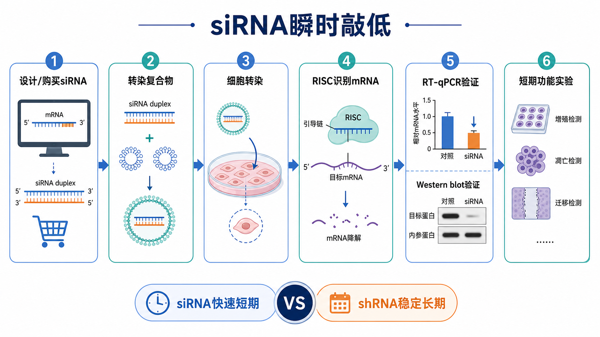

# siRNA瞬时敲低

[siRNA](<../材(实验耗材工具篇)/siRNA.md>)（small interfering RNA，小干扰 RNA）瞬时敲低是一种短周期 [基因敲低](基因敲低.md) 方法：把化学合成的双链 siRNA 递送到细胞内，让它进入 [RNAi](<../番外/补充知识/RNAi.md>)（RNA interference，RNA 干扰）通路，在 mRNA 层面降低目标基因表达。



图：siRNA 瞬时敲低的核心逻辑是“短期、快速、可逆地压低 mRNA”，常用于候选基因初筛和短周期功能验证。本图由 Image2 / image-generation model 生成，用于个人学习示意。

## 实验发明历史

RNAi 的概念来自 Fire 和 Mello 等在 1998 年发现的 double-stranded RNA（双链 RNA）可诱导序列特异性基因沉默。参考：[Fire et al., Nature, 1998](https://www.nature.com/articles/35888)。

2001 年，Elbashir 等证明 21-nt 左右的 siRNA duplex（siRNA 双链）可在哺乳动物培养细胞中沉默内源和外源基因表达，使 siRNA 成为研究哺乳动物基因功能的快速工具。参考：[Elbashir et al., Nature, 2001](https://www.nature.com/articles/35078107)。

与 [shRNA稳定敲低](shRNA稳定敲低.md) 相比，siRNA 不需要构建稳定细胞株，也不依赖病毒递送，因此更适合快速验证；但它持续时间短、容易受转染效率和细胞状态影响，不适合作为长期表型模型。

## 应用场景

- 候选基因快速验证：例如先判断某个基因下降后是否影响增殖、迁移、凋亡或药物反应。
- 论文机制链条补充：例如对过表达、通路抑制剂或生信预测结果做短期 loss-of-function（功能缺失）验证。
- 难以长期敲低的基因：某些基因长期下降会造成强选择压力，siRNA 可以在短窗口内观察早期变化。
- 多基因组合试探：同时转入多条 siRNA 或 siRNA pool，初步判断通路冗余或协同效应。
- 转染条件优化：siRNA 常用于测试某细胞系是否适合脂质体转染。

不适合的情况：如果实验需要持续数周、动物实验前稳定模型、药物长期耐受或克隆形成，通常应考虑 shRNA 稳定敲低、[CRISPRi](<../番外/补充知识/CRISPRi.md>) 或 [CRISPR-Cas9](<../番外/补充知识/CRISPR-Cas9.md>) knockout（基因敲除）。

## 实验目的

siRNA 瞬时敲低的目标不是“把基因永久关掉”，而是在一个明确时间窗口内回答：

- siRNA 是否成功进入细胞。
- 目标 mRNA 是否下降。
- 目标蛋白是否在合理时间后下降。
- 表型变化是否与目标基因下降一致。
- 多条独立 siRNA 是否给出相同方向的结果。
- 阴性对照、mock transfection（模拟转染）和细胞状态是否排除了非特异毒性。

## 简要实验原理

### siRNA 直接进入 RISC 通路

siRNA 是一段短双链 RNA。进入细胞后，双链中的 guide strand（引导链）被装载进 [RISC复合体](<../番外/补充知识/RISC复合体.md>)（RNA-induced silencing complex，RNA 诱导沉默复合体），由 [Ago2](<../番外/补充知识/Ago2.md>)（Argonaute 2，AGO2 蛋白）等组分识别互补 mRNA，并促进目标 mRNA 降解或翻译抑制。参考：[Addgene RNAi Guide](https://www.addgene.org/guides/rnai/)。

### 敲低读出有时间差

mRNA 通常先下降，蛋白下降要滞后，滞后时间取决于蛋白半衰期、细胞增殖速度、抗体检测灵敏度和敲低效率。很多实验会在转染后 24-48 h 看 mRNA，在 48-72 h 或更晚看蛋白，但具体窗口必须按目标基因和细胞系优化。Thermo Fisher 的 RNAiMAX protocol 也强调需要根据细胞类型优化 siRNA 浓度、脂质体比例和检测时间。参考：[Thermo Fisher RNAiMAX protocol](https://www.thermofisher.cn/cn/en/home/references/protocols/rnai-epigenetics-and-gene-regulation/rnai-protocol/lipofectamine-rnaimax.html)。

### 瞬时敲低不是稳定模型

siRNA 不会整合进基因组，通常也不会持续表达。随着细胞分裂、RNA 降解和蛋白更新，敲低效应会逐渐消退。因此 siRNA 更适合短期因果验证，而不是长期培养模型。

## 所需试剂、材料与设备

| 类型 | 常见内容 | 关键记录 |
| --- | --- | --- |
| RNAi 试剂 | siRNA、negative control siRNA（阴性对照 siRNA）、positive control siRNA（阳性对照 siRNA） | 靶基因、转录本、靶序列、化学修饰、供应商、批号 |
| 转染系统 | [脂质体转染试剂](<../材(实验耗材工具篇)/脂质体转染试剂.md>)、[Lipofectamine](<../材(实验耗材工具篇)/Lipofectamine.md>)、[Opti-MEM](<../材(实验耗材工具篇)/Opti-MEM.md>) | 转染试剂型号、RNA:lipid 比例、复合物形成条件 |
| 细胞培养 | 目标细胞、[DMEM](<../材(实验耗材工具篇)/DMEM.md>) 或 [RPMI 1640](<../材(实验耗材工具篇)/RPMI 1640.md>)、[FBS](<../材(实验耗材工具篇)/FBS.md>)、[PBS](<../材(实验耗材工具篇)/PBS.md>)、[Trypsin-EDTA](<../材(实验耗材工具篇)/Trypsin-EDTA.md>) | 细胞系来源、传代号、铺板密度、汇合度、支原体状态 |
| 表达验证 | [RT-qPCR](RT-qPCR.md) 试剂、qPCR 引物、[Western blot](<Western blot.md>) 抗体、内参基因和内参蛋白 | 检测时间点、引物序列、抗体批号、归一化方法 |
| 功能读出 | [CCK-8实验](CCK-8实验.md)、[克隆形成实验](克隆形成实验.md)、凋亡检测、迁移侵袭、药敏实验 | 接种密度、处理时间、药物浓度、归一化方式 |
| 设备 | [CO2培养箱](<../材(实验耗材工具篇)/CO2培养箱.md>)、生物安全柜、移液器、显微镜、qPCR 仪、电泳转膜设备 | 设备编号、孔板格式、观察时间 |

Thermo Fisher 的 RNAi transfection protocols 把细胞类型、转染方式、siRNA 浓度、转染试剂和优化流程作为影响 RNAi 成败的关键变量。参考：[Thermo Fisher RNAi Transfection Protocols](https://www.thermofisher.cn/cn/en/home/life-science/cell-culture/transfection/rnai-transfection/rnai-transfection-protocols.html)。

## 实验操作

### 设计或选择 siRNA

先明确目标 gene symbol、转录本编号、需要打击的 exon（外显子）或 shared exon（共同外显子）。如果目标基因有多个 [转录本异构体](<../番外/补充知识/转录本异构体.md>)，要先决定是敲低所有 isoform，还是只敲低某个特定 isoform。

为什么重要：siRNA 的有效性高度依赖序列。经典研究和商业设计工具都提示，不同 siRNA 对同一基因的沉默效率差异很大；理性设计、多个候选序列和合适对照可以显著降低失败率。参考：[Reynolds et al., Nature Biotechnology, 2004](https://doi.org/10.1038/nbt936)。

关键注意事项：

- 至少准备 2-3 条独立 siRNA；关键结论不要只依赖一条 siRNA。
- 优先使用经过验证的 predesigned siRNA 或算法评分较高的 custom siRNA。
- 避免明显重复序列、极端 GC 含量、与同源基因高度相似的区域。
- 注意 seed region（[seed区](<../番外/补充知识/seed区.md>)）相关 off-target（脱靶）风险。

替代方案：

- 初筛可使用 siRNA pool，提高成功概率；确认机制时再拆分成单条 siRNA 验证。
- 如果 siRNA 都无效，可尝试 shRNA、CRISPRi 或 antisense oligonucleotide（反义寡核苷酸）路线。

可能出错：只使用一条 siRNA 且没有 rescue experiment（[救援实验](<../番外/补充知识/救援实验.md>)），容易把 [脱靶效应](<../番外/补充知识/脱靶效应.md>) 误判为目标基因功能。

### 设置对照组

一个合格的 siRNA 实验至少应包含 untreated control（未处理对照）、mock transfection（[Mock转染](<../番外/补充知识/Mock转染.md>)，只有转染试剂没有 siRNA）、negative control siRNA（非靶向 [阴性对照](<../番外/补充知识/阴性对照.md>) siRNA）和 target siRNA（目标 siRNA）。如果在优化转染条件，还应加入 fluorescent control oligo（荧光寡核苷酸对照）或阳性敲低对照。

为什么重要：siRNA 实验最容易混淆三件事：目标基因敲低、转染试剂毒性、细胞状态变化。对照组的作用就是把这些因素拆开。

关键注意事项：

- mock 组用于判断脂质体本身是否导致细胞死亡或状态改变。
- negative control siRNA 用于估计非靶向 RNA duplex 的背景影响。
- positive control siRNA（[阳性对照](<../番外/补充知识/阳性对照.md>) siRNA）用于判断转染系统是否真的能工作。
- 功能实验中，target siRNA 应与 negative control siRNA 比较，而不是只和 untreated control 比较。

替代方案：

- 对没有荧光检测条件的实验，可用已知能稳定降低某个易检测基因的 siRNA 作为阳性对照。
- 如果细胞对转染非常敏感，可先只做 untreated、mock、negative control 和阳性对照，确认毒性可控后再上目标 siRNA。

可能出错：没有 mock 组时，无法判断细胞死亡来自目标基因下降还是转染试剂本身的 [转染毒性](<../番外/补充知识/转染毒性.md>)。

### 优化细胞状态和铺板密度

转染前细胞应处于健康、对数生长期，并保持合适汇合度。过稀会让细胞应激、死亡率升高；过密会降低转染效率，并影响增殖和药敏读出。

为什么重要：同一种 siRNA 和同一种转染试剂，在不同细胞密度、传代号和培养基状态下可能给出完全不同的 knockdown efficiency（敲低效率）。

关键注意事项：

- 记录细胞传代号、铺板时间、孔板格式和转染时汇合度。
- 转染前确认无明显污染，关键实验建议做 [支原体检测](支原体检测.md)。
- 对增殖很快的细胞，要让验证时间点和功能实验时间点仍处于可比较密度。
- 不要用刚复苏、刚强药筛或状态明显异常的细胞做关键结论。

替代方案：

- 对贴壁细胞可使用 forward transfection（正向转染）或 reverse transfection（反向转染）。
- 对难转染细胞可考虑电转、病毒递送、细胞类型专用试剂或换用更适合的模型。

可能出错：如果敲低组因为初始密度不同而长得慢，会被误判为目标基因抑制增殖。

### 形成 siRNA-转染试剂复合物

按照转染试剂说明书，用合适的低血清或无血清稀释液配制 siRNA 和脂质体复合物。常见做法是先分别稀释 siRNA 和脂质体，再混合形成复合物，随后加入细胞培养体系。Thermo Fisher 对 RNAiMAX 的说明中特别提醒，Opti-MEM 常用于稀释 RNAi duplex 和 Lipofectamine RNAiMAX，且转染时通常需要避免抗生素以减少细胞死亡。参考：[Thermo Fisher RNAiMAX protocol](https://www.thermofisher.cn/cn/en/home/references/protocols/rnai-epigenetics-and-gene-regulation/rnai-protocol/lipofectamine-rnaimax.html)。

为什么重要：复合物形成决定 siRNA 能否被细胞有效摄取。复合物太少会导致敲低不足；复合物太多会引发细胞毒性和非特异应激。

关键注意事项：

- 使用 RNase-free（无 RNase）耗材和溶液，避免 siRNA 降解。
- 初始条件可参考厂商推荐，但必须针对细胞系优化 siRNA 浓度和转染试剂用量。
- 不要把 DNA 转染条件直接套到 siRNA 上；合成 siRNA 通常需要更轻的递送条件。
- 注意血清、抗生素和培养基组分是否会影响复合物形成或细胞状态。

替代方案：

- 细胞耐受性差时，降低 siRNA 或脂质体用量，延长观察并选择更温和读出。
- 高通量筛选可使用 reverse transfection，提高孔间一致性。

可能出错：脂质体过量会造成细胞变圆、脱落、代谢下降，后续 CCK-8 或迁移实验会出现假阳性表型。

### 转染和换液窗口

把复合物加入细胞后，按细胞耐受性决定是否换液、何时换液以及是否继续含血清培养。很多常规细胞可以在含血清条件下转染，但原代细胞、干细胞或敏感细胞需要单独优化。

为什么重要：换液太早可能降低摄取；换液太晚可能增加毒性。不同细胞对脂质体和培养基变化的耐受性差异很大。

关键注意事项：

- 在正式实验前先做小规模转染效率和毒性测试。
- 转染后用显微镜观察细胞形态，记录脱落、变圆、颗粒增多和死亡。
- 如果功能实验依赖细胞活性，必须把转染毒性控制到可接受水平。
- 同一批实验中，所有组的换液时间和培养基处理应一致。

替代方案：

- 对容易脱落的细胞，可优化包被、降低转染强度或使用更温和试剂。
- 对悬浮细胞或免疫细胞，可能需要电转或专用递送系统。

可能出错：只追求最高 [转染效率](<../番外/补充知识/转染效率.md>)，忽略细胞健康，最终会得到“敲低很好但细胞全坏了”的不可解释结果。

### 选择验证时间点

常见验证逻辑是先检测 mRNA，再检测蛋白。对于多数短半衰期转录本，RT-qPCR 可较早看到下降；对于稳定蛋白，Western blot 的最佳窗口可能更晚。

为什么重要：如果时间点选错，真实敲低也可能被误判为失败。例如 mRNA 已经恢复但蛋白刚开始下降，或 mRNA 下降明显但蛋白还没来得及更新。

关键注意事项：

- RT-qPCR 引物尽量设计在 siRNA 靶点之外，避免局部片段影响解读。
- Western blot 要确认一抗特异性、内参稳定性和曝光线性范围。
- 对长半衰期蛋白，可以做 24/48/72/96 h 时间梯度。
- 功能实验时间点要与表达验证时间点相匹配。

替代方案：

- 如果没有可靠抗体，可检测下游 readout、荧光报告系统或靶基因调控的通路指标。
- 如果蛋白太稳定，可考虑 shRNA 稳定敲低、CRISPRi 或蛋白降解策略。

可能出错：只在 24 h 做 WB 判断 siRNA 无效，可能只是蛋白还没降下来。

### 接入短期功能实验

确认敲低有效且毒性可控后，再进入功能实验。siRNA 更适合短周期读出，例如细胞活性、凋亡、细胞周期、迁移、侵袭、短期药敏和通路响应。

为什么重要：功能实验解释必须建立在“目标基因真的下降”和“细胞状态没有被转染本身强烈破坏”之上。

关键注意事项：

- 增殖实验要区分目标基因效应和转染毒性。
- 迁移实验要先确认细胞活性和接种密度一致。
- 药敏实验要固定转染后加药时间，避免不同组敲低程度不同。
- 关键表型建议使用两条独立 siRNA 或 siRNA pool + 单条拆分验证。

替代方案：

- 如果表型需要更长时间显现，转向 shRNA 稳定敲低。
- 如果需要更强因果证据，做 rescue 实验或使用 CRISPRi/CRISPR-Cas9 正交验证。

可能出错：把 siRNA 造成的普遍细胞应激当成目标基因特异性表型，是 siRNA 论文实验中最常见的问题之一。

## 结果解析

| 结果模式 | 较合理解释 | 下一步 |
| --- | --- | --- |
| mRNA 明显下降，蛋白随后下降，表型一致 | siRNA 敲低有效，目标基因可能参与该表型 | 用第二条 siRNA 或 rescue 加强结论 |
| mRNA 下降，蛋白不下降 | 蛋白半衰期长、检测太早、抗体问题或敲低不足 | 做时间梯度、换抗体、换 siRNA |
| 蛋白下降但 mRNA 变化小 | 检测时间错位、引物不合适、抗体非特异或蛋白稳定性改变 | 换引物、重复 RNA 样本、验证抗体 |
| target siRNA 和 negative control 都伤细胞 | 转染毒性、细胞状态差或 siRNA 浓度过高 | 降低转染强度，优化细胞密度，加入 mock |
| 只有一条 siRNA 有表型 | 可能是有效序列，也可能是脱靶 | 增加独立 siRNA，做 rescue 或正交验证 |
| 多条 siRNA 都无效 | 靶序列设计失败、转染效率低、mRNA/蛋白检测窗口不对 | 检查阳性对照、换设计工具、优化转染 |

## 可能出现异常结果及对应原因

| 异常 | 可能原因 | 优先排查 |
| --- | --- | --- |
| 转染后细胞大量死亡 | 脂质体过量、siRNA 浓度过高、抗生素未去除、细胞状态差 | mock 组、脂质体梯度、培养基和细胞状态 |
| qPCR 没有敲低 | 转染效率低、siRNA 降解、靶序列无效、检测太早/太晚 | 荧光对照、阳性 siRNA、RNA 质量、时间梯度 |
| WB 条带不变 | 蛋白半衰期长、抗体不敏感、上样/曝光不在线性范围 | 延长时间、换抗体、检查内参和曝光 |
| 表型波动很大 | 铺板密度不一致、边缘孔效应、转染复合物混匀不均 | 做板图、随机化孔位、增加复孔 |
| 阴性对照也改变目标基因 | negative control 不合适或细胞受到非特异应激 | 更换阴性对照、降低转染强度 |
| rescue 不能恢复表型 | rescue 构建体仍被 siRNA 靶向、表达量不合适或表型非特异 | 做 silent mutation、验证 rescue 蛋白表达 |

## siRNA 与 shRNA 的核心区别

| 对比维度 | siRNA 瞬时敲低 | shRNA 稳定敲低 |
| --- | --- | --- |
| 分子形式 | 化学合成 RNA duplex | 细胞内表达的 hairpin RNA |
| 递送方式 | 多为脂质体、电转等非病毒递送 | 常用质粒或慢病毒载体 |
| 起效速度 | 快，适合短期验证 | 建模慢，适合长期实验 |
| 持续时间 | 短，随细胞分裂和 RNA 降解减弱 | 长，可维持稳定细胞池 |
| 主要风险 | 转染毒性、脱靶、时间窗口错配 | 病毒安全、整合效应、筛选压力 |
| 最适合 | 初筛、短期机制验证、快速排除假设 | 长周期功能实验、动物前模型、长期耐药 |

简化判断：如果你只是想快速知道“敲低这个基因会不会影响某个短期表型”，先用 siRNA；如果要做克隆形成、长期药筛、动物实验或多轮重复验证，再考虑 shRNA 稳定敲低。

## 推荐记录模板

中文记录：

```text
项目：
目标基因：
目标转录本/数据库编号：
siRNA编号与靶序列：
siRNA供应商/货号/批号/修饰：
阴性对照siRNA：
阳性对照siRNA：
细胞系/来源/传代号/支原体状态：
孔板格式与铺板密度：
转染试剂/货号/批号：
siRNA终浓度：
转染试剂用量：
复合物形成条件：
转染后是否换液/换液时间：
RT-qPCR检测时间点与敲低效率：
Western blot检测时间点与敲低效率：
进入功能实验的siRNA编号：
异常现象与处理：
```

English record:

```text
Project:
Target gene:
Target transcript/database ID:
siRNA ID and target sequence:
siRNA supplier/catalog number/lot number/modification:
Negative control siRNA:
Positive control siRNA:
Cell line/source/passage number/mycoplasma status:
Plate format and seeding density:
Transfection reagent/catalog number/lot number:
Final siRNA concentration:
Transfection reagent amount:
Complex formation condition:
Medium change after transfection/time:
RT-qPCR time point and knockdown efficiency:
Western blot time point and knockdown efficiency:
siRNA IDs used for functional assays:
Abnormal observations and actions:
```

## 小结

siRNA 瞬时敲低的优势是快、轻、适合短期验证；弱点是持续时间短、对转染效率和细胞状态敏感。一个可信的 siRNA 实验应同时满足：对照完整、转染毒性可控、mRNA 和蛋白验证合理、至少两条独立 siRNA 支持关键结论，并在主线结论中尽量加入 rescue 或正交验证。

## 参考来源

- [Fire et al., Potent and specific genetic interference by double-stranded RNA in Caenorhabditis elegans, Nature, 1998](https://www.nature.com/articles/35888)
- [Elbashir et al., Duplexes of 21-nucleotide RNAs mediate RNA interference in cultured mammalian cells, Nature, 2001](https://www.nature.com/articles/35078107)
- [Reynolds et al., Rational siRNA design for RNA interference, Nature Biotechnology, 2004](https://doi.org/10.1038/nbt936)
- [Addgene RNAi Guide](https://www.addgene.org/guides/rnai/)
- [Thermo Fisher RNAi Transfection Protocols](https://www.thermofisher.cn/cn/en/home/life-science/cell-culture/transfection/rnai-transfection/rnai-transfection-protocols.html)
- [Thermo Fisher Lipofectamine RNAiMAX Protocol](https://www.thermofisher.cn/cn/en/home/references/protocols/rnai-epigenetics-and-gene-regulation/rnai-protocol/lipofectamine-rnaimax.html)
- [Horizon Discovery ON-TARGETplus siRNA Reagents](https://horizondiscovery.com/en/gene-modulation/knockdown/sirna/products/on-targetplus2-sirna-reagents)
