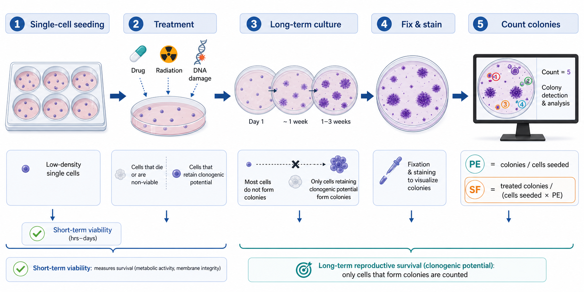
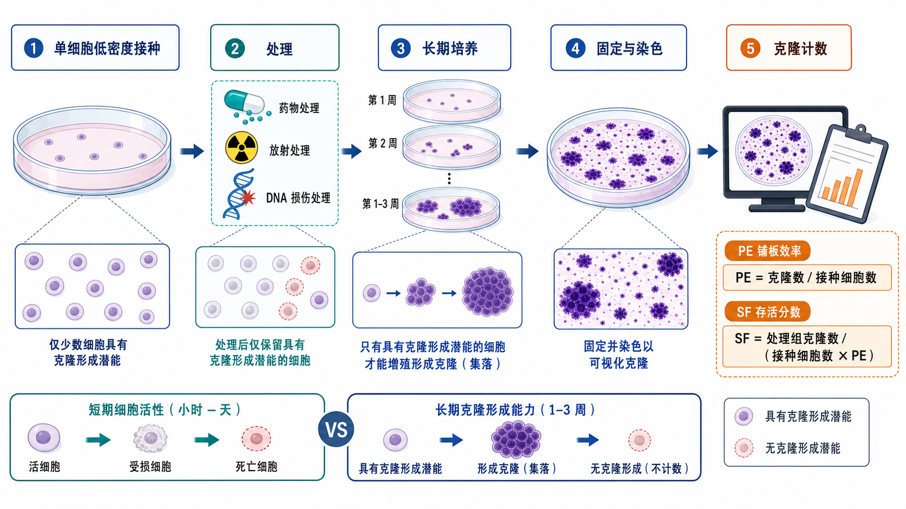

# 克隆形成实验

Clonogenic assay（克隆形成实验；也常写 colony formation assay、clonogenic survival assay）是一种评估单个细胞在处理后是否仍保留长期增殖并形成克隆能力的实验。它尤其适合评价放射、DNA 损伤药物、[PARP抑制剂](../番外/补充知识/PARP抑制剂.md)、[顺铂](<../材(实验耗材工具篇)/顺铂.md>)、基因敲除和 DNA 修复缺陷带来的长期存活变化。

一句话理解：短期细胞活性实验问的是“这几天细胞还活不活、代谢强不强”，克隆形成实验问的是“一个处理后的细胞还能不能真正重新长成一个家族”。



图：Clonogenic assay（克隆形成实验）的英文版 summary abstract graph，强调低密度接种、处理、长期培养、固定染色、克隆计数，以及 PE（plating efficiency，铺板效率）和 SF（surviving fraction，存活分数）的计算逻辑。



图：克隆形成实验中文版 summary abstract graph，用于快速建立“短期细胞活性”和“长期克隆形成能力”之间的区别。

## 发明历史与方法背景

克隆形成实验的思想来自放射生物学和早期哺乳动物细胞培养研究：一个单细胞如果仍具有 reproductive integrity（生殖完整性/长期增殖完整性），就能在足够时间内形成肉眼或显微镜可见的 colony（克隆/集落）。Puck 和 Marcus 在 1950s 建立了单个 HeLa 细胞形成克隆并用于放射敏感性分析的经典基础。现代细胞体外 clonogenic assay 的标准化说明常引用 [Franken et al., *Nature Protocols*, 2006](https://doi.org/10.1038/nprot.2006.339)。

这个实验之所以重要，是因为很多处理并不会立刻杀死细胞，却会让细胞失去继续分裂的能力。对 DNA 修复、放疗和药敏研究而言，这种“长期再增殖能力”常比 24-72 h 的代谢读数更接近最终生物学结局。

## 应用场景

| 场景 | 适合回答的问题 |
| --- | --- |
| 放射敏感性 | 不同剂量照射后细胞长期存活比例 |
| DNA 损伤药物 | 顺铂、etoposide、camptothecin 等处理后细胞是否保留克隆能力 |
| PARP/HRD 研究 | [同源重组缺陷](../番外/补充知识/同源重组缺陷.md)或 PARP trapping 是否降低长期存活 |
| 基因编辑或基因敲低 | 靶基因改变是否影响细胞再增殖能力 |
| 药物组合 | 两药联用是否产生比单药更强的长期抑制 |
| 耐药株验证 | 亲本和耐药细胞的 survival curve 是否改变 |

它不适合回答所有问题。若关心早期代谢、短期死亡、凋亡比例或细胞周期阻滞，通常需要配合 [细胞毒性检测](细胞毒性检测.md)、流式细胞术、Western blot 或成像实验。

## 实验目的

克隆形成实验主要用于：

- 测定细胞在处理后仍能形成克隆的比例；
- 比较不同剂量、不同药物、不同基因背景下的长期存活；
- 计算 plating efficiency（PE，[铺板效率](../番外/补充知识/铺板效率.md)）和 surviving fraction（SF，[存活分数](../番外/补充知识/存活分数.md)）；
- 建立药物或放射的 [剂量反应曲线](../番外/补充知识/剂量反应曲线.md)；
- 判断短期活性下降到底是暂时生长变慢，还是长期克隆能力真正丧失。

## 简要实验原理

将细胞以足够低的密度接种，使单个细胞之间相互分离。经过药物、放射或遗传扰动后，继续培养 1-3 周左右。能持续分裂的细胞会形成 colony；通常把包含约 50 个以上细胞的群体视为一个可计数克隆。这个经验阈值可减少“只分裂几次但无法持续扩增”的细胞被误判为存活。参考：[Franken et al., *Nature Protocols*, 2006](https://doi.org/10.1038/nprot.2006.339)。

核心计算包括：

```text
PE = untreated control colonies / untreated control cells seeded

SF = treated colonies / (treated cells seeded × PE)
```

如果每个剂量接种细胞数相同，也常直接用处理组克隆数相对溶剂对照归一化。但更规范的写法应记录实际 seeded cell number（接种细胞数）和 PE。

## 克隆形成实验 vs CFU assay vs 细胞毒性检测

| 方法 | 中文 | 核心对象 | 主要读数 | 不要混淆的点 |
| --- | --- | --- | --- | --- |
| Clonogenic assay | 克隆形成实验 | 肿瘤细胞、永生化细胞或能贴壁成克隆的细胞 | 长期存活/再增殖能力 | 不是短期代谢活性 |
| [Colony-forming unit assay](集落形成单位实验.md) | 集落形成单位实验/CFU assay | 造血祖细胞、微生物或特定功能性 progenitor | 功能性集落数量和类型 | 造血 CFU 更关注谱系潜能 |
| [细胞毒性检测](细胞毒性检测.md) | 细胞毒性/活性检测 | 群体细胞 | ATP、代谢、膜完整性等 | 不能直接代表长期克隆能力 |

所以在 PARP 抑制剂、放疗或 DNA 修复研究中，短期活性实验可以作为初筛，克隆形成实验更适合做长期功能验证。

## 所需试剂与器材

| 类别 | 常用内容 | 作用 |
| --- | --- | --- |
| 细胞 | 贴壁细胞系、肿瘤细胞、基因编辑细胞等 | 待检测对象 |
| 培养体系 | 对应完全培养基、血清、抗生素按实验设计决定 | 支持长期培养 |
| 接种耗材 | [细胞培养板](<../材(实验耗材工具篇)/细胞培养板.md>)、[细胞培养皿](<../材(实验耗材工具篇)/细胞培养皿.md>) | 低密度形成分离克隆 |
| 细胞处理 | 药物、放射、基因编辑、转染/感染等 | 施加实验压力 |
| 洗涤液 | [PBS](<../材(实验耗材工具篇)/PBS.md>) 或 DPBS | 洗去培养基、死细胞和染色液 |
| 消化液 | 胰蛋白酶或其他细胞消化试剂 | 处理前后重新接种时使用 |
| 固定液 | [甲醇](<../材(实验耗材工具篇)/甲醇.md>)、[多聚甲醛](<../材(实验耗材工具篇)/多聚甲醛.md>) 等 | 固定克隆 |
| 染色液 | [结晶紫](<../材(实验耗材工具篇)/结晶紫.md>)、methylene blue 等 | 显示克隆 |
| 计数工具 | 显微镜、扫描仪、ImageJ/ColonyArea/人工计数 | 克隆计数和面积测量 |
| 对照 | 溶剂对照、未处理对照、阳性毒性对照 | 归一化和质量控制 |

## 实验设计

### 先做接种密度预实验

**怎么做**：对每个细胞系先设置多个接种密度，例如 100、200、500、1000、2000 cells/well 或按培养皿面积调整，培养到预计终点后观察克隆数量和分离程度。

**为什么重要**：克隆形成实验最怕两种情况：克隆太少导致统计波动巨大，或克隆太密导致相互融合无法计数。不同细胞系的 PE 可差很多，不能照搬其他细胞系接种数。

**注意事项**：目标通常是让对照孔形成清晰、分离、数量适中的克隆。6-well plate 常见目标是几十到数百个可分离克隆，但具体范围取决于细胞大小、克隆形态和计数方法。

**替代方案**：如果药物高剂量杀伤很强，可在高剂量组接种更多细胞，以保证仍有可计数克隆。此时必须用 SF 公式按 seeded cell number 和 PE 修正。

**出错后果**：接种太密会高估存活；接种太稀会导致孔间差异大、曲线不稳定。

### 选择处理方式：先处理再接种，还是接种后处理

| 设计 | 做法 | 适用情况 | 风险 |
| --- | --- | --- | --- |
| 先处理再接种 | 群体细胞处理一段时间后消化、计数、低密度重铺 | 放射、短时药物脉冲、处理后长期存活 | 处理后计数/活率变化会影响接种准确性 |
| 接种后处理 | 低密度接种贴壁后加入药物或照射 | 长期药物暴露、贴壁依赖细胞 | 处理前贴壁时间和细胞状态要一致 |
| 连续暴露 | 药物维持到培养结束或定期换药 | 模拟持续药物压力 | 药物稳定性、培养基更换和蒸发影响大 |
| 脉冲暴露 | 处理数小时到数天后换成新鲜培养基 | DNA 损伤药物、短时冲击 | 暴露时间必须严格一致 |

PARP 抑制剂、顺铂或放疗研究应在记录中明确 exposure schedule（暴露方案），否则不同实验之间无法比较。

## 实验操作

### 细胞状态准备

**怎么做**：选择处于对数生长期、污染阴性、状态稳定的细胞。处理前避免过度融合、长时间饥饿或刚复苏不稳定状态。进行 [细胞计数](细胞计数.md)并记录活率。

**为什么重要**：克隆形成依赖长期增殖潜能。细胞状态差、密度太高或存在 [细胞污染](细胞污染.md) 会直接改变 PE。

**注意事项**：同一批实验中所有组尽量使用相同 passage number（传代数）、相同接种前融合度和相同消化时间。

**替代方案**：生长很慢的细胞可延长培养周期；悬浮细胞或半悬浮细胞需要改用软琼脂、甲基纤维素或其他体系，不应机械套用贴壁细胞方案。

**出错后果**：对照 PE 太低时，处理组 SF 的解释会非常不稳。

### 低密度接种

**怎么做**：根据预实验确定每孔接种数，充分重悬细胞后均匀接种。轻轻前后左右摇匀培养板，避免涡旋造成细胞集中在中央。

**为什么重要**：克隆必须尽量来自单个细胞。细胞成团会让一个“克隆”实际上来自多个细胞，导致存活率虚高。

**注意事项**：接种后让细胞均匀沉降，避免频繁移动培养板。边缘孔容易受蒸发影响，可加入 PBS 或使用外圈作缓冲。

**替代方案**：如果细胞极易成团，可过滤单细胞悬液、优化消化条件或加入轻柔吹打步骤。

**出错后果**：细胞分布不均会导致孔内区域差异，人工计数也会变得主观。

### 药物或放射处理

**怎么做**：按设计加入药物、照射或进行其他处理。药物实验需设置 [DMSO](<../材(实验耗材工具篇)/DMSO.md>) 或其他 [溶剂对照](../番外/补充知识/溶剂对照.md)，并保持各组溶剂终浓度一致。

**为什么重要**：克隆形成实验通常持续时间长，药物稳定性、换液频率和暴露时间都会改变结果。

**注意事项**：记录药物通用名、厂家、货号、批号、stock concentration、储存、冻融次数、终浓度、处理时间和换液方案。PARP 抑制剂实验还应记录是否连续暴露，因为 PARP trapping 和复制压力与时间强相关。

**替代方案**：对于不稳定药物，可定期换含药培养基；对于短时损伤药物，可脉冲处理后彻底洗去药物。

**出错后果**：药物降解或暴露时间不一致会让剂量反应曲线漂移。

### 长期培养

**怎么做**：培养 7-14 天或更久，直到对照组形成可清晰辨认的克隆。培养期间视细胞和药物情况换液。

**为什么重要**：终点不是固定天数，而是“克隆足够大、但尚未融合”的状态。

**注意事项**：不要等到对照组克隆大面积融合。若处理组长得慢，不能无限延长到处理组追上对照组，因为那会改变选择压力。

**替代方案**：对生长慢细胞可延长至 2-3 周；对快速增殖细胞可能 5-7 天已足够。

**出错后果**：终点太早会低估慢生长克隆；终点太晚会因融合导致计数不准。

### 固定和染色

**怎么做**：弃培养基，用 PBS 轻柔洗涤；加入固定液固定；再用结晶紫等染色，洗去背景后晾干。

**为什么重要**：固定染色让克隆可长期保存和计数。结晶紫会染细胞蛋白/DNA 相关成分，使克隆可见。

**注意事项**：洗涤不能太猛，避免冲掉克隆。染色背景过深会影响自动分析。

**替代方案**：可用甲醇固定结晶紫染色，也可用多聚甲醛固定后染色；如果后续要提取染料做吸光度读数，应先验证线性范围。

**出错后果**：固定不足会掉克隆；染色过深会导致小克隆和背景难分。

### 克隆计数

**怎么做**：人工计数或使用图像分析软件。常见标准是计数含约 50 个以上细胞的克隆，但具体阈值应在方法中说明。

**为什么重要**：阈值决定哪些细胞被认为保留长期增殖能力。过低阈值会把短暂分裂的细胞算作存活。

**注意事项**：计数人员最好盲法处理；同一实验内使用同一阈值和同一图像处理参数。

**替代方案**：除克隆数量外，也可分析 colony area（克隆面积）或 integrated staining intensity（总染色强度），但这些更容易受克隆大小和染色背景影响。

**出错后果**：主观阈值不一致会造成显著批次偏差。

## 结果解析

### 铺板效率 PE

PE 反映未处理细胞在该实验条件下形成克隆的基础能力：

```text
PE = untreated control colonies / untreated control cells seeded
```

如果对照 PE 很低，应优先排查细胞状态、接种密度、培养基、培养时间和污染，而不是急着解释药物敏感性。

### 存活分数 SF

SF 用于把处理组克隆数归一化到对照 PE：

```text
SF = treated colonies / (treated cells seeded × PEcontrol)
```

如果不同剂量组接种细胞数不同，必须使用这个公式。否则高剂量组因为接种更多细胞而不能直接和低剂量组比较。

### 曲线和统计

药物实验常画 concentration-response curve（浓度-反应曲线）或 surviving fraction curve。放射实验常画 radiation survival curve。统计时建议：

- 每个条件至少技术复孔；
- 至少独立重复 3 次；
- 对克隆计数使用合适的归一化和误差展示；
- 药物组合实验不要只看“更低”，还要使用合适协同模型或遗传互作设计。

## 异常结果与可能原因

| 异常 | 常见原因 | 调整策略 |
| --- | --- | --- |
| 对照组几乎没有克隆 | 细胞状态差、接种太少、培养时间太短、消化过度 | 重新做密度预实验，检查细胞状态和 PE |
| 对照组克隆融合 | 接种太多或培养太久 | 降低接种数，提前终点 |
| 同一孔内分布极不均 | 接种后摇匀方式不对、板移动太多 | 接种后轻柔十字摇匀，静置贴壁 |
| 组间溶剂不同 | DMSO 终浓度不一致 | 统一所有组溶剂浓度 |
| 高剂量组一个克隆都没有 | 剂量过高或接种数太少 | 增加剂量梯度，必要时高剂量组接种更多细胞 |
| 染色背景太深 | 染色过久、洗涤不足 | 缩短染色时间，统一洗涤 |
| 人工计数差异大 | 阈值不清、克隆融合、图像质量差 | 建立计数标准，盲法或软件辅助 |

## 推荐记录模板

### 中文模板

```text
实验名称：克隆形成实验
细胞系/克隆：
传代数：
处理类型：药物 / 放射 / 基因编辑 / 其他
处理方案：浓度或剂量、处理时间、是否连续暴露、换液方案
接种密度：每孔/每皿细胞数
培养器皿：6-well / 12-well / dish，品牌和货号
培养时间：
固定方式：
染色方式：
计数标准：例如 ≥50 cells/colony
对照组克隆数：
PE：
处理组克隆数：
SF：
异常记录：
```

### English Template

```text
Experiment: Clonogenic assay
Cell line/clone:
Passage number:
Treatment: drug / radiation / gene editing / other
Exposure schedule: concentration or dose, duration, continuous or pulse exposure, medium change
Seeding density: cells per well/dish
Culture vessel: format, brand, catalog number
Colony growth time:
Fixation:
Staining:
Counting threshold: e.g., >=50 cells/colony
Control colony count:
Plating efficiency:
Treated colony count:
Surviving fraction:
Notes/deviations:
```

## 小结

克隆形成实验是判断细胞长期再增殖能力的经典方法，特别适合 DNA 损伤、放疗、PARP 抑制剂、顺铂和基因编辑后的存活评价。它的成败关键不是染色本身，而是接种密度、处理方案、对照 PE、克隆计数阈值和 SF 计算是否清楚。只要这些变量记录完整，它就能把“短期活性变化”和“长期克隆死亡”区分开。

## 参考来源

- [Puck and Marcus, Action of X-rays on mammalian cells, *Journal of Experimental Medicine*, 1956](https://doi.org/10.1084/jem.103.5.653)
- [Franken et al., Clonogenic assay of cells in vitro, *Nature Protocols*, 2006](https://doi.org/10.1038/nprot.2006.339)
- [Munshi et al., Clonogenic cell survival assay, *Methods in Molecular Medicine*, 2005](https://doi.org/10.1385/1-59259-869-2:21)
