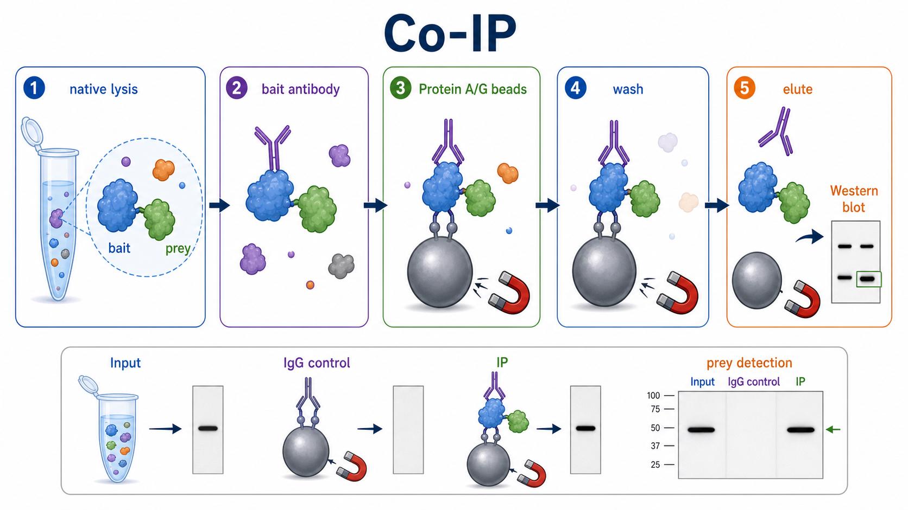
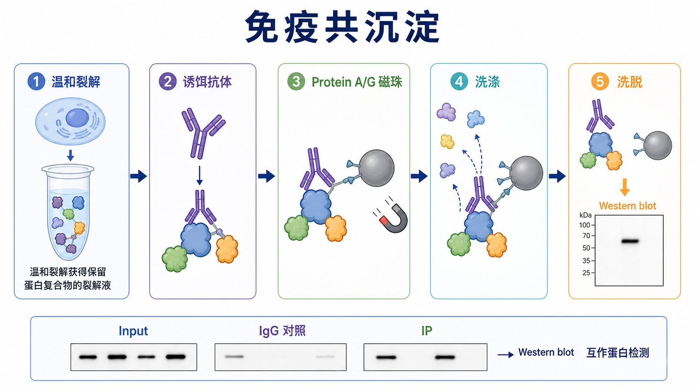

# 免疫共沉淀

Co-immunoprecipitation（免疫共沉淀，常简称 Co-IP）是用特异性 antibody（抗体）从温和裂解液中捕获一个 bait protein（[诱饵蛋白](../番外/补充知识/诱饵蛋白.md)），并观察它是否能把相互作用的 prey protein（[互作蛋白](../番外/补充知识/互作蛋白.md)）一起沉淀下来的实验。它常用于验证 protein-protein interaction（[蛋白质相互作用](../番外/补充知识/蛋白质相互作用.md)）是否在细胞或组织样本中存在。





一句话理解：Co-IP 不是证明两个蛋白一定直接接触，而是证明在特定裂解和洗涤条件下，一个抗体捕获的蛋白复合物中可以检测到另一个目标蛋白。

## 实验发明历史与背景

Immunoprecipitation（[免疫沉淀](免疫沉淀.md)，简称 IP）最初是利用抗原-抗体特异性结合从复杂样本中富集目标蛋白。随着 Western blot（[Western blot](<Western blot.md>)）和亲和捕获材料的发展，研究者可以不只检测“目标蛋白是否被拉下”，还可以检测“目标蛋白是否带着另一个蛋白一起被拉下”，这就形成了 Co-IP 的常用逻辑。

Co-IP 现在是细胞信号通路、蛋白复合物、受体-配体、转录调控复合物和泛素化/磷酸化调控研究中非常常见的验证实验。Cell Signaling Technology（[CST](<../番外/试剂厂商/Cell Signaling Technology.md>)）的 native protein IP protocol 强调要在 non-denaturing lysis buffer（非变性裂解缓冲液）中操作，并使用 Protein A/G magnetic beads（Protein A/G 磁珠）捕获免疫复合物。参考：[CST Immunoprecipitation Protocol](https://www.cellsignal.com/learn-and-support/protocols/protocol-ip-magnetic)。

Thermo Fisher Scientific 的 Pierce Co-IP Kit 说明也把 Co-IP 定义为用固定化抗体捕获抗原复合物，并通过后续检测确认共沉淀组分。它特别强调抗体固定化和洗脱方式会影响抗体重链/轻链干扰。参考：[Thermo Fisher Pierce Co-IP Kit](https://www.thermofisher.com/order/catalog/product/26149)。

## 应用场景

- 验证两个候选蛋白是否处在同一蛋白复合物中。
- 比较刺激、药物处理、突变、敲低或过表达后蛋白互作是否增强或减弱。
- 验证信号通路中受体、适配蛋白、激酶、转录因子或修饰酶之间的复合物关系。
- 在 Western blot 之前富集低丰度目标蛋白，提高检测机会。
- 为质谱筛选互作蛋白提供前处理思路，但正式 interactome 研究通常需要更严格的 IP-MS 设计。

不适合或需要谨慎的情况：

- 想证明两个蛋白“直接物理接触”：Co-IP 只能说明共处于同一复合物，不能排除第三方桥接蛋白。
- 互作非常瞬时、很弱或依赖膜结构、染色质结构、细胞器局部环境：裂解过程可能破坏互作。
- 抗体只适合 Western blot，不适合 IP：抗体识别线性表位不代表能捕获天然构象蛋白。
- 目标蛋白与 IgG heavy chain（免疫球蛋白重链）或 light chain（免疫球蛋白轻链）分子量接近：常规洗脱可能影响 WB 判读。

## 实验目的

Co-IP 的核心目的包括：

- 用抗体富集一个 bait protein，并观察 prey protein 是否随之被共沉淀。
- 比较不同处理组之间的互作强度变化。
- 区分真实互作信号和 [非特异结合](../番外/补充知识/非特异结合.md) 背景。
- 为后续机制研究、突变体分析、结构域定位或功能实验提供证据。

## 简要实验原理

### 温和裂解保留蛋白复合物

Co-IP 使用的裂解条件通常比普通变性蛋白提取更温和。过强去污剂、过高盐浓度、反复冻融或剧烈超声都可能破坏蛋白复合物；条件太温和又可能裂解不充分、背景高或目标蛋白释放不足。

常见的 Co-IP 裂解液会选择 NP-40、Triton X-100、CHAPS 或 mild detergent（温和去污剂）体系，并加入 [蛋白酶抑制剂](<../材(实验耗材工具篇)/蛋白酶抑制剂.md>) 和 [磷酸酶抑制剂](<../材(实验耗材工具篇)/磷酸酶抑制剂.md>)。如果互作依赖磷酸化、泛素化或其他翻译后修饰，抑制剂是否及时加入会直接影响结果。

### 抗体决定捕获对象

Co-IP 的选择性来自 antibody-antigen binding（抗体-抗原结合）。抗体可以直接加入裂解液中先结合目标蛋白，也可以先固定到 beads（微珠）上再加入裂解液。常见捕获材料包括 [Protein A-G磁珠](<../材(实验耗材工具篇)/Protein A-G磁珠.md>)、[Protein A-G琼脂糖珠](<../材(实验耗材工具篇)/Protein A-G琼脂糖珠.md>) 或预包被抗体磁珠。

Protein A 和 Protein G 是能结合不同物种、不同亚型 IgG Fc 区的细菌来源蛋白。选择 Protein A、Protein G 或 Protein A/G 混合体系时，需要看抗体宿主和 IgG subtype（IgG 亚型）兼容性。Abcam 的 IP/Co-IP protocol 也提醒，抗体与 beads 的匹配会影响结合效率和背景。参考：[Abcam Immunoprecipitation Protocol](https://www.abcam.com/protocols/immunoprecipitation-protocol)。

### 洗涤决定信噪比

洗涤的任务是保留特异性复合物，同时去掉非特异吸附蛋白。盐浓度、去污剂浓度、洗涤次数和洗涤时间越强，背景越低，但弱互作越容易丢失；条件越温和，弱互作更容易保留，但背景也更高。

### 洗脱和检测决定能否读懂结果

Co-IP 后常用 SDS sample buffer（SDS 上样缓冲液）煮沸洗脱，再接 [SDS-PAGE](SDS-PAGE.md) 和 Western blot 检测 prey protein。若目标蛋白分子量接近抗体重链或轻链，可以考虑交联抗体到 beads、使用 light-chain-specific secondary antibody（轻链特异性二抗）、native elution（非变性洗脱）或标签系统。

## 所需试剂、耗材和设备

| 类别 | 常用内容 | 作用 | 注意事项 |
|---|---|---|---|
| 样本 | 细胞、组织裂解液或表达系统样本 | 提供天然蛋白复合物 | 处理组和对照组要同步裂解 |
| 裂解液 | [非变性裂解液](<../材(实验耗材工具篇)/非变性裂解液.md>)、IP lysis buffer | 保留蛋白互作并释放蛋白 | 不建议默认使用强变性裂解 |
| 抑制剂 | 蛋白酶抑制剂、磷酸酶抑制剂 | 防止降解和修饰丢失 | 临用前加入 |
| 捕获抗体 | IP-grade 一抗、标签抗体 | 捕获 bait protein | WB-grade 不等于 IP-grade |
| 对照抗体 | [正常IgG](<../材(实验耗材工具篇)/正常IgG.md>) | 评估非特异背景 | 宿主和亚型尽量匹配捕获抗体 |
| 捕获微珠 | Protein A/G 磁珠或琼脂糖珠 | 捕获抗体-抗原复合物 | 选择与抗体宿主/亚型匹配的类型 |
| 洗脱体系 | SDS sample buffer、低 pH 洗脱液或竞争性肽 | 洗脱免疫复合物 | WB 检测通常用变性洗脱 |
| 检测 | Western blot、一抗、二抗、ECL | 检测 bait 和 prey | 需要 Input、IgG、IP 等对照 |
| 设备 | 冷冻离心机、旋转混匀仪、磁力架或离心架、冰盒 | 保持低温和分离微珠 | 全程尽量低温操作 |

## 实验设计

### 选择内源性 Co-IP 还是过表达 Co-IP

| 类型 | 优点 | 局限 | 推荐用途 |
|---|---|---|---|
| Endogenous Co-IP（内源性 Co-IP） | 更接近真实生理状态 | 目标丰度低，对抗体要求高 | 机制验证和关键结论 |
| Overexpression Co-IP（过表达 Co-IP） | 信号强，容易建立体系 | 可能产生非生理互作 | 初筛、结构域定位、突变体比较 |
| Tag Co-IP（标签 Co-IP） | 抗体和微珠体系稳定 | 标签可能影响定位或互作 | 缺乏好内源抗体时 |

如果论文结论要强调真实细胞内互作，最好至少用内源性 Co-IP 或反向 Co-IP 支撑；单纯过表达 Co-IP 的说服力相对弱。

### 设计必要对照

| 对照 | 作用 | 理想表现 |
|---|---|---|
| Input | 裂解液总蛋白 | bait 和 prey 都能检测到 |
| IgG control（IgG 对照） | 评估抗体和 beads 的非特异背景 | prey 信号很弱或没有 |
| Beads-only control（仅微珠对照） | 评估 beads 自身吸附 | 背景低 |
| Positive control（阳性对照） | 证明体系能检测已知互作 | 能拉下已知 prey |
| Reverse Co-IP（反向 Co-IP） | 用 prey 抗体拉 bait | 能增强互作可信度 |
| Knockdown/knockout control | 验证条带特异性 | 目标条带下降或消失 |

### 选择裂解和洗涤强度

| 互作特点 | 裂解建议 | 洗涤建议 |
|---|---|---|
| 强而稳定的互作 | 可稍强裂解和洗涤 | 背景可压低 |
| 弱或瞬时互作 | 温和裂解，缩短操作时间 | 洗涤更温和 |
| 膜蛋白互作 | 选择适合膜蛋白的温和去污剂 | 避免过强去污剂破坏复合物 |
| 核蛋白/染色质相关互作 | 可能需要核提取或低强度剪切 | 避免 DNA 黏度造成假阳性 |

## 实验操作

下面是通用 Co-IP 思路，正式实验应以具体抗体、beads 和 kit 说明书为准。CST、Abcam、Thermo Fisher 和 Cytiva 的 protocol 在细节上会有差异，但核心流程都围绕“裂解 - 捕获 - 洗涤 - 洗脱 - WB 检测”展开。

### 样本准备和处理

做法：

- 根据实验问题设置处理组、对照组和重复。
- 细胞处理结束后快速置冰，弃培养基并冷洗。
- 尽量让各组收样时间、细胞量和裂解条件一致。

为什么重要：

Co-IP 测的是“在某个状态下是否存在复合物”。刺激时间、收样温度和细胞状态都会改变互作。对磷酸化依赖互作，延迟收样可能让信号迅速消失。

注意事项：

- 不要让细胞在室温长时间等待。
- 处理组和对照组不要分批裂解太久。
- 如果样本很珍贵，先取一小部分做 Input WB，确认 bait/prey 是否存在。

### 温和裂解

做法：

- 加入预冷非变性裂解液。
- 同时加入蛋白酶抑制剂和磷酸酶抑制剂。
- 冰上裂解并轻柔混匀。
- 低温离心去除不溶物，保留上清作为 lysate（裂解液）。

为什么重要：

裂解条件需要在“释放蛋白”和“保留互作”之间平衡。普通 Western blot 常用的强裂解条件可能更适合总蛋白提取，但不一定适合 Co-IP。

可能出错导致的结果：

- 裂解太强：真实互作被破坏，IP 中检测不到 prey。
- 裂解太弱：目标蛋白释放不足，Input 和 IP 信号都低。
- 样本太黏：核酸释放导致 pipetting 困难，背景升高。

替代策略：

- 对弱互作可降低盐浓度或温和去污剂强度。
- 对背景高的体系可适当提高盐浓度或增加洗涤强度。
- 对核酸黏度高的样本可温和剪切或加入核酸酶，但要确认不破坏复合物。

### 预清除

做法：

- 将裂解液与空 beads 或正常 IgG-beads 短时间孵育。
- 分离 beads，保留上清用于正式 IP。

为什么重要：

Pre-clearing（预清除）可以降低 beads 或 IgG 非特异吸附造成的背景。样本背景高、组织裂解液复杂或后续质谱分析时更有价值。

注意事项：

- 预清除也可能带走少量目标复合物，不一定每次都必须做。
- 如果目标丰度很低，预清除时间不宜过长。

### 抗体结合

做法：

- 将 IP-grade bait antibody 加入裂解液。
- 低温旋转孵育，让抗体结合 bait protein。
- 也可以先把抗体固定到 Protein A/G beads 上，再加入裂解液。

为什么重要：

抗体是 Co-IP 成败的中心变量。能在 WB 中识别变性蛋白的抗体，不一定能识别天然构象中的 bait protein。

注意事项：

- 优先选择说明书明确标注适合 IP 或 Co-IP 的抗体。
- 捕获抗体和 WB 检测抗体最好来自不同物种，减少二抗交叉干扰。
- 抗体用量过少会拉不下 bait；过多会增加重链/轻链和非特异背景。

替代策略：

- 如果内源抗体不好，可构建 FLAG、HA、Myc、GFP 等标签表达体系。
- 如果重链干扰严重，可用抗体交联 beads 或选择直接偶联磁珠。
- 可做 reverse Co-IP，用 prey 抗体反向拉 bait。

### 加入 Protein A/G beads

做法：

- 预洗 Protein A/G 磁珠或琼脂糖珠，去除保存液。
- 加入抗体-裂解液体系，低温旋转孵育。
- 用磁力架或低速离心分离 beads。

为什么重要：

Protein A/G beads 捕获抗体 Fc 区，从而把 bait 和与其结合的 prey 一起富集下来。beads 量不足会降低回收，过量则可能提高背景。

注意事项：

- 磁珠使用前必须充分混匀。
- 琼脂糖珠不要剧烈 vortex，避免破碎。
- 选择 Protein A、Protein G 或 Protein A/G 时要看抗体宿主和亚型兼容性。

### 洗涤

做法：

- 用预冷 wash buffer 洗涤 beads。
- 每次轻柔混匀后分离 beads，弃上清。
- 根据背景和互作强弱调整洗涤次数、盐浓度和去污剂浓度。

为什么重要：

洗涤是 Co-IP 信噪比的关键。洗得太轻，IgG control 也有条带；洗得太强，真实 prey 被洗掉。

可能出错导致的结果：

- 洗涤太强：IP 中 bait 还在，但 prey 消失。
- 洗涤太弱：IgG control 和 beads-only control 都有明显条带。
- 吸液带走 beads：回收量降低，结果不稳定。

### 洗脱

做法：

- 若下游是 Western blot，可加入 SDS sample buffer 并加热洗脱。
- 若需要保持蛋白活性或用于后续功能实验，可考虑低 pH、竞争性肽或温和洗脱。
- 收集洗脱液，进入 SDS-PAGE 和 Western blot。

为什么重要：

变性洗脱最简单、回收强，但会同时洗脱抗体重链和轻链。若检测目标蛋白分子量接近 50 kDa 或 25 kDa，抗体链条可能遮挡结果。

替代策略：

- 抗体交联到 beads 后再 IP，减少重链/轻链进入洗脱液。
- 使用 light-chain-specific secondary antibody。
- 使用 tag-based IP，减少内源抗体链干扰。

### Western blot 检测

做法：

- 同时上样 Input、IgG control、IP bait 和 IP prey 检测样本。
- 先确认 bait 是否被成功拉下，再判断 prey 是否共沉淀。
- 如果膜允许，可剥膜后分别检测 bait 和 prey。

为什么重要：

如果 bait 都没有被拉下，就不能解释 prey 阴性是“没有互作”。如果 Input 中 prey 不存在，也不能解释 IP 阴性是“没有互作”。

注意事项：

- Input 上样量通常远低于 IP 洗脱物，不能直接用条带强度做绝对比较。
- prey 信号应在 IP 组强于 IgG 对照。
- 需要关注抗体重链/轻链和目标蛋白分子量是否重叠。

## 结果解析

### 理想结果

- Input 中能检测到 bait 和 prey。
- IP bait 检测显示 bait 被成功拉下。
- IgG control 中 prey 信号很弱或没有。
- IP 组中能检测到 prey，且明显高于 IgG 背景。
- 处理组之间 prey 共沉淀强度变化符合实验假设。

### 阴性结果如何判断

| 观察结果 | 更可能说明什么 |
|---|---|
| Input 没有 bait | 样本表达不足或裂解失败 |
| Input 有 bait，但 IP 没有 bait | 抗体不适合 IP、beads 不匹配或裂解条件破坏表位 |
| IP 有 bait，但没有 prey | 可能无互作，也可能互作太弱、裂解/洗涤过强或处理条件不对 |
| IgG 对照也有 prey | 非特异吸附或 prey 本身容易粘 beads/IgG |
| 反向 Co-IP 不支持 | 互作可信度下降，或反向抗体/表位不可用 |

### 阳性结果如何避免过度解释

Co-IP 阳性不能直接说明两个蛋白直接结合，因为它们可能通过第三个蛋白、核酸、膜结构或大复合物间接关联。若要证明直接结合，应结合 GST pull-down、纯化蛋白结合实验、SPR/BLI、FRET/BiFC、结构域突变或体外重构实验。

## 异常结果与 troubleshooting

| 异常结果 | 可能原因 | 解决策略 |
|---|---|---|
| bait 拉不下来 | 抗体不适合 IP；表位被遮挡；裂解条件破坏构象 | 换 IP-grade 抗体；改 tag IP；优化裂解液 |
| prey 检测不到 | 互作弱或瞬时；洗涤过强；表达量低 | 降低洗涤强度；缩短操作；增加样本量；做刺激时间梯度 |
| IgG 对照背景高 | 非特异吸附；beads 过量；洗涤不足 | 预清除；减少 beads；增加盐/洗涤次数；更换封闭策略 |
| 条带被重链遮挡 | 捕获抗体链进入洗脱液 | 抗体交联 beads；换轻链特异二抗；换标签 IP |
| Input 正常但 IP 重复性差 | 样本量、抗体量、beads 量或裂解时间不一致 | 固定细胞数/蛋白量；记录批号和孵育时间 |
| IP 中出现很多杂带 | 洗涤太温和；抗体质量差；样本过量 | 优化洗涤；换抗体；降低上样量 |
| 处理组差异不稳定 | 刺激时间不准；复合物动态变化快；蛋白降解 | 做时间梯度；低温快速收样；及时加入抑制剂 |

## Co-IP vs IP vs pull-down vs PLA

| 方法 | 主要问题 | 优点 | 局限 |
|---|---|---|---|
| IP | 能否富集目标蛋白 | 富集目标蛋白，便于 WB 或 MS | 不一定关注互作 |
| Co-IP | 目标蛋白是否带下互作蛋白 | 接近细胞内复合物状态 | 不能证明直接结合 |
| Pull-down | 纯化诱饵能否结合 prey | 适合体外直接结合验证 | 可能缺少细胞内修饰和环境 |
| PLA | 细胞内两个蛋白是否足够接近 | 保留空间定位 | 依赖抗体质量和距离阈值 |
| IP-MS | 捕获复合物中有哪些蛋白 | 可发现新互作组分 | 背景控制和统计要求高 |

一个实用判断：想证明“在细胞里可能同处复合物”，用 Co-IP；想证明“直接结合”，需要体外结合实验或结构/生物物理证据；想看“在细胞哪个位置接近”，可考虑 PLA 或成像类方法。

## 购买和记录建议

- 捕获抗体优先选择说明书明确支持 IP/Co-IP 的 clone，并记录 clone number、host species、isotype、catalog number 和 lot number。
- Protein A/G beads 要根据抗体宿主和 IgG subtype 选择，磁珠适合快速操作和低背景，琼脂糖珠成本低但操作更依赖离心和手法。
- 目标蛋白接近 50 kDa 或 25 kDa 时，提前考虑抗体链干扰，不要等 WB 曝光后才发现条带遮挡。
- 如果实验目的是发表级互作验证，建议至少包括 Input、IgG control、bait IP、prey detection、bait pulldown verification，重要结论最好加入 reverse Co-IP 或功能扰动。

## 推荐记录模板

### 中文记录模板

```text
实验日期：
细胞/组织样本：
处理条件：
裂解液配方：
裂解时间和温度：
总蛋白浓度：
Input 保留比例：
捕获抗体名称：
抗体厂家、货号、批号、宿主、亚型：
抗体用量：
Beads 类型和用量：
预清除：是 / 否
抗体孵育时间：
Beads 孵育时间：
洗涤 buffer 和次数：
洗脱方式：
WB 检测抗体：
Input 结果：
IgG 对照结果：
IP bait 结果：
prey 检测结果：
异常情况和处理：
```

### English record template

```text
Date:
Cell/tissue sample:
Treatment condition:
Lysis buffer:
Lysis time and temperature:
Total protein concentration:
Input fraction saved:
IP antibody:
Antibody manufacturer, catalog number, lot number, host, isotype:
Antibody amount:
Bead type and amount:
Pre-clearing: yes / no
Antibody incubation time:
Bead incubation time:
Wash buffer and wash number:
Elution method:
WB detection antibody:
Input result:
IgG control result:
IP bait result:
Prey detection result:
Issues and actions:
```

## 小结

免疫共沉淀的本质是“用抗体抓住一个蛋白复合物，再看另一个蛋白是否一起被抓住”。它的难点不在单一步骤，而在变量平衡：裂解要足够温和以保留互作，洗涤要足够严格以压低背景，抗体要能识别天然构象，检测体系要避开抗体链干扰。一个可信的 Co-IP 结果必须同时看 Input、IgG 对照、bait 是否被拉下和 prey 是否特异共沉淀，不能只看 IP 条带本身。

## 参考来源

- Cell Signaling Technology. Immunoprecipitation Protocol: For Native Proteins Using Magnetic Separation. https://www.cellsignal.com/learn-and-support/protocols/protocol-ip-magnetic
- Abcam. Immunoprecipitation protocol. https://www.abcam.com/protocols/immunoprecipitation-protocol
- Thermo Fisher Scientific. Pierce Co-Immunoprecipitation Kit. https://www.thermofisher.com/order/catalog/product/26149
- Thermo Fisher Scientific. Pierce Classic IP Kit. https://www.thermofisher.com/order/catalog/product/26146
- Cytiva. Protein G Mag Sepharose Xtra. https://www.cytiva.com/en/us/shop/protein-analysis/immunoprecipitation/protein-g-mag-sepharose-xtra-p-05727
