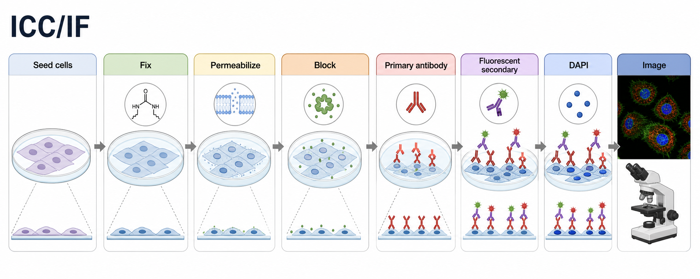
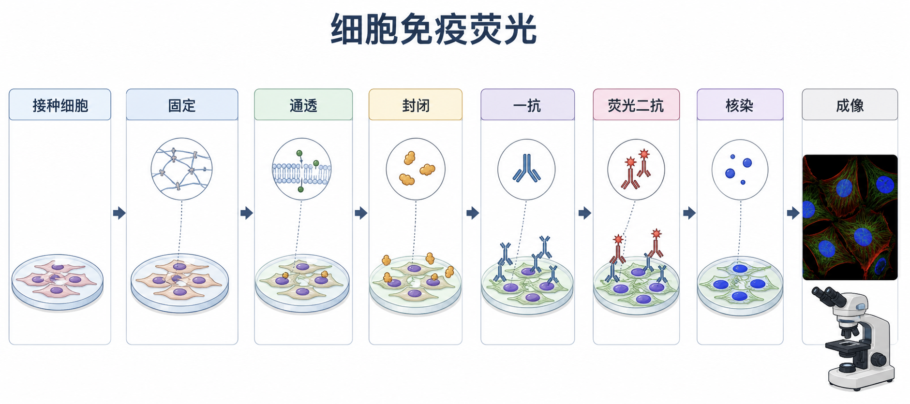

# 免疫荧光





图源：Image2 生成的 cultured-cell ICC/IF summary graph abstract。英文版用于 GitHub/英文记录场景，中文版用于快速理解细胞免疫荧光流程。

Immunofluorescence（免疫荧光，IF）是一类用 antibody-antigen recognition（抗体-抗原识别）定位目标分子，并用 fluorescent signal（荧光信号）在显微镜下观察的免疫检测方法。本页默认讨论 cultured-cell immunofluorescence / immunocytochemistry-immunofluorescence（培养细胞免疫荧光 / 免疫细胞化学-免疫荧光，ICC/IF）：细胞接种在 [盖玻片](<../材(实验耗材工具篇)/盖玻片.md>) 或成像板上，经过固定、通透、封闭、一抗、荧光二抗、核染、封片和成像。

本页不把组织切片 immunohistochemistry（免疫组织化学，IHC）、流式细胞术中的 intracellular staining（胞内染色）或空间组学成像全部展开；这些可以作为后续独立笔记。这里的重点是：让读者理解细胞 IF 为什么这样做，以及如何根据抗原位置、抗体质量和显微镜条件调整 protocol。

## 实验发明历史

IF 的历史核心来自 fluorescent antibody technique（荧光抗体技术）。Coons 和同事在 20 世纪 40 年代早期提出把荧光基团连接到抗体上，用来在组织或细胞中显示特定抗原，这是现代免疫荧光、免疫组织化学和抗体成像的源头之一。参考：Coons et al., 1941, [DOI: 10.3181/00379727-47-13084P](https://doi.org/10.3181/00379727-47-13084P)。

早期 direct immunofluorescence（直接免疫荧光）常把荧光染料直接接到一抗上。后来 indirect immunofluorescence（间接免疫荧光）变得更常用：未标记的一抗识别目标抗原，荧光二抗再识别一抗。间接法的好处是信号更强、二抗更通用、实验更灵活。现代 IF 又叠加了高性能荧光染料、抗淬灭封片剂、宽场荧光显微镜、confocal microscopy（共聚焦显微镜）和图像分析软件，使它从“看有没有信号”扩展为定位、共定位、细胞比例、形态和定量分析工具。

## 应用场景

| 场景 | IF回答的问题 | 例子 |
| --- | --- | --- |
| 蛋白定位 | 目标蛋白在细胞核、细胞质、膜、细胞骨架还是细胞器中 | 转录因子核转位、膜受体定位 |
| 处理前后变化 | 刺激、药物、转染、敲低后信号是否改变 | 炎症刺激后 NF-kB 核转位 |
| 细胞状态判断 | 细胞类型、分化状态、增殖或死亡标志物 | Ki-67、cleaved caspase-3、细胞骨架 |
| 共定位 | 两个信号是否在空间上重叠 | 目标蛋白与线粒体/溶酶体标记物 |
| 抗体验证 | 抗体在细胞中是否产生合理定位 | 与 knockout、knockdown 或阳性细胞系比较 |
| 形态学观察 | 信号变化是否伴随细胞形态变化 | 细胞铺展、突起、应激纤维 |

IF 的强项是 spatial information（空间信息）。如果只关心蛋白总量，[Western blot](<Western blot.md>) 更适合；如果要定量上清中的分泌蛋白，[ELISA](ELISA.md) 更适合；如果要统计大量单细胞阳性比例但不关心空间定位，[流式细胞术](流式细胞术.md) 更合适；如果样本是组织切片，[免疫组化](免疫组化.md) 或 tissue immunofluorescence（组织免疫荧光）更合适。

## 实验目的

一次常规细胞 IF 通常想回答这些问题：

- 目标抗原是否能被特异性抗体检测到。
- 目标抗原主要位于哪里。
- 实验处理是否改变目标抗原的强度、分布或细胞阳性比例。
- 目标信号是否与另一个 marker（标志物）发生 [共定位](<../番外/补充知识/共定位.md>)。
- 观察到的信号是否高于背景，并且能被合适对照支持。

IF 不是天然的绝对定量实验。荧光强度会受到固定、通透、抗体浓度、孵育时间、封片、曝光、激光功率、增益、光漂白和图像处理影响。若要做定量，必须保证同一批样本用同一成像设置，并且信号没有饱和。

## 简要实验原理

细胞 IF 可以拆成两条逻辑线：

```text
样本处理线：细胞生长 -> 固定 -> 通透 -> 封闭 -> 洗涤 -> 封片
抗体识别线：抗原 -> 一抗识别 -> 荧光二抗识别一抗 -> 显微镜检测荧光
```

Fixation（固定）把细胞结构和抗原尽量保留在接近实验终点的状态。Permeabilization（通透）让抗体进入细胞内部。Blocking（封闭）用蛋白或血清占据非特异性结合位点，降低背景。Primary antibody（一抗）决定目标识别特异性，[荧光二抗](<../材(实验耗材工具篇)/荧光二抗.md>) 决定信号颜色和放大效率。DAPI（4',6-diamidino-2-phenylindole，4',6-二脒基-2-苯基吲哚，[DAPI](<../材(实验耗材工具篇)/DAPI.md>)）或 [Hoechst](<../材(实验耗材工具篇)/Hoechst.md>) 常用于核染，帮助定位细胞核和计数细胞。

Thermo Fisher 和 Abcam 的 ICC/IF protocol 都围绕固定、通透、封闭、一抗、二抗、核染和成像这些模块展开；差异主要在固定剂、通透剂、封闭液、抗体稀释和孵育时间。参考：[Thermo Fisher Immunofluorescence Protocol](https://www.thermofisher.com/us/en/home/references/protocols/cell-and-tissue-analysis/protocols/immunofluorescence-protocol.html)；[Abcam ICC/IF protocol](https://www.abcam.com/en-us/technical-resources/protocols/immunocytochemistry-immunofluorescence-protocol)。

## IF vs WB/ELISA/IHC/流式细胞术

| 方法                                | 核心信息          | 优点                  | 局限                  | 什么时候优先选            |
| --------------------------------- | ------------- | ------------------- | ------------------- | ------------------ |
| IF                                | 蛋白或抗原的细胞内空间定位 | 能看位置、形态、细胞异质性和共定位   | 定量受成像条件影响大，抗体背景可能误导 | 想知道“在哪里”和“哪些细胞阳性”  |
| [Western blot](<Western blot.md>) | 蛋白分子量和相对总量    | 可看条带大小、剪切、降解、修饰迁移变化 | 丢失空间信息，混合样本平均化      | 想知道目标蛋白大小和总量变化     |
| [ELISA](ELISA.md)                 | 可溶性目标分子浓度     | 定量和通量更好             | 不提供位置和分子量           | 测上清、血清、细胞因子、分泌蛋白   |
| [免疫组化](免疫组化.md)                   | 组织切片中的抗原分布    | 保留组织结构和病理背景         | 样本处理更复杂，抗原修复常重要     | 看组织定位和病理结构         |
| [流式细胞术](流式细胞术.md)                 | 单细胞群体阳性比例和强度  | 高通量、统计强             | 失去二维空间位置            | 想定量大量细胞的 marker 表达 |

一句话：IF 的独特价值是“空间定位 + 细胞形态”。如果实验问题不需要空间信息，IF 不一定是最高效的方法。

## 实验所需试剂、耗材和设备

### 试剂

| 试剂 | 作用 | 常见选择 |
| --- | --- | --- |
| phosphate-buffered saline（磷酸盐缓冲盐水，[PBS](<../材(实验耗材工具篇)/PBS.md>)） | 洗涤、稀释、维持等渗缓冲环境 | 无钙镁或普通 PBS 均可，按细胞情况选择 |
| Fixative（固定剂） | 保留细胞形态和抗原位置 | 4% paraformaldehyde（多聚甲醛，PFA）、冷 [甲醇](<../材(实验耗材工具篇)/甲醇.md>) |
| Permeabilization reagent（通透剂） | 让抗体进入细胞内部 | [Triton X-100](<../材(实验耗材工具篇)/Triton X-100.md>)、saponin、digitonin |
| Blocking buffer（封闭液） | 降低非特异性结合和背景 | bovine serum albumin（牛血清白蛋白，[BSA](<../材(实验耗材工具篇)/BSA.md>)）、[正常血清](<../材(实验耗材工具篇)/正常血清.md>)、商业 [封闭液](<../材(实验耗材工具篇)/封闭液.md>) |
| [一抗](<../材(实验耗材工具篇)/一抗.md>) | 特异性识别目标抗原 | 需确认物种来源、克隆号、IF/ICC 验证 |
| [荧光二抗](<../材(实验耗材工具篇)/荧光二抗.md>) | 识别一抗并提供荧光信号 | Alexa Fluor、Cy、fluorescein isothiocyanate（异硫氰酸荧光素，[FITC](<../材(实验耗材工具篇)/FITC.md>)）/ tetramethylrhodamine（四甲基罗丹明，[TRITC](<../材(实验耗材工具篇)/TRITC.md>)）等染料体系 |
| Nuclear stain（核染料） | 标记细胞核，便于定位和计数 | DAPI 或 Hoechst |
| [抗淬灭封片剂](<../材(实验耗材工具篇)/抗淬灭封片剂.md>) | 减缓光漂白并固定盖玻片 | 含或不含 DAPI 的封片剂 |
| PBS with Tween-20（含 Tween-20 的 PBS，[PBST](<../材(实验耗材工具篇)/PBST.md>)） | 洗涤并降低弱非特异吸附 | PBS + 低浓度 Tween-20 |
| [抗体稀释液](<../材(实验耗材工具篇)/抗体稀释液.md>) | 稳定抗体并降低背景 | BSA/PBS、血清/PBS 或商业稀释液 |

### 耗材和设备

| 类型 | 内容 | 注意点 |
| --- | --- | --- |
| 细胞载体 | 盖玻片、玻底皿、成像板、[细胞培养板](<../材(实验耗材工具篇)/细胞培养板.md>) | 成像表面要干净，厚度要匹配物镜 |
| 基础耗材 | 移液枪、吸头、避光盒、湿盒、镊子、Parafilm | 抗体孵育时防蒸发，荧光步骤要避光 |
| 显微设备 | [荧光显微镜](<../材(实验耗材工具篇)/荧光显微镜.md>)、[共聚焦显微镜](<../材(实验耗材工具篇)/共聚焦显微镜.md>) | 多通道成像要考虑滤光片、激光线和串色 |
| 成像相关 | 合适物镜、滤光片、相机、载物台 | 同批定量必须固定曝光/激光/增益参数 |

## 推荐起始 protocol

下面是适合多数贴壁细胞的起始条件。不同抗体和抗原需要优化，正式实验应优先参考抗体说明书和细胞特性。

| 步骤 | 起始条件 | 可优化方向 |
| --- | --- | --- |
| 接种 | 盖玻片上接种细胞，使成像时约 50-80% confluence（汇合度） | 稀一些利于单细胞定位，密一些利于看群体结构 |
| 固定 | 4% PFA，室温 10-15 min | 甲醇固定、乙醇固定、PFA + 后固定 |
| 洗涤 | PBS 3 次，每次 3-5 min | 易脱落细胞用轻柔换液 |
| 通透 | 0.1-0.3% Triton X-100，5-15 min | 膜蛋白或表面抗原可降低或取消通透 |
| 封闭 | 1-5% BSA 或 5-10% 正常血清，室温 30-60 min | 背景高时调整封闭体系和二抗交叉吸附 |
| 一抗 | 按说明书稀释，室温 1-2 h 或 4°C overnight | 优化稀释倍数、温度、时间 |
| 二抗 | 荧光二抗室温 45-60 min，避光 | 选择和显微镜通道匹配的染料 |
| 核染 | DAPI/Hoechst 5-10 min | 若封片剂自带 DAPI，可省略单独核染 |
| 封片 | 抗淬灭封片剂，避泡 | 充分固化后成像或 4°C 避光保存 |
| 成像 | 先用阴性/无一抗对照设定曝光，再拍样本 | 同批比较保持参数一致 |

## 实验操作

### 实验设计和抗体选择

**怎么做：** 先明确目标抗原位置、预期信号模式、阳性样本、阴性样本和需要几个通道。选择一抗时要记录 target（靶标）、host species（宿主物种）、clonality（单克隆/多克隆）、clone（克隆号）、catalog number（货号）、lot number（批号）、是否经过 IF/ICC 验证。二抗要匹配一抗宿主物种和 isotype（同种型），并选择与显微镜滤光片/激光线匹配的荧光染料。

**为什么重要：** IF 结果最常见的失败不是步骤顺序错，而是抗体不适合 IF、抗原被固定破坏、二抗交叉反应或显微镜通道不匹配。

**注意事项：** 多重染色时，不同一抗最好来自不同宿主物种，例如 rabbit + mouse。若两个一抗来自同一物种，需要直接标记一抗、顺序染色、Fab blocking 或其他专门策略。荧光染料选择要避开样本 [自发荧光](<../番外/补充知识/自发荧光.md>) 和通道重叠。

**替代方案：** 若商业一抗 IF 背景很高，可尝试换 clone、换供应商、用 knockout/knockdown 样本验证，或改用 tagged protein（标签蛋白）体系。若目标是活细胞表面抗原，可先做 live-cell surface staining（活细胞表面染色），再固定。

**做错会怎样：** 抗体不合适会出现全细胞弥散背景、异常核信号、每个细胞都亮、无信号或与文献定位完全不符。没有合适对照时，很难判断这是生物学结果还是抗体伪影。

### 细胞接种和盖玻片准备

**怎么做：** 将无菌盖玻片放入培养板孔中，按细胞生长速度提前接种，使固定当天细胞密度适中。贴壁弱的细胞可以使用 poly-L-lysine（聚-L-赖氨酸，[Poly-L-lysine](<../材(实验耗材工具篇)/Poly-L-lysine.md>)）、胶原或其他 coating（包被）改善附着。

**为什么重要：** IF 需要看到单个细胞形态和亚细胞定位。细胞太稀会导致统计量不足，细胞太密会互相遮挡、形态改变、抗体进入不均和图像分割困难。

**注意事项：** 盖玻片要避免划伤和污染。细胞应尽量健康，避免过度汇合、死亡漂浮、污染或严重应激。若需要处理药物或刺激，最好先做时间点预实验。

**替代方案：** 可以不用盖玻片，直接使用玻底皿、腔室载玻片或高内涵成像板。高通量定量更适合光学底 96 孔板，但要注意边缘效应和自动成像对焦。

**做错会怎样：** 细胞脱落会造成孔内细胞很少或只剩碎片；密度过高会让核重叠、信号难以分割；细胞状态差会让背景、形态和定位都变得不可解释。

### 固定

**怎么做：** 常规起始条件是用 4% [多聚甲醛](<../材(实验耗材工具篇)/多聚甲醛.md>) 室温固定 10-15 min，然后用 PBS 洗 3 次。PFA 固定后如有需要，可用 glycine（[甘氨酸](<../材(实验耗材工具篇)/甘氨酸.md>)）或 ammonium chloride（[氯化铵](<../材(实验耗材工具篇)/氯化铵.md>)）淬灭残留 aldehyde（醛基），降低背景。

**为什么重要：** 固定决定细胞结构和抗原表位是否被保留。PFA 属于 crosslinking fixative（交联固定剂），能较好保留细胞形态和空间结构；甲醇属于 precipitating fixative（沉淀固定剂），会脱水并沉淀蛋白，常用于某些细胞骨架或特定抗原。

**注意事项：** PFA 有毒且刺激性强，配制和使用应在通风橱中进行，并按实验室安全要求处理废液。固定时间过长可能掩蔽 epitope（表位），过短可能导致结构不稳定或抗原流失。不同抗体对 PFA 或甲醇固定的兼容性差异很大，应优先看 datasheet（说明书）。

**替代方案：** 对膜蛋白或表面抗原，可先不通透进行表面染色，再固定。对甲醇兼容抗体，可用 -20°C 冷甲醇固定 5-10 min，通常同时起到固定和通透作用。对脂质或某些膜结构，温和固定和低通透更重要。

**做错会怎样：** 过度固定可能导致无信号；固定不足会出现细胞形态塌陷、目标蛋白扩散或洗涤后脱落；甲醇固定可能破坏某些荧光蛋白或表位，也可能使膜结构变差。

### 通透

**怎么做：** PFA 固定后常用 0.1-0.3% Triton X-100 in PBS 通透 5-15 min，然后 PBS 洗涤。Triton X-100 是非离子去污剂，能破坏膜结构，让抗体进入细胞内部。

**为什么重要：** 抗体是大分子，不能自由穿过完整细胞膜。若目标在细胞核、细胞质或细胞器内，通常需要通透；若目标在细胞表面，通透过强反而可能增加背景或改变膜定位。

**注意事项：** 通透强度要和目标抗原位置匹配。Triton 较强，适合多数胞内抗原；saponin（皂苷）更温和、可逆，常用于保留膜相关结构；digitonin（[洋地黄皂苷](<../材(实验耗材工具篇)/洋地黄皂苷.md>)）可选择性通透质膜，对细胞器膜影响相对不同。

**替代方案：** 对 phospho-epitope（磷酸化表位）或核内抗原，可尝试甲醇固定通透；对膜蛋白，降低 Triton 浓度或使用 saponin；对细胞骨架，可能需要根据抗体说明书选择 PFA、甲醇或组合固定。

**做错会怎样：** 通透不足会导致胞内目标无信号；通透过强会造成膜蛋白丢失、细胞边界模糊、细胞器结构破坏和背景升高。

### 封闭

**怎么做：** 用 blocking buffer（封闭液）室温孵育 30-60 min。常见封闭液包括 1-5% BSA/PBS、5-10% 正常血清/PBS 或商业封闭液。若二抗来自 goat anti-rabbit，常可用 normal goat serum（正常山羊血清）或 BSA 体系降低非特异性结合。

**为什么重要：** 细胞、盖玻片和固定后的蛋白表面都可能非特异吸附抗体。封闭可以减少一抗或二抗随便粘在样本上的机会，从而降低背景。

**注意事项：** 封闭血清的物种通常与二抗宿主一致，但不能与一抗目标宿主造成明显冲突。BSA 批次、血清批次和商业封闭液都会影响背景。含 detergent（去污剂）的封闭/洗涤体系可以降低背景，但也可能影响膜结构。

**替代方案：** 背景高时可比较 BSA、血清、[鱼明胶](<../材(实验耗材工具篇)/鱼明胶.md>)、casein（[酪蛋白](<../材(实验耗材工具篇)/酪蛋白.md>)）或商业 antibody diluent。若样本 Fc receptor（Fc 受体）丰富，例如免疫细胞，可加入 Fc block（[Fc封闭剂](<../材(实验耗材工具篇)/Fc封闭剂.md>)）降低 Fc 介导的非特异结合。

**做错会怎样：** 封闭不足会出现全片背景、细胞外颗粒、核外弥散信号；封闭体系不合适可能压低真实信号或引入批次差异。

### 一抗孵育

**怎么做：** 用抗体稀释液按说明书稀释一抗，覆盖样本，室温孵育 1-2 h 或 4°C 湿盒 overnight（过夜）。孵育后用 PBS 或 PBST 洗 3 次，每次 5 min。

**为什么重要：** 一抗决定 IF 的特异性。二抗和显微镜再好，也无法补救一抗识别错误。

**注意事项：** 初次实验建议做抗体稀释梯度，例如 1:100、1:250、1:500。孵育液不要蒸发；盖玻片不要干掉；不同样本的抗体体积和孵育时间应一致。若做多重染色，要确认一抗宿主物种和二抗交叉吸附信息。

**替代方案：** 若信号弱，可提高一抗浓度、延长孵育、4°C 过夜、优化固定和通透；若背景高，可降低一抗浓度、缩短孵育、换封闭液或提高洗涤强度。

**做错会怎样：** 一抗太浓常导致高背景和非特异颗粒；太稀会无信号；样本干掉会造成边缘强背景和斑块；洗涤不足会让游离抗体残留。

### 荧光二抗孵育

**怎么做：** 选择与一抗宿主物种匹配的荧光二抗，常见稀释范围 1:200-1:1000，室温避光孵育 45-60 min。孵育后避光洗涤 3 次，每次 5 min。

**为什么重要：** 二抗提供荧光信号并放大一抗信号。二抗的 species specificity（物种特异性）、cross-adsorption（交叉吸附）和 fluorophore（荧光染料）直接影响背景和多通道结果。

**注意事项：** 从二抗步骤开始尽量避光。多色 IF 中，二抗通道要与显微镜滤光片或激光线匹配，并减少 [光谱重叠](<../番外/补充知识/光谱重叠.md>)。染料应尽量选择明亮、稳定、与样本自发荧光错开的通道。

**替代方案：** 背景高时使用 highly cross-adsorbed secondary antibody（高度交叉吸附二抗）；多重同源一抗时可用直接标记一抗、Fab fragment（[Fab片段](<../番外/补充知识/Fab片段.md>)）或 sequential staining（顺序染色）。若样本自发荧光强，可避开绿色通道或使用远红通道。

**做错会怎样：** 二抗错配会完全无信号；二抗交叉反应会让多个通道假阳性；通道串色会造成假共定位；光照过强会导致 [光漂白](<../番外/补充知识/光漂白.md>)。

### 核染和封片

**怎么做：** 用 DAPI 或 Hoechst 染核 5-10 min，PBS 洗涤后用抗淬灭封片剂封片。盖玻片倒扣到载玻片时要避免气泡。封片后按封片剂说明室温固化或 4°C 避光保存。

**为什么重要：** 核染帮助识别细胞位置、判断细胞数量、观察核形态，并辅助做 cell segmentation（细胞分割）。抗淬灭封片剂可以减缓荧光衰减，提高成像稳定性。

**注意事项：** DAPI 主要适合固定细胞，Hoechst 可用于固定或部分活细胞场景。核染太强可能影响其他蓝色通道。封片时若气泡压住细胞，会导致局部失焦和信号异常。

**替代方案：** 若不需要核通道，可省略核染，把蓝色通道留给其他探针。若使用含 DAPI 的封片剂，可省略单独 DAPI 孵育。若做高分辨成像，要选择与物镜和折射率匹配的封片体系。

**做错会怎样：** 气泡、封片剂不均或盖玻片移动会造成局部失焦；封片剂不兼容可能让荧光快速衰减；核染过强会产生 bleed-through（串色）或影响自动曝光。

### 成像

**怎么做：** 先用阴性对照或 [无一抗对照](<../番外/补充知识/无一抗对照.md>) 设置曝光、激光功率、增益和 offset，再拍实验组。多组比较时，同一通道必须使用相同成像参数。先拍低倍视野评估整体，再用高倍物镜拍代表性区域。

**为什么重要：** IF 图像不是显微镜“自动拍出来就能比”。曝光、激光功率和后期对比度会直接改变信号强弱。如果不同组使用不同参数，就很难做强度比较。

**注意事项：** 避免信号饱和。多通道共定位实验应尽量 sequential scanning（顺序扫描）或分别采集通道，降低串色。选择视野时要避免只拍最漂亮区域；定量实验应预先规定随机取景或自动取景规则。

**替代方案：** 宽场荧光显微镜适合常规观察和较快成像；共聚焦显微镜适合厚样本、细胞器定位、共定位和减少离焦光；高内涵系统适合大样本量定量。

**做错会怎样：** 曝光饱和会让强度定量失效；不同组参数不同会制造假差异；通道串色会制造假共定位；后期过度调对比会让图像失真。

## 对照设计

| 对照 | 目的 | 什么时候必须考虑 |
| --- | --- | --- |
| 无一抗对照 | 判断二抗和样本自发背景 | 第一次使用二抗、背景高、多色实验 |
| [同型对照](<../番外/补充知识/同型对照.md>) | 评估同种型抗体的非特异结合 | Fc 受体丰富细胞、免疫细胞、临床样本 |
| 阳性对照 | 确认 protocol 和抗体能检测到目标 | 新抗体、新靶标、预期低表达 |
| 阴性对照 | 判断信号是否特异 | knockout、knockdown、未刺激组 |
| 单染对照 | 判断通道串色和成像参数 | 多色 IF、共定位分析 |
| 处理对照 | 排除固定、通透或药物处理伪影 | 比较处理组定位变化时 |

真正有说服力的 IF 不是“有一张漂亮图”，而是信号模式、对照、重复和定量规则都能互相支持。

## 结果解析

### 先判断信号是否可信

观察 IF 图像时建议按这个顺序：

```text
细胞形态是否健康
-> 核染是否合理
-> 背景是否可接受
-> 阴性/无一抗对照是否干净
-> 阳性样本是否有预期信号
-> 目标信号位置是否符合生物学预期
-> 多组比较是否使用相同成像参数
```

如果无一抗对照很亮，优先怀疑二抗背景、自发荧光、封闭不足或洗涤不足。如果阳性对照没有信号，优先怀疑抗体、固定方式、通透方式或显微镜通道设置。如果信号很亮但定位完全不合理，不要急着解释生物学，先检查抗体特异性。

### 常见定量方式

| 定量目标 | 常用方法 | 注意事项 |
| --- | --- | --- |
| 阳性细胞比例 | 设定阈值后统计阳性细胞/总细胞 | 阈值规则要固定，最好盲法或自动化 |
| 平均荧光强度 | 每个细胞 region of interest（感兴趣区域，ROI）测 mean intensity | 要扣背景，避免饱和 |
| 核/质比 | 分割细胞核和胞质后比较信号 | 常用于转录因子核转位 |
| 共定位 | Pearson correlation、Manders coefficient 等 | 需要控制串色和背景，不能只凭颜色叠加 |
| 细胞形态 | 面积、圆度、突起长度、细胞骨架强度 | 分割质量决定结果质量 |

定量 IF 时，原始图像应尽量保存为无损格式，并记录显微镜、物镜、曝光、激光功率、增益、binning、像素大小和后期处理规则。

## 异常结果与 troubleshooting

| 异常 | 常见原因 | 处理策略 |
| --- | --- | --- |
| 完全无信号 | 抗体不适合 IF、抗原低表达、固定破坏表位、二抗错配、显微镜通道错误 | 换阳性样本，检查抗体说明书，测试 PFA vs 甲醇，确认二抗和通道 |
| 全片背景高 | 一抗/二抗太浓、封闭不足、洗涤不足、样本干片、自发荧光 | 降低抗体浓度，延长封闭和洗涤，避免干燥，换远红染料 |
| 细胞边缘或孔边很亮 | 蒸发、液滴边缘效应、盖玻片干燥 | 使用湿盒，保证液体覆盖样本，减少孵育蒸发 |
| 细胞大量脱落 | 换液太猛、固定不足、细胞贴壁弱、盖玻片未处理 | 轻柔吸液，使用包被盖玻片，优化固定，减少洗涤强度 |
| 核染异常强或弱 | DAPI/Hoechst 浓度不合适、洗涤不足、细胞死亡多 | 调整核染浓度和时间，检查细胞状态 |
| 假共定位 | 光谱重叠、曝光过强、通道串色、背景未扣除 | 做单染对照，顺序扫描，降低曝光，选择更分离的染料 |
| 颗粒状非特异信号 | 抗体聚集、二抗沉淀、样本碎片、封闭不足 | 离心抗体稀释液，过滤封闭液，加强洗涤 |
| 信号很快变暗 | 光漂白、封片剂不合适、反复曝光 | 避光操作，使用抗淬灭封片剂，降低光强 |
| 组间差异不可信 | 成像参数不同、视野选择偏倚、曝光饱和 | 固定参数，随机取景，避免饱和，预先制定分析规则 |

## 推荐记录字段

### 中文记录字段

```text
实验日期：
细胞类型 / 细胞系：
接种密度和接种时间：
处理条件和时间：
固定方式：
通透条件：
封闭液：
一抗名称 / 靶标 / 宿主 / 克隆号 / 货号 / 批号 / 稀释倍数：
二抗名称 / 荧光染料 / 货号 / 批号 / 稀释倍数：
核染条件：
封片剂：
显微镜型号：
物镜：
通道 / 激光或滤光片：
曝光 / 激光功率 / 增益：
对照设置：
图像处理规则：
异常现象：
结论：
```

### English record fields

```text
Date:
Cell type / cell line:
Seeding density and seeding time:
Treatment condition and duration:
Fixation method:
Permeabilization condition:
Blocking buffer:
Primary antibody target / host / clone / catalog number / lot number / dilution:
Secondary antibody fluorophore / catalog number / lot number / dilution:
Nuclear stain:
Mounting medium:
Microscope model:
Objective:
Channels / lasers or filter sets:
Exposure / laser power / gain:
Controls:
Image processing rules:
Observed issues:
Conclusion:
```

## 小结

免疫荧光最核心的不是“染出一张图”，而是把抗体特异性、样本处理、荧光通道、显微成像和对照设计连接起来。它比 WB 和 ELISA 更擅长回答“目标在哪里”和“哪些细胞发生变化”，但也更容易受到固定、通透、背景和成像参数影响。一个可靠的 IF 实验应该同时满足：细胞状态合理、对照干净、抗体定位符合预期、图像没有饱和、多组参数一致，并且记录足够详细，能让别人复现实验条件。

## 参考来源

- Coons AH, Creech HJ, Jones RN. [Immunological Properties of an Antibody Containing a Fluorescent Group](https://doi.org/10.3181/00379727-47-13084P). Proceedings of the Society for Experimental Biology and Medicine, 1941.
- Thermo Fisher Scientific. [Immunofluorescence Protocol](https://www.thermofisher.com/us/en/home/references/protocols/cell-and-tissue-analysis/protocols/immunofluorescence-protocol.html)
- Abcam. [Immunocytochemistry and immunofluorescence protocol](https://www.abcam.com/en-us/technical-resources/protocols/immunocytochemistry-immunofluorescence-protocol)
- Thermo Fisher Scientific. [Molecular Probes Handbook](https://www.thermofisher.com/us/en/home/references/molecular-probes-the-handbook.html)
