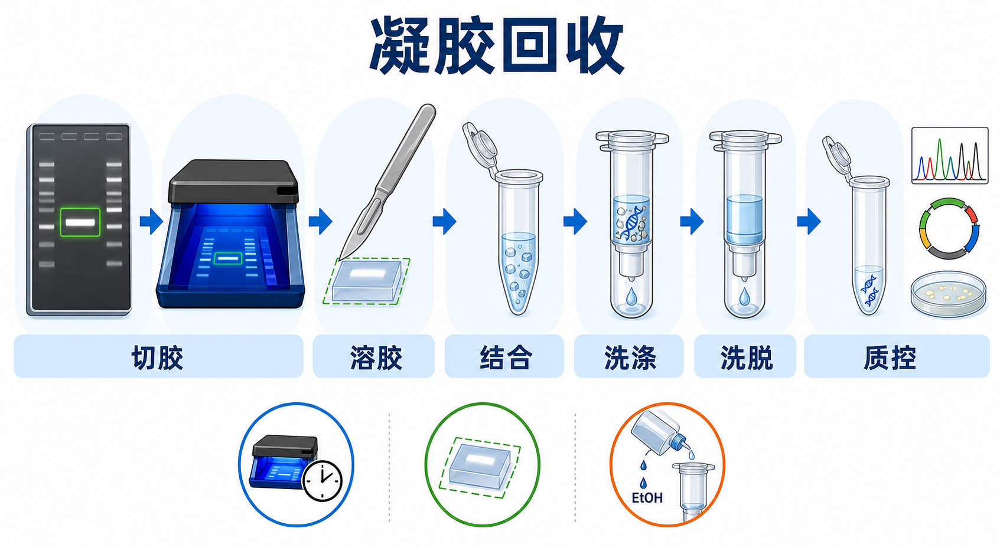
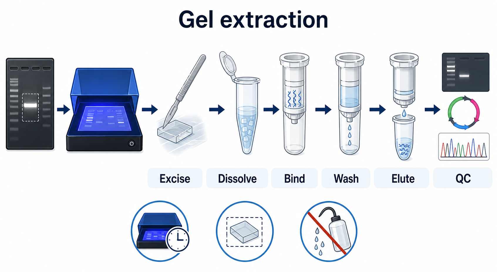

# 凝胶回收

Gel extraction（凝胶回收，常简称胶回收）是从 [琼脂糖凝胶电泳](琼脂糖凝胶电泳.md) 后的目标 DNA 条带中切下凝胶块，并用 [DNA凝胶回收试剂盒](<../材(实验耗材工具篇)/DNA凝胶回收试剂盒.md>) 或其他核酸纯化策略回收目标片段的实验。它的目的不是“看见 DNA”，而是把正确大小的 DNA 从引物、非特异条带、酶、盐、染料和琼脂糖中分离出来，用于后续克隆、连接、测序或建库。





一句话理解：先用凝胶把目标 DNA 片段按大小分开，再只切下目标条带，用离液盐溶解凝胶并让 DNA 结合到硅胶膜，洗去杂质后洗脱得到相对纯净的 DNA。

## 实验发明历史与背景

Gel extraction 的基础来自两个技术模块的结合：第一是 agarose gel electrophoresis（琼脂糖凝胶电泳）对 DNA 片段的大小分离，第二是 silica membrane spin column purification（硅胶膜离心柱纯化）对核酸的选择性吸附和洗脱。

早期的 DNA 胶回收常使用电洗脱、低熔点琼脂糖、玻璃粉或有机抽提等方法，步骤更长、回收率更不稳定，也更依赖操作者经验。现代实验室最常见的是商业化硅胶膜柱 kit：在 chaotropic salt（[离液盐](../番外/补充知识/离液盐.md)）和合适 pH 条件下，DNA 会结合到硅胶膜上；随后用含乙醇的洗涤液去除盐、染料和小分子杂质，最后用低盐 buffer 或水洗脱 DNA。QIAGEN 的 QIAquick Gel Extraction Kit、NEB 的 Monarch DNA Gel Extraction Kit、Thermo Fisher 的 GeneJET Gel Extraction Kit 和 Zymo Research 的 Zymoclean Gel DNA Recovery Kit 都采用这类逻辑。参考：[QIAGEN QIAquick Gel Extraction Kit](https://www.qiagen.com/us/products/discovery-and-translational-research/dna-rna-purification/dna-purification/dna-clean-up/qiaquick-gel-extraction-kit)、[NEB Monarch DNA Gel Extraction Kit](https://www.neb.com/en-us/products/t1020-monarch-dna-gel-extraction-kit)、[Thermo Fisher GeneJET Gel Extraction Kit](https://www.thermofisher.com/order/catalog/product/K0691)、[Zymo Research Zymoclean Gel DNA Recovery Kit](https://www.zymoresearch.com/products/zymoclean-gel-dna-recovery-kit)。

胶回收看起来是一个“切出来再纯化”的小步骤，但它常常决定后续 cloning（克隆）、ligation（[连接反应](连接反应.md)）、Sanger sequencing（[Sanger测序](Sanger测序.md)/一代测序）或 next-generation sequencing library construction（[测序文库构建](测序文库构建.md)）的成败。尤其是当目标条带很弱、非特异条带很多、片段很短或很长时，胶回收的损失和污染会被后续实验放大。

## 应用场景

- 从 [PCR](PCR.md) 产物中分离正确大小条带，去除非特异条带、引物二聚体和残余引物。
- 从 [限制性内切酶酶切](限制性内切酶酶切.md) 产物中分离载体骨架或插入片段，用于 [连接反应](连接反应.md)、[Gibson assembly（Gibson 组装）](Gibson组装.md) 或其他克隆策略。
- 回收目标 DNA 片段用于 [Sanger测序](Sanger测序.md)、探针制备、in vitro transcription（[体外转录](体外转录.md)）模板或 [测序文库构建](测序文库构建.md)。
- 从多个相近片段中选择唯一正确大小的片段。
- 在 PCR 体系背景较复杂、直接 [PCR产物纯化](PCR产物纯化.md) 无法去除错误片段时，作为更强的片段选择步骤。

不适合的情况也很重要：

- 如果 PCR 只有单一清晰条带，通常优先用 PCR product purification（PCR 产物纯化）或磁珠纯化，损失更小、速度更快。
- 如果目标 DNA 极低量，胶回收可能损失明显，需要尽量减少胶块体积并选择高回收率 kit。
- 如果目标片段很长，UV 暴露、机械剪切和过度加热都可能造成断裂，应使用更温和条件。

## 实验目的

凝胶回收的核心目标有三层：

- 尺寸选择：只保留与目标大小一致的 DNA 片段。
- 去除污染：去除引物、dNTP、盐、酶、染料、琼脂糖和非目标 DNA。
- 保持可用性：让回收 DNA 能继续参与酶切、连接、[细菌转化](细菌转化.md)、PCR、测序或建库。

所以判断胶回收是否成功，不能只看浓度。更重要的是：目标片段大小是否正确，回收 DNA 是否足够纯，残留盐/乙醇/胍盐是否低到不会抑制下游反应。

## 简要实验原理

常规硅胶膜柱胶回收可以拆成四个原理点。

### 凝胶分离

DNA（deoxyribonucleic acid，脱氧核糖核酸）带负电，在电场中向阳极移动；琼脂糖凝胶提供孔径筛分，小片段迁移更快，大片段迁移更慢。目标条带与非目标条带分开后，操作者可以切下目标区域。参考：[Addgene Agarose Gel Electrophoresis Protocol](https://www.addgene.org/protocols/gel-electrophoresis/)。

### 溶胶

切下的凝胶块需要在含离液盐的 binding buffer 中加热溶解。离液盐可以破坏水合结构和蛋白/多糖相互作用，使琼脂糖融化并创造 DNA 结合硅胶膜的高盐环境。不同 kit 对胶块重量、buffer 体积、温度和时间的要求不同，必须按说明书调整。QIAGEN 的 QIAquick 系统常按凝胶重量加入约 3 倍体积 Buffer QG，并在 50°C 左右溶胶；部分条件还会建议加入异丙醇以改善小片段回收。参考：[QIAGEN QIAquick Gel Extraction Kit](https://www.qiagen.com/us/products/discovery-and-translational-research/dna-rna-purification/dna-purification/dna-clean-up/qiaquick-gel-extraction-kit)。

### 硅胶膜结合

在高盐条件下，DNA 可以结合到 silica membrane（硅胶膜）上；这也是 [硅胶膜柱纯化](../番外/补充知识/硅胶膜柱纯化.md) 的核心。凝胶杂质、染料、小分子和部分盐分随后通过离心和洗涤被去除。

### 洗涤、干燥和洗脱

洗涤液通常含 ethanol（乙醇），用于维持 DNA 结合并去除盐和杂质。洗涤后必须充分 dry spin（空转干燥），否则残留乙醇会抑制 ligase、polymerase、restriction enzyme 等下游酶反应。最后用低盐 elution buffer（[洗脱缓冲液](<../材(实验耗材工具篇)/洗脱缓冲液.md>)）或 nuclease-free water（[无核酸酶水](<../材(实验耗材工具篇)/无核酸酶水.md>)）洗脱 DNA。

## 所需试剂、耗材和设备

| 类别 | 常用内容 | 作用 | 注意事项 |
|---|---|---|---|
| 上游分离 | 琼脂糖凝胶、[TAE缓冲液](<../材(实验耗材工具篇)/TAE缓冲液.md>) 或 [TBE缓冲液](<../材(实验耗材工具篇)/TBE缓冲液.md>)、[DNA Ladder](<../材(实验耗材工具篇)/DNA Ladder.md>) | 分离并定位目标条带 | 胶回收常优先 TAE；小片段分辨可考虑 TBE |
| 核酸染料 | [GelGreen](<../材(实验耗材工具篇)/GelGreen.md>)、[GelRed](<../材(实验耗材工具篇)/GelRed.md>)、[SYBR Safe](<../材(实验耗材工具篇)/SYBR Safe.md>)、[EB](<../材(实验耗材工具篇)/EB.md>) | 让 DNA 条带可视化 | 用于克隆时尽量选择蓝光兼容染料并减少曝光 |
| 成像切胶 | [蓝光切胶台](<../材(实验耗材工具篇)/蓝光切胶台.md>) 或 [凝胶成像系统](<../材(实验耗材工具篇)/凝胶成像系统.md>)、干净刀片 | 定位并切下目标条带 | 蓝光通常比短波 UV 更适合保护 DNA |
| 纯化试剂 | DNA 凝胶回收试剂盒、binding buffer、wash buffer、elution buffer | 溶胶、结合、洗涤和洗脱 DNA | 不同 kit 的 buffer 体积和片段范围不可混用记忆 |
| 消耗品 | 1.5 mL/2 mL [离心管](<../材(实验耗材工具篇)/离心管.md>)、硅胶膜离心柱、收集管、枪头 | 承载样本和离心纯化 | 使用无核酸酶耗材，避免交叉污染 |
| 辅助试剂 | [异丙醇](<../材(实验耗材工具篇)/异丙醇.md>)、[无水乙醇](<../材(实验耗材工具篇)/无水乙醇.md>)、无核酸酶水 | 促进结合、配制洗涤液或洗脱 | wash buffer 常需首次使用前补加乙醇 |
| 质控设备 | [Qubit荧光计](<../材(实验耗材工具篇)/Qubit荧光计.md>)、[微量紫外分光光度计](<../材(实验耗材工具篇)/微量紫外分光光度计.md>)、电泳系统 | 测浓度、纯度和片段大小 | 低浓度样本优先 Qubit；NanoDrop 易被盐和胍盐影响 |

## 实验设计

### 什么时候选择凝胶回收

如果目标是“去除所有非目标大小片段”，凝胶回收是合理选择；如果目标只是“去除引物、酶、dNTP 和盐”，PCR 产物纯化、[PCR纯化试剂盒](<../材(实验耗材工具篇)/PCR纯化试剂盒.md>) 或 [磁珠纯化](../番外/补充知识/磁珠纯化.md) 通常更合适。

| 情况 | 更推荐 | 原因 |
|---|---|---|
| PCR 单一清晰条带 | PCR 产物纯化或磁珠纯化 | 回收率更高，操作更快 |
| PCR 有明显非特异条带 | 凝胶回收 | 可以按大小选择目标片段 |
| 需要回收酶切后的载体骨架 | 凝胶回收 | 可去除小片段和未切完全产物 |
| 需要保留所有 DNA 片段 | 不适合凝胶回收 | 切胶会主动丢弃非目标区域 |
| 下游是高效率克隆 | 凝胶回收或柱纯化，取决于条带复杂度 | 需要兼顾片段正确性和 DNA 活性 |

### 胶浓度和跑胶条件

胶浓度要让目标条带与邻近杂带分开，而不是只追求跑得快。目标片段越小，通常需要更高胶浓度；目标片段越大，通常需要更低胶浓度。用于胶回收时，不建议把胶跑得过热、过久或过薄，因为过热会导致条带扩散，过久会增加 DNA 损伤和回收损失。

### 成像方式和染料选择

用于胶回收的 DNA 要尽量少受光损伤。短波 UV 对 DNA 损伤更明显，会降低后续克隆和转化效率；蓝光系统和蓝光兼容染料通常更适合制备性胶回收。Thermo Fisher 的 SYBR Safe 资料也将其定位为 ethidium bromide（溴化乙锭）的更安全替代染料，并可用蓝光或 UV 激发。参考：[Thermo Fisher SYBR Safe DNA Gel Stain](https://www.thermofisher.com/us/en/home/life-science/dna-rna-purification-analysis/nucleic-acid-gel-electrophoresis/dna-stains/sybr-safe.html)。

### 胶块大小

切胶时只切目标条带附近的最小胶块。胶块越大，需要的 binding buffer 越多，盐和琼脂糖负担越大，柱子更容易堵，最终 DNA 浓度也更低。

经验判断：

- 条带清楚时，沿条带边缘切，不要带太多空白胶。
- 条带很弱时，宁可优化 PCR 或上样量，也不要把一大片胶都切下来。
- 多个相近条带时，降低曝光时间，精准切取目标条带，必要时重新跑更高分辨率胶。

### 选择 kit 和厂商

不同厂商的胶回收 kit 在片段范围、回收率、洗脱体积、柱容量、是否兼容低熔点胶、是否可同时做 PCR clean-up 等方面不同。

| 厂商/品牌 | 适合关注点 | 备注 |
|---|---|---|
| [QIAGEN](../番外/试剂厂商/Qiagen.md) QIAquick Gel Extraction Kit | 经典通用，文献和实验室 SOP 中很常见 | 适合需要稳定、可追溯流程的常规克隆 |
| [NEB](../番外/试剂厂商/NEB.md) Monarch DNA Gel Extraction Kit | 分子克隆生态衔接好 | 与 NEB 酶切、连接、assembly workflow 搭配方便 |
| [Thermo Scientific](<../番外/试剂厂商/Thermo Scientific.md>) GeneJET Gel Extraction Kit | 常规成本和供应便利 | 与 Thermo Fisher 体系耗材和仪器衔接方便 |
| [Promega](../番外/试剂厂商/Promega.md) Wizard SV Gel and PCR Clean-Up System | 胶回收和 PCR clean-up 双用途 | 适合想减少 kit 类型的实验室 |
| [Zymo Research](<../番外/试剂厂商/Zymo Research.md>) Zymoclean Gel DNA Recovery Kit | 快速流程和小量 DNA 回收场景 | 需要按目标片段范围和洗脱体积确认 |
| [Takara](../番外/试剂厂商/Takara.md) 胶回收相关产品 | 国内实验室常见供应链 | 适合常规克隆和 PCR 片段纯化 |

购买时不要只看“回收率”宣传值，还要看目标片段范围、最小洗脱体积、最大胶块量、是否需要额外补乙醇、是否适合你的下游实验。

## 实验操作

下面以硅胶膜柱 kit 为主线。不同 kit 的 buffer 名称和离心条件不同，正式实验必须以当前 lot 对应说明书为准。

### 跑胶和定位条带

做法：

- 按目标片段大小选择合适琼脂糖浓度和 DNA ladder。
- 上样时记录 lane map，避免后续切错泳道。
- 用尽可能短的曝光时间定位目标条带。
- 如果目标用于克隆，优先使用蓝光切胶台或长波 UV，并减少照射时间。

为什么重要：

胶回收的第一步决定了目标片段是否真实、单一、可切。跑胶分辨率不够时，后面再怎么纯化也无法区分目标和非目标 DNA。

注意事项：

- 条带太近时，不要勉强切；可以提高胶浓度、降低电压、延长跑胶距离后重跑。
- DNA ladder 过亮不等于样本足够；目标条带很弱时后续回收量可能极低。
- UV 照射时间越长，DNA 损伤风险越高，克隆效率可能下降。

替代方案：

- 单一 PCR 条带可直接 PCR 纯化。
- 目标片段太弱时，先优化 PCR、增加模板量或合并多个 PCR 反应，再做胶回收。
- 片段很短时，可以考虑磁珠 size selection 或 PAGE 纯化。

### 切胶

做法：

- 戴手套并使用干净刀片或一次性手术刀。
- 在蓝光或低强度光源下迅速切下目标条带。
- 尽量只保留包围条带的最小胶块。
- 将胶块放入预先称重或已知重量的离心管中。

为什么重要：

多切一倍胶，不会多得到一倍 DNA，反而会增加琼脂糖和盐负担，降低最终浓度。切错条带则会把错误片段带入后续克隆或测序。

注意事项：

- 不同样本之间换刀片或彻底清洁，避免交叉污染。
- 不要把 ladder 条带误切为样本条带。
- 如果条带很亮，切条带中心区域即可；如果条带弥散，需要重新优化上游反应。

可能出错导致的结果：

- 胶块太大：柱子堵塞、洗脱浓度低、盐残留高。
- 光照太久：连接或转化效率下降。
- 切到非特异条带：测序峰图混乱、克隆阳性率低。

### 称重和溶胶

做法：

- 记录胶块重量。
- 按 kit 说明加入对应体积 binding buffer。
- 在 50-60°C 左右加热并间歇混匀，直到胶块完全溶解。
- 若说明书要求，可加入异丙醇以改善特定片段大小的结合效率。

为什么重要：

胶块重量决定 buffer 体积。binding buffer 太少会导致胶不完全溶解或 DNA 结合条件不足；太多会稀释样本并增加后续离心负担。NEB 和 QIAGEN 等官方 protocol 都强调按胶重量加入相应体积的溶胶/结合缓冲液，并确保胶完全溶解后再上柱。参考：[NEB Monarch DNA Gel Extraction Kit Protocol](https://www.neb.com/en-us/products/t1020-monarch-dna-gel-extraction-kit)、[QIAGEN QIAquick Gel Extraction Kit](https://www.qiagen.com/us/products/discovery-and-translational-research/dna-rna-purification/dna-purification/dna-clean-up/qiaquick-gel-extraction-kit)。

注意事项：

- 不要让胶块长期高温孵育，尤其是大片段 DNA。
- 溶胶后若仍有可见胶块，会降低回收率并堵柱。
- 某些 buffer 含 pH 指示剂，颜色异常时可能需要按说明调 pH。

替代方案：

- 胶块过大时分装到多个柱子，而不是强行塞进一个柱。
- 超低量 DNA 可减少最终洗脱体积，但不能低于 kit 推荐范围太多。

### DNA 结合硅胶膜

做法：

- 将完全溶解的样本转移到硅胶膜离心柱。
- 按说明离心，让 DNA 结合膜上。
- 倒掉流穿液，必要时重复上样直到全部样本通过柱子。

为什么重要：

在高盐环境下 DNA 与硅胶膜结合；如果胶没有完全溶解、盐浓度不合适或柱容量超载，DNA 会随流穿液丢失。

注意事项：

- 不要让柱膜接触枪头造成破损。
- 样本体积超过柱容量时分次上柱。
- 如果怀疑目标 DNA 很低量，可保留流穿液，必要时再次上柱或检查损失。

可能出错导致的结果：

- 柱子堵塞：离心后液体残留，回收率低。
- 上样液条件不对：DNA 不结合，流穿液中仍有大量目标 DNA。
- 混入琼脂糖颗粒：流速慢，盐和杂质残留增加。

### 洗涤和干燥

做法：

- 加入 wash buffer，按说明离心。
- 倒掉流穿液。
- 进行额外 dry spin，去除膜上的残留乙醇。

为什么重要：

洗涤不足会留下盐、离液盐、染料和琼脂糖残留；干燥不足会留下乙醇。两者都会抑制后续 PCR、酶切、连接、转化或建库。

注意事项：

- 很多 wash buffer 第一次使用前需要加入无水乙醇，必须在瓶身标记“已加乙醇”和日期。
- 倒流穿液时避免液体碰到柱底。
- 不要为了“快”省略 dry spin。

可能出错导致的结果：

- 忘记给 wash buffer 加乙醇：盐洗不干净，后续反应失败。
- 乙醇残留：连接失败、PCR 抑制、NanoDrop 读数异常。
- 干燥过度且长时间暴露：极低量 DNA 洗脱效率可能下降。

### 洗脱

做法：

- 将柱子放入新的无核酸酶离心管。
- 在膜中央加入 elution buffer 或无核酸酶水。
- 室温孵育 1-5 min 后离心洗脱。
- 若需要更高回收率，可进行第二次洗脱；若需要高浓度，可减少洗脱体积但不要低于说明书建议太多。

为什么重要：

洗脱体积决定最终浓度和总回收量。小体积能提高浓度，但可能牺牲回收率；大体积能提高总回收量，但浓度更低。

注意事项：

- 洗脱液要加在膜中央，不要贴管壁加入。
- 如果下游是酶反应，通常用低盐 buffer 或水均可；如果需要长期保存，Tris-based elution buffer 更稳定。
- EDTA（ethylenediaminetetraacetic acid，乙二胺四乙酸）过高可能影响某些金属离子依赖酶反应，需根据下游用途选择。

### 质控和保存

做法：

- 用 Qubit 或同类荧光法测 DNA 浓度，低浓度样本尤其推荐。
- 可用 NanoDrop 粗看 A260/A280 和 A260/A230，但不要只凭 NanoDrop 判断回收成功。
- 取少量样本跑胶，确认条带大小和是否有拖尾。
- 短期 4°C 保存，长期 -20°C 保存。

为什么重要：

胶回收样本常常浓度低，且可能残留盐、胍盐或乙醇。NanoDrop 会把游离核苷酸、盐和污染物的吸收一起读入，容易高估 DNA；Qubit 对双链 DNA 更特异。

## 结果解析

### 理想结果

- 回收 DNA 在胶上显示单一目标条带。
- 浓度满足下游实验需求。
- A260/A280 大致接近 1.8，A260/A230 不应明显偏低。
- 下游连接、PCR、测序或建库反应正常。

### 正常但需要理解的结果

- 回收率低于 PCR 纯化：正常，因为切胶、溶胶、结合和洗脱都会损失 DNA。
- 大片段回收率低：大片段扩散慢、易剪切、结合和洗脱更困难。
- 小片段回收率低：小片段与硅胶膜结合效率和洗涤损失更敏感，需要使用兼容范围明确的 kit。
- NanoDrop 浓度高但 Qubit 低：可能有盐、胍盐、染料或小分子污染。

## 异常结果与 troubleshooting

| 异常结果 | 可能原因 | 调整策略 |
|---|---|---|
| 几乎无 DNA | 条带本来很弱；切错条带；DNA 未结合柱；洗脱体积过大 | 增加上游 PCR 产物量；重新确认 lane map；保留流穿液检查；减少洗脱体积 |
| 回收率低 | 胶块太大；溶胶不完全；片段超出 kit 最佳范围；洗脱时间太短 | 精准切胶；延长溶胶到完全澄清；换适合片段范围的 kit；温热洗脱液并延长孵育 |
| 下游连接失败 | UV 损伤；乙醇残留；盐/胍盐残留；DNA 末端被破坏 | 使用蓝光或短曝光；增加 dry spin；重新柱纯化；检查酶切和末端设计 |
| 测序峰图混乱 | 切入非特异条带；混合 PCR 产物；模板量不合适 | 重跑高分辨率胶；精准切单一条带；优化 Sanger 模板量 |
| 柱子堵塞 | 胶未完全溶解；胶块太大；琼脂糖浓度太高 | 继续加热混匀至完全溶解；分柱上样；减少切胶体积 |
| A260/A230 很低 | 胍盐、盐或有机物残留 | 增加洗涤和干燥；重新纯化；避免带入流穿液 |
| A260/A280 异常 | 浓度太低导致读数不稳；蛋白/酚污染；pH 或 buffer 影响 | 用 Qubit 复核；重新纯化；更换洗脱 buffer |
| 胶上有 smear | 上游 DNA 降解；跑胶过热；UV 暴露过久；上样过量 | 优化上游反应；降低电压；缩短曝光；减少上样量 |

## 与相似方法对比

| 方法 | 核心逻辑 | 优点 | 局限 | 适合场景 |
|---|---|---|---|---|
| 凝胶回收 | 先按大小分离，再切出目标条带 | 可以去除错误大小片段 | 回收率较低，耗时，DNA 可能受光损伤 | 非特异条带多、酶切片段分离、克隆前尺寸选择 |
| PCR 产物纯化 | 不跑胶或只验证后直接柱纯化 PCR 体系 | 快、损失小 | 不能去除同体系中相近大小错误片段 | 单一清晰 PCR 条带 |
| 磁珠纯化 | DNA 与磁珠按 PEG/盐条件结合，可调 size selection | 通量高、自动化友好、可做片段选择 | 参数敏感，成本较高 | 建库、批量样本、PCR clean-up |
| ethanol precipitation（[乙醇沉淀](../番外/补充知识/乙醇沉淀.md)） | 乙醇和盐使 DNA 沉淀 | 便宜，可处理较大体积 | 小量 DNA 损失大，盐残留风险高 | 浓缩 DNA、换 buffer |
| 低熔点胶直接处理 | 用低熔点琼脂糖减少提取压力 | 温和，适合部分特殊反应 | 兼容性有限，背景杂质可能影响下游 | 特殊克隆或历史方案 |

## 推荐记录模板

### 中文记录模板

```text
实验日期：
样本名称：
上游反应类型：PCR / 酶切 / 其他
目标片段大小：
琼脂糖浓度：
运行缓冲液：TAE / TBE
核酸染料：
成像方式：蓝光 / 长波 UV / 短波 UV
曝光时间：
切胶重量：
胶回收 kit：
厂家：
货号：
批号：
binding buffer 体积：
是否加入异丙醇：
洗脱液类型：
洗脱体积：
Qubit 浓度：
NanoDrop A260/A280：
NanoDrop A260/A230：
回收后条带检查：
下游用途：
异常和处理：
```

### English record template

```text
Date:
Sample ID:
Upstream reaction: PCR / restriction digestion / other
Expected fragment size:
Agarose percentage:
Running buffer: TAE / TBE
DNA stain:
Imaging mode: blue light / long-wave UV / short-wave UV
Exposure time:
Gel slice weight:
Gel extraction kit:
Manufacturer:
Catalog number:
Lot number:
Binding buffer volume:
Isopropanol added:
Elution buffer:
Elution volume:
Qubit concentration:
NanoDrop A260/A280:
NanoDrop A260/A230:
Post-extraction gel check:
Downstream application:
Issues and actions:
```

## 实际操作建议

- 克隆用 DNA：优先蓝光切胶、少量胶块、短时间曝光、充分 dry spin。
- 测序用 DNA：重点保证单一条带和无盐/乙醇残留。
- 建库用 DNA：按建库 kit 对片段大小、体积和 buffer 的要求选择回收方式，必要时用磁珠 size selection 替代胶回收。
- 极低量 DNA：不要只依赖 NanoDrop；优先用 Qubit 或再次跑胶确认。
- 初学者最常见错误：胶块切太大、忘记 wash buffer 加乙醇、没有 dry spin、洗脱液没有加到膜中央。

## 小结

凝胶回收的本质是“尺寸选择 + 核酸纯化”。它比 PCR 产物纯化更能去除错误大小片段，但代价是回收损失、操作时间和 DNA 损伤风险更高。真正做好胶回收的关键不是某一个离心时间，而是从上游跑胶开始就控制变量：条带要分开，光照要短，胶块要小，溶胶要完全，洗涤和干燥要充分，洗脱要服务于下游用途。

## 参考来源

- QIAGEN. QIAquick Gel Extraction Kit. https://www.qiagen.com/us/products/discovery-and-translational-research/dna-rna-purification/dna-purification/dna-clean-up/qiaquick-gel-extraction-kit
- NEB. Monarch DNA Gel Extraction Kit. https://www.neb.com/en-us/products/t1020-monarch-dna-gel-extraction-kit
- Thermo Fisher Scientific. GeneJET Gel Extraction Kit. https://www.thermofisher.com/order/catalog/product/K0691
- Zymo Research. Zymoclean Gel DNA Recovery Kit. https://www.zymoresearch.com/products/zymoclean-gel-dna-recovery-kit
- Promega. Wizard SV Gel and PCR Clean-Up System. https://www.promega.com/products/nucleic-acid-extraction/dna-cleanup/wizard-sv-gel-and-pcr-clean_up-system/
- Addgene. Agarose Gel Electrophoresis Protocol. https://www.addgene.org/protocols/gel-electrophoresis/
- Thermo Fisher Scientific. SYBR Safe DNA Gel Stain. https://www.thermofisher.com/us/en/home/life-science/dna-rna-purification-analysis/nucleic-acid-gel-electrophoresis/dna-stains/sybr-safe.html
