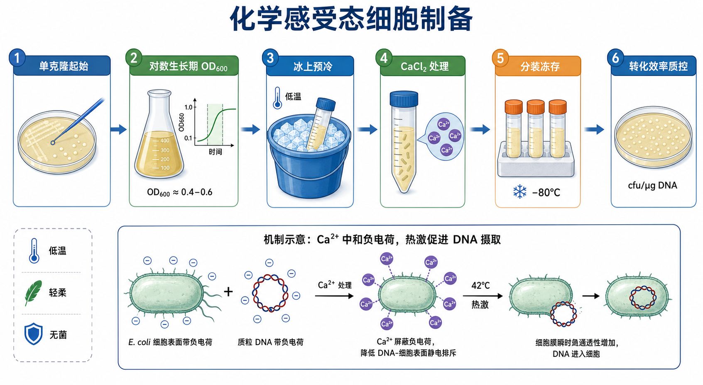

# 化学感受态细胞制备

化学感受态细胞制备（preparation of chemically competent cells / chemical competence preparation，化学感受态细胞制备）是把 Escherichia coli（E. coli，大肠杆菌）克隆菌株处理成能够接受外源[质粒DNA](<../材(实验耗材工具篇)/质粒DNA.md>)的[感受态细胞](<../材(实验耗材工具篇)/感受态细胞.md>)的实验流程。它通常服务于后续[细菌转化](<细菌转化.md>)，尤其是普通 heat-shock transformation（热激转化 / 化学转化），是分子克隆中“自己大批量制备低成本感受态”的基础技能。

## 实验发明历史

化学感受态的历史可以追溯到 Mandel 和 Higa 在 1970 年提出的 calcium-dependent DNA uptake（钙依赖 DNA 摄取）现象：E. coli 经过 calcium chloride（CaCl2，[氯化钙](<../材(实验耗材工具篇)/氯化钙.md>)）处理后，可以更容易接受噬菌体 DNA。这个发现后来被分子克隆体系吸收，成为 CaCl2 法制备感受态和热激转化的源头之一。参考：[Mandel and Higa, Journal of Molecular Biology, 1970](https://doi.org/10.1016/0022-2836(70)90051-3)。

Hanahan 在 1983 年系统评估了影响 E. coli 质粒转化概率的因素，强调培养状态、阳离子组合、DMSO 和 DTT 等条件都可能显著影响转化效率。后来 Inoue、Nojima 和 Okayama 在 1990 年提出了更高效率的 Inoue method（Inoue 法 / RbCl 法），用 SOB 培养基、低温培养和多离子转化缓冲液提高感受态效率，尤其适合对克隆复杂度要求更高的场景。参考：[Hanahan, Journal of Molecular Biology, 1983](https://pubmed.ncbi.nlm.nih.gov/6345791/)、[Inoue et al., Gene, 1990](https://pubmed.ncbi.nlm.nih.gov/2265755/)。

今天的商业 competent cells（感受态细胞）已经把菌株背景、培养条件、处理缓冲液、分装冻存和 transformation efficiency（转化效率）质控标准化。实验室自制感受态仍然很有价值：成本低、可以大量分装、方便教学和常规克隆；但如果是文库构建、低量连接产物、大质粒或高失败成本实验，商业高效感受态通常更稳。

## 应用场景

| 场景 | 为什么自制化学感受态 | 关键关注点 |
|---|---|---|
| 常规质粒扩增 | 成本低，普通效率通常够用 | 菌株纯度、冻存稳定性、抗性匹配 |
| [连接反应](<连接反应.md>)产物转化 | 可以一次制备很多管，方便筛克隆 | 效率要稳定，最好有阳性对照 |
| 教学实验 | 便宜、直观，便于理解转化原理 | 流程可重复，失败也能解释原因 |
| 大量普通克隆项目 | 不必每次购买商业感受态 | 批次记录和转化效率质控 |
| 中等难度克隆 | 可用 Inoue/RbCl 法提高效率 | OD600、低温、缓冲液 pH 和冻存 |
| 文库构建或低量 DNA | 自制普通 CaCl2 感受态常常不够 | 优先考虑高效商业感受态或[细菌电转化](<细菌电转化.md>) |

## 实验目的

这个实验的目的不是“把细菌养出来”，而是获得一批状态一致、可冻存、可复现、已知转化效率的感受态细胞。具体目标包括：

- 让克隆菌株在合适生长期进入较容易接受 DNA 的状态。
- 用低温和二价/多价阳离子处理细胞，降低 DNA 与细胞表面的静电排斥。
- 将处理后的细胞分装为单次使用量，减少反复冻融造成的效率下降。
- 用标准质粒进行质控，确认该批细胞是否适合普通质粒扩增、连接产物转化或更复杂克隆。

## 简要实验原理

### 对数生长期决定细胞是否“容易被处理”

细菌培养并不是任何时候都适合做感受态。处于 [log phase（对数生长期）](<../番外/补充知识/对数生长期.md>)的细胞代谢活跃、群体状态相对一致，通常比 stationary phase（稳定期）或过夜老菌更容易被制备成高效感受态。Thermo Fisher 的 bacterial transformation workflow 也强调，制备感受态时需要监测 [OD600](<../番外/补充知识/OD600.md>)（optical density at 600 nm，600 nm 光密度），并在 mid-log phase（中对数生长期）收获细胞；具体最佳 OD600 取决于菌株、培养体积和 protocol。参考：[Thermo Fisher Scientific: Bacterial Transformation Workflow](https://www.thermofisher.com/us/en/home/life-science/cloning/cloning-learning-center/invitrogen-school-of-molecular-biology/molecular-cloning/transformation/bacterial-transformation-workflow.html)。

如果菌太嫩，细胞量不足且对处理不稳定；如果菌过老，细胞膜状态、代谢状态和存活率下降，最终常表现为菌落数少、批次差异大、转化效率不稳定。

### 低温让细胞保持脆弱但不死亡

化学感受态制备几乎全程强调 ice-cold（冰冷）条件。低温的意义不是“让反应更快”，而是让细胞膜处于更容易维持的状态，降低代谢和应激损伤，并减少处理过程中的死亡。收获后的细胞、离心管、缓冲液和离心机都应尽量保持 0-4°C。

这里的矛盾很微妙：我们希望细胞膜变得更容易让 DNA 进入，但又不能把细胞彻底弄死。因此操作要冷、轻柔、快速，并避免涡旋、剧烈吹打和温度反复波动。

### Ca2+ 等阳离子降低 DNA 和细胞表面的排斥

质粒 DNA 和 E. coli 细胞表面都带有大量负电荷，直接靠近并不容易。Ca2+、Mg2+、Mn2+、Rb+ 等 cations（阳离子）可以在一定程度上屏蔽负电荷，使 DNA 更容易靠近细胞表面。Hanahan 1983 年的研究也显示，多种阳离子、DMSO 和 DTT 的组合会影响质粒转化概率。参考：[Hanahan, 1983](https://pubmed.ncbi.nlm.nih.gov/6345791/)。

需要注意的是，化学转化机制不是“Ca2+ 打开一个固定通道”这么简单。更准确的理解是：低温、阳离子、细胞生长期和热激共同改变细胞表面与膜的物理状态，让外源 DNA 有机会进入细胞并最终建立可复制质粒。

### 热激是后续 DNA 摄取的关键步骤

自制化学感受态本身只是把细胞准备好，真正把 DNA 导入细胞通常发生在后续[热激](<../番外/补充知识/热激.md>)（heat shock，热激）转化中。DNA 和感受态细胞先在冰上孵育，随后短暂升温，常见为 42°C 左右，再迅速回到冰上。NEB 的 chemical transformation tips 提到，热激时间和温度与细胞体积、容器和菌株有关，不能机械地认为“热激越久越好”。参考：[NEB: Chemical Transformation Tips](https://www.neb.com/en-us/tools-and-resources/usage-guidelines/chemical-transformation-tips)。

### 甘油和 DMSO 保护冻存，但也会影响细胞状态

自制感受态通常会加入 [glycerol（甘油）](<../材(实验耗材工具篇)/甘油.md>)作为 cryoprotectant（冻存保护剂），帮助细胞在 -80°C 保存时减少冰晶损伤。有些高效方案会加入 [DMSO](<../材(实验耗材工具篇)/DMSO.md>)（dimethyl sulfoxide，二甲基亚砜）改善转化效率或冻存表现，但 DMSO 对细胞也有应激，比例和加入时机要遵循具体 protocol。

## 所需试剂、材料与设备

| 类别 | 常用内容 | 作用 |
|---|---|---|
| 菌株 | DH5α、TOP10、JM109、Stbl 系列等克隆用 E. coli | 作为后续质粒扩增宿主 |
| 培养基 | [LB培养基](<../材(实验耗材工具篇)/LB培养基.md>)、[SOB培养基](<../材(实验耗材工具篇)/SOB培养基.md>) | 培养细菌到合适生长期 |
| 基础盐 | 氯化钙、[氯化镁](<../材(实验耗材工具篇)/氯化镁.md>)、[氯化钾](<../材(实验耗材工具篇)/氯化钾.md>) | 调整离子环境，提高 DNA 靠近细胞表面的机会 |
| 高效方案成分 | [氯化铷](<../材(实验耗材工具篇)/氯化铷.md>)、[氯化锰](<../材(实验耗材工具篇)/氯化锰.md>)、[PIPES](<../材(实验耗材工具篇)/PIPES.md>)、DMSO、[DTT](<../材(实验耗材工具篇)/DTT.md>) | 用于 Hanahan / Inoue / RbCl 类高效感受态方案 |
| 冻存保护 | 甘油，必要时 DMSO | 降低冻存损伤，维持批次可用性 |
| 溶剂与耗材 | [无菌水](<../材(实验耗材工具篇)/无菌水.md>)、[离心管](<../材(实验耗材工具篇)/离心管.md>)、[冻存管](<../材(实验耗材工具篇)/冻存管.md>)、滤芯吸头 | 配液、离心、分装和冻存 |
| 温控设备 | 冰盒或冰桶、预冷[离心机](<../材(实验耗材工具篇)/离心机.md>)、[水浴锅](<../材(实验耗材工具篇)/水浴锅.md>)或金属浴 | 维持低温和后续热激 |
| 质控材料 | 标准超螺旋质粒、SOC 培养基、[抗性平板](<../材(实验耗材工具篇)/抗性平板.md>)、[筛选抗生素](<../材(实验耗材工具篇)/筛选抗生素.md>) | 测定转化效率和批次可用性 |

## 常见配方版本

| 版本 | 典型逻辑 | 优点 | 局限 | 适合场景 |
|---|---|---|---|---|
| [钙氯法](<../番外/补充知识/钙氯法.md>) | 冷 CaCl2 处理细胞，冻存前加甘油 | 便宜、简单、教学友好 | 效率中等，批次差异较大 | 普通质粒扩增、简单克隆 |
| Mg/Ca 组合 | 培养或处理时加入 Mg2+ 与 Ca2+ | 比单纯 CaCl2 更稳 | 配方略复杂 | 常规实验室自制感受态 |
| Hanahan 法 | 多阳离子、DMSO、DTT 等组合 | 效率高于朴素 CaCl2 法 | 配方复杂，对细节敏感 | 中高难度克隆 |
| Inoue / [RbCl法](<../番外/补充知识/RbCl法.md>) | 低温培养 + SOB + RbCl/MnCl2/CaCl2/KCl/PIPES buffer | 可达到较高化学转化效率 | 对 OD、低温和 buffer pH 敏感 | 低量连接产物、cDNA 文库、复杂构建 |
| [TSS法](<../番外/补充知识/TSS法.md>) | Transformation and storage solution，一步处理并冻存 | 快速、省离心步骤 | 效率和稳定性依赖菌株与配方 | 快速教学或普通克隆 |
| 商业感受态 | 厂家标准化制备和质控 | 效率、说明书和批号追踪稳定 | 成本高 | 关键克隆、文库、大质粒、低量 DNA |

## 实验操作

### 选择菌株和方案

**怎么做：**先明确后续用途：普通质粒扩增可选择 DH5α、TOP10、JM109 等常规克隆菌株；含重复序列、慢病毒载体或毒性片段的构建，优先选择稳定性更好的菌株。方案上，普通用途可以用 CaCl2 或 Mg/Ca 组合；若需要更高效率，可考虑 Inoue/RbCl 法；若失败代价很高，直接购买商业高效感受态。

**为什么重要：**感受态效率不只由操作决定，也由菌株基因型、质粒大小、插入片段毒性、复制起点和选择标记共同决定。错误菌株会让后续步骤看起来像“转化失败”，但本质可能是构建不稳定或宿主不兼容。

**注意事项：**制备感受态的菌株应来源清楚、无污染、近期划线复苏。不要从已经转化过未知质粒的菌液随手制备“通用感受态”。

**替代方案：**如果目标是蛋白表达，普通 cloning strain 和 expression strain（表达菌株）要区分。很多表达菌株也能转化，但并不一定适合作为高效克隆筛选宿主。

**出错后果：**菌株混乱会造成无菌落、质粒重排、背景菌落、后续测序异常，甚至抗性和平板完全不匹配。

### 准备新鲜起始培养

**怎么做：**从新鲜平板挑取单克隆，接种到无抗或按菌株要求添加选择压力的培养基中，过夜培养；第二天将过夜菌按比例稀释到新鲜 LB 或 SOB 中扩大培养，并持续监测 OD600。

**为什么重要：**单克隆起始保证菌群来源一致，新鲜扩大培养保证细胞进入对数生长期。感受态制备最怕“随便拿一管老菌液”，因为老菌状态差异会直接变成转化效率差异。

**注意事项：**培养基、摇床温度、通气量和接种比例要记录。若使用 SOB，Mg2+ 和营养条件更适合高效感受态方案；若只是普通 CaCl2 感受态，LB 也常可用。

**替代方案：**Inoue 法常用较低温度培养到合适 OD，以牺牲时间换取更好的细胞状态；普通 CaCl2 法常用 37°C 培养，更快但效率可能较低。

**出错后果：**起始菌不纯会导致批次不可靠；扩大培养过度会使细胞进入稳定期，表现为同样步骤下菌落数显著下降。

### 在合适 OD600 收获细胞

**怎么做：**在中对数生长期收获细胞。很多方案会把 OD600 控制在约 0.4-0.6 或更宽的 0.4-0.9 区间，但最佳点要根据菌株、培养基和具体 protocol 确认。Thermo Fisher 的学习资料指出，mid-log phase 通常是获得较高 transformation efficiency 的关键条件之一。参考：[Thermo Fisher Scientific: Bacterial Transformation Workflow](https://www.thermofisher.com/us/en/home/life-science/cloning/cloning-learning-center/invitrogen-school-of-molecular-biology/molecular-cloning/transformation/bacterial-transformation-workflow.html)。

**为什么重要：**OD600 是制备感受态时最重要的可量化节点之一。它不是为了“看菌有没有长起来”，而是为了把收获时间固定在细胞最容易被处理的窗口。

**注意事项：**不同分光光度计、比色皿、稀释倍数和培养基背景会造成 OD600 差异。记录仪器、稀释倍数和实际读数，比只写“长到合适浓度”有用得多。

**替代方案：**如果没有分光光度计，可以用固定接种比例和培养时间粗略估计，但这会明显降低可重复性；对重要批次不推荐。

**出错后果：**OD 太低会导致细胞量不足；OD 太高会导致细胞过老、批次效率低、冻存后存活率差。

### 快速彻底预冷

**怎么做：**达到目标 OD 后，立即把培养瓶放在冰上预冷，并让离心管、缓冲液、枪头接触的液体环境和离心机尽量保持 0-4°C。后续操作尽量在冰上完成。

**为什么重要：**从收获开始，细胞已经进入“脆弱但要保持活”的状态。低温可以保护细胞、降低代谢应激，并帮助后续阳离子处理形成可转化状态。

**注意事项：**不要把热培养液直接高速离心后再慢慢冷却；不要在室温台面上排队处理大量样本。多瓶培养物可以分批制备，保证每批低温时间一致。

**替代方案：**如果一次处理量很大，宁可分成小批次，也不要让前一批在冰上放太久、后一批还在室温等待。

**出错后果：**温度控制不一致会造成同一批感受态内部效率差异；室温暴露过久会降低转化效率。

### 冷离心收集细胞

**怎么做：**在预冷离心机中温和离心收集细胞，弃上清。离心力和时间按具体 protocol 设置，核心原则是能沉降细胞但尽量减少机械损伤。

**为什么重要：**这一阶段细胞已经很容易被损伤。离心过强、反复重悬或管内温度升高都会影响后续转化效率。

**注意事项：**弃上清时不要把沉淀吸走。细胞沉淀应始终保持冰冷，不要让管壁长时间握在手里。

**替代方案：**有些 TSS 法或快速方案减少离心步骤，以降低操作损伤和节省时间；但效率和批次稳定性需要自己验证。

**出错后果：**离心不够会丢细胞，产量低；离心和重悬过猛会伤细胞，表现为质控转化菌落数低。

### 冰冷阳离子缓冲液处理

**怎么做：**用冰冷 CaCl2 或更复杂的 competence buffer（感受态制备缓冲液）轻柔重悬细胞，冰上孵育。普通 CaCl2 法通常以 Ca2+ 为核心；Inoue/RbCl 法会加入 Mn2+、Rb+、K+ 和 PIPES 等成分来提高效率。

**为什么重要：**阳离子处理是“化学感受态”区别于普通细菌沉淀的核心步骤。它改变细胞表面与 DNA 的相互作用，为后续热激摄取 DNA 打基础。

**注意事项：**缓冲液要无菌、冰冷、pH 正确。Inoue buffer 一类方案对 pH 特别敏感，因为 PIPES 的缓冲状态和金属离子环境会影响效果。过滤除菌比高压灭菌更适合某些含多种离子的缓冲液。

**替代方案：**如果只是日常普通质粒，简单 CaCl2 法足够；如果连接产物量低或阳性率低，可切换到 Mg/Ca 组合或 RbCl/Inoue 法；如果仍然不够，使用商业高效感受态或电转化。

**出错后果：**缓冲液温度偏高、pH 不对、离子配错或细胞重悬不均，都会导致整批感受态效率下降。

### 二次处理、加入冻存保护剂并分装

**怎么做：**许多方案会进行第二次冷离心和重悬，使细胞最终悬浮在含 CaCl2、甘油或 DMSO 的冻存体系中。随后按单次使用量分装到预冷冻存管或离心管中，快速冻结并储存在 -80°C。

**为什么重要：**分装是为了避免反复冻融。Thermo Fisher 的转化学习资料提到，未使用的感受态反复冻融会降低转化效率，因此单次用量分装比“大管冻存反复取用”更可靠。参考：[Thermo Fisher Scientific: Bacterial Transformation Workflow](https://www.thermofisher.com/us/en/home/life-science/cloning/cloning-learning-center/invitrogen-school-of-molecular-biology/molecular-cloning/transformation/bacterial-transformation-workflow.html)。

**注意事项：**加入 DMSO 或甘油后应轻柔混匀，避免起泡和剧烈吹打。不要把细胞长时间放在室温或 4°C 等待冻存。

**替代方案：**若计划很快使用，可保留少量新鲜感受态做当天转化；若需要长期保存，优先 -80°C 小管分装。不要把化学感受态当普通甘油菌反复冻融使用。

**出错后果：**冻存保护不足会降低存活率；冻融次数多会让同一批细胞越来越差；分装体积不一致会影响后续转化条件。

### 批次质控与转化效率计算

**怎么做：**取一管新制备的感受态，用已知高质量 supercoiled plasmid（超螺旋质粒）做阳性转化对照，同时设置 no-DNA control（无 DNA 阴性对照）。按稀释倍数涂板，第二天计数菌落，计算 transformation efficiency。NEB 把转化效率定义为单位 DNA 量可产生的 colony-forming units（cfu，菌落形成单位），常以 cfu/µg DNA 表示。参考：[NEB: Chemical Transformation Tips](https://www.neb.com/en-us/tools-and-resources/usage-guidelines/chemical-transformation-tips)。

**为什么重要：**没有质控的自制感受态只能叫“冻起来的细胞”，不能叫可复现实验材料。质控能告诉你这批细胞适合什么用途：普通扩增、连接产物转化，还是不适合关键克隆。

**注意事项：**用于质控的质粒应干净、超螺旋比例高、抗性与平板一致。不要用连接产物来评价感受态本身，因为连接产物的质量和背景会混入判断。

**替代方案：**如果没有准确 DNA 定量，可以用商业对照质粒或实验室稳定质粒做相对比较，但仍应记录 DNA 量和稀释倍数。

**出错后果：**阳性对照差说明感受态或转化步骤有问题；阴性对照长菌说明污染或平板抗性失效；实验组失败但阳性对照正常，才更应该回查连接、质粒或插入片段本身。

## 结果解析

| 观察结果 | 可能说明什么 | 下一步 |
|---|---|---|
| 阳性对照菌落数稳定，阴性对照无菌落 | 感受态批次可用 | 记录效率，按用途分级 |
| 阳性对照几乎无菌落 | 制备失败、转化步骤失败或平板问题 | 检查 OD、低温、缓冲液、热激和平板 |
| 阴性对照有菌落 | 污染或抗生素失效 | 重做无菌检查，更换平板或抗生素 |
| 新鲜细胞能转化，冻存后效率低 | 冻存保护、冻结速度或分装问题 | 调整甘油/DMSO、快速冻结、减少冻融 |
| 同一批内不同管差异大 | 分装前混匀不均或温度不一致 | 分装前轻柔混匀，缩短分装时间 |
| 普通质粒可转化，连接产物无菌落 | 感受态基本可用，连接或 DNA 质量可疑 | 检查连接反应、载体背景、DNA 量 |
| 菌落很多但后续多为空载体 | 感受态不是问题，克隆筛选背景高 | 回到酶切、去磷酸化、连接比例和筛选策略 |

## 常见异常与 troubleshooting

### 整批转化效率低

最常见原因是收获 OD 不合适、细胞未全程低温、缓冲液配制错误、离心/重悬太粗暴或冻存过程损伤。优先检查 OD600 记录、离心机温度、CaCl2 或 Inoue buffer 的 pH 与保存状态，再检查转化质控步骤是否按同一条件执行。

### 批次之间差异很大

自制感受态的批次差异通常来自起始菌状态、培养时间、OD600 测量、冰上处理时间和冻存速度。解决方法不是只背配方，而是把每个关键变量记录下来：菌株来源、培养基批号、接种比例、OD600、冰上时间、离心条件、最终分装体积、冻结方式和质控效率。

### 冻存后第一次很好，后面越来越差

这通常是反复冻融造成的。感受态细胞应按单次使用量分装，取出后尽量一次用完。Thermo Fisher 资料也指出，反复 freeze-thaw cycles（冻融循环）会明显降低效率。实际工作中，不要为了省一管细胞把一大管反复拿进拿出。

### 连接产物转化表现差

如果标准质粒阳性对照正常，连接产物差不一定是感受态问题。常见原因包括连接失败、载体自连、插入片段末端不兼容、连接体系盐和 PEG 影响、DNA 体积过大、抗性平板错误或插入片段对宿主有毒。NEB 和 Thermo Fisher 的转化建议都强调，DNA 质量、体积和污染物会影响转化结果，关键克隆可考虑纯化连接产物或换更高效感受态。

### 大质粒或低拷贝载体很难转化

质粒越大，化学转化通常越困难；Hanahan 研究也观察到质粒大小会影响转化概率。大质粒、BAC、慢病毒载体或低拷贝载体如果反复失败，应优先考虑电转化、高效商业感受态、稳定宿主菌株和更温和培养条件，而不是简单增加 DNA 量。

### 平板长满背景

如果 no-DNA control 也有菌落，优先怀疑污染、抗生素失效或平板错误。如果只有实验组满板，可能是 DNA 量过高、涂布量过大或未做稀释。对于后续筛克隆，菌落必须足够分散，否则挑到的不是可靠单克隆。

## 与相关方法对比

| 方法 | 核心区别 | 优点 | 局限 | 什么时候选 |
|---|---|---|---|---|
| 自制化学感受态 | 自己制备，热激转化 | 成本低，可大批量 | 批次差异，需要质控 | 常规克隆、教学、普通质粒扩增 |
| 商业化学感受态 | 厂家制备并标定效率 | 稳定、省时间、有说明书 | 成本高 | 关键连接产物、低 DNA 量、赶进度 |
| 自制电感受态 | 低盐洗涤，电转导入 DNA | 效率高，适合复杂样本 | 需要电转仪，怕盐 | 文库、大质粒、低量 DNA |
| 商业电感受态 | 高效且质控完善 | 适合高失败成本实验 | 最贵，对运输储存敏感 | 文库构建、复杂克隆 |
| TSS 一步法 | 处理和冻存合并 | 快、简单 | 效率和稳定性需验证 | 快速普通克隆 |

这几个方法的本质差异在于“效率、成本、稳定性、设备要求”之间取舍。普通克隆可以用自制化学感受态；文库构建不应为了省钱牺牲复杂度；大质粒和低量 DNA 失败多次后，应尽早切换高效商业感受态或电转化。

## 购买与选择建议

如果实验室主要做普通质粒扩增和简单连接，自制化学感受态可以显著降低成本；如果是第一次做新构建，建议同时保留一管商业感受态作为 benchmark（基准对照），用来判断失败来自自制细胞还是来自 DNA/连接体系。

常用商业供应商包括 [NEB](<../番外/试剂厂商/NEB.md>)、[Thermo Fisher Scientific](<../番外/试剂厂商/Thermo Fisher Scientific.md>)、[Takara](<../番外/试剂厂商/Takara.md>)、[Promega](<../番外/试剂厂商/Promega.md>)、[Qiagen](<../番外/试剂厂商/Qiagen.md>)、[Zymo Research](<../番外/试剂厂商/Zymo Research.md>) 和 [碧云天](<../番外/试剂厂商/碧云天.md>)。选择时不要只看“能不能转化”，而要看：

- transformation efficiency 标称值和测定质粒。
- 菌株基因型是否适合构建稳定性。
- 质粒大小、低拷贝、重复序列或毒性片段是否有专门推荐。
- 包装形式是否适合单次使用，能否减少冻融。
- 是否提供 positive control DNA（阳性对照 DNA）和详细 protocol。
- 到货是否全程干冰，收货后是否立即 -80°C 保存。

## 推荐记录模板

### 中文记录模板

| 项目 | 记录内容 |
|---|---|
| 批次编号 | 日期、操作者、菌株 |
| 起始来源 | 新鲜平板、单克隆编号、培养基 |
| 扩大培养 | 培养基、体积、温度、转速、接种比例 |
| 收获状态 | OD600、收获时间、培养时长 |
| 制备方案 | CaCl2、Mg/Ca、Inoue/RbCl、TSS 或其他 |
| 关键缓冲液 | 成分、pH、过滤除菌日期、预冷方式 |
| 离心条件 | 温度、转速/离心力、时间 |
| 冻存体系 | 甘油/DMSO 终浓度、分装体积、冻结方式 |
| 保存位置 | -80°C 盒号、孔位、冻融次数 |
| 质控质粒 | 名称、大小、抗性、DNA 量 |
| 质控结果 | 菌落数、稀释倍数、cfu/µg DNA |
| 适用等级 | 普通扩增、连接转化、高效克隆、不推荐 |

### English Record Template

| Item | Record |
|---|---|
| Batch ID | Date, operator, strain |
| Starting source | Fresh plate, colony ID, medium |
| Expansion culture | Medium, volume, temperature, shaking speed, inoculation ratio |
| Harvest state | OD600, harvest time, culture duration |
| Preparation method | CaCl2, Mg/Ca, Inoue/RbCl, TSS, or other |
| Key buffers | Composition, pH, filtration date, pre-chilling method |
| Centrifugation | Temperature, speed/RCF, time |
| Freezing mixture | Final glycerol/DMSO concentration, aliquot volume, freezing method |
| Storage | -80°C box, position, freeze-thaw cycles |
| QC plasmid | Name, size, antibiotic resistance, DNA amount |
| QC result | Colony number, dilution factor, cfu/µg DNA |
| Use grade | Routine propagation, ligation transformation, high-efficiency cloning, not recommended |

## 参考来源

- [Thermo Fisher Scientific: Bacterial Transformation Workflow](https://www.thermofisher.com/us/en/home/life-science/cloning/cloning-learning-center/invitrogen-school-of-molecular-biology/molecular-cloning/transformation/bacterial-transformation-workflow.html)
- [NEB: Chemical Transformation Tips](https://www.neb.com/en-us/tools-and-resources/usage-guidelines/chemical-transformation-tips)
- [Mandel and Higa, Calcium-dependent bacteriophage DNA infection, Journal of Molecular Biology, 1970](https://doi.org/10.1016/0022-2836(70)90051-3)
- [Hanahan, Studies on transformation of Escherichia coli with plasmids, Journal of Molecular Biology, 1983](https://pubmed.ncbi.nlm.nih.gov/6345791/)
- [Inoue et al., High efficiency transformation of Escherichia coli with plasmids, Gene, 1990](https://pubmed.ncbi.nlm.nih.gov/2265755/)
- [Chemical Transformation of E. coli, Cold Spring Harbor Protocols / PMC](https://pmc.ncbi.nlm.nih.gov/articles/PMC4037286/)
