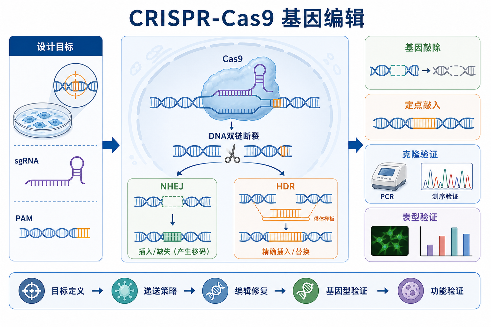
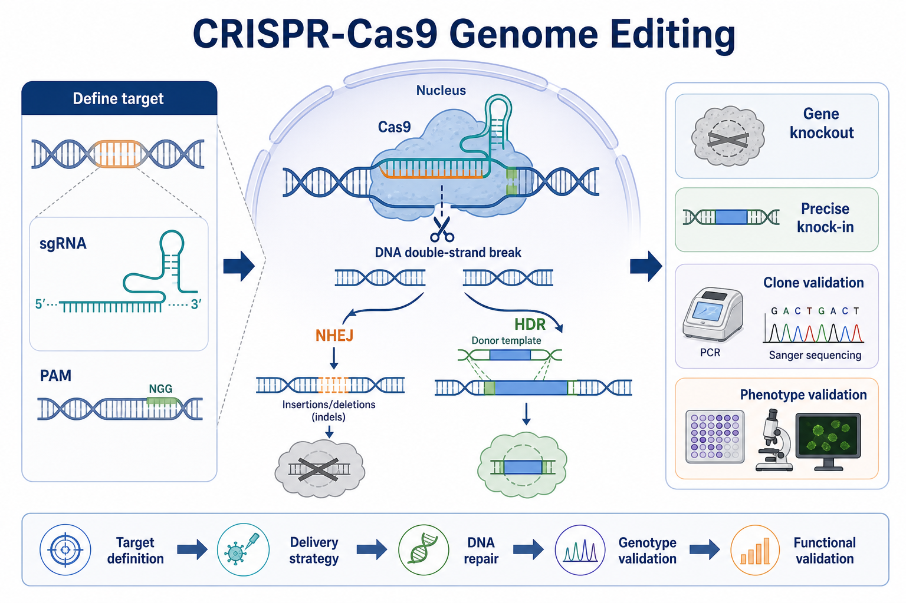

# 基因编辑

Genome editing（基因编辑）是指在细胞或生物体基因组的特定位点引入可预测改变的技术集合。本页以 [CRISPR-Cas9](../番外/补充知识/CRISPR-Cas9.md) 为主线，说明从靶点设计、递送、DNA 修复、克隆筛选到功能验证的完整实验逻辑。



图：CRISPR-Cas9 基因编辑中文概览。Cas9 在 [sgRNA](../番外/补充知识/sgRNA.md) 引导下识别 [PAM序列](../番外/补充知识/PAM序列.md) 附近的靶 DNA，产生 DNA double-strand break（DNA 双链断裂），随后通过 [NHEJ](../番外/补充知识/NHEJ.md) 形成 indel（插入/缺失）实现敲除，或通过 [HDR](../番外/补充知识/HDR.md) 和 donor template（供体模板）实现定点插入/替换。本图由 Image2 / image-generation model 生成，用于个人学习笔记示意。



Figure: English summary abstract graph for CRISPR-Cas9 genome editing. The workflow emphasizes target definition, delivery strategy, DNA repair, genotype validation, and functional validation.

## 实验发明历史

CRISPR（clustered regularly interspaced short palindromic repeats，成簇规律间隔短回文重复序列）最初来自细菌和古菌的适应性免疫系统。Cas9（CRISPR-associated protein 9，CRISPR 相关蛋白 9）是其中一种 RNA-guided nuclease（RNA 引导核酸酶）。

2012 年，Jinek 等证明 Cas9 可以被设计好的 RNA 引导到特定位点切割 DNA，使 CRISPR-Cas9 成为可编程 DNA 内切酶。参考：[Jinek et al., Science, 2012](https://doi.org/10.1126/science.1225829)。2013 年，Cong 等和 Mali 等分别展示 CRISPR-Cas9 可用于哺乳动物/人细胞基因组编辑，推动它成为主流基因编辑工具。参考：[Cong et al., Science, 2013](https://doi.org/10.1126/science.1231143)；[Mali et al., Science, 2013](https://doi.org/10.1126/science.1232033)。

CRISPR-Cas9 之后又衍生出 CRISPRi、CRISPRa、base editing（碱基编辑）、prime editing（先导编辑）等分支。它们都属于广义基因编辑/基因调控工具，但实验目的、是否造成双链断裂、验证方式和安全风险并不完全相同。

## 应用场景

| 场景 | 典型问题 | 常用策略 |
| --- | --- | --- |
| [基因敲除](../番外/补充知识/基因敲除.md) | 某基因是否对表型必需 | Cas9 + sgRNA，依赖 NHEJ 产生 frameshift indel |
| [基因敲入](../番外/补充知识/基因敲入.md) | 是否需要标签、报告基因或点突变 | Cas9 + sgRNA + [供体模板](../番外/补充知识/供体模板.md)，依赖 HDR 或其他插入策略 |
| 功能验证 | 候选基因是否导致观察到的表型 | knockout、rescue、多个 sgRNA 交叉验证 |
| 疾病模型 | 构建突变细胞系或动物模型 | 定点编辑、克隆筛选、测序确认 |
| pooled screen（混池筛选） | 大规模寻找影响表型的基因 | sgRNA library + readout + 测序分析 |
| 基因调控 | 不切 DNA，只抑制或激活表达 | [CRISPRi](../番外/补充知识/CRISPRi.md) / [CRISPRa](../番外/补充知识/CRISPRa.md) |

本页默认讨论研究级细胞模型中的 CRISPR-Cas9 编辑，不包含临床治疗、胚胎/生殖系编辑、病原体增强或任何规避监管的应用。涉及重组 DNA、病毒载体或稳定细胞系构建时，应遵守机构生物安全要求，见 [重组DNA与基因编辑安全](../实验室安全/重组DNA与基因编辑安全.md)。

## 实验目的

CRISPR-Cas9 实验通常不是“把 Cas9 转进去”这么简单，而是围绕一个可验证的遗传问题建立证据链：

- 删除或破坏一个基因，判断其对细胞表型、通路或药物反应是否必要。
- 在特定位点插入标签、报告基因或突变，追踪蛋白定位、表达或功能变化。
- 构建稳定编辑克隆，用于长期机制研究。
- 通过多个独立 sgRNA、救援实验和表型读数减少脱靶或克隆效应造成的误判。

## 简要实验原理

CRISPR-Cas9 的核心组件是 Cas9 蛋白和 sgRNA。sgRNA 通过一段与目标 DNA 互补的序列把 Cas9 带到靶位点；Cas9 同时要求靶序列旁边存在合适 PAM 序列。以常用 SpCas9 为例，PAM 常见形式为 NGG。

Cas9 切割后产生 DNA double-strand break。细胞主要通过两条路径修复：

| 修复方式 | 英文全称 | 结果 | 常见用途 |
| --- | --- | --- | --- |
| NHEJ | non-homologous end joining，非同源末端连接 | 产生随机插入/缺失，即 [indel](../番外/补充知识/indel.md) | 基因敲除 |
| HDR | homology-directed repair，同源定向修复 | 参考供体模板进行定点修改 | 定点敲入、点突变、标签插入 |

所以 CRISPR-Cas9 的实验本质是“设计一次可控切割，再利用细胞自己的修复系统制造目标改变”。真正的难点通常不是 Cas9 能不能切，而是切割后获得哪一种修复结果、是否双等位基因编辑、是否存在 [脱靶效应](../番外/补充知识/脱靶效应.md)，以及最终表型是否能被基因型解释。

## 所需试剂、材料与设备

| 类别 | 例子 | 作用 |
| --- | --- | --- |
| 编辑系统 | Cas9 plasmid、Cas9 mRNA、Cas9 protein、[CRISPR RNP](<../番外/补充知识/CRISPR RNP.md>) | 提供核酸酶和引导 RNA |
| 引导 RNA | sgRNA、crRNA/tracrRNA | 决定靶向位点 |
| 递送材料 | [质粒DNA](<../材(实验耗材工具篇)/质粒DNA.md>)、[脂质体转染试剂](<../材(实验耗材工具篇)/脂质体转染试剂.md>)、[电转仪](<../材(实验耗材工具篇)/电转仪.md>)、[电转杯](<../材(实验耗材工具篇)/电转杯.md>)、[慢病毒载体](<../材(实验耗材工具篇)/慢病毒载体.md>) | 把编辑系统送入细胞 |
| 细胞培养材料 | [培养基](<../材(实验耗材工具篇)/培养基.md>)、[细胞培养板](<../材(实验耗材工具篇)/细胞培养板.md>)、[PBS](<../材(实验耗材工具篇)/PBS.md>) | 维持细胞状态 |
| 筛选系统 | [筛选抗生素](<../材(实验耗材工具篇)/筛选抗生素.md>)、荧光 reporter、FACS | 富集编辑或转染阳性细胞 |
| 验证材料 | PCR 引物、聚合酶、凝胶、测序服务 | 检查目标位点改变 |
| 表型验证 | [RT-qPCR](RT-qPCR.md)、[Western blot](<Western blot.md>)、[免疫荧光](免疫荧光.md)、[流式细胞术](流式细胞术.md) | 证明基因编辑产生预期功能后果 |

## 实验操作

### 定义编辑目标

做什么：先明确是 knockout、knock-in、点突变、标签插入，还是基因表达调控。确定目标基因、目标外显子、细胞类型、读出指标和成功标准。

为什么重要：CRISPR 不是一个统一方案。敲除更偏向选择早期 coding exon 并追求 frameshift；定点敲入则要考虑供体模板、同源臂、插入方向和 HDR 效率；调控表达则可能更适合 CRISPRi/CRISPRa，而不是切断 DNA。

注意事项：不要只以“编辑成功”作为目标。真正要预先定义的是：什么基因型算成功，什么蛋白/转录水平算成功，什么表型可以支持结论。

替代方案：如果只需要短期降低表达，可以先用 RNAi 或 CRISPRi；如果只需要单碱基改变，可考虑 [碱基编辑](../番外/补充知识/碱基编辑.md) 或 [Prime editing](<../番外/补充知识/Prime editing.md>)。

可能出错：目标定义不清会导致后续验证混乱。例如只测到 indel 并不等于蛋白完全缺失；一个 in-frame indel 可能保留功能。

### 设计 sgRNA

做什么：在目标区域选择候选 sgRNA，评估 PAM、on-target score、潜在 off-target、外显子位置、转录本覆盖范围和是否影响关键结构域。

为什么重要：sgRNA 是 CRISPR-Cas9 的导航系统。设计不好可能导致切割效率低、脱靶高、只影响部分 isoform，或产生不影响蛋白功能的 indel。

注意事项：重要实验至少设计多个独立 sgRNA。敲除实验优先考虑共同外显子、早期编码区和功能结构域；敲入实验还要让切口尽量靠近目标插入/替换位点。

替代方案：可使用商业合成 sgRNA、克隆 sgRNA expression vector，或使用 crRNA/tracrRNA 双组分体系。RNP 递送通常表达时间短，脱靶风险相对更容易控制；质粒表达便宜但持续表达时间更长。

可能出错：单一 sgRNA 得到表型，不足以排除脱靶或克隆效应；多个 sgRNA 指向同一基因并得到一致表型，证据更强。

### 选择递送策略

做什么：根据细胞类型、实验目的和验证方式选择 plasmid、mRNA、RNP、慢病毒或其他递送方式。

为什么重要：递送方式决定编辑效率、细胞毒性、Cas9 表达持续时间、是否适合难转染细胞，以及是否涉及病毒载体安全管理。

| 递送方式 | 优势 | 局限 | 适合场景 |
| --- | --- | --- | --- |
| 质粒转染 | 成本低，构建方便 | 表达持续时间长，难转染细胞效率低 | 常规易转染细胞 |
| mRNA + sgRNA | 不整合，表达较短 | RNA 稳定性和递送要求高 | 需要短期表达 Cas9 |
| RNP | 起效快，表达窗口短，脱靶风险较低 | 成本较高，电转条件需优化 | 难转染细胞、原代细胞、快速编辑 |
| 慢病毒 | 适合难转染细胞和 pooled screen | 涉及病毒安全，可能整合 | 筛选实验或稳定表达系统 |

注意事项：如果实验使用病毒载体，需要提前确认生物安全等级、包装系统、插入片段风险、废弃物处理和机构审批要求。

可能出错：递送条件太强会造成大量细胞死亡；太弱则编辑效率低。高细胞毒性会带来选择偏倚，让剩下的细胞不代表原始群体。

### 递送和编辑恢复

做什么：在状态良好的细胞中导入 CRISPR 组件，给予细胞足够时间表达、切割和修复，然后根据实验设计进行短期检测、富集或单克隆化。

为什么重要：细胞状态会明显影响转染效率、DNA 修复路径和后续克隆形成。过度汇合、污染、传代过多或应激状态都会降低成功率。

注意事项：设置阴性对照、mock transfection、non-targeting sgRNA、阳性编辑对照或已知有效 sgRNA。若使用抗生素筛选，应先做 kill curve（杀伤曲线），避免筛选条件过强或过弱。

替代方案：短期 pooled population 可用于快速验证编辑效率；稳定结论通常需要单细胞克隆和多个克隆交叉验证。

可能出错：筛选过强会让细胞全部死亡；筛选过弱会保留大量未编辑细胞；过早检测可能低估编辑，过晚检测可能混入选择压力。

### 基因型验证

做什么：用 PCR 扩增目标区域，并通过 [测序](测序.md)、Sanger trace 分析、amplicon NGS 或克隆测序判断编辑结果。

为什么重要：CRISPR 编辑后的细胞群体往往是混合物，包括 wild type、不同 indel、单等位基因编辑、双等位基因编辑和较大 deletion。只看转染 marker 不能证明目标位点被编辑。

注意事项：设计 PCR 引物时应跨越切割位点，并避开供体模板可能造成的假阳性。敲入实验需要同时验证 5' junction、3' junction、插入片段内部和野生型等位基因残留。

替代方案：初筛可用 Sanger + ICE/TIDE 类分析；关键克隆最好用 amplicon NGS 或克隆测序确认等位基因组成。大片段删除或复杂结构变化需要长片段 PCR、ddPCR、Southern blot 或更高阶测序策略。

可能出错：Sanger 峰图混乱不代表失败，可能代表混合 indel；PCR 阴性也不一定是无编辑，可能是大片段删除、引物位点破坏或 PCR 条件问题。

### 克隆筛选与扩增

做什么：如果需要稳定细胞系，进行单细胞克隆化，扩增后逐个克隆做基因型和表型验证。

为什么重要：pooled population 可以快速看趋势，但不同细胞携带的编辑不同。单克隆能提供稳定材料，但也会引入 clone-specific effect（克隆特异效应）。

注意事项：不要只用一个阳性克隆得出结论。理想情况下使用多个独立克隆，并配合 rescue experiment（救援实验）或多个 sgRNA 结果。

替代方案：如果目标是筛选或短期验证，可以保留 pooled population；如果目标是长期机制研究、成像或动物移植，则更需要稳定单克隆。

可能出错：单细胞克隆生长慢或死亡，可能来自细胞本身对单细胞化敏感，也可能来自目标基因敲除造成生长劣势。

### 功能验证

做什么：根据目标基因和假设选择 mRNA、蛋白、定位、通路活性、细胞行为或药物反应读数。常用方法包括 RT-qPCR、Western blot、免疫荧光、流式细胞术、增殖/凋亡/迁移实验等。

为什么重要：基因型改变不等于功能改变。特别是 knockout 实验中，in-frame indel、替代转录本、蛋白半衰期长、抗体识别残留片段等都会让“编辑成功”和“功能消失”不一致。

注意事项：功能验证应和实验目的对应。若目标是蛋白缺失，Western blot 或免疫荧光比只测 mRNA 更直接；若目标是信号通路，应该检测下游 readout，而不是只看目标基因本身。

可能出错：表型不出现可能是编辑不彻底，也可能是基因冗余、细胞类型不依赖该基因、补偿机制或读数时间点不合适。

## 结果解析

| 观察结果 | 可能解释 | 下一步 |
| --- | --- | --- |
| 目标位点出现多种 indel | pooled population 编辑成功但混杂 | 单克隆化或用 amplicon NGS 量化 |
| 大多数 indel 为 3 bp 倍数 | 可能保留 reading frame | 检查蛋白表达和功能结构域 |
| mRNA 下降但蛋白仍在 | 蛋白半衰期长或抗体识别残片 | 延长观察、换抗体位点、做功能读数 |
| HDR knock-in 阳性率低 | HDR 本身效率低，供体/细胞周期/切口位置不理想 | 优化供体设计、筛选策略或改用其他编辑技术 |
| 表型只在单个克隆出现 | 克隆效应或脱靶 | 多克隆、多 sgRNA、救援实验 |

## 异常结果与可能原因

| 异常 | 常见原因 | 调整方向 |
| --- | --- | --- |
| 几乎没有编辑 | sgRNA 无效、递送失败、Cas9 表达低、细胞状态差 | 换 sgRNA，加入阳性编辑对照，优化递送 |
| 细胞死亡严重 | 递送毒性、抗生素过强、目标基因必需 | 降低递送压力，先做 kill curve，改用诱导系统 |
| 测序峰图非常混乱 | 混合 indel、大片段改变或 PCR 非特异 | 做克隆测序或 amplicon NGS |
| 敲除后仍有蛋白 | in-frame indel、替代起始位点、抗体识别非目标片段 | 重新设计 sgRNA，检测多个蛋白区域 |
| 敲入 PCR 假阳性 | 供体模板污染或随机整合 | 做 junction PCR、外侧引物 PCR 和测序确认 |
| 表型与预期相反 | 基因功能背景依赖、克隆效应、脱靶或补偿 | 多 sgRNA、多克隆、救援实验和正交验证 |

## CRISPR-Cas9 与相关技术对比

| 技术 | 是否切断 DNA | 主要用途 | 优势 | 局限 |
| --- | --- | --- | --- | --- |
| CRISPR-Cas9 | 是 | 敲除、敲入、大片段编辑 | 设计灵活，应用广 | DSB 风险、脱靶、修复结果混杂 |
| RNAi | 否 | 暂时降低 mRNA | 快速、可逆 | knockdown 不彻底，off-target 可能明显 |
| CRISPRi | 否 | 抑制转录 | 可逆、适合必需基因 | 需要 dCas9 系统，不改变序列 |
| CRISPRa | 否 | 激活转录 | 上调内源基因 | 效果依赖启动子和细胞状态 |
| 碱基编辑 | 通常不产生 DSB | 单碱基转换 | 精准改变特定位点 | 编辑窗口和可编辑碱基受限 |
| Prime editing | 通常不产生 DSB | 小插入、删除、替换 | 理论灵活性高 | 系统复杂，效率依赖位点 |
| TALEN/ZFN | 是 | 定点编辑 | 特异性可高 | 构建复杂，通量较低 |

## 记录模板

中文记录：

```text
项目名称：
目标基因/位点：
细胞类型：
编辑目的：KO / KI / 点突变 / 标签插入 / 其他
Cas9形式：质粒 / mRNA / 蛋白 / 稳定表达
sgRNA序列或编号：
PAM类型：
供体模板：无 / ssODN / dsDNA / plasmid donor
递送方式：
转染/电转/感染日期：
筛选方式：
检测时间点：
基因型验证方法：
编辑效率：
阳性克隆编号：
蛋白或功能验证：
异常现象：
结论：
备注：
```

English record:

```text
Project:
Target gene/locus:
Cell type:
Editing goal: KO / KI / point mutation / tag insertion / other
Cas9 format: plasmid / mRNA / protein / stable expression
sgRNA sequence or ID:
PAM type:
Donor template: none / ssODN / dsDNA / plasmid donor
Delivery method:
Transfection/electroporation/infection date:
Selection method:
Analysis time point:
Genotype validation method:
Editing efficiency:
Positive clone ID:
Protein or functional validation:
Observed issues:
Conclusion:
Notes:
```

## 小结

CRISPR-Cas9 基因编辑的核心不是“Cas9 切一下”，而是一个完整证据链：目标定义、sgRNA 设计、递送策略、DNA 修复路径、基因型验证、克隆筛选和功能验证。敲除项目最怕把混合 indel 当成明确 knockout；敲入项目最怕把 PCR 假阳性当成精准插入。真正可靠的 CRISPR 实验，需要多个 sgRNA、多个克隆、合适对照和功能层面的闭环验证。

## 参考来源

- [Jinek et al., A programmable dual-RNA-guided DNA endonuclease in adaptive bacterial immunity, Science, 2012](https://doi.org/10.1126/science.1225829)
- [Cong et al., Multiplex genome engineering using CRISPR/Cas systems, Science, 2013](https://doi.org/10.1126/science.1231143)
- [Mali et al., RNA-guided human genome engineering via Cas9, Science, 2013](https://doi.org/10.1126/science.1232033)
- [Ran et al., Genome engineering using the CRISPR-Cas9 system, Nature Protocols, 2013](https://doi.org/10.1038/nprot.2013.143)
- [Addgene CRISPR Guide](https://www.addgene.org/guides/crispr/)
- [NIH Guidelines for Research Involving Recombinant or Synthetic Nucleic Acid Molecules](https://osp.od.nih.gov/policies/biosafety-and-biosecurity-policy/nih-guidelines/)
