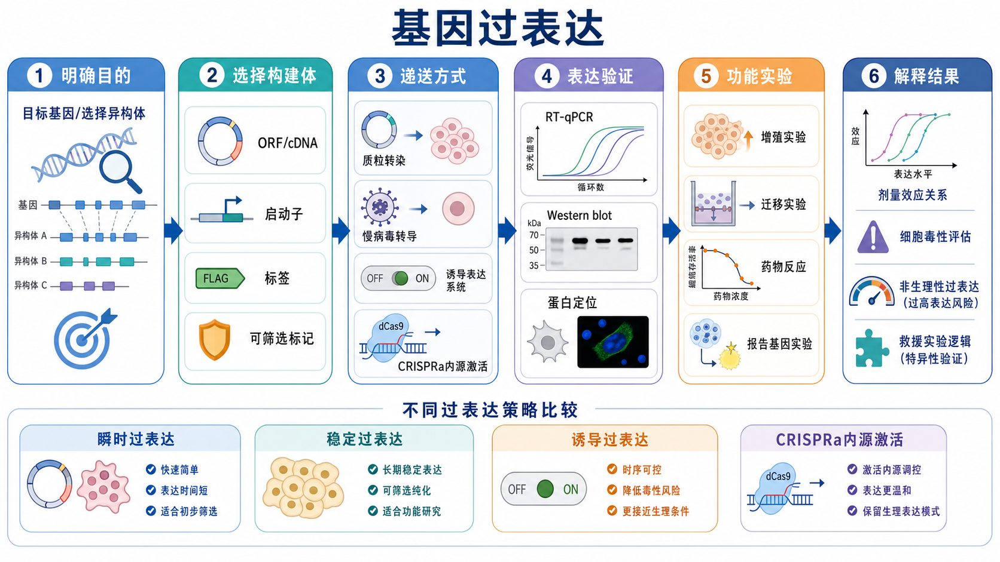
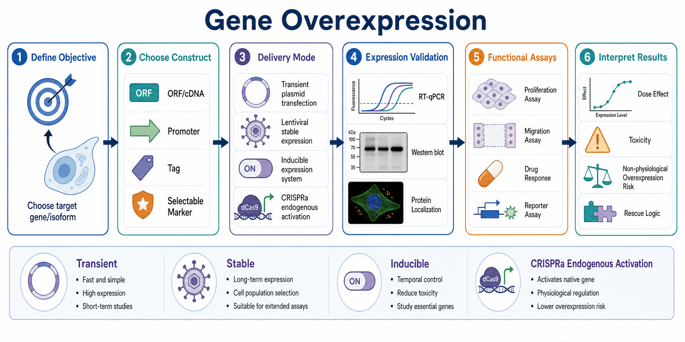

# 基因过表达

基因过表达（gene overexpression）是在细胞或模型中人为提高某个基因、转录本或蛋白的表达水平，用于观察 gain-of-function（功能获得）表型、验证候选基因功能，或配合 [救援实验](<../番外/补充知识/救援实验.md>) 判断敲低/敲除表型是否具有特异性。





图：基因过表达不是简单“把表达拉高”，而是从目标 isoform、表达构建体、递送方式、表达验证、功能读出和结果解释共同构成的实验系统。上图由 Image2 / image-generation model 生成，用于个人学习示意。

## 实验发明历史

基因过表达实验依赖重组 DNA、质粒载体、细胞转染和病毒递送等技术的发展。早期研究者通过把外源基因放入表达载体，让细胞在强启动子驱动下产生目标 RNA 和蛋白，从而研究单个基因的功能。

现代哺乳动物过表达通常围绕 expression vector（表达载体）设计。Addgene 的分子生物学参考资料把 insert（插入片段）、promoter region（启动子区）和 selectable marker（筛选标记）列为质粒功能结构中的核心元素：启动子驱动插入片段转录，筛选标记用于选择获得质粒的细胞。参考：[Addgene Molecular Biology Reference](https://www.addgene.org/mol-bio-reference/)。

随着 [慢病毒载体](<../材(实验耗材工具篇)/慢病毒载体.md>)、Tet-regulated expression（四环素调控表达）和 [CRISPRa](<../番外/补充知识/CRISPRa.md>)（CRISPR activation，CRISPR 激活）发展，过表达不再只有“外源质粒强启动子”一种方式，也可以做长期稳定表达、时间可控表达，或激活内源基因表达。

## 应用场景

- 功能获得验证：判断某个候选基因升高后是否推动增殖、迁移、耐药、分化或通路激活。
- 与 loss-of-function（功能缺失）互补：先做 [siRNA瞬时敲低](siRNA瞬时敲低.md)、[shRNA稳定敲低](shRNA稳定敲低.md) 或 [CRISPR-Cas9](<../番外/补充知识/CRISPR-Cas9.md>) knockout（基因敲除），再用过表达进行 rescue。
- 蛋白定位和互作研究：通过 [蛋白标签](<../番外/补充知识/蛋白标签.md>)、荧光蛋白或免疫检测观察目标蛋白定位、互作和稳定性。
- 突变体功能比较：对比 wild-type（野生型）、catalytic-dead（催化失活）或 domain-deletion（功能域缺失）构建体。
- 报告系统和通路验证：例如配合 [报告基因实验](报告基因实验.md) 观察转录因子或信号通路是否被激活。
- 建立稳定功能模型：用于长期药物处理、克隆形成、动物前模型或需要重复使用的细胞系统。

不适合的情况：如果问题是“内源基因在天然调控下轻度上调会怎样”，强启动子外源过表达可能过于粗暴；如果蛋白表达过高会导致毒性、错误定位或非生理互作，应该考虑诱导系统、低强度启动子或 CRISPRa 内源激活。

## 实验目的

基因过表达实验应提前定义清楚：

- 要提高的是哪个 gene（基因）、transcript isoform（转录本异构体）或 protein isoform（蛋白异构体）。
- 目的是短期筛选、长期建模、定位观察、rescue，还是突变体机制验证。
- 过表达水平希望达到轻度、中度还是强烈表达。
- 读出是 RNA、蛋白、定位、通路还是细胞功能。
- 过表达本身是否可能造成非生理毒性。

一个好过表达实验的核心不是“表达越高越好”，而是“表达水平、细胞状态和功能读出能解释同一个生物学问题”。

## 简要实验原理

### 外源表达载体驱动目标基因表达

常规过表达把目标 [开放阅读框](<../番外/补充知识/开放阅读框.md>)（open reading frame，ORF）或 [cDNA](<../番外/补充知识/cDNA.md>) 克隆到 [过表达载体](<../材(实验耗材工具篇)/过表达载体.md>) 中，由 [启动子](<../番外/补充知识/启动子.md>) 驱动转录，再由细胞翻译系统产生目标蛋白。表达载体常包含 promoter（启动子）、insert（插入片段）、Kozak sequence（[Kozak序列](<../番外/补充知识/Kozak序列.md>)）、tag（标签）、polyA signal（polyadenylation signal，多聚腺苷酸化信号）和 selectable marker（筛选标记）。

Addgene 的 promoter 资料指出，[CMV启动子](<../番外/补充知识/CMV启动子.md>) 常用于强哺乳动物表达，但在某些细胞类型中可能沉默；[EF1α启动子](<../番外/补充知识/EF1α启动子.md>) 往往更稳定，受细胞类型和生理状态影响较小。参考：[Addgene Plasmids 101: The Promoter Region](https://blog.addgene.org/plasmids-101-the-promoter-region)。

### 递送方式决定表达持续时间和细胞压力

transient overexpression（瞬时过表达）通常通过 [细胞转染](细胞转染.md)、[电转染](电转染.md) 或脂质体递送表达质粒，起效快但持续时间短。stable overexpression（稳定过表达）通常结合 [病毒转导](病毒转导.md)、抗生素筛选或 [稳定细胞系构建](稳定细胞系构建.md)，适合长期实验。inducible overexpression（[诱导表达](<../番外/补充知识/诱导表达.md>)）用开关控制表达时间和强度，适合毒性基因、发育/分化模型或时间序列实验。

### CRISPRa 是“激活内源表达”的另一条路

CRISPRa 不引入外源 ORF，而是用 dCas9-activator（dCas9-激活结构域融合蛋白）和 sgRNA 把转录激活模块带到内源启动子或调控区，从而提高内源基因转录。Addgene 的 CRISPR activation 页面也说明，dCas9 fused to activator peptide 可提高特定基因转录，gRNA 将 dCas9-activator 定位到目标基因的启动子或调控区域。参考：[Addgene CRISPR Plasmids: Activate](https://www.addgene.org/crispr/activate/)。

## 所需试剂、材料与设备

| 类型 | 常见内容 | 关键记录 |
| --- | --- | --- |
| 表达构建体 | 目标 ORF/cDNA、空载体、野生型构建体、突变体构建体、tag 构建体 | 基因、isoform、序列版本、载体骨架、启动子、tag、筛选标记 |
| 递送系统 | [质粒DNA](<../材(实验耗材工具篇)/质粒DNA.md>)、[脂质体转染试剂](<../材(实验耗材工具篇)/脂质体转染试剂.md>)、[Lipofectamine](<../材(实验耗材工具篇)/Lipofectamine.md>)、[PEI](<../材(实验耗材工具篇)/PEI.md>)、[Opti-MEM](<../材(实验耗材工具篇)/Opti-MEM.md>)、电转试剂或病毒系统 | 质粒批号、浓度、纯度、转染试剂型号、递送条件 |
| 稳定筛选 | [嘌呤霉素](<../材(实验耗材工具篇)/嘌呤霉素.md>)、[G418](<../材(实验耗材工具篇)/G418.md>)、[潮霉素B](<../材(实验耗材工具篇)/潮霉素B.md>)、[Blasticidin](<../材(实验耗材工具篇)/Blasticidin.md>)、Zeocin | 抗性基因、kill curve、筛选浓度、筛选时间、恢复时间 |
| 细胞培养 | 目标细胞、[DMEM](<../材(实验耗材工具篇)/DMEM.md>) 或 [RPMI 1640](<../材(实验耗材工具篇)/RPMI 1640.md>)、[FBS](<../材(实验耗材工具篇)/FBS.md>)、[PBS](<../材(实验耗材工具篇)/PBS.md>)、[Trypsin-EDTA](<../材(实验耗材工具篇)/Trypsin-EDTA.md>) | 细胞来源、传代号、铺板密度、支原体状态 |
| 表达验证 | [RT-qPCR](RT-qPCR.md)、[Western blot](<Western blot.md>)、免疫荧光、流式、荧光显微镜 | 检测时间点、引物、抗体、tag、归一化方式 |
| 功能实验 | [CCK-8实验](CCK-8实验.md)、[克隆形成实验](克隆形成实验.md)、迁移侵袭、药敏、报告基因、通路检测 | 接种密度、处理时间、主要 readout、统计方案 |

Addgene 的 empty backbone 页面也强调，实际进入细胞的比例通常不会是 100%，因此很多质粒带有荧光或抗生素筛选标记，用于找到或选择获得质粒的细胞。参考：[Addgene Empty Backbones](https://www.addgene.org/collections/empty-backbones/)。

## 实验操作

### 明确生物学问题和表达策略

先判断实验要回答的问题：是想证明某基因“足以”驱动表型，还是想补回敲低/敲除后的功能？是要短期高表达观察通路，还是要建立长期模型？

为什么重要：不同问题需要不同表达策略。短期筛选通常用瞬时过表达；长期功能实验更适合稳定过表达；毒性基因或剂量敏感基因适合诱导表达；希望保留内源剪接和调控时，可考虑 CRISPRa。

关键注意事项：

- 明确目标 isoform，不要默认所有转录本功能相同。
- 定义“合理表达水平”，避免把强过表达当作生理上调。
- 如果用于 rescue，构建体必须绕开原来的 siRNA/shRNA/sgRNA 靶向机制。
- 若目标蛋白有定位信号、分泌信号或跨膜结构，tag 位置需要格外谨慎。

替代方案：

- 如果只想上调内源基因，优先考虑 CRISPRa。
- 如果需要严格时间控制，考虑 [Tet-On系统](<../番外/补充知识/Tet-On系统.md>) 或其他诱导系统。
- 如果只想测试某个功能域，设计野生型和突变体构建体，而不是只做全长过表达。

可能出错：没有先区分“过表达证明 sufficiency（充分性）”和“敲低证明 necessity（必要性）”，容易把实验结论写反。

### 选择表达构建体

构建体至少要确认 ORF/cDNA 序列、启动子、tag、筛选标记、polyA signal、质粒大小和递送方式。若是蛋白功能研究，应确认 tag 不干扰目标蛋白定位、稳定性和互作。

为什么重要：同一个基因换不同 isoform、不同启动子或不同 tag，可能得到完全不同的表型。

关键注意事项：

- 使用测序确认插入片段和突变位点。
- 检查 Kozak 序列、起始密码子、终止密码子和阅读框是否正确。
- N-terminal tag（N 端标签）和 C-terminal tag（C 端标签）可能影响不同结构域。
- 对 secreted protein（分泌蛋白）、membrane protein（膜蛋白）和 nuclear protein（核蛋白），应优先确认信号肽、跨膜区和定位信号没有被 tag 破坏。
- 质粒越大，转染效率通常越容易下降；Thermo Fisher 的电转 troubleshooting 资料也把质粒过大、盐分污染、细胞状态差、密度过高/过低和支原体污染列为低转染效率常见原因。参考：[Thermo Fisher Electroporation Troubleshooting](https://www.thermofisher.com/sa/en/home/technical-resources/technical-reference-library/transfection-support-center/electroporation-support/electroporation-support-troubleshooting.html)。

替代方案：

- 直接购买已验证 ORF clone，节省克隆时间。
- 使用低拷贝或弱启动子载体降低毒性。
- 使用无 tag 构建体配合特异抗体，避免 tag 干扰。

可能出错：只验证质粒大小，不测序插入片段，可能把错义突变、移码或反向插入带进功能实验。

### 选择递送方式

瞬时过表达适合快速实验，稳定过表达适合长期实验，诱导过表达适合表达毒性或时间敏感模型，CRISPRa 适合希望激活内源基因的场景。

为什么重要：递送方式会改变表达水平、表达持续时间、细胞压力和实验解释。瞬时转染常见表达异质性高；稳定株更一致但需要筛选和恢复；病毒递送效率高但有生物安全要求。

关键注意事项：

- 使用 [Mock转染](<../番外/补充知识/Mock转染.md>) 和 empty vector control（[空载体对照](<../番外/补充知识/空载体对照.md>)）区分递送毒性和目标基因效应。
- 过表达构建体与空载体应使用相同载体骨架和相同筛选标记。
- 若涉及慢病毒，必须按机构生物安全审批、培训和废弃物处理 SOP 执行。Addgene 的 lentiviral guide 把 transfer vector、packaging plasmids 和 envelope plasmid 作为慢病毒系统的基本组成，并强调实验需要风险评估。参考：[Addgene Lentiviral Guide](https://www.addgene.org/guides/lentivirus/)。

替代方案：

- 贴壁细胞可先用脂质体瞬时转染筛条件。
- 难转染细胞可考虑电转或病毒递送。
- 对表达毒性强的基因可使用诱导系统或低表达载体。

可能出错：过表达组转染效率高、空载体组转染效率低，会造成假性表型差异；必须用荧光标记、qPCR、WB 或流式估计递送和表达一致性。

### 优化表达量和细胞状态

过表达实验通常需要做质粒量、细胞密度、检测时间点和递送条件的小规模优化。目标不是让表达最高，而是找到“细胞还能健康维持、表达足以产生可解释 readout”的窗口。

为什么重要：过高表达可能产生 aggregation（聚集）、错误定位、非特异互作、ER stress（内质网应激）、蛋白降解压力或细胞毒性。过低表达则可能看不到表型。

关键注意事项：

- 记录细胞传代号、铺板密度、转染时汇合度和支原体状态。
- 观察形态变化、死亡率、脱落和生长速度。
- 对强毒性基因，优先做表达量梯度或诱导表达时间梯度。
- 长期实验前先确认稳定细胞池恢复到可比较状态。

替代方案：

- 使用 weaker promoter（弱启动子）或 inducible promoter（诱导启动子）降低非生理效应。
- 使用 CRISPRa 保留内源转录本结构和调控环境。
- 对分泌蛋白或膜蛋白，检测定位和加工成熟，而不只看总蛋白。

可能出错：把“高表达造成细胞压力”误解释为目标基因真实生物功能。

### 验证表达是否成功

过表达验证通常分三层：RNA 层面、蛋白层面和功能/定位层面。RT-qPCR 可以确认转录本升高；Western blot 可以确认蛋白大小和表达量；免疫荧光或荧光 tag 可以确认 [蛋白定位](<../番外/补充知识/蛋白定位.md>)；下游通路 readout 可以确认功能是否真的发生。

为什么重要：mRNA 高不等于蛋白高，蛋白高也不等于功能正确。错误定位、错误剪接、错误修饰或 tag 干扰都可能让过表达“看起来成功、功能上失败”。

关键注意事项：

- RT-qPCR 引物应能区分内源转录本和外源构建体时，尽量分别设计。
- Western blot 要确认条带大小是否符合目标蛋白或 tag 融合蛋白。
- 对带荧光标签的构建体，应检查荧光定位是否符合已知生物学。
- 内参基因和内参蛋白不能被过表达本身显著影响。

替代方案：

- 没有好抗体时，可用 tag 抗体，但要说明 tag 可能影响蛋白性质。
- 对酶类蛋白，检测酶活或下游底物修饰比只看蛋白量更有意义。
- 对转录因子，结合报告基因、ChIP-qPCR 或下游靶基因表达验证。

可能出错：只看 GFP 阳性率就认为目标蛋白过表达成功，但实际融合蛋白可能被截断、降解或定位错误。

### 接入功能实验和解释

表达验证通过后，再根据实验目的进入功能实验。常见 readout 包括增殖、克隆形成、迁移侵袭、凋亡、细胞周期、药物敏感性、报告基因、通路蛋白和动物前模型。

为什么重要：过表达功能实验容易把剂量效应、转染毒性、载体效应和真实基因功能混在一起。功能读出必须与表达量和细胞状态一起解释。

关键注意事项：

- 使用空载体对照，而不只是 untreated control（未处理对照）。
- 对剂量敏感表型，应记录表达量梯度和表型强度之间的关系。
- 如果过表达用于 rescue，必须比较扰动组、扰动+空载体、扰动+野生型 rescue 和必要的突变体 rescue。
- 对长期实验，确认过表达状态在实验末端仍存在。

替代方案：

- 做 loss-of-function 和 gain-of-function 双向验证，提高主线可信度。
- 用突变体过表达定位关键结构域或酶活位点。
- 用 CRISPRa 作为更接近内源调控的正交验证。

可能出错：只要过表达组表型增强就认为“基因促进该表型”，但没有证明表达量、转染效率和细胞毒性可比。

## 结果解析

| 结果模式 | 较合理解释 | 下一步 |
| --- | --- | --- |
| mRNA、蛋白和功能 readout 同向增强 | 过表达可能成功，目标基因可能足以驱动表型 | 做剂量梯度、突变体验证或 loss-of-function 互证 |
| mRNA 升高但蛋白不升高 | 翻译效率低、蛋白不稳定、抗体问题或检测时间不对 | 换检测时间、检查蛋白稳定性、换 tag/抗体 |
| 蛋白升高但功能无变化 | 目标基因不是该表型限制因素，或蛋白定位/修饰不正确 | 做定位、活性或下游通路验证 |
| 过表达组细胞大量死亡 | 表达毒性、转染毒性、质粒污染或非生理高表达 | 降低表达量、换递送方式、检查质粒纯度 |
| 空载体也改变表型 | 载体骨架、筛选、转染过程或细胞状态影响 | 重新优化对照和递送条件 |
| 稳定株不同克隆差异大 | 插入位点、拷贝数或克隆选择效应 | 使用多个克隆或混合稳定细胞池 |

## 可能出现异常结果及对应原因

| 异常 | 可能原因 | 优先排查 |
| --- | --- | --- |
| 转染效率低 | 细胞状态差、质粒太大、DNA 盐分/内毒素污染、密度不合适 | 细胞状态、质粒质量、阳性 GFP 对照 |
| 表达很强但条带大小异常 | 截断、移码、tag 位置问题、非特异抗体 | 质粒测序、换抗体、检查 tag 和终止密码子 |
| 荧光定位异常 | tag 干扰、过表达聚集、缺失定位信号 | 换 tag 位置、降低表达量、做无 tag 对照 |
| 稳定筛选后表达丢失 | 启动子沉默、选择压力不足、表达毒性导致阴性细胞富集 | 换启动子、维持筛选、使用诱导系统 |
| 功能实验重复性差 | 转染效率波动、表达量差异、细胞密度不一致 | 固定铺板密度，做表达量归一化 |
| rescue 失败 | 构建体仍被原扰动靶向、表达量不合适或蛋白无功能 | 设计抗性构建体，验证定位和功能 |

## 不同过表达策略对比

| 策略 | 核心逻辑 | 优势 | 局限 | 适合场景 |
| --- | --- | --- | --- | --- |
| 瞬时过表达 | 短期递送表达质粒 | 快、成本低、适合初筛 | 表达异质性高、持续时间短 | 快速验证、通路 readout |
| 稳定过表达 | 长期保留表达构建体 | 可重复、适合长期实验 | 建模慢、有筛选和插入效应 | 克隆形成、长期药筛、动物前模型 |
| 诱导过表达 | 用药物或系统开关控制表达 | 时间和剂量可控 | 系统更复杂，需要诱导剂对照 | 毒性基因、时间序列、剂量效应 |
| CRISPRa 内源激活 | 激活内源基因转录 | 保留内源结构和调控，非生理风险较低 | 依赖 TSS、染色质和 sgRNA 设计 | 温和上调、调控研究、正交验证 |

## 推荐记录模板

中文记录：

```text
项目：
目标基因：
目标转录本/isoform：
构建体名称：
ORF/cDNA来源：
载体骨架/启动子/tag/筛选标记：
是否测序确认：
递送方式：
细胞系/来源/传代号/支原体状态：
铺板密度与孔板格式：
质粒浓度/纯度/批号：
转染或转导条件：
空载体对照：
阳性表达对照：
表达验证方法与时间点：
mRNA变化：
蛋白变化：
定位或功能验证：
进入功能实验的时间点：
异常现象与解释：
```

English record:

```text
Project:
Target gene:
Target transcript/isoform:
Construct name:
ORF/cDNA source:
Vector backbone/promoter/tag/selection marker:
Sequence verification:
Delivery method:
Cell line/source/passage number/mycoplasma status:
Seeding density and plate format:
Plasmid concentration/purity/lot number:
Transfection or transduction condition:
Empty-vector control:
Positive expression control:
Expression-validation method and time point:
mRNA change:
Protein change:
Localization or functional validation:
Time point for functional assays:
Abnormal observations and interpretation:
```

## 小结

基因过表达是验证候选基因功能的强工具，但它最容易犯的错误是“表达越高越好”。真正可靠的过表达实验需要先明确 isoform 和生物学问题，再选择合适构建体和递送方式，并用 RNA、蛋白、定位和功能 readout 共同验证。结果解释时必须警惕非生理性高表达、转染毒性、空载体效应和克隆差异。

## 参考来源

- [Addgene Molecular Biology Reference](https://www.addgene.org/mol-bio-reference/)
- [Addgene Plasmids 101: The Promoter Region](https://blog.addgene.org/plasmids-101-the-promoter-region)
- [Addgene Plasmids 101: Terminators and PolyA signals](https://blog.addgene.org/plasmids-101-terminators-and-polya-signals)
- [Addgene Empty Backbones - Choosing Your Perfect Plasmid Backbone](https://www.addgene.org/collections/empty-backbones/)
- [Addgene Lentiviral Vector Guide](https://www.addgene.org/guides/lentivirus/)
- [Addgene CRISPR Plasmids: Activate](https://www.addgene.org/crispr/activate/)
- [Thermo Fisher Electroporation Troubleshooting](https://www.thermofisher.com/sa/en/home/technical-resources/technical-reference-library/transfection-support-center/electroporation-support/electroporation-support-troubleshooting.html)
