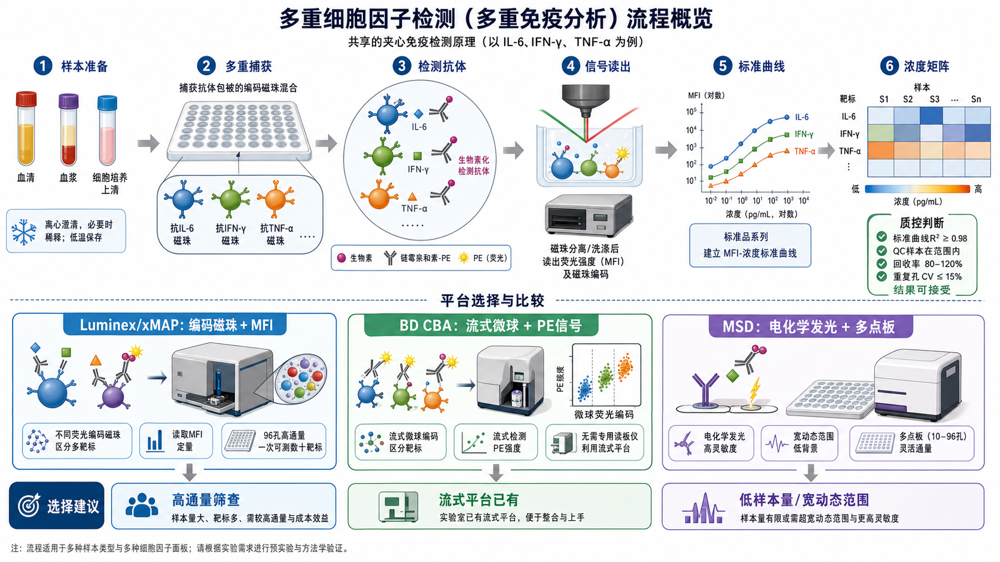
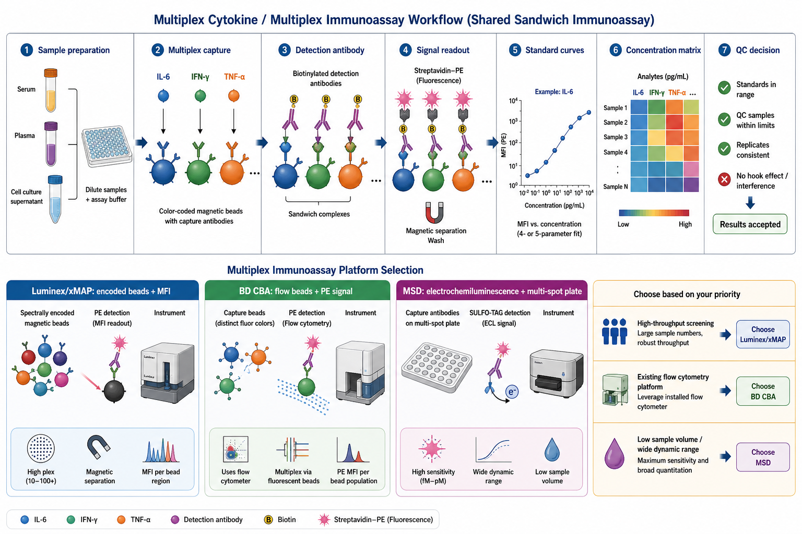

# 多重因子检测

多重因子检测（multiplex cytokine assay / multiplex immunoassay，多重细胞因子检测 / 多重免疫分析）是一类在少量样本中同时检测多个 soluble analytes（可溶性分析物）的免疫检测方法，常用于血清、血浆、细胞培养上清、组织裂解液或其他体液中的 cytokines（[细胞因子](../番外/补充知识/细胞因子.md)）、chemokines（趋化因子）、growth factors（生长因子）和炎症因子分析。





一句话理解：ELISA 通常是“一个孔测一个指标”，多重因子检测是“同一份样本同时测很多指标”，但代价是对标准曲线、基质效应、动态范围、交叉反应和质控判断要求更高。

## 实验发明历史与背景

传统 [ELISA](ELISA.md) 非常成熟，但每次通常只检测一个目标蛋白。随着免疫学、炎症、肿瘤微环境、药物毒理和生物标志物研究的发展，研究者经常希望在有限样本量中同时获得多个因子的浓度信息。多重因子检测由此发展出几条主流技术路线：

- bead-based multiplex assay（微球/磁珠多重检测），代表是 [Luminex/xMAP检测](<Luminex-xMAP检测.md>) 和 Bio-Plex、ProcartaPlex、MILLIPLEX 等产品线。
- Cytometric Bead Array（[Cytometric Bead Array](<Cytometric Bead Array.md>)，流式微球阵列），代表是 BD CBA，依赖 [流式细胞仪](<../材(实验耗材工具篇)/流式细胞仪.md>) 区分不同微球群。
- electrochemiluminescence multiplex assay（[电化学发光](../番外/补充知识/电化学发光.md)多重检测），代表是 MSD U-PLEX / V-PLEX 等多点板体系。

Luminex 的 xMAP 技术页面将 xMAP 描述为 multiplexing technology（多重检测技术），利用不同 bead regions（微球编码区域）同时检测多个目标。参考：[Luminex xMAP Technology](https://www.luminexcorp.com/xmap-technology/)。

BD 的 Cytometric Bead Array 体系使用具有不同荧光特征的微球捕获不同 soluble proteins，并通过流式细胞术读取每个 bead population（微球群）的 PE 信号。参考：[BD Cytometric Bead Array](https://www.bdbiosciences.com/en-us/products/reagents/immunoassay-reagents/cytometric-bead-array)。

MSD 的技术路线则依赖 electrochemiluminescence（电化学发光，ECL）读出，多点板可以在同一孔中检测多个 analytes。参考：[Meso Scale Discovery Technology](https://www.mesoscale.com/en/technical_resources/our_technology/)。

## 应用场景

- 细胞培养上清中多种细胞因子、趋化因子和炎症因子的同时定量。
- 血清、血浆、脑脊液、支气管灌洗液、腹水或组织裂解液中的 biomarker panel（生物标志物组合）筛查。
- 药物处理、基因编辑、感染、免疫治疗或刺激实验后的 secretome（分泌组）变化。
- 疫苗、感染免疫、肿瘤免疫、自身免疫和炎症模型中比较多因子反应模式。
- 作为 [ELISPOT](ELISPOT.md)、[FluoroSpot](FluoroSpot.md)、[细胞内细胞因子染色](细胞内细胞因子染色.md) 和单因子 ELISA 的互补实验。
- 高通量预筛选：先用多重因子检测发现可能变化的 targets，再用单因子 ELISA 或功能实验验证。

不适合的情况：

- 只关心一个目标，且需要最高稳健性：单因子 ELISA 往往更简单。
- 样本基质非常复杂，且每个 analyte 都需要严格绝对定量：需要先做基质验证和稀释线性。
- 目标浓度跨度极大，多个 analytes 同时落在动态范围外：需要分组检测或不同稀释倍数。
- 结果会直接用于临床决策或注册申报：必须使用经过验证的方法和相应质量体系，不应只套科研试剂盒。

## 实验目的

多重因子检测通常用于回答：

- 某个处理是否改变一组 cytokines / chemokines / growth factors 的浓度。
- 不同样本之间的 inflammatory profile（炎症因子谱）是否不同。
- 哪些 analytes 值得进一步用 ELISA、qPCR、Western blot 或功能实验验证。
- 样本是否存在某种免疫激活、炎症、损伤或治疗反应模式。
- 多个 analytes 之间是否有协同变化、聚类关系或分组特征。

## 简要实验原理

### 共享的夹心免疫分析逻辑

多数多重因子检测仍然遵循 sandwich immunoassay（夹心免疫分析）逻辑：

- capture antibody（[捕获抗体](<../材(实验耗材工具篇)/捕获抗体.md>)）固定在微球、磁珠或板上。
- 样本中的目标因子与捕获抗体结合。
- detection antibody（[检测抗体](<../材(实验耗材工具篇)/检测抗体.md>)）识别目标分子的另一个表位。
- 通过 PE、荧光、化学发光或电化学发光等方式读出信号。
- 用 [标准曲线](../番外/补充知识/标准曲线.md) 把信号换算为 pg/mL 或其他浓度单位。

所以，多重因子检测不是完全不同于 ELISA 的魔法，而是把多个夹心免疫反应放到同一个孔、同一个板或同一个读数体系里。

### Luminex/xMAP：编码磁珠加 MFI

[xMAP技术](../番外/补充知识/xMAP技术.md) 使用具有不同内部编码的 microspheres（微球）或 magnetic beads（磁珠）。每种 bead region 对应一个 analyte，表面偶联特异性捕获抗体。检测时，仪器先识别“这颗珠子属于哪个 analyte”，再读取报告荧光信号，常见读数是 MFI（median fluorescence intensity，[中位荧光强度](../番外/补充知识/MFI.md)）。

实用理解：

- bead identity 告诉你“测的是哪一个因子”。
- reporter intensity 告诉你“这个因子的信号有多强”。
- 标准曲线把 MFI 转换为浓度。

Bio-Rad 的 Bio-Plex 和 Thermo Fisher 的 ProcartaPlex 都属于基于 Luminex 平台的多重免疫检测产品线。参考：[Bio-Rad Bio-Plex Multiplex Immunoassays](https://www.bio-rad.com/en-us/category/multiplex-immunoassays)；[Thermo Fisher ProcartaPlex Assays](https://www.thermofisher.com/us/en/home/life-science/antibodies/immunoassays/procartaplex-assays-luminex.html)。

### BD CBA：用流式细胞仪读微球群

Cytometric Bead Array 的核心是用不同荧光强度或颜色区分 bead populations（微球群），再用 PE（[藻红蛋白](<../材(实验耗材工具篇)/PE.md>)）信号定量目标分子。它的优势是利用已有流式平台，不一定需要专门 Luminex 仪器。

限制也很明显：

- 需要熟悉流式采集、补偿和 gating。
- 微球群之间要分得开。
- 事件数不足会影响每个 bead population 的稳定性。
- 如果样本颗粒多或背景高，流式读数会更麻烦。

### MSD：电化学发光多点板

MSD 平台常使用 multi-spot plate（多点板）：同一个孔底的不同 spot 区域固定不同捕获抗体，检测抗体带有 SULFO-TAG 等电化学发光标记。加电后产生 ECL signal（电化学发光信号），由 [MSD读板仪](<../材(实验耗材工具篇)/MSD读板仪.md>) 读取。

MSD 的优势常在低样本量、宽动态范围和低背景方面体现；但平台依赖专用仪器和试剂体系，成本与可及性需要评估。MSD 官方技术资料也强调其 MULTI-ARRAY / MULTI-SPOT 技术用于多重检测和电化学发光读出。参考：[Meso Scale Discovery Technology](https://www.mesoscale.com/en/technical_resources/our_technology/)。

## 所需试剂、耗材和设备

| 类别 | 常用内容 | 作用 | 注意事项 |
|---|---|---|---|
| 样本 | 血清、血浆、细胞培养上清、组织裂解液、体液 | 提供待测 analytes | 采样、冻融、离心和基质差异会强烈影响结果 |
| 试剂盒 | [多重因子检测试剂盒](<../材(实验耗材工具篇)/多重因子检测试剂盒.md>)、Luminex/Bio-Plex/ProcartaPlex/MILLIPLEX/CBA/MSD kit | 提供捕获、检测、标准品和缓冲液 | 不同平台不能随意混用 |
| 标准品 | [标准品](<../材(实验耗材工具篇)/标准品.md>)、标准品稀释液 | 建立标准曲线 | 标准品复溶、混匀和梯度稀释是高风险步骤 |
| 微球/磁珠 | 编码磁珠、捕获微球、CBA beads | 捕获 analytes 并区分目标 | 磁珠不能干，混匀不足会导致复孔 CV 高 |
| 检测体系 | 生物素化检测抗体、[链霉亲和素](<../材(实验耗材工具篇)/链霉亲和素.md>)-PE、SULFO-TAG 检测抗体 | 产生读出信号 | 避光、时间和洗涤一致性很重要 |
| 板和耗材 | 96 孔板、过滤板、低吸附管、封板膜 | 反应和洗涤载体 | 平台对应板型要匹配 |
| 洗涤设备 | [磁力架](<../材(实验耗材工具篇)/磁力架.md>)、[洗板机](<../材(实验耗材工具篇)/洗板机.md>)、真空抽滤装置 | 去除未结合试剂 | 洗涤不足高背景，洗涤过猛丢珠 |
| 读板设备 | [Luminex检测仪](<../材(实验耗材工具篇)/Luminex检测仪.md>)、流式细胞仪、MSD 读板仪 | 读取信号 | 仪器校准、通道设置和软件版本要记录 |
| 数据分析 | 平台软件、4PL/5PL 曲线拟合、质控表 | 转换浓度并质控 | 不要只导出浓度矩阵而不看曲线 |

## 实验设计

### 先选平台，而不是先选指标数量

| 平台 | 更适合 | 优势 | 主要限制 |
|---|---|---|---|
| Luminex/xMAP | 样本量较多、指标较多、需要高通量筛查 | plex 数高，产品线成熟 | 需要专用仪器，基质和批次要控制 |
| BD CBA | 实验室已有流式平台，指标数中等 | 不需要专用 Luminex，和流式经验衔接 | 依赖流式门控和微球群分离 |
| MSD | 样本量有限、追求宽动态范围和低背景 | 灵敏度和动态范围常较好 | 仪器和试剂体系专用，成本较高 |
| 单因子 ELISA | 只测少数关键指标 | 简单、稳健、便宜 | 样本消耗大，通量低 |

### 样本基质要提前验证

同一个 kit 在细胞培养上清中表现好，不代表在血浆或组织裂解液中也好。常见基质问题包括：

- serum/plasma matrix（血清/血浆基质）干扰抗原抗体结合。
- EDTA、肝素、柠檬酸盐等抗凝剂影响读数。
- 组织裂解液中的蛋白、脂质、去垢剂或盐浓度影响信号。
- 高浓度 analyte 导致 [Hook效应](../番外/补充知识/Hook效应.md) 或超出动态范围。

因此，关键项目应做 [基质效应](../番外/补充知识/基质效应.md)、[稀释线性](../番外/补充知识/稀释线性.md) 和 [Spike-and-recovery](../番外/补充知识/Spike-and-recovery.md) 验证。

### 指标组合要服务于问题

不要为了“多”而盲目选择 48-plex、65-plex。指标太多会增加成本、数据缺失和解释负担。

实用策略：

- 探索阶段：可以使用较大 panel 筛查。
- 验证阶段：缩小为与假设最相关的 5-20 个 analytes。
- 样本珍贵：优先选宽动态范围、低样本量平台。
- 关键结果：用单因子 ELISA、RT-qPCR、Western blot 或功能实验复核。

### 复孔和板图非常重要

多重因子检测常见板图包括：

- 标准曲线梯度。
- blank / assay buffer。
- quality control samples（QC 样本）。
- 样本复孔。
- 不同稀释倍数样本。
- 桥接样本或批间控制样本。

复孔 CV（[复孔CV](../番外/补充知识/复孔CV.md)）高时，不要直接平均。需要先查是否有加样、洗板、气泡、丢珠、标准品稀释或仪器采集问题。

## 实验操作

下面是通用 bead-based multiplex immunoassay 流程。不同平台和试剂盒的孵育时间、摇床速度、洗涤方式和读板设置不同，正式实验以说明书为准。

### 样本采集和预处理

做法：

- 血液样本按研究设计选择血清或血浆，并统一抗凝剂类型。
- 细胞培养上清离心去除细胞和碎片。
- 组织裂解液需确认裂解液是否与 kit 兼容。
- 分装保存，避免反复冻融。
- 上机前低温融化、混匀并离心澄清。

为什么重要：

多重因子检测对前处理非常敏感。同一个样本如果经历不同冻融次数、不同离心条件或不同抗凝剂，可能产生比真实生物差异更大的技术差异。

注意事项：

- 样本浑浊、脂血或溶血时要记录。
- 细胞上清最好记录细胞数、培养体积和收样时间。
- 超出范围的样本需要按说明稀释后重测。

### 准备标准品和质控样本

做法：

- 按说明复溶标准品，充分静置和混匀。
- 做 serial dilution（系列稀释）建立标准曲线。
- 设置 blank 和 QC samples。
- 标准品、QC 和样本尽量使用相同基质或经过验证的替代基质。

为什么重要：

所有浓度都来自标准曲线。标准品配错、混匀不足或梯度稀释错误，会让整板结果失去意义。

常见错误：

- 标准品未完全复溶就稀释，导致高点偏低。
- 梯度稀释时换枪头不规范，造成 carryover。
- 漏加某一孔标准品，导致曲线拟合不稳。

### 准备微球或捕获体系

做法：

- 将 bead stock 充分涡旋或超声/震荡重悬，具体按说明书。
- 配制工作浓度 bead mixture。
- 加入反应孔并保持避光。
- 磁珠体系洗涤时使用磁力架或自动洗板机。

为什么重要：

微球是每个 analyte 的捕获载体。微球沉降很快，混匀不足会导致不同孔 bead count 不一致，出现复孔差异和某些 analytes 失败。

注意事项：

- 磁珠不能干。
- 洗涤后不要把 beads 吸走。
- 操作过程中板要按说明摇晃，保证微球和样本充分接触。

### 加样和孵育

做法：

- 按板图加入标准品、QC、样本和 assay buffer。
- 封板避光，在摇床上按说明孵育。
- 某些平台可室温孵育，某些需要 4°C overnight。

为什么重要：

孵育时间和摇床速度影响抗原抗体结合是否达到稳定。摇晃不足会降低信号；蒸发会改变浓度；边缘孔温度和蒸发差异会造成边缘效应。

替代策略：

- 低丰度 analytes 可考虑更长孵育或更少稀释，但要遵守 kit 验证条件。
- 高丰度 analytes 常需要预稀释，以免超过上限或出现 Hook 效应。

### 洗涤

做法：

- 磁珠体系在磁力架上吸附后弃上清，再加洗液重悬。
- 过滤板体系可用真空抽滤或洗板机。
- CBA 体系常通过离心或流式管洗涤，按说明进行。

为什么重要：

洗涤不足会增加背景；洗涤过猛会丢失微球。多重因子检测中，一旦某孔 bead count 过低，该孔或该 analyte 可能无法可靠定量。

注意事项：

- 洗板机参数要适配磁珠/过滤板，不要照搬 ELISA。
- 洗涤后每孔残液体积要一致。
- 避免气泡和孔底残珠不均匀。

### 加检测抗体和报告试剂

做法：

- 加入 detection antibody mixture。
- 洗涤后加入 streptavidin-PE 或 ECL detection reagent。
- 避光孵育。

为什么重要：

检测抗体决定夹心复合物信号。多重体系中，抗体之间可能有 [交叉反应](../番外/补充知识/交叉反应.md) 或竞争影响，因此优先使用厂家验证组合，不建议随意拼接多个单因子抗体。

注意事项：

- PE 和其他荧光试剂要避光。
- 检测抗体浓度过高会增加背景。
- 平台不同，报告试剂完全不同，不可混用。

### 读板或上机

做法：

- Luminex/xMAP：读 bead region 和 reporter MFI。
- BD CBA：用流式仪采集 bead populations 和 PE signal。
- MSD：加入读板 buffer 后用 MSD reader 读取 ECL signal。
- 保存原始数据、仪器设置、软件版本和分析参数。

为什么重要：

多重因子检测的原始读数很重要。只保存最终 pg/mL 表格会丢失很多判断信息，例如 bead count、MFI、标准曲线拟合、低于 LLOQ、高于 ULOQ 和复孔异常。

### 标准曲线拟合和浓度换算

做法：

- 对每个 analyte 单独建立标准曲线。
- 常用 [4PL曲线](../番外/补充知识/4PL曲线.md) 或 [5PL曲线](../番外/补充知识/5PL曲线.md) 拟合。
- 标记低于 [定量下限](../番外/补充知识/定量下限.md)、高于 [定量上限](../番外/补充知识/定量上限.md) 或超出拟合范围的点。
- 输出 [浓度矩阵](../番外/补充知识/浓度矩阵.md)：sample x analyte。

为什么重要：

多重因子检测不是“机器导出数字就结束”。每个 analyte 都有自己的标准曲线质量、动态范围和可靠定量区间。某些 analyte 可用，某些 analyte 可能因为曲线差或背景高而不能解释。

## 结果解析

### 理想结果

- 标准曲线覆盖样本浓度范围。
- blank 背景低。
- QC 样本在预期范围内。
- 复孔 CV 可接受。
- 样本浓度大多落在动态范围内。
- 稀释线性和 spike recovery 支持该基质可测。
- 热图、聚类或差异分析建立在可靠浓度值上。

### 常见结果指标

| 指标 | 含义 | 解释重点 |
|---|---|---|
| MFI / signal | 原始或中间信号 | 先看是否接近背景或饱和 |
| pg/mL | 换算浓度 | 只能在曲线范围内解释 |
| LLOQ | lower limit of quantification，定量下限 | 低于此值不宜当精确定量 |
| ULOQ | upper limit of quantification，定量上限 | 高于此值应稀释重测 |
| CV | coefficient of variation，变异系数 | 评估复孔一致性 |
| Recovery | 加标回收率 | 评估基质是否干扰 |
| Dilution linearity | 稀释线性 | 判断稀释后是否仍可准确定量 |

### 数据处理建议

- 不要把 below LLOQ 的值直接当作真实 0；应按统计方案处理。
- 高于 ULOQ 的样本优先稀释重测，而不是直接使用外推值。
- 同一 analyte 在不同批次检测时要使用桥接样本或批次校正策略。
- 先做质控，再做差异分析、聚类、PCA 或热图。
- 对关键发现做单因子 ELISA 或独立样本验证。

## 异常结果与 troubleshooting

| 异常结果 | 可能原因 | 解决策略 |
|---|---|---|
| 标准曲线差 | 标准品复溶不充分；稀释错误；高点饱和；低点接近背景 | 重新配标准品；检查稀释步骤；使用合适拟合模型 |
| 所有样本信号低 | 试剂失效；孵育不足；读板设置错误；目标本身低 | 检查阳性/QC；延长孵育；确认仪器设置 |
| 所有样本背景高 | 洗涤不足；检测抗体过量；样本基质干扰；板污染 | 加强洗涤；优化稀释；做 blank 和基质对照 |
| 某些 analyte 全部不可用 | 抗体组合问题；交叉反应；目标低于检测能力 | 查看单项曲线；换 panel；用 ELISA 验证 |
| 复孔 CV 高 | 加样误差；微球混匀不足；丢珠；气泡 | 充分混珠；检查移液；去气泡；重复异常孔 |
| bead count 低 | 洗涤过猛；吸走磁珠；仪器堵塞或采集不足 | 温和洗涤；保留珠子；检查上机设置 |
| 样本高点反而变低 | Hook 效应；超出动态范围 | 稀释样本重测 |
| 稀释后浓度不成比例 | 基质效应；目标不稳定；曲线范围不合适 | 做稀释线性和 spike recovery；换稀释倍数 |
| 批次差异大 | kit lot、仪器校准、操作者或样本冻融差异 | 使用桥接样本；同批检测关键样本；记录 lot |

## 多重因子检测 vs ELISA vs ELISPOT vs FluoroSpot vs ICS

| 方法 | 核心读数 | 优点 | 局限 | 最适合的问题 |
|---|---|---|---|---|
| 多重因子检测 | 多个 analytes 的浓度矩阵 | 样本省、通量高、适合筛查 | 基质和质控复杂，不知道来源细胞 | 上清/血清里多个因子各是多少 |
| ELISA | 单个 analyte 浓度 | 稳健、便宜、解释直观 | 通量低、耗样本 | 关键单因子的准确定量 |
| ELISPOT | 分泌细胞频率 | 高灵敏，单细胞分泌频率 | 表型信息少 | 有多少细胞分泌某因子 |
| FluoroSpot | 多因子分泌细胞和共分泌组合 | 单细胞分泌 + 多因子 | 读板和 overlay 要求高 | 哪些细胞可能共分泌多个因子 |
| ICS | 某细胞亚群内胞内因子阳性率 | 可同时看表型和功能 | 流式 panel 和门控复杂 | 哪个细胞亚群产生哪些因子 |

选择逻辑：

- 想知道“上清里总浓度”：多重因子检测或 ELISA。
- 想知道“有多少分泌细胞”：ELISPOT 或 FluoroSpot。
- 想知道“分泌细胞属于哪个亚群”：ICS 或分选后检测。
- 想先筛很多指标：多重因子检测。
- 想验证关键指标：单因子 ELISA 或功能实验。

## 购买和记录建议

- 初学或关键样本优先选择成熟 kit 和验证 panel，不建议自己拼接多个抗体。
- 购买前确认样本类型是否被厂家验证，例如 serum、plasma、cell culture supernatant 或 tissue lysate。
- 记录平台、试剂盒、analyte panel、货号、批号、样本稀释倍数、标准曲线模型和软件版本。
- 常见供应商包括 [Bio-Rad](../番外/试剂厂商/Bio-Rad.md)、[Thermo Fisher Scientific](<../番外/试剂厂商/Thermo Fisher Scientific.md>)、[BD Biosciences](<../番外/试剂厂商/BD Biosciences.md>)、[MilliporeSigma](../番外/试剂厂商/MilliporeSigma.md)、[Bio-Techne](../番外/试剂厂商/Bio-Techne.md)、[R&D Systems](<../番外/试剂厂商/R&D Systems.md>)、[Luminex](../番外/试剂厂商/Luminex.md) 和 [Meso Scale Discovery](<../番外/试剂厂商/Meso Scale Discovery.md>)。
- 如果实验室已经有流式平台，可以考虑 BD CBA；如果有 Luminex/Bio-Plex 平台，适合更高通量 panel；如果样本极少或浓度跨度大，可评估 MSD。

## 推荐记录模板

### 中文记录模板

```text
实验日期：
实验目的：
平台：Luminex / Bio-Plex / ProcartaPlex / MILLIPLEX / BD CBA / MSD / 其他
样本类型：血清 / 血浆 / 细胞培养上清 / 组织裂解液 / 其他
样本处理：离心条件、冻融次数、稀释倍数
试剂盒名称：
厂家、货号、批号：
检测 panel：
标准品复溶方式：
标准曲线梯度：
QC 样本：
复孔设置：
板图文件：
孵育时间和温度：
摇床速度：
洗涤方式：
读板仪型号：
仪器校准状态：
软件版本：
曲线模型：4PL / 5PL / 其他
LLOQ / ULOQ 规则：
复孔 CV 规则：
异常孔处理规则：
主要结果：
需要复测或验证的 analytes：
```

### English record template

```text
Date:
Experimental aim:
Platform: Luminex / Bio-Plex / ProcartaPlex / MILLIPLEX / BD CBA / MSD / other
Sample type: serum / plasma / cell culture supernatant / tissue lysate / other
Sample handling: centrifugation, freeze-thaw cycles, dilution factor
Kit name:
Manufacturer, catalog number, lot number:
Analyte panel:
Standard reconstitution:
Standard curve dilution series:
QC samples:
Replicate design:
Plate map file:
Incubation time and temperature:
Shaking speed:
Wash method:
Reader model:
Instrument calibration status:
Software version:
Curve model: 4PL / 5PL / other
LLOQ / ULOQ rule:
Replicate CV rule:
Outlier handling rule:
Main results:
Analytes requiring repeat or validation:
```

## 小结

多重因子检测的价值在于用少量样本快速获得多个可溶性因子的浓度谱，非常适合筛查炎症因子、免疫反应和分泌组变化。它的风险也很清楚：每个 analyte 都有自己的曲线、背景、动态范围和基质适配性。可靠结果不只是导出一张 pg/mL 表，而是要确认标准曲线、QC、复孔 CV、LLOQ/ULOQ、稀释线性、spike recovery 和批次控制都能支持解释。

## 参考来源

- Luminex. xMAP Technology. https://www.luminexcorp.com/xmap-technology/
- Bio-Rad. Bio-Plex Multiplex Immunoassays. https://www.bio-rad.com/en-us/category/multiplex-immunoassays
- Thermo Fisher Scientific. ProcartaPlex Multiplex Immunoassays. https://www.thermofisher.com/us/en/home/life-science/antibodies/immunoassays/procartaplex-assays-luminex.html
- BD Biosciences. Cytometric Bead Array. https://www.bdbiosciences.com/en-us/products/reagents/immunoassay-reagents/cytometric-bead-array
- Meso Scale Discovery. MSD Technology. https://www.mesoscale.com/en/technical_resources/our_technology/
