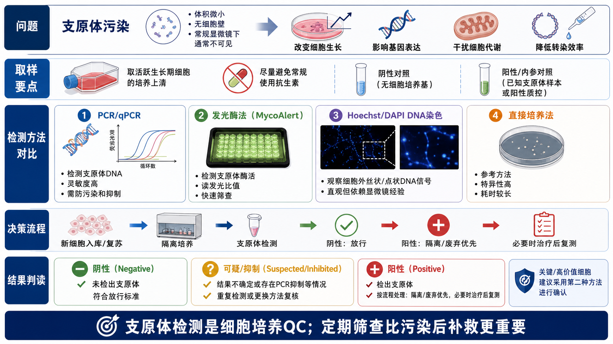
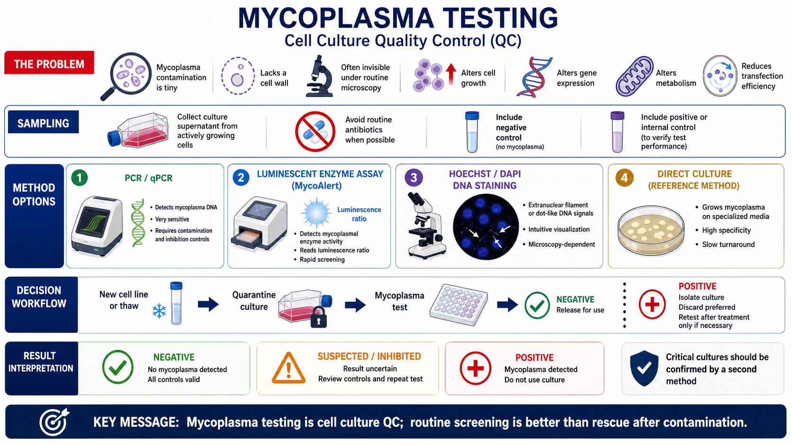

# 支原体检测

Mycoplasma testing（支原体检测）是细胞培养质量控制中用于筛查 [支原体污染](../番外/补充知识/支原体污染.md) 的实验。支原体属于 [Mollicutes](../番外/补充知识/Mollicutes.md) 类细菌，典型特点是体积极小、没有细胞壁、常规光学显微镜下通常不可见，因此细胞看起来“状态还行”也不代表没有污染。





一句话理解：支原体检测不是“看到培养基浑浊才做”的补救实验，而是 [细胞培养](细胞培养.md) 的常规 QC。它应该出现在新细胞入库、复苏、建库、长期传代和关键实验前，而不是等实验结果异常后才想起来。

## 实验发明历史与背景

Mycoplasma（支原体）是细胞培养中最常见、也最隐蔽的污染之一。[ATCC](../番外/试剂厂商/ATCC.md) 的资料指出，连续细胞培养中的支原体污染比例可达 15-35%，并且支原体会影响染色体、核酸合成、膜抗原性、增殖、代谢、转染效率、基因表达、病毒生产和细胞死亡等多个方面。参考：[ATCC Mycoplasma Contamination](https://www.atcc.org/the-science/authentication/mycoplasma-contamination)。

支原体之所以麻烦，有几个原因：

- 没有细胞壁，因此青霉素等针对细胞壁合成的抗生素无法有效保护培养体系。
- 体积小，常规显微镜下不容易看到，也可能通过部分过滤步骤。
- 污染后细胞不一定立刻死亡，而是悄悄改变增殖、代谢和基因表达。
- 同一个实验室中交叉污染容易扩散到多个细胞系。

Nature Protocols 的支原体检测 protocol 强调，支原体是 frequent and occult contaminant（常见而隐匿的污染物），会改变细胞生理，使污染细胞产生的实验结果失去可信度；建议所有新进入实验室的细胞和所有细胞库都进行检测，并推荐从 PCR、间接染色和培养法中选择两种方法组合使用。参考：[Young et al., 2010, Nature Protocols](https://www.nature.com/articles/nprot.2010.43)。

## 应用场景

- 新细胞系进入实验室时，隔离培养并检测。
- 从液氮中复苏细胞后，确认无支原体再进入公共培养体系。
- 建立 working cell bank（工作细胞库）或 master cell bank（主细胞库）前。
- 关键实验前，例如转录组、蛋白质组、药物筛选、细胞治疗相关实验、病毒包装、动物实验前。
- 细胞出现生长变慢、转染效率下降、形态轻微异常、数据重复性变差时。
- 实验室发生细菌、真菌或未知 [细胞污染](细胞污染.md) 后，对同一培养空间内的细胞做排查。
- 长期传代细胞定期筛查，例如每 1-3 个月或每 10 次传代左右一次，具体频率按实验室制度调整。

ATCC 的 mycoplasma testing service 页面建议在收到细胞、传代约 10 次后、制备细胞库后以及有疑问时进行支原体检测。参考：[ATCC Mycoplasma Testing Service](https://www.atcc.org/services/cell-authentication/mycoplasma-testing)。

## 实验目的

支原体检测通常有四个目的：

- 放行判断：确认细胞能否进入正式实验或公共培养区域。
- 污染定位：判断某个细胞系、某批培养基、某个操作流程是否可能是污染源。
- 实验解释：排除支原体对细胞增殖、代谢、基因表达和药物反应的干扰。
- 治疗/废弃决策：判断污染细胞是否需要废弃，或者在极少数珍贵细胞中尝试去除后复测。

这不是单纯的“有/没有污染”检测，还直接决定这批细胞是否可用于生成可信数据。

## 简要实验原理

支原体检测没有一种方法永远适合所有场景。常见方法可以分成四类。

| 方法 | 英文名 | 主要检测对象 | 优点 | 局限 | 适合场景 |
|---|---|---|---|---|---|
| PCR/qPCR | polymerase chain reaction / quantitative PCR | 支原体 DNA，常见靶点为 16S rRNA 基因区域 | 灵敏、快速、特异性强 | 容易受污染和 PCR 抑制影响；可能检测到残留 DNA | 常规筛查、关键实验前确认 |
| 发光酶法 | luminescent mycoplasmal enzyme assay | 支原体特有酶活 | 快速、操作简单、适合日常筛查 | 依赖活性酶和样本状态；结果可疑时需复核 | 培养上清快速筛查 |
| DNA 荧光染色 | DAPI/Hoechst DNA staining | 胞外或核外丝状/点状 DNA 信号 | 直观，能看到污染形态 | 主观性强，低污染不敏感，细胞碎片可干扰 | 教学、显微镜快速观察、辅助判断 |
| 直接培养法 | direct culture method | 可培养支原体 | 参考方法，特异性高 | 耗时长，部分支原体难培养 | 规范 QC、第三方检测、法规场景 |

ATCC 资料中提到，直接培养法需要将样本接种到培养体系并长期观察典型 “fried egg-shaped colonies”（煎蛋样菌落）；间接染色法常用 Hoechst 33258 检查核外丝状荧光；PCR 法常用通用引物检测多种 Mycoplasma、Acholeplasma、Spiroplasma 和 Ureaplasma。参考：[ATCC Mycoplasma Contamination](https://www.atcc.org/the-science/authentication/mycoplasma-contamination)。

## 所需试剂、耗材和设备

| 类别 | 推荐内容 | 作用 | 关键注意事项 |
|---|---|---|---|
| 检测样本 | 细胞培养上清、细胞沉淀、FTA card 样本或提取 DNA | 提供待检测材料 | 培养上清最常用；关键样本可同时留细胞沉淀 |
| 检测试剂 | [支原体检测试剂盒](<../材(实验耗材工具篇)/支原体检测试剂盒.md>)、[支原体PCR检测试剂盒](<../材(实验耗材工具篇)/支原体PCR检测试剂盒.md>)、[MycoAlert](<../材(实验耗材工具篇)/MycoAlert.md>) | 进行 PCR/qPCR 或发光法检测 | 按说明书设置阴性、阳性和内参/抑制控制 |
| PCR 体系 | [PCR引物](<../材(实验耗材工具篇)/PCR引物.md>)、[Taq DNA聚合酶](<../材(实验耗材工具篇)/Taq DNA聚合酶.md>)、dNTP、PCR buffer | 扩增支原体 DNA | 自配体系风险高，常规建议优先用商业 kit |
| 核酸提取 | [DNA提取试剂盒](<../材(实验耗材工具篇)/DNA提取试剂盒.md>) | 去除抑制物并提取模板 | 培养基、血清和细胞裂解物可能带来 PCR 抑制 |
| DNA 染色 | [DAPI](<../材(实验耗材工具篇)/DAPI.md>)、[Hoechst 33342](<../材(实验耗材工具篇)/Hoechst 33342.md>)、Hoechst 33258 | 显微镜观察核外 DNA | 需要经验和合适阴性/阳性对照 |
| 电泳确认 | [琼脂糖](<../材(实验耗材工具篇)/琼脂糖.md>)、[DNA Ladder](<../材(实验耗材工具篇)/DNA Ladder.md>)、[SYBR Safe](<../材(实验耗材工具篇)/SYBR Safe.md>)、凝胶成像系统 | 观察 PCR 产物大小 | 常规实验室避免使用 EB 时可选更安全核酸染料 |
| 采样耗材 | [无菌采样管](<../材(实验耗材工具篇)/无菌采样管.md>)、滤芯吸头、独立移液器 | 避免采样交叉污染 | 阳性对照和样本处理要物理分区 |
| 仪器 | [PCR仪](<../材(实验耗材工具篇)/PCR仪.md>)、[qPCR仪](<../材(实验耗材工具篇)/qPCR仪.md>)、发光读板仪、荧光显微镜 | 读出结果 | qPCR/发光法结果需检查内控是否有效 |

[Thermo Fisher Scientific](<../番外/试剂厂商/Thermo Fisher Scientific.md>) 的 MycoSEQ 页面说明，MycoSEQ 是 real-time PCR mycoplasma assay，可用于快速检测多种支原体，并包含阴性控制、阳性/提取控制等组件；MycoSEQ Plus 版本还强调 internal positive control（内参阳性控制）有助于监控 PCR 反应一致性。参考：[Thermo Fisher Mycoplasma Detection Assays](https://www.thermofisher.com/tr/en/home/bioprocessing/products/pharmaceutical-analytics/mycoplasma-detection/assay-kits.html)。

## 实验设计

### 采样时间

推荐从状态良好、正在活跃生长的细胞培养体系中取样，而不是从刚换液、刚复苏、刚消化或已经快死的细胞中取样。

常见原则：

- 取细胞培养上清，而不是只取新鲜培养基。
- 尽量在细胞培养一段时间后取样，让污染物有机会积累到可检测水平。
- 如果条件允许，检测前避免长期使用常规抗生素，因为抗生素可能压低支原体负荷或影响检测。
- 新细胞入库应隔离培养，检测阴性后再放入公共培养系统。

注意：不要为了“提高检出率”故意扩增或培养可疑支原体污染物。常规研究实验室应使用商业检测 kit 或第三方检测服务，而不是自行培养污染物。

### 对照设置

| 对照 | 目的 | 异常时说明 |
|---|---|---|
| No-template control 无模板对照 | 检查 PCR 体系污染 | 阳性说明体系或环境污染 |
| Negative control 阴性对照 | 定义阴性背景 | 阳性说明阴性材料或操作污染 |
| Positive control 阳性对照 | 验证检测体系有效 | 阴性说明试剂、程序或仪器可能失败 |
| Internal control 内参/抑制控制 | 判断样本是否抑制 PCR 或反应 | 无信号说明结果不可直接判阴性 |
| Extraction control 提取控制 | 判断提取步骤是否成功 | 失败说明样本处理有问题 |

这里的 [阳性对照](../番外/补充知识/阳性对照.md) 和 [阴性对照](../番外/补充知识/阴性对照.md) 不是形式主义。支原体检测最危险的结果不是阳性，而是假阴性：你以为细胞干净，实际上污染已经进入后续实验。

### 选择检测方法

| 实验室需求 | 推荐策略 |
|---|---|
| 普通细胞培养实验室日常筛查 | PCR/qPCR kit 或发光酶法 |
| 关键细胞系、新细胞入库、重要实验前 | 两种不同原理方法交叉确认 |
| 需要快速当天决定是否使用细胞 | 发光酶法或 qPCR |
| 需要图像证据或教学展示 | DAPI/Hoechst 染色作为辅助 |
| 送检或法规/生产质量体系 | 第三方检测、直接培养法、NAT/qPCR 组合 |

Nature Protocols 的 protocol 明确建议新进入实验室的细胞和细胞库都检测，并推荐从 PCR、间接染色和 agar/broth culture 中选择两种技术。参考：[Young et al., 2010](https://www.nature.com/articles/nprot.2010.43)。

## 实验操作

下面按最常见的实验室筛查流程写：PCR/qPCR、发光酶法、DAPI/Hoechst 染色。具体体积、反应温度、循环数和判定阈值必须按所用 kit 说明书执行。

### 样本采集与隔离

做法：

- 将新细胞、可疑细胞和公共细胞分开培养。
- 从待检细胞培养体系中取适量上清到无菌采样管。
- 记录细胞名称、传代数、培养基、抗生素使用情况、取样时间和操作者。
- 阳性对照和样本加样尽量分区操作，避免气溶胶或吸头交叉污染。

为什么重要：

支原体污染常常来自交叉污染。检测过程本身如果不分区，阳性对照反而可能污染样本或 PCR 体系。

注意事项：

- 不要把可疑样本拿到公共洁净操作区反复开盖。
- 采样后尽快检测；不能立即检测时按试剂盒要求保存。
- 可疑阳性细胞不要继续用于转染、病毒包装、动物实验或组学实验。

可能出错导致的结果：

- 刚换液后取样：污染物浓度低，假阴性风险升高。
- 只检测已使用抗生素很久的细胞：支原体负荷被压低，结果可能不稳定。
- 阳性对照开盖位置不当：PCR 假阳性风险升高。

### PCR 或 qPCR 检测

做法：

- 按 kit 要求准备模板，可直接用上清、热处理样本、FTA 样本或提取 DNA。
- 配制 PCR/qPCR 反应体系。
- 设置 no-template control、negative control、positive control 和 internal/inhibition control。
- 运行 PCR 或 qPCR。
- PCR 终点法通常用 [琼脂糖凝胶电泳](琼脂糖凝胶电泳.md) 判断特异条带；qPCR 根据 Ct 值、扩增曲线和内控判断。

ATCC 的 Universal Mycoplasma Detection Kit 资料说明，其 PCR-based test 采用针对支原体 16S rRNA coding region 的通用引物，能检测多种 Mycoplasma、Acholeplasma、Spiroplasma 和 Ureaplasma；阳性样本可在凝胶上看到特定大小 PCR 产物。参考：[ATCC Universal Mycoplasma Detection Kit](https://www.atcc.org/products/cells_and_microorganisms/testing_and_characterization/mycoplasma_detection_kit/30-1012k)。

为什么重要：

PCR/qPCR 是日常实验室最常用、灵敏度很高的方法，但也是最容易出现污染和抑制的检测。只有所有对照都正常，阴性或阳性结果才有解释资格。

注意事项：

- PCR 配液区、模板区、扩增产物分析区尽量分开。
- 阳性对照最后打开，避免污染主反应体系。
- qPCR 不要只看软件自动 positive/negative call，要看扩增曲线形态和内控。
- 如果内控失败，应判为 invalid/inhibited（无效/受抑制），不能判阴性。

替代方案：

- 对普通研究实验室，优先用商业支原体 PCR kit，减少自配引物和条件优化风险。
- 对复杂样本或关键样本，可用 qPCR + 发光酶法或 qPCR + 送检组合。
- 若 PCR 条带可疑，可重新采样并换用另一种方法。

### 发光酶法检测

做法：

- 取细胞培养上清作为样本。
- 按试剂盒加入检测试剂并进行第一次数值读取。
- 加入底物或增强试剂后进行第二次数值读取。
- 按 kit 规定计算 read B/read A 或类似 ratio，并根据说明书阈值判读。

[Lonza](../番外/试剂厂商/Lonza.md) 的 MycoAlert 页面说明，MycoAlert 是一种选择性生化检测，利用大多数支原体具有、而真核细胞没有的 mycoplasmal enzymes（支原体酶）活性；该 bioluminescence assay 可以用细胞培养上清快速筛查，并在约 20 min 内得到结果。参考：[Lonza MycoAlert Mycoplasma Detection](https://bioscience.lonza.com/lonza_bs/CH/en/mycoplasma-detection-kits)。

为什么重要：

发光酶法不需要 PCR 扩增，因此相对不容易受到扩增产物污染影响，适合日常快速筛查。它读的是酶活相关信号，与 PCR/qPCR 的 DNA 检测原理不同，因此两者可以互相补充。

注意事项：

- 必须使用合适的发光读板仪或 luminometer。
- 培养基成分、细胞密度和样本状态可能影响背景。
- 结果在可疑区间时，不要硬判阴性，应重新取样或用 PCR/qPCR 复核。

### DAPI 或 Hoechst DNA 染色

做法：

- 将待检细胞培养在适合成像的载体上。
- 用 DAPI、Hoechst 33258 或 Hoechst 33342 染色 DNA。
- 用荧光显微镜观察细胞核外是否有细小点状、丝状或沿细胞表面的异常 DNA 信号。
- 和阴性细胞、阳性样本或标准图像对照比较。

ATCC 的 cell line authentication recommendations 中提到，Hoechst 33258 可用于支原体检测，污染细胞可在 500X 放大下看到特征性胞外颗粒状或丝状荧光。参考：[ATCC Cell Line Authentication Test Recommendations](https://www.atcc.org/resources/technical-documents/cell-line-authentication-test-recommendations)。

为什么重要：

DNA 染色很直观，可以让实验者真正看到“细胞核外还有异常 DNA 信号”。但它对低水平污染不够敏感，也容易被细胞碎片、凋亡小体、游离 DNA 或背景荧光干扰。

注意事项：

- 不要只凭一张视野判断。
- 细胞状态差、死亡多时，核外 DNA 碎片会增加假阳性风险。
- 阴性对照必须同批染色、同样曝光。
- 可疑结果应使用 PCR/qPCR 或发光法确认。

### 直接培养法和送检

直接培养法通常用于更规范的 QC 或第三方检测。ATCC 资料中描述直接培养法需要在专门培养体系中长期培养并观察典型菌落；这类方法耗时长，但在法规或生产质量场景中有重要地位。普通研究实验室通常不建议自行建立支原体培养体系，而是送第三方检测或使用经过验证的商业 kit。

## 结果判读

| 判读 | 典型情况 | 处理 |
|---|---|---|
| 阴性 | 检测信号阴性，所有对照有效 | 可放行使用，但仍需定期复测 |
| 阳性 | 任一可靠方法明确阳性 | 立即隔离，停止用于实验，废弃优先 |
| 可疑 | 弱阳性、重复不一致、DNA 染色可疑 | 重新取样，用第二种方法复核 |
| 无效/受抑制 | 内控失败、PCR 抑制、阳性对照失败 | 不能判阴性，需排查样本和体系 |
| 假阳性风险 | 无模板对照阳性、阴性对照阳性 | 认为检测体系污染，重做 |
| 假阴性风险 | 抗生素长期使用、刚换液、样本量不足 | 延后取样或换方法复测 |

需要特别记录 [假阳性](../番外/补充知识/假阳性.md)、[假阴性](../番外/补充知识/假阴性.md) 和 [PCR抑制物](../番外/补充知识/PCR抑制物.md) 的可能性。支原体检测报告里，控制孔是否合格和样本结果同样重要。

## 阳性后的处理

推荐原则：

- 第一选择：隔离并废弃污染细胞。
- 同步排查：培养箱、水盘、BSC、移液器、培养基、血清、共用试剂和同批操作细胞。
- 暂停使用：污染细胞不能继续用于正式实验、转染、病毒包装、组学或动物实验。
- 仅当细胞不可替代时，才考虑 [支原体去除试剂](<../材(实验耗材工具篇)/支原体去除试剂.md>) 或抗生素治疗。
- 治疗后必须连续复测，多次阴性并恢复细胞状态后才考虑继续使用。

一篇关于支原体污染预防和检测的综述指出，支原体可广泛影响细胞生理和代谢，建议使用严格无菌技术、控制气溶胶来源，并对外来新细胞设置 quarantine（隔离）检测；同时也建议至少用两种检测方法确认污染，因为不同方法都有局限。参考：[Nikfarjam and Farzaneh, 2012](https://pmc.ncbi.nlm.nih.gov/articles/PMC3584481/)。

## 与其他污染和 QC 项目的区别

| 项目 | 主要对象 | 肉眼/显微镜表现 | 常见检测 | 与支原体检测的关系 |
|---|---|---|---|---|
| 细菌污染 | 常规细菌 | 培养基浑浊、pH 变黄、显微镜可见颗粒运动 | 显微镜、培养 | 比支原体更容易被发现 |
| 真菌污染 | 酵母、霉菌 | 菌丝、团块、浑浊 | 显微镜、培养 | 通常形态明显 |
| 支原体污染 | Mycoplasma/Acholeplasma 等 | 常规显微镜下通常不可见 | PCR/qPCR、发光法、DNA 染色、培养法 | 隐蔽、影响广、需要定期筛查 |
| 细胞系错认 | 细胞身份错误 | 不一定有污染表现 | STR、COI barcoding | 和支原体检测都是细胞身份/QC 的核心 |
| 细胞状态异常 | 过度传代、衰老、应激 | 生长慢、形态变差 | 传代记录、增殖/活性检测 | 支原体需作为原因之一排除 |

## 常见错误与 troubleshooting

### 认为培养基不浑浊就没污染

支原体污染通常不会像普通细菌那样明显导致培养基浑浊。细胞可能仍然贴壁和增殖，但实验结果已经被改变。

### 常年加抗生素，误以为能防支原体

ATCC 资料明确指出，常规抗生素不能可靠保护细胞免受支原体污染；青霉素对无细胞壁的支原体无效，其他常规抗生素也不能覆盖所有支原体。参考：[ATCC Mycoplasma Contamination](https://www.atcc.org/the-science/authentication/mycoplasma-contamination)。

### 只做一次阴性就永久放心

支原体检测是周期性 QC。新细胞阴性只能说明当时样本未检出，并不代表后续传代、共享试剂、培养箱和操作过程不会引入污染。

### 没有内控就报告 PCR 阴性

复杂培养基、血清、细胞裂解物或提取残留物可能抑制 PCR。没有内参/抑制控制时，一个阴性 PCR 条带不足以证明样本阴性。

### 阳性细胞继续做实验

污染细胞产生的数据很难解释。除非是不可替代的珍贵细胞，并且有明确去除、复测和状态恢复流程，否则废弃比治疗更可靠。

### DNA 染色误判

DAPI/Hoechst 染色看到核外小点不一定都是支原体，细胞碎片、凋亡小体、游离 DNA 和成像背景都可能干扰。可疑时用 PCR/qPCR 或发光法确认。

## 推荐记录模板

中文模板：

```text
实验名称：
细胞名称：
来源：
传代数：
培养基和血清批号：
是否使用抗生素：
取样日期：
取样位置：培养上清 / 细胞沉淀 / FTA card / 其他
检测方法：PCR / qPCR / MycoAlert / DAPI-Hoechst / 送检
试剂盒品牌与货号：
试剂批号：
检测设备：
阴性对照结果：
阳性对照结果：
内参/抑制控制结果：
样本结果：
判读：阴性 / 阳性 / 可疑 / 无效
是否采用第二方法复核：
处理决定：放行 / 隔离 / 废弃 / 治疗后复测
异常情况：
结论：
```

English template:

```text
Experiment name:
Cell line/name:
Source:
Passage number:
Medium and serum lot:
Routine antibiotics used:
Sampling date:
Sample type: culture supernatant / cell pellet / FTA card / other
Testing method: PCR / qPCR / MycoAlert / DAPI-Hoechst / external service
Kit brand and catalog number:
Reagent lot number:
Instrument:
Negative control result:
Positive control result:
Internal/inhibition control result:
Sample result:
Interpretation: negative / positive / suspected / invalid
Second-method confirmation performed:
Decision: release / quarantine / discard / treat and retest
Unexpected observations:
Conclusion:
```

## 小结

支原体检测是细胞培养中最应该制度化的 QC 项目之一。PCR/qPCR 灵敏，发光酶法快速，DAPI/Hoechst 染色直观，直接培养法更偏参考或规范场景；真正可靠的做法不是迷信某一种方法，而是根据细胞价值、实验风险和结果一致性选择合适组合。

最实用的原则很简单：新细胞先隔离，关键实验前检测，阳性细胞优先废弃，珍贵细胞治疗后必须复测。定期筛查永远比污染后补救便宜，也比拿污染细胞做出一堆无法解释的数据更省时间。

## 参考来源

- [ATCC. Mycoplasma Contamination.](https://www.atcc.org/the-science/authentication/mycoplasma-contamination)
- [ATCC. Mycoplasma Testing Service.](https://www.atcc.org/services/cell-authentication/mycoplasma-testing)
- [ATCC. Universal Mycoplasma Detection Kit.](https://www.atcc.org/products/cells_and_microorganisms/testing_and_characterization/mycoplasma_detection_kit/30-1012k)
- [ATCC. Cell Line Authentication Test Recommendations.](https://www.atcc.org/resources/technical-documents/cell-line-authentication-test-recommendations)
- [Young L et al. Detection of Mycoplasma in cell cultures. Nature Protocols, 2010.](https://www.nature.com/articles/nprot.2010.43)
- [Lonza. MycoAlert Mycoplasma Detection Kits.](https://bioscience.lonza.com/lonza_bs/CH/en/mycoplasma-detection-kits)
- [Thermo Fisher Scientific. Mycoplasma Detection Assays.](https://www.thermofisher.com/tr/en/home/bioprocessing/products/pharmaceutical-analytics/mycoplasma-detection/assay-kits.html)
- [Nikfarjam L, Farzaneh P. Prevention and Detection of Mycoplasma Contamination in Cell Culture. Cell Journal, 2012.](https://pmc.ncbi.nlm.nih.gov/articles/PMC3584481/)
- [Drexler HG, Uphoff CC. Mycoplasma contamination of cell cultures: incidence, sources, effects, detection, elimination, prevention. Cytotechnology, 2002.](https://pmc.ncbi.nlm.nih.gov/articles/PMC3463982/)
