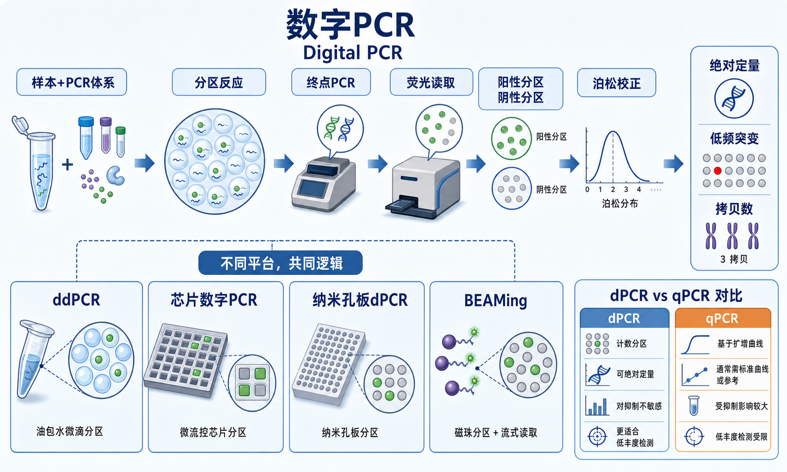

# 数字PCR

Digital polymerase chain reaction（digital PCR，数字 PCR，dPCR）是一类把 PCR 反应先分割成大量独立 partition（分区），再用 endpoint PCR（[终点PCR](../番外/补充知识/终点PCR.md)）判断每个分区是否含有目标分子的核酸定量方法。它的核心不是“某一个品牌仪器”，而是“[分区反应](../番外/补充知识/分区反应.md) + 阳性/阴性判读 + [泊松分布](../番外/补充知识/泊松分布.md) 校正 + [绝对定量](../番外/补充知识/绝对定量.md)”。Bio-Rad 的 digital PCR 教学页也将 dPCR 描述为不需要标准曲线即可进行高灵敏绝对定量的方法，并说明分区、终点 PCR 和 Poisson statistics 是其核心。参考：[Bio-Rad Introduction to Digital PCR](https://www.bio-rad.com/de/life-science/learning-center/introduction-to-digital-pcr)。



一句话理解：[qPCR](qPCR.md) 是看 PCR 扩增曲线何时跨过阈值，digital PCR 是先把样本拆成许多小反应，再数有多少分区是阳性；[ddPCR](ddPCR.md) 只是 digital PCR 的一种微滴分区实现方式，不等于全部 dPCR。

## 实验发明历史与背景

digital PCR 的思想来自 limiting dilution PCR（限制性稀释 PCR）和单分子分区检测。Bio-Rad 的 dPCR 资料将 1992 年 Sykes 等人的 limiting dilution PCR 工作列为早期关键节点：他们认识到限制性稀释、终点 PCR 和 Poisson statistics 可以组合成一种绝对核酸浓度测量方法。1999 年 Vogelstein 和 Kinzler 将样本稀释并分配到多个分区中，使单个模板分子可以独立扩增和检测，并使用 digital PCR 这一概念。参考：[Bio-Rad Introduction to Digital PCR](https://www.bio-rad.com/de/life-science/learning-center/introduction-to-digital-pcr)。

后来 microfluidics（微流控）、oil-water emulsion（油水乳液）、nanowell（纳米孔/微孔）和芯片制造技术让 dPCR 从概念变成可商品化平台。常见形式包括 droplet digital PCR（微滴数字 PCR）、chip digital PCR（[芯片数字PCR](芯片数字PCR.md)）、nanoplate/nanowell digital PCR（[纳米孔板dPCR](纳米孔板dPCR.md)）和 BEAMing（[BEAMing](BEAMing.md)，beads, emulsion, amplification, magnetics）。

Thermo Fisher 的 digital PCR 页面也强调 dPCR 适合 rare mutation（低频突变）和 target sequence（目标序列）的检测与定量，并将其与 qPCR 的区别归结为不同的定量方式带来不同应用优势。参考：[Thermo Fisher Digital PCR](https://www.thermofisher.com/us/en/home/life-science/pcr/digital-pcr.html)。

## 应用场景

| 应用 | dPCR 适合回答的问题 | 主要读数 | 关键限制 |
|---|---|---|---|
| 绝对核酸定量 | 样本中目标分子有多少拷贝 | copies/µL、copies/reaction | 只针对预设靶点 |
| 低频突变检测 | 大量野生型背景中是否有少量突变 | fractional abundance（[突变等位基因频率](../番外/补充知识/突变等位基因频率.md)） | 受 [假阳性背景](../番外/补充知识/假阳性背景.md) 和阈值影响 |
| 拷贝数检测 | 某个位点是否缺失、正常或重复 | [拷贝数比值](../番外/补充知识/拷贝数比值.md) | 位点数少，不适合全局发现 |
| 基因表达 | cDNA 或 RT-dPCR 中目标转录本多少 | transcript copies | 逆转录效率仍是瓶颈 |
| 病原体检测 | 低载量靶核酸是否存在 | 阳性分区数、copies/µL | 临床应用必须验证 |
| NGS 文库定量 | 可扩增文库分子浓度 | amplifiable library molecules | 不能替代片段分布质控 |
| 单细胞/稀有样本 | 少量输入时精确定量 | 分子计数、阳性比例 | 分区数和样本损失影响大 |

Bio-Rad 的教学页列出 dPCR 适合 rare sequence detection（稀有序列检测）、copy number variation（CNV，[拷贝数变异](../番外/补充知识/拷贝数变异.md)）分析、gene expression（基因表达）、pathogen detection（病原体检测）、NGS library analysis（NGS 文库分析）等应用。参考：[Bio-Rad Introduction to Digital PCR](https://www.bio-rad.com/de/life-science/learning-center/introduction-to-digital-pcr)。

## 实验目的

- 在不依赖 [标准曲线](../番外/补充知识/标准曲线.md) 的情况下获得目标分子的绝对浓度。
- 检测低丰度突变、低拷贝病原体、低比例编辑事件或稀有转录本。
- 判断少数目标位点的 CNV 或等位基因比例。
- 在复杂样本或 PCR 抑制物存在时，提高靶向定量稳定性。
- 对 [RT-qPCR](RT-qPCR.md)、[MLPA](MLPA.md)、[NGS CNV分析](NGS CNV分析.md) 或测序结果做正交验证。

## 简要实验原理

### 分区是 dPCR 的核心

dPCR 会把一个反应分成大量 partition（分区）。这些分区可以是微滴、芯片微孔、纳米孔板孔位或微流控腔室。理想情况下，每个分区中目标模板分子的数量是随机分布的，有些分区没有模板，有些有一个，有些有多个。

这一步的意义是把一个连续浓度问题变成许多独立 yes/no 判断。只要总分区数足够、分区体积稳定、分子随机分配成立，就可以通过阳性和阴性分区比例反推原始模板浓度。

### 终点 PCR 与阳性/阴性判读

每个分区内进行 endpoint PCR（终点 PCR）。扩增结束后，含目标模板并成功扩增的分区显示高荧光，被判为 positive partition（阳性分区）；不含目标模板的分区显示低荧光，被判为 negative partition（阴性分区）。

与 real-time quantitative PCR（qPCR，实时定量 PCR）不同，dPCR 通常不依赖 amplification curve（扩增曲线）中的 Cq/Ct 值，因此对扩增效率变化的依赖较低。但这不代表 dPCR 对实验条件不敏感：引物/探针设计差、抑制物、分区失败、阈值不合理或中间荧光群都会影响结果。

### 泊松校正和分子计数

如果一个阳性分区可能含有多个模板分子，就不能简单把“阳性分区数”等同于“模板分子数”。dPCR 用 Poisson correction（泊松校正）估计每个分区平均分子数，再结合 [分区体积](../番外/补充知识/分区体积.md)、分区数和稀释倍数换算浓度。

常见理解公式：

```text
lambda = -ln(negative partitions / total accepted partitions)
```

lambda（λ）代表每个分区平均目标分子数。这个校正是 dPCR 从“数阳性孔/阳性微滴”走向可定量 [分子计数](../番外/补充知识/分子计数.md) 的关键。

### 阈值、rain 和不确定性

dPCR 读数看起来很“数字”，但分析并不机械。threshold（[阈值线](../番外/补充知识/阈值线.md)）决定哪些分区算阳性；阳性和阴性之间的中间荧光信号常被称为 [rain](../番外/补充知识/rain.md)。低阳性事件数、低 accepted partitions、假阳性背景和阈值策略都会影响结果的 [95置信区间](../番外/补充知识/95置信区间.md)。

dMIQE 2020 指南强调 digital PCR 实验报告需要披露样本、分区、阈值、数据分析和质量控制信息，避免只报告最终浓度。参考：[dMIQE 2020 Guidelines](https://pubmed.ncbi.nlm.nih.gov/32746458/)。

## 常见平台类型

| 类型 | 代表形式 | 分区方式 | 优点 | 局限 |
|---|---|---|---|---|
| ddPCR | Bio-Rad QX200、AutoDG 等 | 油包水/水包油微滴 | 文献多、应用成熟、低频检测常用 | 微滴生成和转移需要规范操作 |
| 芯片数字 PCR | Fluidigm BioMark 等历史平台或微流控芯片方案 | 芯片腔室或微流控分区 | 分区位置固定，易追踪 | 平台生态差异大 |
| 纳米孔板 dPCR | QIAcuity、QuantStudio Absolute Q 等 | 固定 nanowell/nanoplate 分区 | workflow 集成度高，自动化友好 | 不同平台数据不可直接横比 |
| BEAMing | beads + emulsion + amplification + magnetics | 磁珠乳液分区并流式读取 | 适合部分低频突变应用 | 流程复杂，平台专用性强 |

## 所需试剂、耗材和设备

| 类别 | 常用内容 | 作用 | 注意事项 |
|---|---|---|---|
| 模板 | DNA、cDNA、cfDNA、RNA 经逆转录产物、NGS 文库 | 被定量的目标核酸 | 样本浓度要落在平台 [动态范围](../番外/补充知识/动态范围.md) 内 |
| 引物/探针 | [PCR引物](<../材(实验耗材工具篇)/PCR引物.md>)、[TaqMan探针](<../材(实验耗材工具篇)/TaqMan探针.md>)、EvaGreen 等 | 定义目标并产生荧光信号 | 低频突变优先用高特异探针 |
| 反应体系 | dPCR/ddPCR supermix、buffer、酶、dNTP | 支持分区内 PCR | 不能随意用普通 qPCR mix 替代 |
| 分区耗材 | [微滴发生油](<../材(实验耗材工具篇)/微滴发生油.md>)、[dPCR芯片](<../材(实验耗材工具篇)/dPCR芯片.md>)、[dPCR纳米孔板](<../材(实验耗材工具篇)/dPCR纳米孔板.md>) | 产生独立反应分区 | 平台耗材不能混用 |
| 扩增设备 | [热循环仪](<../材(实验耗材工具篇)/热循环仪.md>) 或集成扩增模块 | 完成终点 PCR | 封板、蒸发和温控影响分区质量 |
| 读取设备 | [ddPCR仪](<../材(实验耗材工具篇)/ddPCR仪.md>)、QX200、QIAcuity、QuantStudio Absolute Q、Naica System 等 | 读取荧光并输出分区结果 | 记录仪器型号和软件版本 |
| 软件 | QuantaSoft、QX Manager、QIAcuity Software、QuantStudio 软件等 | 阈值、泊松校正和统计分析 | 阈值策略必须记录 |
| 对照 | no-template control（NTC，无模板对照）、野生型对照、突变阳性对照、拷贝数参考样本 | 判断污染、背景和阈值 | 低频检测尤其依赖对照 |

## 实验设计

### 先判断问题是否适合 dPCR

dPCR 最适合预设目标的精准定量，不适合无目标发现。若问题是“这个位点有没有少量突变”“这个拷贝数是 1、2 还是 3”“这个病原体载量很低时到底有多少”，dPCR 很合适。若问题是“全基因组哪里变了”“未知突变是什么”，优先考虑 NGS 或其他扫描型方法。

### 控制分区占有率

模板过少会让阳性分区太少，统计不确定性很大；模板过多会让阴性分区太少，泊松校正不稳定。正式实验前常需要稀释梯度，找到适合平台的阳性分区比例。

### 选择探针法或染料法

Probe-based dPCR（探针法 dPCR）适合低频突变、duplex assay（双重检测）和特异性要求高的场景；dye-based dPCR（染料法 dPCR）成本较低，适合普通片段或文库定量，但非特异扩增和引物二聚体也会产生荧光。

### 报告检测限和定量限

低频检测必须区分 limit of detection（[检测限](../番外/补充知识/检测限.md)，LoD）和 limit of quantification（[定量限](../番外/补充知识/定量限.md)，LoQ）。能检测到一个阳性事件，不等于能稳定定量。低频突变报告中应记录总输入拷贝数、阳性事件数、背景对照和置信区间。

## 实验操作

下面是通用模块化 workflow，不替代具体平台说明书。

### 样本和 assay 准备

做法：

- 提取并定量核酸，记录样本来源、浓度、纯度、完整性和稀释倍数。
- 选择目标引物/探针或染料体系。
- 设置 NTC、阳性对照、阴性对照和必要的参考靶点。

意义：

dPCR 的统计读数不能弥补 assay 本身不特异。样本抑制物、非特异扩增、探针串色和模板浓度不合适都会影响分群。

替代策略：

- 低频突变优先使用经过验证的探针。
- CNV 检测必须加入稳定参考位点。
- RNA 应明确使用 RT-ddPCR 还是先逆转录再 dPCR。

### 分区

做法：

- 根据平台使用微滴、芯片、纳米孔板或微流控系统分区。
- 避免气泡、蒸发、分区数不足、污染和孔位错误。
- 记录分区平台、耗材批号和样本排布。

意义：

分区质量决定 dPCR 的统计基础。分区数低、体积不均、样本泄漏或分区破裂都会降低精度。

替代策略：

- 手动微滴流程需要稳定操作和低吸附耗材。
- 高通量项目可优先考虑自动化分区或一体化纳米孔板平台。

### 终点扩增和荧光读取

做法：

- 完成终点 PCR。
- 读取每个分区的荧光信号。
- 导出原始图、阳性/阴性分区数、浓度和置信区间。

意义：

扩增不足会让阳性分区落入 rain 区域；荧光读取异常会造成群漂移或通道串色。不要只保存最终浓度表，原始分群图是 troubleshooting 的关键。

替代策略：

- rain 多时优化退火温度、引物/探针浓度或样本纯化。
- 低分区数时重做，而不是强行用宽置信区间解释。

### 数据分析

做法：

- 根据对照设置阈值。
- 排除失败孔或异常分区，但要记录标准。
- 报告 concentration、positive partitions、accepted partitions、95% CI、阈值策略和重复孔一致性。

意义：

dPCR 的可靠性来自统计和质量控制共同支持。阈值设置、假阳性背景、低事件数和重复孔差异都可能改变结论。

替代策略：

- 低频检测可用多个重复孔合并提高输入拷贝数。
- 边界 CNV 结果建议用 [MLPA](MLPA.md)、qPCR 或 NGS CNV 交叉验证。

## 结果解析

| 读数 | 含义 | 怎么看 | 常见误区 |
|---|---|---|---|
| accepted partitions | 被软件纳入分析的有效分区 | 越多统计越稳 | 分区数太低仍强行下结论 |
| positive partitions | 高于阈值的阳性分区 | 反映含目标模板的分区数量 | 把 rain 全部算阳性 |
| concentration | 泊松校正后的浓度 | 结合稀释倍数换算原样本浓度 | 忘记稀释和体积 |
| fractional abundance | 突变/总目标比例 | 低频突变核心读数 | 不看野生型背景假阳性 |
| copy number ratio | 目标/参考靶点比例 | 判断缺失、正常或重复 | 参考靶点本身不稳定 |
| 95% CI | 统计不确定性 | 低阳性数时会变宽 | 只报告均值 |
| rain | 中间荧光分区 | 提示扩增或阈值问题 | 简单删除不说明 |

## 异常结果和可能原因

| 异常 | 常见表现 | 可能原因 | 处理思路 |
|---|---|---|---|
| 分区数不足 | accepted partitions 低 | 分区失败、气泡、耗材/油相问题 | 重做分区，检查耗材和加样 |
| 阳性太少 | 低事件数，CI 很宽 | 模板太少、靶标低、反应失败 | 增加输入或合并重复孔 |
| 阳性太多 | 阴性分区太少 | 模板过浓 | 稀释样本 |
| rain 多 | 阳性和阴性之间大量中间点 | 扩增不完全、抑制物、非特异信号 | 优化 assay 和反应条件 |
| NTC 有阳性 | 空白孔出现阳性分区 | 污染、阈值过低、假阳性背景 | 清洁分区，重配体系，评估背景 |
| 重复孔不一致 | 浓度或 FA 波动大 | 加样误差、样本不均、分区数差异 | 增加混匀和重复孔 |
| 双通道串色 | 二维图群体斜带或漂移 | 荧光通道补偿、探针浓度问题 | 优化通道和探针浓度 |

## 数字PCR vs ddPCR/qPCR/MLPA/NGS

| 方法 | 关系或定位 | 适合 | 不适合 |
|---|---|---|---|
| digital PCR | 父级方法，包含多种分区平台 | 预设目标绝对定量 | 未知变异发现 |
| ddPCR | dPCR 的微滴分区实现 | 低频突变、CNV、绝对定量 | 高维未知筛查 |
| qPCR | 实时曲线定量 | 快速、低成本、常规表达 | 极低丰度或小倍数差异 |
| MLPA | 多探针峰面积比例 | 一个基因多外显子 CNV | 低频突变定量 |
| NGS | 大规模测序 | 发现未知变异、全局分析 | 少数位点低成本绝对定量 |

## 记录模板

中文记录：

```text
实验名称：
样本编号：
样本类型：
核酸类型：
dPCR 平台类型：ddPCR / 芯片dPCR / 纳米孔板dPCR / BEAMing
仪器型号：
分区耗材：
反应体系：
引物/探针：
样本输入量与稀释倍数：
分区数 / accepted partitions：
阳性分区：
阴性分区：
阈值设置方法：
浓度结果：
95% CI：
fractional abundance / copy number ratio：
NTC 结果：
阳性/阴性对照：
rain 或异常分群：
结论：
```

English record:

```text
Experiment name:
Sample ID:
Sample type:
Nucleic acid type:
dPCR platform type: ddPCR / chip dPCR / nanoplate dPCR / BEAMing
Instrument model:
Partitioning consumables:
Reaction chemistry:
Primers/probes:
Input amount and dilution factor:
Partition number / accepted partitions:
Positive partitions:
Negative partitions:
Thresholding strategy:
Concentration result:
95% CI:
Fractional abundance / copy number ratio:
NTC result:
Positive/negative controls:
Rain or abnormal clustering:
Conclusion:
```

## 购买和平台建议

- 如果实验室已有 Bio-Rad 的 [QX200](<../材(实验耗材工具篇)/QX200.md>) / AutoDG 生态，继续使用 droplet digital PCR 平台通常最省方法转移成本。
- 如果希望减少手动微滴生成和转移变量，可评估 [QIAcuity](<../材(实验耗材工具篇)/QIAcuity.md>)、[QuantStudio Absolute Q](<../材(实验耗材工具篇)/QuantStudio Absolute Q.md>) 或其他纳米孔板/一体化 dPCR 平台。
- 如果项目涉及特殊低频突变或液体活检历史方案，可以了解 BEAMing，但不要把它当作普通实验室默认方案。
- 购买前重点比较：分区数、通量、每样本成本、支持通道数、软件导出、开放 assay 能力、售后和现有文献生态。
- 记录商业产品时写清 brand、company、catalog number、lot number、软件版本和阈值策略。

## 总结

数字 PCR 的本质是把 PCR 拆成许多独立小反应，再用阳性/阴性分区比例和泊松校正进行绝对分子计数。ddPCR、芯片 dPCR、纳米孔板 dPCR 和 BEAMing 的分区形式不同，但共同逻辑相同。它特别适合预设靶点的绝对定量、低频突变、少数位点 CNV 和复杂样本定量；它不适合无目标发现，也不能脱离对照、阈值、分区数和置信区间来解释。

## 参考来源

- Bio-Rad: [Introduction to Digital PCR](https://www.bio-rad.com/de/life-science/learning-center/introduction-to-digital-pcr)
- Thermo Fisher Scientific: [Digital PCR](https://www.thermofisher.com/us/en/home/life-science/pcr/digital-pcr.html)
- QIAGEN: [QIAcuity Digital PCR System](https://www.qiagen.com/us/products/discovery-and-translational-research/pcr-qpcr-dpcr/digital-pcr/qiaacuity-digital-pcr-system)
- dMIQE Group: [The Digital MIQE Guidelines Update: Minimum Information for Publication of Quantitative Digital PCR Experiments for 2020](https://pubmed.ncbi.nlm.nih.gov/32746458/)
