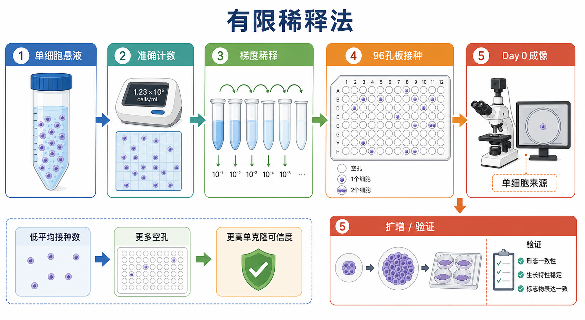

# 有限稀释法

Limiting dilution cloning（有限稀释法）是通过连续稀释细胞悬液，把细胞以很低的平均密度接种到[96孔板](<../材(实验耗材工具篇)/96孔板.md>)中，使部分孔理论上只含有一个起始细胞，再扩增这些单细胞来源的克隆，用于获得[单克隆细胞株](<../番外/补充知识/单克隆细胞株.md>)。

它常用于[稳定细胞系构建](稳定细胞系构建.md)之后，从[混合稳定细胞池](<../番外/补充知识/混合稳定细胞池.md>)中分离更均一的克隆。有限稀释法的关键不是“每孔都种 1 个细胞”，而是用低平均接种数降低一个孔里同时进入多个细胞的概率；代价是会产生很多空孔。



## 实验发明历史

有限稀释法来自微生物学、免疫学和细胞培养中“由单个祖细胞扩增出克隆群体”的思想。早期杂交瘤 monoclonal antibody（单克隆抗体）制备、稳定转染细胞筛选、病毒感染后阳性克隆分离等场景，都需要把混合细胞群拆成单个来源明确的细胞群。

在现代细胞工程中，有限稀释法常与 antibiotic selection（抗生素筛选）、fluorescence-activated cell sorting, FACS（荧光激活细胞分选）、CRISPR-Cas9（clustered regularly interspaced short palindromic repeats-CRISPR associated protein 9，成簇规律间隔短回文重复序列及其相关蛋白 9）基因编辑、reporter cell line（报告细胞系）构建等流程连接。Addgene 的有限稀释 protocol 也把它定位为从稳定混合池获得 monoclonal cell line（单克隆细胞系）的方法之一，并提示单细胞培养能力会受细胞类型影响。参考：[Addgene Limiting Dilution Protocol](https://www.addgene.org/protocols/limiting-dilution/)

## 应用场景

| 场景 | 为什么用有限稀释法 | 主要风险 |
| --- | --- | --- |
| 稳定过表达细胞株 | 从混合稳定池中分离表达更稳定的克隆 | 插入位点差异导致表达量不同 |
| shRNA 稳定敲低细胞株 | 挑选敲低效率和生长状态都合适的克隆 | 单克隆偏差可能被误认为敲低表型 |
| CRISPR 敲除或敲入后筛克隆 | 获得基因型明确的细胞群 | 需要基因型验证，不能只看孔来源 |
| 报告基因细胞系 | 筛选背景低、响应强、长期稳定的克隆 | 报告系统可能随传代漂移 |
| 药物耐受或长期选择模型 | 分离稳定表型亚群 | 可能强化原本就存在的亚群差异 |

有限稀释法不适合所有细胞。某些原代细胞、干细胞、低密度依赖性强的细胞或容易凋亡的细胞，在单细胞状态下很难存活，需要考虑[条件培养基](<../材(实验耗材工具篇)/条件培养基.md>)、基质包被、提高血清/生长因子、ROCK inhibitor（Rho-associated protein kinase inhibitor，ROCK 抑制剂）或直接改用[流式分选](流式分选.md)配合单细胞成像记录。

## 实验目的

有限稀释法要回答的问题是：从一个混合细胞群中，能否获得若干个单细胞来源、可扩增、表型稳定、可验证的独立克隆。

| 目标 | 判断标准 |
| --- | --- |
| 获得单细胞来源克隆 | Day 0 或早期成像记录显示目标孔起始为单细胞 |
| 获得可扩增细胞 | 单细胞能形成可传代的小克隆 |
| 获得目标分子特征 | RNA、蛋白、基因型或荧光读数符合预期 |
| 排除偶然克隆偏差 | 多个独立克隆具有相似方向的关键表型 |
| 建立可复用模型 | 通过污染、身份、冻存和复苏质控 |

## 简要实验原理

有限稀释法的数学基础是[泊松分布](<../番外/补充知识/泊松分布.md>)。如果平均每孔接种数为 λ，那么每孔实际进入 0 个、1 个或多个细胞的概率不是固定的，而是随机分布。

| 平均接种数 λ | 空孔概率 | 单细胞孔概率 | 多细胞孔概率 | 含细胞孔中单细胞比例 |
| --- | --- | --- | --- | --- |
| 1.0 cell/well | 约 36.8% | 约 36.8% | 约 26.4% | 约 58.2% |
| 0.5 cell/well | 约 60.7% | 约 30.3% | 约 9.0% | 约 77.1% |
| 0.3 cell/well | 约 74.1% | 约 22.2% | 约 3.7% | 约 85.8% |

所以，降低平均接种数会让空孔变多，但会减少多细胞孔，让“有细胞的孔更可能来自单细胞”。这就是有限稀释法看起来浪费孔位，但能提高单克隆可信度的原因。

需要注意：泊松分布只能给出概率，不能证明某个孔一定单细胞来源。真正的单克隆证据来自早期显微成像、单孔生长轨迹记录、后续分子验证和多个克隆并行比较。

## 所需试剂、材料与设备

| 类别 | 内容 | 作用与注意事项 |
| --- | --- | --- |
| 起始细胞 | 混合稳定池、编辑后细胞池或待克隆化细胞 | 最好在状态稳定、污染阴性、选择压力明确时开始 |
| 培养体系 | 完全培养基、必要补充剂、条件培养基或支持因子 | 单细胞低密度生长比常规培养更苛刻 |
| 板材 | 96 孔细胞培养板 | 建议选择适合目标细胞贴壁/悬浮状态的板型 |
| 计数工具 | [细胞计数](细胞计数.md)、血球计数板或自动细胞计数仪 | 计数误差会直接放大为每孔细胞数误差 |
| 接种工具 | 移液枪、多道移液枪、无菌加样槽 | 混匀和移液一致性很关键 |
| 成像工具 | [倒置显微镜](<../材(实验耗材工具篇)/倒置显微镜.md>)、活细胞成像系统 | Day 0/Day 1 记录单细胞来源证据 |
| 扩增材料 | 24 孔板、12 孔板、6 孔板、培养皿或培养瓶 | 扩增过程要避免克隆间交叉污染 |
| 验证实验 | RT-qPCR、Western blot、Sanger 测序、流式细胞术等 | 根据构建目的选择 |

## 实验操作

### 准备起始细胞

从状态良好的细胞池开始，尽量避免在细胞刚经历强烈筛选、大量死亡、污染可疑或形态异常时进行单克隆化。对于稳定构建株，最好先确认目标抗生素筛选已经基本完成，且细胞池中阴性细胞比例足够低。

为什么重要：有限稀释会把群体差异放大成克隆差异。如果起始池很混乱，最后得到的克隆可能代表“幸存者偏差”，而不是真正的目标构建效果。

注意事项：

| 检查点 | 建议 |
| --- | --- |
| 细胞状态 | 形态均一、贴壁或悬浮状态正常、无明显碎片 |
| 传代号 | 记录清楚，避免过高传代 |
| 污染 | 关键项目开始前应做支原体检测 |
| 表达/筛选 | 稳定池最好先确认目标表达或筛选标记存在 |

### 制备单细胞悬液

把细胞处理成尽可能均一的 single-cell suspension（单细胞悬液）。贴壁细胞通常需要消化、轻柔吹打并充分混匀；如果细胞容易成团，可考虑细胞筛网过滤，但要评估过滤造成的损失和应激。

为什么重要：细胞团会破坏有限稀释的前提。你以为每孔是一个“细胞事件”，实际可能是一团细胞进入同一个孔，后续形成的克隆就不能视为单细胞来源。

可能出错：

| 现象 | 原因 | 后果 |
| --- | --- | --- |
| 细胞团很多 | 消化不足、DNA 黏连、吹打不充分 | 多细胞孔比例上升 |
| 细胞死亡多 | 消化过度、离心过强、低温或暴露太久 | 单细胞成活率下降 |
| 计数结果波动大 | 悬液未混匀或浓度太高 | 实际每孔细胞数偏离设计 |

### 准确计数与梯度稀释

先做准确[细胞计数](细胞计数.md)，再通过中间稀释液逐级稀释到目标浓度。不要直接从高浓度细胞悬液移取极小体积到大量培养基中，因为微升级以下误差会很大。

常见目标是让最终每孔平均进入约 0.3-0.5 个细胞。这个范围不是硬性规定，而是“单细胞可信度”和“可获得克隆数量”之间的折中。

操作意义：

| 操作 | 为什么重要 |
| --- | --- |
| 先做中间稀释 | 避免移取过小体积造成巨大误差 |
| 接种前持续轻柔混匀 | 细胞会沉降，后接种的孔可能细胞更少 |
| 设置多个板 | 空孔很多是预期结果，单板产量有限 |
| 保留记录 | 后续克隆数量异常时能追溯 |

### 96 孔板接种

把稀释后的细胞悬液加入 96 孔板，每孔体积保持一致。接种后尽量减少晃动和反复搬动，让细胞自然沉降和贴壁。

注意事项：

| 注意点 | 原因 |
| --- | --- |
| 避免气泡 | 气泡会影响细胞沉降和显微观察 |
| 接种时保持悬液混匀 | 细胞沉降会造成前后孔密度不一致 |
| 可避开边缘孔或设置边缘填充 | 边缘孔更容易蒸发和出现边缘效应 |
| 标记板方向 | 后续追踪孔位时避免混淆 |

### Day 0 或早期成像确认

有限稀释法最容易被忽略但最关键的一步，是在接种当天或细胞尚未明显分裂前记录每个候选孔是否真的只有一个细胞。可以用倒置显微镜逐孔观察，也可以用活细胞成像系统自动记录。

为什么重要：如果没有早期单细胞证据，后面看到一个漂亮克隆，也只能说“这个孔长出了一个克隆样群体”，不能强证明它来自单细胞。Addgene 的 protocol 也提醒需要扫描板并排除出现多个 colony（克隆团）的孔。参考：[Addgene Limiting Dilution Protocol](https://www.addgene.org/protocols/limiting-dilution/)

记录建议：

| 记录项 | 目的 |
| --- | --- |
| 孔位 | 保证后续扩增不混淆 |
| Day 0 图像 | 证明起始为单细胞或排除多细胞孔 |
| Day 3-7 图像 | 观察是否由同一位置扩增 |
| 是否多克隆团 | 多个独立 colony 的孔应排除 |
| 细胞形态 | 过度异常的克隆不应只因表达强就保留 |

### 培养、观察和换液

单细胞状态下细胞很脆弱，早期不要频繁扰动。是否换液、何时换液、换多少，取决于细胞类型、培养基颜色、孔内蒸发和细胞生长速度。

替代策略：

| 问题 | 可选策略 |
| --- | --- |
| 单细胞不长 | 使用条件培养基、提高血清比例、加入必要生长因子、使用基质包被 |
| 细胞贴壁差 | 换组织培养处理板、包被胶原/明胶/Poly-L-lysine 等 |
| 细胞对低密度敏感 | 先用混合池扩增，降低压力后再单克隆化 |
| 表达构建体有毒 | 使用诱导表达系统，或挑选低表达但表型稳定克隆 |

### 克隆扩增

当单个孔中的细胞形成小克隆并达到适合操作的密度时，逐步扩增到更大的培养面积。扩增顺序通常是 96 孔板到 24 孔板，再到 6 孔板或更大容器。

为什么重要：扩增太早，细胞数不足，容易丢克隆；扩增太晚，孔内过度融合、营养耗尽或选择压力过强，会改变细胞状态。

注意事项：

| 注意点 | 影响 |
| --- | --- |
| 每次只处理少量克隆 | 减少孔位混淆和交叉污染 |
| 单独编号 | 每个克隆都是独立实验对象 |
| 保留早期冻存 | 后续验证失败或漂移时可回退 |
| 不只保留一个克隆 | 避免把克隆效应误认为目标基因效应 |

### 分子与表型验证

有限稀释只解决“克隆来源更单一”的问题，不自动证明构建成功。每个候选克隆都需要按实验目的验证。

| 构建目的 | 推荐验证 |
| --- | --- |
| 过表达 | RNA 水平、蛋白水平、定位、功能表型 |
| shRNA 敲低 | RT-qPCR、Western blot、多条 shRNA 一致性 |
| CRISPR 敲除 | 目标位点测序、蛋白缺失、功能缺失 |
| 报告细胞 | 背景信号、刺激响应、动态范围、传代稳定性 |
| 药物相关模型 | 生长曲线、药敏曲线、关键通路验证 |

对于重要结论，建议至少比较多个独立克隆，并把趋势和[克隆效应](<../番外/补充知识/克隆效应.md>)区分开。只挑一个“最符合预期”的克隆直接做后续机制，风险很高。

## 结果解析

| 结果 | 可能含义 | 下一步 |
| --- | --- | --- |
| 空孔很多 | 低平均接种数下的正常现象 | 不是失败，可增加板数 |
| 有细胞孔少但大多单细胞 | 单克隆可信度较高 | 继续追踪并扩增 |
| 很多孔有多个 colony | 接种密度过高或细胞成团 | 降低接种密度，改善单细胞悬液 |
| Day 0 单细胞，后续不生长 | 低密度应激、培养体系不支持、构建体有毒 | 优化条件培养基或支持因子 |
| 多个克隆表达差异很大 | 插入位点、拷贝数、启动子沉默或克隆效应 | 保留多个克隆并分层验证 |
| 单克隆和混合池表型不一致 | 混合池平均效应或单克隆偏差 | 回到多个克隆和 rescue 实验判断 |

## 异常结果与原因

| 异常 | 常见原因 | 处理思路 |
| --- | --- | --- |
| 几乎全空孔 | 接种浓度过低、细胞死亡、计数错误 | 重新计数，增加平均接种数或增加板数 |
| 几乎每孔都有细胞 | 接种浓度过高 | 降低目标 λ，重新铺板 |
| 克隆长得很慢 | 单细胞压力、培养基不适合、目标构建影响增殖 | 使用条件培养基，降低选择压力，延长观察 |
| 后续发现多个克隆团 | Day 0 未记录或观察不充分 | 排除该孔，不作为单克隆 |
| 扩增时丢克隆 | 消化过度、转移体积损失、细胞数太少 | 等待更合适密度，轻柔操作，保留原孔备份 |
| 验证结果漂移 | 启动子沉默、选择压力变化、传代过久 | 缩短使用窗口，早期冻存，定期复测 |

## 与相关方法的区别

| 方法 | 优点 | 缺点 | 适合场景 |
| --- | --- | --- | --- |
| 有限稀释法 | 便宜、设备要求低、对多数实验室可行 | 空孔多，单细胞证据依赖成像记录 | 常规稳定株单克隆化 |
| 流式单细胞分选 | 可按荧光/表面标志物选择单细胞 | 对细胞压力大，需要仪器和无菌分选条件 | 荧光阳性筛选、稀有群体分离 |
| 克隆环/克隆柱挑取 | 可从培养皿中挑取单个 colony | 需要 colony 空间分离清楚 | 贴壁细胞克隆挑选 |
| 软琼脂克隆 | 可结合 anchorage-independent growth（非贴壁依赖生长） | 操作周期长，不适合所有细胞 | 肿瘤细胞克隆能力研究 |
| [克隆形成实验](克隆形成实验.md) | 评估单细胞增殖形成克隆的能力 | 主要是功能读数，不是建稳定单克隆株 | 放疗、药物、增殖能力评估 |

Rockefeller University Flow Cytometry Resource Center 提到现代细胞分选仪可进行高纯度无菌分选，并可分选到 96 孔或 384 孔板中，这也是有限稀释法之外获得单细胞的常见路线。参考：[Rockefeller University Flow Cytometry Resource Center](https://www.rockefeller.edu/fcrc/)

## 推荐记录模板

中文模板：

```text
项目名称：
起始细胞池：
构建背景：
传代号：
培养基/补充剂：
是否使用条件培养基：
板型：
目标平均接种数：
细胞计数方法：
稀释方案：
接种日期：
Day 0 成像日期：
候选单细胞孔位：
排除孔位及原因：
首次观察到 colony 日期：
扩增日期：
克隆编号：
验证项目：
验证结果：
冻存批号：
备注：
```

English template:

```text
Project:
Starting cell pool:
Construct background:
Passage number:
Medium/supplements:
Conditioned medium used:
Plate format:
Target average seeding density:
Cell counting method:
Dilution scheme:
Seeding date:
Day 0 imaging date:
Candidate single-cell wells:
Excluded wells and reasons:
First colony observation date:
Expansion date:
Clone ID:
Validation assays:
Validation results:
Freeze lot:
Notes:
```

## 总结

有限稀释法的本质是用概率换取单细胞来源可信度：平均接种数越低，空孔越多，但多细胞孔越少。真正可靠的单克隆构建不能只靠“孔里长出一个克隆”，还要有 Day 0/早期成像记录、后续扩增轨迹、分子验证和多个独立克隆的比较。对于关键机制研究，有限稀释法得到的克隆应被视为“候选单克隆”，直到完成身份、表达、基因型和功能验证。

## 参考来源

- [Addgene: Isolating a Monoclonal Cell Population by Limiting Dilution](https://www.addgene.org/protocols/limiting-dilution/)
- [Rockefeller University Flow Cytometry Resource Center](https://www.rockefeller.edu/fcrc/)
- [ATCC Animal Cell Culture Guide](https://www.atcc.org/resources/culture-guides/animal-cell-culture-guide)
