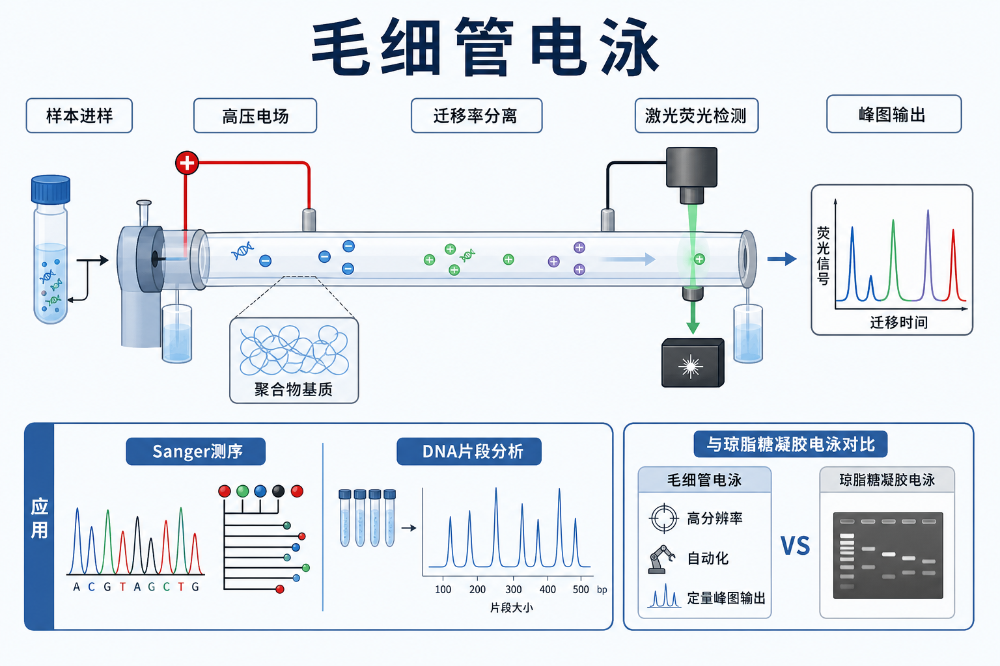

# 毛细管电泳

Capillary electrophoresis（CE，毛细管电泳）是在细毛细管中施加高压电场，使带电分子按 [电泳迁移率](../番外/补充知识/电泳迁移率.md)、大小、构象或与筛分基质相互作用差异发生分离的技术。它在生命科学中最常见的用途包括 [Sanger测序](Sanger测序.md)、[DNA片段分析](DNA片段分析.md)、[STR分析](STR分析.md)、核酸质量分析和部分蛋白/糖基化分析。



一句话理解：传统 [琼脂糖凝胶电泳](琼脂糖凝胶电泳.md) 是在平板胶里看条带；毛细管电泳是在细毛细管里自动分离分子，并把荧光或吸收信号转换成可定量的峰图。

## 实验发明历史与背景

毛细管电泳可以看作 electrophoresis（电泳）的微型化、自动化和高分辨率版本。传统 slab gel electrophoresis（板式凝胶电泳）适合肉眼观察条带，但人工灌胶、上样、成像和读带会带来较多主观误差。毛细管系统把分离通道缩小到细管中，利用高电场、自动进样、温控、在线检测和软件分析，提高了分辨率、通量和定量能力。

在 DNA 测序领域，现代 dye-terminator Sanger sequencing（荧光染料终止子 Sanger 测序）最终依赖毛细管电泳分离不同长度的荧光终止片段，再由检测器读取荧光信号。[Thermo Fisher Scientific](<../番外/试剂厂商/Thermo Fisher Scientific.md>) 的 Sanger sequencing 资料也把现代流程概括为 cycle sequencing（循环测序）、capillary electrophoresis（毛细管电泳）和数据分析。参考：[Thermo Fisher Sanger Sequencing](https://www.thermofisher.com/us/en/home/life-science/sequencing/sanger-sequencing.html)。

在 fragment analysis（片段分析）领域，毛细管电泳不是读取碱基顺序，而是通过荧光标记片段的迁移时间和内标校准估算片段大小，可用于 STR、microsatellite、AFLP、SNaPshot、MLPA 或 CRISPR indel 初筛等。Thermo Fisher 的 fragment analysis 页面也将其定位为基于毛细管电泳的片段大小分析 workflow。参考：[Thermo Fisher Fragment Analysis](https://www.thermofisher.com/us/en/home/life-science/sequencing/fragment-analysis.html)。

## 应用场景

- Sanger 测序：分离荧光 ddNTP 终止片段，输出 chromatogram（测序峰图）。
- DNA 片段分析：用荧光引物标记目标片段，通过迁移时间估算片段大小。
- STR 分析：检测 short tandem repeat（短串联重复序列）的等位基因片段长度。
- 基因分型：根据片段大小、峰面积或峰高判断不同样本的 genotype（基因型）。
- 核酸质控：如 [Bioanalyzer](<../材(实验耗材工具篇)/Bioanalyzer.md>)、[TapeStation](<../材(实验耗材工具篇)/TapeStation.md>) 或同类微流控电泳平台评估 DNA/RNA 片段分布。
- 蛋白分析：如 CE-SDS（capillary electrophoresis sodium dodecyl sulfate，毛细管 SDS 电泳）用于蛋白大小相关分离，常见于抗体药物和蛋白质质量分析。

## 实验目的

毛细管电泳的目的不是单纯“让样本跑起来”，而是把样本中不同迁移行为的组分转化为可记录、可比较、可定量的峰图。

- 分离：按电荷、大小或筛分行为分开目标分子。
- 检测：通过 fluorescence（荧光）、UV absorbance（紫外吸收）或其他检测方式记录信号。
- 定量：用峰高、[峰面积](../番外/补充知识/峰面积.md)、迁移时间和内标校准比较样本。
- 鉴定：在 Sanger 中读序列；在 fragment analysis 中估算片段长度。
- 质控：判断反应是否干净、片段分布是否正确、是否存在杂峰或污染。

## 简要实验原理

### 毛细管和高压电场

毛细管通常是内径很小的 fused-silica capillary（熔融石英毛细管）或毛细管阵列。样本从一端注入后，在高压电场下迁移。由于毛细管散热效率高，可以使用较高电场强度，从而获得快速和高分辨率分离。

### 电泳迁移率和筛分

分子的迁移取决于电荷、大小、形状、缓冲液、温度、毛细管内壁相互作用以及是否存在 [聚合物基质](<../材(实验耗材工具篇)/聚合物基质.md>)。在 Sanger 测序和 DNA 片段分析中，毛细管常填充可更换的 polymer matrix（聚合物筛分基质），让不同长度的 DNA 片段像在凝胶中一样被筛分。

### 电渗流

Electroosmotic flow（[电渗流](../番外/补充知识/电渗流.md)，EOF）是毛细管内壁表面电荷和电场共同造成的整体液流。它在 capillary zone electrophoresis（[毛细管区带电泳](../番外/补充知识/毛细管区带电泳.md)）中很关键，但在 DNA 测序用聚合物基质和涂层毛细管中通常会被控制或抑制，以减少分离波动。

### 在线检测和峰图输出

分离后的组分经过 detection window（检测窗口）时被检测。Sanger 和片段分析常用 laser-induced fluorescence（[激光诱导荧光](../番外/补充知识/激光诱导荧光.md)，LIF）：激光激发荧光染料，检测器记录不同颜色和强度，软件输出 electropherogram（电泳图谱/峰图）。如果是 Sanger，峰图被进一步判读为 A/T/G/C 序列；如果是片段分析，峰图用于估算片段大小和峰面积。

## 常见模式

| 模式 | 英文全称 | 核心分离依据 | 常见用途 |
|---|---|---|---|
| [毛细管区带电泳](../番外/补充知识/毛细管区带电泳.md) | Capillary zone electrophoresis, CZE | 电荷/摩擦阻力/电渗流差异 | 小分子、离子、部分蛋白分析 |
| [毛细管凝胶电泳](../番外/补充知识/毛细管凝胶电泳.md) | Capillary gel electrophoresis, CGE | 聚合物或凝胶筛分 | DNA 测序、DNA 片段分析、蛋白大小分离 |
| [CE-SDS](CE-SDS.md) | Capillary electrophoresis sodium dodecyl sulfate | SDS 赋予蛋白近似均一负电荷后按大小分离 | 蛋白质、抗体药物质量分析 |
| [微流控芯片电泳](微流控芯片电泳.md) | Microfluidic chip electrophoresis | 芯片微通道分离 | Bioanalyzer、TapeStation 类核酸质控 |

这些模式共享“电场驱动迁移”的底层逻辑，但样本制备、通道材料、基质、检测器和数据解释完全不同，不能把一个平台的 protocol 直接套到另一个平台。

## 所需试剂、耗材和设备

| 类别 | 常用内容 | 作用 | 注意事项 |
|---|---|---|---|
| 分离系统 | [毛细管测序仪](<../材(实验耗材工具篇)/毛细管测序仪.md>)、遗传分析仪、CE 仪 | 自动进样、分离和检测 | 记录仪器型号、软件版本和 capillary array 信息 |
| 分离通道 | [毛细管阵列](<../材(实验耗材工具篇)/毛细管阵列.md>)、毛细管 cartridge | 提供分离路径 | 老化、堵塞或气泡会影响峰形 |
| 分离介质 | 聚合物基质、running buffer | 筛分和导电 | 聚合物批号、保存和上机次数影响结果 |
| 样本处理 | Hi-Di 甲酰胺、测序反应纯化试剂盒、磁珠或乙醇沉淀 | 变性、去盐、去游离染料 | 盐、乙醇和染料残留会导致异常峰 |
| 标准品 | [尺寸标准品](<../材(实验耗材工具篇)/尺寸标准品.md>)、[荧光内标](<../材(实验耗材工具篇)/荧光内标.md>)、ladder | 校准迁移时间和片段大小 | 片段分析必须使用合适内标 |
| 检测 | 激光诱导荧光、UV 检测器 | 记录信号 | 染料组和仪器光谱校准要匹配 |
| 数据软件 | base calling、fragment analysis 或 QC 软件 | 输出序列、峰图或片段大小 | 不要只看自动结果，要看原始峰图 |

## 实验设计

### 先判断你要读“序列”还是“片段大小”

| 目标 | 选择 | 输出 |
|---|---|---|
| 想知道 A/T/G/C 顺序 | Sanger 测序 | 测序峰图、序列、质量信息 |
| 想知道片段多长 | DNA 片段分析 | 片段大小、峰高、峰面积 |
| 想看 DNA/RNA 片段分布 | Bioanalyzer/TapeStation 类平台 | 电泳图谱、片段分布、RIN/DIN 等指标 |
| 想分析蛋白大小/纯度 | CE-SDS 或蛋白 CE 平台 | 蛋白峰图、相对含量 |

这个判断非常重要。Sanger 图谱中的彩色峰代表碱基顺序；片段分析中的峰代表不同长度的荧光片段；核酸质控平台中的峰代表样本中片段分布。三者不能互相替代。

### 样本必须干净

毛细管电泳对盐、乙醇、颗粒、游离染料、蛋白和高浓度杂质很敏感。Sanger 样本应做好 [ExoSAP酶促纯化](ExoSAP酶促纯化.md)、[PCR产物纯化](PCR产物纯化.md) 或 [凝胶回收](凝胶回收.md)；片段分析样本要避免过量 PCR 产物、残余引物和非特异荧光片段。

### 内标和校准

片段分析必须依赖 internal size standard（内标/尺寸标准品）校准迁移时间。没有内标时，迁移时间会受到毛细管状态、温度、聚合物、缓冲液和电场波动影响，无法可靠换算成片段大小。

### 与琼脂糖凝胶电泳的区别

| 对比点 | 毛细管电泳 | 琼脂糖凝胶电泳 |
|---|---|---|
| 分离通道 | 细毛细管或毛细管阵列 | 平板凝胶 |
| 检测方式 | 在线荧光/UV，软件输出峰图 | 成像系统拍条带 |
| 分辨率 | 通常更高 | 取决于胶浓度和跑胶条件 |
| 定量性 | 峰高/峰面积更适合比较 | 条带强度半定量 |
| 自动化 | 高 | 较低 |
| 成本和门槛 | 仪器和耗材较高 | 低，适合日常检查 |
| 最适合 | 测序、片段分析、高分辨 QC | 快速确认条带大小和有无 |

## 实验操作

下面是通用 workflow，不替代具体仪器和试剂盒 SOP。不同平台的 capillary array、polymer、buffer、染料组和软件参数差异很大。

### 样本准备

做法：

- 根据应用选择样本：Sanger 反应产物、荧光 PCR 片段、DNA/RNA QC 样本或蛋白样本。
- 去除盐、乙醇、颗粒、游离染料和残余引物。
- 必要时加入 Hi-Di 甲酰胺、荧光内标或平台指定上样液。
- 按 plate map 记录样本孔位。

为什么重要：

毛细管通道很细，样本中的盐、颗粒或沉淀会造成电流异常、进样失败、峰拖尾或毛细管堵塞。样本孔位错误则会让整板数据失去可追溯性。

### 仪器和耗材检查

做法：

- 确认毛细管阵列、聚合物、running buffer 和 waste 状态。
- 检查仪器维护记录、光谱校准和空间校准。
- 选择与染料组、应用类型和片段范围匹配的 run module。

为什么重要：

毛细管电泳结果强依赖仪器状态。毛细管老化、聚合物变质、气泡、温控异常或光谱校准不匹配都会影响峰形和迁移时间。

### 进样

做法：

- 仪器通过电动进样或压力进样把样本引入毛细管。
- 根据样本浓度和应用选择合适进样参数。
- 避免样本过浓或盐浓度过高。

为什么重要：

进样过少会导致峰弱；进样过多会导致峰过载、拖尾、分辨率下降或 pull-up 峰。片段分析尤其需要控制峰高在软件推荐范围内。

### 分离和检测

做法：

- 高压电场驱动分子在毛细管中迁移。
- 聚合物基质或 buffer 决定分离窗口。
- 检测器在固定窗口记录荧光或吸收信号。

为什么重要：

迁移时间不是绝对分子大小，需要标准品或内标校准。温度、聚合物、毛细管状态和样本基质都会改变迁移行为。

### 数据分析

做法：

- Sanger：查看 `.ab1` 或等效原始峰图，判断 base calling 和重叠峰。
- 片段分析：用内标校准片段大小，查看峰高、峰面积、stutter、pull-up 和加 A 峰。
- QC 平台：查看片段分布、电泳图谱和软件质量指标。

为什么重要：

毛细管电泳的原始数据是峰图。软件自动结果很方便，但异常峰、重叠峰、染料串色和基线问题必须人工确认。

## 结果解析

### 理想结果

- 峰形尖锐、对称，基线平稳。
- 内标峰完整，迁移时间稳定。
- Sanger 峰图颜色分离良好，重叠峰少。
- 片段分析中目标峰在预期大小范围内，峰高不过载。
- 阴性对照无目标峰，阳性对照符合预期。

### 常见异常结果

| 异常表现 | 可能原因 | 调整策略 |
|---|---|---|
| No signal | 样本未进样、荧光标记失败、模板太少、孔位错误 | 检查 plate map、样本浓度和标记反应 |
| Weak signal | 样本太低、进样不足、荧光衰减 | 增加样本量或优化进样参数 |
| Overloaded peaks | 样本太浓、进样过多 | 稀释样本，降低进样量 |
| Broad peaks | 盐高、聚合物老化、毛细管状态差 | 重新纯化样本，更换聚合物或维护毛细管 |
| Split peaks | 样本构象/退火状态异常、温控或基质问题 | 充分变性，检查 run module 和温控 |
| Dye blob | 游离染料去除不充分 | 改善反应后纯化 |
| Pull-up peaks | 光谱校准或信号过强导致颜色串扰 | 降低样本量，重做光谱校准 |
| 内标缺失 | 内标未加入、降解或进样失败 | 重新配样并确认内标 |
| 迁移时间漂移 | 温度、聚合物、毛细管或 buffer 状态变化 | 检查仪器状态和耗材批次 |

## 与相似技术对比

| 技术 | 输出 | 优点 | 局限 | 适合 |
|---|---|---|---|---|
| 毛细管电泳 | 峰图、序列或片段大小 | 高分辨率、自动化、定量性好 | 仪器和耗材成本高 | 测序、片段分析、精细 QC |
| 琼脂糖凝胶电泳 | 条带图 | 便宜、直观、适合日常检查 | 分辨率和定量性有限 | PCR 检查、酶切检查、胶回收 |
| PAGE | 高分辨条带 | 小片段分辨好 | 操作更复杂，聚丙烯酰胺有安全压力 | 小 DNA/RNA、蛋白凝胶 |
| 微流控芯片电泳 | 自动电泳图谱 | 样本量小，QC 快 | 平台和芯片成本高 | RNA/DNA 质量分析 |
| HPLC/UPLC | 色谱峰 | 分离机制多样，适合小分子/蛋白 | 不按电泳迁移率分离 | 药物、小分子、蛋白分析 |

## 推荐记录模板

### 中文记录模板

```text
实验日期：
应用类型：Sanger测序 / DNA片段分析 / STR分析 / 核酸质控 / 蛋白CE
样本名称：
样本前处理：
仪器型号：
软件版本：
毛细管阵列或 cartridge：
聚合物或分离基质：
running buffer：
染料组：
内标或尺寸标准品：
run module：
进样方式和参数：
峰图质量：
目标峰或读长：
异常峰：
处理和结论：
```

### English record template

```text
Date:
Application: Sanger sequencing / DNA fragment analysis / STR analysis / nucleic-acid QC / protein CE
Sample ID:
Sample preparation:
Instrument model:
Software version:
Capillary array or cartridge:
Polymer or separation matrix:
Running buffer:
Dye set:
Internal size standard:
Run module:
Injection mode and parameters:
Electropherogram quality:
Target peaks or read length:
Abnormal peaks:
Actions and conclusion:
```

## 小结

毛细管电泳的核心价值是把电泳分离从“看胶条带”推进到“自动化、在线检测、可定量峰图”。在 Sanger 测序中，它负责把链终止片段分开并读出碱基；在 DNA 片段分析中，它负责用内标校准片段大小。读 CE 结果时不要只看软件给出的最终序列或片段大小，必须回到峰图本身，检查峰形、内标、基线、串色、过载和迁移时间是否合理。

## 参考来源

- Thermo Fisher Scientific. Sanger Sequencing. https://www.thermofisher.com/us/en/home/life-science/sequencing/sanger-sequencing.html
- Thermo Fisher Scientific. Fragment Analysis. https://www.thermofisher.com/us/en/home/life-science/sequencing/fragment-analysis.html
- Thermo Fisher Scientific. SeqStudio Genetic Analyzer. https://www.thermofisher.com/order/catalog/product/A35644
- Agilent. Bioanalyzer Systems. https://www.agilent.com/en/product/automated-electrophoresis/bioanalyzer-systems
- Agilent. TapeStation Systems. https://www.agilent.com/en/product/automated-electrophoresis/tapestation-systems
- SCIEX. Capillary Electrophoresis. https://sciex.com/products/capillary-electrophoresis
