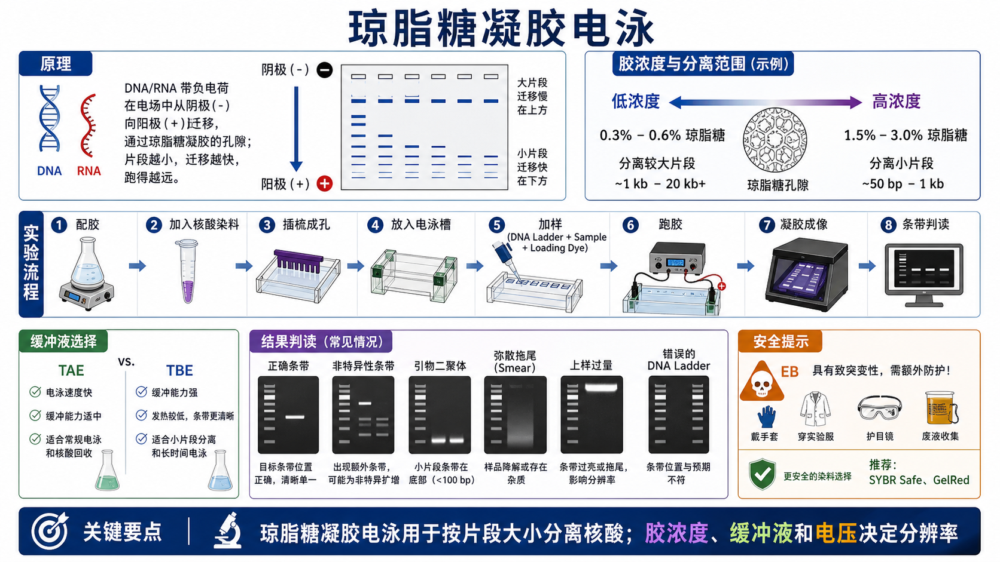
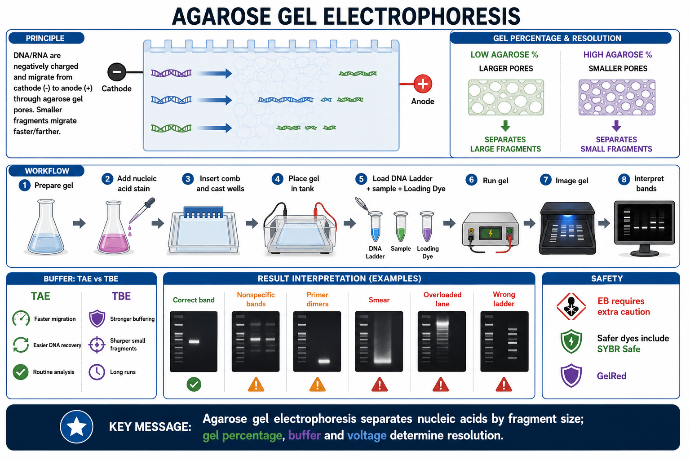

# 琼脂糖凝胶电泳

Agarose gel electrophoresis（琼脂糖凝胶电泳）是用 [琼脂糖](<../材(实验耗材工具篇)/琼脂糖.md>) 凝胶作为分子筛，在电场中按片段大小分离 DNA 或 RNA 的基础实验。它最常用于检查 [PCR](PCR.md) 产物、酶切片段、质粒构象、核酸提取质量、[支原体检测](支原体检测.md) PCR 结果以及后续胶回收前的目标条带确认。





一句话理解：DNA/RNA 通常带负电，会从阴极向阳极迁移；琼脂糖凝胶的孔径像筛子一样限制核酸通过，小片段跑得更快、更远，大片段跑得更慢、更靠近上样孔。

## 实验发明历史与背景

Gel electrophoresis（凝胶电泳）是分子生物学最基础的核酸分析方法之一。Current Protocols 的 Agarose Gel Electrophoresis 单元将其描述为分离和估算线性 DNA/RNA 片段大小的基础技术，常用于 PCR 产物、质粒 DNA、限制性酶切产物、Northern blot 和 Southern blot 前处理。参考：[Armstrong and Schulz, 2015, Current Protocols](https://currentprotocols.onlinelibrary.wiley.com/doi/abs/10.1002/9780470089941.et0702s10)。

这项技术的核心价值不是“把样本跑出条带”这么简单，而是把不可见的核酸样本转换成可视化信息：

- 目标片段有没有扩增出来。
- 片段大小是否符合预期。
- 是否存在非特异条带、引物二聚体或降解拖尾。
- 质粒是否有不同构象。
- 是否可以切胶回收目标片段。

Addgene 的 agarose gel electrophoresis protocol 也强调，DNA 在电场中向正极迁移，短片段比长片段穿过凝胶更快，因此可以与 [DNA Ladder](<../材(实验耗材工具篇)/DNA Ladder.md>) 对照估算片段长度。参考：[Addgene Agarose Gel Electrophoresis Protocol](https://www.addgene.org/protocols/gel-electrophoresis/)。

## 应用场景

- PCR 产物检查：确认目标条带大小、扩增效率和非特异扩增。
- 支原体 PCR 检测：确认是否出现特定大小扩增条带。
- 限制性内切酶酶切鉴定：判断插入片段、载体骨架或线性化质粒是否符合预期。
- 质粒提取质控：观察超螺旋、开环、线性等 [DNA构象](../番外/补充知识/DNA构象.md)。
- RNA 提取初筛：观察 rRNA 条带和严重降解情况，但更精细的 RNA 质控应使用 Bioanalyzer、TapeStation 或同类仪器。
- [凝胶回收](凝胶回收.md)：切下目标条带并纯化，用于克隆、测序或连接反应。
- 估算核酸片段大小和粗略含量。

Thermo Fisher 的 agarose gel electrophoresis 页面也将琼脂糖凝胶电泳定义为按大小分离 DNA/RNA 片段的标准实验，并强调选择高质量琼脂糖、DNA ladder 和核酸染料对分离效果和可视化很重要。参考：[Thermo Fisher Agarose Gel Electrophoresis](https://www.thermofisher.com/us/en/home/life-science/dna-rna-purification-analysis/nucleic-acid-gel-electrophoresis/agarose-gel-electrophoresis.html)。

## 实验目的

琼脂糖凝胶电泳通常有四类目的：

- 验证：看目标核酸片段是否存在、大小是否正确。
- 比较：比较不同样本的条带强度、条带位置和背景。
- 诊断：判断 PCR 非特异、引物二聚体、样本降解、盐污染或上样过量。
- 制备：切胶回收目标片段，用于后续克隆、测序、连接或建库。

如果只是精确定量 DNA/RNA 浓度，电泳不是最合适的主方法，应结合分光光度计、荧光定量或毛细管电泳平台。电泳更适合看“片段大小和完整性”。

## 简要实验原理

核酸的磷酸骨架带负电，在电场中向正极迁移；迁移速度可以理解为 [电泳迁移率](../番外/补充知识/电泳迁移率.md) 的实验表现。琼脂糖凝胶冷却后形成多孔网络，孔径由 [凝胶浓度](../番外/补充知识/凝胶浓度.md) 决定：琼脂糖比例越低，孔径越大，更适合分离大片段；琼脂糖比例越高，孔径越小，更适合分离小片段。

Bio-Rad 的 nucleic acid electrophoresis 资料说明，手灌琼脂糖凝胶通常按重量/体积百分比制备，例如 0.8%、1%、1.2%；具体百分比应根据目标片段大小和需要的分辨率选择。参考：[Bio-Rad Nucleic Acid Electrophoresis](https://www.bio-rad.com/pt-br/applications-technologies/nucleic-acid-electrophoresis?ID=LUSNS52B7)。

### 常见胶浓度选择

| 琼脂糖浓度 | 更适合分离 | 典型用途 |
|---|---|---|
| 0.5%-0.7% | 大片段 DNA | 大片段酶切、长 PCR、质粒构象观察 |
| 0.8%-1.0% | 中等片段 DNA | 普通 PCR、常规酶切、质粒检查 |
| 1.2%-1.5% | 中小片段 DNA | 200 bp-3 kb 左右 PCR 产物 |
| 2.0%-3.0% | 小片段 DNA | 短 PCR、引物二聚体附近分辨 |

这个表是经验范围，不是绝对规则。不同品牌琼脂糖、缓冲液、电压、胶厚度、样本盐浓度和目标片段差异都会改变分辨效果。

### TAE 与 TBE

琼脂糖凝胶常用运行缓冲液包括 [TAE缓冲液](<../材(实验耗材工具篇)/TAE缓冲液.md>) 和 [TBE缓冲液](<../材(实验耗材工具篇)/TBE缓冲液.md>)。

| 缓冲液 | 英文全称 | 特点 | 更适合 |
|---|---|---|---|
| TAE | Tris-acetate-EDTA | 迁移较快，后续 DNA 回收和酶反应兼容性较好，缓冲能力相对弱 | 常规检查、胶回收、较大片段 |
| TBE | Tris-borate-EDTA | 缓冲能力强，长时间电泳更稳定，小片段分辨常更好，硼酸盐可能影响部分下游酶反应 | 小片段、长时间跑胶、较高分辨需求 |

Thermo Fisher 页面中也提到，TBE 的缓冲能力高于 TAE，适合较长时间电泳和小于 1,000 bp 的片段；TAE 适合大于 1,000 bp 的片段和克隆等下游酶反应。参考：[Thermo Fisher Agarose Gel Electrophoresis](https://www.thermofisher.com/us/en/home/life-science/dna-rna-purification-analysis/nucleic-acid-gel-electrophoresis/agarose-gel-electrophoresis.html)。

## 所需试剂、耗材和设备

| 类别 | 推荐内容 | 作用 | 关键注意事项 |
|---|---|---|---|
| 凝胶基质 | 琼脂糖 | 形成分子筛孔径 | 普通片段用常规琼脂糖；小片段或低熔点需求选择专用琼脂糖 |
| 运行缓冲液 | TAE 或 TBE | 提供导电离子和 pH 环境 | 配胶缓冲液和电泳槽缓冲液必须一致 |
| 样本缓冲液 | [Loading Dye](<../材(实验耗材工具篇)/Loading Dye.md>) | 增加样本密度，追踪迁移前沿 | 通常含甘油/蔗糖/Ficoll 和示踪染料 |
| 分子量标准 | DNA Ladder | 估算条带大小 | ladder 范围要覆盖目标片段 |
| 核酸染料 | [核酸染料](<../材(实验耗材工具篇)/核酸染料.md>)、[SYBR Safe](<../材(实验耗材工具篇)/SYBR Safe.md>)、[GelRed](<../材(实验耗材工具篇)/GelRed.md>)、[EB](<../材(实验耗材工具篇)/EB.md>) | 让核酸条带可视化 | EB 需要更严格防护和废液管理 |
| 电泳装置 | [电泳槽](<../材(实验耗材工具篇)/电泳槽.md>)、[电泳仪](<../材(实验耗材工具篇)/电泳仪.md>) | 运行凝胶 | 注意正负极方向，DNA 跑向红色正极 |
| 成像设备 | [凝胶成像系统](<../材(实验耗材工具篇)/凝胶成像系统.md>)、蓝光/UV 透射仪 | 观察和保存条带图 | 胶回收尽量使用蓝光或低 UV 暴露 |
| 防护用品 | 手套、实验服、护目镜、废液桶 | 避免染料和 UV 暴露 | EB 和 UV 操作要严格遵循实验室制度 |

Thermo Fisher 的 SYBR Safe 页面说明，SYBR Safe 可用于琼脂糖或聚丙烯酰胺胶 DNA/RNA 可视化，并被设计为 ethidium bromide（溴化乙锭，常简称 EB 或 EtBr）的低危替代染料，可用蓝光或 UV 激发。参考：[Thermo Fisher SYBR Safe DNA Gel Stain](https://www.thermofisher.com/us/en/home/life-science/dna-rna-purification-analysis/nucleic-acid-gel-electrophoresis/dna-stains/sybr-safe.html)。

## 实验设计

### 根据目标片段选择胶浓度

如果不知道该用多少浓度，普通 PCR 检查可以从 1% 或 1.2% 开始。若目标片段很小，提高到 1.5%-2%；若目标片段很大，降低到 0.7%-0.8%。

判断逻辑：

- 目标片段小、条带靠得近：提高胶浓度，降低电压，延长时间。
- 目标片段大、跑不动或分不开：降低胶浓度，降低电压，延长时间。
- 需要切胶回收：选择能清楚分开目标条带但不会过度加热或长时间 UV 暴露的条件。

### 根据用途选择缓冲液

| 用途 | 推荐 |
|---|---|
| 普通 PCR 条带检查 | TAE 或 TBE 都可，实验室统一即可 |
| 小片段分辨 | TBE 更常用 |
| 胶回收、克隆、下游酶反应 | TAE 更常用 |
| 长时间跑胶 | TBE 缓冲能力更强 |
| 大片段常规分离 | TAE 常见 |

Addgene protocol 提醒，凝胶中的 buffer 和电泳槽中的 running buffer 应保持一致，不应把不同 buffer 混用，也不应直接用水代替运行缓冲液。参考：[Addgene Agarose Gel Electrophoresis Protocol](https://www.addgene.org/protocols/gel-electrophoresis/)。

### 根据成像和后续用途选择染料

| 染料策略 | 优点 | 局限 |
|---|---|---|
| 预染 gel | 操作简单，跑完即可成像 | 某些染料会影响迁移或跑向相反方向 |
| 后染 | 背景可控，减少染料进入电泳槽 | 多一步染色/脱色，耗时 |
| 样本内染料 | 快速方便 | 可能影响迁移或强度比较 |
| 蓝光染料 | 对操作者和 DNA 更友好 | 需要匹配 [蓝光成像](../番外/补充知识/蓝光成像.md) 系统 |
| EB/UV | 经典、灵敏、兼容老设备 | 安全和废液压力更大，[紫外成像](../番外/补充知识/紫外成像.md) 会损伤 DNA |

若目标条带要切胶回收用于克隆，优先考虑蓝光兼容染料和蓝光成像，减少 UV 对 DNA 的损伤。Thermo Fisher 的 SYBR Safe 页面也指出，蓝光相比 UV 对 DNA 损伤更小，并且对后续克隆更友好。参考：[Thermo Fisher SYBR Safe FAQ](https://www.thermofisher.com/us/en/home/life-science/dna-rna-purification-analysis/nucleic-acid-gel-electrophoresis/dna-stains/sybr-safe.html)。

## 实验操作

下面以手灌常规 1% agarose gel 为主线。不同电泳槽体积、梳子孔数、染料品牌和样本量不同，实际操作需要按实验室 SOP 调整。

### 配制凝胶

做法：

- 根据目标胶浓度称取琼脂糖，例如 1% gel 可用 1 g 琼脂糖加入 100 mL 1x TAE 或 1x TBE。
- 微波加热至琼脂糖完全溶解，液体澄清。
- 稍微冷却到不烫手但仍为液态的状态。
- 按染料说明加入核酸染料，或选择后染。

为什么重要：

琼脂糖没有完全溶解会造成凝胶不均一，条带会弯曲、拖尾或分辨率差。过度沸腾会导致水分蒸发，实际胶浓度升高。

注意事项：

- 加热时防止暴沸。
- 溶液很热，拿取锥形瓶时戴隔热手套。
- 如果使用 EB，按实验室危险品制度操作，避免污染微波炉、桌面和手套。

替代方案：

- 使用预制胶可减少配胶和染料接触风险。
- 使用低熔点琼脂糖适合后续胶回收或酶反应。
- 小片段分辨可使用高分辨率琼脂糖或预制高浓度胶。

### 灌胶和插梳

做法：

- 将制胶托盘放平并封好两端。
- 插入合适齿数和孔宽的梳子。
- 缓慢倒入凝胶溶液，避免气泡进入孔附近。
- 室温放置至完全凝固。

为什么重要：

孔形决定上样质量。孔破、孔歪或气泡会导致样本泄漏、条带扭曲和跑道不直。

注意事项：

- 梳子不要碰到胶底，否则孔底太薄容易漏样。
- 凝胶未完全凝固前不要移动。
- 如果孔附近有气泡，用枪头轻轻推开到边缘。

### 放入电泳槽

做法：

- 凝胶凝固后拔出梳子。
- 将凝胶放入电泳槽。
- 加入与配胶一致的 1x TAE 或 1x TBE，使缓冲液刚好覆盖胶面。
- 确认上样孔在阴极一侧，DNA 将向阳极迁移。

为什么重要：

DNA 带负电，必须从黑色负极跑向红色正极。如果方向接反，DNA 会跑出上样孔进入缓冲液，条带消失。

Addgene protocol 用一句很实用的提醒概括方向：“Run to Red”。参考：[Addgene Agarose Gel Electrophoresis Protocol](https://www.addgene.org/protocols/gel-electrophoresis/)。

注意事项：

- 不要让凝胶暴露在空气中跑胶。
- 不要混用 TAE gel + TBE running buffer。
- 缓冲液过少会导致电流不稳定，过多会影响散热和电泳效率。

### 准备样本和上样

做法：

- 将 DNA/RNA 样本与 Loading Dye 混匀。
- 选择合适 DNA Ladder 加入第一孔或两侧孔。
- 用枪头靠近孔底但不要刺破孔壁，缓慢推出样本。
- 记录 lane map（泳道图）。

Loading Dye 的两个主要作用是增加样本密度，使样本沉入孔底；提供可视化示踪染料，用于观察电泳前沿。Addgene protocol 对 loading buffer 的说明也强调了这两个作用。参考：[Addgene Agarose Gel Electrophoresis Protocol](https://www.addgene.org/protocols/gel-electrophoresis/)。

为什么重要：

电泳结果的解释依赖 lane map 和 ladder。没有 ladder 的胶只能看有没有条带，不能可靠估算片段大小；没有 lane map 的图后续很容易混淆样本。

注意事项：

- 样本盐浓度太高容易拖尾。
- 上样过量会导致条带过亮、变宽或 smear。
- 上样太快容易样本冲出孔。
- RNA 样本更容易降解，操作应更快并避免 RNase。

替代方案：

- 对很亮的 PCR 产物，先稀释再上样。
- 对胶回收样本，少上几个样本、隔孔上样，方便切胶。
- 对重要样本，可两侧都上 ladder，方便后续裁图和估算。

### 跑胶

做法：

- 盖好电泳槽盖，连接电源。
- 常规 mini gel 可从 80-120 V 开始，根据条带大小和分辨需求调整。
- 观察 loading dye 前沿，不要让目标片段跑出胶。
- 需要更高分辨率时，降低电压并延长运行时间。

为什么重要：

电压越高，迁移越快，但发热也越明显，条带可能变弯、变糊或分辨率下降。电压太低则耗时长、扩散增加。真正影响结果的是胶浓度、buffer、电压、运行时间、样本盐浓度和上样量共同作用。

Thermo Fisher troubleshooting 页面也将 smearing、fuzzy bands 和分辨率差与 buffer 配置、盐浓度、过量上样、电压/电流过高、运行过长等因素关联起来。参考：[Thermo Fisher Nucleic Acid Electrophoresis Troubleshooting](https://www.thermofisher.com/us/en/home/technical-resources/technical-reference-library/nucleic-acid-purification-analysis-support-center/nucleic-acid-electrophoresis-blotting-support/nucleic-acid-electrophoresis-blotting-support-troubleshooting.html)。

注意事项：

- 开始后确认有气泡产生，说明电流通过。
- 如果没有气泡或条带不动，检查电源、电极和缓冲液。
- 电泳槽发热明显时，降低电压或更换缓冲液。

### 成像和保存

做法：

- 关闭电源，取出凝胶。
- 根据染料选择蓝光或 UV 成像。
- 保存原始图像，记录曝光时间、染料、ladder、胶浓度和样本信息。
- 若要切胶回收，尽量减少 UV 暴露时间。

为什么重要：

曝光过度会让强条带饱和，无法比较强度；曝光不足会看不到弱条带。若后续要发表或记录，原始图像和 lane map 比修饰后的裁剪图更重要。

注意事项：

- UV 成像要戴护目镜或面罩。
- EB 胶和废液按实验室规定收集。
- 切胶时使用干净刀片，避免交叉污染。

## 结果解析

### 正常条带

目标条带位于预期大小附近，条带清晰、单一，背景低，ladder 清楚。这说明样本片段大小大致正确，但不能单独证明序列完全正确。克隆、突变验证和精确鉴定仍需要测序或其他方法。

### 非特异条带

出现多个额外条带，常见原因包括引物特异性不足、退火温度过低、循环数过多、模板复杂或 Mg2+ 条件不合适。后续可优化 PCR 条件或重新设计引物。

### 引物二聚体

在胶底部出现很小的亮条带，常见于 PCR 引物互补、引物浓度过高或模板量不足。对 qPCR 尤其需要注意，因为引物二聚体会影响熔解曲线和定量结果。

### Smear 拖尾

连续拖尾可能来自 DNA 降解、样本盐浓度高、上样过量、电压过高、胶浓度不合适或核酸污染。RNA 样本拖尾尤其要警惕降解。

### 质粒多构象

质粒样本可能出现多个条带：supercoiled（超螺旋）通常迁移快，linear（线性）居中，nicked/open circular（缺口开环）迁移慢。因此，质粒电泳不能只按线性 DNA ladder 直接估算所有构象大小。Thermo Fisher troubleshooting 页面也说明，质粒构象会影响 agarose gel mobility。参考：[Thermo Fisher Troubleshooting](https://www.thermofisher.com/us/en/home/technical-resources/technical-reference-library/nucleic-acid-purification-analysis-support-center/nucleic-acid-electrophoresis-blotting-support/nucleic-acid-electrophoresis-blotting-support-troubleshooting.html)。

## 异常结果与 troubleshooting

| 异常 | 常见原因 | 解决策略 |
|---|---|---|
| 没有条带 | 样本无 DNA、染料失效、方向接反、上样失败、成像通道错误 | 检查 ladder 是否正常，确认电极方向和染料设置 |
| Ladder 正常但样本无条带 | PCR 失败、样本量太低、核酸降解 | 优化 PCR 或重新提取样本 |
| Ladder 也没有条带 | 染料/成像错误、电泳方向错误、loading 失败 | 先排查电泳系统和成像系统 |
| 条带弯曲 | 胶不均一、发热、盐浓度高、边缘效应 | 降低电压，重新配胶，减少盐污染 |
| 条带很糊 | 电压高、运行过久、buffer 错、样本盐高 | 降低电压，换新 buffer，纯化样本 |
| 拖尾 smear | DNA 降解、上样过量、样本污染、核酸酶污染 | 降低上样量，重新纯化，避免核酸酶 |
| 孔里亮但不下跑 | DNA 量太大、样本黏稠、盐太高、胶浓度过高 | 稀释样本，换合适胶浓度，纯化样本 |
| 小片段分不开 | 胶浓度太低、电压太高、运行太短 | 提高胶浓度，降低电压，延长时间 |
| 大片段挤在上方 | 胶浓度太高、运行时间不足 | 降低胶浓度，延长时间 |
| 条带大小判断错误 | ladder 不合适、质粒构象影响、胶浓度不适 | 更换 ladder，线性化质粒后再估算 |

## 与相似方法的区别

| 方法 | 主要用途 | 与琼脂糖凝胶电泳的区别 |
|---|---|---|
| 琼脂糖凝胶电泳 | 常规 DNA/RNA 片段分离 | 最基础、便宜、可视化强 |
| [PAGE](PAGE.md) | polyacrylamide gel electrophoresis | 更适合很小片段或高分辨需求，例如几十 bp 差异 |
| [PFGE](PFGE.md) | pulsed-field gel electrophoresis | 用于超大 DNA 片段分离，电场方向周期变化 |
| [毛细管电泳](毛细管电泳.md) | capillary electrophoresis | 分辨率高、自动化，常用于片段分析和测序 |
| [Bioanalyzer](<../材(实验耗材工具篇)/Bioanalyzer.md>) / [TapeStation](<../材(实验耗材工具篇)/TapeStation.md>) | 芯片毛细管电泳平台 | 适合 RNA integrity 和建库质控，定量更标准 |

普通 PCR 检查首选琼脂糖凝胶；几十 bp 以内差异、ssDNA/小 RNA 或高分辨片段分析，应考虑 PAGE 或毛细管电泳。

## 安全注意事项

- EB/EtBr 应按潜在致突变核酸染料管理，穿实验服、戴手套和护目镜，废胶和废液按实验室制度处理。
- UV 透射仪会伤害皮肤和眼睛，观察或切胶时必须使用防护屏、护目镜或面罩。
- 切胶刀片锋利，避免手部划伤和交叉污染。
- 热琼脂糖容易烫伤，微波加热后避免暴沸。
- 即使使用更安全染料，也不要把“低危”理解为“可以随便接触”。

[Biotium](../番外/试剂厂商/Biotium.md) 的 GelRed/[GelGreen](<../材(实验耗材工具篇)/GelGreen.md>) 页面将 GelRed/GelGreen 定位为 EB 的更安全替代染料，并说明其可用于预染或后染、兼容常见成像系统和下游操作。参考：[Biotium GelRed and GelGreen DNA stains](https://biotium.com/technology/nucleic-acid-gel-stains/gelred-gelgreen-dna-gel-stains/)。

## 推荐记录模板

中文模板：

```text
实验名称：
样本类型：PCR产物 / 酶切产物 / 质粒 / RNA / 其他
目标片段大小：
胶浓度：
琼脂糖品牌与批号：
缓冲液：TAE / TBE，浓度：
核酸染料：
DNA Ladder：
Loading Dye：
上样量：
电压：
运行时间：
成像方式：蓝光 / UV
曝光时间：
条带结果：
是否有非特异条带 / smear / 引物二聚体：
是否切胶回收：
异常现象：
结论：
```

English template:

```text
Experiment name:
Sample type: PCR product / restriction digest / plasmid / RNA / other
Expected fragment size:
Agarose percentage:
Agarose brand and lot number:
Running buffer: TAE / TBE, concentration:
Nucleic acid stain:
DNA ladder:
Loading dye:
Sample loading amount:
Voltage:
Run time:
Imaging method: blue light / UV
Exposure time:
Band result:
Nonspecific bands / smear / primer dimers:
Gel extraction performed:
Unexpected observations:
Conclusion:
```

## 小结

琼脂糖凝胶电泳是核酸实验的“第一眼质控”。它能快速告诉你片段大小是否接近预期、样本是否降解、PCR 是否有非特异扩增、是否值得进入后续步骤。

真正影响结果的不是某一个步骤，而是胶浓度、缓冲液、样本盐浓度、上样量、电压、运行时间、染料和成像共同决定。新手最容易犯的错误是方向接反、buffer 混用、上样过量、忘记 ladder、曝光饱和和没有记录 lane map。

## 参考来源

- [Armstrong JA, Schulz JR. Agarose Gel Electrophoresis. Current Protocols Essential Laboratory Techniques, 2015.](https://currentprotocols.onlinelibrary.wiley.com/doi/abs/10.1002/9780470089941.et0702s10)
- [Addgene. Agarose Gel Electrophoresis Protocol.](https://www.addgene.org/protocols/gel-electrophoresis/)
- [Thermo Fisher Scientific. Agarose Gel Electrophoresis.](https://www.thermofisher.com/us/en/home/life-science/dna-rna-purification-analysis/nucleic-acid-gel-electrophoresis/agarose-gel-electrophoresis.html)
- [Thermo Fisher Scientific. Nucleic Acid Gel Electrophoresis Troubleshooting.](https://www.thermofisher.com/us/en/home/technical-resources/technical-reference-library/nucleic-acid-purification-analysis-support-center/nucleic-acid-electrophoresis-blotting-support/nucleic-acid-electrophoresis-blotting-support-troubleshooting.html)
- [Thermo Fisher Scientific. SYBR Safe DNA Gel Stain.](https://www.thermofisher.com/us/en/home/life-science/dna-rna-purification-analysis/nucleic-acid-gel-electrophoresis/dna-stains/sybr-safe.html)
- [Bio-Rad. Nucleic Acid Electrophoresis.](https://www.bio-rad.com/pt-br/applications-technologies/nucleic-acid-electrophoresis?ID=LUSNS52B7)
- [Biotium. GelRed and GelGreen Nucleic Acid Gel Stains.](https://biotium.com/technology/nucleic-acid-gel-stains/gelred-gelgreen-dna-gel-stains/)
