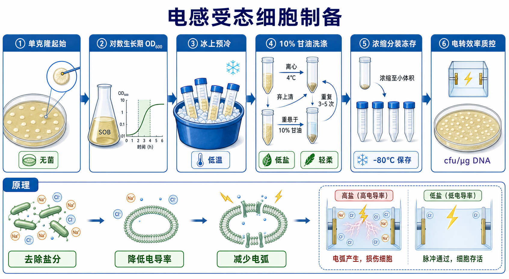

# 电感受态细胞制备

电感受态细胞制备（preparation of electrocompetent cells，电感受态细胞制备）是把 Escherichia coli（E. coli，大肠杆菌）等细菌培养到合适状态后，通过多轮低盐、冰冷洗涤去除培养基和细胞外盐分，最终制成可用于[细菌电转化](<细菌电转化.md>)的[电感受态细胞](<../材(实验耗材工具篇)/电感受态细胞.md>)。它和[化学感受态细胞制备](<化学感受态细胞制备.md>)的逻辑几乎相反：化学感受态依赖阳离子处理，电感受态则必须尽量低盐，避免电转时产生[电转电弧](<../番外/补充知识/电转电弧.md>)。



## 实验发明历史

Electroporation（[电穿孔](<../番外/补充知识/电穿孔.md>)，电场诱导膜通透化）被引入细菌转化后，最大的技术挑战之一就是如何让细胞既能承受高压电脉冲，又不会因为样品导电性过高而死亡。Dower、Miller 和 Ragsdale 在 1988 年报道 high-voltage electroporation（高压电转化）可高效转化 E. coli，并把低离子强度介质、细胞浓缩和电场参数作为影响效率的重要因素。参考：[Dower et al., Nucleic Acids Research, 1988](https://doi.org/10.1093/nar/16.13.6127)。

后来实验室逐渐形成了标准化制备思路：在[对数生长期](<../番外/补充知识/对数生长期.md>)收获细胞，迅速冰上预冷，用冰冷无盐或低盐溶液反复洗涤，常用 10% glycerol（10% [甘油](<../材(实验耗材工具篇)/甘油.md>)）重悬保护冻存，并用标准质粒测定[转化效率](<../番外/补充知识/转化效率.md>)。EMBL 的 electrocompetent E. coli cells protocol 也采用这一核心逻辑：培养到合适 OD，冰上冷却，用冷水和冷甘油多次洗涤，再浓缩分装。参考：[EMBL: Preparation of Electrocompetent E. coli Cells](https://www.embl.org/groups/protein-expression-purification/protocols/preparation-of-electrocompetent-e-coli-cells/)。

## 应用场景

| 场景 | 为什么要自制电感受态 | 关键关注点 |
|---|---|---|
| 高频电转实验 | 商业电感受态成本高 | 批次稳定性、质控效率、冻存管理 |
| 文库构建前准备 | 需要大量高效细胞 | [文库复杂度](<../番外/补充知识/文库复杂度.md>)、总转化子数、批次放大 |
| 大质粒或低量 DNA | 普通化学转化效率不够 | 低盐、细胞活性、宿主菌株 |
| 教学或方法训练 | 理解电转为何怕盐 | 对照清楚，失败原因可解释 |
| 特定菌株优化 | 商业产品没有合适菌株 | 需要自行优化 OD、洗涤和参数 |
| 关键克隆项目 | 不一定推荐自制 | 若失败代价高，商业高效电感受态更稳 |

## 实验目的

电感受态细胞制备的目标是获得一批低盐、低[电导率](<../番外/补充知识/电导率.md>)、高存活率、可冻存、可复现的细胞。它要解决的问题包括：

- 让细胞处于适合电穿孔的生理状态。
- 去除培养基中的盐、氨基酸、缓冲盐和其他导电成分。
- 用甘油等冻存保护条件维持细胞存活。
- 分装成单次使用量，减少[冻融循环](<../番外/补充知识/冻融循环.md>)造成的效率下降。
- 用标准质粒测定转化效率，判断该批细胞适合普通克隆、连接产物转化还是文库构建。

## 简要实验原理

### 电感受态的核心不是“加某种神奇试剂”，而是“去盐”

电转化需要短暂高压脉冲。如果细胞悬液或 DNA 中盐分过高，样品[离子强度](<../番外/补充知识/离子强度.md>)和电导率升高，电流会异常增大，容易产生电弧。NEB 的 electroporation tips 明确把高盐 DNA、过大 DNA 加入体积、气泡和电转杯问题列为 arcing 的主要原因。参考：[NEB Electroporation Tips](https://www.neb.com/en-us/tools-and-resources/usage-guidelines/electroporation-tips)。

因此制备电感受态的本质是：把细胞从富含盐和营养物的培养基中“洗出来”，让细胞悬浮在低盐、低电导率环境里，同时尽量不损伤细胞膜。

### 对数生长期决定细胞是否耐受后续洗涤和脉冲

处于合适 [OD600](<../番外/补充知识/OD600.md>)（optical density at 600 nm，600 nm 光密度）的细胞代谢活跃、群体状态较一致，通常比过夜老菌更适合制备电感受态。过老细胞即使洗得很干净，也可能因为存活率和膜状态差而转化效率低。

不同菌株的最佳 OD600 并不完全相同。EMBL protocol 使用的是培养到中等 OD 后快速冷却的策略；实际实验中应把菌株、培养基、温度、摇床条件和 OD600 记录下来，而不是只写“长到对数期”。

### 冰冷操作保护细胞，轻柔操作保护膜

电感受态制备中的细胞会经历离心、弃上清、重悬、再次离心等多轮操作。每一轮都可能造成机械损伤和温度应激。低温能降低代谢和应激损伤；轻柔重悬能减少细胞破裂和膜损伤。

这里的“轻柔”不是形式主义。细胞如果被涡旋、强力吹打或室温暴露，最后可能看起来仍有沉淀，但电转效率会明显下降。

### 甘油兼顾低盐和冻存保护

10% glycerol（10% 甘油）常用于最后几轮洗涤或最终重悬。它的价值有两层：一是相对低盐，不会像普通缓冲盐那样显著增加电导率；二是作为 cryoprotectant（冻存保护剂），帮助细胞在 -80°C 保存时减少冰晶损伤。

甘油浓度并非越高越好。太低可能冻存保护不足，太高会改变黏度和操作状态。最稳妥的做法是按成熟 protocol 配制无菌、冰冷、低盐甘油，并固定批次条件。

### 质控决定这批细胞的用途等级

电感受态制备完成后，必须用标准[超螺旋质粒](<../番外/补充知识/超螺旋质粒.md>)做[阳性对照](<../番外/补充知识/阳性对照.md>)，同时设置[阴性对照](<../番外/补充知识/阴性对照.md>)。一批细胞是否“好用”，不能只凭冻存管里是否有细胞沉淀判断，而要看 cfu/µg DNA（colony-forming units per microgram DNA，每微克 DNA 对应菌落形成单位）和对照结果。

## 所需试剂、材料与设备

| 类别 | 常用内容 | 作用 |
|---|---|---|
| 菌株 | DH10B、DH5α、TOP10、Stbl 系列等克隆用 E. coli | 决定宿主兼容性和质粒稳定性 |
| 培养基 | [SOB培养基](<../材(实验耗材工具篇)/SOB培养基.md>)、[LB培养基](<../材(实验耗材工具篇)/LB培养基.md>) | 培养细胞到合适状态 |
| 洗涤液 | 冰冷[超纯水](<../材(实验耗材工具篇)/超纯水.md>)、无菌水、10% 甘油 | 去除盐分并保护冻存 |
| 耗材 | [离心管](<../材(实验耗材工具篇)/离心管.md>)、[冻存管](<../材(实验耗材工具篇)/冻存管.md>)、滤芯吸头 | 冷离心、重悬和分装 |
| 设备 | 预冷[离心机](<../材(实验耗材工具篇)/离心机.md>)、冰盒、-80°C 冰箱 | 保持低温和冻存 |
| 质控体系 | [电转仪](<../材(实验耗材工具篇)/电转仪.md>)、[电转杯](<../材(实验耗材工具篇)/电转杯.md>)、SOC 培养基、[抗性平板](<../材(实验耗材工具篇)/抗性平板.md>)、[筛选抗生素](<../材(实验耗材工具篇)/筛选抗生素.md>) | 测试转化效率 |
| 检测辅助 | 微量紫外分光光度计、电导率仪 | 测 DNA 浓度或评估低盐状态 |

## 实验操作

### 选择菌株和制备规模

**怎么做：**先确定后续用途：普通质粒电转、连接产物转化、文库构建、大质粒转化，还是某个特殊宿主菌株。根据用途选择菌株和培养规模。普通克隆可用常见克隆菌株；文库和大质粒通常更依赖高效、稳定的宿主背景。

**为什么重要：**电感受态效率由菌株、培养状态、洗涤质量和冻存质量共同决定。若菌株本身不适合目标质粒，再好的洗涤也无法解决重排、毒性或复制不兼容问题。

**注意事项：**制备前应从新鲜单克隆起始，避免从混杂或长期放置的菌液直接扩大培养。若使用带特殊基因型的菌株，要确认保存记录和抗性背景。

**替代方案：**如果只是一次关键实验，购买商业电感受态通常更稳；如果实验室长期做同一类型高频电转，自制更有成本优势。

**出错后果：**菌株来源不纯会造成批次不可靠；宿主不兼容会表现为转化后菌落少、质粒重排或后续测序异常。

### 培养到合适对数期

**怎么做：**从新鲜单克隆或短期培养物起始，接种到新鲜培养基中，培养到合适 OD600。具体 OD 窗口应根据菌株和 protocol 固定，一般选择中对数期，而不是过夜高密度菌液。

**为什么重要：**电感受态细胞需要既活跃又能耐受后续低盐洗涤。过嫩细胞量不足，过老细胞状态差，都会降低最终转化效率。

**注意事项：**记录培养基、温度、摇速、培养体积、容器体积和 OD600。通气不足会改变生长状态；不同分光光度计读数也可能有系统差异。

**替代方案：**如果目标是高效率批次，可以参考 EMBL 等 protocol 使用 SOB 或营养更充分的培养基；普通批次也可以用 LB，但需要自己验证效率。

**出错后果：**OD 过高常导致细胞状态老化，表现为洗涤后沉淀正常但电转菌落少；OD 过低则细胞总量不足，浓缩后分装量有限。

### 快速冰上预冷

**怎么做：**达到目标 OD 后立即把培养物放在冰上，使细胞迅速降温。离心管、洗涤液、甘油、离心机转子都应提前预冷。

**为什么重要：**从收获开始，细胞会不断经历应激。冰冷条件可以降低代谢损伤和膜损伤，也让不同批次更可重复。

**注意事项：**不要让细胞在室温台面排队等待。若培养体积很大，宁可分批处理，也不要让最后一批长时间处于温热状态。

**替代方案：**小规模制备可以直接冰上处理；大规模制备可以预先安排足够冰桶、离心瓶和低温离心空间。

**出错后果：**温度控制差会导致同一批内部差异大；室温暴露会降低细胞存活和电转效率。

### 冷离心收集细胞

**怎么做：**在 4°C 条件下离心收集细胞，弃上清。离心条件要能有效沉降细胞，同时避免不必要的机械损伤。

**为什么重要：**这一步开始去除培养基盐分和代谢产物。上清残留越多，后续洗涤负担越大；离心和弃上清越粗暴，细胞损伤越重。

**注意事项：**弃上清时不要扰动沉淀。细胞沉淀要保持冰冷，不要用手长时间握住管底。

**替代方案：**大体积可用预冷离心瓶，后续再转入小管洗涤；小体积可直接使用预冷离心管。

**出错后果：**上清残留多会增加盐负担；沉淀丢失会降低产量；离心过猛和反复强力重悬会损伤细胞。

### 多轮低盐洗涤

**怎么做：**用大量冰冷无菌水或冰冷 10% 甘油轻柔重悬细胞，再冷离心，弃上清。通常需要多轮洗涤，逐步去掉培养基中的盐分。最后几轮可使用冰冷 10% 甘油，让细胞进入适合冻存和电转的低盐环境。

**为什么重要：**这一步是电感受态制备成败的核心。洗涤不充分会导致电导率偏高，后续电转容易电弧；洗涤太粗暴会让细胞死掉，虽然盐去掉了，效率也上不去。

**注意事项：**所有洗涤液必须冰冷、无菌、低盐。重悬时避免涡旋，尽量使用轻柔吹打或轻弹。每轮弃上清要尽量干净，但不要吸走细胞沉淀。

**替代方案：**有些 protocol 使用冷超纯水和冷 10% 甘油交替洗涤；有些直接多轮 10% 甘油洗涤。关键不是形式，而是最终低盐、细胞活、批次可复现。

**出错后果：**洗涤不足会电弧；洗涤过猛会低效率；洗涤液不冷会降低细胞存活；污染会导致阴性对照长菌。

### 浓缩、分装和冻存

**怎么做：**最后一次弃上清后，用少量冰冷 10% 甘油重悬细胞，使细胞浓缩到适合单次电转的体积。随后分装到预冷冻存管中，快速冻结并储存在 -80°C。

**为什么重要：**电转通常需要高密度细胞悬液。分装成单次使用量可以避免反复冻融。甘油帮助冻存，但不能代替正确的低盐洗涤和低温操作。

**注意事项：**分装前轻柔混匀，避免前几管细胞浓、后几管细胞稀。每管体积要固定，标签要写清菌株、日期、批号和预估用途等级。

**替代方案：**如果当天要使用，可以保留一部分新鲜电感受态立即质控；长期保存则应进入 -80°C。是否用液氮或干冰乙醇快速冻结，按实验室条件和成熟流程决定。

**出错后果：**分装不均会导致同一批不同管效率差异大；冻存太慢或冻融太多会降低效率；标签不清会导致后续使用混乱。

### 批次质控

**怎么做：**取一管新制备的电感受态，用已知质量和浓度的超螺旋质粒做标准电转，同时设置无 DNA 阴性对照。记录电转参数、time constant（[时间常数](<../番外/补充知识/时间常数.md>)）、是否电弧、复苏条件、涂板稀释倍数和最终菌落数，计算 cfu/µg DNA。

**为什么重要：**电感受态制备的最终产品是“可用批次”，不是“细胞悬液”。没有质控就无法知道这批细胞适合普通克隆、低量 DNA、文库构建还是应该淘汰。

**注意事项：**质控 DNA 必须低盐、干净、抗性和平板匹配。不要用连接产物评价感受态，因为连接效率和载体背景会干扰判断。

**替代方案：**如果缺少精确定量质粒，可以用实验室长期保存的标准质粒做相对比较，但最好建立固定参考批次。

**出错后果：**阳性对照差说明制备或电转步骤有问题；阴性对照有菌落说明污染或平板问题；time constant 异常提示电导率或参数问题。

## 结果解析

| 观察结果 | 可能说明什么 | 优先排查 |
|---|---|---|
| 阳性对照高效，阴性对照无菌落 | 批次可用 | 按效率分级保存 |
| 阳性对照低效但无电弧 | 细胞状态差、冻存损伤或参数不合适 | OD、低温、洗涤强度、冻存方式 |
| 电转时电弧 | 洗盐不足、DNA 带盐、气泡或电转杯问题 | 洗涤轮数、DNA 脱盐、电转装杯 |
| 新鲜细胞好，冻存后差 | 冻存保护或冻结过程问题 | 甘油浓度、冻结速度、冻融次数 |
| 同批不同管差异大 | 分装前混匀不均或分装过程升温 | 分装策略、冰上时间 |
| 阴性对照有菌落 | 污染或抗生素失效 | 无菌操作、平板、抗生素 |
| 文库转化子总数不足 | 批次效率或规模不够 | 增加反应数，换高效商业细胞 |

## 常见异常与 troubleshooting

### 电转频繁电弧

优先从低盐问题查起：细胞洗涤是否充分、最后悬液是否含残留培养基、DNA 是否来自高盐连接/酶切体系、乙醇是否残留、装杯是否有气泡。电感受态制备页最重要的排查不是“再调高电压”，而是先降低电导率。

### 转化效率整体偏低

常见原因是收获 OD 不合适、细胞太老、操作不够冷、洗涤太粗暴、冻存损伤或电转参数不匹配。先用标准质粒确认问题是否来自细胞批次，再回看培养和洗涤记录。

### 细胞沉淀看起来很多，但效率很差

沉淀量只代表有细胞，不代表细胞活、低盐、适合电转。高密度死细胞或受损细胞也能形成沉淀。判断批次质量必须看标准电转效率和对照。

### 批次污染

如果无 DNA 阴性对照有菌落，且多批平板都出现背景，应怀疑洗涤液、甘油、离心管、冻存管或操作环境污染。电感受态制备涉及多次开盖和重悬，污染风险比一次性商业细胞更高。

### 文库实验失败

文库实验需要看总 transformants，而不是“有没有菌落”。如果目标文库复杂度很高，自制电感受态必须提前用标准质粒和模拟样本验证规模。否则等文库构建完成后再发现效率不足，损失会很大。

## 与相关方法对比

| 方法 | 核心逻辑 | 优点 | 局限 | 适合场景 |
|---|---|---|---|---|
| 电感受态细胞制备 | 多轮低盐洗涤 + 甘油冻存 | 可大批量、成本低 | 对低盐和低温要求高 | 高频电转、教学、特定菌株 |
| 商业电感受态 | 厂家制备并标定效率 | 稳定、省时间、适合关键实验 | 成本高，运输保存敏感 | 文库、低量 DNA、高失败成本实验 |
| 化学感受态细胞制备 | Ca2+ 等阳离子处理 | 简单、便宜、不需要电转仪 | 效率通常较低 | 普通质粒扩增、简单连接 |
| 直接购买化学感受态 | 商业热激细胞 | 稳定且便宜于电感受态 | 不一定适合文库和大质粒 | 常规克隆 |

## 购买与选择建议

如果只是偶尔做高难度电转，建议优先购买商业电感受态，尤其是文库构建、大质粒、低量 DNA 或赶时间项目。常见供应商包括 [NEB](<../番外/试剂厂商/NEB.md>)、[Thermo Fisher Scientific](<../番外/试剂厂商/Thermo Fisher Scientific.md>)、[Takara](<../番外/试剂厂商/Takara.md>)、[Promega](<../番外/试剂厂商/Promega.md>)、[Zymo Research](<../番外/试剂厂商/Zymo Research.md>) 和 [Lucigen](<../番外/试剂厂商/Lucigen.md>)。

如果准备自制，建议先用一小批建立 SOP，再扩大规模。购买和制备都要记录：

- 菌株名称和基因型。
- 制备日期、操作者和批号。
- 培养基、OD600、培养温度和摇速。
- 洗涤液种类、轮数、温度和甘油浓度。
- 分装体积、冻存位置和冻融次数。
- 标准质粒、DNA 量、转化效率和适用等级。

商业产品记录示例：

```text
Electrocompetent E. coli cells, strain DH10B, transformation efficiency x.xx × 10^10 cfu/µg pUC19 DNA, Brand, Cat. No. xxxxx, Lot No. xxxxx, stored at -80°C, thawed once only.
```

## 推荐记录模板

### 中文记录模板

| 项目 | 记录内容 |
|---|---|
| 批次编号 | 日期、操作者、菌株 |
| 起始来源 | 单克隆编号、平板日期 |
| 培养条件 | 培养基、体积、温度、摇速、OD600 |
| 洗涤条件 | 洗涤液、轮数、温度、离心条件 |
| 最终重悬 | 甘油浓度、最终体积、细胞浓缩倍数 |
| 分装冻存 | 每管体积、冻存方式、-80°C 位置 |
| 质控质粒 | 质粒名称、大小、抗性、DNA 量 |
| 电转参数 | 电转杯间隙、电压、电容、电阻、time constant |
| 质控结果 | 菌落数、稀释倍数、cfu/µg DNA |
| 批次等级 | 普通克隆、连接产物、高效文库、不推荐 |
| 异常记录 | 电弧、污染、低效、冻融次数 |

### English Record Template

| Item | Record |
|---|---|
| Batch ID | Date, operator, strain |
| Starting source | Colony ID, plate date |
| Culture conditions | Medium, volume, temperature, shaking speed, OD600 |
| Washing conditions | Wash solution, number of washes, temperature, centrifugation |
| Final resuspension | Glycerol concentration, final volume, cell concentration factor |
| Aliquot and storage | Volume per aliquot, freezing method, -80°C location |
| QC plasmid | Plasmid name, size, antibiotic resistance, DNA amount |
| Electroporation settings | Cuvette gap, voltage, capacitance, resistance, time constant |
| QC result | Colony number, dilution factor, cfu/µg DNA |
| Batch grade | Routine cloning, ligation transformation, high-efficiency library, not recommended |
| Deviations | Arcing, contamination, low efficiency, freeze-thaw cycles |

## 参考来源

- [EMBL: Preparation of Electrocompetent E. coli Cells](https://www.embl.org/groups/protein-expression-purification/protocols/preparation-of-electrocompetent-e-coli-cells/)
- [NEB: Electroporation Tips](https://www.neb.com/en-us/tools-and-resources/usage-guidelines/electroporation-tips)
- [NEB: Electroporation Protocol](https://www.neb.com/en-us/protocols/0001/01/01/electroporation-protocol-c3020)
- [Thermo Fisher Scientific: ElectroMAX Transformation Protocol](https://www.thermofisher.com/us/en/home/references/protocols/cloning/transformation-protocol/electromax.html)
- [Dower et al., High efficiency transformation of E. coli by high voltage electroporation, Nucleic Acids Research, 1988](https://doi.org/10.1093/nar/16.13.6127)
