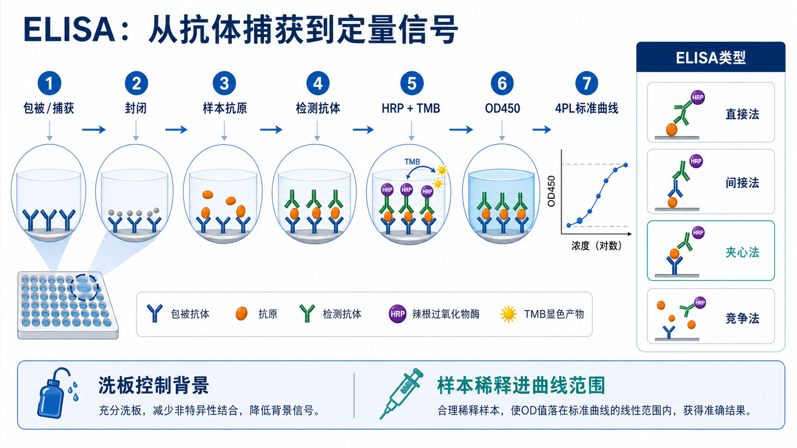

# 直接ELISA

Direct ELISA（直接 ELISA，直接酶联免疫吸附试验）是最简单的 [ELISA](ELISA.md) 形式之一：将 [抗原](<../番外/补充知识/抗原.md>) 直接吸附到 [酶标板](<../材(实验耗材工具篇)/酶标板.md>) 表面，再用 enzyme-conjugated primary antibody（酶标一抗）直接识别抗原并产生信号。



图源：Image2 生成的 ELISA summary graph abstract；右侧 direct ELISA 小图展示“抗原固定在板面，酶标抗体直接识别”的结构。

## 核心逻辑

直接 ELISA 的检测链条很短：

```text
抗原包被板面
-> 封闭
-> 酶标一抗结合抗原
-> 洗板
-> 加底物
-> 读信号
```

Thermo Fisher 的 ELISA overview 将 direct ELISA 描述为用 enzyme-labeled primary antibody 直接检测固定在板上的抗原；其优点是步骤少，限制是每个一抗都需要标记，且信号放大较弱。参考：[Thermo Fisher Overview of ELISA](https://www.thermofisher.com/us/en/home/life-science/protein-biology/protein-biology-learning-center/protein-biology-resource-library/pierce-protein-methods/overview-elisa.html)。

## 适合什么时候用

| 场景 | 是否适合 | 原因 |
| --- | --- | --- |
| 纯化抗原是否能被某抗体识别 | 适合 | 抗原背景简单，直接包被可行 |
| 抗体标记物活性验证 | 适合 | 测酶标一抗是否还能结合目标 |
| 大量血清或复杂样本中测低丰度蛋白 | 不适合 | 板面非特异吸附严重，灵敏度不足 |
| 需要高灵敏定量细胞因子 | 不推荐 | [夹心ELISA](夹心ELISA.md) 通常更合适 |
| 快速教学演示 | 适合 | 逻辑直观，步骤少 |

直接 ELISA 更适合“系统很干净、目标很明确、想快速看结合”的场景，不适合复杂样本中寻找低丰度目标。

## 实验目的

- 验证一个酶标抗体是否能识别某个抗原。
- 比较不同抗原包被量下的信号。
- 快速筛查抗原-抗体结合。
- 在简单体系中做半定量比较。

如果目的是绝对定量复杂样本中的目标蛋白，应优先考虑夹心 ELISA 或商业 [ELISA试剂盒](<../材(实验耗材工具篇)/ELISA试剂盒.md>)。

## 实验操作

### 抗原包被

**怎么做**：将纯化抗原稀释到 coating buffer 中，加入板孔孵育，使抗原通过疏水作用、电荷作用等非特异吸附在板面。

**为什么重要**：直接 ELISA 没有捕获抗体这层选择性，抗原是否能稳定、方向合适地吸附到板上，直接决定后续信号。

**注意事项**：

- 抗原要尽量纯，复杂样本不适合直接包被。
- 包被浓度过高可能增加背景，过低则信号弱。
- 包被后不要让板孔干燥。

**替代方案**：如果抗原带标签，可用 His-tag、biotin-streptavidin 或特异捕获体系提高固定方向性。

**出错后果**：抗原吸附不足会全板低信号；混合物直接包被会让非目标蛋白竞争板面，降低特异性。

### 封闭

**怎么做**：加入 [封闭液](<../材(实验耗材工具篇)/封闭液.md>)，覆盖未被抗原占据的板面。

**为什么重要**：酶标一抗如果直接吸附到裸露板面，会造成高背景。

**注意事项**：

- 常见 blocker 包括 [BSA](<../材(实验耗材工具篇)/BSA.md>)、[酪蛋白](<../材(实验耗材工具篇)/酪蛋白.md>) 或商业封闭液。
- blocker 不能遮蔽抗原表位。
- 需要与 HRP/TMB 或其他酶体系兼容。

**替代方案**：高背景时比较 BSA、casein、鱼明胶或商业 blocker。

**出错后果**：封闭不足导致空白孔和阴性孔升高；封闭过强或不兼容可能降低目标信号。

### 酶标一抗孵育

**怎么做**：加入 HRP-conjugated primary antibody（HRP 标记一抗）或其他酶标一抗，孵育后洗板。

**为什么重要**：直接 ELISA 没有 [二抗](<../材(实验耗材工具篇)/二抗.md>) 放大，所以一抗标记质量、亲和力和稀释度非常关键。

**注意事项**：

- 抗体标记可能影响 [亲和力](<../番外/补充知识/亲和力.md>) 或 [特异性](<../番外/补充知识/特异性.md>)。
- 一抗过浓会增加非特异背景。
- HRP 体系避免使用含叠氮钠的稀释液。

**替代方案**：如果没有酶标一抗，改用 [间接ELISA](间接ELISA.md) 的一抗 + 酶标二抗体系。

**出错后果**：标记抗体失活会无信号；抗体交叉反应会假阳性。

### 显色和读板

**怎么做**：加入 [TMB](<../材(实验耗材工具篇)/TMB.md>) 或对应底物，显色后用 [硫酸](<../材(实验耗材工具篇)/硫酸.md>) 等终止液终止，并用酶标仪读板。

**为什么重要**：直接 ELISA 信号通常不如间接或夹心 ELISA 强，显色时间和读板窗口会明显影响可读性。

**注意事项**：

- 加底物和终止液的顺序要一致。
- 高背景时先检查洗板和抗体浓度。
- 结果更适合半定量或条件比较，不要轻易当作复杂样本绝对浓度。

## 优点和局限

| 维度 | 直接ELISA |
| --- | --- |
| 步骤 | 最少 |
| 时间 | 较快 |
| 信号放大 | 弱 |
| 灵敏度 | 通常低于间接或夹心 ELISA |
| 特异性 | 取决于抗原纯度和酶标一抗 |
| 成本 | 若已有酶标一抗则低；若要单独标记则高 |
| 适合样本 | 纯化抗原、简单体系 |

## 常见错误与 troubleshooting

| 现象 | 可能原因 | 处理 |
| --- | --- | --- |
| 全板信号低 | 抗原包被不足、酶标抗体失活、底物失效 | 提高包被量，检查阳性抗原和抗体 |
| 空白孔高 | 封闭不足、酶标抗体吸附板面 | 优化 blocker，降低抗体浓度 |
| 阴性抗原也有信号 | 抗体交叉反应或抗原不纯 | 换抗体，加入更严格阴性对照 |
| 重复孔 CV 高 | 包被不均、洗板不一致、气泡 | 使用多道移液枪，检查板底和气泡 |
| 曲线范围窄 | 无二抗放大，信号动态范围有限 | 改用间接或夹心 ELISA |

## 记录模板

中文模板：

```text
实验类型：直接ELISA
包被抗原：
抗原来源/纯度：
包被浓度：
板类型：
封闭液：
酶标一抗：
抗体稀释倍数：
底物：
读板波长：
阴性抗原：
阳性抗原：
备注：
```

English template:

```text
Assay format: direct ELISA
Coated antigen:
Antigen source/purity:
Coating concentration:
Plate type:
Blocking buffer:
Enzyme-conjugated primary antibody:
Antibody dilution:
Substrate:
Reading wavelength:
Negative antigen:
Positive antigen:
Notes:
```

## 总结

直接 ELISA 的优势是简单、快、结构直观；弱点是信号放大少、对抗原纯度依赖强、复杂样本中定量能力有限。它适合做抗原-抗体结合和酶标一抗验证，但不是常规细胞因子定量的首选。

## 参考来源

- [Thermo Fisher Overview of ELISA](https://www.thermofisher.com/us/en/home/life-science/protein-biology/protein-biology-learning-center/protein-biology-resource-library/pierce-protein-methods/overview-elisa.html)
- [Bio-Rad ELISA types guide](https://www.bio-rad-antibodies.com/elisa-types-direct-indirect-sandwich-competitive-elisa.html)
