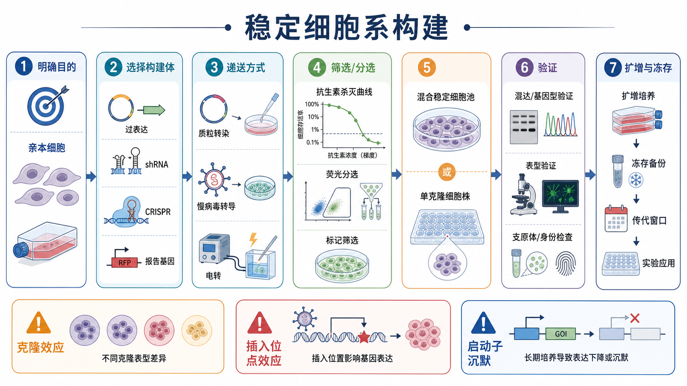
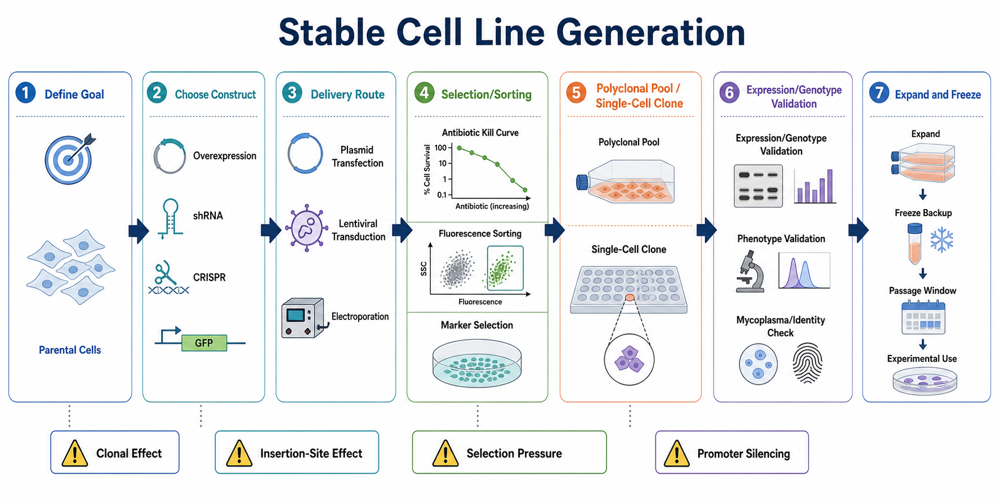

# 稳定细胞系构建

Stable cell line generation（稳定细胞系构建）是把外源基因、沉默元件、报告系统或基因编辑事件稳定引入细胞，并通过筛选、分选、扩增和验证，获得可长期传代使用的细胞模型。它不是简单地“让细胞活下来”，而是把“构建体是否进入细胞、是否稳定保留、是否持续表达、是否产生预期表型、是否仍然代表原始细胞背景”这几件事同时控制住。





## 实验发明历史

稳定细胞系的思想来自早期 mammalian cell transfection（哺乳动物细胞转染）和 selectable marker（筛选标记）系统：外源 DNA 进入少数细胞后，只有携带抗性基因或特定报告信号的细胞能在筛选压力下保留下来。后来，retroviral vector（逆转录病毒载体）和 lentiviral vector（慢病毒载体）让不容易转染的细胞也能获得较高比例的稳定整合。再之后，CRISPR-Cas9（clustered regularly interspaced short palindromic repeats-CRISPR associated protein 9，成簇规律间隔短回文重复序列及其相关蛋白 9）把稳定细胞系从“表达一个外源构建体”扩展到了内源基因敲除、敲入、点突变和启动子调控等层面。

因此，现代稳定细胞系构建至少有三条主线：一是 transgene overexpression（外源基因过表达），二是 stable knockdown（稳定敲低），三是 genome editing-derived clone（基因编辑来源克隆）。这三类可以共享筛选、扩增和验证逻辑，但“成功”的定义并不相同。参考：[Addgene Lentiviral Guide](https://www.addgene.org/guides/lentivirus/)

## 应用场景

稳定细胞系适合需要长期、重复、可比较的细胞模型时使用。常见场景包括：

| 场景 | 为什么用稳定细胞系 | 常见选择 |
| --- | --- | --- |
| 长期功能实验 | 避免每次 transient transfection（瞬时转染）的效率波动 | [基因过表达](基因过表达.md)、[shRNA稳定敲低](shRNA稳定敲低.md) |
| 药物敏感性或耐药模型 | 需要多轮处理、传代和复测 | 混合稳定池或多个单克隆 |
| 动物实验前模型 | 需要细胞状态相对稳定、可冻存复苏 | 充分验证后的稳定池或克隆 |
| reporter assay（报告基因实验） | 需要长期读出通路活性、启动子活性或定位变化 | [报告基因实验](报告基因实验.md)稳定报告细胞 |
| rescue experiment（救援实验） | 需要在敲低/敲除背景中重新表达野生型或突变体 | 敲低 + rescue 过表达模型 |
| CRISPR 功能研究 | 需要明确基因型或长期表型 | CRISPR pool、单克隆敲除株、敲入株 |

## 实验目的

稳定细胞系构建的目的通常不是“得到一个漂亮的阳性细胞群”，而是建立一个能回答生物学问题的模型：

| 目标 | 适合的构建方式 | 成功标准 |
| --- | --- | --- |
| 提高目标基因表达 | 外源表达载体、慢病毒过表达、诱导表达系统 | RNA/蛋白升高，定位正确，表型可重复 |
| 降低目标基因表达 | shRNA（short hairpin RNA，短发夹 RNA）或 CRISPR interference（CRISPRi，CRISPR 干扰） | RNA/蛋白下降，多条靶序列趋势一致 |
| 删除或破坏目标基因 | CRISPR-Cas9 indel（insertion/deletion，插入/缺失） | 基因型确认，蛋白缺失或功能缺失 |
| 引入点突变或标签 | HDR（homology-directed repair，同源定向修复）、prime editing（引导编辑）等 | 目标位点正确，未引入明显异常表达 |
| 建立报告系统 | 荧光蛋白、luciferase（荧光素酶）或抗性标记 | 背景低、响应范围足够、长期稳定 |

## 简要实验原理

稳定细胞系构建可以拆成四个问题。

| 问题 | 核心逻辑 | 最常见风险 |
| --- | --- | --- |
| 细胞如何获得构建体 | 通过[细胞转染](细胞转染.md)、[电转染](电转染.md)、[病毒转导](病毒转导.md)或 CRISPR RNP（ribonucleoprotein，核糖核蛋白复合体）递送 | 递送效率低、细胞毒性高 |
| 阳性细胞如何富集 | antibiotic selection（抗生素筛选）、fluorescence-activated cell sorting, FACS（荧光激活细胞分选）或磁珠富集 | 筛选太强导致全死，太弱导致阴性细胞残留 |
| 群体是否要单克隆化 | 保留 [混合稳定细胞池](<../番外/补充知识/混合稳定细胞池.md>)，或分离 [单克隆细胞株](<../番外/补充知识/单克隆细胞株.md>) | 单克隆可能出现[克隆效应](<../番外/补充知识/克隆效应.md>) |
| 构建是否可信 | 检查基因型、RNA、蛋白、表型、污染和身份 | 只看抗性或荧光而没有功能验证 |

抗生素或荧光只能证明细胞“携带了某种筛选标记”，不能自动证明目标基因表达正确、敲低有效或表型真实。特别是整合型载体还可能受到 [插入位点效应](<../番外/补充知识/插入位点效应.md>)、[启动子沉默](<../番外/补充知识/启动子沉默.md>) 和长期选择压力改变细胞群体组成的影响。

## 所需试剂、材料与设备

| 类别 | 内容 | 作用与注意事项 |
| --- | --- | --- |
| 起始细胞 | 目标 parental cell line（亲本细胞系） | 记录来源、传代号、培养条件；开始前最好完成[支原体检测](支原体检测.md)和[细胞系鉴定](细胞系鉴定.md) |
| 培养体系 | 对应[细胞培养](细胞培养.md)条件、血清、补充剂、包被基质 | 稳转过程会放大细胞状态差异，起始状态要稳定 |
| 构建体 | 过表达质粒、shRNA 载体、sgRNA/Cas9 载体、报告载体、CRISPR RNP | 先确认序列、阅读框、标签、启动子和筛选标记 |
| 递送系统 | 脂质体转染试剂、电转染系统、[慢病毒载体](<../材(实验耗材工具篇)/慢病毒载体.md>) | 根据细胞难易程度和实验安全条件选择；慢病毒相关操作遵守机构生物安全 SOP |
| 筛选试剂 | [嘌呤霉素](<../材(实验耗材工具篇)/嘌呤霉素.md>)、[G418](<../材(实验耗材工具篇)/G418.md>)、[潮霉素B](<../材(实验耗材工具篇)/潮霉素B.md>)、[Blasticidin](<../材(实验耗材工具篇)/Blasticidin.md>)、[Zeocin](<../材(实验耗材工具篇)/Zeocin.md>) | 每种细胞、密度和培养基都可能改变敏感性，正式筛选前应做[抗生素杀灭曲线](<../番外/补充知识/抗生素杀灭曲线.md>) |
| 分选设备 | [流式分选](流式分选.md)、荧光显微镜、酶标仪或活细胞成像系统 | 适合带荧光报告基因或表面标志物的构建 |
| 验证实验 | [RT-qPCR](RT-qPCR.md)、[Western blot](<Western blot.md>)、[流式细胞术](流式细胞术.md)、免疫荧光、Sanger 测序、NGS | 同时看分子层面和功能层面，避免“只验证一层” |
| 细胞库 | 冻存液、程序降温盒、冻存管、液氮或超低温保存系统 | 早期冻存 master stock（主库）和 working stock（工作库） |

不同筛选抗生素的有效浓度范围会随细胞类型变化很大。厂商通常建议先用 kill curve（杀灭曲线）确定能在合理时间内杀死未转染细胞的最低有效条件，而不是照搬别人的剂量。参考：[Thermo Fisher Geneticin selective antibiotic](https://www.thermofisher.com/order/catalog/product/10131035)、[InvivoGen Zeocin selection antibiotic](https://www.invivogen.com/zeocin)

## 实验操作

### 明确模型问题和成功标准

先写清楚这株细胞要回答什么问题：是要持续过表达某个基因，还是要稳定敲低，还是要得到基因敲除克隆，还是建立一个可读出的 reporter system。不同目的决定后面的策略。

操作意义：稳定细胞系构建最容易犯的错误，是把“构建成功”误认为“实验问题已经被回答”。例如过表达模型需要确认蛋白是否正确定位，敲低模型需要确认 RNA 和蛋白是否下降，CRISPR 克隆需要确认基因型和蛋白功能是否改变。

注意事项：

| 要记录的信息 | 为什么重要 |
| --- | --- |
| 亲本细胞来源、传代号、培养基版本 | 后续稳定株异常时能判断是否来自细胞背景 |
| 构建体名称、序列版本、启动子、标签、抗性 | 影响表达强度、定位、筛选策略和长期稳定性 |
| 预期验证指标 | 避免只凭抗性或荧光判断成功 |
| 计划使用混合池还是单克隆 | 决定后续扩增、验证和统计策略 |

### 选择构建体和递送方式

常见选择如下：

| 目的 | 构建体/递送方式 | 适合情况 | 局限 |
| --- | --- | --- | --- |
| 稳定过表达 | 质粒稳定转染或慢病毒过表达 | 目标是提高外源基因表达 | 表达量可能高于生理水平 |
| 稳定敲低 | shRNA 慢病毒系统 | 长期降低基因表达，适合功能实验 | 敲低不等于敲除，可能有 off-target effect（脱靶效应） |
| 基因敲除 | CRISPR-Cas9 + 单克隆筛选 | 需要明确缺失功能 | 单克隆验证工作量大，可能出现适应性改变 |
| 基因敲入/标签 | CRISPR + donor template（供体模板） | 内源位点标记或点突变 | 效率低，需要严格基因型验证 |
| 可控表达 | Tet-On system（四环素诱导表达系统） | 目标基因毒性强或需要时间控制 | 需要诱导剂浓度、漏表达和响应曲线验证 |

替代方案：如果实验只需要短期读出，应优先考虑瞬时转染或 siRNA（small interfering RNA，小干扰 RNA）瞬时敲低；如果目标是长期、多轮处理、动物实验或反复复现，再进入稳定株构建。

可能出错：构建体设计不合理会导致后面所有步骤看似顺利但模型无效。常见例子包括标签阻断蛋白定位、启动子过强导致细胞毒性、shRNA 靶向转录本异构体不全、CRISPR sgRNA 切割效率低。

### 建立筛选条件

在正式构建前，先用未处理亲本细胞建立 antibiotic kill curve（抗生素杀灭曲线）。核心目标不是找到“越高越好”的剂量，而是找到能在目标时间窗内清除阴性细胞、同时尽量降低额外压力的筛选条件。

操作意义：同一种抗生素在不同细胞系、不同密度、不同培养基中的有效范围可能差别很大。过强的 [筛选压力](<../番外/补充知识/筛选压力.md>) 会造成大量死亡和群体瓶颈，过弱则会让阴性细胞混入稳定池。

注意事项：

| 判断点 | 合理做法 | 异常提示 |
| --- | --- | --- |
| 阴性细胞死亡时间 | 用未转染亲本细胞确定最低有效条件 | 若阴性细胞长期存活，剂量或药效可能不足 |
| 阳性细胞恢复 | 递送后先给细胞恢复窗口，再进入筛选 | 过早筛选会叠加递送毒性 |
| 维持筛选 | 建株后可根据需要降低到 maintenance dose（维持剂量） | 长期高压可能改变细胞状态 |
| 抗生素批次 | 记录品牌、货号、批号、保存和开封时间 | 批次或降解会造成筛选强度漂移 |

### 递送构建体并恢复细胞

递送方式可以是脂质体转染、电转染或病毒转导。贴壁细胞常用脂质体转染或慢病毒转导；难转染细胞、原代细胞或悬浮细胞可能需要电转染或病毒系统。慢病毒系统涉及生物安全和机构审批，应按照本实验室 BSL（biosafety level，生物安全等级）要求、载体说明书和废弃物处理规范执行，不在通用笔记中固定病毒剂量、包装比例或感染参数。参考：[Addgene Lentiviral Guide](https://www.addgene.org/guides/lentivirus/)

操作意义：递送阶段决定阳性细胞起点，恢复阶段决定细胞是否能从递送压力中回来。对多数细胞而言，递送效率、细胞密度、细胞状态、试剂毒性和培养基更换时机共同影响最后稳定池质量。

可能出错：

| 现象 | 可能原因 | 后果 |
| --- | --- | --- |
| 递送后大量死亡 | 转染/电转条件过强，病毒或辅助试剂毒性，细胞状态差 | 后续筛选得到的细胞可能来自少数幸存亚群 |
| 荧光阳性率低 | 构建体太大、递送效率低、启动子不适合该细胞 | 需要优化递送策略或换载体 |
| 初期阳性但很快下降 | 非整合表达逐渐丢失，或目标表达有负选择 | 需要延长观察或改用稳定整合/诱导系统 |

### 筛选、分选和扩增

如果构建体带抗性基因，常用抗生素筛选；如果构建体带荧光蛋白或可检测表面标志物，可以使用 FACS（fluorescence-activated cell sorting，荧光激活细胞分选）。有时二者会结合使用：先抗生素筛选，再根据荧光强度分选。

操作意义：筛选/分选是富集阳性细胞，不是最终验证。筛选期间需要维持适当细胞密度，避免全部细胞处于过度稀疏、死亡碎片多或营养压力大的状态。

替代方案：

| 策略 | 优点 | 缺点 |
| --- | --- | --- |
| 抗生素筛选 | 操作简单，适合无荧光构建 | 只能证明有抗性标记 |
| 流式分选 | 可按荧光强度或标志物精细分群 | 对细胞压力较大，需要仪器和无菌分选条件 |
| 磁珠富集 | 适合表面标志物阳性细胞 | 不能直接反映表达量或基因型 |
| 无筛选直接扩增 | 压力小 | 阳性比例可能太低，不适合长期实验 |

### 决定混合稳定池还是单克隆

这是稳定细胞系构建中最重要的分叉。

| 类型 | 英文 | 适合场景 | 优点 | 风险 |
| --- | --- | --- | --- | --- |
| 混合稳定细胞池 | polyclonal stable pool | 初筛、药物实验、整体趋势验证 | 快，代表多个整合事件或编辑事件的平均效应 | 阳性比例和表达水平可能随传代漂移 |
| 单克隆细胞株 | monoclonal stable cell line | 明确基因型、机制研究、长期项目、报告细胞 | 均一性高，便于重复 | 克隆效应、插入位点效应、扩增周期长 |
| 多克隆并行验证 | multiple independent clones | 重要机制结论 | 可排除单克隆偶然性 | 成本和验证量增加 |

单克隆可以通过 [有限稀释法](有限稀释法.md) 或无菌 FACS 单细胞分选获得。对于 CRISPR 敲除、敲入或点突变模型，单克隆通常更有必要；对于 shRNA 或过表达功能初筛，混合稳定池有时更能避免单克隆偏差。比较稳妥的做法是：先用混合池判断方向，再挑多个单克隆做关键机制和终稿级验证。

### 验证稳定细胞系

验证要按“构建体层面、表达层面、功能层面、细胞背景层面”逐层完成。

| 验证层面 | 常用方法 | 说明 |
| --- | --- | --- |
| 构建体或基因型 | PCR、Sanger 测序、amplicon NGS、拷贝数检测 | 确认外源序列、indel、敲入或突变是否存在 |
| RNA 水平 | RT-qPCR、RNA-seq | 判断表达升高、敲低或转录改变 |
| 蛋白水平 | Western blot、免疫荧光、流式细胞术、质谱 | RNA 改变不一定等于蛋白改变 |
| 表型水平 | 增殖、凋亡、迁移、药敏、报告基因读数等 | 最终要回到实验问题 |
| 细胞质量 | 支原体检测、STR 分析、形态和生长曲线 | 避免污染、错系和长期选择造成背景变化 |

ATCC 的细胞培养指南和细胞系鉴定技术文件都强调，连续培养细胞需要定期检查微生物污染、支原体污染和身份一致性；NIST 也把 STR（short tandem repeat，短串联重复序列）分型称为人源细胞系鉴定的常用标准路线。这对长期构建株尤其重要，因为构建、筛选、扩增和冻存都会拉长细胞在体外的时间。参考：[ATCC Animal Cell Culture Guide](https://www.atcc.org/resources/culture-guides/animal-cell-culture-guide)、[ATCC Cell Line Authentication Test Recommendations](https://www.atcc.org/resources/technical-documents/cell-line-authentication-test-recommendations)、[NIST Cell Line Authentication](https://www.nist.gov/programs-projects/cell-line-authentication/cell-line-id-and-authentication-human-cell-lines)

### 扩增、冻存和使用窗口

一旦验证通过，应尽早建立 master cell bank（主细胞库）和 working cell bank（工作细胞库）。主库尽量少动，工作库用于日常实验。每次复苏后记录传代号、恢复情况、筛选条件和关键表型。

操作意义：稳定细胞系并不代表“永远稳定”。外源表达可能随传代降低，混合池比例可能漂移，强表型细胞可能被负选择淘汰，单克隆也可能出现适应性变化。

建议记录：

| 项目 | 中文记录 | English record |
| --- | --- | --- |
| 细胞身份 | 亲本细胞、构建体、克隆编号、传代号 | Parental cell line, construct, clone ID, passage number |
| 构建信息 | 递送方式、筛选标记、筛选时间、分选门限 | Delivery method, selection marker, selection duration, sorting gate |
| 验证信息 | RNA、蛋白、基因型、功能表型 | RNA, protein, genotype, functional phenotype |
| 细胞质量 | 支原体、STR、冻存批号、复苏活率 | Mycoplasma, STR, freeze lot, post-thaw viability |
| 使用窗口 | 允许传代范围、是否维持筛选、复测频率 | Passage window, maintenance selection, re-validation interval |

## 结果解析

| 结果 | 解读 | 下一步 |
| --- | --- | --- |
| 抗性筛选后细胞存活，目标 RNA/蛋白也改变 | 初步构建成功 | 做功能实验和稳定性验证 |
| 抗性筛选后细胞存活，但目标基因无改变 | 可能只是抗性标记存在，目标 cassette 失效或构建错误 | 检查构建体、启动子、序列和表达检测 |
| 混合池有表型，单克隆差异很大 | 可能存在克隆效应或整合位点效应 | 同时报告多个克隆，避免只挑“最好看”的一个 |
| 初期表达强，传代后下降 | 可能启动子沉默、负选择或筛选压力不足 | 缩短使用窗口，换启动子，使用诱导系统或重新建株 |
| RNA 下降但蛋白不降 | 蛋白半衰期长、抗体问题、敲低不足或反馈调控 | 延长观察时间，换验证方法，使用多条 shRNA/sgRNA |
| 基因型正确但无表型 | 目标基因不是该表型限制因素，或模型条件不合适 | 增加刺激条件、阳性对照或换细胞背景 |

## 异常结果与原因

| 异常 | 常见原因 | 处理思路 |
| --- | --- | --- |
| 筛选全死 | 抗生素剂量过高、筛选过早、递送毒性太强、细胞密度太低 | 重新做杀灭曲线，延长恢复期，降低递送压力 |
| 阴性细胞清不干净 | 抗生素失效、浓度不足、筛选时间短、细胞密度过高 | 更换新鲜抗生素，重做 kill curve，分批筛选 |
| 克隆长不起来 | 单细胞压力大、培养基不支持低密度生长、目标构建有毒 | 使用条件培养基、添加支持因子，先扩增混合池 |
| 阳性细胞比例下降 | 表达负担、启动子沉默、无维持筛选、群体漂移 | 设置维持筛选，缩短使用窗口，复苏早期冻存批次 |
| 不同批次结果不一致 | 起始细胞状态不同、构建体批次不同、筛选窗口不同 | 固定 SOP，记录批号，使用同一主库 |
| 表型过强或不符合生理 | 外源过表达量过高、标签干扰、随机整合多拷贝 | 换弱启动子、诱导表达、内源敲入或低表达克隆 |

## 与相关实验的区别

| 方法 | 核心目的 | 持续时间 | 是否需要筛选 | 适合回答的问题 |
| --- | --- | --- | --- | --- |
| 瞬时转染 | 短期表达或敲低 | 通常数天 | 不一定 | 快速验证方向、报告实验、短期机制 |
| 稳定细胞池 | 长期富集阳性群体 | 可传代，但需监测漂移 | 通常需要 | 药敏、长期表型、功能初筛 |
| 单克隆稳定株 | 获得均一细胞模型 | 可长期使用，但需限定窗口 | 需要 | 明确基因型、关键机制、终稿级验证 |
| CRISPR pool | 群体水平基因编辑 | 中长期 | 可选 | 快速观察敲除趋势或筛选 |
| 诱导稳定株 | 控制表达时间和强度 | 中长期 | 需要 | 毒性基因、剂量-时间响应、可逆表型 |

## 推荐记录模板

中文模板：

```text
稳定细胞系名称：
亲本细胞：
构建目的：
构建体/载体：
递送方式：
筛选标记：
杀灭曲线条件：
筛选起止日期：
混合池或单克隆：
克隆编号：
验证结果：
支原体结果：
STR/身份确认：
冻存批号：
推荐使用传代范围：
备注：
```

English template:

```text
Stable cell line name:
Parental cell line:
Purpose:
Construct/vector:
Delivery method:
Selection marker:
Kill curve condition:
Selection start/end date:
Polyclonal pool or monoclonal clone:
Clone ID:
Validation results:
Mycoplasma status:
STR/authentication status:
Freeze lot:
Recommended passage window:
Notes:
```

## 总结

稳定细胞系构建的核心不是“筛出一群活细胞”，而是建立一个经过递送、筛选、验证、冻存和使用窗口管理的可重复模型。混合稳定池适合快速和平均化，单克隆适合明确基因型和长期机制研究；但单克隆必须警惕克隆效应，混合池必须警惕群体漂移。最可靠的结论通常来自合理的构建策略、多个独立验证层面、清楚的细胞质量控制，以及对批次和传代窗口的持续记录。

## 参考来源

- [Addgene Lentiviral Guide](https://www.addgene.org/guides/lentivirus/)
- [Thermo Fisher Geneticin selective antibiotic](https://www.thermofisher.com/order/catalog/product/10131035)
- [InvivoGen Zeocin selection antibiotic](https://www.invivogen.com/zeocin)
- [ATCC Animal Cell Culture Guide](https://www.atcc.org/resources/culture-guides/animal-cell-culture-guide)
- [ATCC Cell Line Authentication Test Recommendations](https://www.atcc.org/resources/technical-documents/cell-line-authentication-test-recommendations)
- [NIST Cell Line Identification and Authentication](https://www.nist.gov/programs-projects/cell-line-authentication/cell-line-id-and-authentication-human-cell-lines)
