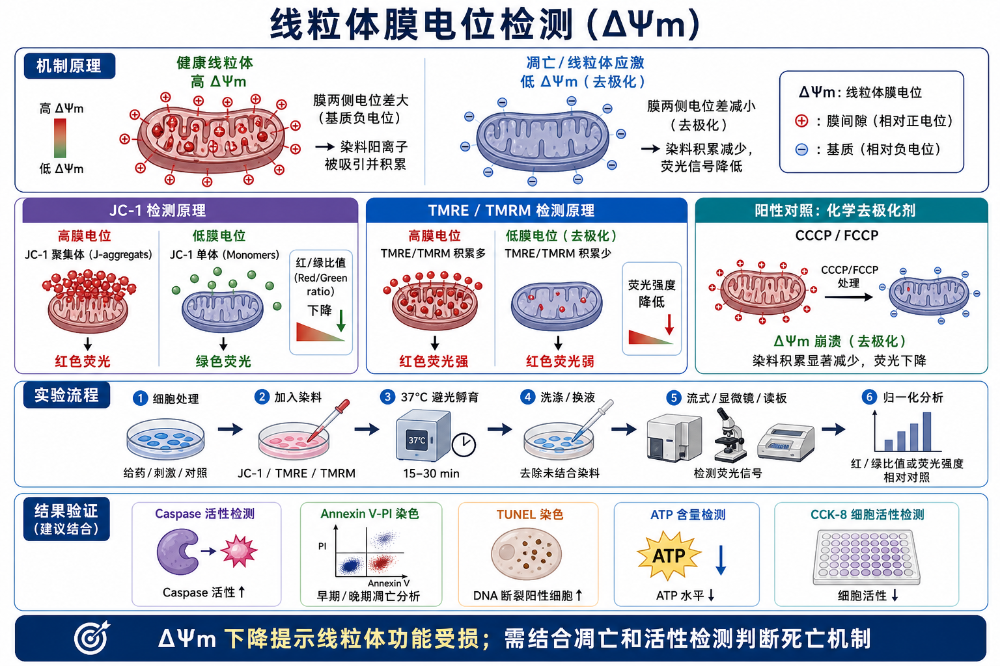
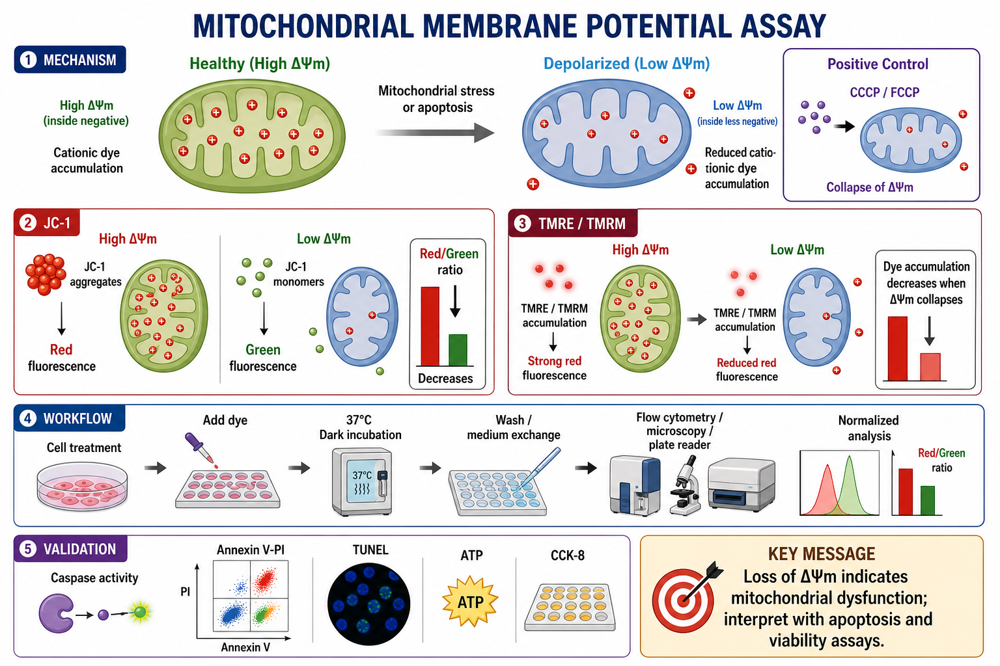

# 线粒体膜电位检测

Mitochondrial membrane potential assay（线粒体膜电位检测）是用膜电位敏感染料检测 [线粒体膜电位](../番外/补充知识/线粒体膜电位.md) 变化的实验，常用来判断线粒体功能状态、线粒体应激以及 [线粒体通路](../番外/补充知识/线粒体通路.md) 是否参与细胞死亡。线粒体膜电位常写作 ΔΨm 或 MMP，指线粒体内膜两侧形成的电化学电位差。





一句话理解：健康线粒体内侧相对更负，会吸引带正电的脂溶性荧光染料进入线粒体；当线粒体去极化时，染料积累减少，荧光模式改变。但 ΔΨm 下降只说明线粒体功能受损或膜电位崩塌，不等于单独证明“细胞正在凋亡”。

## 实验发明历史与背景

线粒体膜电位是 oxidative phosphorylation（氧化磷酸化）驱动 ATP 合成的核心物理基础之一。细胞发生应激、凋亡、能量代谢障碍或线粒体损伤时，ΔΨm 常常发生下降。Bio-protocol 的 JC-1 实用指南指出，荧光阳离子探针已经被广泛用于监测 ΔΨm，但结果可重复性高度依赖经过验证的 protocol 和合适对照。参考：[Sivandzade et al., 2019, Bio-protocol](https://pmc.ncbi.nlm.nih.gov/articles/PMC6343665/)。

[JC-1](<../材(实验耗材工具篇)/JC-1.md>) 是最经典的线粒体膜电位探针之一，全称是 5,5',6,6'-tetrachloro-1,1',3,3'-tetraethylbenzimidazolylcarbocyanine iodide，中文可写作“四氯四乙基苯并咪唑羰花青碘化物”。Reers 等人在 1991 年报道 JC-1 作为膜电位敏感 carbocyanine dye（羰花青染料）时，说明其在高膜电位条件下形成红色 J-aggregates，而低膜电位时以绿色 monomer 为主。参考：[Reers et al., 1991, Biochemistry](https://pubmed.ncbi.nlm.nih.gov/2021638/)。

后来，JC-1 被大量用于流式细胞术、荧光显微镜和酶标仪检测中。Thermo Fisher 的 JC-1 页面也说明，健康或高膜电位线粒体会表现出更强红色 J-aggregate 信号，膜电位较低时偏绿色单体信号，红/绿荧光比值可用于判断线粒体去极化。参考：[Thermo Fisher JC-1 dye for mitochondrial membrane potential](https://www.thermofisher.com/us/en/home/life-science/cell-analysis/cell-viability-and-regulation/apoptosis/mitochondria-function/jc-1-dye-mitochondrial-membrane-potential.html)。

## 应用场景

- 判断药物、基因敲低、基因过表达、氧化应激、辐射或缺氧等处理是否造成线粒体去极化。
- 研究 intrinsic apoptosis pathway（内源性凋亡通路）中 [线粒体外膜通透化](../番外/补充知识/线粒体外膜通透化.md)、[cytochrome c release（细胞色素 c 释放）](../番外/补充知识/细胞色素c释放.md) 和 Caspase 激活之间的先后关系。
- 作为 [Caspase活性检测](Caspase活性检测.md)、[Annexin V-PI染色](<Annexin V-PI染色.md>)、[TUNEL](TUNEL.md) 和 [Western blot](<Western blot.md>) 的机制补充。
- 评估线粒体毒性、药物安全性和细胞代谢压力。
- 在 [流式细胞术](流式细胞术.md)、[免疫荧光](免疫荧光.md)、高内涵成像或微孔板读数中进行单细胞或群体水平检测。
- 配合 [ATP细胞活性检测](ATP细胞活性检测.md)、[CCK-8实验](CCK-8实验.md) 或氧耗率分析，判断细胞活性下降是否可能来自线粒体功能损伤。

## 实验目的

线粒体膜电位检测通常回答三个问题：

- 处理是否造成 ΔΨm 下降或崩塌。
- ΔΨm 变化发生在细胞死亡流程的哪个阶段，是早于 Caspase 激活，还是晚于膜完整性丧失。
- ΔΨm 变化是否与线粒体依赖性凋亡、能量代谢障碍或非凋亡性线粒体毒性相关。

这个实验特别适合放在凋亡机制链条中：先观察 ΔΨm 是否下降，再看 Caspase-3/7 是否激活，最后用 Annexin V-PI、TUNEL 和 WB 判断死亡表型是否闭合。

## 简要实验原理

多数 ΔΨm 染料都是 cell-permeant cationic dyes（细胞可透过的阳离子染料）。健康线粒体内膜内侧相对更负，染料会被电位差吸引并在线粒体内积累；当 mitochondria depolarization（线粒体去极化）发生时，染料积累减少或荧光状态发生改变。

常用染料比较：

| 染料 | 英文全称 | 中文理解 | 主要读数 | 优点 | 局限 |
|---|---|---|---|---|---|
| JC-1 | 5,5',6,6'-tetrachloro-1,1',3,3'-tetraethylbenzimidazolylcarbocyanine iodide | 膜电位依赖性红绿转换染料 | 红/绿荧光比值 | 比单通道染料更适合相对比较 | 需要补偿；染色条件敏感；不适合固定后检测 |
| [TMRE](<../材(实验耗材工具篇)/TMRE.md>) | tetramethylrhodamine ethyl ester | 四甲基罗丹明乙酯 | 红色荧光强度 | 简洁、适合活细胞和流式/成像 | 单通道信号受细胞量、线粒体量和染料浓度影响 |
| [TMRM](<../材(实验耗材工具篇)/TMRM.md>) | tetramethylrhodamine methyl ester | 四甲基罗丹明甲酯 | 红色荧光强度 | 适合动态活细胞观察 | 高浓度可自淬灭，需要优化浓度 |
| [DiOC6](<../材(实验耗材工具篇)/DiOC6.md>) | 3,3'-dihexyloxacarbocyanine iodide | 二己氧羰花青碘化物 | 绿色荧光强度 | 可流式检测 | 特异性和解释稳定性通常不如 JC-1/TMRE/TMRM |

Abcam 的 cell health guide 对几类膜电位依赖性染料做了简明比较：TMRE/TMRM 可用于读板、显微镜和流式；JC-1/JC-10 依赖红绿聚集状态变化，适合比较性测量；这些方法通常不适合固定样本。参考：[Abcam Cell viability assays guide](https://www.abcam.com/en-us/technical-resources/guides/cell-health-guide/cell-viability-assays)。

## 所需试剂、耗材和设备

| 类别 | 推荐内容 | 作用 | 关键注意事项 |
|---|---|---|---|
| 细胞样本 | 贴壁细胞、悬浮细胞、原代细胞、类器官消化细胞 | 检测 ΔΨm 状态 | 必须保持活细胞状态，通常不固定 |
| 主要染料 | JC-1、TMRE、TMRM 或同类线粒体膜电位染料 | 将 ΔΨm 转换为荧光信号 | 不同染料不能直接比较绝对值 |
| 阳性去极化对照 | [CCCP](<../材(实验耗材工具篇)/CCCP.md>) 或 [FCCP](<../材(实验耗材工具篇)/FCCP.md>) | 人为崩塌 ΔΨm，验证染色体系 | 浓度和时间过强会导致广泛毒性 |
| 缓冲液/培养基 | [PBS](<../材(实验耗材工具篇)/PBS.md>)、[HBSS](<../材(实验耗材工具篇)/HBSS.md>)、[无酚红培养基](<../材(实验耗材工具篇)/无酚红培养基.md>)、[活细胞成像培养基](<../材(实验耗材工具篇)/活细胞成像培养基.md>) | 染色、洗涤和读数环境 | 需维持细胞渗透压和 pH |
| 溶剂 | [DMSO](<../材(实验耗材工具篇)/DMSO.md>) | 溶解疏水性染料和 CCCP/FCCP | 终浓度要低，设置 vehicle 对照 |
| 孔板/耗材 | [黑色96孔板](<../材(实验耗材工具篇)/黑色96孔板.md>)、玻底皿、[流式管](<../材(实验耗材工具篇)/流式管.md>) | 读板、显微镜或流式检测 | 荧光读板优先黑色板，成像优先玻底 |
| 仪器 | [流式细胞仪](<../材(实验耗材工具篇)/流式细胞仪.md>)、[荧光显微镜](<../材(实验耗材工具篇)/荧光显微镜.md>)、[共聚焦显微镜](<../材(实验耗材工具篇)/共聚焦显微镜.md>)、[酶标仪](<../材(实验耗材工具篇)/酶标仪.md>) | 读取荧光信号 | JC-1 流式要考虑 FITC/PE 通道补偿 |

Thermo Fisher 的 MitoProbe JC-1 kit 页面指出，该 kit 包含 JC-1、DMSO、CCCP 和 10x PBS，并强调 JC-1 这类双发射染料的挑战之一是 compensation（补偿），因此使用 CCCP 作为去极化对照有助于建立正确的绿色/红色比值。参考：[Thermo Fisher MitoProbe JC-1 Assay Kit](https://www.thermofisher.com/order/catalog/product/M34152)。

## 实验设计

### 选择 JC-1 还是 TMRE/TMRM

| 需求 | 更适合的选择 | 理由 |
|---|---|---|
| 想得到直观红绿转换图 | JC-1 | 高膜电位红、低膜电位绿，教学和展示友好 |
| 想做流式群体比例 | JC-1 或 TMRE/TMRM | JC-1 可看红绿比，TMRE/TMRM 更简洁 |
| 想做活细胞动态成像 | TMRM/TMRE | 单色读数更适合连续观察 |
| 药物本身有绿色或红色荧光 | 需要预实验选择 | 可能干扰 JC-1 或 TMRE/TMRM |
| 线粒体量变化明显 | JC-1 或配合线粒体质量染料 | 单通道信号可能混入线粒体数量差异 |

JC-1 的强项是 red/green ratio（红/绿比值）。比值法能部分降低细胞大小、线粒体数量、染料摄取量差异造成的影响，但并不能解决所有问题。若细胞存在多药耐药转运体、染料外排增强或严重线粒体质量改变，JC-1 也可能出现解释偏差。关于 JC-1 作为 P-glycoprotein substrate（P-gp 底物）可能影响检测的例子，可参考：[Valentová et al., 2018, International Journal of Molecular Sciences](https://pmc.ncbi.nlm.nih.gov/articles/PMC6073605/)。

### 设置对照

| 对照 | 目的 | 预期 |
|---|---|---|
| Unstained control 未染色对照 | 判断细胞自发荧光 | 各通道接近背景 |
| Single-stain control 单染对照 | 流式补偿和通道设置 | 用于建立补偿矩阵 |
| Vehicle control 溶剂对照 | 排除 DMSO 或溶剂影响 | 保持基线 ΔΨm |
| CCCP/FCCP positive control 阳性去极化对照 | 验证染料能响应膜电位崩塌 | JC-1 红/绿比下降，TMRE/TMRM 红色信号下降 |
| Treatment group 处理组 | 判断实验处理影响 | 取决于处理条件 |
| Viability/death parallel control 平行死亡检测 | 判断 ΔΨm 变化是否关联死亡 | 和 Annexin V-PI、Caspase、TUNEL 形成证据链 |

如果没有 CCCP/FCCP 阳性对照，很难判断“信号没变化”是因为处理确实不影响 ΔΨm，还是染料、通道、仪器或细胞状态出了问题。

### 选择读数平台

| 平台 | 适合问题 | 优点 | 局限 |
|---|---|---|---|
| 流式细胞术 | 每个细胞是否去极化，细胞群体比例是多少 | 可定量单细胞分布，适合悬浮细胞和消化后的贴壁细胞 | 贴壁消化过程可能影响状态，JC-1 需要补偿 |
| 荧光显微镜/共聚焦 | 染料是否定位在线粒体，形态是否改变 | 能看到空间分布和细胞形态 | 定量需要图像分析，视野选择会影响结果 |
| 荧光酶标仪 | 处理组总体 ΔΨm 是否变化 | 快速、高通量 | 只给群体平均值，无法区分亚群 |

## 实验操作

下面以活细胞 JC-1 检测为主线。不同厂家试剂盒的染料浓度、孵育时间、洗涤方式和读数波长会有差异，实际操作必须按说明书优化。

### 细胞处理

做法：

- 按实验设计铺板或准备悬浮细胞。
- 处理药物、转染、缺氧、氧化应激或其他刺激。
- 同步设置 vehicle 对照和 CCCP/FCCP 阳性去极化对照。

为什么重要：

ΔΨm 是很敏感的活细胞状态指标。细胞过度融合、营养缺乏、pH 变化、温度波动、消化过度或离心过强都可能改变膜电位。

注意事项：

- 贴壁细胞如果要做流式，消化动作要温和，避免消化本身诱导应激。
- 悬浮细胞洗涤和离心速度不要过大。
- 处理后大量死亡的样本要保留漂浮细胞，否则会低估去极化细胞比例。

替代方案：

- 如果想保留形态，优先做原位成像或高内涵成像。
- 如果需要精确群体分布，做流式。
- 如果是药物剂量筛选，先用读板做粗筛，再用流式或成像确认。

可能出错导致的结果：

- 细胞状态差：对照组也出现低 ΔΨm。
- 细胞数量差异大：读板总信号不可比。
- 贴壁细胞消化过猛：处理组和对照组都假性去极化。

### 染料工作液准备

做法：

- 将 JC-1、TMRE 或 TMRM 按说明书稀释到工作浓度。
- 染料母液通常用 DMSO 配制，需避光保存并减少冻融。
- 工作液现配现用，并尽量预热到 37°C。

为什么重要：

膜电位染料依赖活细胞膜完整性和线粒体电化学状态。低温、溶剂比例过高或染料沉淀都会造成异常信号。

注意事项：

- 避光操作。
- DMSO 终浓度要保持一致。
- 不要把不同厂家 kit 的染料、buffer 和洗涤液随意混用。
- JC-1 比值不是越红越绝对健康，仍需配合阳性去极化对照定义范围。

### 染色孵育

做法：

- 向细胞加入染料工作液。
- 常见条件为 37°C 避光孵育 15-30 min，具体以试剂说明书为准。
- 孵育结束后按 protocol 洗涤或更换检测液。

Abcam 的 JC-1 kit 页面说明，该类 kit 用 JC-1 这种阳离子染料检测 ΔΨm，高膜电位时形成红色/橙色聚集体，低膜电位时主要为绿色单体，并且 kit 附带 FCCP 作为对照。该页面也提示 JC-1 适用于 live cells，不兼容固定。参考：[Abcam JC-1 Mitochondrial Membrane Potential Assay Kit](https://www.abcam.com/en-us/products/assay-kits/jc-1-mitochondrial-membrane-potential-assay-kit-ab113850)。

为什么重要：

染色时间过短会导致线粒体积累不足；染色过长或浓度过高可能增加背景、诱导毒性，甚至改变线粒体状态。

替代方案：

- 对敏感细胞可降低染料浓度并延长轻度染色时间。
- 对背景高的细胞可增加洗涤或使用无酚红培养基。
- 对活细胞动态实验可用 TMRM/TMRE 的低浓度平衡模式。

可能出错导致的结果：

- 所有组红色都弱：染料浓度低、细胞状态差或仪器设置不对。
- 所有组绿色都强：细胞普遍去极化或染色条件不合适。
- 边缘孔异常：温度蒸发和孵育不均。

### 洗涤和换液

做法：

- 按说明书用 PBS、HBSS 或指定 buffer 轻柔洗涤。
- 成像时换成适合活细胞观察的检测液。
- 流式样本重悬时保持细胞浓度一致。

为什么重要：

未结合染料会增加背景，洗涤过度又可能造成细胞丢失或机械应激。对于膜电位染料，洗涤液温度和离子环境也会影响细胞状态。

注意事项：

- 不建议固定后检测 JC-1/TMRE/TMRM，因为许多 ΔΨm 染料依赖活细胞膜电位和线粒体内积累状态。
- 贴壁细胞洗涤不要让孔板完全干掉。
- 流式样本读数前尽量保持避光和温度一致。

### 流式检测

做法：

- JC-1 通常可用 488 nm 激发，在 FITC 通道读取绿色 monomer，在 PE/TRITC 相关通道读取红色 aggregate。
- TMRE/TMRM 通常读取红橙色荧光通道。
- 用未染、单染和 CCCP/FCCP 样本设定 gate 和补偿。

为什么重要：

JC-1 是双发射染料，绿色和红色通道之间可能出现 spillover。没有 [荧光补偿](../番外/补充知识/荧光补偿.md) 时，红/绿比值可能失真。

注意事项：

- 分析时先排除 debris（细胞碎片）、doublets（双细胞/粘连细胞）和明显死亡碎片，再看 ΔΨm。
- 最好记录百分比和中位荧光强度，而不是只看平均值。
- 如果同时做 Annexin V-PI，需要确认通道冲突和染色顺序。

### 显微镜或读板检测

做法：

- 显微镜：采集绿色和红色通道，保持曝光时间一致。
- 读板：按染料要求设置激发/发射波长，读取红色、绿色或单通道信号。
- JC-1 常用 red/green ratio，TMRE/TMRM 常用相对红色荧光强度。

为什么重要：

显微镜适合展示线粒体形态和细胞异质性；读板适合快速比较处理组平均水平。但读板无法告诉你是“每个细胞都轻微下降”，还是“一部分细胞剧烈去极化”。

注意事项：

- 荧光显微镜要避免过曝，否则红/绿比值失真。
- 读板要扣除 blank 和未染背景。
- 化合物有颜色或自发荧光时，必须设置 compound-only 或染料外背景控制。

## 数据分析

### JC-1

常用计算：

```text
JC-1 red/green ratio =
background-corrected red fluorescence / background-corrected green fluorescence

Relative ΔΨm =
treatment red/green ratio / vehicle red/green ratio
```

解释：

- 红/绿比值下降：提示 ΔΨm 下降或线粒体去极化。
- 红/绿比值升高：可能提示线粒体更高极化，也可能与染料浓度、线粒体质量、细胞状态或技术因素有关。
- CCCP/FCCP 组应显著降低红/绿比值，否则检测体系不可靠。

### TMRE/TMRM

常用计算：

```text
Relative TMRE/TMRM signal =
background-corrected treatment fluorescence / background-corrected vehicle fluorescence
```

解释：

- 红色荧光下降：提示阳离子染料在线粒体积累减少，ΔΨm 下降。
- 红色荧光不变：可能无明显去极化，也可能被染料浓度、细胞数量、线粒体量或读数窗口掩盖。

Abcam 的 TMRM kit 页面说明，TMRM 是 tetramethylrhodamine methyl ester，用于 living cells 中 ΔΨm 变化的定量，可在流式、荧光读板和荧光显微镜平台使用。参考：[Abcam TMRM Assay Kit](https://www.abcam.com/en-us/products/assay-kits/tmrm-assay-kit-mitochondrial-membrane-potential-ab228569)。

## 结果解析

| 结果模式 | 可能解释 | 下一步 |
|---|---|---|
| ΔΨm 下降，Caspase 活性升高，Annexin V 阳性增加 | 支持线粒体相关 Caspase 依赖性凋亡 | WB 检测 cleaved Caspase-3、cleaved PARP、cytochrome c |
| ΔΨm 下降，但 Caspase 不升高 | 线粒体毒性、Caspase 非依赖死亡、时间点不合适 | 做时间梯度，增加 ATP/[LDH释放实验](LDH释放实验.md)/ROS 检测 |
| ΔΨm 不变，但 Annexin V 阳性增加 | 可能为外源性凋亡、早期膜事件或染色窗口问题 | 检查 Caspase-8、重复早期时间点 |
| CCCP/FCCP 阳性对照无效 | 染料失效、药物浓度不够、仪器通道错误 | 优先重做阳性对照和通道设置 |
| 对照组也低膜电位 | 细胞状态差、培养条件问题、染色毒性 | 更换细胞批次，降低染料浓度，缩短操作时间 |
| 读板显示变化，显微镜看不明显 | 群体平均差异小、曝光不合适、细胞异质性 | 用流式定量单细胞分布 |

## 与其他死亡检测的区别

| 方法 | 主要读到什么 | 与线粒体膜电位检测的关系 |
|---|---|---|
| 线粒体膜电位检测 | ΔΨm 和线粒体功能状态 | 偏上游或中游机制证据，不能单独定义死亡类型 |
| Caspase 活性检测 | Caspase 酶活 | 如果 ΔΨm 下降后 Caspase-3/7 升高，更支持线粒体凋亡链条 |
| Annexin V-PI | 磷脂酰丝氨酸外翻和膜完整性 | 给出细胞群体早晚期死亡分布 |
| TUNEL | DNA 断裂 | 更偏死亡后果或晚期凋亡证据 |
| CCK-8/ATP | 代谢活性或能量状态 | 可判断 ΔΨm 变化是否伴随细胞活性下降 |
| LDH 释放 | 膜破裂 | 用于判断晚期坏死或继发性坏死 |

## 异常结果与 troubleshooting

### 红绿比值方向看反

JC-1 常用的是红/绿比值。高 ΔΨm 时红色 aggregate 多，红/绿比值高；低 ΔΨm 时绿色 monomer 多，红/绿比值下降。如果使用绿/红比值，方向会反过来。记录和作图时必须写清楚。

### 把 ΔΨm 下降直接写成凋亡

ΔΨm 下降可以发生于凋亡，但也可能来自线粒体毒性、ATP 合成障碍、离子稳态破坏、坏死前状态或实验操作应激。论文或笔记中更稳妥的表述是“提示线粒体膜电位下降/线粒体去极化”，再用 Caspase、Annexin V-PI、TUNEL 和 WB 支撑凋亡结论。

### 没有阳性去极化对照

没有 CCCP/FCCP 时，无法确认染料和仪器是否能检测到 ΔΨm 崩塌。尤其是第一次做某个细胞系时，阳性对照几乎是必需的。

### 染色后固定

JC-1、TMRE、TMRM 这类染料通常依赖活细胞状态和膜电位维持。固定会破坏膜电位和染料分布，因此不应把固定样本作为常规 ΔΨm 检测对象。

### 忽略细胞死亡造成的选择偏倚

如果处理组大量死亡并脱落，而实验只读剩下的贴壁细胞，结果可能显示“膜电位没有下降”，因为真正严重去极化的细胞已经被丢掉了。强刺激条件下要收集漂浮细胞或选择原位成像。

### 只用读板平均值

读板平均值可能掩盖亚群。比如 30% 细胞完全去极化、70% 细胞正常，平均信号可能只轻度下降。流式能更好地区分这种异质性。

### 荧光串色和自发荧光

JC-1 红绿通道之间存在串色风险，处理药物也可能自发荧光。要设置未染、单染、染料加药物背景和补偿对照，尤其是流式实验。

## 推荐记录模板

中文模板：

```text
实验名称：
细胞类型：
检测目标：JC-1 / TMRE / TMRM / 其他
处理条件：
处理时间：
接种密度或细胞数：
染料品牌与货号：
染料批号：
染料工作浓度：
孵育时间和温度：
阳性去极化对照：CCCP / FCCP，浓度和时间：
读数平台：流式 / 显微镜 / 共聚焦 / 酶标仪
通道或波长设置：
是否做补偿：
blank / unstained 背景：
vehicle 对照读数：
处理组读数：
归一化方式：
是否同步做 Caspase / Annexin V-PI / TUNEL / ATP：
异常现象：
结论：
```

English template:

```text
Experiment name:
Cell type:
Probe: JC-1 / TMRE / TMRM / other
Treatment condition:
Treatment time:
Seeding density or cell number:
Dye brand and catalog number:
Dye lot number:
Working dye concentration:
Incubation time and temperature:
Positive depolarization control: CCCP / FCCP, concentration and time:
Readout platform: flow cytometry / microscopy / confocal / plate reader
Channel or wavelength settings:
Compensation performed:
Blank / unstained background:
Vehicle control readout:
Treatment readout:
Normalization method:
Parallel Caspase / Annexin V-PI / TUNEL / ATP assay:
Unexpected observations:
Conclusion:
```

## 小结

线粒体膜电位检测是理解细胞死亡机制的一块关键拼图。它的强项是能较早反映线粒体功能损伤，尤其适合研究内源性凋亡通路；它的弱点是特异性不足，不能单独把死亡机制定性为凋亡。

实践上推荐这样使用：JC-1 或 TMRE/TMRM 判断 ΔΨm 是否下降，CCCP/FCCP 验证染色体系是否有效，再结合 Caspase 活性、Annexin V-PI、TUNEL、WB 和细胞活性检测建立完整证据链。只要这条链条闭合，线粒体参与细胞死亡的结论就会可靠很多。

## 参考来源

- [Reers M, Smith TW, Chen LB. J-aggregate formation of a carbocyanine as a quantitative fluorescent indicator of membrane potential. Biochemistry, 1991.](https://pubmed.ncbi.nlm.nih.gov/2021638/)
- [Sivandzade F, Bhalerao A, Cucullo L. Analysis of the Mitochondrial Membrane Potential Using the Cationic JC-1 Dye as a Sensitive Fluorescent Probe. Bio-protocol, 2019.](https://pmc.ncbi.nlm.nih.gov/articles/PMC6343665/)
- [Thermo Fisher Scientific. JC-1 Dye for Mitochondrial Membrane Potential.](https://www.thermofisher.com/us/en/home/life-science/cell-analysis/cell-viability-and-regulation/apoptosis/mitochondria-function/jc-1-dye-mitochondrial-membrane-potential.html)
- [Thermo Fisher Scientific. MitoProbe JC-1 Assay Kit.](https://www.thermofisher.com/order/catalog/product/M34152)
- [Abcam. Cell viability assays guide: mitochondrial membrane potential-dependent dyes.](https://www.abcam.com/en-us/technical-resources/guides/cell-health-guide/cell-viability-assays)
- [Abcam. JC-1 Mitochondrial Membrane Potential Assay Kit.](https://www.abcam.com/en-us/products/assay-kits/jc-1-mitochondrial-membrane-potential-assay-kit-ab113850)
- [Abcam. TMRM Assay Kit.](https://www.abcam.com/en-us/products/assay-kits/tmrm-assay-kit-mitochondrial-membrane-potential-ab228569)
- [Valentová J et al. Detection of the Mitochondrial Membrane Potential by the Cationic Dye JC-1 in L1210 Cells with Massive Overexpression of ABCB1. International Journal of Molecular Sciences, 2018.](https://pmc.ncbi.nlm.nih.gov/articles/PMC6073605/)
