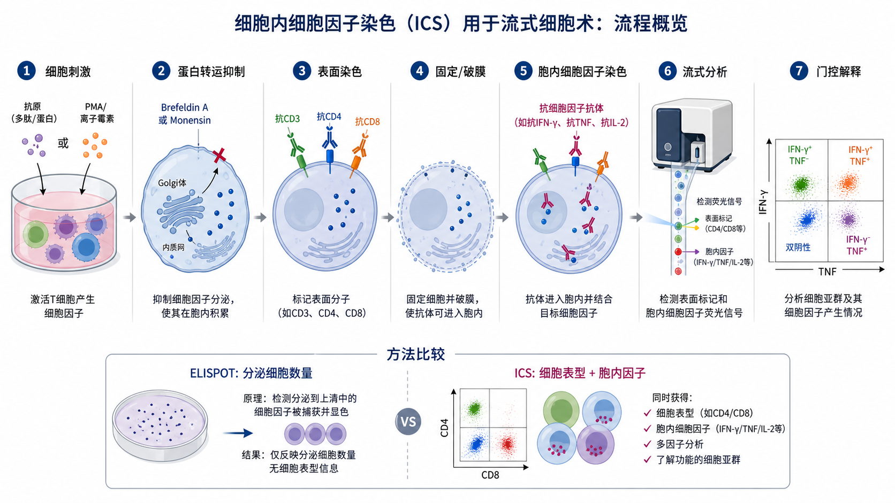
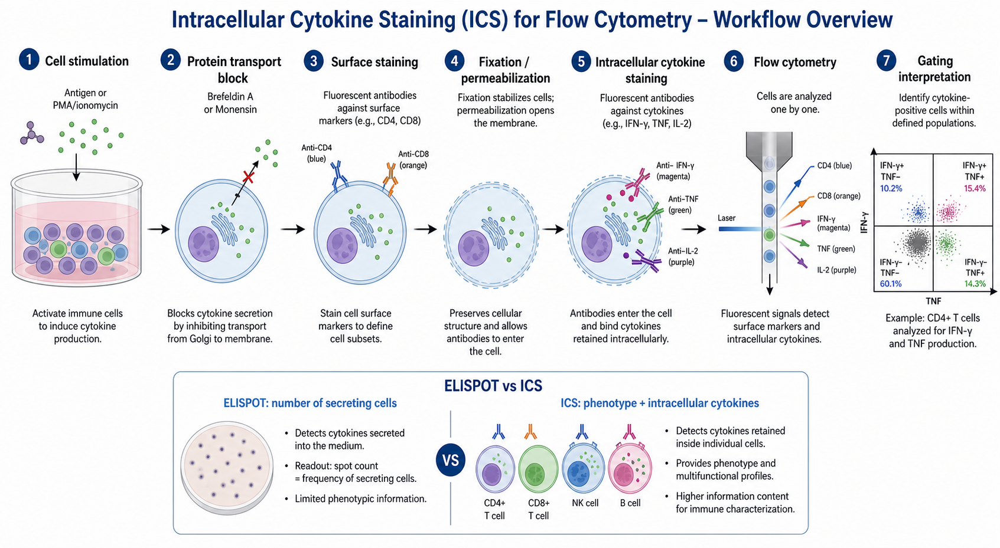

# 细胞内细胞因子染色

细胞内细胞因子染色（intracellular cytokine staining，ICS）是一种结合 [流式细胞术](流式细胞术.md) 的单细胞功能检测方法：先刺激细胞产生 [细胞因子](../番外/补充知识/细胞因子.md)，再用 [蛋白转运抑制剂](<../材(实验耗材工具篇)/蛋白转运抑制剂.md>) 让细胞因子滞留在细胞内，随后固定、破膜并用荧光抗体检测胞内 IFN-γ、TNF-α、IL-2 等分子。





一句话理解：ELISPOT 更擅长回答“有多少细胞分泌了某个因子”，ICS 更擅长回答“哪个细胞亚群同时产生了哪些细胞因子”。

## 实验发明历史与背景

ICS 是免疫荧光染色和流式细胞术结合后的重要扩展。早期流式主要看细胞表面标志物，例如 CD3、CD4、CD8、CD19；ICS 的出现让研究者可以在单细胞水平同时看到“表型”和“功能”。1993 年 Jung 等人在 Journal of Immunological Methods 发表了检测细胞内细胞因子的流式方法，是该技术发展中的经典早期工作。参考：[Jung et al., 1993, PubMed](https://pubmed.ncbi.nlm.nih.gov/8445253/)。

随后，直接偶联荧光的抗细胞因子抗体、固定/破膜缓冲液、Brefeldin A 和 Monensin 等蛋白转运抑制剂逐渐标准化，使 ICS 成为 T cell response（T 细胞反应）、vaccine immunogenicity（疫苗免疫原性）、感染免疫、肿瘤免疫和自身免疫研究中的常用方法。BD GolgiPlug 的产品说明也强调，Brefeldin A 能阻断胞内蛋白运输，使 cytokines/proteins 在 Golgi complex（高尔基体）中积累，从而提高细胞因子产生细胞的免疫荧光检测能力。参考：[BD GolgiPlug Protein Transport Inhibitor](https://www.bdbiosciences.com/en-us/products/reagents/flow-cytometry-reagents/research-reagents/single-color-antibodies-ruo/protein-transport-inhibitor-containing-brefeldin-a.555029?tab=product_details)。

## 应用场景

- 检测 antigen-specific T cells（抗原特异性 T 细胞）是否产生 [IFN-γ](../番外/补充知识/IFN-γ.md)、[TNF-α](../番外/补充知识/TNF-α.md)、[IL-2](<../材(实验耗材工具篇)/IL-2.md>)、IL-4、IL-17A 等细胞因子。
- 比较 CD4+ T cells、CD8+ T cells、NK cells、monocytes 等不同细胞群的功能状态。
- 评估疫苗、感染模型、肿瘤抗原、肽库或药物处理后的免疫反应。
- 判断 [多功能T细胞](../番外/补充知识/多功能T细胞.md)，例如 IFN-γ+ TNF-α+ IL-2+ 的比例。
- 与 [ELISPOT](ELISPOT.md)、ELISA、多重因子检测互补，区分“总分泌量”“分泌细胞频率”和“分泌细胞表型”。
- 研究 T cell exhaustion（T 细胞耗竭）、T helper polarization（辅助性 T 细胞分化）、CAR-T 或 TCR-T 的功能状态。

不适合的情况：

- 只需要测上清中总细胞因子浓度：优先考虑 ELISA 或多重因子检测。
- 细胞数量非常少、抗原特异性细胞极低频且不需要表型信息：ELISPOT 可能更灵敏。
- 目标是分泌到上清后的真实浓度或动力学曲线：ICS 因为使用转运抑制剂，会人为改变分泌过程。
- 抗体克隆不耐固定/破膜、荧光染料不耐甲醇或目标表位被固定破坏：需要换 clone、换 buffer 或改用其他方法。

## 实验目的

ICS 通常用于回答这些问题：

- 某个处理是否诱导特定细胞群产生细胞因子。
- 产生细胞因子的细胞属于 CD4、CD8、NK、单核细胞还是其他亚群。
- 同一个细胞是否同时产生多个细胞因子。
- 抗原刺激孔相对于未刺激孔是否出现特异性反应。
- 阳性刺激能否证明细胞仍具备反应能力。
- 荧光补偿和门控是否足以支持阳性群体的判定。

## 简要实验原理

### 刺激让细胞产生细胞因子

ICS 的第一步是让细胞在体外产生目标细胞因子。刺激方式决定了结果的生物学含义：

| 刺激方式 | 常见例子 | 读数含义 |
|---|---|---|
| 特异性刺激 | 抗原肽、肽库、重组蛋白、共培养靶细胞 | 更接近抗原特异性功能反应 |
| 多克隆强刺激 | [PMA](<../材(实验耗材工具篇)/PMA.md>) + [Ionomycin](<../材(实验耗材工具篇)/Ionomycin.md>) | 测细胞最大反应能力，不代表抗原特异性 |
| 受体交联刺激 | anti-CD3/CD28、LPS、TLR ligand | 测某类通路或细胞群的可激活性 |
| 未刺激对照 | 培养基、溶剂或载体 | 判断背景细胞因子水平 |

BioLegend 的 intracellular staining stimulation guide 列出了不同细胞因子对应的细胞类型、刺激物、刺激时间和 protein transport blocker；例如人 PBMC 中 IL-2、IL-4、IFN-γ、TNF-α 常见 4-6 小时刺激窗口，并常配合 Monensin 或 Brefeldin A。参考：[BioLegend Intracellular Staining Stimulation Guide](https://www.biolegend.com/en-us/intracellular-staining-stimulation-guide)。

### 阻断分泌让信号留在细胞内

细胞因子本来会被分泌到胞外。如果不阻断分泌，流式检测时细胞内信号可能很弱。常见 protein transport inhibitors（蛋白转运抑制剂）包括：

- [Brefeldin A](<../材(实验耗材工具篇)/Brefeldin A.md>)：常用于阻断 ER-to-Golgi transport（内质网到高尔基体运输），让许多分泌蛋白在胞内积累。
- [Monensin](<../材(实验耗材工具篇)/Monensin.md>)：离子载体类抑制剂，影响高尔基体相关运输和分泌过程。

Thermo Fisher 的胞内抗原染色 protocol 明确指出，体外刺激细胞检测 cytokine 时，需要在刺激最后几个小时加入 Monensin 或 Brefeldin A 等蛋白转运抑制剂；同时建议研究者在自己的体系中评估不同抑制剂的效果。参考：[Thermo Fisher BestProtocols: Staining Intracellular Antigens for Flow Cytometry](https://www.thermofisher.com/us/en/home/references/protocols/cell-and-tissue-analysis/protocols/staining-intracellular-antigens-flow-cytometry.html)。

### 表面染色定义细胞身份

ICS 的优势不是只看“IFN-γ 阳性”，而是看“CD8+ T 细胞中的 IFN-γ 阳性”。因此通常先用 [流式抗体](<../材(实验耗材工具篇)/流式抗体.md>) 标记表面分子，例如 CD3、CD4、CD8、CD45、CD14、CD19、NK marker 等。

表面染色一般放在固定/破膜前，因为很多表面表位在固定破膜后会变弱或消失。但如果某些表面抗体不耐固定，或实验目标是 phospho-flow（磷酸化蛋白流式），染色顺序需要按抗体 clone 和 buffer 体系重新优化。

### 固定破膜让胞内抗体进入细胞

固定用于保持细胞结构、降低样本进一步变化；破膜用于让抗体进入细胞质。Thermo Fisher 指出，固定和破膜可能改变细胞 light scatter（光散射）性质，并增加非特异背景，因此需要合适的 buffer、蛋白封闭和死细胞排除。参考：[Thermo Fisher BestProtocols](https://www.thermofisher.com/us/en/home/references/protocols/cell-and-tissue-analysis/protocols/staining-intracellular-antigens-flow-cytometry.html)。

ICS 检测胞质细胞因子时，常用 [固定破膜缓冲液](<../材(实验耗材工具篇)/固定破膜缓冲液.md>)。检测 nuclear transcription factors（核转录因子）或 phospho-proteins（磷酸化蛋白）时，可能需要 Foxp3/Transcription Factor buffer 或甲醇固定体系，不应直接套用普通 cytokine ICS 条件。

### 流式读数依赖补偿和门控

ICS 多数时候是多色流式实验。只要用了多个 [荧光染料](<../材(实验耗材工具篇)/荧光染料.md>)，就必须考虑 [流式补偿](../番外/补充知识/流式补偿.md)、spillover（荧光溢出）、autofluorescence（自发荧光）、[FMO对照](../番外/补充知识/FMO对照.md) 和 [门控策略](../番外/补充知识/门控策略.md)。否则，最终“阳性百分比”可能只是补偿错误或门控错误。

## 所需试剂、耗材和设备

| 类别 | 常用内容 | 作用 | 注意事项 |
|---|---|---|---|
| 细胞样本 | PBMC、脾细胞、T 细胞、单核细胞、细胞系共培养体系 | 提供待检测细胞 | 活率和处理时间会强烈影响细胞因子结果 |
| 刺激物 | 抗原肽、肽库、PMA/Ionomycin、anti-CD3/CD28、LPS | 诱导目标细胞产生细胞因子 | 特异刺激和强阳性刺激不能混为一谈 |
| 蛋白转运抑制剂 | Brefeldin A、Monensin、cocktail | 让细胞因子滞留在胞内 | 时间过长可能影响细胞状态和表面分子 |
| 表面抗体 | CD3、CD4、CD8、CD45、CD14 等 | 定义细胞亚群 | clone 要确认固定/破膜兼容性 |
| 胞内抗体 | anti-IFN-γ、anti-TNF-α、anti-IL-2 等 | 检测胞内细胞因子 | 尽量使用已验证适用于 ICS 的抗体 |
| 活死染 | [活死染料](<../材(实验耗材工具篇)/活死染料.md>)或 [死细胞排除染料](../番外/补充知识/死细胞排除染料.md) | 排除死细胞假阳性 | 固定型活死染通常要在固定前染 |
| 封闭 | [Fc封闭剂](<../材(实验耗材工具篇)/Fc封闭剂.md>)、正常血清、BSA | 降低非特异结合 | 单核/髓系细胞尤其要重视 |
| 缓冲液 | [PBS](<../材(实验耗材工具篇)/PBS.md>)、[流式染色缓冲液](<../材(实验耗材工具篇)/流式染色缓冲液.md>)、permeabilization buffer | 洗涤、染色、维持细胞悬液 | 胞内染色步骤通常要一直用破膜 buffer |
| 耗材 | [流式管](<../材(实验耗材工具篇)/流式管.md>)、96 孔 V/U 底板、滤网 | 染色和上机 | 样本要避免团聚和堵管 |
| 设备 | 流式细胞仪、离心机、37°C CO2 培养箱 | 刺激、染色、采集 | 上机前要做补偿和质控 |

## 实验设计

### 先决定实验问题

ICS 的设计要先从问题出发：

- 看抗原特异性反应：重点是抗原刺激、未刺激背景、阳性刺激和足够事件数。
- 看 T 细胞极化：重点是 CD4/CD8、IFN-γ、IL-4、IL-17A、IL-10 等组合。
- 看多功能 T 细胞：重点是多细胞因子 panel、补偿和 FMO 对照。
- 看药物影响：重点是药物处理是否影响细胞活率、分泌通路或表面 marker。
- 看单核/髓系细胞反应：重点是 LPS/TLR 刺激、Fc block、死细胞排除和高自发荧光。

### 对照设计

| 对照 | 目的 | 如果异常意味着什么 |
|---|---|---|
| [阴性对照](../番外/补充知识/阴性对照.md) / unstimulated control | 测基础背景 | 背景高会压缩可解释空间 |
| 溶剂对照 | 排除 DMSO 或药物溶剂影响 | 溶剂本身可能诱导或抑制反应 |
| [阳性对照](../番外/补充知识/阳性对照.md) | 证明细胞有反应能力 | 阳性失败时不能解释特异刺激阴性 |
| FMO 对照 | 帮助设置阳性门 | 多色 panel 中比同型对照更常用于门控边界 |
| [同型对照](../番外/补充知识/同型对照.md) | 粗略评估非特异结合 | 不能替代 FMO 和生物学对照 |
| 单染补偿管 | 建立补偿矩阵 | 补偿错误会直接制造假阳性群 |
| 活死染对照 | 设置死细胞排除门 | 死细胞常产生高背景和非特异抗体结合 |

### 细胞数和事件数

常见起点是每个条件 0.5-2 x 10^6 cells，但实际取决于目标细胞频率和仪器通道数。稀有抗原特异性 T 细胞需要更多 acquisition events（采集事件数），否则百分比看似漂亮但统计不稳。

实用判断：

- 只看总 T 细胞强刺激：细胞数压力较小。
- 看 CD8+ 里的小亚群：需要更多总事件。
- 看罕见抗原特异性反应：重复孔、背景扣除和足够事件数都很重要。

### 刺激时间和阻断时间

多数 T 细胞 IFN-γ/TNF/IL-2 ICS 常见刺激窗口是 4-6 小时；某些细胞因子、髓系细胞或弱抗原刺激可能需要更长时间。BD GolgiPlug 资料也提示，Brefeldin A 处理 4-6 小时能增强 cytokine-producing cells 的检测，但不建议在培养中超过 12 小时；同时 Brefeldin A 和 Monensin 对不同 cytokine 的影响可能随时间、刺激物和目标因子而不同。参考：[BD GolgiPlug Protein Transport Inhibitor](https://www.bdbiosciences.com/en-us/products/reagents/flow-cytometry-reagents/research-reagents/single-color-antibodies-ruo/protein-transport-inhibitor-containing-brefeldin-a.555029?tab=product_details)。

## 实验操作

下面是通用 T cell cytokine ICS 流程。正式实验以具体抗体、buffer 和仪器说明为准。

### 准备单细胞悬液

做法：

- 将细胞制备成均一单细胞悬液。
- 进行 [细胞计数](细胞计数.md) 和活率评估。
- 调整到合适密度，常见为 1-5 x 10^6 cells/mL。
- 根据板图分配样本、刺激、对照和重复孔。

为什么重要：

ICS 的读数来自单个细胞事件。细胞团聚会造成双ts、堵管、假阳性和门控困难。活率差会让死细胞吞噬抗体、产生自发荧光或非特异结合。

注意事项：

- PBMC 复苏后是否 resting（恢复培养）要根据实验目的决定。
- 刺激前细胞不宜长时间室温放置。
- 处理组之间细胞密度、培养基和 DMSO 终浓度要一致。

替代方案：

- 如果细胞量少，可用 96 孔 V 底板减少损失。
- 如果细胞容易结团，可上机前过筛或加入合适浓度 EDTA，但要确认不影响目标细胞。

### 细胞刺激

做法：

- 加入抗原、肽库、PMA/Ionomycin 或其他刺激物。
- 设置未刺激对照、溶剂对照和阳性刺激。
- 放入 37°C CO2 培养箱孵育。

为什么重要：

刺激条件决定 ICS 的生物学解释。PMA/Ionomycin 是强多克隆刺激，能证明细胞有产生细胞因子的能力，但不能说明抗原特异性。抗原肽或肽库更接近特异性反应，但阳性细胞频率通常低，对背景和事件数更敏感。

可能出错导致的结果：

- 阳性对照阴性：细胞状态差、刺激物失效、阻断剂或染色体系问题。
- 未刺激孔阳性高：细胞预激活、污染、培养基问题、处理过度或冻存复苏压力。
- 特异刺激弱：抗原浓度不合适、HLA 不匹配、刺激时间不合适或目标细胞极低频。

### 加入蛋白转运抑制剂

做法：

- 在刺激开始时或刺激后一定时间加入 Brefeldin A、Monensin 或 cocktail。
- 对同一项目保持相同加入时间、浓度和总刺激时间。
- 若比较不同 cytokine，最好预实验比较 Brefeldin A 与 Monensin。

为什么重要：

蛋白转运抑制剂让细胞因子无法顺利分泌到胞外，而是在细胞内积累，方便后续胞内抗体检测。没有这一步，许多分泌性细胞因子的胞内信号会过低。

注意事项：

- 阻断太短：胞内积累不足，阳性弱。
- 阻断太长：细胞状态下降，表面 marker 变化，背景升高。
- 不同抑制剂对不同 cytokine 的影响不同，不要以为一种条件能覆盖所有目标。

### 活死染和表面染色

做法：

- 若使用 fixable viability dye（固定型活死染），通常先在固定前染。
- 需要时加入 Fc block。
- 加入表面 marker 抗体，在冰上或 4°C 避光孵育。
- 洗涤去除游离抗体。

为什么重要：

表面染色把功能读数放回细胞身份中解释。例如 IFN-γ+ 的结果要知道来自 CD4+ T cell、CD8+ T cell、NK cell 还是污染/非目标细胞。活死染则把死亡细胞排除出去，减少假阳性背景。

Thermo Fisher 的 protocol 建议固定/破膜前可进行 fixable viability dye 和表面 marker 染色，并指出固定/破膜会增加非特异背景，使用额外蛋白和活死染有助于控制背景。参考：[Thermo Fisher BestProtocols](https://www.thermofisher.com/us/en/home/references/protocols/cell-and-tissue-analysis/protocols/staining-intracellular-antigens-flow-cytometry.html)。

替代方案：

- 如果某个表面 marker 被固定破坏，可改用 fixation-compatible clone。
- 如果样本是髓系细胞，Fc block 和更严格的洗涤更重要。
- 若使用甲醇固定体系，要确认表面荧光染料是否耐甲醇。

### 固定和破膜

做法：

- 加入 fixation buffer 固定细胞，常见为甲醛/多聚甲醛体系。
- 按说明孵育并避光。
- 洗涤后加入 permeabilization buffer。
- 后续胞内抗体染色和洗涤通常都要在破膜 buffer 中进行。

为什么重要：

固定保存细胞形态和抗原位置，破膜让抗体进入细胞。固定不足会导致细胞结构不稳定；固定过度或 buffer 不兼容会让表位消失、荧光变弱或散点图改变。

注意事项：

- 不同品牌固定/破膜 buffer 不要随意混用。
- 细胞团块要在固定前充分打散。
- 固定后 FSC/SSC 可能变化，门控要重新确认。

### 胞内细胞因子染色

做法：

- 在 permeabilization buffer 中稀释荧光偶联 anti-cytokine antibodies。
- 加入细胞并避光孵育。
- 用 permeabilization buffer 洗涤，再重悬于流式染色缓冲液。

为什么重要：

胞内抗体只有在破膜状态下才能进入细胞质。若普通 staining buffer 代替 permeabilization buffer，孔隙可能关闭或抗体进入效率下降，导致胞内信号弱。

注意事项：

- 优先使用已验证用于 ICS 的 antibody clone。
- 亮度较低的 cytokine 不适合配很暗的荧光染料。
- 高表达 marker 可用相对弱的染料，低表达 cytokine 应优先分配亮染料。

### 上机采集

做法：

- 上机前过滤或轻柔吹打，避免团块。
- 设置 FSC/SSC、电压、补偿和采集阈值。
- 采集足够事件数，尤其是稀有亚群。
- 保存 FCS 原始文件、补偿矩阵、门控策略和分析版本。

为什么重要：

ICS 的分析高度依赖采集质量。样本堵管、补偿错误、电压不一致、事件数不足，都会让最终百分比失真。

可能出错导致的结果：

- 阳性群体斜着拖尾：补偿不足或染料溢出。
- 所有通道背景升高：死细胞多、抗体过量、洗涤不足或自发荧光高。
- 样本之间 FSC/SSC 差异大：刺激或固定导致细胞状态不同，门控不能机械复制。

### 门控和分析

推荐基本顺序：

- Time gate：排除采集不稳定时段。
- FSC/SSC：圈出目标细胞大群。
- Singlets：排除双ts和细胞团。
- Live cells：排除死细胞。
- Lineage / subset gate：例如 CD3+、CD4+、CD8+。
- Cytokine gate：根据未刺激、FMO 和阳性对照设置 IFN-γ、TNF-α、IL-2 阳性门。
- Boolean analysis：分析单阳性、双阳性、多阳性细胞比例。

为什么重要：

ICS 的“阳性率”不是仪器直接给出的真理，而是门控策略和对照共同定义的结果。尤其在多色 panel 中，FMO 对照通常比同型对照更适合设置阳性边界。

## 结果解析

### 理想结果

- 未刺激对照背景低。
- 阳性刺激有明显细胞因子阳性群。
- 特异刺激高于未刺激对照。
- CD4、CD8、NK 或 monocyte 等细胞亚群清晰。
- FMO 对照能支持阳性门。
- 补偿后不同通道没有明显斜线拖尾。
- 活细胞比例足够高，重复样本一致。

### 常见结果指标

| 指标 | 含义 | 适合解释 |
|---|---|---|
| % cytokine+ cells | 某亚群中细胞因子阳性比例 | 比较组间响应强弱 |
| net response | 刺激孔减未刺激孔 | 抗原特异性反应常用 |
| MFI | mean fluorescence intensity，平均荧光强度 | 粗略反映单细胞信号强弱 |
| polyfunctionality | 多功能性 | 判断同一细胞是否同时产生多个因子 |
| responder frequency | 反应细胞频率 | 疫苗、感染、肿瘤免疫常用 |

### 不能过度解释的地方

- ICS 阳性不等于细胞真的把等量细胞因子分泌到了上清，因为转运抑制剂改变了分泌过程。
- MFI 不应简单等同于单细胞真实分泌量，抗体亲和力、染料亮度、固定破膜条件和补偿都会影响它。
- PMA/Ionomycin 阳性只说明细胞有被强刺激激活的能力，不代表识别某个抗原。
- 低频阳性群如果没有足够事件数、FMO 和未刺激对照，不应过度解释。
- 固定/破膜会改变散点图和部分表位，分析时要用同批处理样本建立门控。

## 异常结果与 troubleshooting

| 异常结果 | 可能原因 | 解决策略 |
|---|---|---|
| 阳性刺激无信号 | 细胞活性差；PMA/Ionomycin 失效；阻断剂未加；胞内抗体或 buffer 不兼容 | 检查活率；更换刺激物；确认 Brefeldin A/Monensin；换验证过的 ICS clone |
| 未刺激背景高 | 细胞预激活；污染；培养基或血清背景；死细胞多 | 优化细胞处理；换培养基；增加活死染；缩短处理时间 |
| 特异刺激无反应 | 抗原不合适；HLA 不匹配；目标细胞频率太低；刺激时间不合适 | 换肽库/抗原；增加事件数；优化时间和剂量；与 ELISPOT 互证 |
| 所有通道背景高 | 抗体过量；洗涤不足；Fc 结合；死细胞多 | 抗体滴定；增加洗涤；加 Fc block；严格排除死细胞 |
| 细胞大量死亡 | 刺激过强；阻断时间过长；离心过猛；样本质量差 | 降低刺激强度；缩短阻断；温和离心；改善复苏和培养 |
| CD4/CD8 群体变弱 | 表面表位被固定破坏；抗体 clone 不兼容；染色顺序不合适 | 换 clone；先表面后固定；查厂家 fixation compatibility |
| 阳性群斜线拖尾 | 补偿错误；染料组合不合理；荧光溢出严重 | 重新做单染补偿；调整 panel；低表达因子用亮染料 |
| 重复孔差异大 | 细胞混匀差；刺激物分配不均；细胞沉降；孔间蒸发 | 加样前混匀；使用多通道；避免边缘效应；增加重复 |
| 上机堵管 | 细胞团聚；DNA 粘稠；固定后未打散 | 过滤；加入 EDTA；温和吹打；减少死细胞 |

## ICS vs ELISPOT vs ELISA vs 普通表面流式

| 方法 | 核心读数 | 优点 | 局限 | 最适合的问题 |
|---|---|---|---|---|
| ICS | 某细胞亚群内 cytokine+ 比例和多功能组合 | 同时看表型和功能，可多参数分析 | 对补偿、门控、细胞状态要求高 | 哪类细胞在产生哪些细胞因子 |
| ELISPOT | spot-forming cells，分泌细胞频率 | 灵敏，适合低频抗原特异性反应 | 表型信息少 | 有多少细胞对抗原有分泌反应 |
| ELISA | 上清或血清中目标蛋白浓度 | 定量成熟，设备简单 | 不知道来源细胞 | 总细胞因子浓度是多少 |
| 普通表面流式 | 表面 marker 阳性比例和亚群组成 | 细胞分类能力强 | 不直接看胞内功能分子 | 样本中有哪些细胞亚群 |

一个实用判断：如果你想知道“CD8+ T 细胞里有多少 IFN-γ+ TNF-α+ 细胞”，选 ICS；如果只想知道“上清里 IFN-γ 有多少”，选 ELISA；如果想知道“每百万 PBMC 里有多少细胞响应抗原”，选 ELISPOT。

## 购买和记录建议

- 初学优先选同一厂商成套体系，例如 stimulation cocktail、protein transport inhibitor、fixation/permeabilization buffer 和对应验证抗体，减少兼容性问题。
- 抗体购买时必须看 application 是否明确支持 intracellular staining / flow cytometry，不要只看 WB、IHC 或 ELISA 阳性。
- 多色 panel 中，低表达细胞因子优先配亮染料；高表达表面 marker 可配相对弱染料。
- 记录抗体 clone 比只记录抗体名称更重要，因为不同 clone 对固定/破膜的耐受性可能不同。
- 常见供应商包括 [BD Biosciences](<../番外/试剂厂商/BD Biosciences.md>)、[BioLegend](../番外/试剂厂商/BioLegend.md)、[Thermo Fisher Scientific](<../番外/试剂厂商/Thermo Fisher Scientific.md>) / [Invitrogen](../番外/试剂厂商/Invitrogen.md)、[Cell Signaling Technology](<../番外/试剂厂商/Cell Signaling Technology.md>) 等。

## 推荐记录模板

### 中文记录模板

```text
实验日期：
实验目的：
样本来源：
细胞类型：
细胞处理状态：新鲜 / 冻存复苏 / resting 时间
细胞活率：
每管/每孔细胞数：
刺激物：
刺激浓度：
刺激总时间：
蛋白转运抑制剂：Brefeldin A / Monensin / cocktail
抑制剂加入时间：
表面抗体 panel：marker / clone / fluorochrome / 厂家 / 货号 / 批号
活死染：
Fc block：
固定/破膜试剂：
胞内抗体 panel：cytokine / clone / fluorochrome / 厂家 / 货号 / 批号
洗涤 buffer：
流式仪型号：
补偿方式：
FMO 对照：
门控策略：
采集事件数：
主要结果：
异常情况和处理：
```

### English record template

```text
Date:
Experimental aim:
Sample source:
Cell type:
Cell handling: fresh / thawed / resting time
Cell viability:
Cells per tube/well:
Stimulus:
Stimulus concentration:
Total stimulation time:
Protein transport inhibitor: Brefeldin A / Monensin / cocktail
Time of inhibitor addition:
Surface antibody panel: marker / clone / fluorochrome / vendor / catalog no. / lot no.
Viability dye:
Fc block:
Fixation/permeabilization reagent:
Intracellular antibody panel: cytokine / clone / fluorochrome / vendor / catalog no. / lot no.
Wash buffer:
Flow cytometer model:
Compensation method:
FMO controls:
Gating strategy:
Acquired events:
Main result:
Issues and actions:
```

## 小结

细胞内细胞因子染色的核心不是“多加几个抗体”，而是把刺激、分泌阻断、表面身份、胞内功能、荧光补偿和门控解释连成一条可靠证据链。它比 ELISA 和 ELISPOT 信息量更高，因为能看到具体细胞亚群和多功能组合；但它也更容易被细胞状态、抗体 clone、固定破膜体系、染料选择、补偿和门控影响。做 ICS 时，真正需要反复优化的不是最后一步上机，而是整个实验设计。

## 参考来源

- Jung T, Schauer U, Heusser C, Neumann C, Rieger C. Detection of intracellular cytokines by flow cytometry. Journal of Immunological Methods. 1993. https://pubmed.ncbi.nlm.nih.gov/8445253/
- Thermo Fisher Scientific. BestProtocols: Staining Intracellular Antigens for Flow Cytometry. https://www.thermofisher.com/us/en/home/references/protocols/cell-and-tissue-analysis/protocols/staining-intracellular-antigens-flow-cytometry.html
- BioLegend. Intracellular Staining Stimulation Guide. https://www.biolegend.com/en-us/intracellular-staining-stimulation-guide
- BD Biosciences. BD GolgiPlug Protein Transport Inhibitor Containing Brefeldin A. https://www.bdbiosciences.com/en-us/products/reagents/flow-cytometry-reagents/research-reagents/single-color-antibodies-ruo/protein-transport-inhibitor-containing-brefeldin-a.555029?tab=product_details
