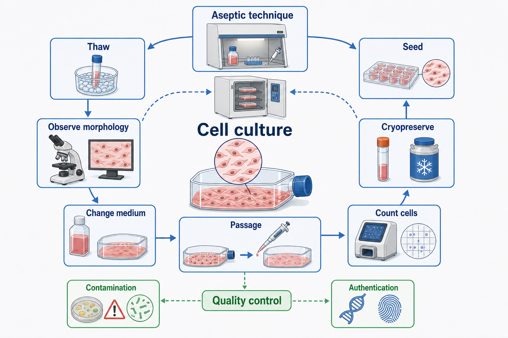
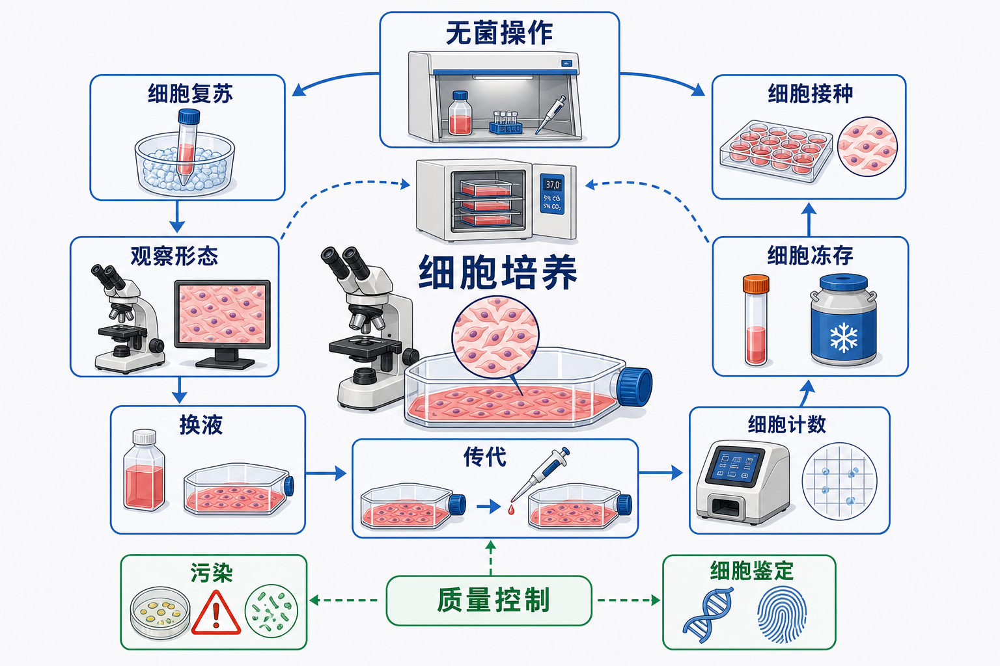

# 细胞培养

Cell culture（细胞培养）是指在体外条件下，让细胞在可控环境中存活、增殖、分化或维持特定功能的实验技术。这里的“可控环境”不只是温度和培养基，而是一个由无菌屏障、营养体系、气体环境、培养容器、细胞密度、传代历史和质量控制共同构成的系统。





## 实验发明历史

动物细胞培养的早期历史通常追溯到 tissue culture（组织培养）。Ross Granville Harrison 在 1907 年左右用蛙胚神经组织展示了体外组织生长，Alexis Carrel 等人在 1910-1912 年进一步发展了长期体外培养技术；后来的细胞系、病毒学、肿瘤生物学、干细胞和类器官研究都建立在这些技术基础上。[参考：An amended history of tissue culture](https://pubmed.ncbi.nlm.nih.gov/28092484/)；[参考：Carrel, 1912, Pure Cultures of Cells](https://rupress.org/jem/article/16/2/165/6797/PURE-CULTURES-OF-CELLS)

现代实验室里说的“细胞培养”，多数时候指 mammalian cell culture（哺乳动物细胞培养）：例如肿瘤细胞系、永生化细胞系、原代细胞、干细胞、免疫细胞和类器官。ATCC 的动物细胞培养指南也把培养基、培养条件、传代、冻存、污染控制和细胞系质量管理放在同一个工作流中讨论。[参考：ATCC Animal Cell Culture Guide](https://www.atcc.org/resources/culture-guides/animal-cell-culture-guide)

## 应用场景

细胞培养不是一个单独终点，而是很多实验的前置平台。常见应用包括：

- 维持和扩增细胞，用于 [RT-qPCR](RT-qPCR.md)、[PCR](PCR.md)、[Western blot](<Western blot.md>)、[免疫染色](免疫染色.md)、[流式细胞术](流式细胞术.md)、[测序](测序.md) 等下游实验。
- 药物处理、毒性检测、细胞增殖、迁移、侵袭、凋亡、周期和代谢实验。
- 转染、病毒包装、基因敲低、敲除、过表达和筛选。
- 原代细胞、干细胞、免疫细胞、神经细胞、内皮细胞等更接近生理状态的体外模型。
- 类器官、共培养、三维培养和疾病模型构建。
- 生物制品、抗体、蛋白表达或病毒扩增。

注意：细胞培养的“成功”不等于细胞活着。真正有用的培养状态应该同时满足：身份正确、无污染、状态稳定、传代历史可追溯，并且与实验问题匹配。

## 实验目的

细胞培养的核心目的可以分成三层：

- **维持生命**：让细胞在体外维持基本存活，避免污染、营养不足、pH 失控和过度拥挤。
- **保持状态**：让细胞维持预期表型、分化状态、基因表达、增殖速度和实验响应。
- **支撑实验**：在合适密度、合适时间点、合适状态下进入处理、检测或建模流程。

所以这一篇不应该写成“某一种细胞怎么养”的单一 recipe，而应该作为主入口：先建立通用范式，再把贴壁细胞、悬浮细胞、原代细胞、干细胞和类器官等特殊培养分流到子页面。

## 简要实验原理

离开体内环境后，细胞失去了组织结构、血液供应、免疫调控和邻近细胞生态。培养体系要尽量补上这些关键条件：

| 变量 | 作用 | 典型控制方式 |
| --- | --- | --- |
| 营养 | 提供糖、氨基酸、维生素、无机盐和能量来源 | [培养基](<../材(实验耗材工具篇)/培养基.md>)，例如 [DMEM](<../材(实验耗材工具篇)/DMEM.md>)、[RPMI 1640](<../材(实验耗材工具篇)/RPMI 1640.md>)、[MEM](<../材(实验耗材工具篇)/MEM.md>) 等 |
| 生长信号 | 提供贴壁、生长、分化或存活信号 | [FBS](<../材(实验耗材工具篇)/FBS.md>)、生长因子、细胞因子、专用补充剂 |
| pH | 影响酶活性、膜电位、代谢和细胞状态 | CO2/HCO3- 缓冲、[HEPES](<../材(实验耗材工具篇)/HEPES.md>)、[酚红](<../材(实验耗材工具篇)/酚红.md>) 指示 |
| 渗透压 | 影响细胞体积和膜张力 | 选择适配细胞类型的培养基和补充剂 |
| 气体 | 维持碳酸氢盐缓冲和氧环境 | [CO2培养箱](<../材(实验耗材工具篇)/CO2培养箱.md>)，常见 37°C、5% CO2 |
| 表面 | 影响贴壁、铺展、极性和分化 | 组织培养处理塑料、胶原、poly-L-lysine、[细胞外基质胶](<../材(实验耗材工具篇)/细胞外基质胶.md>) |
| 密度 | 影响接触抑制、旁分泌信号和增殖速度 | 接种密度、换液频率、传代比例 |

Thermo Fisher 的 Gibco 细胞培养协议也特别提醒：基础 mammalian cell culture protocol 只能作为通用框架，不同细胞类型偏离其推荐条件后，可能出现异常表型甚至培养失败。[参考：Gibco Cell Culture Protocols](https://www.thermofisher.com/us/en/home/references/gibco-cell-culture-basics/cell-culture-protocols.html)

## 核心分类

### 按细胞来源

| 类型 | 特点 | 主篇处理方式 |
| --- | --- | --- |
| Cell line（细胞系） | 可长期传代，流程相对稳定 | 主篇通用流程最适合这类细胞 |
| Primary cell（原代细胞） | 更接近体内状态，但寿命短、批次差异大 | 单独进入 [原代细胞培养](原代细胞培养.md) |
| Stem cell（干细胞） | 对基质、因子和传代方式敏感 | 单独进入 [干细胞培养](干细胞培养.md) |
| Immune cell（免疫细胞） | 多为悬浮或半悬浮，常需刺激因子 | 后续可拆出免疫细胞培养专题 |
| Organoid（类器官） | 三维结构，依赖基质胶和生长因子 cocktail | 单独进入 [类器官培养](类器官培养.md) |

### 按生长方式

| 类型 | 常见例子 | 培养逻辑 |
| --- | --- | --- |
| Adherent cell（贴壁细胞） | HEK293T、HeLa、A549、HUVEC、成纤维细胞 | 依赖培养表面；传代常需要消化或解离 |
| Suspension cell（悬浮细胞） | Jurkat、Raji、THP-1、PBMC、杂交瘤 | 重点是细胞密度窗口和离心/稀释传代 |
| Semi-adherent cell（半贴壁细胞） | 部分巨噬细胞、单核细胞样细胞 | 需要按细胞说明决定收集贴壁部分还是悬浮部分 |
| 3D culture（三维培养） | spheroid、organoid | 重点是基质、空间结构和机械剪切 |

## 实验所需试剂与器材

这是通用哺乳动物细胞培养的基础清单，具体细胞以供应商说明书和实验室 SOP 为准。

| 类别 | 常见内容 | 作用与注意事项 |
| --- | --- | --- |
| 基础培养基 | [DMEM](<../材(实验耗材工具篇)/DMEM.md>)、[RPMI 1640](<../材(实验耗材工具篇)/RPMI 1640.md>)、[MEM](<../材(实验耗材工具篇)/MEM.md>)、[Ham F-12](<../材(实验耗材工具篇)/Ham F-12.md>) 等 | 不同细胞对糖浓度、氨基酸、缓冲体系和补充剂要求不同 |
| 血清 | FBS（Fetal Bovine Serum，胎牛血清） | 提供复杂生长因子和结合蛋白；批次差异会影响实验 |
| 补充剂 | [L-谷氨酰胺](<../材(实验耗材工具篇)/L-谷氨酰胺.md>)、[NEAA](<../材(实验耗材工具篇)/NEAA.md>)、[丙酮酸钠](<../材(实验耗材工具篇)/丙酮酸钠.md>)、[生长因子](<../材(实验耗材工具篇)/生长因子.md>) | 需要记录配方、浓度、批号和有效期 |
| 抗生素 | [青链霉素](<../材(实验耗材工具篇)/青链霉素.md>) 等 | 可降低细菌污染风险，但不应该替代无菌操作 |
| 洗液 | [PBS](<../材(实验耗材工具篇)/PBS.md>) 或 [DPBS](<../材(实验耗材工具篇)/DPBS.md>) | 常用于洗去血清、死细胞和残余培养基 |
| 解离试剂 | [Trypsin-EDTA](<../材(实验耗材工具篇)/Trypsin-EDTA.md>)、TrypLE、Accutase | 用于贴壁细胞传代；敏感细胞需更温和方案 |
| 冻存体系 | [细胞冻存液](<../材(实验耗材工具篇)/细胞冻存液.md>)、[DMSO](<../材(实验耗材工具篇)/DMSO.md>)、血清或无血清冻存液 | DMSO 可保护冻存，但复苏后应尽快稀释或去除 |
| 容器 | [细胞培养瓶](<../材(实验耗材工具篇)/细胞培养瓶.md>)、[细胞培养皿](<../材(实验耗材工具篇)/细胞培养皿.md>)、[细胞培养板](<../材(实验耗材工具篇)/细胞培养板.md>) | 表面积、通气方式和表面处理会影响细胞状态 |
| 无菌操作设备 | [BSC生物安全柜](<../材(实验耗材工具篇)/BSC生物安全柜.md>)、75% 乙醇、废液缸 | 保护样本、操作者和环境 |
| 转移工具 | [移液枪](<../材(实验耗材工具篇)/移液枪.md>)、[移液枪吸头](<../材(实验耗材工具篇)/移液枪吸头.md>)、[血清移液管](<../材(实验耗材工具篇)/血清移液管.md>)、[电动助吸器](<../材(实验耗材工具篇)/电动助吸器.md>) | 吸头和移液管应无菌，避免交叉污染 |
| 观察与计数 | [倒置显微镜](<../材(实验耗材工具篇)/倒置显微镜.md>)、[血球计数板](<../材(实验耗材工具篇)/血球计数板.md>)、[台盼蓝](<../材(实验耗材工具篇)/台盼蓝.md>) 或 [自动细胞计数仪](<../材(实验耗材工具篇)/自动细胞计数仪.md>) | 判断形态、密度、活率和污染 |
| 低温保存 | [冻存管](<../材(实验耗材工具篇)/冻存管.md>)、[程序降温盒](<../材(实验耗材工具篇)/程序降温盒.md>)、-80°C 冰箱、[液氮罐](<../材(实验耗材工具篇)/液氮罐.md>) | 长期保存应使用液氮或气相液氮系统 |

## 通用 workflow

### 实验前准备

**怎么做**：确认细胞名称、来源、培养基配方、传代数、冻存批次、支原体检测状态和细胞系鉴定状态。提前预温培养基、PBS/DPBS 和解离试剂，准备好培养容器、吸头、移液管、废液和标签。

**为什么**：细胞培养失败经常不是某一步“技术动作”出错，而是从一开始就用了错误培养基、错误传代数、错误细胞或污染来源不明的冻存管。

**注意事项**：

- 新细胞进入实验室后，优先建立 master stock（主冻存库）和 working stock（工作冻存库）。
- 不同细胞不要在同一时间、同一安全柜内交叉操作，尤其是高污染风险或来源不明的细胞。
- 抗生素不能替代无菌技术。ATCC 指出，标准抗生素并不能保护细胞免受支原体污染，因为支原体缺乏细胞壁，青霉素类药物没有作用。[参考：ATCC Mycoplasma Contamination](https://www.atcc.org/the-science/authentication/mycoplasma-contamination)

**替代方案**：

- 如果是高风险细胞或外来细胞，先隔离培养并做 [支原体检测](支原体检测.md)。
- 如果细胞身份关键，先做 [细胞系鉴定](细胞系鉴定.md)，再投入长期项目。

**出错后果**：污染扩散、细胞混淆、实验不可复现、后期发现身份错误导致整批数据作废。

### 无菌操作

**怎么做**：在生物安全柜中完成开瓶、吸液、换液、传代、接种和冻存相关操作。进入安全柜前擦拭瓶身和耗材外表面，操作时避免手臂频繁跨越开口容器，开盖时间尽量短，废液和干净试剂分区放置。

**为什么**：Aseptic technique（无菌操作）不是让环境“绝对无菌”，而是在操作者、空气、耗材和培养物之间建立污染屏障。Thermo Fisher 的细胞培养安全页面也把无菌技术定义为降低环境微生物进入培养体系概率的一组操作。[参考：Gibco aseptic techniques](https://www.thermofisher.com/us/en/home/references/gibco-cell-culture-basics/aseptic-technique.html)

**注意事项**：

- 安全柜不是储物柜，过多物品会扰乱气流。
- 不要把手、瓶身或废液容器放在无菌开口正上方。
- 不要让吸头、移液管、瓶口碰到非无菌表面。
- 75% 乙醇用于表面消毒，但不能修复已经污染的培养物。

**替代方案**：没有合格安全柜时，不建议进行常规哺乳动物细胞培养。临时开放台操作只能用于极低风险、非关键样本，并且污染风险显著增加。

**出错后果**：细菌、真菌、酵母或支原体污染；污染可能先表现为培养基变黄、浑浊、漂浮颗粒，也可能完全没有肉眼信号。

### 细胞复苏

**怎么做**：从液氮取出冻存管，快速在 37°C 条件下融化到仅剩少量冰晶；擦拭外壁后转入安全柜，将细胞缓慢加入预温完全培养基中，再按细胞类型决定是否离心去除 DMSO，最后接种到合适容器中。

**为什么**：冻融对细胞压力很大。Thermo Fisher 的 thawing cells protocol 强调快速融化、预温完全培养基、无菌操作，并提醒冻存管从液氮取出后存在爆裂风险。[参考：Thermo Fisher Thawing Cells](https://www.thermofisher.com/uk/en/home/references/gibco-cell-culture-basics/cell-culture-protocols/thawing-cells.html)

**注意事项**：

- 复苏细胞通常需要较高接种密度帮助恢复。
- 不要剧烈吹打、涡旋或高速离心脆弱细胞。
- 对 DMSO 敏感细胞，复苏后尽快稀释或换液。

**替代方案**：

- 部分细胞说明书允许不离心，直接稀释 DMSO 后接种，次日换液。
- 原代细胞、免疫细胞或干细胞复苏条件差异很大，应优先遵循供应商说明。

**出错后果**：复苏率低、贴壁差、恢复慢、细胞大量死亡或后续状态漂移。

### 日常观察

**怎么做**：每天或按细胞生长速度观察细胞形态、密度、培养基颜色、漂浮细胞、颗粒、污染迹象和异常空泡。贴壁细胞重点看 confluence（汇合度）和形态；悬浮细胞重点看密度、团聚、碎片和活率。

**为什么**：显微镜观察是细胞培养最早的报警系统。许多问题在检测前已经能从形态看到：过度拥挤、营养不足、消化过度、污染、支原体或培养基不适。

**注意事项**：

- 不同细胞正常形态不同，必须建立本实验室自己的“健康图谱”。
- 培养基颜色受 pH、细胞代谢、CO2 平衡和污染影响，不要只凭颜色判断。
- 观察时间和拍照记录尽量固定，方便比较状态变化。

**替代方案**：关键实验前可增加活率检测、支原体检测、marker 检测或短期生长曲线。

**出错后果**：等到细胞死亡或实验结果异常才回头追溯，通常已经无法判断问题发生在哪一天。

### 换液

**怎么做**：吸去旧培养基，必要时用 PBS/DPBS 轻洗，再加入预温新鲜完全培养基。贴壁细胞避免直接把液流冲到细胞层中央；悬浮细胞换液常需要离心收集细胞后重悬。更细的分支可以写入 [细胞换液](细胞换液.md)。

**为什么**：换液可以补充营养、移除代谢废物、恢复 pH，并减少死细胞和碎片。过少换液会导致营养耗竭；过频繁换液也可能拿走细胞分泌的自分泌/旁分泌因子。

**注意事项**：

- 对贴壁不牢或刚复苏的细胞，吸液和加液要贴壁轻柔。
- 不要让细胞长时间暴露在干燥空气中。
- 需要处理实验时，换液本身也是刺激，要保持组间一致。

**替代方案**：

- 对生长慢或需要条件化因子的细胞，可半量换液。
- 对悬浮细胞，可通过补加新鲜培养基维持密度，而不是完全换液。

**出错后果**：细胞脱落、应激、pH 失控、实验组和对照组因为换液节奏不同而产生批次效应。

### 细胞传代

**怎么做**：当细胞达到合适汇合度或密度窗口时，将一部分细胞转移到新容器中继续培养。贴壁细胞通常经历洗涤、解离、终止、重悬、计数和重新接种；悬浮细胞通常通过稀释或离心重悬完成。

**为什么**：传代的本质是维持细胞在合适生长窗口。过密会改变代谢、接触抑制、缺氧和分化状态；过稀会恢复慢甚至死亡。

**注意事项**：

- 不同细胞的最佳汇合度不同，常见贴壁细胞可在约 70%-90% 汇合度传代，但这不是所有细胞的标准。
- 每次传代都要记录 passage number（传代数）。
- 不要为了省事让细胞长期过度汇合。

**替代方案**：

- 易受胰酶损伤的细胞可使用 TrypLE、Accutase 或机械吹打。
- 难贴壁细胞可使用 coated surface（包被表面），例如胶原、明胶、poly-L-lysine 或基质胶。

**出错后果**：细胞生长变慢、形态改变、分化状态改变、转染效率下降、实验重复性变差。ATCC 的贴壁细胞传代指南也强调，应根据具体细胞系推荐条件决定传代比例和培养条件。[参考：ATCC Guide to Subculturing Cell Line Monolayers](https://www.atcc.org/resources/technical-documents/guide-to-subculturing-cell-line-monolayers)

### 细胞消化与解离

**怎么做**：对贴壁细胞，通常先吸去培养基，用 PBS/DPBS 洗去血清，再加入适量 Trypsin-EDTA 或其他解离试剂，待细胞变圆、松动后加入含血清培养基终止，轻柔吹打成单细胞悬液。具体操作可在 [细胞消化](细胞消化.md) 中展开。

**为什么**：血清会抑制胰酶活性；解离不足会导致细胞团块，解离过度会损伤膜蛋白和降低活率。

**注意事项**：

- 显微镜下看细胞状态，而不是机械等待固定时间。
- 对表面 marker 敏感的实验，胰酶可能影响后续检测。
- 干细胞、原代细胞、神经细胞等可能需要更温和的解离方式。

**替代方案**：使用 TrypLE、Accutase、EDTA-only、scraper（细胞刮刀）或专用 dissociation kit。

**出错后果**：细胞团聚、死亡、贴壁差、表面抗原损伤、下游流式或功能实验异常。

### 细胞计数与接种

**怎么做**：混匀细胞悬液，取样后用台盼蓝或自动计数系统评估总细胞数和活率，再按目标密度接种到新容器或实验板中。计数细节进入 [细胞计数](细胞计数.md)，接种密度和铺板策略进入 [细胞接种](细胞接种.md)。

**为什么**：接种密度会影响增殖速度、细胞周期、分化、药物反应和转染效率。很多“实验结果不稳定”本质上是接种密度不一致。

**注意事项**：

- 计数前必须充分但轻柔混匀，细胞沉降很快。
- 技术重复之间的接种体积和细胞浓度要一致。
- 细胞团块会让自动计数和血球计数都失真。

**替代方案**：

- 对团聚细胞可优化解离、过滤或使用宽口吸头。
- 对强依赖密度的细胞，先做接种密度梯度，确定实验窗口。

**出错后果**：孔间差异大、药物反应曲线漂移、细胞太稀不恢复、细胞太密过早进入接触抑制或营养耗竭。

### 细胞冻存

**怎么做**：选择状态健康、无污染、对数生长期的细胞，计数后用预冷冻存液重悬，分装到冻存管；通常采用控制降温速率的方式先降至 -80°C，再转入液氮长期保存。

**为什么**：冻存是细胞培养的保险。没有低传代、身份明确、检测阴性的冻存库，后续所有实验都暴露在细胞漂移和污染丢失风险中。ATCC 和 Thermo Fisher 都把 cryopreservation（冻存）视为细胞培养工作流中的关键步骤。[参考：ATCC Cryopreservation](https://www.atcc.org/cell-products/media-and-reagents/cryopreservation-of-cells)；[参考：Thermo Fisher freezing cells](https://www.thermofisher.com/us/en/home/references/gibco-cell-culture-basics/cell-culture-protocols/freezing-cells.html)

**注意事项**：

- 不要用状态差、污染可疑或过度传代的细胞建立冻存库。
- 冻存液中的 DMSO 对细胞和人体都有风险，操作时注意防护。
- 冻存管标签要能耐低温，信息不能只写在管盖上。

**替代方案**：

- 对敏感细胞可使用商业无血清冻存液。
- 对原代细胞、干细胞和免疫细胞，应使用专用冻存方案并验证复苏率。

**出错后果**：复苏失败、批次不可追溯、长期项目中途丢失可用细胞。

### 质量控制

**怎么做**：定期做支原体检测、形态记录、传代数管理、冻存库管理，关键细胞系做 STR（short tandem repeat，短串联重复序列）鉴定或其他身份验证。

**为什么**：细胞身份错误和隐匿污染会直接破坏实验可信度。ATCC 说明 STR profiling（STR 分型）可为人源细胞系建立 DNA fingerprint（DNA 指纹）；ICLAC 也维护已知误鉴定细胞系数据库，用于提醒研究者交叉污染和错误来源问题。[参考：ATCC Cell Authentication](https://www.atcc.org/services/cell-authentication)；[参考：ICLAC](https://iclac.org/)

**注意事项**：

- 支原体污染可能没有明显浑浊或形态变化，不能靠肉眼排除。
- 外来细胞、长期培养细胞、发表前关键细胞都应该做身份和污染检查。
- 质量控制记录要和冻存批次、传代数、实验日期关联。

**替代方案**：

- 人源细胞用 STR；小鼠细胞可用 mouse STR 或 SNP-based 方法；原代细胞可结合来源证明、marker 和功能检测。
- 支原体可用 PCR、荧光染色、培养法或商业快速检测试剂盒。

**出错后果**：细胞不是你以为的细胞，或者培养物长期被支原体改变，却仍然产生“看似漂亮”的数据。

## 不同细胞类型的特殊处理

### 贴壁细胞培养

[贴壁细胞培养](贴壁细胞培养.md) 是最接近通用流程的分支。重点是汇合度、贴壁状态、消化时间、接种密度和培养表面。HEK293T、HeLa、A549 等常见细胞系通常比较耐受，但也容易因为过度传代、过度汇合或长期抗生素掩盖污染而改变状态。

### 悬浮细胞培养

[悬浮细胞培养](悬浮细胞培养.md) 的重点不是“消化”，而是维持合适 cell density（细胞密度）窗口。细胞太稀可能缺少旁分泌支持，太密则营养耗竭和死亡增加。传代方式常见为稀释、离心换液或补加培养基。

### 原代细胞培养

[原代细胞培养](原代细胞培养.md) 更接近体内状态，但更脆弱。它常见问题是供体差异、批次差异、有限传代寿命、专用培养基依赖和解离损伤。原代细胞的 protocol 优先级通常高于通用细胞培养经验。

### 干细胞培养

[干细胞培养](干细胞培养.md) 的核心不是单纯增殖，而是维持 pluripotency（多能性）或特定分化潜能。它通常依赖特定基质、无血清培养基、生长因子、克隆形态判断和温和传代。传代方式、细胞团大小和 ROCK inhibitor（ROCK 抑制剂）使用都可能影响状态。

### 类器官培养

[类器官培养](类器官培养.md) 属于三维培养系统，重点是细胞来源、基质胶、生长因子 cocktail、机械剪切、传代比例和结构成熟时间。类器官不是普通细胞单层的“厚一点版本”，它更像一个微型组织模型。

### 免疫细胞、神经细胞与内皮细胞

这些细胞可以后续继续拆成专题：

- [免疫细胞培养](免疫细胞培养.md) 常受激活状态、细胞因子、血清来源和密度影响。
- [神经细胞培养](神经细胞培养.md) 通常对基质、机械扰动和培养基更敏感。
- [内皮细胞培养](内皮细胞培养.md) 依赖专用培养基、基质和 passage limit（传代上限），高传代后功能很容易变化。

## 细胞培养分支对比

| 分支 | 最核心变量 | 操作逻辑 | 主要风险 | 什么时候优先选择 |
| --- | --- | --- | --- | --- |
| [贴壁细胞培养](贴壁细胞培养.md) | 汇合度、培养表面、消化时间、接种密度 | 观察形态和汇合度，换液，解离传代，按面积接种 | 过度汇合、消化过度、贴壁差、铺板不均 | 常规肿瘤细胞系、上皮样/成纤维样细胞、成像和贴壁功能实验 |
| [悬浮细胞培养](悬浮细胞培养.md) | 活细胞密度、活率、团聚、培养体积 | 按 cells/mL 计数，稀释传代、补液或离心换液 | 过稀不恢复、过密酸化、团聚、离心损伤 | 血液系统细胞、免疫细胞、杂交瘤、悬浮生产细胞 |
| [原代细胞培养](原代细胞培养.md) | 供体、批次、传代窗口、专用培养体系 | 优先按供应商或组织来源 protocol，低传代内完成实验 | 供体差异、衰老、污染、功能漂移 | 需要更接近体内状态、验证细胞系结论或做转化研究 |
| [干细胞培养](干细胞培养.md) | 多能性/分化潜能、克隆形态、基质和生长因子 | 维持特定状态，温和传代，严格观察分化迹象 | 自发分化、克隆状态改变、传代损伤 | iPSC/ESC 维护、分化诱导、再生医学模型 |
| [类器官培养](类器官培养.md) | 三维基质、生长因子 cocktail、结构成熟时间 | 在基质中三维生长，按结构状态传代和换液 | 基质批次差异、机械破坏、结构异质性 | 患者来源模型、组织结构和药物反应研究 |
| [免疫细胞培养](免疫细胞培养.md) | 激活状态、细胞因子、密度、供体差异 | 多为悬浮或半悬浮，按激活/扩增目标调节因子 | 过度激活、耗竭、供体差异、死亡增加 | T 细胞、PBMC、巨噬细胞、炎症和免疫功能实验 |
| [神经细胞培养](神经细胞培养.md) | 基质、成熟时间、机械扰动、神经突起 | 低扰动维护，重视形态成熟和突起网络 | 机械损伤、成熟不足、包被失败 | 神经发育、突触、神经毒性和神经退行性模型 |
| [内皮细胞培养](内皮细胞培养.md) | 专用培养基、基质、传代上限、屏障/血管功能 | 低传代使用，关注形态、marker 和功能 assay | 高传代功能下降、基质依赖、状态漂移 | 血管生成、屏障功能、炎症黏附和内皮功能实验 |

这个对比表的用途是帮读者先选“培养逻辑”，不是替代具体 protocol。真正操作时仍然要回到对应细胞来源、供应商说明书和实验室 SOP。

## 常见异常结果与原因

| 异常结果 | 常见原因 | 处理策略 |
| --- | --- | --- |
| 培养基快速变黄 | 细胞过密、污染、CO2/pH 异常、代谢过快 | 看显微镜，检查培养箱 CO2 和污染，必要时换液或传代 |
| 培养基浑浊 | 细菌、酵母或真菌污染 | 立即隔离并废弃污染培养物，清洁安全柜和培养箱；详见 [细胞污染](细胞污染.md) |
| 细胞不贴壁 | 复苏状态差、培养表面不合适、消化过度、接种太低 | 提高接种密度，换包被表面，缩短消化时间 |
| 细胞生长慢 | 培养基/血清不合适、传代过高、支原体、密度太低 | 回查配方和批号，做支原体检测，复苏低传代库存 |
| 细胞形态变圆或颗粒多 | 应激、污染、营养不足、消化损伤 | 检查 pH、污染和传代记录，必要时换新库存 |
| 漂浮死细胞增多 | 过度汇合、换液/吹打太粗暴、药物毒性 | 降低接种密度，轻柔操作，设置处理对照 |
| 复孔差异大 | 接种不均、细胞沉降、边缘孔蒸发、混匀不足 | 接种时持续轻柔混匀，避免边缘孔或加 PBS 防蒸发 |
| 实验重复性差 | 细胞状态、传代数、血清批号、密度不一致 | 固定 passage window、接种密度和处理时间 |
| NTC 或下游实验污染 | 换吸头不及时、细胞间交叉污染、PCR 区域污染 | 分区操作，使用滤芯吸头，重建干净细胞库存 |
| 支原体阳性 | 外来细胞带入、交叉操作、检测不规律 | 通常优先废弃并从阴性冻存复苏；治疗只作为特殊挽救 |

## 推荐记录模板

细胞培养记录要能回答三个问题：这是什么细胞、处于什么状态、经历过什么处理。推荐至少记录：

中文模板：

```text
细胞名称：
物种 / 组织 / 疾病背景：
来源：
细胞鉴定状态：
支原体检测状态：
传代数：
培养基：
血清 / 补充剂：
抗生素：
培养容器：
接种密度：
操作时汇合度或细胞密度：
操作类型：复苏 / 换液 / 传代 / 接种 / 冻存 / 处理
传代比例：
试剂品牌、货号、批号：
培养箱条件：
操作者：
日期和时间：
形态记录：
图片记录路径：
下一步计划：
```

English template:

```text
Cell name:
Species / tissue / disease background:
Source:
Authentication status:
Mycoplasma status:
Passage number:
Culture medium:
Serum / supplements:
Antibiotics:
Culture vessel:
Seeding density:
Confluence or cell density at operation:
Operation: thaw / medium change / passage / seeding / freezing / treatment
Split ratio:
Reagent brand, catalog number, lot number:
Incubator condition:
Operator:
Date and time:
Morphology notes:
Image record path:
Next planned operation:
```

商业试剂建议记录品牌、货号、批号、配方版本、储存条件和开封日期。比如：

```text
DMEM high glucose, with L-glutamine, with sodium pyruvate, Gibco, Cat. No. xxxxx, Lot No. xxxxx
FBS, heat-inactivated or not, brand, Cat. No. xxxxx, Lot No. xxxxx
Trypsin-EDTA 0.25%, phenol red, brand, Cat. No. xxxxx, Lot No. xxxxx
```

## 小结

细胞培养的主线不是“复苏、换液、传代”几个动作，而是维持一个可解释、可追溯、可复现的活细胞系统。主篇先掌握通用范式：无菌操作、培养环境、细胞状态、传代窗口、冻存库和质量控制；具体细胞再进入对应分支，按细胞来源、生长方式和实验目的调整。

## 主要参考来源

- [ATCC Animal Cell Culture Guide](https://www.atcc.org/resources/culture-guides/animal-cell-culture-guide)
- [ATCC Guide to Subculturing Cell Line Monolayers](https://www.atcc.org/resources/technical-documents/guide-to-subculturing-cell-line-monolayers)
- [Thermo Fisher / Gibco Cell Culture Protocols](https://www.thermofisher.com/us/en/home/references/gibco-cell-culture-basics/cell-culture-protocols.html)
- [Thermo Fisher Thawing Cells](https://www.thermofisher.com/uk/en/home/references/gibco-cell-culture-basics/cell-culture-protocols/thawing-cells.html)
- [Thermo Fisher / Gibco Aseptic Laboratory Techniques and Safety in Cell Culture](https://www.thermofisher.com/us/en/home/references/gibco-cell-culture-basics/aseptic-technique.html)
- [ATCC Mycoplasma Contamination](https://www.atcc.org/the-science/authentication/mycoplasma-contamination)
- [ATCC Cell Authentication](https://www.atcc.org/services/cell-authentication)
- [ICLAC - International Cell Line Authentication Committee](https://iclac.org/)
