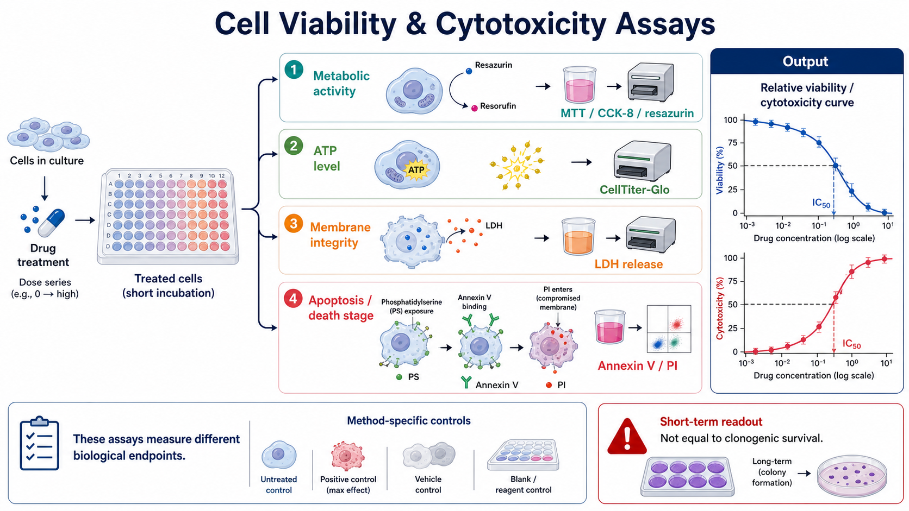
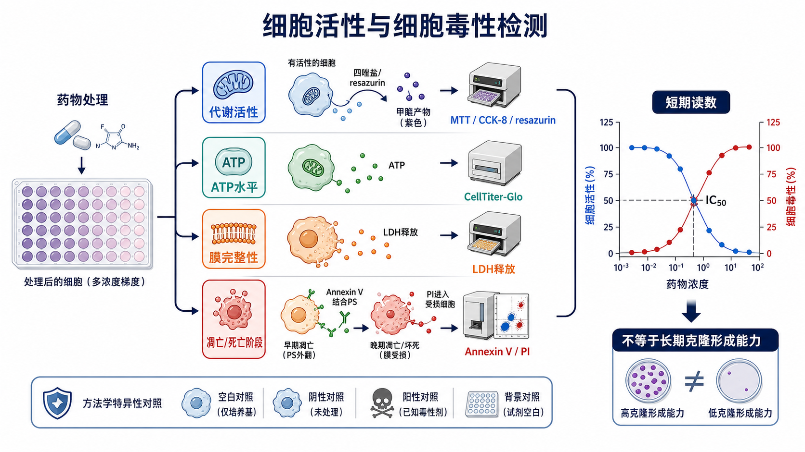

# 细胞毒性检测

Cell viability and cytotoxicity assays（细胞活性与细胞毒性检测）是一组用于评估处理后细胞是否仍保持代谢、能量、膜完整性或死亡阶段特征的实验。它们常用于药物筛选、转染条件优化、材料相容性评价、毒性浓度范围探索，以及与 [克隆形成实验](克隆形成实验.md) 互相补充。

一句话理解：细胞毒性检测不是一个单一实验，而是一组 readout（读数）家族。不同 assay 回答的是不同问题：代谢强不强、ATP 还剩多少、细胞膜有没有破、细胞是否进入凋亡或死亡阶段。



图：细胞活性与细胞毒性检测英文版 summary abstract graph，强调代谢活性、ATP 水平、膜完整性和凋亡/死亡阶段是不同层级的短期 readout，不应直接等同于长期克隆形成能力。



图：细胞活性与细胞毒性检测中文版 summary abstract graph，用于快速比较 MTT/CCK-8/resazurin、ATP、LDH release 和 Annexin V/PI 等检测路线。

## 方法历史与背景

早期细胞毒性评价常依赖形态观察、细胞计数和染料排斥实验。随着多孔板和酶标仪普及，细胞活性检测逐渐变成高通量、可定量的读板实验。

[MTT实验](MTT实验.md) 是经典代表。MTT 的英文全称是 3-(4,5-dimethylthiazol-2-yl)-2,5-diphenyltetrazolium bromide，中文常译作 3-(4,5-二甲基噻唑-2-基)-2,5-二苯基四氮唑溴盐。Mosmann 1983 年提出的 MTT colorimetric assay（MTT 比色法）把四唑盐还原成有色 formazan（甲臜）产物，用于 cellular growth and survival（细胞生长与存活）分析，是后来多种代谢型细胞活性检测的基础。参考：[Mosmann, *Journal of Immunological Methods*, 1983](https://pubmed.ncbi.nlm.nih.gov/6606682/)。

后续出现的 [CCK-8实验](CCK-8实验.md)、resazurin assay（瑞萨祖林检测；常见商品名包括 alamarBlue）和 ATP luminescence assay（ATP 发光法）提高了水溶性、灵敏度或操作便利性。Dojindo 对 CCK-8 的说明强调其核心试剂 WST-8（water-soluble tetrazolium salt-8，水溶性四唑盐-8）会被活细胞脱氢酶还原成水溶性 formazan。参考：[Dojindo CCK-8](https://www.dojindo.com/products/ck04/)。

细胞毒性检测本身也被纳入标准化评价体系。例如医疗器械生物学评价中的 ISO 10993-5 关注 in vitro cytotoxicity（体外细胞毒性）测试，说明细胞毒性读数不仅用于药物研究，也用于材料和器械安全性评价。参考：[ISO 10993-5](https://www.iso.org/standard/36406.html)。

## 应用场景

| 场景 | 常见问题 | 更合适的 readout |
| --- | --- | --- |
| 药物浓度预实验 | 选择后续机制实验的低毒或半抑制浓度 | CCK-8、ATP、resazurin、LDH |
| 药物敏感性比较 | 不同细胞系或基因背景 IC50 是否不同 | CCK-8、ATP、MTT，配合 [剂量反应曲线](../番外/补充知识/剂量反应曲线.md) |
| 转染/感染条件优化 | 试剂或病毒剂量是否造成明显毒性 | CCK-8、ATP、Live-Dead staining |
| 材料或提取液毒性 | 材料浸提液是否影响细胞活性 | CCK-8、MTT、LDH，参考 ISO 思路 |
| 死亡机制初筛 | 是早期凋亡、晚期凋亡还是坏死倾向 | Annexin V/PI、caspase assay、LDH |
| 长期功能验证 | 处理后细胞还能不能形成克隆 | 细胞毒性检测不足，需要 [克隆形成实验](克隆形成实验.md) |

细胞毒性检测很适合做早期筛查和条件摸索，但不能单独证明所有机制。比如 CCK-8 下降可能来自细胞数减少、代谢抑制、细胞周期停滞、线粒体状态改变或试剂干扰；LDH 升高更接近膜破裂，但不能完整区分所有死亡方式。

## 实验目的

细胞毒性检测通常用于：

- 评估处理是否降低短期细胞活性；
- 比较不同药物、剂量、时间和细胞背景的敏感性；
- 估算 [IC50](../番外/补充知识/IC50.md)（half maximal inhibitory concentration，半数最大抑制浓度）或 EC50（half maximal effective concentration，半数最大效应浓度）；
- 选择后续 Western blot、RT-qPCR、免疫荧光、流式细胞术或克隆形成实验的处理条件；
- 区分“细胞少了/代谢弱了”和“细胞膜破裂/死亡增加”的可能性；
- 判断转染、病毒转导、材料浸提液或培养条件是否造成非特异毒性。

## 简要实验原理

细胞毒性检测的核心不是“有没有一个万能活率数值”，而是把不同生物学现象转成可读信号。

| 检测家族 | 英文/中文 | 读数来自哪里 | 读数升高通常代表什么 | 主要风险 |
| --- | --- | --- | --- | --- |
| Tetrazolium assay | 四唑盐检测，MTT/CCK-8/WST-1 等 | 活细胞还原能力、脱氢酶活性 | 活细胞数或代谢活性更高 | 代谢改变不一定等于细胞数改变 |
| Resazurin assay | 瑞萨祖林检测 | resazurin 被还原为 resorufin | 还原能力更强 | 药物颜色/荧光干扰，长时间孵育可改变细胞状态 |
| ATP assay | [ATP细胞活性检测](ATP细胞活性检测.md) | ATP（adenosine triphosphate，三磷酸腺苷）发光反应 | 活细胞 ATP 总量更高 | ATP 受代谢状态影响，裂解型终点实验不可继续培养 |
| LDH assay | [LDH释放实验](LDH释放实验.md) | LDH（lactate dehydrogenase，乳酸脱氢酶）从膜破损细胞释放到上清 | 膜损伤或细胞裂解更多 | 对早期凋亡不敏感，上清处理很关键 |
| Annexin V/PI | [Annexin V-PI染色](Annexin V-PI染色.md) | Annexin V 结合外翻 PS，PI 进入膜受损细胞 | 可区分早期凋亡、晚期凋亡/坏死等阶段 | 依赖流式/成像门控，操作时间敏感 |
| Live-Dead staining | [Live-Dead染色](Live-Dead染色.md) | 活细胞酯酶活性和死细胞核酸染料等 | 可视化活死比例 | 定量依赖成像质量和阈值 |

Promega 对 CellTiter-Glo 的说明强调，该方法通过 ATP 作为 metabolically active cells（代谢活跃细胞）的指标来估计细胞活性。参考：[Promega CellTiter-Glo](https://www.promega.com/products/cell-health-assays/cell-viability-and-cytotoxicity-assays/celltiter_glo-luminescent-cell-viability-assay/)。

Thermo Fisher 对 alamarBlue 的说明将 resazurin 还原为荧光/比色产物作为细胞还原能力读数。参考：[Thermo Fisher alamarBlue](https://www.thermofisher.com/order/catalog/product/DAL1100)。

LDH 类检测通常把细胞膜完整性丧失作为 cytotoxicity（细胞毒性）的信号，因为 LDH 会从受损细胞释放到培养上清。参考：[Thermo Fisher Pierce LDH Cytotoxicity Assay Kit](https://www.thermofisher.com/order/catalog/product/88953)。

Annexin V/PI 检测基于 apoptosis（凋亡）过程中 phosphatidylserine（PS，磷脂酰丝氨酸）外翻，以及 propidium iodide（PI，碘化丙啶）不能进入完整细胞膜但可进入膜受损细胞的特性。参考：[Thermo Fisher Annexin V staining protocol](https://www.thermofisher.com/us/en/home/references/protocols/cell-and-tissue-analysis/protocols/annexin-v-staining-protocol.html)。

## 细胞毒性检测 vs 克隆形成实验

| 比较点 | 细胞毒性检测 | 克隆形成实验 |
| --- | --- | --- |
| 时间尺度 | 多为数小时到数天 | 多为 1-3 周 |
| 主要问题 | 细胞当前活性、死亡或膜损伤如何 | 单个细胞是否还能长期增殖成克隆 |
| 常见读数 | OD、荧光、发光、流式比例 | colony number、PE、SF |
| 适合用途 | 快速筛选浓度、毒性窗口、机制初筛 | 放疗/药敏长期功能验证 |
| 主要误区 | 把代谢下降直接解释为死亡 | 把克隆少直接解释为早期死亡 |
| 最好搭配 | 剂量反应曲线、形态观察、细胞计数、流式 | CCK-8/ATP/LDH/Annexin V/PI 做短期补充 |

如果一个药物 48 h CCK-8 明显下降，但克隆形成实验影响很弱，可能说明短期代谢或增殖被抑制，但细胞仍能恢复长期增殖。反过来，如果短期活性变化不大但克隆形成显著下降，可能说明细胞发生 delayed reproductive death（延迟性生殖死亡）或 DNA 损伤后长期增殖能力受损。

## 所需试剂、材料与设备

| 类别 | 常见内容 | 作用 |
| --- | --- | --- |
| 细胞 | 待测细胞系、原代细胞或处理后细胞 | 实验对象 |
| 培养体系 | 完全培养基、血清、抗生素按设计决定 | 保持细胞状态一致 |
| 接种耗材 | [细胞培养板](<../材(实验耗材工具篇)/细胞培养板.md>)，常用 96 孔板 | 建立剂量梯度和重复孔 |
| 处理因素 | 药物、转染试剂、病毒、材料浸提液、辐照等 | 产生待评价压力 |
| 洗涤液 | [PBS](<../材(实验耗材工具篇)/PBS.md>) 或 DPBS | 染色或洗涤时使用 |
| 代谢型试剂 | MTT、CCK-8、WST-1、resazurin 等 | 反映活细胞还原能力 |
| ATP 试剂 | CellTiter-Glo 或同类裂解发光试剂 | 反映 ATP 总量 |
| 膜损伤试剂 | LDH 检测试剂 | 反映细胞膜破裂/泄漏 |
| 活死染料 | Calcein-AM、EthD-1、PI、7-AAD 等 | 可视化或流式分析活死细胞 |
| 凋亡检测试剂 | Annexin V、PI、binding buffer | 区分早期凋亡和膜受损死亡细胞 |
| 读数设备 | [酶标仪](<../材(实验耗材工具篇)/酶标仪.md>)、发光读板仪、荧光显微镜、流式细胞仪 | 获取 OD、荧光、发光或流式数据 |
| 对照 | 空白孔、未处理、溶剂、阳性毒性、背景孔 | 归一化和排除干扰 |

## 实验设计

### 明确读数问题

**怎么做**：先写清楚实验想回答的问题，再选 assay。想看短期代谢活性，可选 CCK-8、MTT、resazurin；想看细胞膜破裂，可选 LDH；想看凋亡阶段，可选 Annexin V/PI；想看长期再增殖能力，则应转向克隆形成实验。

**为什么重要**：不同 assay 的“活性下降”含义不同。代谢型 assay 不应直接写成“死亡增加”，除非有 LDH、Annexin V/PI、caspase 或形态学证据支持。

**注意事项**：药物可能直接影响线粒体代谢、还原反应、吸光度或荧光背景。颜色很深、荧光强、会沉淀或会还原/氧化探针的化合物，尤其需要 reagent-only blank（试剂空白）和 drug-only blank（药物背景孔）。

**替代方案**：如果怀疑代谢干扰，可换 ATP、LDH、细胞计数或成像法交叉验证。

### 设计剂量和时间

**怎么做**：常见做法是设置 6-10 个浓度点，使用等比梯度，外加 0 浓度/溶剂对照。时间点常见 24 h、48 h、72 h，也可根据细胞倍增时间和药物机制调整。

**为什么重要**：剂量范围太窄会导致曲线没有上平台或下平台，无法可靠拟合 IC50；时间点太短可能看不到效应，太长则可能出现营养耗尽、过度融合或二次效应。

**注意事项**：处理时间必须和细胞状态匹配。增殖很慢的细胞可能需要更长时间；增殖很快的细胞如果初始接种太多，72 h 时会过密，读数会饱和。

**替代方案**：预实验可先做宽范围梯度，例如 10 倍梯度；正式实验再围绕效应区间做 2-3 倍梯度。

### 控制接种密度

**怎么做**：在正式实验前做细胞数线性范围测试，确认 assay signal（检测信号）随 cell number（细胞数）近似线性。正式实验中同一板、同一时间点、同一细胞类型应使用一致接种密度。

**为什么重要**：细胞太少会接近背景，细胞太多会信号饱和或营养不足。CCK-8、MTT 和 ATP assay 都不是在任何细胞数范围内都线性。

**注意事项**：边缘孔蒸发会改变体积和浓度，96 孔板外圈可加 PBS 或培养基但不用于正式读数，或使用防蒸发板盖。

**替代方案**：对贴壁细胞，处理前可让细胞贴壁恢复一夜；对悬浮细胞，要考虑离心、混匀和沉降带来的孔间差异。

### 设置对照

| 对照 | 含义 | 不设置的后果 |
| --- | --- | --- |
| Blank / medium only | 培养基和试剂背景 | OD/荧光/发光背景无法扣除 |
| Untreated control | 未处理细胞 | 无法判断基础活性 |
| Vehicle control | 溶剂对照，如 [DMSO](<../材(实验耗材工具篇)/DMSO.md>) | 药物效应和溶剂毒性混在一起 |
| Positive cytotoxicity control | 已知强毒性处理 | 无法确认 assay 是否能检测到最大效应 |
| Drug-only blank | 药物加培养基和试剂但无细胞 | 无法排除药物颜色、荧光或化学反应干扰 |
| No-reagent control | 有细胞但不加检测试剂 | 可评估细胞/药物本身背景 |

**注意事项**：阳性毒性对照要适度。过强裂解剂可以证明 assay 能响应最大毒性，但不一定代表药物真实死亡机制。

## 实验操作

### 细胞准备与接种

**怎么做**：选择状态稳定、污染阴性、处于对数生长期的细胞。按预实验确定的密度接种到 96 孔板或其他多孔板中。贴壁细胞通常接种后恢复一夜再处理。

**为什么重要**：细胞状态是细胞毒性检测最大的变量。过度融合、传代过久、支原体污染、刚复苏或刚经历强选择压力的细胞，会显著影响结果。

**注意事项**：混匀细胞悬液后尽快分装，避免沉降导致前后孔细胞数不同。每个条件至少设置技术重复，正式结论应来自独立生物学重复。

**替代方案**：如果细胞贴壁慢，可延长恢复时间；如果药物需要在接种同时处理，则必须确保贴壁差异不会成为主要变量。

**可能出错的结果**：同一处理组重复孔差异很大，多半来自接种不均、边缘效应、气泡、读板前混匀不一致或细胞状态不稳定。

### 药物或处理加入

**怎么做**：配制母液和工作液，保持各孔最终溶剂浓度一致。剂量梯度尽量在中间板或储液槽中预先稀释，再加入细胞孔。

**为什么重要**：药物浓度和溶剂比例是剂量反应曲线的基础。如果 DMSO 浓度随药物浓度变化，曲线可能反映的是溶剂毒性。

**注意事项**：疏水药物、易沉淀药物和光敏药物要特别记录溶解方式、储存时间、冻融次数和加药顺序。处理后最好显微镜观察形态，记录是否有沉淀、漂浮细胞或明显污染。

**替代方案**：对不稳定药物可设置换液补药；对长期处理可分开分析“连续暴露”和“短时暴露后换液”。

**可能出错的结果**：曲线不随浓度变化，可能是药物失效、浓度配错、药物沉淀、细胞不敏感或 assay 被药物干扰。

### 代谢型 assay：MTT、CCK-8、resazurin

**怎么做**：按试剂说明向每孔加入适量检测试剂，孵育到信号进入线性范围后读板。MTT 通常形成不溶性 formazan，需要溶解步骤；CCK-8/WST-8 和 resazurin 多为水溶性读数，更适合连续或简化操作。

**为什么重要**：这类 assay 读的是活细胞还原能力或代谢状态，不是直接数细胞，也不是直接检测死亡。

**注意事项**：孵育时间过长会让高细胞数孔饱和，低细胞数孔仍接近背景；含酚红培养基、血清、药物颜色或荧光可能影响读数。读板前要检查气泡，气泡会严重影响吸光度。

**替代方案**：如果 MTT 溶解不完全，可改用 CCK-8、WST-1、resazurin 或 ATP assay；如果化合物本身有强颜色，可增加 drug-only blank 或换发光法。

**可能出错的结果**：读数升高不一定代表细胞更多，可能是单细胞代谢增强；读数下降也不一定代表死亡，可能是线粒体活性或还原能力下降。

### ATP 发光 assay

**怎么做**：按说明加入 ATP 发光试剂，使细胞裂解并触发 luciferase（荧光素酶）反应，然后读取 luminescence（发光信号）。

**为什么重要**：ATP 通常与活细胞数量相关，灵敏度高、动态范围宽，适合高通量药筛。Promega CellTiter-Glo 就是这类常用体系。参考：[Promega CellTiter-Glo](https://www.promega.com/products/cell-health-assays/cell-viability-and-cytotoxicity-assays/celltiter_glo-luminescent-cell-viability-assay/)。

**注意事项**：这是裂解型终点实验，读完后细胞不能继续培养。ATP 也受代谢状态影响，不能无条件等同于绝对细胞数。

**替代方案**：如果需要保留细胞做后续实验，可选择非裂解型 resazurin 或平行板设计。

**可能出错的结果**：所有孔信号偏低可能来自细胞数太少、试剂失效、温度未平衡或发光衰减；高背景可能来自污染、试剂污染或读板设置错误。

### LDH 释放 assay

**怎么做**：收集培养上清或直接在原孔中取上清，加入 LDH 反应体系，读取颜色或荧光信号。通常需要设置 spontaneous release（自然释放）、maximum release（最大释放）和 medium background（培养基背景）。

**为什么重要**：LDH 是细胞质酶，完整细胞膜会把它保留在细胞内；膜破损或裂解后 LDH 进入上清，因此 LDH release 更接近膜完整性丧失。参考：[Thermo Fisher Pierce LDH Cytotoxicity Assay Kit](https://www.thermofisher.com/order/catalog/product/88953)。

**注意事项**：吸取上清时不要扰动细胞层；血清和培养基成分可能带来背景；强烈漂浮的死亡细胞如果被误吸或丢弃，会改变读数。

**替代方案**：若关心早期凋亡，LDH 不够敏感，应配合 Annexin V/PI 或 caspase 检测。

**可能出错的结果**：处理组 LDH 不高并不代表完全无死亡，可能只是细胞尚未膜破裂；LDH 很高也可能来自机械损伤、冻融、剧烈吹打或培养条件崩溃。

常见归一化公式：

```text
Cytotoxicity (%) =
(experimental LDH release - spontaneous LDH release) /
(maximum LDH release - spontaneous LDH release) × 100
```

具体公式应以所用试剂盒说明为准。

### Annexin V/PI 与 Live-Dead 染色

**怎么做**：Annexin V/PI 常用于 [流式细胞术](流式细胞术.md) 或荧光成像。Annexin V 结合早期凋亡时外翻的 PS；PI 进入膜受损细胞并标记核酸。Live-Dead 染色则常用 Calcein-AM 标记活细胞酯酶活性，用 EthD-1、PI 或类似染料标记死细胞。

**为什么重要**：这类方法能给出细胞死亡阶段或空间形态信息，弥补单纯读板 assay 只能给一个总体强度的缺点。

**注意事项**：Annexin V 染色依赖 calcium-containing binding buffer（含钙结合缓冲液），样本处理太慢或离心太剧烈会造成假阳性。PI/7-AAD 等核酸染料需要避光，且通常不适合固定前后随意混用。

**替代方案**：如果没有流式，可用荧光显微镜做半定量；如果需要机制证据，可结合 cleaved caspase-3、PARP cleavage、TUNEL 或线粒体膜电位检测。

**可能出错的结果**：Annexin V 阳性不一定等于不可逆死亡，PI 阳性更接近膜完整性丧失。不同时间点的比例变化比单一时间点更有解释力。

## 结果解析

### 活性和毒性归一化

代谢型或 ATP assay 常用 relative viability（相对细胞活性）表示：

```text
Relative viability (%) =
(treated signal - blank) /
(vehicle control signal - blank) × 100
```

如果 readout 是毒性信号，例如 LDH release，常用 cytotoxicity（细胞毒性百分比）表示。不要把 viability curve（活性曲线）和 cytotoxicity curve（毒性曲线）的方向搞反：前者通常随药物浓度升高而下降，后者通常上升。

### IC50 与曲线拟合

IC50 是让检测 readout 达到 50% 抑制的药物浓度，但它依赖 assay 类型、处理时间、细胞密度和拟合模型。推荐使用 [4PL曲线](../番外/补充知识/4PL曲线.md) 或合适的 nonlinear regression（非线性回归）拟合，而不是用两点之间肉眼估算。

记录时至少说明：

- 细胞系和 passage；
- 接种密度；
- 处理时间；
- assay 类型和试剂品牌/货号；
- 归一化方式；
- 拟合模型；
- 生物学重复数；
- IC50 的置信区间或误差范围。

### 结合形态学解释

读板数据最好配合显微镜观察。相同的 50% 活性下降，可能对应完全不同的状态：

- 细胞还贴壁但变小、增殖慢；
- 大量细胞漂浮，提示死亡或脱落；
- 细胞变圆但仍排斥 PI；
- 药物沉淀覆盖细胞，读数受干扰；
- 细胞过密，低毒组已进入平台期。

## 异常结果与可能原因

| 异常现象 | 可能原因 | 处理策略 |
| --- | --- | --- |
| 重复孔差异大 | 接种不均、边缘效应、气泡、细胞沉降 | 重新优化接种和混匀，读板前检查气泡 |
| 所有孔读数都很低 | 细胞数太少、试剂失效、孵育不足、读板设置错误 | 做细胞数线性范围测试，检查波长/增益 |
| 高剂量组读数反而升高 | 药物颜色/荧光干扰、代谢补偿、沉淀影响读数 | 增加 drug-only blank，换 assay 验证 |
| 曲线没有平台 | 浓度范围不够、药物溶解度受限、处理时间不合适 | 扩大浓度范围或调整时间点 |
| IC50 重复性差 | 细胞状态不同、passage 差异、边缘孔蒸发 | 固定传代窗口和接种密度，避免边缘孔 |
| CCK-8/MTT 与 LDH 结论相反 | 一个测代谢，一个测膜破裂 | 不视为矛盾，结合时间点和机制解释 |
| Annexin V/PI 假阳性高 | 操作损伤、离心过强、染色时间过长 | 温和处理样本，严格控制时间和温度 |
| 阴性对照活性很低 | 细胞状态差、污染、培养基不合适 | 先排查细胞质量，不直接解释药物效应 |

## 记录模板

中文记录模板：

```text
实验名称：
细胞系/来源：
传代数：
接种密度：
板型：
处理因素：
药物/试剂品牌、货号、批号：
浓度梯度：
溶剂及最终浓度：
处理时间：
检测方法：
读板参数：
空白孔设置：
阴性/溶剂对照：
阳性毒性对照：
归一化方式：
主要结果：
IC50/EC50：
显微镜形态观察：
异常情况：
下一步实验：
```

English record template:

```text
Experiment name:
Cell line/source:
Passage number:
Seeding density:
Plate format:
Treatment:
Reagent brand, catalog number, lot number:
Dose range:
Vehicle and final vehicle concentration:
Treatment duration:
Assay type:
Plate reader settings:
Blank wells:
Untreated/vehicle control:
Positive cytotoxicity control:
Normalization method:
Main result:
IC50/EC50:
Microscopic morphology:
Unexpected observations:
Next experiment:
```

## 方法选择建议

| 目标 | 优先选择 | 理由 |
| --- | --- | --- |
| 快速筛药 | CCK-8、ATP assay | 操作简单，适合多孔板 |
| 高灵敏度和宽动态范围 | ATP assay | 发光背景低，动态范围通常较好 |
| 低成本经典方案 | MTT | 经典但步骤较多，需溶解 formazan |
| 不想裂解细胞 | CCK-8、resazurin | 可读后继续观察，但仍需验证干扰 |
| 看膜破裂毒性 | LDH release | 直接反映膜完整性丧失 |
| 区分早期凋亡和晚期死亡 | Annexin V/PI | 能分阶段，但依赖流式/成像 |
| 验证长期功能结局 | 克隆形成实验 | 直接看长期再增殖能力 |

如果只是想知道“这个浓度能不能做后续机制实验”，CCK-8 或 ATP assay 加形态观察通常够用。若要写论文中的细胞死亡机制，最好至少组合一个短期活性 assay、一个死亡/膜损伤 assay 和一个机制证据。

## 小结

细胞毒性检测的关键不是机械地做一个 kit，而是先判断自己要测的生物学层级。MTT、CCK-8、resazurin 偏代谢/还原能力；ATP assay 偏能量状态；LDH release 偏膜完整性丧失；Annexin V/PI 偏死亡阶段。所有短期 readout 都需要对照、线性范围和干扰排查，并且不应直接替代长期的克隆形成实验。

## 参考来源

- Mosmann T. Rapid colorimetric assay for cellular growth and survival: application to proliferation and cytotoxicity assays. *Journal of Immunological Methods*. 1983. [PubMed](https://pubmed.ncbi.nlm.nih.gov/6606682/)
- Dojindo. Cell Counting Kit-8 (CCK-8) product information. [Dojindo CCK-8](https://www.dojindo.com/products/ck04/)
- Promega. CellTiter-Glo Luminescent Cell Viability Assay. [Promega](https://www.promega.com/products/cell-health-assays/cell-viability-and-cytotoxicity-assays/celltiter_glo-luminescent-cell-viability-assay/)
- Thermo Fisher Scientific. alamarBlue Cell Viability Reagent. [Thermo Fisher](https://www.thermofisher.com/order/catalog/product/DAL1100)
- Thermo Fisher Scientific. Pierce LDH Cytotoxicity Assay Kit. [Thermo Fisher](https://www.thermofisher.com/order/catalog/product/88953)
- Thermo Fisher Scientific. Annexin V staining protocol. [Thermo Fisher](https://www.thermofisher.com/us/en/home/references/protocols/cell-and-tissue-analysis/protocols/annexin-v-staining-protocol.html)
- ISO. ISO 10993-5 Biological evaluation of medical devices - Tests for in vitro cytotoxicity. [ISO](https://www.iso.org/standard/36406.html)
