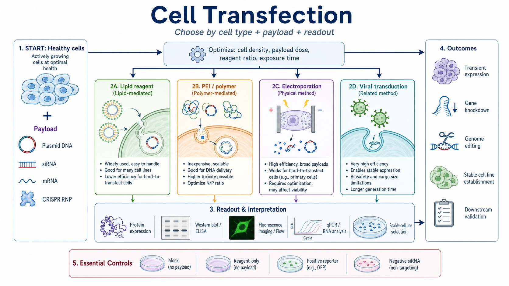
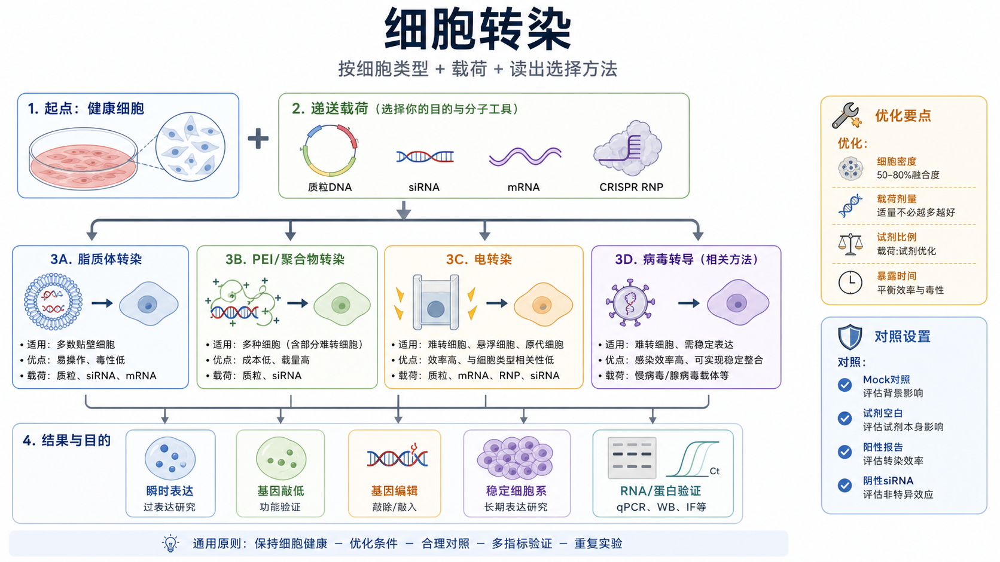

# 细胞转染

## Summary abstract graph（图形摘要）





Cell transfection（细胞转染）是把外源 nucleic acid（核酸）或核酸-蛋白复合物人工递送到真核细胞内，从而短期或长期改变基因表达、蛋白表达或基因组状态的实验。它常位于 [细胞培养](细胞培养.md) 与下游功能验证之间，是 [RT-qPCR](<RT-qPCR.md>)、[Western blot](<Western blot.md>)、[免疫荧光](免疫荧光.md)、[流式细胞术](流式细胞术.md)、[报告基因实验](报告基因实验.md)、[基因敲低](基因敲低.md)、[基因过表达](基因过表达.md) 和 [基因编辑](基因编辑.md) 的上游关键步骤。

本页默认讨论哺乳动物细胞体外转染，尤其是贴壁细胞和常规悬浮细胞。病毒载体介导的 gene delivery（基因递送）严格说更常称为 [病毒转导](病毒转导.md)，但因为实验设计时经常和转染一起比较，本页会把它放在“相关方法”中讨论。涉及慢病毒、逆转录病毒、腺病毒或 AAV（adeno-associated virus，腺相关病毒）的实际操作，需要遵守所在机构 biosafety（生物安全）审批和对应 BSL（biosafety level，生物安全等级）要求。

## 实验发明历史

转染这个词最初和病毒核酸感染性有关，后来在动物细胞研究中逐渐变成“向真核/动物细胞人工导入外源核酸”的通用术语。[Thermo Fisher 的转染基础资料](https://www.thermofisher.com/us/en/home/references/gibco-cell-culture-basics/transfection-basics/introduction-to-transfection.html)也把 transfection 定义为通过 chemical（化学）、biological（生物）或 physical（物理）方法把 DNA 或 RNA 人工导入细胞，用于改变细胞性质、研究基因功能和蛋白表达。

现代细胞转染的几个关键节点很清晰：

| 时间 | 代表进展 | 意义 |
| --- | --- | --- |
| 1973 | Graham 和 van der Eb 发表 calcium phosphate transfection（磷酸钙转染）相关方法 | 让哺乳动物细胞 DNA 导入成为相对可重复的实验技术。[参考：Graham & van der Eb 1973](https://doi.org/10.1016/0042-6822(73)90341-3) |
| 1982 | Neumann 等报道 electroporation（电穿孔/电转染）介导基因转移 | 形成通过电脉冲暂时打开细胞膜孔洞递送核酸的路线。[参考：Neumann et al. 1982](https://doi.org/10.1002/j.1460-2075.1982.tb01257.x) |
| 1987 | Felgner 等提出 lipofection（脂质体介导转染） | 推动了阳离子脂质转染试剂成为常规细胞实验工具。[参考：Felgner et al. 1987](https://doi.org/10.1073/pnas.84.21.7413) |
| 1990s | PEI（polyethylenimine，聚乙烯亚胺）等 cationic polymer（阳离子聚合物）用于核酸递送 | 让低成本、大规模表达和病毒包装细胞转染更方便。[参考：Boussif et al. 1995](https://doi.org/10.1073/pnas.92.16.7297) |
| 2000s 以后 | siRNA、mRNA、CRISPR 相关递送体系普及 | 转染从“表达一个基因”扩展到 knockdown（敲低）、editing（编辑）、screening（筛选）和细胞治疗前体技术。 |

## 应用场景

- 瞬时表达一个蛋白：把 [质粒DNA](<../材(实验耗材工具篇)/质粒DNA.md>) 或 [mRNA](<../材(实验耗材工具篇)/mRNA.md>) 导入细胞，24-96 h 内检测表达。
- 敲低一个基因：导入 [siRNA](<../材(实验耗材工具篇)/siRNA.md>)（small interfering RNA，小干扰 RNA）或 shRNA（short hairpin RNA，短发夹 RNA）表达载体，观察 mRNA、蛋白或表型下降。
- 过表达或突变体 rescue（拯救实验）：导入野生型、突变型或抗 siRNA 的表达载体，验证 phenotype（表型）是否由目标基因导致。
- CRISPR-Cas9（clustered regularly interspaced short palindromic repeats-associated protein 9，成簇规律间隔短回文重复序列相关蛋白 9）实验：导入 Cas9 plasmid、Cas9 mRNA、sgRNA（single guide RNA，单导向 RNA）或 [CRISPR RNP](<../番外/补充知识/CRISPR RNP.md>)（ribonucleoprotein，核糖核蛋白复合物）。
- reporter assay（[报告基因实验](报告基因实验.md)）：导入 luciferase（荧光素酶）、GFP（green fluorescent protein，绿色荧光蛋白）或其他 [报告基因](<../番外/补充知识/报告基因.md>) 系统，检测 promoter（启动子）、enhancer（增强子）、signal pathway（信号通路）或转录因子活性。
- protein production（蛋白生产）：HEK293、CHO 等细胞瞬时表达重组蛋白，用于小规模验证或中试前筛选。
- stable cell line generation（[稳定细胞系构建](稳定细胞系构建.md)）：转染 DNA 后用 [筛选抗生素](<../材(实验耗材工具篇)/筛选抗生素.md>) 或其他筛选系统获得长期表达细胞。

## 实验目的

细胞转染的目标不是单纯“把东西加进细胞”，而是让递送载荷在足够多、足够健康、足够可解释的细胞中发挥作用。一个好的转染实验至少要同时满足三件事：

- delivery（递送）成功：足够多的细胞收到目标载荷。
- biological effect（生物学效应）可检测：目标 mRNA、蛋白、报告信号或表型发生预期改变。
- perturbation（扰动）可控：转染试剂、细胞死亡、应激反应和非特异效应不能大到掩盖真正的生物学结论。

这也是为什么“最高转染效率”不一定等于“最好实验条件”。如果某一条件 GFP 阳性很多，但细胞大面积变圆、脱落或死亡，下游 [RNA提取](RNA提取.md)、[细胞裂解](细胞裂解.md)、免疫染色或功能读出都可能被转染毒性污染。

## 简要实验原理

转染的本质是克服细胞膜、内吞体、胞质降解、核膜和细胞毒性之间的多重障碍。不同方法解决障碍的方式不同。

| 方法 | 核心原理 | 主要优势 | 主要限制 |
| --- | --- | --- | --- |
| Lipid-based transfection（脂质体/阳离子脂质转染） | [脂质体转染试剂](<../材(实验耗材工具篇)/脂质体转染试剂.md>) 与带负电的核酸形成复合物，经膜相互作用和 endocytosis（内吞）进入细胞 | 操作简单，适合多数常规贴壁细胞，商品体系成熟 | 对细胞状态、血清、抗生素、细胞密度和试剂比例敏感 |
| PEI transfection（PEI/聚合物转染） | [聚乙烯亚胺](<../材(实验耗材工具篇)/聚乙烯亚胺.md>) 等阳离子聚合物凝聚 DNA，形成 polyplex（聚合物-核酸复合物）并经内吞进入细胞 | 便宜，适合 HEK293T、病毒包装和较大规模瞬转 | 毒性和批次差异明显，很多难转染细胞效果差 |
| [电转染](电转染.md) | [电转仪](<../材(实验耗材工具篇)/电转仪.md>) 通过短电脉冲使膜形成暂时孔洞，核酸或 RNP 进入细胞 | 适合原代细胞、免疫细胞、干细胞和难转染细胞；可递送 RNP | 需要设备和程序优化，细胞死亡/应激可能较明显 |
| Calcium phosphate transfection（磷酸钙转染） | DNA 与磷酸钙沉淀结合，被细胞摄入 | 便宜，经典，某些细胞如 HEK293 系仍可用 | 对 pH、沉淀状态、细胞密度极敏感，重复性相对差 |
| [病毒转导](病毒转导.md) | 病毒载体把遗传物质递送到细胞 | 对难转染细胞和长期表达更有优势 | 生物安全、载体构建、包装和滴度控制复杂 |

[Thermo Fisher 的转染效率影响因素页面](https://www.thermofisher.com/us/en/home/references/gibco-cell-culture-basics/transfection-basics/factors-influencing-transfection-efficiency.html)明确把方法选择、细胞健康和活率、传代次数、汇合度、核酸质量与用量、血清有无等列为影响转染结果的重要变量。

## 转染方法之间怎么选

| 实验目标 | 优先考虑 | 不太推荐 | 关键判断 |
| --- | --- | --- | --- |
| 常规贴壁细胞短期过表达 | 脂质体转染、PEI | 直接上病毒 | 先用 GFP 或 luciferase 小矩阵优化 |
| HEK293T 病毒包装或大规模瞬时表达 | PEI、专用脂质/聚合物体系 | 昂贵高端试剂直接大规模无优化使用 | 成本、细胞密度、DNA:PEI 比例和 FBS 批次很关键 |
| 原代细胞、免疫细胞、神经细胞 | 电转染、核转染、病毒转导 | 普通脂质体试剂盲试 | 以活率和功能保持为第一约束 |
| siRNA 敲低 | RNAi 专用脂质试剂、反向转染 | 高剂量普通 DNA 转染条件照搬 | 用最低有效 siRNA 浓度，必须设置阴性和阳性对照 |
| mRNA 表达 | mRNA 专用递送试剂、电转染 | 需要核进入的 DNA 逻辑照搬 | mRNA 在胞质翻译，表达快但短暂 |
| CRISPR 编辑 | Cas9 RNP 电转、Cas9/sgRNA 质粒转染、mRNA+sgRNA | 只看荧光不做基因型验证 | 编辑效率、indel、脱靶和克隆筛选要分开评估 |
| 长期表达 | 稳定细胞系构建、病毒转导 | 单纯瞬时转染 | 需要筛选压力、克隆化和表达稳定性验证 |

一个实用原则：先问“细胞能承受什么”，再问“载荷需要到哪里”，最后问“我要用什么读出证明它成功”。DNA plasmid（质粒 DNA）通常需要进入 nucleus（细胞核）才能表达；mRNA 和 siRNA 主要在 cytoplasm（胞质）发挥作用；CRISPR RNP 既要进入细胞，又要进入核内切割基因组。

## 实验所需试剂、耗材和设备

| 类别 | 常见内容 | 作用 |
| --- | --- | --- |
| 细胞 | 目标细胞、对照细胞、状态稳定的 [贴壁细胞培养](贴壁细胞培养.md) 或 [悬浮细胞培养](悬浮细胞培养.md) 体系 | 细胞状态是转染成败的第一变量 |
| 培养体系 | [培养基](<../材(实验耗材工具篇)/培养基.md>)、[FBS](<../材(实验耗材工具篇)/FBS.md>)、[GlutaMAX](<../材(实验耗材工具篇)/GlutaMAX.md>) 或 L-谷氨酰胺、必要时无抗培养基 | 维持细胞活性，减少非目标变量 |
| 缓冲液 | [PBS](<../材(实验耗材工具篇)/PBS.md>) 或 [DPBS](<../材(实验耗材工具篇)/DPBS.md>) | 洗涤、消化前处理或换液 |
| 递送载荷 | 质粒 DNA、siRNA、mRNA、sgRNA、CRISPR RNP | 决定实验类型和读出时间 |
| 转染试剂 | Lipofectamine 类脂质试剂、PEI、磷酸钙体系、电转缓冲液 | 把载荷送进细胞 |
| 复合物形成介质 | [Opti-MEM](<../材(实验耗材工具篇)/Opti-MEM.md>) 或其他 reduced-serum medium（低血清培养基） | 减少血清干扰，便于形成核酸-试剂复合物 |
| 容器 | [细胞培养板](<../材(实验耗材工具篇)/细胞培养板.md>)、[细胞培养皿](<../材(实验耗材工具篇)/细胞培养皿.md>)、[细胞培养瓶](<../材(实验耗材工具篇)/细胞培养瓶.md>) | 根据下游收样量和观察方式选择 |
| 操作工具 | [滤芯吸头](<../材(实验耗材工具篇)/滤芯吸头.md>)、[移液枪](<../材(实验耗材工具篇)/移液枪.md>)、[多道移液枪](<../材(实验耗材工具篇)/多道移液枪.md>)、离心管 | 保证配液准确和减少污染 |
| 观察和读出 | [倒置显微镜](<../材(实验耗材工具篇)/倒置显微镜.md>)、[荧光显微镜](<../材(实验耗材工具篇)/荧光显微镜.md>)、酶标仪、qPCR 仪、成像仪 | 评估效率、毒性和下游结果 |

如果使用 [Lipofectamine](<../材(实验耗材工具篇)/Lipofectamine.md>) 3000 这类商品脂质试剂，应严格从厂家 protocol 起步。例如 Thermo Fisher 的 [Lipofectamine 3000 protocol](https://assets.thermofisher.com/TFS-Assets/LSG/manuals/lipofectamine3000_protocol.pdf)建议贴壁细胞在转染时达到 70-90% confluent（汇合），在 Opti-MEM 等无血清/低血清介质中形成 DNA-lipid complex（DNA-脂质复合物），并从推荐的两个脂质剂量开始优化。

## 转染前设计

### 明确载荷和读出

**怎么做：** 在开实验前写清楚递送的是 DNA、siRNA、mRNA 还是 RNP；目标是表达、敲低、编辑还是报告读出；检测时间是 24 h、48 h、72 h 还是更久。

**为什么重要：** 不同载荷的时间窗不同。Thermo Fisher 的 transient vs stable transfection 资料指出，瞬时转染材料通常在有限时间内表达，常见收样时间为 24-96 h；DNA 需要进入细胞核，而 RNA 载荷可以在胞质发挥作用。[参考：Thermo Fisher transient vs stable transfection](https://www.thermofisher.com/us/en/home/references/gibco-cell-culture-basics/transfection-basics/types-of-transfection.html)

**注意事项：** 不要用同一个时间点评价所有结果。mRNA 表达可能较早，siRNA 敲低要看 mRNA 和蛋白半衰期，CRISPR 编辑常需要更长时间才能看到蛋白或表型变化。

**替代方案：** 如果质粒 DNA 表达太慢或细胞不分裂，可尝试 mRNA 或 RNP；如果瞬时表达波动太大，可转向稳定细胞系或病毒转导。

**出错后果：** 过早检测会误判“没有效果”；过晚检测会遇到瞬时表达衰减、细胞状态改变或脱靶/毒性累积。

### 设计对照

**怎么做：** 至少设置以下对照：

| 对照 | 含义 | 主要用途 |
| --- | --- | --- |
| Untreated control（未处理对照） | 不加转染试剂、不加载荷 | 判断基础细胞状态 |
| Mock control（模拟转染对照） | 加转染试剂或转染流程，但不加目标载荷 | 判断转染流程本身的毒性 |
| Reagent-only control（试剂空白） | 只加转染试剂 | 区分试剂毒性和载荷效应 |
| Positive transfection control（阳性转染对照） | GFP、luciferase 或已验证 siRNA | 判断当天转染流程是否成功 |
| Negative cargo control（阴性载荷对照） | empty vector（空载体）、scrambled siRNA（乱序 siRNA）或 non-targeting siRNA（非靶向 siRNA） | 判断非特异效应 |
| Rescue control（拯救对照） | 敲低后重新表达不受 siRNA 影响的目标基因 | 提高因果解释强度 |

**为什么重要：** 转染会引入应激，不能把所有变化都归因于目标基因。Thermo Fisher 的 RNA 转染指南强调，RNAi 实验要设置 positive control、negative control、untransfected control 和多个 RNAi 序列，以评估递送效率、非特异效应和脱靶风险。[参考：Thermo Fisher RNA transfection guidelines](https://www.thermofisher.com/us/en/home/references/gibco-cell-culture-basics/transfection-basics/guidelines-for-rna-transfection.html)

**注意事项：** 对照的核酸总量、转染试剂量和处理时间要尽量匹配实验组。siRNA 实验中，阴性 siRNA 浓度应与实验 siRNA 保持一致。

**替代方案：** 如果无法做 GFP，可用 qPCR 检测阳性敲低基因；如果没有阳性 reporter，可用已发表或厂家验证的阳性 siRNA。

**出错后果：** 没有 mock 或阴性对照时，很容易把转染毒性、干扰素反应、培养基变化或细胞密度差异误解为目标基因效应。

### 选择板型和接种密度

**怎么做：** 根据下游读出选择板型。96-well plate（96 孔板）适合高通量 reporter 或毒性检测；24-well plate（24 孔板）适合小规模优化；6-well plate（6 孔板）适合 RNA、蛋白和流式收样。转染前一天进行 [细胞接种](细胞接种.md)，使转染当天达到厂家或经验推荐的汇合度。

**为什么重要：** 细胞太稀会处于应激和不稳定增殖状态；太密会降低摄取、改变细胞周期，并影响转录和代谢状态。脂质体转染常要求转染时细胞健康且处于合适汇合度，Lipofectamine 3000 protocol 给出的常见起点是 70-90% 汇合。

**注意事项：** 记录细胞 passage number（传代次数）、seeding density（接种密度）、转染时汇合度、细胞活率和形态。不要只写“细胞状态不错”。

**替代方案：** 若细胞增殖快，可以降低前一日接种密度；若细胞贴壁慢，可以提前 36-48 h 接种；敏感细胞可在转染前换新鲜完全培养基。

**出错后果：** 同一条件今天有效、下周无效，很多时候不是试剂问题，而是接种密度、传代状态和汇合度不一致。

## 脂质体转染通用流程

脂质体转染是多数常规贴壁细胞的首选起点。下面是通用逻辑，不替代具体试剂说明书。

### 细胞准备

**怎么做：** 转染前一天接种细胞，使转染当天达到目标汇合度。当天观察细胞形态、污染、死亡和贴壁状态。必要时更换新鲜完全培养基。

**为什么重要：** 转染效率和细胞毒性强烈依赖细胞状态。细胞处于恢复期、过度融合、营养不足或污染状态时，优化试剂比例通常救不回来。

**注意事项：** 尽量使用近期状态稳定的细胞；不要在刚复苏、刚强烈消化、明显污染或高死亡率细胞上做关键转染。

**替代方案：** 对难转染细胞，可先用 GFP 质粒做小矩阵；对特别敏感细胞，可降低转染试剂量、缩短暴露时间或转向电转/病毒路线。

**出错后果：** 细胞本身不健康会导致效率低、毒性高、孔间差异大、下游 RNA/蛋白结果不稳定。

### 配制核酸和转染试剂复合物

**怎么做：** 将 DNA、siRNA 或 mRNA 与脂质体试剂分别稀释在 Opti-MEM 或厂家推荐介质中，再按说明混合，室温孵育形成复合物。多数商品试剂要求轻柔混匀，避免剧烈涡旋核酸复合物。

**为什么重要：** 核酸-脂质复合物的大小、电荷和稳定性决定其能否有效接触细胞并被摄取。Thermo Fisher 的阳离子脂质转染资料说明，阳离子脂质通过与带负电核酸的静电相互作用形成复合物，并通过细胞膜相互作用和内吞进入细胞。[参考：Thermo Fisher cationic lipid transfection](https://www.thermofisher.com/us/en/home/references/gibco-cell-culture-basics/transfection-basics/methods/cationic-lipid-transfection.html)

**注意事项：** 使用高质量、无内毒素或低内毒素质粒；核酸盐分、乙醇、蛋白污染或降解都会影响转染。RNA 载荷要使用 RNase-free（无 RNase）耗材和操作区。

**替代方案：** 若使用 siRNA，可选择 RNAi 专用脂质试剂；若是 mRNA，可用 mRNA 专用试剂；若 DNA 很大或细胞难转染，可考虑电转染。

**出错后果：** 复合物比例错误会导致两类问题：试剂太少时递送不足，试剂太多时细胞毒性上升。复合物形成时间过短或过长也可能降低重复性。

### 加入细胞并孵育

**怎么做：** 将复合物均匀滴加到细胞中，轻轻前后/左右晃动培养板使其分布均匀，然后放回 CO2 incubator（二氧化碳培养箱）。

**为什么重要：** 局部高浓度复合物会造成局部毒性和孔内空间差异。多孔板实验中，加样顺序和边缘效应也会影响读出。

**注意事项：** 不要直接用枪头冲击细胞层。是否需要转染后换液取决于试剂、细胞敏感性和厂家说明。Thermo Fisher 的 Lipofectamine 3000 简版 protocol 指出复合物可直接加到含血清或不含血清的培养基中，通常不必转染后移除复合物或换液，但仍要根据细胞敏感性优化。

**替代方案：** 若毒性明显，可在 4-8 h 或 8-24 h 后换新鲜完全培养基；若效率低但毒性可接受，可延长暴露或增加试剂/核酸剂量。

**出错后果：** 不均匀加样会造成同孔局部细胞死亡、边缘区信号异常或重复孔 CV 增大。

### 读出时间安排

**怎么做：** 常见质粒表达观察时间为 24-48 h，蛋白表达或功能实验常在 24-72 h，siRNA 敲低常在 24-72 h 检测 mRNA，在 48-96 h 检测蛋白，具体取决于目标分子半衰期。

**为什么重要：** mRNA 和蛋白的变化不同步。蛋白半衰期长时，qPCR 已经看到 knockdown，Western blot 可能仍不明显。

**注意事项：** 优化实验应同时记录转染效率、活率、形态和目标 readout（读出），不要只看荧光阳性率。

**替代方案：** 可设置时间梯度：24 h、48 h、72 h；对于稳定蛋白可延长到 96 h，但要警惕细胞过密和培养状态改变。

**出错后果：** 单一时间点可能刚好错过峰值表达或敲低窗口，导致错误否定实验体系。

## PEI 转染通用流程

PEI 转染常用于 HEK293T、病毒包装和重组蛋白瞬时表达，优势是便宜、可放大；缺点是毒性、批次和细胞适配性需要优化。

### 准备 PEI 和 DNA

**怎么做：** 使用线性 PEI 或实验室已验证 PEI 储液；质粒 DNA 应高纯度、低内毒素、浓度准确。Addgene 的 HEK293T PEI protocol 明确提醒 endotoxin（内毒素）会抑制转染，高质量质粒制备应包含内毒素去除步骤。[参考：Addgene General Transfection](https://www.addgene.org/protocols/transfection/)

**为什么重要：** PEI-DNA polyplex 的形成依赖正负电荷比例。DNA 纯度差、盐分高或 PEI 状态改变都会影响复合物。

**注意事项：** PEI 储液反复冻融、pH 偏差或长期保存可能影响效果。不同实验室常用 DNA:PEI 质量比从 1:2 到 1:4 起步，但必须用本细胞和本批试剂优化。

**替代方案：** 对低通量或难转染细胞，用商品脂质体试剂可能更稳；对大规模 HEK293 表达，PEI 或专用表达系统更经济。

**出错后果：** 内毒素高或 PEI 过量会造成细胞圆缩、脱落、死亡和表达下降。

### 形成 PEI-DNA 复合物并加样

**怎么做：** 分别稀释 DNA 和 PEI，在低血清或无血清介质中混合，室温孵育形成复合物，再滴加到细胞。Addgene 的 HEK293T 示例 protocol 采用 DNA:PEI 约 1:3 的起点，并建议用荧光质粒测试多个比例，1-2 天后观察 GFP 阳性细胞比例和细胞生长状态。

**为什么重要：** PEI 条件优化的目标是“足够表达 + 可接受活率”，不是最大 PEI 量。

**注意事项：** 滴加时避免冲掉贴壁细胞。转染后 12-24 h 可根据毒性和 protocol 换液。

**替代方案：** 若 PEI 条件毒性大，可降低 PEI、降低 DNA、缩短暴露、提高细胞初始健康度，或改用脂质体/电转。

**出错后果：** PEI 比例过低时表达低；比例过高时细胞死亡导致表达总量反而下降。

## 电转染通用流程

电转染适合很多脂质体难以处理的细胞，包括 primary cell（原代细胞）、immune cell（免疫细胞）、stem cell（干细胞）和某些悬浮细胞。Thermo Fisher 的 electroporation 资料说明，电转染通过电脉冲在细胞膜上形成暂时孔洞，使 DNA、RNA、mRNA、RNP 或蛋白进入细胞；电场强度、脉冲形状、脉冲次数和缓冲液成分都会影响效率。[参考：Thermo Fisher Electroporation](https://www.thermofisher.com/us/en/home/references/gibco-cell-culture-basics/transfection-basics/methods/electroporation.html)

### 细胞和载荷准备

**怎么做：** 收集健康细胞，准确计数，按电转试剂盒或仪器 protocol 调整细胞数和缓冲液。准备 DNA、RNA 或 RNP，避免盐分、乙醇和蛋白污染。

**为什么重要：** 电转时细胞被置于短时高压力环境，细胞状态和缓冲液离子环境会直接决定存活率。

**注意事项：** 原代细胞、免疫细胞和干细胞电转后需要预温恢复培养基，有时需要 ROCK inhibitor（Rho-associated protein kinase inhibitor，ROCK 抑制剂）或细胞因子支持。

**替代方案：** 如果电转后死亡率高，可降低电压/脉冲强度、调整程序、减少 DNA 量、改用 RNP 或使用细胞类型专用 kit。

**出错后果：** 程序过强会大量死亡；程序过弱会递送不足。盐分过高可能引发电弧，导致样本报废。

### 电转和恢复

**怎么做：** 将细胞和载荷混合后转入电转杯或电转管，运行已验证程序，立即加入预温恢复培养基并转入培养板。

**为什么重要：** 电转后细胞膜需要恢复，恢复阶段决定最终可用细胞数和表型稳定性。

**注意事项：** 操作要快但不要粗暴；不要让细胞在电转缓冲液中停留过久；恢复培养基、包被基质和细胞密度要提前准备好。

**替代方案：** 对贴壁依赖强的细胞，可使用包被板或更高接种密度帮助恢复；对悬浮免疫细胞，可优化细胞因子和培养密度。

**出错后果：** 即使递送成功，恢复差也会造成后续读出偏向“存活下来的亚群”，影响解释。

## siRNA 和 RNA 转染特别注意

siRNA 转染的成功不只看转染效率，还要看 knockdown specificity（敲低特异性）。Thermo Fisher RNA 转染指南强调，RNA 处理要防 RNase，转染效率受试剂类型和用量、接种细胞数、RNA 类型和浓度影响，且应设置阳性、阴性和未转染对照。

| 变量 | 建议 |
| --- | --- |
| siRNA 浓度 | 用最低有效浓度；过高会增加 off-target effect（脱靶效应）和细胞毒性 |
| 序列数量 | 至少用两条以上靶向同一基因的 siRNA 支持结论 |
| 阴性对照 | 使用 non-targeting 或 scrambled siRNA，浓度与实验 siRNA 相同 |
| 阳性对照 | 使用可重复产生明确敲低或表型的阳性 siRNA |
| 检测方式 | 同时考虑 mRNA、蛋白和功能表型 |
| rescue | 关键结论最好用 rescue 或不受 siRNA 影响的表达构建体支持 |

对于 RNA 载荷，避免 RNase 污染，使用滤芯吸头、RNase-free tube（无 RNase 管）和分装保存。若发现同一 siRNA 每次效果差异大，先检查细胞密度、RNA 冻融、转染试剂批次和检测时间点。

## 稳定转染和瞬时转染的区别

| 维度 | Transient transfection（瞬时转染） | Stable transfection（稳定转染） |
| --- | --- | --- |
| 持续时间 | 通常几天内表达或发挥作用 | 可长期传代保持 |
| 是否整合 | 通常不整合进基因组 | 通常需要整合或长期维持表达系统 |
| 速度 | 快，适合初筛 | 慢，需要筛选和克隆化 |
| 表达水平 | 可能较高但波动大 | 常较低但更稳定 |
| 适用 | 短期过表达、siRNA、mRNA、报告实验、初步功能验证 | 长期表达、长期药理学、稳定报告细胞、重复使用模型 |
| 主要风险 | 转染毒性、瞬时表达窗口、孔间差异 | 插入位点效应、克隆差异、筛选压力改变细胞 |

Thermo Fisher 的 transient vs stable transfection 页面指出，稳定转染通常更费力，需要选择性筛选和克隆分离；瞬时转染不需要筛选，常在转染后 24-96 h 收样，而稳定转染可需要 2-3 周选择稳定转染克隆。

## 结果解析

### 转染效率

[转染效率](<../番外/补充知识/转染效率.md>) 一般指成功接收并表达/响应载荷的细胞比例。常见评估方法包括：

| 方法 | 适用 | 局限 |
| --- | --- | --- |
| GFP/荧光蛋白观察 | 快速看阳性细胞比例和形态 | 荧光强弱不等于目标功能强弱 |
| 流式细胞术 | 定量阳性率和荧光强度分布 | 需要消化/制备单细胞，可能损失贴壁敏感细胞 |
| qPCR | 检测 mRNA 过表达或敲低 | 不能代表蛋白或功能完全改变 |
| Western blot | 检测蛋白变化 | 时间窗受蛋白半衰期影响 |
| Reporter assay | 检测启动子/通路活性 | 对细胞数、裂解效率和内参 reporter 敏感 |

效率解释要同时看活率。比如 90% GFP 阳性但只剩一半细胞，和 50% GFP 阳性但细胞健康，适合的实验结论可能完全不同。

### 细胞毒性和应激

[细胞毒性](<../番外/补充知识/细胞毒性.md>) 可以表现为细胞变圆、颗粒增多、脱落、漂浮细胞增加、增殖变慢、荧光异常增强或下游 housekeeping gene（管家基因）波动。必要时用 [细胞毒性检测](细胞毒性检测.md)、活率计数、形态评分或流式死活染料评估。

### 下游读出

- RT-qPCR：注意内参基因是否受转染影响；siRNA 实验要同时设置阴性 siRNA 和未转染对照。
- Western blot：根据蛋白半衰期选择 48-96 h；注意转染毒性会改变总蛋白和内参蛋白。
- 免疫荧光：避免只拍高表达细胞；需要用同一曝光和同一分析阈值。
- 流式细胞术：注意门控、死细胞排除和荧光补偿；对于 GFP 阳性率可同时看 median fluorescence intensity（中位荧光强度）。
- 报告基因实验：最好设置内参 reporter，避免细胞数、裂解效率和加样误差影响解释。

## 异常结果与 troubleshooting

| 异常 | 可能原因 | 处理思路 |
| --- | --- | --- |
| 几乎没有阳性细胞 | 细胞状态差、核酸降解、试剂失效、复合物比例不合适、载体 promoter 不适配 | 先用阳性 GFP 质粒或阳性 siRNA 验证流程；检查核酸质量和细胞汇合度 |
| 阳性率有但表达弱 | 载体表达弱、启动子不适配、检测时间太早/太晚、DNA 量不足 | 做时间梯度和 DNA 剂量梯度；换 promoter 或优化载体 |
| 细胞大量死亡 | 试剂过量、暴露时间过长、细胞太稀、抗生素/血清条件不合适、核酸污染 | 降低试剂量或核酸量；提前换液；去掉抗生素；使用低内毒素 DNA |
| 孔间差异大 | 接种不均、复合物分布不均、边缘效应、加样顺序差异 | 优化细胞接种；加样后轻晃；随机化孔位；边缘孔加 PBS 或不用于关键读出 |
| siRNA mRNA 降了但蛋白不降 | 蛋白半衰期长、检测时间太早、抗体不敏感 | 延长检测时间；换检测方法；同时检测多个时间点 |
| siRNA 阴性对照也改变表型 | 转染毒性、siRNA 浓度过高、off-target、免疫应激 | 降低 siRNA 浓度；换阴性序列；增加 rescue 或多序列验证 |
| GFP 很亮但目标实验没效果 | GFP 载体小且易表达，不能代表目标大质粒或 RNP | 用更接近目标载荷的阳性对照；优化目标载荷条件 |
| 稳定筛选全死 | 抗生素浓度过高、转染效率低、恢复时间不足 | 先做 kill curve（杀伤曲线）；延长恢复；降低筛选压力起始强度 |
| 稳定克隆差异大 | 插入位点效应、拷贝数差异、克隆选择偏差 | 多克隆初筛，再挑多个单克隆验证；避免只依赖一个克隆 |

## 购买和记录建议

转染试剂不是只看品牌名。实际记录要足够支持复现：

- 试剂品牌、公司、catalog number（货号）、lot number（批号）、开封时间和保存条件。
- 载荷类型、来源、浓度、纯度、A260/A280、是否 endotoxin-free（无内毒素/低内毒素）。
- 细胞系、传代次数、接种密度、转染时汇合度、培养基是否含血清/抗生素。
- 核酸量、试剂量、复合物形成介质、复合物孵育时间、暴露时间和是否换液。
- 读出时间、读出方法、转染效率、细胞活率和异常形态。

常见供应体系可以按用途理解：

| 供应商/体系 | 适合场景 | 备注 |
| --- | --- | --- |
| [Invitrogen](<../番外/试剂厂商/Invitrogen.md>) / Lipofectamine 系列 | 常规贴壁细胞、难转染细胞、DNA/RNA/co-transfection | 商品 protocol 和细胞系数据丰富，价格较高 |
| [Thermo Fisher Scientific](<../番外/试剂厂商/Thermo Fisher Scientific.md>) / Neon 电转体系 | 原代细胞、免疫细胞、CRISPR RNP | 设备和耗材成本高，但方法选择清晰 |
| [Promega](<../番外/试剂厂商/Promega.md>) 转染和 reporter 体系 | reporter assay、luciferase 读出、转染优化 | 适合把转染和功能读出连在一起 |
| [Addgene](<../番外/试剂厂商/Addgene.md>) protocol 与质粒资源 | 质粒、PEI protocol、病毒包装参考 | 更像开放资源和质粒库，不是传统试剂品牌 |
| [Lonza](<../番外/试剂厂商/Lonza.md>) Nucleofector 体系 | 难转染细胞、原代细胞、细胞治疗前体应用 | 细胞类型专用程序和 buffer 是核心价值 |

## 推荐记录模板

### 中文记录模板

```text
实验名称：
日期：
操作者：

细胞信息：
细胞系/细胞类型：
传代号：
转染前接种时间：
接种密度：
转染时汇合度/细胞密度：
细胞活率和形态：
培养基组成：
是否含抗生素：

转染目的：
载荷类型：质粒DNA / siRNA / mRNA / CRISPR RNP / 其他
目标基因或构建体：
载荷浓度和纯度：
载荷批次或来源：

转染条件：
转染方法：
转染试剂品牌和名称：
公司：
货号：
批号：
试剂保存和开封时间：
每孔核酸量：
每孔转染试剂量：
复合物形成介质：
复合物孵育时间：
暴露时间：
是否换液：

对照设置：
未处理对照：
Mock 对照：
试剂空白：
阳性对照：
阴性载荷对照：
其他对照：

读出：
检测时间点：
转染效率：
细胞活率/毒性：
下游检测方法：
主要结果：
异常现象：
下次优化计划：
```

### English Record Template

```text
Experiment name:
Date:
Operator:

Cell information:
Cell line / cell type:
Passage number:
Seeding time before transfection:
Seeding density:
Confluency / cell density at transfection:
Cell viability and morphology:
Culture medium:
Antibiotics present:

Transfection goal:
Payload type: plasmid DNA / siRNA / mRNA / CRISPR RNP / other
Target gene or construct:
Payload concentration and purity:
Payload source or batch:

Transfection condition:
Transfection method:
Transfection reagent name:
Company:
Catalog number:
Lot number:
Storage condition and open date:
Nucleic acid amount per well:
Reagent amount per well:
Complex formation medium:
Complex incubation time:
Exposure time:
Medium change:

Controls:
Untreated control:
Mock control:
Reagent-only control:
Positive control:
Negative payload control:
Other controls:

Readout:
Readout time point:
Transfection efficiency:
Cell viability / toxicity:
Downstream assay:
Main result:
Abnormal observations:
Next optimization plan:
```

## 小结

细胞转染的核心不是背一个固定配方，而是把 cell type（细胞类型）、payload（载荷）、delivery method（递送方法）和 readout（读出）匹配起来。对于常规贴壁细胞，可以从脂质体转染小矩阵开始；对于 HEK293T 大规模表达或病毒包装，PEI 常是经济路线；对于原代、免疫、干细胞和 CRISPR RNP，电转染更值得优先考虑；对于长期表达或难转染体系，病毒转导和稳定细胞系构建可能更合适。所有条件优化都要同时记录效率和细胞健康，否则“看起来很亮”的转染也可能不是一个可解释的实验。

## 参考来源

- Thermo Fisher Scientific. [Introduction to Transfection](https://www.thermofisher.com/us/en/home/references/gibco-cell-culture-basics/transfection-basics/introduction-to-transfection.html).
- Thermo Fisher Scientific. [Transient Transfection vs Stable Transfection](https://www.thermofisher.com/us/en/home/references/gibco-cell-culture-basics/transfection-basics/types-of-transfection.html).
- Thermo Fisher Scientific. [Factors Influencing Transfection Efficiency](https://www.thermofisher.com/us/en/home/references/gibco-cell-culture-basics/transfection-basics/factors-influencing-transfection-efficiency.html).
- Thermo Fisher Scientific. [Cationic Lipid Transfection](https://www.thermofisher.com/us/en/home/references/gibco-cell-culture-basics/transfection-basics/methods/cationic-lipid-transfection.html).
- Thermo Fisher Scientific. [Electroporation](https://www.thermofisher.com/us/en/home/references/gibco-cell-culture-basics/transfection-basics/methods/electroporation.html).
- Thermo Fisher Scientific. [Guidelines for RNA Transfection](https://www.thermofisher.com/us/en/home/references/gibco-cell-culture-basics/transfection-basics/guidelines-for-rna-transfection.html).
- Thermo Fisher Scientific. [Lipofectamine 3000 Reagent Protocol](https://assets.thermofisher.com/TFS-Assets/LSG/manuals/lipofectamine3000_protocol.pdf).
- Promega. [Transfection Guide: Overview of Transfection Methods](https://www.promega.com/resources/guides/cell-biology/transfection/).
- Addgene. [General Transfection](https://www.addgene.org/protocols/transfection/).
- Graham FL, van der Eb AJ. A new technique for the assay of infectivity of human adenovirus 5 DNA. Virology. 1973. [DOI: 10.1016/0042-6822(73)90341-3](https://doi.org/10.1016/0042-6822(73)90341-3).
- Neumann E, Schaefer-Ridder M, Wang Y, Hofschneider PH. Gene transfer into mouse lyoma cells by electroporation in high electric fields. EMBO J. 1982. [DOI: 10.1002/j.1460-2075.1982.tb01257.x](https://doi.org/10.1002/j.1460-2075.1982.tb01257.x).
- Felgner PL, Gadek TR, Holm M, et al. Lipofection: a highly efficient, lipid-mediated DNA-transfection procedure. PNAS. 1987. [DOI: 10.1073/pnas.84.21.7413](https://doi.org/10.1073/pnas.84.21.7413).
- Boussif O, Lezoualc'h F, Zanta MA, et al. A versatile vector for gene and oligonucleotide transfer into cells in culture and in vivo: polyethylenimine. PNAS. 1995. [DOI: 10.1073/pnas.92.16.7297](https://doi.org/10.1073/pnas.92.16.7297).
