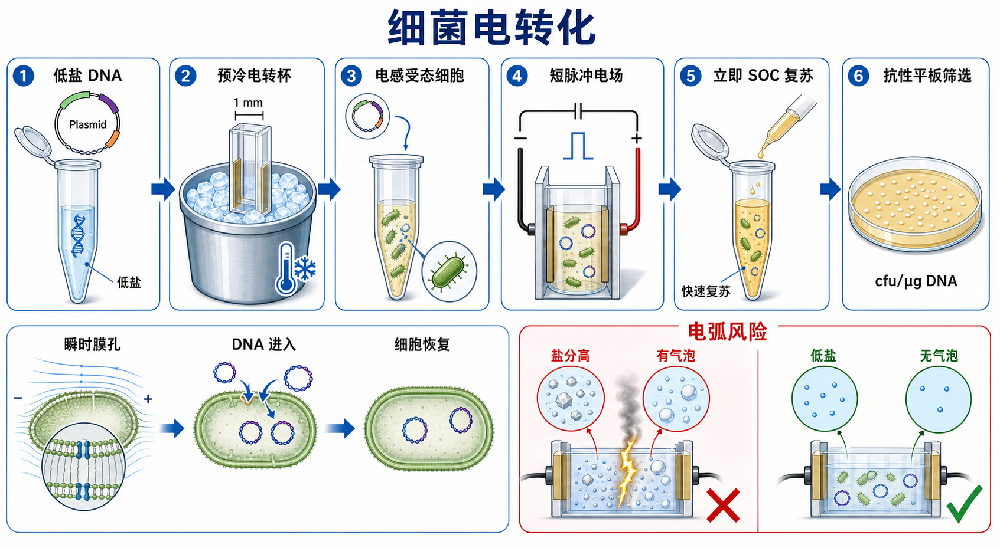

# 细菌电转化

细菌电转化（bacterial electroporation，细菌电穿孔转化 / 细菌电转化）是利用短暂高压电脉冲使 bacterial cell membrane（细菌细胞膜）出现 transient pores（瞬时膜孔），从而把外源[质粒DNA](<../材(实验耗材工具篇)/质粒DNA.md>)、连接产物或文库 DNA 导入[电感受态细胞](<../材(实验耗材工具篇)/电感受态细胞.md>)的[细菌转化](<细菌转化.md>)方法。它通常比化学热激转化效率更高，但对 DNA 盐分、气泡、电转杯间隙和操作速度更敏感。



## 实验发明历史

Electroporation（[电穿孔](<../番外/补充知识/电穿孔.md>)，电场诱导膜通透化）最初作为细胞膜物理学现象被研究，后来发展成把 DNA、RNA 或蛋白导入细胞的通用方法。Dower、Miller 和 Ragsdale 在 1988 年报道了 high-voltage electroporation（高压电转化）可高效转化 Escherichia coli（E. coli，大肠杆菌），使细菌电转成为分子克隆中非常重要的高效率转化路线。参考：[Dower et al., Nucleic Acids Research, 1988](https://doi.org/10.1093/nar/16.13.6127)。

现在实验室中的细菌电转化已经高度标准化：使用低盐 DNA、预冷电转杯、预冷电感受态细胞、设定合适 field strength（[电场强度](<../番外/补充知识/电场强度.md>)）、脉冲后立即加入 [SOC培养基](<../材(实验耗材工具篇)/SOC培养基.md>)恢复。NEB、Thermo Fisher 和 Bio-Rad 的细菌电转资料都反复强调同一件事：盐、乙醇和气泡是电转失败和 arcing（[电转电弧](<../番外/补充知识/电转电弧.md>)）的核心风险。参考：[NEB Electroporation Protocol](https://www.neb.com/en-us/protocols/0001/01/01/electroporation-protocol-c3020)、[NEB Electroporation Tips](https://www.neb.com/en-us/tools-and-resources/usage-guidelines/electroporation-tips)。

## 应用场景

| 场景 | 为什么适合电转化 | 关键关注点 |
|---|---|---|
| 文库构建 | 需要保留尽可能高的[文库复杂度](<../番外/补充知识/文库复杂度.md>) | 超高转化效率、足够细胞量、多个平板 |
| 大质粒或 BAC 类载体 | 化学热激转化效率常偏低 | DNA 低盐、温和操作、宿主稳定性 |
| 低量 DNA 转化 | DNA 量很少时需要更高进入概率 | DNA 纯度、体积、感受态效率 |
| 连接/组装产物转化 | 可提升阳性克隆数量 | 连接产物需脱盐或纯化 |
| 非常规细菌转化 | 某些菌种更依赖电转条件 | 菌种专用参数、细胞壁状态、培养条件 |
| 常规质粒扩增 | 也可以用，但不一定经济 | 如果普通[化学感受态细胞制备](<化学感受态细胞制备.md>)够用，没必要过度使用 |

## 实验目的

细菌电转化的目标不是“打一电脉冲”本身，而是在尽量不杀死细胞的前提下，使外源 DNA 有足够概率进入细菌，并在复苏后形成可筛选、可验证的单克隆。

具体目标包括：

- 将质粒、连接产物、组装产物或文库 DNA 导入电感受态细胞。
- 在高效率转化和细胞存活率之间取得平衡。
- 避免盐、乙醇、气泡导致电弧和细胞死亡。
- 通过抗性平板筛选获得可做[菌落PCR](<菌落PCR.md>)、[质粒提取](<质粒提取.md>)和[Sanger测序](<Sanger测序.md>)的克隆。

## 简要实验原理

### 短脉冲电场让细胞膜短暂变得可通透

电转化的核心是把细胞置于强电场中，使细胞膜两侧形成瞬时电位差。当电场足够强时，膜脂双层会出现短暂可恢复的通透状态，DNA 有机会进入细胞。这个过程必须“刚好”：电场太弱，DNA 进入少；电场太强或持续太久，细胞不可逆损伤。

和 heat shock（[热激](<../番外/补充知识/热激.md>)）相比，电转化更像一个物理瞬间事件，因此对电转杯间隙、液体电导率、脉冲参数和复苏速度都更敏感。

### 电转最怕盐，因为盐会让电流失控

DNA 溶液中的盐、连接 buffer、酶切 buffer、乙醇残留、琼脂糖污染或气泡，都可能让样品电导率升高或局部放电，出现电弧。NEB 的 electroporation tips 把 arcing 归因于样品盐分过高、DNA 体积过大、气泡或电转杯问题，并建议使用低盐 DNA、减少加入体积和确保无气泡。参考：[NEB Electroporation Tips](https://www.neb.com/en-us/tools-and-resources/usage-guidelines/electroporation-tips)。

所以电转化里“DNA 越多越好”是危险直觉。很多时候，少量干净、低盐的 DNA 比大量脏 DNA 更容易成功。

### 电场强度由电压和电转杯间隙共同决定

电转仪显示的是 voltage（电压），但细胞真正感受到的是 field strength（电场强度），通常写作 kV/cm。它等于电压除以电极距离。举例来说，1 mm 电转杯和 2 mm 电转杯即使使用相同电压，实际电场强度也不同。

因此不能只记“某个电压”。更好的记录方式是：电转杯间隙、电压、电容、电阻、time constant（[时间常数](<../番外/补充知识/时间常数.md>)）和仪器型号。Bio-Rad Gene Pulser 系列资料也把 cuvette gap、voltage 和 time constant 作为电转条件记录的核心参数。参考：[Bio-Rad Gene Pulser Xcell System](https://www.bio-rad.com/en-us/product/gene-pulser-xcell-electroporation-systems)。

### 脉冲后立即复苏比“多等一会儿”更重要

电转后的细胞膜处于损伤状态，细胞需要尽快进入营养丰富、无抗生素的恢复环境。常见做法是在脉冲后立刻加入室温或预温 SOC，轻轻吹打混匀并转移到离心管中复苏。Thermo Fisher 的电感受态转化 protocol 也强调脉冲后立即加入 S.O.C. Medium 并恢复培养。参考：[Thermo Fisher Scientific: ElectroMAX Transformation Protocol](https://www.thermofisher.com/us/en/home/references/protocols/cloning/transformation-protocol/electromax.html)。

## 所需试剂、材料与设备

| 类别 | 常用内容 | 作用 |
|---|---|---|
| DNA | 低盐质粒、[连接反应](<连接反应.md>)产物、组装产物、文库 DNA | 被导入细菌的外源 DNA |
| 细胞 | 电感受态细胞 | 接收 DNA 的宿主细胞 |
| 复苏培养基 | SOC 培养基、[LB培养基](<../材(实验耗材工具篇)/LB培养基.md>) | 修复电击损伤并表达抗性 |
| 选择体系 | [抗性平板](<../材(实验耗材工具篇)/抗性平板.md>)、[筛选抗生素](<../材(实验耗材工具篇)/筛选抗生素.md>) | 筛选携带质粒的细胞 |
| 低盐处理 | [DNA脱盐](<../番外/补充知识/DNA脱盐.md>)、[无菌水](<../材(实验耗材工具篇)/无菌水.md>)、低盐洗脱液 | 降低电导率，减少电弧 |
| 电转耗材 | [电转杯](<../材(实验耗材工具篇)/电转杯.md>)、滤芯吸头、预冷[离心管](<../材(实验耗材工具篇)/离心管.md>) | 承载电场和样品 |
| 设备 | [电转仪](<../材(实验耗材工具篇)/电转仪.md>)、冰盒、37°C 摇床或培养箱 | 提供脉冲、低温和复苏环境 |
| 质控 | 标准[超螺旋质粒](<../番外/补充知识/超螺旋质粒.md>)、[阳性对照](<../番外/补充知识/阳性对照.md>)、[阴性对照](<../番外/补充知识/阴性对照.md>) | 判断电感受态和操作是否可靠 |

## 实验操作

### 判断是否真的需要电转化

**怎么做：**先根据实验目标选择转化方式。普通小质粒扩增、简单连接产物筛选，可以用化学热激转化；文库、大质粒、低量 DNA、复杂组装产物或化学转化反复失败时，优先考虑电转化。

**为什么重要：**电转效率高，但成本、设备要求和失败风险也更高。若普通化学转化已经能稳定得到足够克隆，电转不一定带来实际收益。

**注意事项：**电转需要电感受态细胞，不要把普通化学感受态直接拿去电转。化学感受态通常含盐或阳离子缓冲液，可能导致电弧。

**替代方案：**如果没有电转仪，优先买高效化学感受态；如果有电转仪但 DNA 样品很脏，先纯化或脱盐，再决定是否电转。

**出错后果：**错误选择方法会表现为无菌落、电弧、细胞死亡或不必要的高成本。

### 准备低盐 DNA

**怎么做：**用于电转的 DNA 应尽量溶于无菌水或低盐缓冲液。质粒小提产物如果盐或乙醇残留明显，应重新纯化；连接产物、酶切产物、Gibson/Golden Gate 组装产物可通过柱纯化、乙醇沉淀、drop dialysis（滴膜透析）或其他 DNA 脱盐方法处理。

**为什么重要：**电转失败最常见的技术原因之一就是样品电导率太高。盐分让电流集中，可能出现电弧；乙醇残留和气泡也会影响放电稳定性。

**注意事项：**不要把大体积连接液直接加入电感受态。加入 DNA 体积通常越小越好，具体体积按细胞说明书和电转杯体积决定。DNA 量过高不仅不能无限增加菌落，还可能增加放电风险。

**替代方案：**若担心柱纯化损失低量 DNA，可用滴膜透析或磁珠纯化；若 DNA 太珍贵，可先用少量样本做试转化。

**出错后果：**盐高会电弧，电弧后通常整管细胞基本报废；乙醇残留会降低存活率；DNA 太稀或太少会菌落少。

### 预冷细胞、电转杯和操作环境

**怎么做：**从 -80°C 取出电感受态细胞后放冰上缓慢融化；电转杯提前放冰上预冷；复苏用 SOC 培养基预先准备好，并放在方便立即加入的位置。

**为什么重要：**电感受态细胞通常经过低盐水或甘油反复洗涤，非常脆弱。低温可以降低应激损伤；预冷电转杯可以减少操作过程中的温度波动。

**注意事项：**不要用手长时间握住细胞管；不要让细胞在室温下等待；电转杯外壁要保持干净干燥，避免外部液体造成安全风险或异常放电。

**替代方案：**如果是商业电感受态，严格按厂家推荐 thawing and handling（融化和操作）方式；如果是自制细胞，先建立自己的批次质控记录。

**出错后果：**细胞升温或反复冻融会显著降低转化效率；电转杯未预冷会增加批间差异。

### 混合 DNA 和电感受态细胞

**怎么做：**将少量低盐 DNA 加入电感受态细胞，轻轻混匀，避免涡旋和剧烈吹打。混合后尽快转移到预冷电转杯底部。

**为什么重要：**细胞在这个阶段既需要和 DNA 接触，又不能承受强机械刺激。过度吹打会损伤细胞，混匀不足则导致局部 DNA 和细胞分布不均。

**注意事项：**枪头不要产生气泡；样品应集中在电转杯电极之间的底部区域；液滴不要挂在杯壁高处。

**替代方案：**如果样品体积太小不易混匀，可轻弹管壁或轻轻吸打一次，但不要涡旋。对于高价值样本，可在同一批细胞中并行设置标准质粒阳性对照。

**出错后果：**气泡和局部液滴会增加电弧风险；混合不均会造成重复性差；操作太慢会让细胞升温。

### 设置电转参数并脉冲

**怎么做：**根据菌株、电转杯间隙和仪器说明书设置电压、电容、电阻或预设程序。常见 E. coli 电转条件会使用 1 mm 或 2 mm 电转杯，并在约 12.5-18 kV/cm 的电场强度范围内优化；具体参数必须以细胞和仪器说明书为准。脉冲后记录 time constant。

**为什么重要：**电转参数决定膜孔形成和细胞死亡之间的平衡。time constant 过短常提示样品导电性过高或发生放电，过长或过低的场强则可能导致转化效率不足。

**注意事项：**不要把不同电转杯间隙的电压互相照搬。不要忽略仪器单位：kV、V、µF、Ω、ms 的含义不同。高压设备操作要遵守仪器安全说明，不要触碰电极或潮湿杯壁。

**替代方案：**如果不确定参数，先用厂家推荐参数和标准质粒做阳性转化；如果是非常规菌种，需要查专门 protocol，而不是直接套用 E. coli 参数。

**出错后果：**参数太强会杀细胞；参数太弱会无菌落或菌落很少；电弧会让这一管转化基本失败，并可能污染电转杯或仪器槽。

### 脉冲后立即加入 SOC 并复苏

**怎么做：**脉冲结束后立刻向电转杯中加入 SOC 培养基，轻轻吹打或移液混匀，把细胞转移到无菌离心管中，在适合温度下复苏培养。通常复苏阶段不加抗生素，让细胞修复膜损伤并表达抗性蛋白。

**为什么重要：**电转后细胞膜受损，等待时间越长，死亡和不可逆损伤越多。立即复苏是提高转化效率和稳定性的关键动作。

**注意事项：**SOC 要提前放在手边；不要脉冲后再去找培养基。复苏体积、时间和温度要按菌株和抗性标记调整。

**替代方案：**普通质粒有时 LB 也能复苏，但 SOC 更适合高效率电转；对毒性构建或不稳定序列，可考虑降低复苏和培养温度。

**出错后果：**复苏不及时会菌落少；过早接触抗生素会让尚未表达抗性的细胞死亡；复苏太久可能改变文库构成。

### 涂板、培养和克隆验证

**怎么做：**复苏后根据预期菌落数选择直接涂布、稀释涂布或浓缩后全涂。平板应含有与质粒匹配的抗生素。第二天观察菌落数、大小、背景，再进入菌落 PCR、质粒提取或测序。

**为什么重要：**电转化常能产生非常多菌落，尤其是超螺旋小质粒。若不做稀释，平板可能长成一片，无法挑取单克隆，也无法准确计算转化效率。

**注意事项：**文库构建时不能只追求“挑几个克隆”，而要计算总 transformants（转化子总数），确保覆盖度足够。普通克隆则要保证菌落分散，方便后续挑克隆。

**替代方案：**预计菌落非常多时做梯度稀释；预计菌落很少时，复苏后离心浓缩再全涂多个平板。

**出错后果：**平板过密会无法挑单克隆；涂布量太少会低估转化效率；抗生素错误会导致假阴性或满板背景。

## 结果解析

| 观察结果 | 可能说明什么 | 优先排查 |
|---|---|---|
| 标准质粒阳性对照菌落多，阴性对照无菌落 | 电感受态和电转步骤可用 | 回看实验 DNA 质量和连接效率 |
| 阳性对照也无菌落 | 细胞失效、参数错误、复苏失败或平板错误 | 感受态批次、电转参数、SOC、抗生素 |
| 脉冲时出现电弧 | 盐高、气泡、电转杯潮湿或样品体积问题 | DNA 脱盐、减少体积、重新装杯 |
| time constant 明显偏短 | 样品导电性过高或放电 | 盐、乙醇、气泡、杯壁残液 |
| time constant 正常但菌落少 | DNA 量低、质粒太大、细胞效率低或复苏不佳 | DNA 质量、细胞批次、复苏时间 |
| 质粒阳性对照好，连接产物差 | 连接/组装反应问题更可能 | 载体背景、插入片段、末端兼容性 |
| 平板菌落糊成一片 | 转化效率高但涂布未稀释 | 做稀释涂布或减少涂布量 |
| 阴性对照有菌落 | 污染或抗生素失效 | 换平板、换抗生素、检查无菌操作 |

## 常见异常与 troubleshooting

### 电弧

电弧是电转化最有辨识度的失败信号。常见原因包括 DNA 样品盐分高、连接液体积过大、乙醇残留、气泡、电转杯外壁潮湿或电极间样品分布异常。处理方式是重新纯化或脱盐 DNA，减少加入体积，装杯前确认无气泡，擦干杯外壁，并使用新的预冷电转杯。

### 无菌落

先看阳性对照。如果阳性对照失败，问题多半在电感受态、电转参数、复苏或平板；如果阳性对照正常，问题更可能在实验 DNA、连接产物、质粒大小、抗性选择或宿主兼容性。不要在没有阳性对照时直接判断“电转仪坏了”。

### 菌落数低但没有电弧

可能是 DNA 太少、质粒太大、细胞效率低、细胞被冻融、复苏不及时、脉冲参数不合适或宿主菌株不兼容。对于低拷贝、大质粒或毒性片段，增加 DNA 量不一定有效，换宿主菌株或高效商业电感受态更实际。

### 文库复杂度不足

文库构建的失败不一定表现为“无菌落”，更常见是 transformants 总数不够。需要根据库容量、插入片段复杂度和筛选目标计算最低转化子数量，并使用足够多的细胞、足够多的电转反应和足够大的涂板规模。

### 平板背景异常

阴性对照有菌落提示污染、抗生素失效或平板错误；载体-only 对照很多菌落提示载体自连或未切载体残留；实验组菌落多但验证阴性，说明电转成功但克隆策略失败。

## 与相关方法对比

| 方法 | 核心逻辑 | 优点 | 局限 | 适合场景 |
|---|---|---|---|---|
| 细菌电转化 | 短脉冲电场形成瞬时膜孔 | 效率高，适合低量 DNA 和文库 | 怕盐、怕气泡、需要仪器 | 文库、大质粒、复杂克隆 |
| 化学热激转化 | 阳离子处理后热激导入 DNA | 便宜、简单、设备少 | 效率通常较低 | 常规质粒扩增、普通连接 |
| 商业高效化学感受态 | 厂家优化化学转化 | 稳定、省事 | 成本较高，效率仍低于优质电转 | 普通到中等难度克隆 |
| [电感受态细胞制备](<电感受态细胞制备.md>) | 自制低盐电感受态 | 成本低，可大批量 | 制备要求高，需严格低盐 | 高频电转实验室 |
| 商业电感受态 | 标定高效率电转细胞 | 最省心，适合关键实验 | 成本高，对运输保存敏感 | 文库、低量 DNA、高失败成本实验 |

## 购买与选择建议

如果只是偶尔做电转，购买商业电感受态和一次性电转杯通常比自制更稳；如果实验室长期做文库或复杂克隆，可以建立自己的[电感受态细胞制备](<电感受态细胞制备.md>)流程，但每一批都必须做转化效率质控。

选择电转体系时重点看：

- 电转仪是否支持细菌常用参数范围、预设程序和 time constant 记录。
- 电转杯间隙是否与 protocol 参数匹配，常见为 1 mm 或 2 mm。
- 电感受态细胞标称转化效率、菌株基因型、适合质粒大小和抗性体系。
- 是否提供 positive control DNA 和清晰说明书。
- 商业细胞到货是否全程干冰，保存是否直接进入 -80°C。

常见可选供应商包括 [Bio-Rad](<../番外/试剂厂商/Bio-Rad.md>)、[Eppendorf](<../番外/试剂厂商/Eppendorf.md>)、[Lonza](<../番外/试剂厂商/Lonza.md>)、[BTX](<../番外/试剂厂商/BTX.md>)、[NEB](<../番外/试剂厂商/NEB.md>)、[Thermo Fisher Scientific](<../番外/试剂厂商/Thermo Fisher Scientific.md>)、[Takara](<../番外/试剂厂商/Takara.md>) 和 [Promega](<../番外/试剂厂商/Promega.md>)。仪器选择更看参数稳定性、可维护性和本实验室已有耗材；细胞选择更看菌株背景和标称效率。

商业产品记录示例：

```text
Electrocompetent E. coli cells, strain DH10B, transformation efficiency x.xx × 10^10 cfu/µg pUC19 DNA, Brand, Cat. No. xxxxx, Lot No. xxxxx, stored at -80°C, thawed once only.
```

## 推荐记录模板

### 中文记录模板

| 项目 | 记录内容 |
|---|---|
| 实验目的 | 普通转化、连接筛选、文库构建、大质粒 |
| DNA 信息 | 名称、类型、大小、浓度、体积、溶剂、是否脱盐 |
| 电感受态信息 | 菌株、来源、批号、标称效率、冻融次数 |
| 电转杯 | 间隙、品牌、批号、是否预冷 |
| 电转仪参数 | 电压、电容、电阻、程序、time constant |
| 操作状态 | 是否电弧、是否有气泡、脉冲后加 SOC 的时间 |
| 复苏条件 | SOC/LB、体积、温度、时间、是否摇菌 |
| 平板 | 抗生素、浓度、平板日期、涂布体积和稀释倍数 |
| 对照 | 阳性对照、阴性对照、载体-only 对照 |
| 结果 | 菌落数、菌落大小、背景、转化效率 |
| 后续验证 | 菌落 PCR、小提、酶切、测序 |

### English Record Template

| Item | Record |
|---|---|
| Purpose | Routine transformation, ligation screening, library construction, large plasmid |
| DNA information | Name, type, size, concentration, volume, solvent, desalting status |
| Electrocompetent cells | Strain, source, lot number, stated efficiency, freeze-thaw history |
| Cuvette | Gap width, brand, lot number, pre-chilled status |
| Electroporator settings | Voltage, capacitance, resistance, program, time constant |
| Operation notes | Arcing, bubbles, time to SOC addition after pulse |
| Recovery conditions | SOC/LB, volume, temperature, duration, shaking |
| Selection plate | Antibiotic, concentration, plate date, plating volume and dilution |
| Controls | Positive control, negative control, vector-only control |
| Result | Colony number, colony size, background, transformation efficiency |
| Validation | Colony PCR, miniprep, restriction digest, sequencing |

## 参考来源

- [NEB: Electroporation Protocol](https://www.neb.com/en-us/protocols/0001/01/01/electroporation-protocol-c3020)
- [NEB: Electroporation Tips](https://www.neb.com/en-us/tools-and-resources/usage-guidelines/electroporation-tips)
- [Thermo Fisher Scientific: ElectroMAX Transformation Protocol](https://www.thermofisher.com/us/en/home/references/protocols/cloning/transformation-protocol/electromax.html)
- [Bio-Rad: Gene Pulser Xcell Electroporation Systems](https://www.bio-rad.com/en-us/product/gene-pulser-xcell-electroporation-systems)
- [Dower et al., High efficiency transformation of E. coli by high voltage electroporation, Nucleic Acids Research, 1988](https://doi.org/10.1093/nar/16.13.6127)
