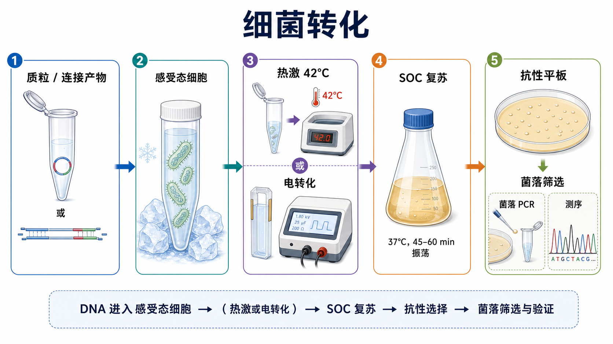

# 细菌转化

细菌转化（bacterial transformation，细菌转化）是把外源 DNA，通常是质粒或[连接反应](<连接反应.md>)产物，引入[感受态细胞](<../材(实验耗材工具篇)/感受态细胞.md>)（competent cells，感受态细菌）并通过抗生素筛选获得携带目标质粒菌落的实验。它是分子克隆中从“体外 DNA 构建”进入“活细胞扩增与筛选”的关键步骤。

## 实验发明历史

细菌能够摄取外源遗传物质的现象最早来自 Griffith transformation experiment（格里菲斯转化实验，1928 年），随后 Avery、MacLeod 和 McCarty 证明 DNA 是转化中的遗传物质。现代分子克隆中常用的 Escherichia coli（大肠杆菌）转化体系，则与 calcium chloride transformation（氯化钙转化）和重组质粒技术的发展密切相关。

Mandel 和 Higa 在 1970 年报道 CaCl2 处理可促进大肠杆菌摄取噬菌体 DNA；Cohen、Chang、Boyer 和 Helling 在 1973 年利用质粒和限制性内切酶技术构建并转化功能性重组质粒，是重组 DNA 技术史上的经典工作。参考：[Cohen et al., PNAS 1973](https://www.pnas.org/doi/10.1073/pnas.70.11.3240)。

现在实验室里的“细菌转化”主要分为 chemical transformation（化学转化）和 electroporation（电转化）。前者便宜、操作简单，常用于日常质粒克隆；后者效率高，但对盐、样本纯度和设备要求更高。

## 应用场景

| 场景 | 转化在这里解决什么问题 | 关键关注点 |
|---|---|---|
| 连接产物转化 | 把体外连接得到的重组质粒导入细菌扩增 | 连接液体积、空载体背景、抗性选择 |
| 质粒扩增 | 将已知质粒转入大肠杆菌扩增保存 | 感受态效率、质粒大小、抗性正确 |
| 克隆筛选 | 获得单克隆菌落用于菌落 PCR 和测序 | 涂板密度、对照、挑克隆数量 |
| 文库构建 | 尽可能保留复杂度和覆盖度 | 高转化效率、低 DNA 损伤、足够转化规模 |
| 大质粒/BAC 转化 | 导入较大或低拷贝载体 | 电转化、低盐、温和复苏 |
| [蓝白斑筛选](<../番外/补充知识/蓝白斑筛选.md>) | 初筛插入片段是否破坏 lacZ α | 平板组分、插入方向和假阳性 |

## 实验目的

细菌转化的目的不是单纯“长出菌落”，而是让目标 DNA 进入合适宿主细胞，经过复苏和抗性筛选后得到可以继续验证、扩增和保存的单克隆。

具体目标包括：

- 将连接产物、质粒或文库 DNA 导入大肠杆菌。
- 通过抗生素抗性筛掉未获得质粒的细胞。
- 获得单克隆菌落用于[菌落PCR](<菌落PCR.md>)、限制性酶切鉴定和[Sanger测序](<Sanger测序.md>)。
- 为后续[质粒提取](<质粒提取.md>)、冻存和功能实验准备菌株。

## 简要实验原理

### 感受态细胞是“短时间更容易接收 DNA”的细菌

普通大肠杆菌并不会高效摄取质粒。感受态细胞通过化学处理或电处理，使细胞膜和细胞壁处于更容易让 DNA 进入的状态。常见 chemical competent cells（化学感受态细胞）依赖低温、二价阳离子和热激；electrocompetent cells（电感受态细胞）则依赖瞬时高电场在细胞膜上形成可逆性通透状态。

感受态细胞效率通常用[转化效率](<../番外/补充知识/转化效率.md>)（transformation efficiency，转化效率）表示，单位常写作 cfu/µg DNA（colony-forming units per microgram DNA，每微克 DNA 形成的菌落数）。高效率感受态对文库构建和低量连接产物非常关键。

### 热激转化依赖低温吸附和短暂热冲击

化学转化中，DNA 和感受态细胞先在冰上孵育，使带负电的 DNA 接近细胞表面；随后短暂 heat shock（热激）常在 42°C 左右进行，帮助 DNA 进入细胞。NEB 的转化流程也使用冰上孵育、42°C 热激、冰上恢复和 SOC 复苏这一基本框架，但具体时间必须看感受态细胞说明书。参考：[NEB Transformation Protocol](https://www.neb.com/en-us/protocols/0001/01/01/transformation-protocol-c2987)。

### 电转化效率高，但怕盐

[细菌电转化](<细菌电转化.md>)（bacterial electroporation，细菌电转化）通过短脉冲电场促进 DNA 进入细胞，常用于文库、大质粒或低量 DNA。但电转对样本盐浓度极其敏感：连接 buffer、酶切 buffer、盐、乙醇或琼脂糖残留都可能导致 arcing（电弧），直接杀死细胞并让转化失败。

### 复苏不是等待，而是让抗性表达出来

热激或电转后，细胞膜受损且还没有充分表达抗生素抗性蛋白。加入 [SOC培养基](<../材(实验耗材工具篇)/SOC培养基.md>)（super optimal broth with catabolite repression，SOC 培养基）或 [LB培养基](<../材(实验耗材工具篇)/LB培养基.md>)（lysogeny broth，LB 培养基）进行 37°C 复苏，可以让细胞恢复并表达质粒上的抗性基因。Addgene 的细菌转化 protocol 也强调加入 SOC 后复苏，再涂布到选择平板。参考：[Addgene Bacterial Transformation](https://www.addgene.org/protocols/bacterial-transformation/)。

### 抗性平板筛选的是“可能有质粒”的细胞，不是“构建一定正确”的细胞

[抗性平板](<../材(实验耗材工具篇)/抗性平板.md>)只能筛掉没有抗性基因的细胞。只要细胞拿到了能表达抗性的质粒，就可能形成菌落；它不保证插入片段存在、方向正确或序列无突变。因此连接产物转化后必须进行菌落 PCR、质粒酶切鉴定或 Sanger 测序。

## 所需试剂、材料与设备

| 类别 | 常用内容 | 作用 |
|---|---|---|
| DNA | 质粒 DNA、连接产物、组装产物 | 被导入细菌的外源 DNA |
| 细胞 | 感受态细胞 | 接收 DNA 并扩增质粒 |
| 复苏培养基 | SOC 培养基、LB 培养基 | 复苏细胞并启动抗性表达 |
| 选择体系 | 抗性平板、[筛选抗生素](<../材(实验耗材工具篇)/筛选抗生素.md>) | 筛选携带质粒的细胞 |
| 耗材 | 冰盒、无菌离心管、[无菌涂布棒](<../材(实验耗材工具篇)/无菌涂布棒.md>)、枪头 | 保持低温和无菌操作 |
| 温控设备 | 42°C 水浴/金属浴、37°C 培养箱或摇床 | 热激和复苏培养 |
| 电转设备 | [电转仪](<../材(实验耗材工具篇)/电转仪.md>)、[电转杯](<../材(实验耗材工具篇)/电转杯.md>) | 用于细菌电转化 |
| 验证方法 | 菌落 PCR、质粒提取、Sanger 测序 | 判断阳性克隆是否正确 |

## 实验操作

### 选择转化方式和宿主菌株

**怎么做：**根据 DNA 类型和实验目标选择化学转化或电转化。普通质粒扩增和常规连接产物可用化学感受态；文库构建、大质粒、低量 DNA 或高复杂度样本更适合电转化。宿主菌株要与质粒复制起点、抗性、毒性基因和筛选方式兼容。

**为什么重要：**转化失败不一定是操作问题，可能是宿主菌株不适合。某些质粒含毒性基因、重复序列、低拷贝复制子或特殊甲基化需求，需要专用菌株。

**注意事项：**确认质粒抗性与平板抗生素一致；确认菌株是否适合蓝白斑筛选、蛋白表达、慢病毒载体扩增或不稳定序列扩增。

**替代方案：**如果普通 DH5α 类菌株长不出或重排严重，可换稳定克隆菌株、低拷贝培养条件或降低培养温度。若化学转化效率不够，可换电转化或高效商业感受态。

**出错后果：**菌株不兼容会表现为无菌落、菌落很小、质粒重排、插入片段丢失或后续测序混乱。

### 准备 DNA 和感受态细胞

**怎么做：**连接产物可直接转化化学感受态，但加入体积不宜过大。用于电转化的 DNA 必须低盐、干净，通常需要纯化或脱盐。感受态细胞从 -80°C 取出后放冰上缓慢融化，避免反复冻融。

**为什么重要：**感受态细胞非常脆弱，温度波动和机械剪切都会降低效率。连接液中的盐和 buffer 对化学转化影响较小，但对电转化可能是致命的。

**注意事项：**不要在手里长时间捏着感受态管；不要剧烈吹打；不要把太多连接液加入感受态；电转样本要避免盐、乙醇和气泡。

**替代方案：**如果连接体系含盐或酶较多，可先做柱纯化或乙醇沉淀脱盐；如果 DNA 量很少，可减少洗脱体积或使用更高效率感受态。

**出错后果：**感受态受热会显著降低菌落数；电转样本盐高会出现电弧；DNA 太多或体积太大会降低转化效率。

### 冰上孵育和热激

**怎么做：**将 DNA 与化学感受态细胞轻轻混合后冰上孵育，让 DNA 接近细胞表面；随后按产品说明进行短暂 42°C 热激，再迅速放回冰上。

**为什么重要：**冰上孵育和热激共同决定 DNA 进入细胞的机会。热激时间过短可能进入不足，过长会杀伤细胞。

**注意事项：**42°C 热激不是越久越好；不同体积、不同管壁厚度、不同商业感受态推荐时间可能不同。不要自己随意把 30 s 改成几分钟。

**替代方案：**如果菌落数偏低，可在厂家推荐范围内优化冰上孵育时间、热激时间和 DNA 量；也可换高效感受态。

**出错后果：**热激不足会导致菌落少；热激过度会导致细胞死亡；温度不准确会让不同批次结果波动很大。

### 电转化

**怎么做：**将低盐 DNA 与电感受态细胞轻混，转移到预冷电转杯，确保无气泡，按细胞和电转杯规格设置电压、电阻和电容。脉冲后立即加入复苏培养基，轻轻混匀并转移复苏。

**为什么重要：**电转化依赖瞬时电场，细胞在脉冲后非常脆弱，必须立即复苏。气泡和高盐会导致电弧，破坏细胞和样本。

**注意事项：**电转杯间隙、仪器参数和样本体积必须匹配。不要把普通连接反应液直接用于电转，除非已确认盐浓度足够低。

**替代方案：**若样本不可避免带盐，可先透析膜脱盐、柱纯化或乙醇沉淀；若不需要极高效率，改用化学转化更稳妥。

**出错后果：**电弧通常意味着这次转化基本失败；电转后未及时复苏会降低存活率；参数过强会杀细胞，过弱则 DNA 进入少。

### 复苏培养

**怎么做：**热激或电转后加入 SOC 或 LB，在 37°C 震荡复苏一段时间，再进行涂板。常见氨苄青霉素抗性质粒需要抗性表达后才能在平板上存活；不同抗性和不同质粒对复苏时间的需求不同。

**为什么重要：**复苏期间细胞修复膜损伤并表达抗性蛋白。如果跳过复苏，尤其是非氨苄青霉素抗性或低拷贝质粒，菌落数会明显下降。

**注意事项：**复苏时不要一开始就加抗生素，除非特定 protocol 要求；摇床温度和转速要稳定；毒性基因或不稳定质粒可考虑降低温度或缩短培养。

**替代方案：**SOC 通常比 LB 更适合提高转化效率；但普通质粒扩增用 LB 也常能工作。若连接产物很珍贵，可复苏后离心浓缩再涂布。

**出错后果：**复苏不足会导致菌落少；复苏太久可能让快生长背景菌占优势，或让部分构建体发生选择偏倚。

### 涂板和培养

**怎么做：**将复苏液涂布到含对应抗生素的平板上，通常需要设置不同涂布量以避免菌落过密。平板倒置培养，第二天观察菌落数量、大小和背景。

**为什么重要：**涂板密度直接影响挑单克隆。如果菌落糊成一片，后续菌落 PCR 和测序会混入多个克隆。

**注意事项：**抗性平板必须新鲜且抗生素正确；涂布时保持无菌；复苏液过多会让平板表面太湿，菌落扩散。

**替代方案：**可涂布多个稀释度；若预计菌落很少，可离心复苏液后重悬小体积全涂；若菌落太多，取少量复苏液涂布或做梯度稀释。

**出错后果：**抗生素错会出现满板背景或完全无菌落；涂布不均会影响计数；污染会让后续筛选失去意义。

### 菌落筛选与验证

**怎么做：**挑取单克隆做菌落 PCR、质粒小提和 Sanger 测序。连接克隆至少应验证插入片段大小、方向和关键序列区域。

**为什么重要：**抗性菌落只能说明细菌携带某种抗性质粒，不代表构建正确。尤其是单酶切、平末端连接或多片段组装，阳性克隆比例可能不高。

**注意事项：**挑克隆时避免碰到旁边菌落；菌落 PCR 取菌量不要过多；测序引物应覆盖连接 junction 和关键突变/插入区域。

**替代方案：**若阳性率低，可增加挑克隆数量；若构建复杂，直接小提后酶切和测序比只做菌落 PCR 更可靠。

**出错后果：**不验证就使用菌落，可能把空载体、反向插入、突变质粒或混合克隆带入后续实验。

## 结果解析

| 观察结果 | 可能说明什么 | 优先排查 |
|---|---|---|
| 阳性转化对照正常，连接组无菌落 | 连接失败、DNA 末端不兼容、连接液抑制转化 | 连接反应、DNA 量、抗性、转化用量 |
| 阳性对照也无菌落 | 感受态失效、转化步骤错误、平板抗生素错误 | 感受态批次、热激/电转参数、培养条件 |
| 无 DNA 阴性对照有菌落 | 平板污染、抗生素失效、操作污染 | 平板新鲜度、无菌操作、抗生素浓度 |
| 载体-only 对照很多菌落 | 载体自连或未切载体污染 | 双酶切、凝胶回收、去磷酸化 |
| 菌落很多但 PCR 阴性 | 空载体背景高、插入片段未连接 | 连接比例、筛选引物、载体处理 |
| 菌落很小或大小差异大 | 质粒负担、毒性基因、培养时间不足 | 宿主菌株、温度、抗性强度 |
| 电转时打火 | 盐太高、气泡、电转杯问题 | DNA 脱盐、样本体积、电转杯状态 |

## 常见异常与 troubleshooting

### 完全没有菌落

先看阳性对照。如果阳性对照失败，优先怀疑感受态细胞、平板抗性、培养温度或转化步骤；如果阳性对照正常，再回头查 DNA 量、连接反应、末端兼容性和转化用连接液体积。

### 菌落太多但大多是假阳性

常见于未切载体残留、载体自连或抗性平板背景。可重新进行双酶切、凝胶回收线性化载体、去磷酸化载体，并设置载体-only 对照。

### 电转化频繁打火

几乎总是盐、气泡或电转杯问题。对连接产物进行脱盐，减少样本体积，使用预冷电转杯，移液时避免气泡。若样本来自酶切或连接体系，不建议不处理就直接电转。

### 平板上出现雾状背景

可能是复苏液太多、平板太湿、抗生素失效或污染。可减少涂布体积、晾干平板、换新平板，并检查无 DNA 对照。

### 菌落 PCR 不稳定

菌量过多会抑制 PCR，菌量过少会无模板。可先在新平板上划线纯化，再做菌落 PCR；或者直接小提质粒后 PCR/酶切验证。

## 相关方法对比

| 方法 | 核心逻辑 | 优点 | 局限 | 适合场景 |
|---|---|---|---|---|
| 化学热激转化 | Ca2+ 等处理细胞，热激促进 DNA 进入 | 便宜、简单、设备要求低 | 效率通常低于电转 | 常规质粒、普通连接产物 |
| 电转化 | 高电场短脉冲提高膜通透性 | 效率高，适合文库和大质粒 | 怕盐，需要电转仪和电转杯 | 文库、大质粒、低量 DNA |
| 快速转化 | 缩短冰上孵育和复苏时间 | 快速筛选 | 对复杂构建不一定稳 | 已知质粒或简单克隆 |
| 高效商业感受态 | 工厂质控的高效率细胞 | 批次稳定，适合低量样本 | 成本高，保存要求高 | 低量连接产物、文库 |
| [自制感受态](<化学感受态细胞制备.md>) | 实验室自行制备 | 成本低，可大批量 | 批次差异较大 | 常规质粒扩增、教学实验 |

## 购买与选择建议

如果只是日常质粒转化，普通化学感受态即可；如果是连接产物筛选，建议使用中高效率感受态；如果是文库构建、大质粒或低量 DNA，优先考虑电感受态或高效商业菌株。

选择时重点看：

- 转化效率是否满足实验目的。
- 菌株基因型是否适合质粒稳定性、蓝白斑筛选或表达需求。
- 抗性筛选体系是否与载体匹配。
- 是否需要化学转化还是电转化。
- 对毒性基因、重复序列、慢病毒载体等特殊构建是否有稳定扩增能力。

常用厂家包括 [NEB](<../番外/试剂厂商/NEB.md>)、[Thermo Fisher Scientific](<../番外/试剂厂商/Thermo Fisher Scientific.md>)、[Takara](<../番外/试剂厂商/Takara.md>) 和 [Promega](<../番外/试剂厂商/Promega.md>)；实际选择应以菌株基因型、转化效率和实验目标为主，而不是只看品牌。

## 推荐记录模板

### 中文记录模板

| 项目 | 记录内容 |
|---|---|
| 转化目的 | 质粒扩增、连接产物筛选、文库构建 |
| DNA 信息 | DNA 类型、质量、体积、来源 |
| 感受态信息 | 菌株、厂家/自制、批号、转化效率 |
| 转化方法 | 化学热激或电转化 |
| 关键条件 | 冰上时间、热激时间、电转参数、复苏时间 |
| 复苏培养基 | SOC 或 LB，体积 |
| 平板信息 | 抗生素、浓度、平板日期 |
| 对照 | 阳性对照、无 DNA 阴性对照、载体-only 对照 |
| 菌落结果 | 菌落数、菌落大小、背景情况 |
| 后续验证 | 菌落 PCR、小提、酶切、测序 |

### English Record Template

| Item | Record |
|---|---|
| Purpose | Plasmid propagation, ligation screening, library construction |
| DNA information | DNA type, amount, volume, source |
| Competent cells | Strain, vendor/self-made, lot number, transformation efficiency |
| Transformation method | Chemical heat shock or electroporation |
| Key conditions | Ice incubation, heat shock time, electroporation settings, recovery time |
| Recovery medium | SOC or LB and volume |
| Selection plate | Antibiotic, concentration, plate date |
| Controls | Positive control, no-DNA negative control, vector-only control |
| Colony result | Colony count, colony size, background |
| Validation | Colony PCR, miniprep, restriction digest, sequencing |

## 参考来源

- [Addgene: Bacterial Transformation](https://www.addgene.org/protocols/bacterial-transformation/)
- [NEB: Transformation Protocol](https://www.neb.com/en-us/protocols/0001/01/01/transformation-protocol-c2987)
- [Thermo Fisher Scientific: One Shot Chemical Transformation](https://www.thermofisher.com/us/en/home/references/protocols/cloning/transformation-protocol/one-shot-chemical-transformation.html)
- [Cohen et al., Construction of Biologically Functional Bacterial Plasmids In Vitro, PNAS 1973](https://www.pnas.org/doi/10.1073/pnas.70.11.3240)
