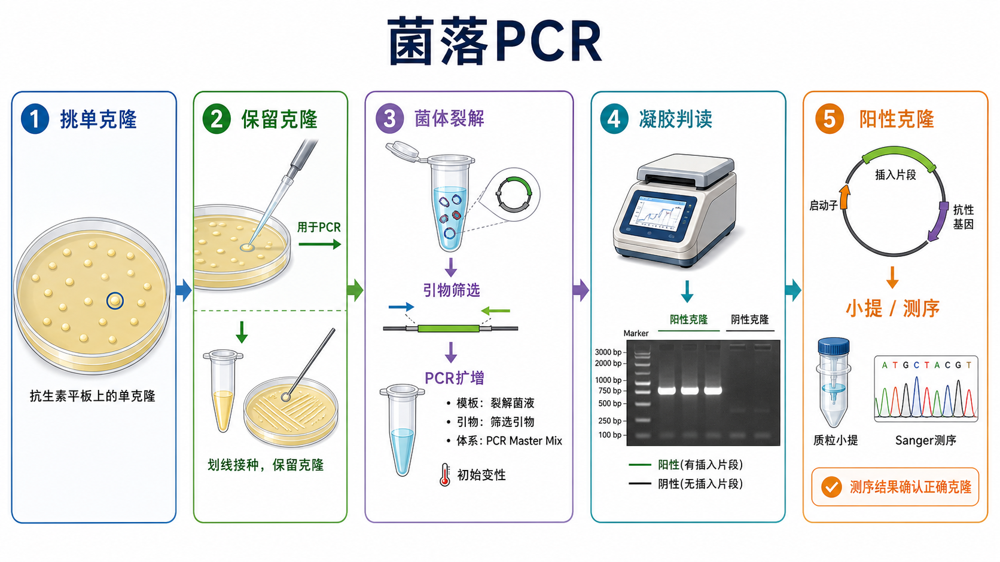

# 菌落PCR

菌落 PCR（colony PCR，菌落聚合酶链式反应）是从单个细菌菌落中取少量菌体作为模板，直接进行[PCR](<PCR.md>)扩增，用于快速筛选[细菌转化](<细菌转化.md>)后的阳性克隆。它常用于判断[连接反应](<连接反应.md>)后菌落是否含有目标插入片段、插入片段大小是否大致正确，以及在特定引物设计下判断插入方向。

## 实验发明历史

PCR（polymerase chain reaction，聚合酶链式反应）在 1980 年代建立后，很快被扩展到不同模板类型。菌落 PCR 可以理解为 PCR 在克隆筛选中的简化应用：不先进行[质粒提取](<质粒提取.md>)，而是利用初始高温变性或预裂解步骤释放细菌内的质粒 DNA，再用引物扩增目标区域。

在传统质粒克隆 workflow 中，抗性筛选只能说明菌落可能携带某种抗性质粒；菌落 PCR 则进一步回答“这个菌落里有没有目标片段、大小是否接近预期”。NEB 把 colony PCR 描述为一种高通量筛选方法，可用来判断质粒构建中插入 DNA 的有无，并通过琼脂糖凝胶判断扩增产物大小。参考：[NEB Colony PCR](https://www.neb.com/en-us/applications/cloning-and-synthetic-biology/dna-analysis/colony-pcr)。

## 应用场景

| 场景 | 菌落 PCR 解决什么问题 | 关键设计 |
|---|---|---|
| 插入片段有无筛选 | 判断菌落是否含目标 insert | 插入片段特异性引物 |
| 插入片段大小筛选 | 判断 insert 大小是否接近预期 | 载体两侧 flanking primers |
| 插入方向筛选 | 判断 insert 正反方向 | 一个载体引物 + 一个 insert 引物 |
| 多克隆快速初筛 | 从很多菌落中选出少数候选 | 96 孔或多反应 master mix |
| 连接背景判断 | 判断空载体、载体自连或错误连接 | 载体-only 对照和阴性菌落 |
| 后续测序前筛选 | 减少需要小提和测序的克隆数 | 只送阳性或代表性克隆 |

## 实验目的

菌落 PCR 的目的不是最终确认构建体，而是快速缩小候选克隆范围。它通常回答：

- 菌落是否含有目标插入片段。
- 插入片段大小是否与预期接近。
- 插入片段是否可能在正确方向。
- 哪些克隆值得继续培养、小提和测序。

需要特别记住：菌落 PCR 不能可靠证明 insert 序列完全正确，也不能排除点突变、小 indel、重复区域重排或远离扩增区域的载体问题。Addgene 明确提醒，得到预期大小条带并不代表 insert 没有突变，阳性克隆仍应送 [Sanger sequencing（Sanger 测序）](<Sanger测序.md>)确认。参考：[Addgene Plasmids 101: Colony PCR](https://blog.addgene.org/plasmids-101-colony-pcr)。

## 简要实验原理

### 菌体裂解释放质粒模板

菌落 PCR 的模板来自少量菌体。细菌在 PCR 初始高温步骤中被裂解，释放质粒 DNA；也可以先把菌体悬浮在无菌水中短暂加热，再取上清或悬液加入 PCR。NEB 提到单个 transformant 可以先在水中短暂加热裂解，也可以直接加入 PCR 反应，并在初始加热步骤中裂解释放质粒模板。参考：[NEB Colony PCR](https://www.neb.com/en-us/applications/cloning-and-synthetic-biology/dna-analysis/colony-pcr)。

### 引物设计决定你能回答什么问题

[菌落PCR引物设计](<../番外/补充知识/菌落PCR引物设计.md>)（colony PCR primer design，菌落 PCR 引物设计）是这项实验最重要的部分。常见三种策略：

| 引物策略 | 设计方式 | 能回答什么 | 局限 |
|---|---|---|---|
| Insert-specific primers | 两个引物都在插入片段内部 | 是否有目标片段序列 | 不能证明片段在正确载体中，也不能判断方向 |
| Backbone-specific primers | 两个引物位于多克隆位点两侧载体区域 | insert 大小是否正确，是否在载体里 | 不判断方向，大片段扩增可能困难 |
| Orientation-specific primers | 一个载体引物 + 一个 insert 引物 | insert 是否存在且方向是否正确 | 每个 insert 常要重新设计 |

Addgene 也把 colony PCR primer design 分为 insert-specific、backbone-specific 和 orientation-specific 三种策略，并说明各自能提供的信息不同。参考：[Addgene Plasmids 101: Colony PCR](https://blog.addgene.org/plasmids-101-colony-pcr)。

### 菌落 PCR 是筛选，不是选择

抗生素平板上的菌落已经经历 selection（选择），因为没有抗性基因的细胞通常不能存活；菌落 PCR 属于 screen（筛选），因为它是在存活菌落中继续区分正确克隆和错误克隆。它和[蓝白斑筛选](<../番外/补充知识/蓝白斑筛选.md>)、诊断性酶切、Sanger 测序属于同一个“克隆验证”层级，但信息量不同。

### PCR 条带大小只是结构线索

菌落 PCR 最后通常通过[琼脂糖凝胶电泳](<琼脂糖凝胶电泳.md>)判断条带有无和大小。条带大小符合预期说明这个菌落“值得继续验证”，但不说明序列完全正确。真正需要确认[载体-插入片段接合位点](<../番外/补充知识/载体-插入片段接合位点.md>)（vector-insert junction，载体-插入片段连接位点）和 insert 序列时，应继续做 Sanger 测序。

## 所需试剂、材料与设备

| 类别 | 常用内容 | 作用 |
|---|---|---|
| 菌落 | [抗性平板](<../材(实验耗材工具篇)/抗性平板.md>)上的单克隆 | 提供质粒模板 |
| PCR 体系 | [PCR Master Mix](<../材(实验耗材工具篇)/PCR Master Mix.md>)、[Taq DNA聚合酶](<../材(实验耗材工具篇)/Taq DNA聚合酶.md>)、[dNTP](<../材(实验耗材工具篇)/dNTP.md>) 或其他 DNA 聚合酶 | 扩增目标片段 |
| 引物 | [PCR引物](<../材(实验耗材工具篇)/PCR引物.md>) | 决定筛选信息 |
| 水 | [无核酸酶水](<../材(实验耗材工具篇)/无核酸酶水.md>) | 配制反应或菌体悬液 |
| 耗材 | [PCR管](<../材(实验耗材工具篇)/PCR管.md>)、无菌枪头、无菌牙签或接种针 | 挑菌和反应容器 |
| 仪器 | [PCR仪](<../材(实验耗材工具篇)/PCR仪.md>) | 热循环扩增 |
| 凝胶验证 | [琼脂糖](<../材(实验耗材工具篇)/琼脂糖.md>)、[TAE缓冲液](<../材(实验耗材工具篇)/TAE缓冲液.md>)或[TBE缓冲液](<../材(实验耗材工具篇)/TBE缓冲液.md>)、[DNA Ladder](<../材(实验耗材工具篇)/DNA Ladder.md>)、[凝胶成像系统](<../材(实验耗材工具篇)/凝胶成像系统.md>) | 判断 PCR 产物大小 |
| 后续步骤 | [LB 培养基](<../材(实验耗材工具篇)/LB培养基.md>)、抗性平板、质粒小提试剂盒、测序引物 | 保存和确认阳性克隆 |

## 实验操作

### 设计筛选策略和对照

**怎么做：**先确定你要筛查“有无 insert”“insert 大小”“insert 方向”，再选择对应引物组合。设置阳性对照、阴性对照和 [no-template control（NTC，无模板对照）](<../番外/补充知识/无模板对照.md>)。如果有空载体对照或已知正确质粒，最好一起跑。

**为什么重要：**菌落 PCR 的信息量完全由引物决定。比如 insert-specific primers 出现条带，只能说明菌落里存在相应序列，不能证明它在目标载体中；orientation-specific primers 才能判断方向。

**注意事项：**尽量避免扩增过长片段。菌体碎片和复杂模板会降低 PCR 稳定性，短扩增片段通常更稳。Addgene 也建议较短 amplicon 更容易在含有细菌残渣的 PCR 中工作。参考：[Addgene Plasmids 101: Colony PCR](https://blog.addgene.org/plasmids-101-colony-pcr)。

**替代方案：**如果 insert 很长或 GC-rich，先用 flanking primers 做粗筛，再对阳性克隆小提后测序；如果方向很关键，加入 junction-specific 或 orientation-specific primer pair。

**出错后果：**引物策略错了会出现“条带正确但构建错误”的假安全感，或者筛掉真正正确的克隆。

### 挑取单克隆并保留克隆

**怎么做：**从新鲜抗性平板上挑取边界清楚、相互分离的单克隆。用无菌枪头或牙签轻轻接触菌落，一部分用于 PCR 模板，一部分划线到备份平板或接种到含抗生素的液体培养基中保存。

**为什么重要：**菌落 PCR 会消耗一小部分菌体，但真正后续要用的是同一个克隆。NEB 的插入筛选 protocol 建议挑菌后先 replica plate 或接种培养基保留克隆，再把剩余菌体转入 PCR 管；Thermo Fisher 的相关 protocol 也提醒要做 patch plate 来保留菌落。参考：[NEB Insert Screening Protocols](https://www.neb.com/en-us/protocols/insert-screening-protocols-e1202)；[Thermo Fisher: Cloning of Taq polymerase-amplified PCR products](https://www.thermofisher.com/uk/en/home/references/protocols/nucleic-acid-amplification-and-expression-profiling/pcr-protocol/cloning-of-taq-polymerase-amplified-pcr-products.html)。

**注意事项：**不要挑混合菌落；不要从过密区域挑菌；不要取太多菌体。太多细菌会带入大量蛋白、盐、多糖和细胞碎片，抑制 PCR 或产生非特异条带。

**替代方案：**如果当天能完成分析，可以把菌体先悬浮在少量无菌水中，一部分做 PCR，剩余悬液用于阳性克隆接种；如果结果要第二天看，建议同时在备份抗性平板上划线。

**出错后果：**不保留克隆会导致 PCR 阳性但找不到对应菌落；挑到混合菌落会导致 PCR 和测序结果杂乱。

### 准备菌体模板

**怎么做：**常见做法有两种：一种是直接把极少量菌体加入 PCR 反应，让初始变性步骤裂解；另一种是先把菌体悬浮在无核酸酶水中，短暂加热裂解，再取少量作为模板。

**为什么重要：**模板太少会无条带，模板太多会抑制反应。NEB FAQ 提到使用 OneTaq Quick-Load 进行 colony PCR 时，推荐初始 2-5 min 变性来裂解细胞。参考：[NEB FAQ: OneTaq Quick-Load for colony PCR](https://www.neb.com/en-us/faqs/can-onetaq-quick-load-dna-polymerase-be-used-in-colony-pcr)。

**注意事项：**不要把一整坨菌刮进 PCR 管。菌体量以“枪头轻触后在液体中轻轻涮一下”为宜。若菌落很黏或很大，宁可先做稀释悬液。

**替代方案：**难扩增或背景多时，可以先挑菌到 20-50 µL 水中，95°C 左右加热裂解，短暂离心后取上清做 PCR；也可以先小量培养后取菌液做模板。

**出错后果：**菌体过量常导致全无条带、拖尾或多条非特异条带；裂解不足会导致模板释放不充分。

### 配制 PCR 反应

**怎么做：**按常规 PCR 逻辑配制反应：水、PCR Master Mix 或 buffer/dNTP/polymerase、正反向引物和模板。多菌落筛选时，先配 master mix，再分装到 PCR 管中，最后加入不同菌落模板。

**为什么重要：**菌落 PCR 通常要筛多个克隆，master mix 能减少移液误差和批间差异。Taq polymerase 或 OneTaq 类较 robust 的聚合酶常用于筛选；若后续直接测序 PCR 产物或片段较长，可考虑更合适的高保真或长片段聚合酶。

**注意事项：**菌落 PCR 易污染，NTC 必须保留。若使用 Quick-Load 类 master mix，可直接上胶；普通体系需要加入 [loading dye（上样染料）](<../材(实验耗材工具篇)/Loading Dye.md>)。

**替代方案：**如果只是判断 insert 有无，Taq 类酶足够；如果要扩增长片段，选择 LongAmp/Taq mix 等更适合长片段的体系。NEB 的 insert screening protocol 也根据插入片段长度推荐不同聚合酶选择。参考：[NEB Insert Screening Protocols](https://www.neb.com/en-us/protocols/insert-screening-protocols-e1202)。

**出错后果：**漏加引物或 master mix 失效会全阴性；引物浓度过高可能产生引物二聚体；污染会让 NTC 出条带。

### 设置 PCR 程序

**怎么做：**在常规 PCR 程序基础上，加强初始变性或裂解步骤。常见逻辑是初始 94-95°C 数分钟裂解细胞，然后进入 25-35 个循环；退火温度按引物 Tm 和聚合酶体系优化；延伸时间按扩增片段长度设置。

**为什么重要：**菌落 PCR 的模板被细胞包裹，初始裂解时间比纯化质粒 PCR 更关键。NEB 的补充 protocol 给出的 colony PCR 示例包含 95°C 5 min 初始变性，以及 95°C、退火、72°C 延伸的循环框架。参考：[NEB Supplemental Protocol: Using colony PCR to identify positive clones](https://www.neb.com/en-us/protocols/supplemental-protocol-2-using-colony-pcr-to-identify-positive-clones-neb-m0689)。

**注意事项：**不要机械照搬温度。不同聚合酶最适延伸温度不同，例如常规 Taq 常用 72°C，而部分 OneTaq/LongAmp protocol 可用 68°C。以产品说明和引物 Tm 为准。

**替代方案：**如果非特异条带多，可提高退火温度、减少循环数、使用 hot-start polymerase 或重新设计引物；如果无条带，可降低退火温度、延长初始裂解或减少菌体抑制物。

**出错后果：**初始变性太短可能无模板释放；退火温度太低会出现非特异条带；延伸时间不足会缺失大片段。

### 凝胶电泳判读

**怎么做：**PCR 结束后取部分产物上琼脂糖凝胶，和 DNA ladder、阳性对照、阴性对照一起比较条带大小。根据引物策略判断阳性克隆。

**为什么重要：**菌落 PCR 的结果是“条带模式”，不是单纯有无条带。Backbone-specific primers 下，空载体也可能有条带，只是比含 insert 的条带更短；orientation-specific primers 下，正确方向才应出现预期条带。

**注意事项：**小片段和引物二聚体不要误判为阳性；过曝会让弱非特异条带看起来像阳性；胶浓度要适合目标片段大小。

**替代方案：**如果条带差异很小，改用更高浓度琼脂糖胶、毛细管电泳或重新设计更能区分大小的引物。

**出错后果：**误判条带会让错误克隆进入小提和测序，浪费时间。

### 阳性克隆后续确认

**怎么做：**从保留的备份平板或液体培养中取对应阳性克隆，进行过夜培养、质粒小提、诊断性酶切或 Sanger 测序。关键构建至少要测序 insert、junction 和重要突变/标签区域。

**为什么重要：**菌落 PCR 是初筛。PCR 可能因为污染、引物误配或混合菌落产生假阳性，也可能无法检测 insert 内部突变。Addgene 建议识别阳性克隆后进行 miniprep 并提交 Sanger sequencing。参考：[Addgene Plasmids 101: Colony PCR](https://blog.addgene.org/plasmids-101-colony-pcr)。

**注意事项：**不要只测一个阳性克隆，尤其是 PCR 扩增、连接或组装步骤可能引入突变时。最好保留多个候选克隆。

**替代方案：**若构建简单，可先小提后诊断性酶切，再送测序；若插入片段短且 colony PCR 产物干净，也可纯化 PCR 产物测序，但最终质粒仍建议确认。

**出错后果：**跳过测序可能把带突变、反向插入或混合克隆用于后续实验。

## 结果解析

| 观察结果 | 可能说明什么 | 下一步 |
|---|---|---|
| 阳性对照有条带，NTC 无条带，候选有预期条带 | 候选克隆可能正确 | 保留对应克隆，小提并测序 |
| 所有样本无条带，阳性对照也无条带 | PCR 体系、程序或引物失败 | 检查 master mix、引物、退火温度和程序 |
| NTC 有条带 | PCR 污染 | 更换水、枪头、master mix，重新配体系 |
| 候选都有空载体大小条带 | 载体自连或无 insert | 回查连接反应和载体处理 |
| 多条非特异条带 | 退火温度低、引物特异性差、菌体过量 | 提高退火温度、减少菌量、重设计引物 |
| 条带拖尾或泳道很脏 | 菌体过量、裂解物抑制、上样过多 | 减少菌体、模板稀释、重新挑菌 |
| 胶图阳性但测序失败 | 混合克隆、PCR 假阳性、测序引物不合适 | 重新划线纯化、小提测序 |

## 常见异常与 troubleshooting

### 完全无条带

先看阳性对照。如果阳性对照失败，优先检查 PCR mix、引物、退火温度和 PCR 仪程序；如果阳性对照正常，检查菌体量是否过多、裂解是否充分、目标片段是否太长。

### 非特异条带多

常见原因是退火温度偏低、引物设计不佳、循环数过多或菌体模板过量。可提高退火温度，使用 hot-start polymerase，降低模板量，或重新设计更特异的引物。

### 假阳性

假阳性可能来自污染、混合菌落、引物扩增到相似序列，或 insert-specific primers 扩增到不在目标载体中的片段。应使用载体特异引物、junction-specific 引物或 Sanger 测序进一步确认。

### 假阴性

假阴性可能来自菌体太多导致 PCR 抑制、菌体太少导致模板不足、插入片段太长、GC 含量高或引物跨越区域设计不合理。可以重新挑同一备份克隆、小提后 PCR，或使用更适合长片段/高 GC 的酶。

### 克隆丢失或找不到对应菌落

这通常是挑菌时没有保留克隆。解决方法是在做 PCR 前先 replica patch 到新抗性平板，或同时接种小体积液体培养。菌落 PCR 阳性结果必须能追溯到对应克隆。

## 相关方法对比

| 方法 | 能提供的信息 | 优点 | 局限 |
|---|---|---|---|
| 菌落 PCR | insert 有无、大小、方向线索 | 快、便宜、适合多克隆初筛 | 不能确认完整序列 |
| [诊断性酶切](<限制性内切酶酶切.md>) | 质粒结构和限制性图谱 | 对大片段和载体结构有帮助 | 需要先小提，分辨率有限 |
| Sanger 测序 | junction 和 insert 序列 | 最终确认关键序列 | 成本和时间更高 |
| 蓝白斑筛选 | lacZ α 是否被插入破坏 | 平板上直接初筛 | 假阳性/假阴性，不能确认目标序列 |
| 直接小提测序 | 跳过 PCR 初筛 | 最可靠但更贵 | 克隆数多时成本高 |

## 购买与选择建议

菌落 PCR 不一定需要最高保真酶，日常筛选常用 robust Taq 或 colony-PCR-friendly master mix。选择时重点看：

- 是否能耐受少量细胞裂解物。
- 是否适合目标扩增片段长度。
- 是否支持直接上胶，如 Quick-Load 类体系。
- 是否需要 hot-start 来减少非特异扩增。
- 是否需要后续测序 PCR 产物。

常见可选品牌包括 [NEB](<../番外/试剂厂商/NEB.md>)、[Thermo Fisher Scientific](<../番外/试剂厂商/Thermo Fisher Scientific.md>)、[Takara](<../番外/试剂厂商/Takara.md>) 和 [Promega](<../番外/试剂厂商/Promega.md>)。如果只是筛选菌落，优先考虑稳定、便宜、上胶方便的 master mix；如果要扩增长片段或复杂片段，再升级到长片段/高保真体系。

## 推荐记录模板

### 中文记录模板

| 项目 | 记录内容 |
|---|---|
| 构建名称 | 载体、insert、连接批次 |
| 菌落来源 | 转化日期、平板抗性、菌落编号 |
| 引物策略 | insert-specific、backbone-specific、orientation-specific |
| 引物信息 | 引物名称、序列、Tm、预期产物大小 |
| PCR 体系 | master mix、酶、反应体积、模板处理方式 |
| PCR 程序 | 初始裂解/变性、退火温度、循环数、延伸时间 |
| 对照 | 阳性、阴性、NTC、空载体 |
| 胶图结果 | 条带大小、阳性克隆编号、异常条带 |
| 后续处理 | 小提、酶切、Sanger 测序、甘油菌保存 |

### English Record Template

| Item | Record |
|---|---|
| Construct name | Vector, insert, ligation batch |
| Colony source | Transformation date, plate antibiotic, colony ID |
| Primer strategy | Insert-specific, backbone-specific, orientation-specific |
| Primer information | Primer names, sequences, Tm, expected amplicon size |
| PCR setup | Master mix, polymerase, reaction volume, template preparation |
| Cycling program | Initial lysis/denaturation, annealing temperature, cycles, extension time |
| Controls | Positive control, negative control, NTC, empty vector |
| Gel result | Band size, positive colony IDs, abnormal bands |
| Follow-up | Miniprep, diagnostic digest, Sanger sequencing, glycerol stock |

## 参考来源

- [NEB: Colony PCR](https://www.neb.com/en-us/applications/cloning-and-synthetic-biology/dna-analysis/colony-pcr)
- [NEB: Supplemental Protocol 2, Using colony PCR to identify positive clones](https://www.neb.com/en-us/protocols/supplemental-protocol-2-using-colony-pcr-to-identify-positive-clones-neb-m0689)
- [NEB: Insert Screening Protocols](https://www.neb.com/en-us/protocols/insert-screening-protocols-e1202)
- [NEB FAQ: OneTaq Quick-Load for colony PCR](https://www.neb.com/en-us/faqs/can-onetaq-quick-load-dna-polymerase-be-used-in-colony-pcr)
- [Addgene: Plasmids 101, Colony PCR](https://blog.addgene.org/plasmids-101-colony-pcr)
- [Thermo Fisher Scientific: Cloning of Taq polymerase-amplified PCR products](https://www.thermofisher.com/uk/en/home/references/protocols/nucleic-acid-amplification-and-expression-profiling/pcr-protocol/cloning-of-taq-polymerase-amplified-pcr-products.html)
