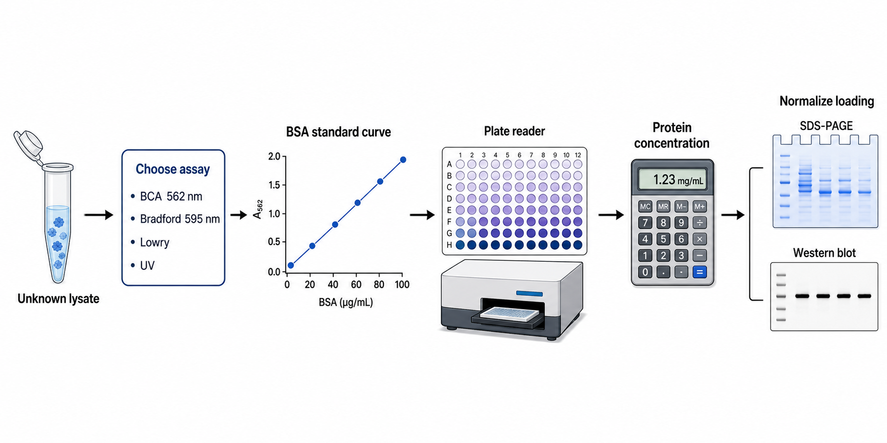
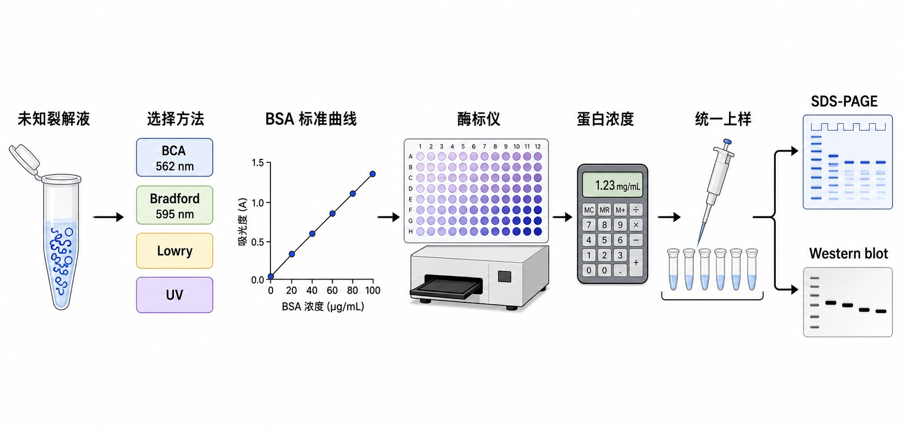

# 蛋白定量





Protein quantification（蛋白定量）是测定样本中总蛋白浓度或目标蛋白溶液浓度的实验模块。它最常见的位置是在 [细胞裂解](细胞裂解.md) 之后、[SDS-PAGE](<SDS-PAGE.md>) 和 [Western blot](<Western blot.md>) 之前，用来把不同样本换算成相同蛋白量上样，避免“条带强弱只是因为上样量不同”。

蛋白定量不是单纯读一个浓度数值，而是一个由样本背景、标准品、显色反应、[标准曲线](../番外/补充知识/标准曲线.md)、仪器读数和结果换算共同决定的质量控制步骤。如果这个步骤不可靠，后面的 SDS-PAGE、Western blot、免疫沉淀、酶活测定和蛋白纯化评价都会受到影响。

## 发明历史

早期总蛋白测定主要依赖 biuret reaction（双缩脲反应）和 Lowry assay（Lowry 蛋白定量法）。Lowry 法由 Oliver H. Lowry 等人在 1951 年发表，核心是铜离子参与的蛋白反应再叠加 Folin-Ciocalteu reagent（福林-酚试剂）显色，灵敏度较高，但步骤较多、干扰因素也较多。参考：Lowry et al., 1951, [Protein measurement with the Folin phenol reagent](https://pubmed.ncbi.nlm.nih.gov/14907713/)

Bradford assay（Bradford 蛋白定量法）由 Marion M. Bradford 在 1976 年发表，利用 Coomassie Brilliant Blue G-250（考马斯亮蓝 G-250）与蛋白结合后的吸收峰变化进行快速定量，通常读取 595 nm。它操作很快，但对去污剂敏感，并且不同蛋白之间响应差异较明显。参考：Bradford, 1976, [A rapid and sensitive method for the quantitation of microgram quantities of protein](https://doi.org/10.1016/0003-2697(76)90527-3)

BCA assay（Bicinchoninic acid assay，二喹啉甲酸蛋白定量法）由 Smith 等人在 1985 年系统发表，结合了蛋白还原铜离子和 bicinchoninic acid（二喹啉甲酸）络合 Cu1+ 的显色反应，通常读取 562 nm。它现在是细胞裂解液和 Western blot 前总蛋白定量的常用默认方案之一。参考：Smith et al., 1985, [Measurement of protein using bicinchoninic acid](https://doi.org/10.1016/0003-2697(85)90442-7)

## 应用场景

| 场景 | 为什么需要蛋白定量 | 重点风险 |
| --- | --- | --- |
| Western blot 前上样 | 让每个泳道上样总蛋白量一致 | 定量错误会被误解为目标蛋白表达差异 |
| SDS-PAGE 考马斯染色 | 比较总蛋白条带和纯化程度 | 过量上样会拖尾，低量上样看不清 |
| 免疫沉淀 input 标准化 | 保证每组起始样本可比 | 样本浓度不同会影响 pull-down 解释 |
| 酶活或代谢实验归一化 | 把活性换算到每 mg protein | 裂解效率差会造成假差异 |
| 蛋白纯化 | 追踪裂解液、流穿、洗脱液中的蛋白量 | A280 对杂蛋白和核酸污染敏感 |
| 样本质控 | 判断裂解、提取、冻融或降解是否异常 | 颜色、沉淀、脂质和核酸会影响读数 |

## 实验目的

蛋白定量的第一个目的，是得到样本的 protein concentration（蛋白浓度），常见单位包括 mg/mL、µg/µL 或 µg/mL。第二个目的，是把不同样本统一到同一个 loading amount（上样总量），例如每孔 10-30 µg 总蛋白。第三个目的，是发现上游样本制备的问题：如果某个样本浓度异常低，可能是细胞量不足、裂解不充分、蛋白降解、沉淀丢失或样本稀释错误。

对 Western blot 来说，蛋白定量的本质是“公平上样”。如果没有可靠定量，即使后面抗体、转膜和曝光都做得很好，结果仍然可能只是反映样本总量差异，而不是目标蛋白真实变化。

## 简要实验原理

多数蛋白定量属于 colorimetric assay（比色法）：让蛋白参与化学显色反应，然后用 [吸光度](../番外/补充知识/吸光度.md) 读数推算浓度。吸光度值本身不是浓度，必须通过标准品建立标准曲线，或者在已知 extinction coefficient（消光系数）的情况下用 Beer-Lambert law（比尔-朗伯定律）换算。

### BCA 法

[BCA蛋白定量](BCA蛋白定量.md) 的反应分成两个层次。第一层是蛋白在碱性条件下把 Cu2+ 还原为 Cu1+，这个过程与 peptide bond（肽键）以及部分氨基酸残基有关。第二层是 BCA 与 Cu1+ 形成紫色络合物，通常读取 [OD562](../番外/补充知识/OD562.md)。Thermo Fisher 的 Pierce BCA Protein Assay Kit 页面也采用这一核心原理，并将 562 nm 作为读数波长。参考：[Thermo Fisher Pierce BCA Protein Assay Kit](https://www.thermofisher.com/order/catalog/product/23225)

BCA 法的优点是线性范围相对宽，对许多常见去污剂比 Bradford 更耐受，适合 [RIPA裂解液](<../材(实验耗材工具篇)/RIPA裂解液.md>) 这类细胞裂解液场景。它的主要风险是对还原剂敏感，例如 [DTT](<../材(实验耗材工具篇)/DTT.md>) 和 [β-巯基乙醇](<../材(实验耗材工具篇)/β-巯基乙醇.md>) 可能直接影响铜离子还原，造成读数假高。

### Bradford 法

[Bradford蛋白定量](Bradford蛋白定量.md) 依赖 Coomassie Brilliant Blue G-250 与蛋白结合后的颜色和吸收峰变化，通常读取 [OD595](../番外/补充知识/OD595.md)。它的速度很快，室温短时间反应即可读数，适合快速粗略判断蛋白浓度。Bio-Rad 的 protein assay 资料也把 Bradford 作为经典蛋白定量方案之一。参考：[Bio-Rad Protein Assays](https://www.bio-rad.com/en-us/applications-technologies/protein-assays)

Bradford 的弱点是对 detergent（去污剂）更敏感，且不同蛋白由于精氨酸、芳香族残基和疏水区域差异，染料响应不完全相同。因此，Bradford 很适合快速筛查，但如果样本缓冲液复杂或要做严格组间比较，需要更谨慎。

### Lowry 法

[Lowry蛋白定量](Lowry蛋白定量.md) 可以理解为双缩脲反应与 Folin-Ciocalteu reagent 显色的组合。它灵敏度较高，但步骤更多，对还原剂、螯合剂、去污剂、缓冲体系等干扰更敏感。现在很多常规 Western blot 实验不会优先选择 Lowry，但它仍是理解蛋白定量历史和部分旧 SOP 的重要方法。

### A280 法

[A280蛋白定量](A280蛋白定量.md) 通过测量 280 nm 吸光度估算蛋白浓度，主要依赖 tryptophan（色氨酸）、tyrosine（酪氨酸）和 disulfide bond（二硫键）的吸收。它常用于纯化蛋白、抗体、酶或核酸污染较低的蛋白溶液，优点是快速、无需显色试剂，常配合 [微量紫外分光光度计](<../材(实验耗材工具篇)/微量紫外分光光度计.md>) 使用。

A280 不适合直接替代细胞裂解液的 BCA 默认流程，因为裂解液中核酸、缓冲液成分、浊度和蛋白组成都会改变读数解释。如果要使用 A280，最好知道目标蛋白的消光系数，并同时查看 A260/A280 或全波长扫描。

## 所需试剂、耗材和仪器

| 类型 | 常用选择 | 作用 | 关键记录 |
| --- | --- | --- | --- |
| 样本 | 细胞裂解液、组织裂解液、纯化蛋白 | 待测蛋白来源 | 样本来源、裂解方式、冻融次数 |
| 定量试剂 | [BCA蛋白定量试剂盒](<../材(实验耗材工具篇)/BCA蛋白定量试剂盒.md>) | 默认推荐的总蛋白比色定量方案 | 品牌、货号、批号、有效期 |
| 标准品 | [BSA标准品](<../材(实验耗材工具篇)/BSA标准品.md>)，BSA 是 bovine serum albumin（牛血清白蛋白） | 建立标准曲线 | 浓度、稀释梯度、保存状态 |
| 基础蛋白 | [BSA](<../材(实验耗材工具篇)/BSA.md>) | 作为标准蛋白或封闭相关试剂 | 等级、纯度、溶剂 |
| 反应容器 | [96孔板](<../材(实验耗材工具篇)/96孔板.md>) 或比色皿 | 承载标准品、样本和显色反应 | 板型、透明度、是否适配波长 |
| 加样工具 | [移液枪](<../材(实验耗材工具篇)/移液枪.md>)、[移液枪吸头](<../材(实验耗材工具篇)/移液枪吸头.md>)、多道移液枪 | 决定重复孔一致性 | 量程、校准状态、吸头规格 |
| 读数仪器 | [酶标仪](<../材(实验耗材工具篇)/酶标仪.md>) 或 [分光光度计](<../材(实验耗材工具篇)/分光光度计.md>) | 读取吸光度 | 波长、读板模式、路径长度校正 |
| 下游配样 | [Laemmli上样缓冲液](<../材(实验耗材工具篇)/Laemmli上样缓冲液.md>)、SDS、还原剂 | 定量后配成可电泳样本 | 最终 1×/2×、是否加热 |

## 方法选择

| 方法 | 最适合 | 优点 | 局限 | 默认判断 |
| --- | --- | --- | --- | --- |
| BCA | 常规细胞/组织裂解液，WB 前统一上样 | 稳定、线性范围较宽、对部分去污剂兼容 | 还原剂和螯合剂会干扰 | 常规 WB 样本优先 |
| Bradford | 快速估算、简单蛋白溶液 | 快、便宜、室温操作 | 对去污剂敏感，蛋白间响应差异明显 | 快速筛查可用 |
| Lowry | 旧 SOP、需要较高灵敏度的传统体系 | 灵敏度较高 | 步骤复杂，干扰物多 | 除非 SOP 要求，否则不优先 |
| A280 | 纯化蛋白、抗体、已知蛋白 | 不消耗样本，不需要显色 | 对核酸、浊度和蛋白组成敏感 | 纯蛋白更合适 |

如果目标是 Western blot 前统一上样，通常先考虑 BCA。Bradford 可以更快，但要确认裂解液中 detergent 是否会干扰。A280 很适合纯化蛋白，不适合把复杂裂解液“直接一测就当总蛋白浓度”。Lowry 更像历史和旧体系中的重要方法，不是现在多数日常 WB 的第一选择。

## 实验操作：默认 BCA 微孔板流程

下面以常见 microplate BCA workflow（微孔板 BCA 工作流）为默认方案。不同品牌试剂盒的体积、标准范围、孵育温度和时间可能不同，实际操作必须优先遵循所用试剂盒说明书。

### 设计样本和稀释倍数

做什么：先判断样本大概浓度范围，把每个样本设计成 1-2 个稀释倍数。常见细胞裂解液可以先试 1:5、1:10 或 1:20；纯化蛋白则根据预期浓度调整。

为什么重要：标准曲线只能可靠解释落在 [线性范围](../番外/补充知识/线性范围.md) 内的样本。样本太浓会超出曲线，太稀则接近 blank（空白）背景，都会让换算不可靠。

注意事项：样本和标准品最好使用相同或相近的 buffer background（缓冲背景）。如果样本来自 RIPA 裂解液，空白也应使用相同 RIPA 或对应稀释后的 RIPA，尽量减少 [基质效应](../番外/补充知识/基质效应.md)。

替代方案：如果完全不知道样本浓度，可以先做一个小范围预实验，用少量样本测试几个稀释倍数，再正式定量。

出错后果：样本 OD 超过最高标准点时，软件外推出来的浓度看似精确，但实际不可信；样本 OD 接近空白时，微小移液误差都会被放大。

### 配制标准曲线

做什么：用 BSA 标准品配制一系列已知浓度，例如从高浓度到低浓度连续稀释，并保留 blank 孔。每个标准点建议至少 duplicates（复孔），重要实验建议 triplicates（三复孔）。

为什么重要：标准曲线是把颜色读数翻译成蛋白浓度的“尺子”。尺子配错，所有样本都会一起错。

注意事项：连续稀释时每一步都要充分混匀，换枪头，避免从高浓度带入低浓度。标准品不要反复冻融；如果 BSA 标准品状态异常，曲线会整体变差。

替代方案：某些试剂盒提供预稀释标准品，可以减少人为稀释误差。若实验室已有固定 SOP，也可以沿用同一浓度范围，方便不同批次比较。

出错后果：曲线点上下乱跳通常来自移液、混匀、气泡或标准品配错；曲线斜率异常可能来自试剂失效、孵育条件错误或读数波长错误。

### 加样到 96 孔板

做什么：把标准品、空白和样本按板图加入 96 孔板，再加入 BCA working reagent（BCA 工作液）。Pierce BCA 一类试剂盒常见 A:B 为 50:1，但必须以具体说明书为准。

为什么重要：微孔板定量的重复性很大程度取决于加样顺序、移液准确性和孔间一致性。

注意事项：避免气泡，气泡会改变光路并造成假高或假低。小体积加样时枪头要预润洗，尽量使用合适量程移液枪。边缘孔更容易受蒸发和温度影响，精密实验可以避开边缘孔或做好板布局平衡。

替代方案：样本数量少时可以使用管式 BCA 或比色皿体系；样本很多时可用多道移液枪，但要确认每道出液一致。

出错后果：重复孔差异大通常不是生物学差异，而是移液、气泡、孔位或混匀问题。重复孔差异过大时，不建议强行取平均。

### 孵育显色

做什么：按试剂盒说明进行孵育，例如常见条件是 37°C 一定时间，或室温延长孵育。孵育结束后让板温和短暂平衡，再读取吸光度。

为什么重要：BCA 显色随时间和温度发展。温度不均、时间不一致，会让同一浓度在不同孔呈现不同颜色。

注意事项：同一块板从加工作液到开始孵育的时间要尽量一致。不要让一半孔已经反应很久，另一半孔刚刚加入工作液。若孵育时间较长，应注意封板，减少蒸发。

替代方案：如果样本浓度很低，可以选择更长孵育或增强型试剂盒；如果样本浓度高，可以稀释样本而不是过度延长或缩短显色。

出错后果：孵育不足会使低浓度样本不易区分；孵育过度或温度过高可能让高浓度点接近平台期，破坏线性。

### 读取吸光度

做什么：使用酶标仪读取 562 nm 吸光度。若仪器支持，可记录是否启用 pathlength correction（路径长度校正）或参考波长扣除。

为什么重要：读数波长必须匹配反应体系。BCA 读 OD562，Bradford 读 OD595；把波长设置错，标准曲线和样本浓度都会失真。

注意事项：读板前检查孔内是否有气泡、沉淀、指纹、液滴或明显蒸发。读数前轻轻震荡可改善混匀，但不要产生气泡。

替代方案：如果没有酶标仪，可用分光光度计和比色皿，但体系体积、光程和标准曲线都要重新匹配。

出错后果：整板背景高可能来自工作液污染、板不兼容或空白 buffer 本身吸光；单个孔异常多来自气泡、漏加、混匀不足或孔底污染。

### 计算浓度并统一上样

做什么：扣除空白，拟合标准曲线，用样本 OD 反推稀释后浓度，再乘以 dilution factor（稀释倍数）得到原始样本浓度。随后根据目标上样量计算每个样本体积，并用裂解液或水补齐到相同体积，再加入上样缓冲液。

为什么重要：蛋白定量的终点不是报一个浓度，而是把下游上样量统一。对 Western blot 来说，这一步直接决定每个泳道是否可比。

注意事项：只使用落在线性范围内的读数。若同一样本两个稀释倍数都在线性范围内，理论上换算回原液浓度应接近；这也是检查 [稀释线性](../番外/补充知识/稀释线性.md) 的好方法。

替代方案：如果某些样本浓度太低，不能达到预设上样量，可以降低所有样本上样量，或者重新制备样本，而不是只给低浓度样本上更大体积导致 buffer 组成不一致。

出错后果：计算时忘记乘稀释倍数、单位混乱、把 µg/µL 当成 mg/mL、或加入上样缓冲液前后体积不一致，都会导致实际 loaded protein amount（上样蛋白量）偏离设计。

## 结果解析

一个可靠的蛋白定量结果至少应满足以下条件：

| 判断点 | 好结果 | 需要警惕 |
| --- | --- | --- |
| 空白孔 | 背景低且重复性好 | 空白很高或孔间差异大 |
| 标准曲线 | 随浓度单调上升，主要标准点落在线性范围 | 高浓度平台、低浓度乱跳、R² 好但残差明显 |
| 复孔 | 同一样本 duplicates/triplicates 接近 | [复孔CV](../番外/补充知识/复孔CV.md) 过高 |
| 稀释倍数 | 不同稀释倍数换算回原液浓度接近 | 稀释后浓度不成比例，提示基质干扰 |
| 样本范围 | OD 落在标准曲线中段更稳妥 | 超出最高标准或接近 blank |
| 下游验证 | WB 内参或总蛋白染色大致一致 | 定量后上样仍明显不均 |

R² 很高不代表结果一定可靠。标准点很少、范围太窄或高浓度平台期被强行线性拟合时，R² 也可能看起来漂亮。更好的判断方式是同时看曲线形状、残差、空白、复孔差异和样本是否处在曲线中段。

## 异常结果与可能原因

| 异常 | 常见原因 | 处理策略 |
| --- | --- | --- |
| 标准曲线不线性 | 标准品稀释错误、混匀不足、孵育不均、试剂失效 | 重配标准品；检查工作液比例；统一孵育时间 |
| 空白孔很高 | buffer 本身吸光、板污染、工作液污染、还原剂或颜色干扰 | 使用对应 buffer blank；换板；新配工作液 |
| 样本浓度异常高 | DTT/β-巯基乙醇等还原剂干扰，或样本超出范围被外推 | 定量前避免加还原剂；稀释重测；使用兼容试剂盒 |
| 样本浓度异常低 | 裂解不足、细胞量少、蛋白沉淀、样本降解、稀释倍数写错 | 检查裂解流程；重测稀释倍数；加蛋白酶抑制剂 |
| 复孔差异大 | 移液误差、气泡、漏加、孔底污染、板边缘效应 | 去气泡；重做复孔；优化板图和移液方式 |
| 稀释不线性 | 基质效应、样本浑浊、干扰物浓度随稀释改变 | 做多倍稀释；换定量方法；用匹配 buffer 配标准品 |
| WB 上样后仍不均 | 浓度计算错误、样本粘稠、上样缓冲液混匀不足、蛋白降解 | 复核计算表；剪切 DNA 黏度；结合总蛋白染色判断 |
| A280 读数很高但 BCA 不高 | 核酸污染、浊度、芳香族小分子或缓冲液背景 | 查看 A260/A280；离心澄清；改用 BCA/Bradford |

## BCA、Bradford、Lowry、A280 与 PBS 的关系

蛋白定量常和缓冲液一起出现，但 [PBS](<../材(实验耗材工具篇)/PBS.md>) 不是蛋白定量方法。PBS 通常只作为洗涤、稀释或细胞处理背景；蛋白定量真正依赖的是显色试剂、标准品、样本缓冲背景和读数仪器。

如果样本用 PBS 稀释，通常背景比较简单；如果样本来自 RIPA、含 SDS、含 DTT 或含 EDTA 的体系，就必须检查对应定量方法的兼容性。PBS 的问题主要是“是否匹配样本背景”，而不是“能不能让蛋白显色”。

## 推荐记录模板

中文记录模板：

```text
实验日期：
实验目的：
样本名称：
样本来源：
裂解/提取方法：
定量方法：BCA / Bradford / Lowry / A280 / 其他
试剂盒品牌：
货号：
批号：
标准品：
标准曲线浓度范围：
样本稀释倍数：
反应体系体积：
孵育温度和时间：
读数仪器：
读数波长：
空白设置：
复孔数量：
标准曲线公式：
R²：
样本原液浓度：
计划下游实验：
目标上样量：
最终上样体积：
异常和处理：
```

English record template:

```text
Date:
Purpose:
Sample name:
Sample source:
Lysis / extraction method:
Quantification method: BCA / Bradford / Lowry / A280 / other
Kit brand:
Catalog number:
Lot number:
Standard protein:
Standard curve range:
Sample dilution factor:
Reaction volume:
Incubation temperature and time:
Reader / instrument:
Reading wavelength:
Blank setting:
Replicates:
Standard curve equation:
R²:
Original sample concentration:
Downstream experiment:
Target loading amount:
Final loading volume:
Issues and actions:
```

## 操作检查清单

- 样本还没有加入 Laemmli 上样缓冲液、DTT 或 β-巯基乙醇后再做常规 BCA。
- 标准品和样本的 buffer background 尽量一致。
- 标准曲线覆盖样本预期范围，样本读数不靠近上下边界。
- 空白、标准品和样本至少做 duplicates。
- 读数前检查气泡和孔底污染。
- 计算浓度时明确稀释倍数和单位。
- 下游上样前统一总蛋白量、总液体体积和最终上样缓冲液浓度。

## 小结

蛋白定量是蛋白实验链条里的“计量关口”。BCA、Bradford、Lowry 和 A280 都能给出蛋白相关读数，但适用场景不同。对常规细胞裂解液和 Western blot 前处理，BCA 通常是最稳妥的默认选择；对快速筛查，Bradford 更方便；对纯化蛋白，A280 很高效；Lowry 则更适合旧 SOP 或特定要求。真正可靠的蛋白定量，要同时关注标准曲线、样本背景、干扰物、复孔一致性和下游上样设计。

## 参考来源

- Thermo Fisher Scientific. [Pierce BCA Protein Assay Kit](https://www.thermofisher.com/order/catalog/product/23225)
- Bio-Rad. [Protein Assays](https://www.bio-rad.com/en-us/applications-technologies/protein-assays)
- Smith PK et al. [Measurement of protein using bicinchoninic acid](https://doi.org/10.1016/0003-2697(85)90442-7). Analytical Biochemistry, 1985.
- Bradford MM. [A rapid and sensitive method for the quantitation of microgram quantities of protein utilizing the principle of protein-dye binding](https://doi.org/10.1016/0003-2697(76)90527-3). Analytical Biochemistry, 1976.
- Lowry OH et al. [Protein measurement with the Folin phenol reagent](https://pubmed.ncbi.nlm.nih.gov/14907713/). Journal of Biological Chemistry, 1951.
