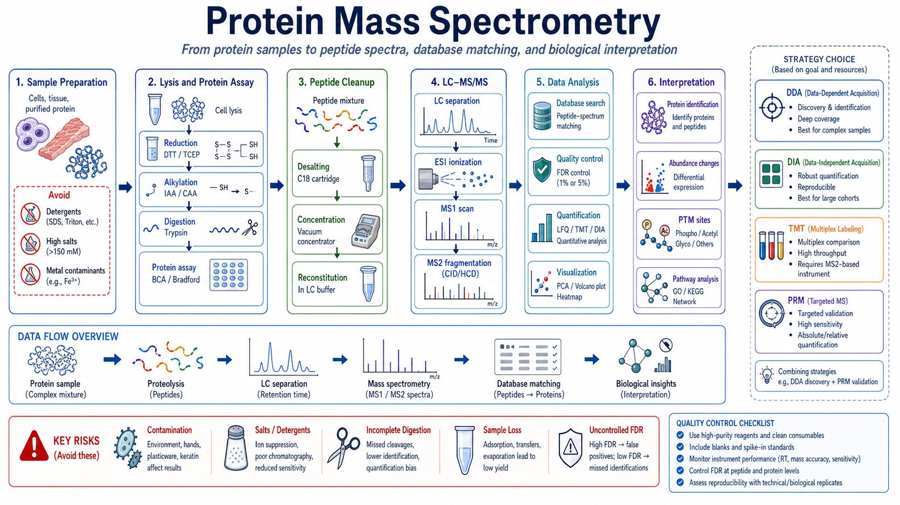
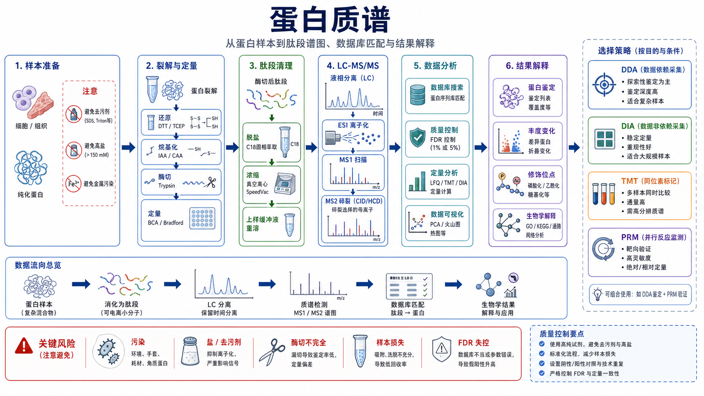

# 蛋白质谱





Protein mass spectrometry（蛋白质谱）是利用 mass spectrometry（MS，质谱）检测蛋白或蛋白酶切后 [肽段](<../番外/补充知识/肽段.md>) 的 [质荷比](<../番外/补充知识/质荷比.md>)、碎片离子和保留时间，从而完成蛋白鉴定、相对/绝对定量、翻译后修饰位点分析和蛋白组学解释的实验平台。它是 [蛋白质组学](<../番外/补充知识/蛋白质组学.md>) 的核心技术之一，也常用于纯化蛋白身份确认、[SDS-PAGE](<SDS-PAGE.md>) 胶切条带鉴定、[Western blot](<Western blot.md>) 结果正交验证和复杂样本蛋白组成分析。

本页默认讨论 bottom-up proteomics（自下而上蛋白质组学）：先把蛋白酶切成肽段，再用 [液相色谱-质谱联用](<液相色谱-质谱联用.md>)，即 LC-MS/MS（liquid chromatography-tandem mass spectrometry，液相色谱-串联质谱）检测肽段，最后用数据库搜索把肽段映射回蛋白。Top-down proteomics（自上而下蛋白质组学，直接分析完整蛋白）和小分子 LC-MS 属于相关但不同的主题。

## 为什么应该纳入 protocol

蛋白质谱应该纳入这个 protocol，因为它解决的是 WB、ELISA 和 SDS-PAGE 难以同时解决的问题：

| 问题 | WB/ELISA/SDS-PAGE 的限制 | 质谱的价值 |
| --- | --- | --- |
| “这条带到底是什么蛋白？” | SDS-PAGE 只能给表观分子量，WB 依赖抗体 | 胶切后 LC-MS/MS 可鉴定条带内蛋白 |
| “全局哪些蛋白变化了？” | WB/ELISA 通常是靶向检测 | shotgun proteomics（鸟枪法蛋白组学）可系统扫描 |
| “这个修饰位点在哪里？” | WB 多数只检测已知抗体位点 | MS/MS 可定位磷酸化、乙酰化等肽段位点 |
| “抗体结果是否可信？” | 抗体交叉反应可能带来假阳性 | 质谱可作为正交验证方式 |
| “多个样本如何比较？” | WB 通量低，ELISA 靶点有限 | LFQ、TMT、DIA 等策略可做多样本定量 |

但质谱不是“更高级的万能 WB”。它对样本污染、盐、去污剂、蛋白量、酶切质量、数据库和统计控制非常敏感；如果前处理不合格，昂贵的上机时间也救不回来。

## 发明历史与技术背景

质谱技术很早就用于小分子和同位素分析，但生物大分子质谱真正大规模进入生命科学，依赖 soft ionization（软电离）技术的发展。2002 年诺贝尔化学奖把生物大分子质谱的重要突破授予 John B. Fenn 和 Koichi Tanaka，分别表彰 ESI（electrospray ionization，电喷雾电离）和 soft laser desorption（软激光解吸）相关工作，使蛋白和其他大分子可以温和地进入气相离子状态。参考：[Nobel Prize Chemistry 2002 press release](https://www.nobelprize.org/prizes/chemistry/2002/press-release/)

现代蛋白质谱通常结合：

- LC（liquid chromatography，液相色谱）分离肽段。
- [ESI](<../番外/补充知识/ESI.md>) 或 [MALDI](<../番外/补充知识/MALDI.md>)（matrix-assisted laser desorption/ionization，基质辅助激光解吸电离）产生离子。
- MS1 scan（一级质谱扫描）记录 precursor ion（母离子/前体离子）。
- MS2 fragmentation（二级碎裂）记录 fragment ion（碎片离子）。
- [数据库搜索](<../番外/补充知识/数据库搜索.md>)、[肽段谱图匹配](<../番外/补充知识/肽段谱图匹配.md>) 和 [FDR](<../番外/补充知识/FDR.md>)（false discovery rate，错误发现率）控制完成鉴定。

Aebersold 和 Mann 的经典综述把 MS-based proteomics（质谱蛋白组学）概括为通过质谱系统性研究蛋白表达、修饰、互作和功能的重要路线；后续高分辨质谱、纳升级 LC、数据库搜索和定量算法的发展，让蛋白质谱从“鉴定几个蛋白”扩展到大规模蛋白组学。参考：Aebersold & Mann, 2003, [Mass spectrometry-based proteomics](https://doi.org/10.1038/nature01511)；Aebersold & Mann, 2016, [Mass-spectrometric exploration of proteome structure and function](https://doi.org/10.1038/nature19949)

## 应用场景

| 场景 | 质谱能回答什么 | 典型策略 |
| --- | --- | --- |
| 纯化蛋白鉴定 | 目标条带/峰是否是预期蛋白 | 胶切或溶液酶切 + LC-MS/MS |
| 胶切条带鉴定 | SDS-PAGE 上某条带包含哪些蛋白 | in-gel digestion（胶内酶切） |
| 全蛋白组比较 | 处理组哪些蛋白丰度变化 | DDA/DIA/TMT |
| 磷酸化蛋白组 | 哪些磷酸化位点改变 | 富集 phosphopeptide（磷酸化肽段）+ LC-MS/MS |
| 互作蛋白分析 | IP/pull-down 产物中有哪些候选互作蛋白 | AP-MS（affinity purification-mass spectrometry，亲和纯化-质谱） |
| 靶向验证 | 已知肽段在样本中是否改变 | PRM 或 SRM/MRM |
| 生物制品/抗体表征 | 分子量、肽图、修饰、纯度 | intact mass、peptide mapping |

如果目标只是检测一个已知蛋白是否存在，且抗体质量很好，WB 可能更快更便宜。如果目标是发现未知蛋白、确认条带身份、定位修饰位点或做全局定量，质谱才更有优势。

## 实验目的

一次蛋白质谱实验通常要先明确目的，否则样本准备和数据分析会走偏：

- Identification（鉴定）：哪些蛋白或肽段存在。
- Relative quantification（相对定量）：不同组之间蛋白丰度如何变化。
- Absolute quantification（绝对定量）：目标肽段或蛋白的绝对量，通常需要 [同位素内标](<../番外/补充知识/同位素内标.md>) 或标准曲线。
- PTM mapping（翻译后修饰定位）：定位 phosphorylation（磷酸化）、acetylation（乙酰化）、ubiquitination（泛素化）等 [蛋白质翻译后修饰](<../番外/补充知识/蛋白质翻译后修饰.md>)。
- Quality control（质量控制）：判断纯化蛋白、胶条带、IP 产物或生物样本是否符合预期。

质谱结果的可信度来自“样本质量 + 上机方法 + 数据分析 + 生物学设计”四者共同成立。只给一份蛋白列表，不等于完成了可解释的蛋白质谱实验。

## 简要实验原理

### Bottom-up proteomics 主线

```text
蛋白样本
-> 裂解/提取
-> 蛋白定量
-> 还原二硫键
-> 烷基化半胱氨酸
-> 胰蛋白酶或其他蛋白酶酶切
-> 肽段脱盐和重溶
-> LC 分离
-> ESI 离子化
-> MS1 扫描
-> MS2 碎裂
-> 数据库搜索和 FDR 控制
-> 蛋白鉴定、定量和生物学解释
```

蛋白本身太大、太复杂、理化性质差异太强，因此常先被 [测序级胰蛋白酶](<../材(实验耗材工具篇)/测序级胰蛋白酶.md>) digestion（酶切）成肽段。trypsin（胰蛋白酶）通常在 lysine（赖氨酸，K）和 arginine（精氨酸，R）之后切割，产生适合 LC-MS/MS 检测的肽段。

质谱仪记录的是离子的 m/z（mass-to-charge ratio，质荷比）和强度。MS1 看到的是肽段前体离子；MS2 把选中的前体离子碎裂，得到 b/y ions（b/y 碎片离子）等信息。软件再把实验谱图和理论肽段谱图比较，形成 peptide-spectrum match（PSM，肽段-谱图匹配）。

### 为什么要控制 FDR

复杂蛋白样本会产生海量谱图，数据库搜索一定会出现随机匹配。FDR 控制的作用是估计并限制假阳性比例。常见蛋白质谱结果会在 PSM、peptide（肽段）和 protein（蛋白）层面分别报告 FDR，例如 1% FDR 或 5% FDR。MaxQuant 这类软件的发展把高分辨质谱数据处理、peptide identification（肽段鉴定）和定量分析流程标准化推进了一大步。参考：Cox & Mann, 2008, [MaxQuant enables high peptide identification rates](https://doi.org/10.1038/nbt.1511)

## 常见质谱策略怎么选

| 策略 | 英文全称与中文 | 最适合 | 优点 | 局限 |
| --- | --- | --- | --- | --- |
| [DDA](<../番外/补充知识/DDA.md>) | data-dependent acquisition，数据依赖采集 | 探索性鉴定、复杂样本建库 | 鉴定深度好，逻辑直观 | 缺失值较多，低丰度肽段重复性差 |
| [DIA](<../番外/补充知识/DIA.md>) | data-independent acquisition，数据非依赖采集 | 大队列稳定定量 | 重现性好，缺失值少 | 数据分析和谱库/预测模型要求高 |
| [TMT](<../番外/补充知识/TMT.md>) | tandem mass tag，串联质谱标签 | 多样本同批比较 | 多样本 multiplex（多重标记），批次差异较低 | 成本高，ratio compression（比值压缩）风险 |
| [label-free定量](<../番外/补充知识/label-free定量.md>) | label-free quantification，无标记定量 | 常规发现型蛋白组学 | 不需要标记试剂，设计灵活 | 对 LC-MS 稳定性和批次控制敏感 |
| [PRM](<../番外/补充知识/PRM.md>) | parallel reaction monitoring，并行反应监测 | 靶向验证 | 特异性和灵敏度高 | 需要预先知道目标肽段 |
| [SRM-MRM](<../番外/补充知识/SRM-MRM.md>) | selected/multiple reaction monitoring，选择/多反应监测 | 绝对或靶向定量 | 三重四极杆平台成熟 | 方法开发工作量高 |

一个实用组合是：先用 DDA 或 DIA 做发现，再用 PRM/SRM 对关键候选蛋白或肽段做靶向验证。

## 所需试剂、耗材和设备

| 类别 | 常用内容 | 作用 |
| --- | --- | --- |
| 样本 | 细胞、组织、纯化蛋白、胶切条带、IP 产物 | 决定前处理方式和上样量 |
| 裂解/提取 | [尿素裂解液](<../材(实验耗材工具篇)/尿素裂解液.md>)、MS-compatible lysis buffer（质谱兼容裂解液） | 提取蛋白并尽量减少 MS 干扰 |
| 还原剂 | [DTT](<../材(实验耗材工具篇)/DTT.md>) 或 [TCEP](<../材(实验耗材工具篇)/TCEP.md>) | 打开二硫键 |
| 烷基化试剂 | [碘乙酰胺](<../材(实验耗材工具篇)/碘乙酰胺.md>)（iodoacetamide，IAA）或 CAA（chloroacetamide，氯乙酰胺） | 封闭半胱氨酸，减少二硫键重组 |
| 酶切酶 | 测序级胰蛋白酶，必要时 Lys-C、Glu-C 等 | 生成适合 MS 的肽段 |
| 脱盐耗材 | [C18脱盐柱](<../材(实验耗材工具篇)/C18脱盐柱.md>)、StageTip、SPE cartridge | 去除盐、尿素、表面活性剂等干扰物 |
| 溶剂 | [LC-MS级水](<../材(实验耗材工具篇)/LC-MS级水.md>)、[LC-MS级乙腈](<../材(实验耗材工具篇)/LC-MS级乙腈.md>)、[甲酸](<../材(实验耗材工具篇)/甲酸.md>) | LC-MS 流动相和重溶 |
| 仪器 | [纳升液相色谱仪](<../材(实验耗材工具篇)/纳升液相色谱仪.md>)、[质谱仪](<../材(实验耗材工具篇)/质谱仪.md>) | 分离和检测肽段 |
| 平台类型 | [Orbitrap](<../材(实验耗材工具篇)/Orbitrap.md>)、[Q-TOF](<../材(实验耗材工具篇)/Q-TOF.md>)、[三重四极杆质谱仪](<../材(实验耗材工具篇)/三重四极杆质谱仪.md>)、[MALDI-TOF](<../材(实验耗材工具篇)/MALDI-TOF.md>) | 不同检测策略和性能特点 |

[Thermo Fisher Pierce In-Gel Tryptic Digestion Kit](https://www.thermofisher.com/order/catalog/product/89871) 这类产品资料把胶内酶切工作流拆成还原、烷基化、酶切和肽段提取等步骤，说明这些模块是蛋白质谱样本前处理的核心组成。

## 实验操作：bottom-up LC-MS/MS 通用流程

下面是用于理解和设计实验的通用框架，不替代具体质谱平台、core facility（公共平台）或仪器厂商 SOP。真实上机参数，如柱长、流速、梯度、分辨率、碰撞能和采集窗口，必须按具体平台优化。

### 实验设计与送样沟通

**怎么做**：在样本制备前和质谱平台确认实验目的、样本类型、样本数量、每个样本蛋白量、裂解液成分、是否需要 DDA/DIA/TMT/PRM、是否做修饰富集、是否需要数据库和物种信息。

**为什么重要**：质谱前处理不可逆。若样本已经含高盐、SDS、Triton X-100、核酸、角蛋白污染或过多载体蛋白，后续清理会损失样本并降低鉴定深度。

**注意事项**：

- 不同平台对最低蛋白量、裂解液、冻存方式和送样体积要求不同。
- 定量实验要先设计 biological replicates（生物学重复）和 batch randomization（批次随机化）。
- 人源、鼠源、细胞系、组织和微生物样本的数据库不同，数据库错会直接影响鉴定结果。

**替代方案**：如果样本量极少，可考虑 SP3、S-Trap、FASP 或平台推荐的低输入流程；如果只是鉴定胶条带，可采用胶内酶切送样。

**出错后果**：最常见的失败不是仪器坏了，而是样本进入质谱前已经不适合分析。

### 样本收集和蛋白提取

**怎么做**：用质谱兼容裂解体系提取蛋白，尽量避免普通强去污剂和非挥发盐。细胞样本可参考 [细胞裂解](细胞裂解.md) 的逻辑，但不能直接把常规 [RIPA裂解液](<../材(实验耗材工具篇)/RIPA裂解液.md>) 当成质谱默认裂解液。

**为什么重要**：LC-MS 对 salts（盐）、detergents（去污剂）、plasticizer（塑化剂）、keratin（角蛋白）和其他有机背景非常敏感。高盐会影响色谱和电喷雾；SDS/Triton 等去污剂会抑制离子化并污染系统。

**注意事项**：

- 全程戴干净手套，避免头发、皮屑和粉尘带入角蛋白。
- 使用低蛋白吸附管和 LC-MS 级溶剂。
- 若样本来自血清、培养基或高丰度蛋白背景，要考虑 depletion（去高丰度蛋白）或分级策略。

**替代方案**：如果上游必须使用 SDS，可选择能去除 SDS 的前处理策略；如果目标是膜蛋白，可比较尿素、CHAPS、脱盐清理和平台推荐方案。

**出错后果**：污染会在结果里出现 keratin、trypsin autolysis（胰蛋白酶自切）或塑料相关峰；盐和去污剂会导致信号低、峰形差和鉴定数下降。

### 蛋白定量与等量

**怎么做**：在酶切前尽量进行 [蛋白定量](蛋白定量.md)，使各样本进入酶切的蛋白量一致。常见可用 BCA 或其他与裂解液兼容的方法。

**为什么重要**：质谱定量不是把任意样本丢进去就能公平比较。不同起始蛋白量会影响酶切效率、上样量、鉴定深度和定量准确度。

**注意事项**：BCA 对还原剂、螯合剂和去污剂有兼容性限制；Bradford 对去污剂更敏感；A280 对复杂裂解液不可靠。

**替代方案**：低输入样本可按细胞数、DNA量、组织重量或平台流程标准化，但要清楚这些不是蛋白量的完全替代。

**出错后果**：蛋白量不一致会带来假差异；过量样本会污染柱和质谱；样本太少则鉴定深度不足。

### 还原、烷基化和酶切

**怎么做**：还原二硫键后，用碘乙酰胺或同类试剂烷基化 cysteine（半胱氨酸），再加入测序级胰蛋白酶或其他酶消化蛋白。具体温度、时间、酶:蛋白比例和缓冲体系按平台 SOP。

**为什么重要**：还原和烷基化帮助蛋白展开并稳定半胱氨酸状态；酶切把蛋白变成可被 LC-MS/MS 稳定检测的肽段。

**注意事项**：

- IAA 对光敏感，通常避光操作。
- 尿素浓度过高会抑制胰蛋白酶，需要稀释或采用兼容流程。
- 酶切过短会产生 missed cleavage（[错切位点](<../番外/补充知识/错切位点.md>) 增多）；过长可能增加非特异切割和样本损失。
- DTT/TCEP、IAA 和盐背景都要考虑后续清理。

**替代方案**：对难切或特定序列覆盖不足的蛋白，可使用 Lys-C、Glu-C、chymotrypsin 等其他蛋白酶；对胶切样本用 in-gel digestion，对溶液样本用 in-solution digestion。

**出错后果**：酶切不完全会降低蛋白覆盖率和定量一致性；烷基化失败会导致半胱氨酸肽段状态复杂；过度处理会增加人工修饰。

### 肽段脱盐、浓缩和重溶

**怎么做**：酶切后用 C18 脱盐柱、StageTip 或 SPE（solid phase extraction，固相萃取）去除盐、尿素、去污剂和小分子干扰物。洗脱后低温真空浓缩，使用适合 LC-MS 的上样溶液重溶。

**为什么重要**：肽段清理决定 LC-MS 上样是否干净。盐和去污剂残留会抑制 ESI、降低灵敏度，并污染 LC 柱和离子源。

**注意事项**：

- C18 对极亲水或极疏水肽段回收不同，可能带来偏倚。
- 真空浓缩不要过度干燥到难以重溶。
- 重溶后要离心去除颗粒，避免堵塞纳升级柱。

**替代方案**：低输入样本可使用低损失 StageTip；复杂样本可分级或高 pH fractionation（高 pH 分级）提高鉴定深度。

**出错后果**：脱盐不充分会导致信号差；样本损失会让低丰度蛋白消失；颗粒会堵柱。

### LC-MS/MS 上机采集

**怎么做**：肽段经 LC 分离后进入质谱。探索性实验常用 DDA，队列定量可用 DIA，多样本标记比较可用 TMT，靶向验证可用 PRM 或 SRM/MRM。

**为什么重要**：LC 分离把复杂肽段混合物按 retention time（保留时间）展开；MS/MS 谱图提供肽段序列信息。采集策略决定数据结构和后续分析方法。

**注意事项**：

- 上样量、梯度长度和样本复杂度要匹配。
- DDA 容易重复采到高丰度肽段，低丰度肽段可能随机缺失。
- DIA 数据更完整，但分析依赖更复杂的解卷积、谱库或预测模型。
- TMT 需要保证标记效率和通道平衡。

**替代方案**：样本复杂度高时可延长梯度或分级；只验证少量候选时用 PRM/SRM 比全蛋白组更直接。

**出错后果**：LC 峰形差、保留时间漂移、离子源污染或质量校准不佳，都会降低鉴定数和定量稳定性。

### 数据分析、FDR 控制和结果解释

**怎么做**：用数据库搜索或 DIA 分析软件处理原始谱图，控制 PSM/peptide/protein FDR，得到蛋白鉴定、肽段强度、定量矩阵和统计结果。常见后续包括 PCA、volcano plot（火山图）、聚类、GO/KEGG 富集和通路解释。

**为什么重要**：质谱数据不是“仪器吐出的真相”，而是模型、数据库、参数和统计阈值共同生成的结果。数据库版本、酶切设定、固定/可变修饰、FDR 阈值和蛋白推断规则都会改变结果。

**注意事项**：

- 记录数据库版本、物种、软件版本、搜索参数和 FDR 阈值。
- protein group（蛋白组）不一定等于唯一蛋白，尤其是同源蛋白和 isoform（异构体）。
- 单个肽段支持的蛋白要谨慎解释。
- 定量结果最好结合肽段数、覆盖率、缺失值和重复一致性。

**替代方案**：可使用 MaxQuant、Proteome Discoverer、Mascot、MSFragger、Spectronaut、DIA-NN 等不同工具，但要保持同一项目内参数一致。

**出错后果**：FDR 失控会产生假阳性；数据库错误会漏鉴定或误鉴定；只看 fold change 不看肽段证据会过度解释。

## 结果解析

蛋白质谱结果通常包含以下层次：

| 结果层次 | 含义 | 解释重点 |
| --- | --- | --- |
| Raw data（原始数据） | 仪器采集的谱图文件 | 是否可追溯和可复分析 |
| PSM | 谱图和理论肽段的匹配 | 分数、FDR、碎片覆盖 |
| Peptide | 鉴定到的肽段 | 唯一肽段、错切、修饰状态 |
| Protein group | 由肽段推断的蛋白或蛋白组 | 是否能区分同源蛋白/isoform |
| Quant matrix | 样本间定量矩阵 | 缺失值、重复相关性、归一化 |
| PTM sites | 修饰位点列表 | 定位概率、位点证据、肽段覆盖 |
| Biological interpretation | 通路和功能解释 | 是否与实验设计和验证结果一致 |

质谱结果中“鉴定到蛋白”不等于“该蛋白发生生物学变化”。真正要解释变化，需要可靠重复、统计检验、定量一致性和正交验证。

## 常见异常结果与 troubleshooting

| 异常结果 | 常见原因 | 处理策略 |
| --- | --- | --- |
| 鉴定蛋白数很少 | 样本量低、酶切差、盐/去污剂残留、LC-MS 状态差 | 检查蛋白量、脱盐、QC 样本和仪器性能 |
| 大量 keratin 污染 | 手套、皮屑、空气尘埃、普通耗材污染 | 更换洁净耗材，全程戴手套，减少暴露 |
| trypsin autolysis 峰多 | 酶质量或酶量问题，酶切条件不当 | 使用测序级胰蛋白酶，优化酶:蛋白比例 |
| 错切位点多 | 酶切不足、尿素过高、pH 不合适、蛋白未充分变性 | 优化酶切时间、缓冲液和变性条件 |
| 定量重复性差 | LC 漂移、样本处理批次差、上样量不一致 | 随机化上样，加入 QC，检查批次效应 |
| TMT 比值压缩 | 共分离肽段干扰、MS2 定量限制 | 使用 MS3 或优化分离和隔离窗口 |
| DIA 分析缺失或误匹配 | 谱库/预测模型不合适、窗口设置不佳 | 更新分析库，检查保留时间和碎片证据 |
| FDR 高或结果过多 | 搜索参数过宽、数据库不匹配、阈值设置错误 | 收紧参数，确认数据库和 FDR 策略 |

## 购买与平台选择建议

如果只是送样，最重要的是选择可靠的质谱平台，而不是自己先买很多试剂。送样前应问清楚：

- 平台接受的样本类型、最低量、浓度、缓冲液限制和冻存要求。
- 是否支持 DDA、DIA、TMT、PRM 或修饰富集。
- 是否提供原始数据、搜索结果、定量矩阵和分析报告。
- 是否能提供数据库版本、软件版本和 FDR 设置。
- 是否有 QC 样本、仪器性能记录和重复性评价。

常见仪器/平台厂商包括 [Thermo Scientific](<../番外/试剂厂商/Thermo Scientific.md>)、[Agilent](<../番外/试剂厂商/Agilent.md>)、[Waters](<../番外/试剂厂商/Waters.md>)、[Bruker](<../番外/试剂厂商/Bruker.md>)、[SCIEX](<../番外/试剂厂商/SCIEX.md>) 和 [Shimadzu](<../番外/试剂厂商/Shimadzu.md>)。Thermo Orbitrap 在蛋白组学中非常常见；Waters/SCIEX/Bruker/Agilent/Shimadzu 也有各自 LC-MS、Q-TOF、MALDI 或靶向定量平台生态。这里不建议按品牌信仰选平台，应该按实验问题、仪器方法、数据分析能力和平台经验选。

## 推荐记录模板

### 中文记录

```text
项目名称：
样本类型：
物种/数据库：
实验目的：鉴定 / 相对定量 / 绝对定量 / PTM / 胶切条带 / IP-MS / 其他
采集策略：DDA / DIA / TMT / PRM / SRM-MRM
样本数量与重复：
起始材料量：
裂解液成分：
蛋白定量方法：
还原剂与条件：
烷基化试剂与条件：
酶切酶与酶:蛋白比例：
酶切时间与温度：
脱盐方法：
重溶溶液：
LC-MS平台：
色谱柱/梯度：
质谱采集方法：
数据库版本：
分析软件与版本：
FDR阈值：
定量方法：
异常观察：
是否获得原始数据：
```

### English record

```text
Project name:
Sample type:
Species / database:
Goal: identification / relative quantification / absolute quantification / PTM / gel band / IP-MS / other
Acquisition strategy: DDA / DIA / TMT / PRM / SRM-MRM
Sample number and replicates:
Starting material amount:
Lysis buffer composition:
Protein assay method:
Reduction reagent and condition:
Alkylation reagent and condition:
Digestion enzyme and enzyme-to-protein ratio:
Digestion time and temperature:
Desalting method:
Reconstitution buffer:
LC-MS platform:
Column / gradient:
MS acquisition method:
Database version:
Analysis software and version:
FDR threshold:
Quantification method:
Abnormal observations:
Raw data received: yes/no
```

## 与相关实验的关系

| 方法 | 和蛋白质谱的关系 | 什么时候选 |
| --- | --- | --- |
| SDS-PAGE | 可先分离蛋白，再胶切质谱鉴定条带 | 条带复杂或想确认身份 |
| Western blot | 靶向检测目标蛋白，常用于质谱候选验证 | 有好抗体、目标明确 |
| ELISA | 靶向、标准化、适合大量样本定量 | 目标少且需要高通量 |
| 免疫共沉淀 | IP 后可接 MS 找互作蛋白 | 想发现候选互作网络 |
| LC-MS | 蛋白质谱的常用平台形态 | 肽段/小分子/代谢物分析 |
| MALDI-TOF | 可用于蛋白/肽段指纹或微生物鉴定 | 快速鉴定或特定平台场景 |

## 小结

蛋白质谱是蛋白实验体系里非常值得纳入 protocol 的大模块。它的强项是开放式鉴定、全局定量、修饰位点和复杂样本解析；它的代价是样本前处理更严格、仪器依赖更强、数据分析更复杂。一个可靠的蛋白质谱实验，最重要的不是“上了质谱”，而是从实验设计、样本清洁、酶切、脱盐、采集策略、FDR 控制到生物学解释，每一步都可追溯。

## 参考来源

- [Nobel Prize Chemistry 2002 press release](https://www.nobelprize.org/prizes/chemistry/2002/press-release/)
- Aebersold R, Mann M. Mass spectrometry-based proteomics. Nature, 2003. DOI: [10.1038/nature01511](https://doi.org/10.1038/nature01511)
- Aebersold R, Mann M. Mass-spectrometric exploration of proteome structure and function. Nature, 2016. DOI: [10.1038/nature19949](https://doi.org/10.1038/nature19949)
- Cox J, Mann M. MaxQuant enables high peptide identification rates. Nature Biotechnology, 2008. DOI: [10.1038/nbt.1511](https://doi.org/10.1038/nbt.1511)
- [Thermo Fisher Pierce In-Gel Tryptic Digestion Kit](https://www.thermofisher.com/order/catalog/product/89871)
- [ProteomeXchange Consortium](https://www.proteomexchange.org/)
- [PRIDE Archive](https://www.ebi.ac.uk/pride/)
