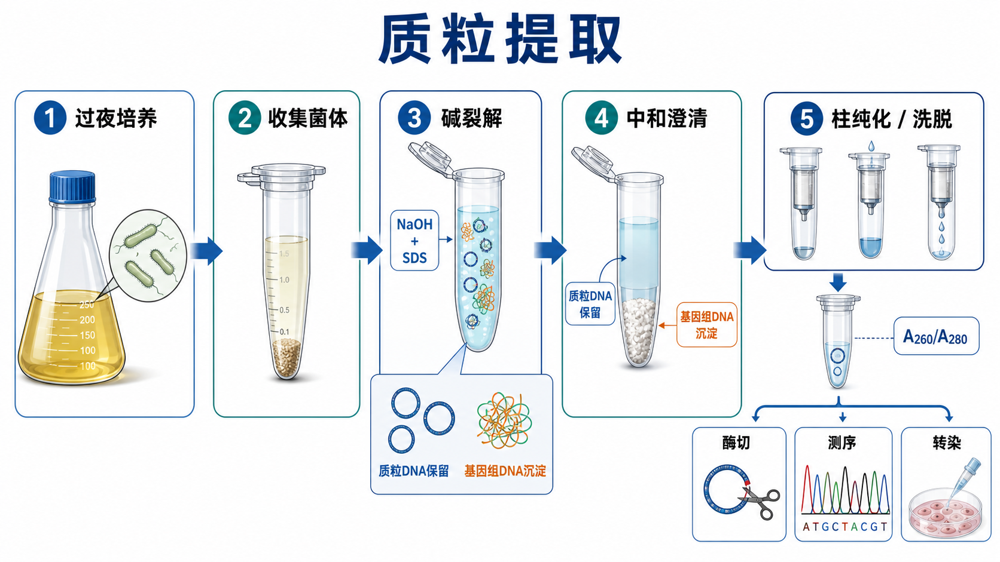

# 质粒提取

质粒提取（plasmid DNA extraction / plasmid miniprep，质粒 DNA 提取 / 小量质粒制备）是从携带质粒的细菌中分离[质粒DNA](<../材(实验耗材工具篇)/质粒DNA.md>)的实验流程，最常见版本是基于[碱裂解](<../番外/补充知识/碱裂解.md>)（alkaline lysis，碱性裂解）和[硅胶膜柱纯化](<../番外/补充知识/硅胶膜柱纯化.md>)的 spin-column miniprep。它通常接在[细菌转化](<细菌转化.md>)、[菌落PCR](<菌落PCR.md>)或液体扩增之后，用于获得可做[限制性内切酶酶切](<限制性内切酶酶切.md>)、[Sanger测序](<Sanger测序.md>)、[细胞转染](<细胞转染.md>)或后续克隆的质粒。



## 实验发明历史

现代质粒小提的核心来自 Birnboim 和 Doly 在 1979 年提出的 rapid alkaline extraction（快速碱性提取）思路：用碱和去污剂裂解细菌，使蛋白、染色体 DNA 和细胞碎片在中和后沉淀，而小的共价闭合环状质粒更容易复性并保留在上清中。参考：[Birnboim and Doly, Nucleic Acids Research, 1979](https://doi.org/10.1093/nar/7.6.1513)。

后来商业试剂盒把碱裂解和 silica membrane spin column（硅胶膜离心柱）结合起来，把传统沉淀、酚氯仿抽提和多次离心简化成“裂解-中和-上柱-洗涤-洗脱”。NEB、QIAGEN、Promega、Thermo Fisher 和 Zymo Research 的主流 miniprep 方案都围绕这个逻辑展开，只是在结合缓冲液、洗涤体系、内毒素控制、回收量和下游适配上有差别。参考：[NEB Monarch Plasmid Miniprep Kit](https://www.neb.com/en-us/products/t1010-monarch-plasmid-miniprep-kit)、[QIAGEN QIAprep Spin Miniprep Kit](https://www.qiagen.com/us/products/discovery-and-translational-research/dna-rna-purification/dna-purification/plasmid-dna/qiaprep-spin-miniprep-kit)、[Promega Wizard Plus SV Minipreps DNA Purification System](https://www.promega.com/products/nucleic-acid-extraction/plasmid-purification/wizard-plus-sv-minipreps-dna-purification-system/)。

## 应用场景

| 场景 | 对质粒质量的要求 | 推荐策略 |
|---|---|---|
| 菌落筛选后的确认 | 够做酶切和 Sanger 测序 | 普通 miniprep 即可 |
| 常规亚克隆 | 浓度稳定、盐和乙醇残留低 | 普通柱法 miniprep，必要时重复洗涤 |
| 哺乳动物细胞转染 | 低盐、低乙醇、低[内毒素](<../番外/补充知识/内毒素.md>) | 低内毒素或 endotoxin-free plasmid prep |
| 病毒包装 | 高纯度、低内毒素、足量 | 中量/大量或低内毒素试剂盒 |
| 测序模板 | A260/A280 合理，无明显盐污染 | 避免 RNA、盐、乙醇残留 |
| 低拷贝载体 | 产量本身偏低 | 增加培养体积，选低拷贝优化方案 |
| 长片段或 BAC 类质粒 | 易剪切、产量低 | 温和操作，避免剧烈混匀，使用专用方案 |

## 实验目的

质粒提取的目标不是“把所有核酸都拿出来”，而是尽量选择性获得可用于下游实验的质粒 DNA。它主要回答：

- 是否能从阳性克隆中获得足量质粒。
- 质粒是否适合酶切、PCR、测序、转染或进一步克隆。
- 样本中是否存在 RNA、基因组 DNA、蛋白、盐、乙醇、内毒素等污染。
- 对于不同用途，是否需要普通 miniprep、低内毒素制备或更大规模制备。

## 简要实验原理

### 碱裂解让质粒和基因组 DNA 走向不同命运

细菌沉淀先被 resuspension buffer（重悬缓冲液）充分分散，随后加入 [sodium hydroxide（NaOH，氢氧化钠）](<../材(实验耗材工具篇)/氢氧化钠.md>)和 [sodium dodecyl sulfate（SDS，十二烷基硫酸钠）](<../材(实验耗材工具篇)/SDS.md>)。NaOH 使 DNA 双链变性，SDS 溶解膜并变性蛋白。小而闭合的质粒 DNA 在后续中和时更容易正确复性，大片段[基因组DNA污染](<../番外/补充知识/基因组DNA污染.md>)则容易和蛋白、SDS 复合物一起沉淀。

关键不是“裂解越充分越好”，而是“刚好裂解”。裂解过短会导致产量低；裂解过长或混匀过猛会增加质粒不可逆变性、基因组 DNA 剪切进入上清和下游抑制物残留。QIAGEN 的质粒纯化资料也强调，碱裂解后要通过中和沉淀基因组 DNA、蛋白和细胞碎片，同时保留质粒 DNA。参考：[QIAGEN QIAprep Spin Miniprep Kit](https://www.qiagen.com/us/products/discovery-and-translational-research/dna-rna-purification/dna-purification/plasmid-dna/qiaprep-spin-miniprep-kit)。

### RNase A 降低 RNA 背景

[RNase A](<../材(实验耗材工具篇)/RNase A.md>)（ribonuclease A，核糖核酸酶 A）通常预先加入重悬缓冲液，用来降解细菌 RNA。没有 RNase A 或 RNase A 失活时，提取物中会出现大量 RNA，表现为 Nanodrop 浓度虚高、胶图底部拖尾或测序/酶切异常。

### 硅胶柱依赖盐和乙醇环境

柱法 miniprep 的核心是让 DNA 在合适的盐和醇条件下结合到硅胶膜，再通过 wash buffer（洗涤缓冲液）去除蛋白、盐、色素和其他杂质，最后用低盐 buffer 或无核酸酶水洗脱。这个逻辑和 PCR 产物纯化、凝胶回收有共同基础，只是上样样本来自碱裂解上清。

如果洗涤后没有充分 dry spin（空转干柱），残留乙醇会进入洗脱液，影响酶切、PCR、测序和细胞转染。如果洗脱液盐浓度过高，DNA 看似有浓度，但下游酶反应可能不稳定。

### 质粒构象影响胶图和下游表现

同一条质粒可以以 [supercoiled plasmid（超螺旋质粒）](<../番外/补充知识/超螺旋质粒.md>)、nicked open circular plasmid（缺口开放环状质粒）和 linear plasmid（线性质粒）等[DNA构象](<../番外/补充知识/DNA构象.md>)存在。普通 miniprep 通常富集多种构象混合物；强剪切、反复冻融、碱处理过度或核酸酶污染会增加 nicked 或降解形式。对测序影响不一定很大，但对转染和某些构建验证会有影响。

## 所需试剂、材料与设备

| 类别 | 常用内容 | 作用 |
|---|---|---|
| 菌液 | 含抗生素的过夜培养菌液 | 提供携带质粒的细胞 |
| 培养体系 | [LB培养基](<../材(实验耗材工具篇)/LB培养基.md>)、[筛选抗生素](<../材(实验耗材工具篇)/筛选抗生素.md>)或[抗性平板](<../材(实验耗材工具篇)/抗性平板.md>) | 维持质粒选择压力 |
| 提取体系 | [质粒提取试剂盒](<../材(实验耗材工具篇)/质粒提取试剂盒.md>)、重悬液、裂解液、中和液、洗涤液、洗脱液 | 裂解、澄清、结合、洗涤、洗脱 |
| 酶和缓冲成分 | RNase A、[EDTA](<../材(实验耗材工具篇)/EDTA.md>)、[Tris](<../材(实验耗材工具篇)/Tris.md>)、NaOH、SDS | 降解 RNA、稳定 pH、裂解细菌 |
| 耗材 | [离心管](<../材(实验耗材工具篇)/离心管.md>)、硅胶离心柱、收集管、滤芯吸头 | 离心分离和防污染移液 |
| 仪器 | [离心机](<../材(实验耗材工具篇)/离心机.md>)、[涡旋仪](<../材(实验耗材工具篇)/涡旋仪.md>)、移液枪 | 收菌、混匀、上柱 |
| 质控 | [微量紫外分光光度计](<../材(实验耗材工具篇)/微量紫外分光光度计.md>)、[Qubit荧光计](<../材(实验耗材工具篇)/Qubit荧光计.md>)、[琼脂糖凝胶电泳](<琼脂糖凝胶电泳.md>) | 浓度、纯度和构象检查 |
| 下游验证 | 酶切体系、PCR、Sanger 测序、细胞转染体系 | 判断质粒是否可用 |

## 实验操作

### 选择克隆并准备菌液

**怎么做：**从确认过的单克隆或甘油菌中接种到含对应抗生素的培养基，通常过夜培养。菌液应来自单克隆来源，并记录载体、菌株、抗生素、培养体积和培养时间。

**为什么重要：**质粒提取的起点决定了后面的一切。混合克隆会造成测序峰图混乱；抗生素错误会导致质粒丢失；培养过久会让细胞死亡、质粒质量下降或增加核酸降解。

**注意事项：**不要把“菌长得很浓”直接等同于“质粒产量很高”。[低拷贝质粒](<../番外/补充知识/低拷贝质粒.md>)（low-copy plasmid，低拷贝质粒）、大质粒、毒性插入片段或不稳定重复序列都可能产量偏低。

**替代方案：**普通[高拷贝质粒](<../番外/补充知识/高拷贝质粒.md>)适合常规 miniprep；低拷贝或大质粒可增加培养体积、换用低拷贝兼容试剂盒，或进入 midiprep/maxiprep。对转染用途，优先考虑低内毒素方案。

**出错后果：**菌液来源不纯会导致测序双峰；抗生素不匹配会无质粒或低产量；培养过度可能导致 DNA 降解或杂质升高。

### 收集菌体

**怎么做：**取适量菌液离心，弃上清，得到细菌沉淀。沉淀大小应与试剂盒推荐的处理能力匹配，不要把过量菌体塞进一个小柱体系。

**为什么重要：**柱法 miniprep 的结合容量和裂解液体积有限。菌体过少会低产，菌体过多会导致裂解不充分、柱子堵塞、盐和蛋白残留、DNA 纯度下降。

**注意事项：**弃上清时不要丢掉沉淀；如果沉淀松散，可以保留少量液体避免吸走菌体，但后续重悬必须充分。不要用超出 kit capacity 的菌量强行提高产量。

**替代方案：**低产量时，与其无限增加菌量，不如检查质粒拷贝数、抗生素、菌株和培养条件；必要时改用 midiprep。

**出错后果：**过量菌体常见表现是裂解液黏稠、柱子流速慢、A260/A230 差、酶切失败或测序背景高。

### 充分重悬菌体

**怎么做：**用含 RNase A 的重悬液完全打散菌体沉淀，直到没有可见颗粒。这个阶段可以使用涡旋，因为细胞还没有裂解，基因组 DNA 还未释放成高分子黏稠物。

**为什么重要：**重悬不充分会导致后续裂解不均匀：一部分细胞没裂开，另一部分细胞过度裂解。最终表现为产量低、杂质多、重复性差。

**注意事项：**确认 RNase A 已按说明加入并保存得当。很多试剂盒的重悬液在第一次使用前需要加入 RNase A；如果忘记加入，RNA 污染会非常明显。

**替代方案：**如果沉淀很紧，可以先轻弹管底、短暂涡旋或用枪头吹打，但避免产生大量泡沫。

**出错后果：**沉淀块未重悬会让裂解不完全，得到低产量；RNase A 缺失会导致浓度虚高和胶图 RNA smear。

### 加入裂解液进行碱裂解

**怎么做：**加入含 NaOH 和 SDS 的裂解液后，轻轻倒转混匀，使菌液变清亮或半透明。不要剧烈涡旋，裂解时间遵循试剂盒说明。

**为什么重要：**这一步释放质粒并变性细胞组分。轻柔混匀可以减少基因组 DNA 被机械剪切成小片段进入上清。过度裂解则可能损伤质粒或增加杂质。

**注意事项：**裂解液如果有 SDS 沉淀，应按说明恢复澄清后再用。加入裂解液后计时，不要因为处理多个样本而让前几个样本裂解过久。

**替代方案：**多样本时可以分批处理，保证每个样本裂解时间接近；对大质粒或 BAC，混匀应更温和。

**出错后果：**裂解不足导致低产量；涡旋或过度混匀导致基因组 DNA 污染；裂解过久可能降低质粒完整性。

### 中和并澄清裂解液

**怎么做：**加入 neutralization buffer（中和缓冲液）后立即轻柔倒转混匀，出现白色絮状沉淀，再高速离心，让沉淀和上清分开。上清含有目标质粒，沉淀中主要是蛋白、SDS、细胞碎片和大部分基因组 DNA。

**为什么重要：**中和决定“质粒留在上清，杂质进沉淀”的分离效果。混匀不足会局部 pH 不均，沉淀不完全；取上清时吸到白色沉淀会让柱子堵塞并增加污染。

**注意事项：**取上清时宁可少取一点，也不要吸入白色沉淀。若上清浑浊，可再次离心或转移到新管澄清后再上柱。

**替代方案：**部分试剂盒提供 lysate clearance column（裂解液澄清柱）或过滤步骤，适合菌体量较大或裂解液浑浊的样本。

**出错后果：**沉淀带入会导致柱堵、低 A260/A230、蛋白污染和下游酶反应受抑制。

### 上柱结合质粒 DNA

**怎么做：**将澄清上清加入硅胶柱，离心或真空抽滤，使质粒 DNA 在高盐环境下结合到膜上。

**为什么重要：**这一步把质粒 DNA 从复杂裂解液中转移到固相载体上，为后续洗涤创造条件。NEB、QIAGEN、Promega 和 Thermo Fisher 的柱法 miniprep 方案都依赖这一结合-洗涤-洗脱逻辑。参考：[Thermo Fisher GeneJET Plasmid Miniprep Kit](https://www.thermofisher.com/order/catalog/product/K0503)。

**注意事项：**不要让白色沉淀进入柱子；不要超过柱子容量；离心后确认液体完全通过膜。如果柱子流速异常慢，常提示样本太脏或菌体过量。

**替代方案：**如果不用柱法，可用传统异丙醇/乙醇沉淀得到粗质粒，但纯度和重复性通常不如柱法。Addgene 提供了通用 plasmid purification / miniprep 思路，可作为理解试剂盒外流程的参考。参考：[Addgene: Purify Plasmid DNA](https://www.addgene.org/protocols/purify-plasmid-dna/)。

**出错后果：**上柱液太脏会堵柱；结合条件不对会直接低产；样本混淆会造成后续测序结果对不上菌落编号。

### 洗涤和干柱

**怎么做：**按试剂盒加入洗涤液，离心去除盐、蛋白和其他杂质。最后进行 dry spin，让膜中残留乙醇尽量挥发。

**为什么重要：**很多“质粒浓度不低但酶切/PCR/测序失败”的问题不是 DNA 不够，而是洗涤液中的盐或乙醇残留。干柱是保护下游酶反应和细胞状态的小步骤，但影响很大。

**注意事项：**含乙醇的 wash buffer 常需要第一次使用前补加无水乙醇。补加后最好在瓶身记录日期。忘加乙醇会洗不干净；干柱不足会把乙醇带入洗脱液。

**替代方案：**如果后续是敏感酶切或转染，可增加一次洗涤或延长干柱时间；若担心膜过干影响洗脱，可以在干柱后直接进入洗脱，不要长时间开盖暴露。

**出错后果：**盐残留会导致 A260/A230 低和酶切失败；乙醇残留会抑制 PCR、酶切、测序和转染。

### 洗脱质粒

**怎么做：**用低盐[洗脱缓冲液](<../材(实验耗材工具篇)/洗脱缓冲液.md>)或[无核酸酶水](<../材(实验耗材工具篇)/无核酸酶水.md>)加到膜中央，静置片刻后离心收集质粒。需要更高浓度时，可减少洗脱体积；需要更高总量时，可二次洗脱。

**为什么重要：**洗脱条件决定最终浓度和回收率。水洗脱适合很多下游反应，但长期保存不如缓冲液稳定；TE 缓冲液更利于保存，但 EDTA 可能影响某些金属离子依赖酶反应。

**注意事项：**不要把洗脱液加到柱壁上。洗脱液 pH 过低会降低 DNA 从硅胶膜上的释放效率。若后续直接酶切，避免 EDTA 浓度过高。

**替代方案：**对低浓度样本，可用较小体积洗脱或把第一次洗脱液重新加回柱上再洗脱；对高总量需求，可二次洗脱合并。

**出错后果：**洗脱不充分会低产；洗脱体积太大导致浓度低；EDTA 或盐残留会影响下游酶反应。

### 质控和下游使用

**怎么做：**用微量紫外分光光度计或 Qubit 测浓度，必要时跑琼脂糖胶观察质粒构象和污染。记录 [A260/A280](<../番外/补充知识/A260-A280.md>)、[A260/A230](<../番外/补充知识/A260-A230.md>)、浓度、总量、胶图和下游用途。

**为什么重要：**Nanodrop 会把 RNA、游离核苷酸和部分污染也计入 A260，因此浓度可能虚高；Qubit 更偏向测 double-stranded DNA（dsDNA，双链 DNA），对真实 DNA 量更可靠。胶图能帮助判断 RNA smear、基因组 DNA 污染和质粒构象。

**注意事项：**Sanger 测序通常更怕盐、乙醇和混合模板；转染更怕内毒素、盐和低完整性；酶切更怕盐、乙醇、EDTA 和甲醇类残留。

**替代方案：**如果普通 miniprep 产物转染效果差，可换低内毒素试剂盒或重新制备；如果测序失败但酶切正常，优先检查测序引物、模板量和盐/乙醇残留。

**出错后果：**只看浓度容易误判质量。高浓度但 A260/A230 低的样本，常常比低浓度干净样本更难用。

## 结果解析

| 结果 | 可能说明什么 | 下一步 |
|---|---|---|
| 浓度和总量符合预期，A260/A280 接近常规范围 | 质粒大致可用 | 做酶切、PCR 或测序确认 |
| A260/A280 偏低 | 蛋白、酚样污染或测量背景异常 | 重新洗涤/纯化，必要时重提 |
| A260/A230 偏低 | 盐、胍盐、乙醇或有机物残留 | 增加洗涤、干柱或重新纯化 |
| Nanodrop 浓度高但胶上质粒弱 | RNA 或小分子导致 A260 虚高 | 检查 RNase A，考虑 Qubit 定量 |
| 胶上有高分子拖尾 | 基因组 DNA 污染 | 避免裂解后涡旋，取上清更小心 |
| 胶底部有 RNA smear | RNase A 缺失或失活 | 更换含 RNase A 的重悬液 |
| 质粒主要为 nicked/open circular | 质粒受损或保存/操作不当 | 重新提取，减少剧烈操作和冻融 |
| 酶切失败但浓度正常 | 盐、乙醇、EDTA 或甲基化/酶切条件问题 | 重新纯化或稀释模板再酶切 |
| 测序双峰 | 混合克隆、模板混杂或引物非特异 | 从单克隆重新培养提取 |
| 转染效率低或细胞状态差 | 内毒素、盐、乙醇、质粒构象或细胞状态问题 | 低内毒素制备，重新质控细胞和转染体系 |

## 常见异常与 troubleshooting

### 产量低

常见原因是菌体量不足、质粒拷贝数低、培养时间不合适、抗生素错误、重悬不充分或裂解不足。先确认菌株、载体拷贝数和抗性，再检查是否超出或低于试剂盒推荐菌量。低拷贝质粒不要用高拷贝质粒的产量预期来判断失败。

### RNA 污染严重

通常来自 RNase A 未加入、保存不当或反复污染失活。表现为 Nanodrop 浓度虚高、胶底部弥散条带、A260/A280 可能看起来并不差。解决方法是更换含 RNase A 的重悬液，或对样本重新 RNase 处理后再纯化。

### 基因组 DNA 污染

最常见原因是加入裂解液后涡旋、剧烈吹打、过度裂解或取上清时吸入絮状沉淀。解决方法是裂解后只轻柔倒转混匀，中和后充分离心，取上清时留下一点液体不要贪多。

### A260/A230 很低

这通常提示盐、胍盐、乙醇或其他小分子污染。解决方法包括确认 wash buffer 是否加乙醇、增加洗涤、延长 dry spin、避免柱底残液接触洗脱管，以及必要时重新上柱纯化。

### 下游酶切或测序失败

先不要只怪酶。检查模板量是否过高、盐/乙醇是否残留、EDTA 是否过量、测序引物是否正确、质粒是否为混合克隆。必要时把质粒稀释后做酶切，有时稀释能降低抑制物浓度。

### 转染效果差

如果同一细胞状态和转染体系下，普通 miniprep 质粒表现差，优先考虑内毒素、盐、乙醇、质粒构象和纯度。对哺乳动物细胞，尤其是敏感细胞、原代细胞、干细胞和病毒包装，低内毒素质粒通常更稳。

## 相关方法对比

| 方法 | 核心用途 | 优点 | 局限 |
|---|---|---|---|
| 普通 miniprep | 筛选后测序、酶切、常规克隆 | 快、便宜、通量高 | 不一定适合敏感转染 |
| [低内毒素/无内毒素质粒制备](<../番外/补充知识/无内毒素质粒.md>) | 转染、病毒包装、敏感细胞 | 对细胞更友好 | 成本更高，流程更长 |
| Midiprep / maxiprep | 获得更大量质粒 | 总量高，适合制备性用途 | 更耗时，需要更多培养和试剂 |
| 传统碱裂解沉淀法 | 低成本粗提 | 不依赖商业柱 | 纯度和重复性较差 |
| PCR 产物纯化 | 清理 PCR 片段 | 适合线性 DNA 片段 | 不是质粒制备方法 |
| 凝胶回收 | 回收特定 DNA 条带 | 能按大小选择片段 | 紫外/染料/低回收率可能影响 DNA |

## 购买与选择建议

如果用途是菌落筛选后的酶切和 Sanger 测序，普通 spin-column miniprep kit 通常足够。选择时重点看：

- 单次处理菌液体积和柱容量。
- 质粒大小和拷贝数兼容性。
- 是否提供 RNase A、洗涤液和清晰的 buffer 颜色提示。
- 是否支持低拷贝、大质粒或 endotoxin-free 用途。
- 洗脱体积范围、预期产量和批间稳定性。
- 记录是否便于追踪：品牌、货号、批号、开封日期、RNase A 加入日期、wash buffer 是否加乙醇。

常见可选品牌包括 [QIAGEN](<../番外/试剂厂商/Qiagen.md>)、[NEB](<../番外/试剂厂商/NEB.md>)、[Promega](<../番外/试剂厂商/Promega.md>)、[Thermo Fisher Scientific](<../番外/试剂厂商/Thermo Fisher Scientific.md>)、[Zymo Research](<../番外/试剂厂商/Zymo Research.md>)、[Takara](<../番外/试剂厂商/Takara.md>) 和 [碧云天](<../番外/试剂厂商/碧云天.md>)。如果只是日常筛选，优先买稳定、便宜、通量友好的普通试剂盒；如果质粒要进细胞，尤其是敏感细胞，优先考虑低内毒素或 transfection-grade 产品。

商业产品记录示例：

```text
Plasmid Miniprep Kit, spin-column format, RNase A added to resuspension buffer on YYYY-MM-DD, Brand, Cat. No. xxxxx, Lot No. xxxxx, stored at room temperature / 4°C as instructed.
```

## 推荐记录模板

### 中文记录模板

| 项目 | 记录内容 |
|---|---|
| 构建名称 | 载体、insert、克隆编号 |
| 菌株与来源 | 菌株、单克隆/甘油菌、转化日期 |
| 培养条件 | 培养基、抗生素、体积、温度、时间 |
| 提取试剂盒 | 品牌、货号、批号、开封日期 |
| 关键试剂状态 | RNase A 是否加入，wash buffer 是否加乙醇 |
| 菌体量 | 菌液体积、OD 或沉淀大小 |
| 洗脱条件 | 洗脱液类型、体积、是否二次洗脱 |
| 质控结果 | 浓度、总量、A260/A280、A260/A230、胶图 |
| 下游用途 | 酶切、PCR、测序、转染、病毒包装 |
| 异常记录 | 低产、柱堵、RNA 污染、测序失败等 |

### English Record Template

| Item | Record |
|---|---|
| Construct name | Vector, insert, clone ID |
| Strain and source | Bacterial strain, single colony or glycerol stock, transformation date |
| Culture condition | Medium, antibiotic, volume, temperature, culture time |
| Miniprep kit | Brand, catalog number, lot number, open date |
| Key reagent status | RNase A added, ethanol added to wash buffer |
| Cell input | Culture volume, OD, pellet size |
| Elution condition | Elution buffer, volume, second elution yes/no |
| QC result | Concentration, total yield, A260/A280, A260/A230, gel image |
| Downstream use | Restriction digest, PCR, sequencing, transfection, virus packaging |
| Abnormal notes | Low yield, clogged column, RNA contamination, sequencing failure |

## 参考来源

- [Birnboim and Doly: A rapid alkaline extraction procedure for screening recombinant plasmid DNA](https://doi.org/10.1093/nar/7.6.1513)
- [QIAGEN: QIAprep Spin Miniprep Kit](https://www.qiagen.com/us/products/discovery-and-translational-research/dna-rna-purification/dna-purification/plasmid-dna/qiaprep-spin-miniprep-kit)
- [NEB: Monarch Plasmid Miniprep Kit](https://www.neb.com/en-us/products/t1010-monarch-plasmid-miniprep-kit)
- [Promega: Wizard Plus SV Minipreps DNA Purification System](https://www.promega.com/products/nucleic-acid-extraction/plasmid-purification/wizard-plus-sv-minipreps-dna-purification-system/)
- [Thermo Fisher Scientific: GeneJET Plasmid Miniprep Kit](https://www.thermofisher.com/order/catalog/product/K0503)
- [Zymo Research: ZymoPURE Plasmid Miniprep Kit](https://www.zymoresearch.com/products/zymopure-plasmid-miniprep-kit)
- [Addgene: Purify Plasmid DNA](https://www.addgene.org/protocols/purify-plasmid-dna/)
