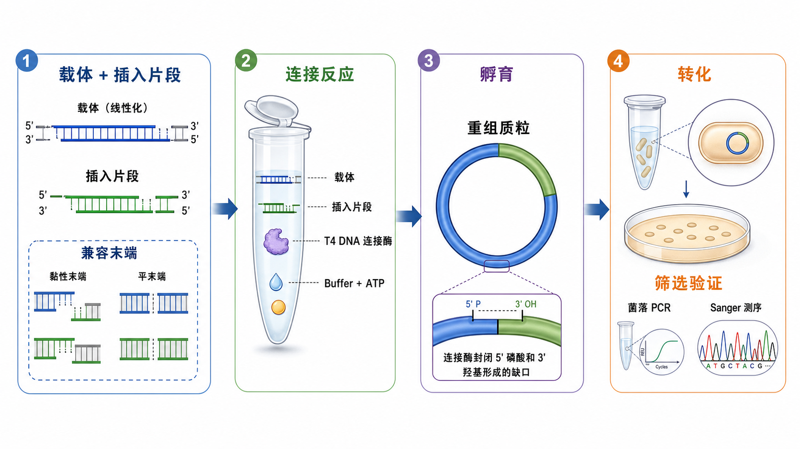

# 连接反应

连接反应（DNA ligation，DNA 连接反应）是在分子克隆中用 DNA 连接酶把载体和插入片段连接成重组 DNA 的步骤。最常见的是用[T4 DNA连接酶](<../材(实验耗材工具篇)/T4 DNA连接酶.md>)（T4 DNA ligase，T4 DNA 连接酶）连接经过[限制性内切酶酶切](<限制性内切酶酶切.md>)、[PCR产物纯化](<PCR产物纯化.md>)或[凝胶回收](<凝胶回收.md>)得到的 DNA 片段，然后进入[细菌转化](<细菌转化.md>)、[菌落PCR](<菌落PCR.md>)和[Sanger测序](<Sanger测序.md>)验证。



## 实验发明历史

DNA ligase（DNA 连接酶）是在研究 DNA 复制、修复和重组时被认识到的关键酶类。它能把 DNA 链上的 nick（缺口）封闭起来，本质上是在相邻核苷酸之间形成 phosphodiester bond（磷酸二酯键）。T4 bacteriophage（T4 噬菌体）来源的 T4 DNA ligase 因为活性强、既能连接黏性末端也能连接平末端，成为传统重组 DNA 和质粒克隆中最常用的连接酶之一。

在传统 restriction cloning（限制性酶切克隆）里，连接反应是“载体线性化”和“细菌转化”之间的桥。前一步决定末端是否兼容，后一步决定重组质粒能不能被细胞扩增，而连接反应本身决定这些片段有没有真正变成可以复制的闭环质粒。

## 应用场景

| 场景 | 连接反应的目的 | 关键变量 |
|---|---|---|
| 限制性酶切克隆 | 把酶切后的载体和插入片段接成重组质粒 | 末端兼容、摩尔比、载体自连 |
| 质粒线性化后自连 | 重新环化线性化载体或构建突变质粒 | 末端是否磷酸化、片段浓度 |
| 平末端克隆 | 连接无突出端 DNA 片段 | 连接效率低，需要更高 DNA 浓度或更长时间 |
| 接头连接 | 给 DNA 片段加 adapter/linker | 接头过量、接头二聚体 |
| 文库构建中的连接步骤 | 将测序接头连接到片段 DNA | 片段质量、接头浓度、纯化去除短副产物 |
| 连接结果验证 | 通过转化和筛选判断连接是否成功 | 阴性对照、空载体背景、测序确认 |

## 实验目的

连接反应的核心目标是让载体 DNA 和目标插入片段形成能够稳定复制或后续扩增的 DNA 分子。对质粒克隆来说，最理想的结果是：载体闭环、插入片段方向和序列正确、背景空载体少、转化后阳性克隆比例高。

更具体地说，它解决三个问题：

- 把相邻的 5' phosphate（5' 磷酸）和 3' hydroxyl（3' 羟基）封闭成共价连接。
- 把只靠碱基互补暂时配对的末端变成稳定 DNA 分子。
- 为后续转化、筛选和测序提供可扩增的重组质粒。

## 简要实验原理

### T4 DNA 连接酶连接的是 5' 磷酸和 3' 羟基

T4 DNA ligase 需要 DNA 末端具备正确的化学状态：一个末端提供 5' phosphate（5' 磷酸），另一个末端提供 3' hydroxyl（3' 羟基）。如果 DNA 末端缺少 5' 磷酸，即使两个片段碱基互补，也不能被有效封闭。NEB 对 T4 DNA ligase 的说明也强调它可催化双链 DNA 或 RNA 中相邻 5' 磷酸和 3' 羟基之间形成磷酸二酯键。参考：[NEB T4 DNA Ligase](https://www.neb.com/en-us/products/m0202-t4-dna-ligase)。

这就是为什么 PCR 产物、合成寡核苷酸、去磷酸化载体或不同来源 DNA 片段进入连接前，必须确认[DNA末端磷酸化](<../番外/补充知识/DNA末端磷酸化.md>)状态。

### 连接反应需要 ATP 和合适 buffer

常见连接体系包含 DNA、T4 DNA ligase、[T4 DNA连接酶缓冲液](<../材(实验耗材工具篇)/T4 DNA连接酶缓冲液.md>)和[ATP](<../番外/补充知识/ATP.md>)（adenosine triphosphate，三磷酸腺苷）。ATP 是 T4 DNA ligase 反应所需能量来源之一，因此连接 buffer 反复冻融或长期保存后，常见问题不是 pH 变了，而是 ATP 降解导致连接效率下降。

Thermo Fisher 的 T4 DNA ligase protocol 也把 DNA、10X ligation buffer、T4 DNA ligase 和水作为基础体系，并区分 sticky-end ligation（黏性末端连接）和平末端连接的反应条件。参考：[Thermo Fisher T4 DNA Ligase Protocol](https://www.thermofisher.com/us/en/home/references/protocols/cloning/dna-ligation/t4-dna-ligase-protocol.html)。

### 黏性末端连接通常比平末端连接更容易

[黏性末端](<../番外/补充知识/黏性末端.md>)（sticky end / cohesive end，黏性末端）可以先通过互补碱基配对把载体和插入片段“对齐”，连接酶再封闭缺口，所以效率通常较高，也更适合方向性克隆。[平末端](<../番外/补充知识/平末端.md>)（blunt end，平末端）没有突出端辅助配对，两个 DNA 末端相遇和正确取向的概率更低，因此常需要更高 DNA 浓度、更高插入片段比例、更长孵育或专门优化的快速连接体系。

### 插入片段与载体摩尔比比质量比更重要

连接反应讨论的不是“加多少 ng 插入片段看起来差不多”，而是[插入片段与载体摩尔比](<../番外/补充知识/插入片段与载体摩尔比.md>)（insert-to-vector molar ratio）。因为同样 50 ng DNA，1 kb 片段的分子数远多于 5 kb 质粒。Addgene 的 restriction cloning protocol 通常建议从约 3:1 的插入片段:载体摩尔比开始优化。参考：[Addgene DNA Ligation](https://www.addgene.org/protocols/dna-ligation/)。

常用估算公式：

```text
插入片段质量 ng = 载体质量 ng × 插入片段长度 bp / 载体长度 bp × 目标摩尔比
```

例如 50 ng、5000 bp 载体，插入 1000 bp 片段，若希望 insert:vector = 3:1，则插入片段约为：

```text
50 × 1000 / 5000 × 3 = 30 ng
```

### 载体自连是连接反应最常见背景

[载体自连](<../番外/补充知识/载体自连.md>)（vector self-ligation）是线性化载体不接插入片段而自己闭环。它会在转化后形成抗性菌落，但测序或菌落 PCR 发现没有插入片段。降低自连的常见策略包括双酶切产生不兼容末端、凝胶回收去除未切载体、用[碱性磷酸酶](<../材(实验耗材工具篇)/碱性磷酸酶.md>)去磷酸化载体、设置空载体对照并优化 insert:vector 摩尔比。

## 所需试剂、材料与设备

| 类别 | 常用内容 | 作用 |
|---|---|---|
| DNA 片段 | 线性化载体、插入片段 | 连接反应的底物 |
| 酶 | T4 DNA 连接酶 | 封闭 DNA 缺口，形成磷酸二酯键 |
| Buffer | T4 DNA 连接酶缓冲液 | 提供 Mg2+、DTT、ATP 和适合 pH |
| 水 | [无核酸酶水](<../材(实验耗材工具篇)/无核酸酶水.md>) | 补足反应体积 |
| 耗材 | [PCR管](<../材(实验耗材工具篇)/PCR管.md>)或低吸附离心管 | 小体积反应容器 |
| 温控 | [PCR仪](<../材(实验耗材工具篇)/PCR仪.md>)、冰盒、金属浴或水浴 | 控制连接温度和时间 |
| 下游验证 | [感受态细胞](<../材(实验耗材工具篇)/感受态细胞.md>)、[抗性平板](<../材(实验耗材工具篇)/抗性平板.md>)、菌落 PCR 体系、测序引物 | 判断连接产物是否正确 |

## 实验操作

### 设计连接策略

**怎么做：**先明确连接目标：是方向性克隆、非方向性克隆、载体自连、接头连接，还是文库构建中的 adapter ligation。根据目标确认载体和插入片段末端是否兼容，是否都带 5' 磷酸，是否需要去磷酸化载体，是否需要凝胶回收。

**为什么重要：**连接反应本身只是最后一步化学封口，真正决定阳性率的是前面的设计。双酶切产生两个不同末端时，插入方向更容易控制；单酶切或平末端连接时，背景和方向错误更常见。

**注意事项：**不要只看酶名，要看切割后末端是否兼容。两个不同限制性内切酶可能产生相同或兼容的 overhang（突出端），也可能产生不能连接的末端。PCR 产物若由普通高保真聚合酶扩增，末端常为平末端；若依赖 A-overhang，则需要确认聚合酶是否会加 A。

**替代方案：**如果可用限制性位点少、插入片段方向难控制或片段较多，可以考虑[Gibson组装](<Gibson组装.md>)等同源重组式组装方法，而不是硬套限制性酶切连接。

**出错后果：**设计错误会导致转化后没有菌落、有大量空载体，或测序发现插入方向错误。

### 准备载体和插入片段

**怎么做：**载体通常来自酶切线性化；插入片段可来自 PCR、质粒酶切或合成片段。连接前应去除限制性内切酶、盐、胍盐、乙醇、短引物和非目标条带。需要高纯度片段时，优先使用凝胶回收；只需要去除酶和 buffer 时，可用 PCR 纯化或柱纯化。

**为什么重要：**连接酶对 DNA 末端和体系环境敏感。酶切不完全、未切载体残留、盐和乙醇残留都会把连接失败伪装成“连接酶不好”。

**注意事项：**凝胶回收 DNA 不要长时间暴露在 UV 下；洗涤液残留乙醇会抑制连接；洗脱体积过大可能让 DNA 浓度太低，不利于连接。

**替代方案：**如果目标片段和背景片段大小差别明显，切胶回收最干净；如果只有单一 PCR 条带，柱纯化更快、损失更少。若载体自连背景很高，可在线性化后进行去磷酸化。

**出错后果：**未切载体残留会产生大量假阳性；DNA 浓度太低会几乎无菌落；末端被损伤或缺少 5' 磷酸会连接效率极低。

### 计算插入片段与载体比例

**怎么做：**先确定载体 DNA 质量，再按片段长度和目标摩尔比计算插入片段质量。常见起点是 insert:vector = 3:1；黏性末端可从 1:1、3:1、5:1 试起；平末端连接通常需要更高比例或更高 DNA 总浓度。

**为什么重要：**载体太多会增加自连背景；插入片段太多可能形成插入片段多聚体或抑制有效环化。真正应该平衡的是分子数，而不是质量。

**注意事项：**不要让总体 DNA 浓度过低。低浓度有利于分子内环化，高浓度有利于分子间连接，但过高会带来多聚体和背景；不同目标需要平衡。

**替代方案：**如果第一次失败，可以设置 1:1、3:1、5:1 三个比例并行；如果背景很高，加一个载体-only 对照判断自连水平。

**出错后果：**比例不当会出现“有菌落但全是空载体”或“完全没有菌落”。

### 配制连接反应

**怎么做：**在冰上配制连接体系。通常先加入水、10X ligation buffer、载体和插入片段，最后加入 T4 DNA ligase。轻轻混匀，短暂离心收液。具体体系以厂家说明为准；常规小体系可用 10-20 µL。

一个常见反应设计逻辑如下：

| 组分 | 设置逻辑 |
|---|---|
| 线性化载体 | 常见 20-100 ng 起步，根据载体大小调整 |
| 插入片段 | 按 insert:vector 摩尔比计算 |
| 10X T4 DNA ligase buffer | 终浓度 1X，避免 ATP 降解 |
| T4 DNA ligase | 按厂家推荐加入，平末端或低浓度 DNA 可适当优化 |
| 无核酸酶水 | 补足总体积 |

**为什么重要：**连接 buffer 中的 ATP 很关键，反复冻融或长期放室温会让连接体系失效。连接酶最后加入可以减少它在不完整反应体系中的暴露时间。

**注意事项：**不要 vortex 连接酶；连接 buffer 解冻后要充分混匀，因为 ATP 或盐可能局部浓度不均；若 buffer 出现明显沉淀，可按厂家建议温和溶解后使用。

**替代方案：**很多厂家提供 rapid ligation（快速连接）体系，适合黏性末端和常规克隆验证；但平末端、低浓度片段、大质粒或复杂片段仍可能需要更长孵育。

**出错后果：**漏加 buffer 或使用失效 buffer 会导致几乎没有菌落；DNA 太多可能增加多聚体；酶加错或漏加会导致转化后背景依赖未切载体。

### 孵育连接反应

**怎么做：**黏性末端连接常可在室温短时间或 16°C 较长时间完成；平末端连接一般更依赖较长孵育、较高 DNA 浓度或优化体系。NEB 和 Addgene 的连接建议都把反应温度、时间、末端类型和片段比例作为需要按实验目标优化的变量。参考：[NEB DNA Ligation Tips](https://www.neb.com/en-us/tools-and-resources/usage-guidelines/dna-ligation-tips)；[Addgene DNA Ligation](https://www.addgene.org/protocols/dna-ligation/)。

**为什么重要：**低温有利于末端退火和稳定配对，但酶反应速度较慢；较高温度酶活更快，但短突出端配对不稳定。16°C 常被用作折中条件，尤其适合常规过夜连接。

**注意事项：**连接不是越久越好。长时间孵育可能增加非目标连接、多聚体或背景，尤其在 DNA 过量时。快速连接适合常规粘性末端，不一定适合难连接片段。

**替代方案：**如果后续急着转化，可尝试快速连接；如果片段较大、平末端或之前失败，优先选择较长孵育并优化比例。也可设置不同温度和时间的小矩阵。

**出错后果：**孵育太短可能无阳性；条件过强或比例不当可能产生插入片段多聚体、错误构型或低转化效率。

### 转化和筛选验证

**怎么做：**连接产物通常直接用于转化感受态细胞。转化后涂布到对应抗性平板，挑取单克隆进行菌落 PCR、限制性酶切鉴定或 Sanger 测序。

**为什么重要：**连接产物本身很难直接判断是否正确；真正可读的结果来自菌落数量、对照结果、菌落 PCR 条带和测序。

**注意事项：**连接液加入感受态细胞的体积不宜过大，盐和 ligation buffer 过多可能降低转化效率。必须设置对照：未切载体阳性转化对照、线性化载体-only 连接对照、无 DNA 阴性对照，至少能区分“连接失败”和“转化失败”。

**替代方案：**如果菌落少但对照正常，可增加转化用连接产物量或提高感受态细胞效率；如果空载体多，回到酶切和去磷酸化步骤；如果菌落 PCR 阳性但测序错误，检查插入方向、突变和重组热点。

**出错后果：**没有对照时，无法判断失败发生在连接、转化、抗生素平板还是质粒设计环节。

## 结果解析

| 观察结果 | 可能说明什么 | 优先检查 |
|---|---|---|
| 阳性对照有菌落，连接组无菌落 | 连接失败、末端不兼容、DNA 太少、buffer 失效 | DNA 末端、ATP buffer、摩尔比、连接温度 |
| 所有组都无菌落 | 转化失败、感受态细胞失效、抗性或平板错误 | 感受态、抗生素、热激/电转条件 |
| 载体-only 对照很多菌落 | 载体自连或未切载体污染 | 双酶切、凝胶回收、去磷酸化 |
| 连接组菌落多但 PCR 阴性 | 空载体背景高、插入片段未连接 | 载体处理、insert:vector 比例、筛选引物 |
| 菌落 PCR 条带正确但测序错误 | 插入方向、突变、重复序列重组或 PCR 错误 | 测序引物、读长、克隆数 |
| 平末端连接效率很低 | 平末端缺少互补配对辅助 | 提高 DNA 浓度、延长孵育、换快速/高效体系 |

## 常见异常与 troubleshooting

### 无菌落

先看阳性转化对照。如果阳性对照也没有菌落，问题多半在感受态细胞、转化条件、抗性平板或复苏培养。如果阳性对照正常而连接组没有菌落，再检查末端兼容性、5' 磷酸、连接 buffer ATP、DNA 浓度和 insert:vector 摩尔比。

### 大量空载体

大量空载体说明载体自己闭环或未切载体污染。优先做双酶切、延长或优化酶切、凝胶回收线性化载体，必要时用碱性磷酸酶去磷酸化载体。设置[空载体对照](<../番外/补充知识/空载体对照.md>)能快速判断背景来源。

### 菌落很多但阳性率低

这通常不是“转化太好”，而是背景太高或筛选设计不够区分。可降低载体量、提高插入片段比例、确认插入片段末端、使用方向性双酶切，或在筛选时使用跨 junction 的引物。

### 测序发现插入方向错误

如果单酶切或两个末端兼容，插入片段可能双向插入。应改用两个不同且不兼容的末端进行方向性克隆，或在菌落 PCR/测序阶段设计能区分方向的引物。

### 连接后转化效率低

连接 buffer、盐、PEG 或酶过多都可能影响转化。可减少加入感受态细胞的连接液体积，进行连接产物纯化，或用更高效率的感受态细胞。

## 相关方法对比

| 方法 | 核心逻辑 | 适合场景 | 局限 |
|---|---|---|---|
| 黏性末端连接 | 互补突出端先配对，再由连接酶封口 | 常规方向性克隆、低背景克隆 | 依赖合适限制性位点 |
| 平末端连接 | 无突出端，靠末端碰撞后连接 | 无合适突出端、某些 PCR 产物 | 效率低、方向不可控 |
| 单酶切连接 | 载体和插入片段使用一个兼容末端类型 | 简单构建或重新环化 | 自连和方向错误风险高 |
| 双酶切连接 | 两端不同，方向性更强 | 传统 restriction cloning 首选 | 需要两种位点和双酶切兼容 |
| 快速连接 | 优化 buffer 和酶体系缩短反应时间 | 常规黏性末端克隆筛选 | 困难片段不一定可靠 |
| Gibson 组装 | 通过同源重叠区组装片段 | 多片段、无酶切位点限制 | 设计和片段质量要求高 |

## 购买与选择建议

常规克隆优先选择资料完整、应用广泛、buffer 体系清晰的 T4 DNA ligase。常用厂家包括 [NEB](<../番外/试剂厂商/NEB.md>)、[Thermo Fisher Scientific](<../番外/试剂厂商/Thermo Fisher Scientific.md>)、[Takara](<../番外/试剂厂商/Takara.md>) 和 [Promega](<../番外/试剂厂商/Promega.md>)。

选择时重点看：

- 是否区分常规连接、快速连接和平末端连接。
- buffer 是否含 ATP，保存和冻融要求是否明确。
- 是否适合 sticky-end、blunt-end、adapter ligation 或文库构建。
- 是否有配套阳性对照或高效转化建议。
- 是否与本实验室常用感受态细胞、抗性系统和克隆流程兼容。

## 推荐记录模板

### 中文记录模板

| 项目 | 记录内容 |
|---|---|
| 构建名称 | 载体名称、插入片段名称 |
| 连接目的 | 方向性克隆、平末端克隆、载体自连、接头连接 |
| 载体信息 | 长度、质量、浓度、末端类型、是否去磷酸化 |
| 插入片段信息 | 长度、质量、浓度、末端类型 |
| 摩尔比 | insert:vector 比例和计算方式 |
| 连接体系 | 总体积、buffer、酶量、DNA 量 |
| 孵育条件 | 温度、时间、是否快速连接 |
| 对照 | 载体-only、未切载体、无 DNA、阳性转化 |
| 转化条件 | 感受态细胞批号、转化方式、抗性平板 |
| 筛选结果 | 菌落数、菌落 PCR、测序结果 |

### English Record Template

| Item | Record |
|---|---|
| Construct name | Vector name and insert name |
| Ligation purpose | Directional cloning, blunt-end cloning, recircularization, adapter ligation |
| Vector information | Length, amount, concentration, end type, dephosphorylation status |
| Insert information | Length, amount, concentration, end type |
| Molar ratio | Insert-to-vector ratio and calculation |
| Reaction setup | Total volume, buffer, ligase amount, DNA input |
| Incubation | Temperature, time, rapid or conventional ligation |
| Controls | Vector-only, uncut vector, no-DNA, positive transformation control |
| Transformation | Competent cell lot, transformation method, selection plate |
| Screening result | Colony number, colony PCR, sequencing result |

## 参考来源

- [NEB: T4 DNA Ligase](https://www.neb.com/en-us/products/m0202-t4-dna-ligase)
- [NEB: DNA Ligation Tips](https://www.neb.com/en-us/tools-and-resources/usage-guidelines/dna-ligation-tips)
- [Addgene: DNA Ligation](https://www.addgene.org/protocols/dna-ligation/)
- [Thermo Fisher Scientific: T4 DNA Ligase Protocol](https://www.thermofisher.com/us/en/home/references/protocols/cloning/dna-ligation/t4-dna-ligase-protocol.html)
- [Promega: DNA Ligation Protocols](https://www.promega.com/resources/protocols/technical-manuals/0/dna-ligation-protocol/)
