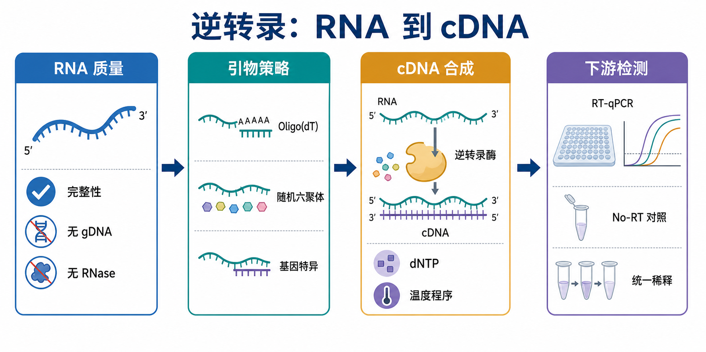

# 逆转录

Reverse transcription（逆转录）是用 reverse transcriptase（逆转录酶）把 RNA 转换成 cDNA（complementary DNA，互补 DNA）的实验步骤。它是 [RT-qPCR](<RT-qPCR.md>)、转录本克隆、部分 RNA 测序文库构建和 RNA 病毒检测的关键前处理。



一句话理解：RNA 本身不适合直接作为常规 PCR 模板，逆转录相当于先把“容易降解的 RNA 信息”转换成更稳定、可扩增的 cDNA。后续 qPCR 看到的信号，本质上取决于 RNA 质量、逆转录效率、引物策略和 PCR 扩增效率共同作用。

## 实验发明历史

Reverse transcriptase（逆转录酶）是在研究 RNA tumor virus（RNA 肿瘤病毒）复制机制时被发现的关键酶。Howard Temin、David Baltimore 和 Renato Dulbecco 因肿瘤病毒与细胞遗传物质相互作用相关发现获得 1975 年诺贝尔生理学或医学奖，逆转录酶的发现也改变了“遗传信息只能 DNA 到 RNA”的简单理解。参考：[Nobel Prize in Physiology or Medicine 1975](https://www.nobelprize.org/prizes/medicine/1975/summary/)

在分子生物学实验里，逆转录逐渐从病毒机制研究工具变成常规 RNA 分析步骤。现在最常见的应用是先把 mRNA（messenger RNA，信使 RNA）转换成 cDNA，再进行 [qPCR](qPCR.md)（quantitative polymerase chain reaction，定量聚合酶链式反应）检测。MIQE（Minimum Information for Publication of Quantitative Real-Time PCR Experiments，定量实时 PCR 实验发表最低信息标准）指南也把 reverse transcription（逆转录）作为 RT-qPCR 实验报告中必须记录的重要变量之一。参考：[MIQE guidelines, 2009](https://academic.oup.com/clinchem/article/55/4/611/5631762)；[MIQE 2.0, 2025](https://academic.oup.com/clinchem/article/71/6/634/8119148)

## 应用场景

| 场景 | 逆转录回答的问题 | 关键注意事项 |
| --- | --- | --- |
| RT-qPCR 基因表达分析 | RNA 表达量能否转换成可定量的 cDNA | RNA 投入量、引物策略和 No-RT 对照要一致 |
| RNA-seq 文库构建 | RNA 能否转换成测序用 cDNA 文库中间体 | 文库构建通常使用专用体系，不直接套普通 RT-qPCR 逆转录 |
| 转录本克隆 | 能否获得目标 RNA 对应的 cDNA 片段 | 更关注全长覆盖、模板结构和高保真扩增 |
| RNA 病毒检测 | 病毒 RNA 能否被转换并扩增检测 | 临床检测必须使用验证过的试剂盒和质控体系 |
| miRNA 定量 | 短 RNA 能否被特异转换成可扩增模板 | 常需 stem-loop primer 或 poly(A) tailing 专用体系 |
| 低丰度转录本检测 | 少量 RNA 信号能否可靠保留 | 更依赖 RNA 质量、RNase 控制和反应重复性 |

逆转录不是“按下按钮就把所有 RNA 等比例变成 cDNA”。不同 RNA 长度、二级结构、poly(A) tail（多聚腺苷酸尾）、引物策略、酶性质和样本抑制物都会造成偏倚。

## 实验目的

常规逆转录实验的目标是从 RNA 样本中生成可用于下游检测的 cDNA。具体可以拆成几层：

| 目的 | 实验意义 |
| --- | --- |
| 保存 RNA 信息 | 把易降解 RNA 转换成相对稳定的 cDNA |
| 支持 PCR/qPCR 扩增 | 让 RNA 表达信息进入 DNA 扩增体系 |
| 降低样本间技术差异 | 使用相同 RNA 投入量和反应体系，使结果可比 |
| 识别 DNA 污染 | 通过 No-RT control（无逆转录酶对照）判断 gDNA 残留 |
| 为多基因检测准备模板 | two-step RT-qPCR（两步法 RT-qPCR）中，一份 cDNA 可用于多个 qPCR assay |

逆转录产物不是直接等于“真实 RNA 丰度”。它更准确地说是“在当前反应条件下被转换出来的 cDNA 表征”。因此记录反应条件和设置对照非常重要。

## 简要实验原理

逆转录反应的核心是 reverse transcriptase（[逆转录酶](<../材(实验耗材工具篇)/逆转录酶.md>)）沿着 RNA 模板合成 DNA 链。一个常规反应需要 RNA template（RNA 模板）、primer（引物）、[dNTP](<../材(实验耗材工具篇)/dNTP.md>)（deoxynucleoside triphosphate，脱氧核苷三磷酸）、buffer、Mg2+、RNase inhibitor（[RNase抑制剂](<../材(实验耗材工具篇)/RNase抑制剂.md>)）和逆转录酶。

### 引物决定“从哪里开始抄写”

| 引物策略 | 英文全称与中文名 | 适合目标 | 优点 | 局限 |
| --- | --- | --- | --- | --- |
| Oligo(dT) primer | [Oligo(dT)引物](<../材(实验耗材工具篇)/Oligo(dT)引物.md>)，寡聚 dT 引物 | 带 poly(A) tail 的 mRNA | 偏向成熟 mRNA，减少 rRNA 背景 | 对降解 RNA、无 poly(A) RNA、5' 端区域不友好 |
| Random hexamer primer | [随机六聚体引物](<../材(实验耗材工具篇)/随机六聚体引物.md>)，随机六聚体引物 | total RNA、部分降解 RNA、非 poly(A) RNA | 覆盖更广，适合多靶点 | 会逆转录 rRNA 等背景 RNA |
| Gene-specific primer | [基因特异性引物](<../材(实验耗材工具篇)/基因特异性引物.md>) | 单个或少数目标 RNA | 特异性强，适合低丰度目标 | 不适合一份 cDNA 后续检测很多基因 |
| Mixed primers | 混合引物策略 | 常规 RT-qPCR | 兼顾覆盖和 mRNA 偏向 | 需要依赖试剂盒优化 |

Thermo Fisher、Bio-Rad 和 Takara 等常见 cDNA synthesis kit（cDNA 合成试剂盒）会把不同引物策略、buffer 和酶体系预先优化。使用商业 [逆转录试剂盒](<../材(实验耗材工具篇)/逆转录试剂盒.md>) 时，优先按说明书执行，不要随意把不同品牌的引物、buffer 和酶混用。参考：[Thermo Fisher High-Capacity cDNA Reverse Transcription Kit](https://www.thermofisher.com/order/catalog/product/4368814)；[Bio-Rad iScript cDNA Synthesis Kit](https://www.bio-rad.com/en-us/sku/1708891-iscript-cdna-synthesis-kit)；[Takara PrimeScript RT reagent Kit](https://www.takarabio.com/products/pcr/real-time-pcr/rt-qpcr/prime-script-rt-reagent-kit)

### RNA 质量决定上限

RNA 的 purity（纯度）、integrity（完整性）和 [基因组DNA污染](<../番外/补充知识/基因组DNA污染.md>) 会直接影响逆转录结果。如果 RNA 已经严重降解、含酚/胍盐/乙醇残留，或存在大量 gDNA，逆转录试剂盒通常无法完全补救。

### 温度程序决定效率和偏倚

很多逆转录程序会包括 primer annealing（引物退火）、reverse transcription（逆转录延伸）和 heat inactivation（热灭活）。更高的反应温度有助于打开 [RNA二级结构](<../番外/补充知识/RNA二级结构.md>)，但必须在逆转录酶可承受的温度范围内。NEB ProtoScript II 和 Thermo Fisher SuperScript 系列等产品都强调不同逆转录酶在温度耐受、RNase H 活性和长片段能力上存在差异。参考：[NEB ProtoScript II Reverse Transcriptase](https://www.neb.com/en-us/products/m0368-protoscript-ii-reverse-transcriptase)；[Thermo Fisher SuperScript IV Reverse Transcriptase](https://www.thermofisher.com/order/catalog/product/18090010)

## 所需试剂、耗材与设备

| 类别 | 常用内容 | 作用 | 注意事项 |
| --- | --- | --- | --- |
| RNA 模板 | [RNA提取](RNA提取.md)所得 total RNA、mRNA 或 viral RNA | 逆转录反应模板 | 记录浓度、A260/280、A260/230、完整性和 DNase 处理 |
| 逆转录体系 | 逆转录试剂盒或单独逆转录酶 | 合成 cDNA | 不同 kit 程序不能直接互换 |
| 引物 | Oligo(dT)、随机六聚体、基因特异性引物 | 启动 cDNA 合成 | 策略要匹配目标 RNA 类型 |
| dNTP | dATP、dTTP、dCTP、dGTP | cDNA 合成底物 | 反复冻融会影响稳定性 |
| RNase 抑制剂 | RNase inhibitor | 保护 RNA | 不能替代 RNase-free 操作 |
| 水 | [无核酸酶水](<../材(实验耗材工具篇)/无核酸酶水.md>) | 配制反应体系 | 普通水可能引入核酸酶 |
| 去 DNA 试剂 | [DNase I](<../材(实验耗材工具篇)/DNase I.md>) | 降低 gDNA 污染 | 处理后需避免残留抑制下游反应 |
| 低吸附管和滤芯吸头 | RNase-free EP 管、PCR 管、滤芯吸头 | 降低污染和吸附损失 | 微量 RNA 样本尤其重要 |
| 仪器 | [PCR仪](<../材(实验耗材工具篇)/PCR仪.md>) 或热循环仪、冰盒、微量离心机 | 控制温度程序 | 温度准确性影响反应一致性 |

## 实验操作

### 评估 RNA 是否适合逆转录

怎么做：使用 [微量紫外分光光度计](<../材(实验耗材工具篇)/微量紫外分光光度计.md>)、[Qubit荧光计](<../材(实验耗材工具篇)/Qubit荧光计.md>)、凝胶或 Bioanalyzer/TapeStation 评估 RNA 浓度、纯度和完整性。RT-qPCR 用 RNA 至少要关注浓度是否可靠、A260/280 是否合理、A260/230 是否提示盐/酚/胍盐污染、是否做过 DNase 处理。

为什么重要：逆转录是放大前的关键转换步骤。RNA 质量差会造成所有后续结果不稳定，而且这种问题很难只靠 qPCR 阶段修正。

注意事项：

| 检查点 | 建议 |
| --- | --- |
| 浓度 | 多样本比较时统一 RNA 投入量 |
| 纯度 | A260/230 偏低时警惕有机溶剂、盐或胍盐残留 |
| 完整性 | 降解样本更适合短 amplicon，避免跨长片段解释 |
| gDNA | 目标基因无内含子或样本 gDNA 风险高时设置 No-RT |
| RNase | 全程使用 RNase-free 管、滤芯吸头和干净冰盒 |

替代策略：如果 RNA 质量不均一，优先重提 RNA；如果样本珍贵不能重提，可以缩短 qPCR amplicon、使用随机引物或选择对降解样本更耐受的体系，但要在记录中说明限制。

### 选择引物策略

怎么做：根据目标 RNA 类型选择 Oligo(dT)、随机六聚体、基因特异性引物或商业 kit 内置混合引物。普通 mRNA RT-qPCR 常用 Oligo(dT)+random primer 混合策略；检测非 poly(A) RNA 或降解 RNA 时更偏向随机引物；只检测一个特定低丰度 RNA 时可考虑 gene-specific primer。

为什么重要：逆转录不是全基因组均匀复制。引物选择会决定哪些 RNA 被优先转换成 cDNA，直接影响不同基因、不同区域和不同样本之间的可比性。

注意事项：

| 目标 | 更常用策略 | 风险 |
| --- | --- | --- |
| 成熟 mRNA | Oligo(dT) 或混合引物 | RNA 降解时 5' 端覆盖差 |
| total RNA 宽覆盖 | 随机六聚体 | rRNA 背景更多 |
| lncRNA 或非 poly(A) RNA | 随机六聚体或专门体系 | 需要确认目标 RNA 结构 |
| miRNA | stem-loop 或 poly(A) 加尾专用 kit | 不能用普通 mRNA 逆转录逻辑硬套 |
| 单一低丰度目标 | 基因特异性引物 | 后续不能自由检测很多基因 |

可能出错：同一项目中前后批次换了引物策略，可能造成表达量差异来自技术偏倚，而不是生物学变化。

### 设置必要对照

怎么做：至少为关键样本设置 No-RT control（[无逆转录对照](<../番外/补充知识/无逆转录对照.md>)），也就是除了不加入逆转录酶外，其余组分尽量一致。后续 qPCR 时同时设置 NTC（no-template control，无模板对照）。

为什么重要：No-RT 用来判断基因组 DNA 是否造成假阳性扩增。NTC 用来判断水、引物、master mix 或环境是否污染。两者回答的问题不一样，不能互相替代。

注意事项：

| 对照 | 缺少什么 | 主要判断 |
| --- | --- | --- |
| No-RT | 无逆转录酶 | 是否有 gDNA 污染或 DNA 模板残留 |
| NTC | 无模板 | 体系或环境是否污染 |
| 阳性 RNA/cDNA | 无缺失 | 酶、体系和仪器是否能正常工作 |
| inter-run calibrator | 同一校准样本 | 不同板、不同批次之间是否可比 |

可能出错：No-RT 有明显扩增时，目标信号可能混入 gDNA 贡献。若引物跨 exon-exon junction（外显子-外显子连接处）设计，gDNA 风险会降低，但不能完全替代 No-RT 对照。

### 配制逆转录反应

怎么做：在冰上解冻 RNA、buffer、dNTP、引物和水，轻轻混匀并短暂离心。按说明书配 master mix，再加入等量 RNA。逆转录酶通常最后加入，避免长时间室温暴露。多样本时尽量配 master mix，减少移液误差。

为什么重要：逆转录体系体积小，任何少量移液误差都会传递到后续 qPCR。酶类和 RNA 对温度、污染、冻融都敏感。

注意事项：

| 操作点 | 建议 |
| --- | --- |
| RNA 投入量 | 同一实验尽量固定，如每反应 500 ng 或 1 µg，具体按 kit 范围 |
| 反应体积 | 不随意改变说明书体积比例 |
| 加样顺序 | 酶最后加入，RNA 避免长时间暴露 |
| 混匀 | 轻柔吹打或低速短涡旋，避免剧烈处理酶 |
| 分装 | 常用酶和 RNA 分装，减少冻融 |

替代策略：如果样本很多，可使用带 gDNA removal 的一管式 cDNA synthesis kit；如果后续只检测少数目标，也可选择 [一步法RT-qPCR](<一步法RT-qPCR.md>)，把逆转录和 qPCR 放在同一管内完成。

### 运行温度程序

怎么做：按 kit 说明运行退火、逆转录和热灭活程序。不要把不同品牌试剂盒的程序随意互换。若 RNA 二级结构强或 GC-rich 区域多，可以考虑更耐高温的逆转录酶或说明书允许的高温程序。

为什么重要：温度太低可能打不开 RNA 二级结构；温度太高会降低酶活或破坏反应体系。退火和延伸时间不足会导致低丰度或长转录本转换不充分。

注意事项：

| 变量 | 影响 |
| --- | --- |
| 退火温度 | 决定引物是否有效结合 RNA |
| 逆转录温度 | 影响二级结构、酶活和特异性 |
| 逆转录时间 | 影响 cDNA 产量和长片段覆盖 |
| 热灭活 | 影响酶是否继续作用，也可能影响下游 |

可能出错：所有目标 Cq 都偏高，可能是反应温度/时间不合适、酶失活、RNA 投入过少或 RNA 抑制物残留。

### 保存和稀释 cDNA

怎么做：反应结束后，cDNA 可短期放 4°C，长期建议 -20°C 保存。用于 qPCR 前常按固定比例稀释，例如 5 倍、10 倍或按 kit 建议。所有样本使用相同稀释倍数，并记录稀释液。

为什么重要：cDNA 原液中可能含有盐、引物、dNTP、酶和其他组分，直接加入 qPCR 过多可能抑制扩增。统一稀释可以降低抑制差异，并提高样本间可比性。

注意事项：

| 项目 | 建议 |
| --- | --- |
| 保存 | 避免反复冻融，必要时分装 |
| 稀释 | 同批样本用同一倍数和同一水或 buffer |
| 用量 | qPCR 中 cDNA 加入量不要超过 master mix 推荐范围 |
| 记录 | 写清 RNA 投入量、RT 体积和 cDNA 稀释倍数 |

## 结果解析

逆转录本身通常不直接产生“结果图”，而是通过下游 qPCR、PCR、电泳或测序间接判断质量。

| 下游表现 | 可能说明 | 下一步 |
| --- | --- | --- |
| 阳性基因正常扩增 | 逆转录体系基本有效 | 继续检查目标基因和对照 |
| 所有基因 Cq 偏高 | RNA 低、RNA 降解、RT 失败或抑制物残留 | 检查 RNA 和阳性对照，必要时重做 RT |
| No-RT 也扩增 | gDNA 污染 | DNase 处理、设计跨外显子连接引物、重提 RNA |
| NTC 扩增 | 体系污染或引物二聚体 | 更换水和试剂，检查熔解曲线 |
| 内参基因波动大 | RNA 投入、RT 效率或样本质量不一致 | 复核 RNA 定量和完整性，换稳定内参 |
| 只某个目标失败 | qPCR 引物、目标区域或低丰度问题 | 检查引物设计和扩增效率 |

如果逆转录用于 RT-qPCR，相对表达分析时不要只看一个样本的 cDNA 浓度。更重要的是同一项目中 RNA 投入量、逆转录体系、稀释倍数和 qPCR 加样量是否一致。

## 异常结果与可能原因

| 异常 | 常见原因 | 解决思路 |
| --- | --- | --- |
| cDNA 后续完全不扩增 | 逆转录酶漏加或失活、RNA 被降解、温度程序错误 | 设置阳性 RNA，检查酶和程序 |
| No-RT 阳性很强 | gDNA 污染明显 | DNase 处理；引物跨 exon-exon junction；重提 RNA |
| 样本间差异离谱 | RNA 定量不准、投入量不一致、抑制物残留 | 用 Qubit/凝胶复核 RNA；统一稀释 |
| 低丰度基因不稳定 | RNA 输入低、RT 偏倚、qPCR 接近检测限 | 增加 RNA 输入或使用更敏感体系 |
| 5' 端目标弱而 3' 端正常 | RNA 降解或 Oligo(dT) 偏倚 | 换随机引物；设计更靠近 3' 端的 assay |
| 重复孔差异大 | cDNA 混匀不足、加样误差或 qPCR 阶段问题 | 充分混匀 cDNA，重做 qPCR 复孔 |
| qPCR 被抑制 | cDNA 原液加入过多或 RT 组分残留 | 稀释 cDNA，减少加入量 |

## One-step vs two-step RT-qPCR

| 模式 | 中文名 | 流程 | 优点 | 局限 | 更适合 |
| --- | --- | --- | --- | --- | --- |
| One-step RT-qPCR | 一步法 RT-qPCR | RT 和 qPCR 同管完成 | 少开盖、污染风险低、快 | cDNA 不易保存和复用，优化空间小 | 病原检测、高通量固定靶点 |
| Two-step RT-qPCR | 两步法 RT-qPCR | 先 RT 生成 cDNA，再 qPCR | cDNA 可保存，可检测多个基因，灵活 | 多一步操作，开盖和批次变量更多 | 常规基因表达、多目标验证 |

科研里的基因表达验证更常用 [两步法RT-qPCR](<两步法RT-qPCR.md>)，因为一份 cDNA 可以反复用于多个目标基因；临床检测或固定病原靶标检测常见一步法，因为它减少开盖和转移步骤。

## 与相关实验的关系

| 相关实验 | 与逆转录的关系 |
| --- | --- |
| RNA 提取 | 逆转录的上游；RNA 质量决定 RT 上限 |
| RT-qPCR | 逆转录 + qPCR 的完整表达定量流程 |
| qPCR | 如果模板是 cDNA，就是 RT-qPCR 的扩增检测部分 |
| PCR | 可用于扩增 cDNA 片段，但通常不是实时定量 |
| RNA-seq | 文库构建中也会发生 RNA 到 cDNA 的转换，但体系和目的不同 |
| cDNA 克隆 | 更关注目标转录本完整性和序列正确性 |

## 推荐记录模板

中文记录模板：

```text
实验日期：
实验目的：
RNA样本名称：
RNA来源：
RNA提取方法：
RNA浓度：
A260/280：
A260/230：
RNA完整性/RIN：
是否DNase处理：
RNA投入量：
逆转录试剂盒/酶：
品牌：
货号：
批号：
引物策略：Oligo(dT) / 随机六聚体 / 基因特异性 / 混合
反应体积：
退火条件：
逆转录温度和时间：
热灭活条件：
No-RT对照：
阳性对照：
cDNA稀释倍数：
cDNA保存条件：
下游实验：
异常情况：
备注：
```

English template:

```text
Date:
Purpose:
RNA sample names:
RNA source:
RNA extraction method:
RNA concentration:
A260/280:
A260/230:
RNA integrity/RIN:
DNase treatment:
RNA input amount:
Reverse transcription kit/enzyme:
Brand:
Catalog number:
Lot number:
Primer strategy: Oligo(dT) / random hexamers / gene-specific / mixed
Reaction volume:
Annealing condition:
Reverse transcription temperature and time:
Heat inactivation condition:
No-RT control:
Positive control:
cDNA dilution factor:
cDNA storage condition:
Downstream assay:
Abnormal observations:
Notes:
```

## 总结

逆转录是 RNA 实验里最容易被低估的关键步骤。它看起来只是“RNA 变 cDNA”，但实际决定因素包括 RNA 质量、gDNA 污染、RNase 控制、引物策略、逆转录酶性能、温度程序、cDNA 稀释和对照设置。对于 RT-qPCR，逆转录的一致性往往比单个反应的 cDNA 产量更重要。日常实践中，最稳妥的做法是：同批 RNA、同一 kit、同一 RNA 投入量、同一引物策略、同一温度程序、同一 cDNA 稀释倍数，并设置 No-RT 对照。

## 参考来源

- [Nobel Prize in Physiology or Medicine 1975](https://www.nobelprize.org/prizes/medicine/1975/summary/)
- Bustin SA, Benes V, Garson JA, et al. [The MIQE guidelines: minimum information for publication of quantitative real-time PCR experiments](https://academic.oup.com/clinchem/article/55/4/611/5631762). Clinical Chemistry. 2009.
- [MIQE 2.0: Minimum Information for Publication of Quantitative Real-Time PCR Experiments](https://academic.oup.com/clinchem/article/71/6/634/8119148). Clinical Chemistry. 2025.
- [Thermo Fisher Scientific: High-Capacity cDNA Reverse Transcription Kit](https://www.thermofisher.com/order/catalog/product/4368814)
- [Thermo Fisher Scientific: SuperScript IV Reverse Transcriptase](https://www.thermofisher.com/order/catalog/product/18090010)
- [Bio-Rad: iScript cDNA Synthesis Kit](https://www.bio-rad.com/en-us/sku/1708891-iscript-cdna-synthesis-kit)
- [Takara Bio: PrimeScript RT reagent Kit](https://www.takarabio.com/products/pcr/real-time-pcr/rt-qpcr/prime-script-rt-reagent-kit)
- [NEB: ProtoScript II Reverse Transcriptase](https://www.neb.com/en-us/products/m0368-protoscript-ii-reverse-transcriptase)
